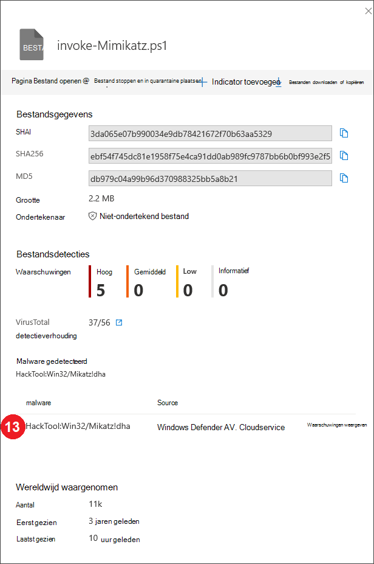
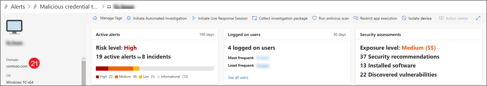
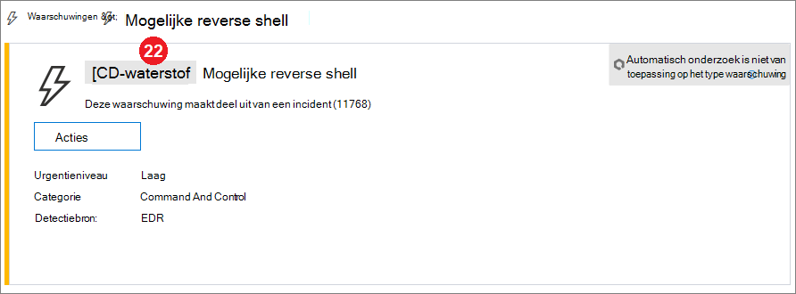

# API-velden van Microsoft Defender voor eindpuntdetectiesMicrosoft Defender for Endpoint detections API fields

[!INCLUDE [Microsoft 365 Defender rebranding](../../includes/microsoft-defender.md)]

**Van toepassing op:****Applies to:**
- [Microsoft Defender voor EindpuntMicrosoft Defender for Endpoint](https://go.microsoft.com/fwlink/p/?linkid=2154037)
- [Microsoft 365 DefenderMicrosoft 365 Defender](https://go.microsoft.com/fwlink/?linkid=2118804)

>Wilt u Defender voor Eindpunt ervaren?Want to experience Defender for Endpoint? [Meld u aan voor een gratis proefabonnement.Sign up for a free trial.](https://www.microsoft.com/microsoft-365/windows/microsoft-defender-atp?ocid=docs-wdatp-apiportalmapping-abovefoldlink)

Meer informatie over welke gegevensvelden worden weergegeven als onderdeel van de DETECTIE-API en hoe ze worden Microsoft Defender-beveiligingscentrum.Understand what data fields are exposed as part of the detections API and how they map to Microsoft Defender Security Center.

>[!Note]
>- [Defender for Endpoint Alert](alerts.md) is samengesteld uit een of meer detecties.[Defender for Endpoint Alert](alerts.md) is composed from one or more detections.
>- **Microsoft Defender ATP Detectie** is samengesteld uit de verdachte gebeurtenis die zich heeft voorgedaan op het apparaat en de bijbehorende **waarschuwingsgegevens.****Microsoft Defender ATP Detection** is composed from the suspicious event occurred on the Device and its related **Alert** details.
>- De Microsoft Defender for Endpoint Alert API is de nieuwste API voor waarschuwingsverbruik en bevat een gedetailleerde lijst met verwante gegevens voor elke waarschuwing.The Microsoft Defender for Endpoint Alert API is the latest API for alert consumption and contain a detailed list of related evidence for each alert. Zie Waarschuwingsmethoden en [-eigenschappen](alerts.md) en [Lijstwaarschuwingen](get-alerts.md)voor meer informatie.For more information, see [Alert methods and properties](alerts.md) and [List alerts](get-alerts.md).

## Detecties API-velden en portaltoewijzingDetections API fields and portal mapping
De volgende tabel bevat de beschikbare velden die worden blootgesteld aan de detecties van API-payload.The following table lists the available fields exposed in the detections API payload. Hier ziet u voorbeelden van de ingevulde waarden en een verwijzing naar de manier waarop gegevens worden weerspiegeld in de portal.It shows examples for the populated values and a reference on how data is reflected on the portal.

De kolom ArcSight-veld bevat de standaardtoewijzing tussen de velden Defender voor eindpunten en de ingebouwde velden in ArcSight.The ArcSight field column contains the default mapping between the Defender for Endpoint fields and the built-in fields in ArcSight. U kunt het toewijzingsbestand downloaden van de portal wanneer u de siem-integratiefunctie inschakelen en u kunt het aanpassen aan de behoeften van uw organisatie.You can download the mapping file from the portal when you enable the SIEM integration feature and you can modify it to match the  needs of your organization. Zie [SiEM-integratie inschakelen in Defender voor eindpunt](enable-siem-integration.md)voor meer informatie.For more information, see [Enable SIEM integration in Defender for Endpoint](enable-siem-integration.md).

Veldnummers komen overeen met de getallen in de onderstaande afbeeldingen.Field numbers match the numbers in the images below.

> [!div class="mx-tableFixed"]
> 
> | Portal-labelPortal   label   | SIEM-veldnaamSIEM field name           | ArcSight-veldArcSight field      | VoorbeeldwaardeExample value                                                                      | BeschrijvingDescription                                                                                                                                                                    |
> |------------------|---------------------------|---------------------|------------------------------------------------------------------------------------|--------------------------------------------------------------------------------------------------------------------------------------------------------------------------------|
> | 11                | WaarschuwingstitelAlertTitle                | naamname                | Microsoft Defender AV heeft malware met hoge ernst 'Mikatz' gedetecteerdMicrosoft Defender AV detected 'Mikatz' high-severity malware | Waarde die beschikbaar is voor elke detectie.Value available for every Detection.                                                                                                                                               |
> | 22                | ErnstSeverity                  | deviceSeveritydeviceSeverity      | HoogHigh                                                                             | Waarde die beschikbaar is voor elke detectie.Value available for every Detection.                                                                                                                                               |
> | 33                | CategorieCategory                  | deviceEventCategorydeviceEventCategory | MalwareMalware                                                               | Waarde die beschikbaar is voor elke detectie.Value available for every Detection.                                                                                                                                               |
> | 44                | DetectiebronDetection source                    | sourceServiceNamesourceServiceName   | AntivirusAntivirus                                                                 | Microsoft Defender Antivirus of Defender voor Eindpunt.Microsoft Defender Antivirus or  Defender for Endpoint. Waarde die beschikbaar is voor elke detectie.Value available for every Detection.                                                                                         |
> | 55                | MachineNameMachineName               | sourceHostNamesourceHostName      | desktop-4a5ngd6desktop-4a5ngd6                                                                           | Waarde die beschikbaar is voor elke detectie.Value available for every Detection.                                                                                                                                               |
> | 66                | BestandsnaamFileName                  | bestandsnaamfileName            | Robocopy.exeRobocopy.exe                                                                       | Beschikbaar voor detecties die zijn gekoppeld aan een bestand of proces.Available for detections associated   with a file or process.                                                                                                                      |
> | 77                | FilePathFilePath                  | filePathfilePath            | C:\Windows\System32\Robocopy.exeC:\Windows\System32\Robocopy.exe                                                   | Beschikbaar voor detecties die zijn gekoppeld aan een bestand of proces.Available for detections associated   with a file or process.                                                                                                                     |
> | 88                | UserDomainUserDomain                | sourceNtDomainsourceNtDomain      | CONTOSOCONTOSO                                                                            | Het domein van de gebruikerscontext waarin de activiteit wordt uitgevoerd, beschikbaar voor detecties op basis van gedrag van eindpunten van Defender voor eindpunten.The domain of the user context   running the activity, available for Defender for Endpoint behavioral based detections.                                                           |
> | 99                | GebruikersnaamUserName                  | sourceUserNamesourceUserName      | liz.beanliz.bean                                                                           | De context van de gebruiker die de activiteit uitwerkt, beschikbaar voor detecties op basis van gedrag van eindpunten van Defender.The user context running the   activity, available for Defender for Endpoint behavioral based detections.                                                                           |
> | 1010               | Sha1Sha1                      | fileHashfileHash            | 3da065e07b990034e9db7842167f70b63aa53293da065e07b990034e9db7842167f70b63aa5329                                           | Beschikbaar voor detecties die zijn gekoppeld aan een bestand of proces.Available for detections associated   with a file or process.                                                                                                                      |
> | 1111               | Sha256Sha256                    | deviceCustomString6deviceCustomString6 | ebf54f745dc81e1958f75e4ca91dd0ab989fc9787bb6b0bf993e2f5ebf54f745dc81e1958f75e4ca91dd0ab989fc9787bb6b0bf993e2f5                   | Beschikbaar voor AV-detecties van Microsoft Defender.Available for Microsoft Defender AV detections.                                                                                                                                    |
> | 1212               | Md5Md5                       | deviceCustomString5deviceCustomString5 | db979c04a99b96d370988325bb5a8b21db979c04a99b96d370988325bb5a8b21                                                   | Beschikbaar voor AV-detecties van Microsoft Defender.Available for Microsoft Defender AV detections.                                                                                                                                    |
> | 1313               | ThreatNameThreatName                | deviceCustomString1deviceCustomString1  | HackTool:Win32/Mikatz!dhaHackTool:Win32/Mikatz!dha                                                         | Beschikbaar voor AV-detecties van Microsoft Defender.Available for Microsoft Defender AV detections.                                                                                                                                    |
> | 1414               | IpAddressIpAddress                 | sourceAddresssourceAddress       | 218.90.204.141218.90.204.141                                                                     | Beschikbaar voor detecties die zijn gekoppeld aan netwerkgebeurtenissen.Available for detections associated   to network events. Bijvoorbeeld 'Communicatie naar een schadelijke netwerkbestemming'.For example, 'Communication to a malicious network   destination'.                                                        |
> | 1515               | UrlUrl                       | requestUrlrequestUrl          | down.esales360.cndown.esales360.cn                                                                  | Beschikbaar voor detecties die zijn gekoppeld aan netwerkgebeurtenissen.Available for detections associated to   network events. Bijvoorbeeld 'Communicatie naar een schadelijke netwerkbestemming'.For example, 'Communication to a malicious network   destination'.                                                         |
> | 1616               | HerstelIsSuccessRemediationIsSuccess      | deviceCustomNumber2deviceCustomNumber2 | WAARTRUE                                                                               | Beschikbaar voor AV-detecties van Microsoft Defender.Available for Microsoft Defender AV detections. ArcSight-waarde is 1 wanneer WAAR en 0 wanneer ONWAAR.ArcSight value is 1 when TRUE and 0 when FALSE.                                                                                    |
> | 1717               | WasExecutingWhileDetectedWasExecutingWhileDetected | deviceCustomNumber1deviceCustomNumber1 | ONWAARFALSE                                                                              | Beschikbaar voor AV-detecties van Microsoft Defender.Available for Microsoft Defender AV detections. ArcSight-waarde is 1 wanneer WAAR en 0 wanneer ONWAAR.ArcSight value is 1 when TRUE and 0 when FALSE.                                                                                    |
> | 1818               | AlertIdAlertId                   | externalIdexternalId          | 636210704265059241_673569822636210704265059241_673569822                                                       | Waarde die beschikbaar is voor elke detectie.Value available for every Detection.                                                                                                                                               |
> | 1919               | LinkToWDATPLinkToWDATP               | flexString1flexString1         | `https://securitycenter.windows.com/alert/636210704265059241_673569822`            | Waarde die beschikbaar is voor elke detectie.Value available for every Detection.                                                                                                                                               |
> | 2020               | AlertTimeAlertTime                 | deviceReceiptTimedeviceReceiptTime   | 2017-05-07T01:56:59.3191352Z2017-05-07T01:56:59.3191352Z                                                       | De tijd dat de gebeurtenis heeft plaatsgevonden.The time the event occurred. Waarde die beschikbaar is voor elke detectie.Value available for every Detection.                                                                                       |
> | 2121               | MachineDomainMachineDomain             | sourceDnsDomainsourceDnsDomain     | contoso.comcontoso.com                                                                        | Domeinnaam is niet relevant voor AAD-apparaten die lid zijn van AAD.Domain name not relevant for AAD   joined devices. Waarde die beschikbaar is voor elke detectie.Value available for every Detection.                                                                                           |
> | 2222               | ActorActor                     | deviceCustomString4deviceCustomString4 | BORONBORON                                                                                   | Beschikbaar voor waarschuwingen met betrekking tot een bekende actorgroep.Available for alerts related to a   known actor group.                                                                                                                         |
> | 21+521+5             | ComputerDnsNameComputerDnsName           | Geen toewijzingNo mapping          | liz-bean.contoso.comliz-bean.contoso.com                                                               | De volledig gekwalificeerde domeinnaam van het apparaat.The device fully qualified   domain name. Waarde die beschikbaar is voor elke detectie.Value available for every Detection.                                                                                                    |
> |                  | LogOnUsersLogOnUsers                | sourceUserIdsourceUserId        | contoso\liz-bean;   contoso\jay-hardeecontoso\liz-bean;   contoso\jay-hardee                                             | Het domein en de gebruiker van de interactieve aanmeldingsgebruiker/gebruikers op het moment van de gebeurtenis.The domain and user of the   interactive logon user/s at the time of the event. Opmerking: Voor apparaten op Windows 10 versie 1607 zijn de domeingegevens niet beschikbaar.Note: For devices on   Windows 10 version 1607, the domain information will not be available. |
> |                  | InternalIPv4ListInternalIPv4List          | Geen toewijzingNo mapping          | 192.168.1.7, 10.1.14.1192.168.1.7, 10.1.14.1                                                             | Lijst met interne IPV4-IPs voor actieve netwerkinterfaces.List of IPV4 internal IPs for active network interfaces.                                                                                                                                                                               |
> |                  | InternalIPv6ListInternalIPv6List          | Geen toewijzingNo mapping          | fd30:0000:0000:0001:ff4e:003e:0009:000e, FE80:CD00:0000:0CDE:1257:0000:211E:729Cfd30:0000:0000:0001:ff4e:003e:0009:000e,   FE80:CD00:0000:0CDE:1257:0000:211E:729C | Lijst met interne IPV6-IPs voor actieve netwerkinterfaces.List of IPV6 internal IPs for active network interfaces.                                                                                                                                                                               |
| | LinkToMTPLinkToMTP | Geen toewijzingNo mapping | `https://security.microsoft.com/alert/da637370718981685665_16349121` | Waarde die beschikbaar is voor elke detectie.Value available for every Detection.
| | IncidentLinkToMTPIncidentLinkToMTP | Geen toewijzingNo mapping | `"https://security.microsoft.com/incidents/byalert?alertId=da637370718981685665_16349121&source=SIEM` | Waarde die beschikbaar is voor elke detectie.Value available for every Detection.
| | IncidentLinkToWDATPIncidentLinkToWDATP | Geen toewijzingNo mapping | `https://securitycenter.windows.com/incidents/byalert?alertId=da637370718981685665_16349121&source=SIEM` | Waarde die beschikbaar is voor elke detectie.Value available for every Detection.
> | Intern veldInternal   field | LastProcessedTimeUtcLastProcessedTimeUtc      | Geen toewijzingNo mapping          | 2017-05-07T01:56:58.9936648Z2017-05-07T01:56:58.9936648Z                                                       | Tijd waarop de gebeurtenis bij de back-end is aangekomen.Time when event arrived at the   backend. Dit veld kan worden gebruikt bij het instellen van de aanvraagparameter voor het tijdsbereik dat detecties worden opgehaald.This field can be used when setting the request parameter for the range of time that detections are retrieved.                         |
> |                  | Geen onderdeel van het schemaNot part of the schema    | apparaatVendordeviceVendor        |                                                                                    | Statische waarde in de ArcSight-toewijzing - 'Microsoft'.Static value in the ArcSight   mapping - 'Microsoft'.                                                                                                                          |
> |                  | Geen onderdeel van het schemaNot part of the schema    | deviceProductdeviceProduct       |                                                                                    | Statische waarde in de ArcSight-toewijzing - 'Microsoft Defender ATP'.Static value in the ArcSight   mapping - 'Microsoft Defender ATP'.                                                                                                               |
> |                  | Geen onderdeel van het schemaNot part of the schema    | deviceVersiondeviceVersion       |                                                                                    | Statische waarde in de ArcSight-toewijzing - '2.0', die wordt gebruikt om de toewijzingsversies te identificeren.Static value in the ArcSight   mapping - '2.0', used to identify the mapping versions.                                                                                         

## Verwante onderwerpenRelated topics
- [SIEM-integratie inschakelen in Microsoft Defender voor EindpuntEnable SIEM integration in Microsoft Defender for Endpoint](enable-siem-integration.md)
- [ArcSight configureren om Microsoft Defender te gebruiken voor eindpuntdetectiesConfigure ArcSight to pull Microsoft Defender for Endpoint detections](configure-arcsight.md)
- [Microsoft Defender voor eindpuntdetecties trekken met REST APIPull Microsoft Defender for Endpoint detections using REST API](pull-alerts-using-rest-api.md)
- [Problemen met de integratie van SIEM-hulpprogramma's oplossenTroubleshoot SIEM tool integration issues](troubleshoot-siem.md)
