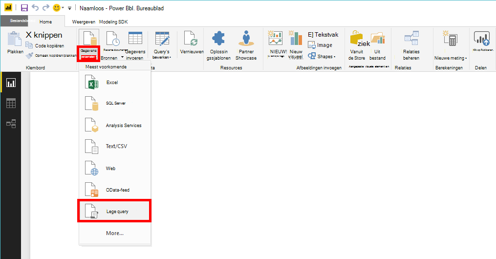
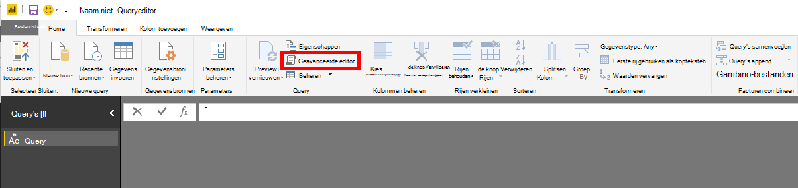
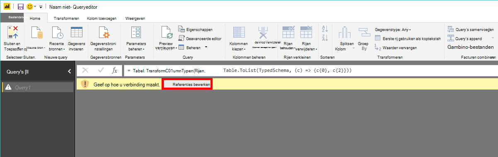
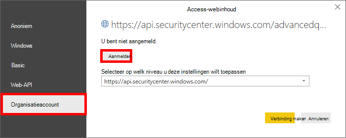
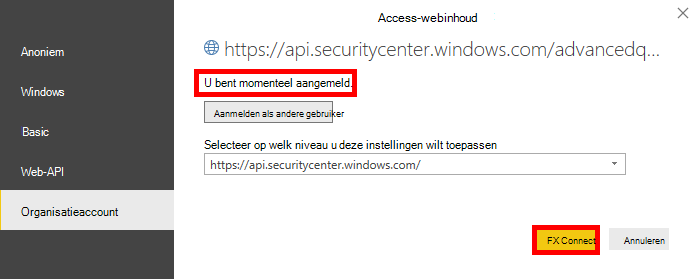

# <a name="create-custom-reports-using-power-bi"></a><span data-ttu-id="36a38-104">Aangepaste rapporten maken met Power BI</span><span class="sxs-lookup"><span data-stu-id="36a38-104">Create custom reports using Power BI</span></span>

[!INCLUDE [Microsoft 365 Defender rebranding](../../includes/microsoft-defender.md)]

<span data-ttu-id="36a38-105">**Van toepassing op:**</span><span class="sxs-lookup"><span data-stu-id="36a38-105">**Applies to:**</span></span>
- [<span data-ttu-id="36a38-106">Microsoft Defender voor Eindpunt</span><span class="sxs-lookup"><span data-stu-id="36a38-106">Microsoft Defender for Endpoint</span></span>](https://go.microsoft.com/fwlink/p/?linkid=2154037)
- [<span data-ttu-id="36a38-107">Microsoft 365 Defender</span><span class="sxs-lookup"><span data-stu-id="36a38-107">Microsoft 365 Defender</span></span>](https://go.microsoft.com/fwlink/?linkid=2118804)


- <span data-ttu-id="36a38-108">Wilt u Microsoft Defender voor Eindpunt ervaren?</span><span class="sxs-lookup"><span data-stu-id="36a38-108">Want to experience Microsoft Defender for Endpoint?</span></span> [<span data-ttu-id="36a38-109">Meld u aan voor een gratis proefversie.</span><span class="sxs-lookup"><span data-stu-id="36a38-109">Sign up for a free trial.</span></span>](https://www.microsoft.com/microsoft-365/windows/microsoft-defender-atp?ocid=docs-wdatp-exposedapis-abovefoldlink)

[!include[Microsoft Defender for Endpoint API URIs for US Government](../../includes/microsoft-defender-api-usgov.md)]

[!include[Improve request performance](../../includes/improve-request-performance.md)]

<span data-ttu-id="36a38-110">In deze sectie leert u een rapport Power BI maken boven op API's van Defender voor eindpunten.</span><span class="sxs-lookup"><span data-stu-id="36a38-110">In this section you will learn create a Power BI report on top of Defender for Endpoint APIs.</span></span>

<span data-ttu-id="36a38-111">In het eerste voorbeeld wordt gedemonstreerd hoe u verbinding maakt Power BI Advanced Hunting API en in het tweede voorbeeld wordt een verbinding met onze OData-API's gedemonstreerd, zoals MachineActies of Waarschuwingen.</span><span class="sxs-lookup"><span data-stu-id="36a38-111">The first example demonstrates how to connect Power BI to Advanced Hunting API and the second example demonstrates a connection to our OData APIs, such as Machine Actions or Alerts.</span></span>

## <a name="connect-power-bi-to-advanced-hunting-api"></a><span data-ttu-id="36a38-112">Verbinding maken Power BI naar Advanced Hunting API</span><span class="sxs-lookup"><span data-stu-id="36a38-112">Connect Power BI to Advanced Hunting API</span></span>

- <span data-ttu-id="36a38-113">Microsoft-Power BI</span><span class="sxs-lookup"><span data-stu-id="36a38-113">Open Microsoft Power BI</span></span>

- <span data-ttu-id="36a38-114">Klik **op Lege**  >  **gegevensquery opvragen**</span><span class="sxs-lookup"><span data-stu-id="36a38-114">Click **Get Data** > **Blank Query**</span></span>

  

- <span data-ttu-id="36a38-116">Klik **op Geavanceerde editor**</span><span class="sxs-lookup"><span data-stu-id="36a38-116">Click **Advanced Editor**</span></span>

  

- <span data-ttu-id="36a38-118">Kopieer het onderstaande en plak deze in de editor:</span><span class="sxs-lookup"><span data-stu-id="36a38-118">Copy the below and paste it in the editor:</span></span>

```
    let
        AdvancedHuntingQuery = "DeviceEvents | where ActionType contains 'Anti' | limit 20",

        HuntingUrl = "https://api.securitycenter.microsoft.com/api/advancedqueries",

        Response = Json.Document(Web.Contents(HuntingUrl, [Query=[key=AdvancedHuntingQuery]])),

        TypeMap = #table(
            { "Type", "PowerBiType" },
            {
                { "Double",   Double.Type },
                { "Int64",    Int64.Type },
                { "Int32",    Int32.Type },
                { "Int16",    Int16.Type },
                { "UInt64",   Number.Type },
                { "UInt32",   Number.Type },
                { "UInt16",   Number.Type },
                { "Byte",     Byte.Type },
                { "Single",   Single.Type },
                { "Decimal",  Decimal.Type },
                { "TimeSpan", Duration.Type },
                { "DateTime", DateTimeZone.Type },
                { "String",   Text.Type },
                { "Boolean",  Logical.Type },
                { "SByte",    Logical.Type },
                { "Guid",     Text.Type }
            }),

        Schema = Table.FromRecords(Response[Schema]),
        TypedSchema = Table.Join(Table.SelectColumns(Schema, {"Name", "Type"}), {"Type"}, TypeMap , {"Type"}),
        Results = Response[Results],
        Rows = Table.FromRecords(Results, Schema[Name]),
        Table = Table.TransformColumnTypes(Rows, Table.ToList(TypedSchema, (c) => {c{0}, c{2}}))

    in Table
```

- <span data-ttu-id="36a38-119">Klik **op Klaar**</span><span class="sxs-lookup"><span data-stu-id="36a38-119">Click **Done**</span></span>

- <span data-ttu-id="36a38-120">Klik **op Referenties bewerken**</span><span class="sxs-lookup"><span data-stu-id="36a38-120">Click **Edit Credentials**</span></span>

    

- <span data-ttu-id="36a38-122">Organisatieaccount **selecteren**  >  **Aanmelden**</span><span class="sxs-lookup"><span data-stu-id="36a38-122">Select **Organizational account** > **Sign in**</span></span>

    

- <span data-ttu-id="36a38-124">Voer uw referenties in en wacht totdat u bent aangemeld</span><span class="sxs-lookup"><span data-stu-id="36a38-124">Enter your credentials and wait to be signed in</span></span>

- <span data-ttu-id="36a38-125">Klik **Verbinding maken**</span><span class="sxs-lookup"><span data-stu-id="36a38-125">Click **Connect**</span></span>

    

- <span data-ttu-id="36a38-127">De resultaten van de query worden nu weergegeven als tabel en u kunt er visualisaties op maken.</span><span class="sxs-lookup"><span data-stu-id="36a38-127">Now the results of your query will appear as table and you can start build visualizations on top of it!</span></span>

- <span data-ttu-id="36a38-128">U kunt deze tabel dupliceren, de naam ervan wijzigen en de query Geavanceerd zoeken binnen bewerken om eventuele gegevens op te halen.</span><span class="sxs-lookup"><span data-stu-id="36a38-128">You can duplicate this table, rename it and edit the Advanced Hunting query inside to get any data you would like.</span></span>

## <a name="connect-power-bi-to-odata-apis"></a><span data-ttu-id="36a38-129">Verbinding maken Power BI naar OData-API's</span><span class="sxs-lookup"><span data-stu-id="36a38-129">Connect Power BI to OData APIs</span></span>

- <span data-ttu-id="36a38-130">Het enige verschil met het bovenstaande voorbeeld is de query in de editor.</span><span class="sxs-lookup"><span data-stu-id="36a38-130">The only difference from the above example is the query inside the editor.</span></span>

- <span data-ttu-id="36a38-131">Kopieer het onderstaande en plak deze in de editor om alle **machineacties uit** uw organisatie te halen:</span><span class="sxs-lookup"><span data-stu-id="36a38-131">Copy the below and paste it in the editor to pull all **Machine Actions** from your organization:</span></span>

```
    let

        Query = "MachineActions",

        Source = OData.Feed("https://api.securitycenter.microsoft.com/api/" & Query, null, [Implementation="2.0", MoreColumns=true])
    in
        Source
```

- <span data-ttu-id="36a38-132">U kunt hetzelfde doen voor **waarschuwingen** en **machines.**</span><span class="sxs-lookup"><span data-stu-id="36a38-132">You can do the same for **Alerts** and **Machines**.</span></span>
- <span data-ttu-id="36a38-133">U kunt OData-query's ook gebruiken voor queryfilters, zie [OData-query's gebruiken](exposed-apis-odata-samples.md)</span><span class="sxs-lookup"><span data-stu-id="36a38-133">You also can use OData queries for queries filters, see [Using OData Queries](exposed-apis-odata-samples.md)</span></span>

## <a name="power-bi-dashboard-samples-in-github"></a><span data-ttu-id="36a38-134">Power BI dashboardvoorbeelden in GitHub</span><span class="sxs-lookup"><span data-stu-id="36a38-134">Power BI dashboard samples in GitHub</span></span>

<span data-ttu-id="36a38-135">Zie de sjablonen voor [Power BI rapport voor meer informatie.](https://github.com/microsoft/MicrosoftDefenderATP-PowerBI)</span><span class="sxs-lookup"><span data-stu-id="36a38-135">For more information see the [Power BI report templates](https://github.com/microsoft/MicrosoftDefenderATP-PowerBI).</span></span>

## <a name="sample-reports"></a><span data-ttu-id="36a38-136">Voorbeeldrapporten</span><span class="sxs-lookup"><span data-stu-id="36a38-136">Sample reports</span></span>

<span data-ttu-id="36a38-137">Bekijk de voorbeelden van microsoft Defender voor eindpunten Power BI rapport.</span><span class="sxs-lookup"><span data-stu-id="36a38-137">View the Microsoft Defender for Endpoint Power BI report samples.</span></span> <span data-ttu-id="36a38-138">Zie Door codevoorbeelden bladeren voor [meer informatie.](/samples/browse/?products=mdatp)</span><span class="sxs-lookup"><span data-stu-id="36a38-138">For more information, see [Browse code samples](/samples/browse/?products=mdatp).</span></span>

## <a name="related-topics"></a><span data-ttu-id="36a38-139">Gerelateerde onderwerpen</span><span class="sxs-lookup"><span data-stu-id="36a38-139">Related topics</span></span>

- [<span data-ttu-id="36a38-140">Defender voor eindpunt-API's</span><span class="sxs-lookup"><span data-stu-id="36a38-140">Defender for Endpoint APIs</span></span>](apis-intro.md)
- [<span data-ttu-id="36a38-141">API voor geavanceerde opsporing</span><span class="sxs-lookup"><span data-stu-id="36a38-141">Advanced Hunting API</span></span>](run-advanced-query-api.md)
- [<span data-ttu-id="36a38-142">OData-query's gebruiken</span><span class="sxs-lookup"><span data-stu-id="36a38-142">Using OData Queries</span></span>](exposed-apis-odata-samples.md)
