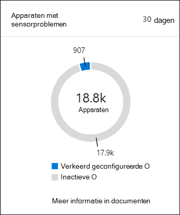
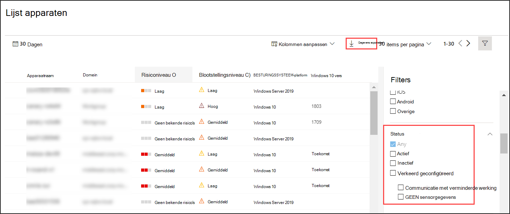

# Status van sensor controleren in Microsoft Defender voor eindpunt

[!INCLUDE [Microsoft 365 Defender rebranding](../../includes/microsoft-defender.md)]

**Van toepassing op:**
- [Microsoft Defender voor Endpoint](https://go.microsoft.com/fwlink/p/?linkid=2154037)
- [Microsoft 365 Defender](https://go.microsoft.com/fwlink/?linkid=2118804)

>Wilt u Defender voor Eindpunt ervaren? [Meld u aan voor een gratis proefabonnement.](https://www.microsoft.com/microsoft-365/windows/microsoft-defender-atp?ocid=docs-wdatp-checksensor-abovefoldlink)

De **tegel Apparaten met sensorproblemen** vindt u op het dashboard Beveiligingsbewerkingen. Deze tegel bevat informatie over de mogelijkheid van het afzonderlijke apparaat om sensorgegevens te verstrekken en te communiceren met de Defender for Endpoint-service. Het rapport geeft aan hoeveel apparaten aandacht nodig hebben en helpt u problematische apparaten te identificeren en actie te ondernemen om bekende problemen op te lossen.

Er zijn twee statusindicatoren op de tegel die informatie bevatten over het aantal apparaten dat niet correct rapporteert aan de service:
- **Verkeerd geconfigureerd:** deze apparaten kunnen gedeeltelijk sensorgegevens rapporteren aan de Defender voor Eindpunt-service en kunnen configuratiefouten hebben die moeten worden gecorrigeerd.
- **Inactief:** apparaten die de afgelopen maand meer dan zeven dagen zijn gestopt met rapporteren aan de Defender voor Eindpunt-service.

Als u op een van de groepen klikt, gaat u naar de lijst **Apparaten,** gefilterd op basis van uw keuze.

In **de lijst Apparaten** kunt u de lijst met statusstatussen filteren op de volgende status:
- **Actief:** apparaten die actief rapporteren aan de Defender for Endpoint-service.
- **Verkeerd geconfigureerd:** deze apparaten kunnen gedeeltelijk sensorgegevens rapporteren aan de Service Defender voor eindpunt, maar er zijn configuratiefouten die moeten worden gecorrigeerd. Verkeerd geconfigureerde apparaten kunnen een of een combinatie van de volgende problemen hebben:
  - **Geen sensorgegevens:** apparaten zijn gestopt met het verzenden van sensorgegevens. Beperkte waarschuwingen kunnen worden geactiveerd vanaf het apparaat.
  - **Communicatie met een beperking:** de mogelijkheid om te communiceren met een apparaat is beperkt. Het verzenden van bestanden voor uitgebreide analyse, het blokkeren van bestanden, het isoleren van apparaten van het netwerk en andere acties waarvoor communicatie met het apparaat is vereist, werkt mogelijk niet.
- **Inactief:** apparaten die niet meer rapporteren aan de Defender voor Endpoint-service.

U kunt ook de hele lijst in CSV-indeling downloaden met de **functie** Exporteren. Zie De lijst Apparaten weergeven en ordenen voor meer informatie over [filters.](machines-view-overview.md)

>[!NOTE]
>Exporteert de lijst in CSV-indeling om de ongefilterde gegevens weer te geven. Het CSV-bestand bevat alle apparaten in de organisatie, ongeacht de filtering die wordt toegepast in de weergave zelf en kan een aanzienlijke hoeveelheid tijd kosten om te downloaden, afhankelijk van hoe groot uw organisatie is.

U kunt de apparaatgegevens bekijken wanneer u op een verkeerd geconfigureerd of inactief apparaat klikt.

## Gerelateerd onderwerp
- [Ongezonde sensoren in Defender voor eindpunt oplossen](fix-unhealthy-sensors.md)
