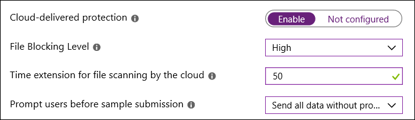

# Blokkeren op het eerste gezicht inschakelen

[!INCLUDE [Microsoft 365 Defender rebranding](../../includes/microsoft-defender.md)]

**Van toepassing op:**

- [Microsoft Defender voor Eindpunt](/microsoft-365/security/defender-endpoint/)

Blokkeren op het eerste gezicht biedt een manier om nieuwe malware binnen enkele seconden te detecteren en te blokkeren. Deze beveiliging is standaard ingeschakeld wanneer bepaalde vereisteninstellingen zijn ingeschakeld. Deze instellingen omvatten beveiliging in de cloud, een opgegeven voorbeeldinzendings time-out (zoals 50 seconden) en een hoog bestandsblokkeringsniveau. In de meeste bedrijfsorganisaties zijn deze instellingen standaard ingeschakeld met Microsoft Defender Antivirus-implementaties. 

U kunt [opgeven hoelang een bestand niet mag](configure-cloud-block-timeout-period-microsoft-defender-antivirus.md) worden uitgevoerd terwijl het bestand wordt geanalyseerd door de beveiligingsservice in de cloud. En u kunt het bericht aanpassen dat op de [bureaubladen](/windows/security/threat-protection//windows-defender-security-center/wdsc-customize-contact-information.md) van gebruikers wordt weergegeven wanneer een bestand wordt geblokkeerd. U kunt de bedrijfsnaam, contactgegevens en bericht-URL wijzigen.

>[!TIP]
>Ga naar de demowebsite van  Microsoft Defender voor Eindpunt demo.wd.microsoft.com om te bevestigen dat de functies werken en te zien hoe ze werken.

## Hoe het werkt

Wanneer Microsoft Defender Antivirus een verdacht, maar niet-gedetecteerd bestand tegenkomt, wordt de back-over van onze cloudbeveiliging opgevraagd. Met de cloudbackend worden heuristiek, machine learning en geautomatiseerde analyse van het bestand toegepast om te bepalen of de bestanden schadelijk zijn of niet.

Microsoft Defender Antivirus gebruikt meerdere detectie- en preventietechnologieën om nauwkeurige, intelligente en realtime beveiliging te bieden. Zie deze blog voor meer informatie: Maak kennis met de geavanceerde technologieën die centraal staan in de volgende generatie beveiliging van Microsoft Defender voor [Endpoint.](https://www.microsoft.com/security/blog/2019/06/24/inside-out-get-to-know-the-advanced-technologies-at-the-core-of-microsoft-defender-atp-next-generation-protection/)
  

In Windows 10, versie 1803 of hoger, kan blokkering op het eerste gezicht niet-draagbare uitvoerbare bestanden (zoals JS, VBS of macro's) en uitvoerbare bestanden blokkeren.

Blokkeren gebruikt op het eerste gezicht alleen de back-mail voor cloudbeveiliging voor uitvoerbare bestanden en niet-draagbare uitvoerbare bestanden die van internet worden gedownload of die afkomstig zijn uit de internetzone. Een hashwaarde van het EXE-bestand wordt gecontroleerd via de back-mail van de cloud om te bepalen of het bestand een eerder niet-gedetecteerd bestand is.

Als de cloudback-up geen bepaling kan maken, wordt het bestand vergrendeld door Microsoft Defender Antivirus en wordt een kopie naar de cloud geüpload. De cloud voert extra analyses uit om tot een bepaling te komen voordat het bestand kan worden uitgevoerd of blokkeert in alle toekomstige ontmoetingen, afhankelijk van of het bestand schadelijk of veilig is.

In veel gevallen kan dit proces de reactietijd voor nieuwe malware beperken van uren tot seconden.

## Blok op het eerste gezicht in- en uit- zetten met Microsoft Intune

> [!TIP]
> Microsoft Intune maakt nu deel uit van Microsoft Endpoint Manager.

1. Navigeer in het Microsoft Endpoint Manager-beheercentrum [https://endpoint.microsoft.com](https://endpoint.microsoft.com) () naar   >  **Apparatenconfiguratieprofielen.**

2. Selecteer of maak een profiel met het **profieltype Apparaatbeperkingen.**

3. Stel in **de configuratie-instellingen** voor het apparaatbeperkingenprofiel de volgende instellingen in of bevestig deze onder **Microsoft Defender Antivirus:**

   - **Beveiliging in de cloud:** ingeschakeld
   - **Bestandsblokkeringsniveau:** hoog
   - **Tijdsextensie voor het scannen van bestanden door de cloud:** 50
   - **Gebruikers vragen vóór voorbeeldinzending:** Alle gegevens verzenden zonder dat u daarom wordt gevraagd

   

4. Sla uw instellingen op.

> [!TIP]
> - Als u het blokkeringsniveau voor bestanden **instelt op Hoog,** wordt een sterk detectieniveau toegepast. In het onwaarschijnlijke geval dat bestandsblokkering een fout-positieve detectie van legitieme bestanden veroorzaakt, kunt u [in quarantaine geplaatste](./restore-quarantined-files-microsoft-defender-antivirus.md)bestanden herstellen.
> - Zie Apparaatbeperkingen configureren in Microsoft Intune voor meer informatie over het configureren van beperkingen voor Microsoft Defender [Antivirus-apparaten in Intune.](/intune/device-restrictions-configure)
> - Zie Apparaatbeperkingen voor [Windows 10 (en nieuwere) instellingen in Intune](/intune/device-restrictions-windows-10#microsoft-defender-antivirus)voor een lijst met beperkingen voor Microsoft Defender Antivirus-apparaten in Intune.

## Blok op het eerste gezicht in- en uit- zetten met Microsoft Endpoint Manager

> [!TIP]
> Als u op zoek bent naar Microsoft Endpoint Configuration Manager, is het nu onderdeel van Microsoft Endpoint Manager.

1. Ga in Microsoft Endpoint Manager ( [https://endpoint.microsoft.com](https://endpoint.microsoft.com) ) naar **Endpoint security**  >  **Antivirus**.

2. Selecteer een bestaand beleid of maak een nieuw beleid met het **profieltype Microsoft Defender Antivirus.**

3. Stel de volgende configuratie-instellingen in of bevestig deze:

   - **Beveiliging in de cloud in- en uit-** zetten: Ja
   - **Beveiligingsniveau in de cloud:** hoog
   - **Defender Cloud Extended Timeout in Seconds**: 50

   :::image type="content" source="images/endpointmgr-antivirus-cloudprotection.png" alt-text="Instellingen blokkeren op het eerste gezicht in Endpoint Manager":::

4. Het Microsoft Defender Antivirus-profiel toepassen op een groep, zoals **Alle gebruikers,** **Alle apparaten** of Alle gebruikers **en apparaten.**

## Blok op het eerste gezicht in- en uit- zetten met Groepsbeleid

> [!NOTE]
> Het is raadzaam Intune of Microsoft Endpoint Manager te gebruiken om blok op het eerste gezicht in te zetten. 

1. Open op de computer groepsbeleidsbeheer de console Groepsbeleidsbeheer, klik met de rechtermuisknop op het groepsbeleidsobject dat u wilt configureren en selecteer **Bewerken.** ) 

2. Ga met **de Editor voor groepsbeleidsbeheer** naar **Beheersjablonen voor**  >    >  **computerconfiguratie Windows Components** Microsoft Defender  >  **Antivirus**  >  **MAPS**. 

3. Dubbelklik in de sectie KAARTEN op De functie **Blokkeren** op het eerste gezicht configureren en stel deze in op **Ingeschakeld** en selecteer **OK.**

    > [!IMPORTANT]
    > Als u **de instelling Altijd vragen (0) instelt,** wordt de beveiligingstoestand van het apparaat lager. Instelling voor **Nooit verzenden (2)** betekent dat blok op het eerste gezicht niet werkt.

4. Dubbelklik in de sectie KAARTEN op Bestandsvoorbeelden verzenden wanneer verdere analyse **is** vereist en stel deze in op **Ingeschakeld.** Selecteer **onder Bestandsvoorbeelden verzenden wanneer verdere analyse is vereist** de optie Alle **steekproeven verzenden** en klik vervolgens op **OK.**

5. Als u instellingen hebt gewijzigd, kunt u het groepsbeleidsobject opnieuw in uw netwerk herschikken om ervoor te zorgen dat alle eindpunten worden gedekt.

## Blok op het eerste gezicht bevestigen is ingeschakeld voor afzonderlijke clients

U kunt bevestigen dat blok op het eerste gezicht is ingeschakeld voor afzonderlijke clients met windows-beveiligingsinstellingen.

Blok op het eerste gezicht wordt automatisch ingeschakeld, zolang beveiliging in de **cloud** en Automatische **voorbeeldinzending** beide zijn ingeschakeld.

1. Open de Windows Security-app.

2. Selecteer **Virusbeveiliging & bedreiging** en selecteer vervolgens onder **Virusbeveiliging**& instellingen voor bedreigingsbeveiliging de optie **Instellingen beheren.**

   

3. Controleer of **beveiliging in de cloud en** Automatische **voorbeeldinzending** beide zijn ingeschakeld.

> [!NOTE]
> - Als de vereiste instellingen zijn geconfigureerd en geïmplementeerd met groepsbeleid, zijn de instellingen die in deze sectie worden beschreven grijs en niet beschikbaar voor gebruik op afzonderlijke eindpunten. 
> - Wijzigingen die zijn aangebracht via een groepsbeleidsobject, moeten eerst worden geïmplementeerd op afzonderlijke eindpunten voordat de instelling wordt bijgewerkt in Windows-instellingen.

## Blok op het eerste gezicht valideren werkt

Als u wilt controleren of de functie werkt, volgt u de richtlijnen in Verbindingen tussen uw netwerk en [de cloud valideren.](configure-network-connections-microsoft-defender-antivirus.md#validate-connections-between-your-network-and-the-cloud)

## Blok op het eerste gezicht uitschakelen

> [!CAUTION]
> Als u blokkering op het eerste gezicht uit schakelen, wordt de beveiligingstoestand van uw apparaat(en) en uw netwerk lager.

U kunt blokkering op het eerste gezicht uitschakelen als u de vereiste instellingen wilt behouden zonder blokkering op het eerste gezicht te gebruiken. U kunt blokkering op het eerste gezicht tijdelijk uitschakelen als u latentieproblemen ondervindt of als u de invloed van de functie op uw netwerk wilt testen. Het is echter niet raadzaam om blokkering op het eerste gezicht permanent uit te uitschakelen.

### Blok op het eerste gezicht uitschakelen met Microsoft Endpoint Manager

1. Ga naar het Microsoft Endpoint Manager-beheercentrum [https://endpoint.microsoft.com](https://endpoint.microsoft.com) () en meld u aan.

2. Ga naar **Endpoint Security**  >  **Antivirus** en selecteer vervolgens uw Microsoft Defender Antivirusbeleid.

3. Kies **onder** Beheren de optie **Eigenschappen.**

4. Kies naast **Configuratie-instellingen** de optie **Bewerken.**

5. Een of meer van de volgende instellingen wijzigen:

   - Stel **Beveiliging in de cloud in op** **Nee** of **Niet geconfigureerd.**
   - Stel **beveiligingsniveau in de cloud in** op Niet **geconfigureerd.**
   - Het vak **Verlengde time-out** defender cloud in seconden uit.

6. Controleer uw instellingen en sla deze op.

### Blok op het eerste gezicht uitschakelen met Groepsbeleid

1. Open op de computer groepsbeleidsbeheer de console Groepsbeleidsbeheer, klik met de rechtermuisknop op het groepsbeleidsobject dat u wilt configureren en klik vervolgens op **Bewerken.** )

2. Ga met **de Editor voor groepsbeleidsbeheer** naar **Computerconfiguratie** en klik op **Beheersjablonen.**

3. Vouw de boom uit via **Windows-onderdelen**  >  **Microsoft Defender Antivirus**  >  **MAPS.**

4. Dubbelklik op **De functie 'Blokkeren op het eerste gezicht' configureren** en stel de optie in op **Uitgeschakeld.**

    > [!NOTE]
    > Door blokkering op het eerste gezicht uit te schakelen, wordt het vereiste groepsbeleid niet uitgeschakeld of gewijzigd.

## Zie ook

- [Microsoft Defender Antivirus in Windows 10](microsoft-defender-antivirus-in-windows-10.md)

- [Beveiliging via de cloud inschakelen](enable-cloud-protection-microsoft-defender-antivirus.md)