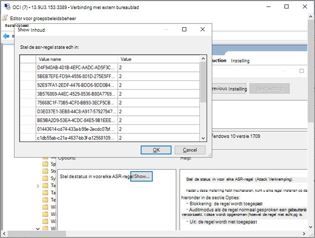

# Onboard Windows 10 apparaten met groepsbeleid 

[!INCLUDE [Microsoft 365 Defender rebranding](../../includes/microsoft-defender.md)]

**Van toepassing op:**

- Groepsbeleid
- [Microsoft Defender voor Eindpunt](https://go.microsoft.com/fwlink/p/?linkid=2154037)
- [Microsoft 365 Defender](https://go.microsoft.com/fwlink/?linkid=2118804)

>Wilt u Defender voor Eindpunt ervaren? [Meld u aan voor een gratis proefversie.](https://www.microsoft.com/microsoft-365/windows/microsoft-defender-atp?ocid=docs-wdatp-configureendpointsgp-abovefoldlink)

> [!NOTE]
> Als u gp-updates (Group Policy) wilt gebruiken om het pakket te implementeren, moet u zich Windows Server 2008 R2 of hoger.
>
> Voor Windows Server 2019 moet u mogelijk NT AUTHORITY\Well-Known-System-Account vervangen door NT AUTHORITY\SYSTEM van het XML-bestand dat door de groepsbeleidsvoorkeur wordt gemaakt.

## Onboarden apparaten met Groepsbeleid

Bekijk het [PDF-bestand](https://github.com/MicrosoftDocs/microsoft-365-docs/raw/public/microsoft-365/security/defender-endpoint/downloads/mdatp-deployment-strategy.pdf) of [Visio](https://github.com/MicrosoftDocs/microsoft-365-docs/raw/public/microsoft-365/security/defender-endpoint/downloads/mdatp-deployment-strategy.vsdx) om de verschillende paden te bekijken bij de implementatie van Defender voor Eindpunt.

1. Open het GP-configuratiepakket .zip bestand *(WindowsDefenderATPOnboardingPackage.zip)* dat u hebt gedownload van de wizard Service onboarding. U kunt het pakket ook van [Microsoft Defender-beveiligingscentrum:](https://securitycenter.windows.com/)

    1. Selecteer in het navigatiedeelvenster **Instellingen**  >  **Onboarding.**

    1. Selecteer Windows 10 als het besturingssysteem.

    1. Selecteer groepsbeleid in **het veld** **Implementatiemethode.**

    1. Klik **op Pakket downloaden** en sla het .zip op.

2. Haal de inhoud van het .zip naar een gedeelde, alleen-lezen locatie die toegankelijk is voor het apparaat. U moet een map met de naam *OptionalParamsPolicy en* het bestand *WindowsDefenderATPOnboardingScript.cmd hebben.*

3. Open de GPMC (Group [Policy Management Console),](/internet-explorer/ie11-deploy-guide/group-policy-and-group-policy-mgmt-console-ie11) klik met de rechtermuisknop op het groepsbeleidsobject dat u wilt configureren en klik op **Bewerken.**

4. Ga in **de Editor voor groepsbeleidsbeheer** naar **Computerconfiguratie,** vervolgens **Voorkeuren** en vervolgens **naar Configuratiescherminstellingen.**

5. Klik met de rechtermuisknop **op Geplande taken,** wijs **Nieuw** aan en klik vervolgens op Onmiddellijke **taak (ten minste Windows 7).**

6. Ga in **het** venster Taak dat wordt geopend naar het **tabblad** Algemeen. Klik **onder Beveiligingsopties** **op Gebruiker of Groep wijzigen** en typ SYSTEEM en klik vervolgens op Namen **controleren** en vervolgens **OP OK.** NT AUTHORITY\SYSTEM wordt weergegeven als het gebruikersaccount dat de taak als wordt uitgevoerd.

7. Schakel **Uitvoeren in of de gebruiker al** dan niet is aangemeld en schakel het selectievakje Uitvoeren met hoogste **bevoegdheden** in.

8. Ga naar het **tabblad Acties** en klik op **Nieuw...** Zorg ervoor **dat Een programma starten** is geselecteerd in het **veld** Actie. Voer de bestandsnaam en locatie in van het gedeelde *WindowsDefenderATPOnboardingScript.cmd-bestand.*

9. Klik **op OK** en sluit alle geopende GPMC-vensters.

> [!TIP]
> Nadat u het apparaat hebt onboarding, kunt u ervoor kiezen om een detectietest uit te voeren om te controleren of het apparaat correct is aan boord van de service. Zie Een detectietest uitvoeren op een nieuw ingebouwde [Defender voor eindpuntapparaat](run-detection-test.md)voor meer informatie.

## Aanvullende instellingen voor configuratie van Defender voor eindpunten
Voor elk apparaat kunt u bepalen of er steekproeven kunnen worden verzameld vanaf het apparaat wanneer er een verzoek wordt ingediend via Microsoft Defender-beveiligingscentrum om een bestand in te dienen voor uitgebreide analyse.

U kunt Groepsbeleid (GP) gebruiken om instellingen te configureren, zoals instellingen voor het delen van voorbeelden die worden gebruikt in de functie voor uitgebreide analyse.

### Voorbeeldverzamelingsinstellingen configureren

1. Kopieer op uw GP-beheerapparaat de volgende bestanden uit het configuratiepakket:

    - _AtpConfiguration.admx kopiëren_ naar _C: \\ Windows \\ PolicyDefinitions_

    - _AtpConfiguration.adml kopiëren_ naar _C: \\ Windows \\ PolicyDefinitions \\ en-US_

    Als u een Centraal Archief voor beheersjablonen voor [groepsbeleid](https://support.microsoft.com/help/3087759/how-to-create-and-manage-the-central-store-for-group-policy-administra)gebruikt, kopieert u de volgende bestanden uit het configuratiepakket:

    - _AtpConfiguration.admx kopiëren_ naar _\\ \\ \<forest.root\> \\ Beleidsregels voor SysVolDefinitions \\ \<forest.root\> \\ \\_

    - _AtpConfiguration.adml kopiëren_ naar _\\ \\ \<forest.root\> \\ SysVol \\ \<forest.root\> \\ Policies \\ PolicyDefinitions \\ en-US_

2. Open de [console Groepsbeleidsbeheer,](/internet-explorer/ie11-deploy-guide/group-policy-and-group-policy-mgmt-console-ie11)klik met de rechtermuisknop op het GPO dat u wilt configureren en klik op **Bewerken.**

3. Ga in **de Editor voor groepsbeleidsbeheer** naar **Computerconfiguratie.**

4. Klik **op Beleid** en vervolgens op **Beheersjablonen.**

5. Klik **Windows onderdelen en** klik Windows Defender **SmartScreen.**

6. Kies om voorbeeld delen in of uit te schakelen vanaf uw apparaten.

> [!NOTE]
> Als u geen waarde in stelt, is de standaardwaarde het inschakelen van voorbeeldverzameling.

## Andere aanbevolen configuratie-instellingen

### Configuratie van eindpuntbeveiliging bijwerken

Nadat u het onboarding-script heeft geconfigureerd, kunt u hetzelfde groepsbeleid blijven bewerken om configuraties voor eindpuntbeveiliging toe te voegen. Voer groepsbeleidsbewerkingen uit vanaf een systeem met Windows 10 of Server 2019 om ervoor te zorgen dat u alle vereiste Microsoft Defender Antivirus hebt. Mogelijk moet u het groepsbeleidsobject sluiten en opnieuw openen om de atp-configuratie-instellingen van Defender te registreren.

Alle beleidsregels bevinden zich onder `Computer Configuration\Policies\Administrative Templates` .

**Beleidslocatie:** \Windows Onderdelen\Windows Defender ATP

Beleid | Instelling
:---|:---
Inschakelen\Voorbeeldverzameling uitschakelen| Ingeschakeld - 'Voorbeeldverzameling op machines inschakelen' ingeschakeld

 

**Beleidslocatie:** \Windows Onderdelen\Microsoft Defender Antivirus

Beleid | Instelling
:---|:---
Detectie configureren voor potentieel ongewenste toepassingen | Ingeschakeld, Blokkeren

 

**Beleidslocatie:** \Windows Components\Microsoft Defender Antivirus\MAPS

Beleid | Instelling
:---|:---
Deelnemen aan Microsoft MAPS | Ingeschakelde, geavanceerde KAARTEN
Bestandsvoorbeelden verzenden wanneer verdere analyse is vereist | Ingeschakeld: Veilige steekproeven verzenden

 

**Beleidslocatie:** \Windows Components\Microsoft Defender Antivirus\Real-time Protection

Beleid | Instelling
:---|:---
Realtime beveiliging uitschakelen|Uitgeschakeld
Gedragscontrole in- en uit-|Ingeschakeld
Alle gedownloade bestanden en bijlagen scannen|Ingeschakeld
Bestands- en programmaactiviteit op uw computer controleren|Ingeschakeld

 

**Beleidslocatie:** \Windows Components\Microsoft Defender Antivirus\Scan

Deze instellingen configureren periodieke scans van het eindpunt. We raden u aan om een wekelijkse quick scan uit te voeren, waardoor de prestaties worden toegestaan.

Beleid | Instelling 
:---|:---
Controleer op de meest recente beveiligingsinformatie over virussen en spyware voordat u een geplande scan gaat uitvoeren |Ingeschakeld

 

**Beleidslocatie:** \Windows Components\Microsoft Defender Antivirus\Microsoft Defender Exploit Guard\Attack Surface Reduction

De huidige lijst met GUID's voor het verlagen van het aanvalsoppervlak op de markt krijgen via De regels voor het verlagen van [de surface aanpassen](customize-attack-surface-reduction.md)

1. Open het **beleid Voor het configureren van Attack Surface Reduction.**

1. Selecteer **Ingeschakeld**.

1. Selecteer de **knop** Weergeven.

1. Voeg elke GUID toe aan **het veld Waardenaam** met een waarde van 2.

   Hiermee wordt elke audit alleen ingesteld.

   

Beleid | Instelling
:---|:---
Beheerde maptoegang configureren| Ingeschakeld, auditmodus

## Offboard-apparaten met groepsbeleid

Om veiligheidsredenen verloopt het pakket dat wordt gebruikt voor Offboard-apparaten 30 dagen na de datum waarop het is gedownload. Verlopen offboarding-pakketten die naar een apparaat zijn verzonden, worden geweigerd. Wanneer u een offboarding-pakket downloadt, wordt u op de hoogte gesteld van de vervaldatum van de pakketten en wordt het ook opgenomen in de pakketnaam.

> [!NOTE]
> Onboarding- en offboarding-beleid mag niet tegelijkertijd op hetzelfde apparaat worden geïmplementeerd, anders veroorzaakt dit onvoorspelbare botsingen.

1. Haal het offboarding-pakket van [Microsoft Defender-beveiligingscentrum:](https://securitycenter.windows.com/)

    1. Selecteer in het navigatiedeelvenster **Instellingen**  >  **Offboarding**.

    1. Selecteer Windows 10 als het besturingssysteem.

    1. Selecteer groepsbeleid in **het veld** **Implementatiemethode.**

    1. Klik **op Pakket downloaden** en sla het .zip op.

2. Haal de inhoud van het .zip naar een gedeelde, alleen-lezen locatie die toegankelijk is voor het apparaat. U moet een bestand met de *WindowsDefenderATPOffboardingScript_valid_until_YYYY-MM-DD.cmd hebben.*

3. Open de GPMC (Group [Policy Management Console),](/internet-explorer/ie11-deploy-guide/group-policy-and-group-policy-mgmt-console-ie11) klik met de rechtermuisknop op het groepsbeleidsobject dat u wilt configureren en klik op **Bewerken.**

4. Ga in **de Editor voor groepsbeleidsbeheer** naar **Computerconfiguratie,** vervolgens **Voorkeuren** en vervolgens **naar Configuratiescherminstellingen.**

5. Klik met de rechtermuisknop **op Geplande taken,** wijs **Nieuw** aan en klik vervolgens op **Onmiddellijke taak.**

6. Ga in **het** venster Taak dat wordt geopend naar het **tabblad** Algemeen. Kies het lokale SYSTEEM-gebruikersaccount (BUILTIN\SYSTEM) onder **Beveiligingsopties.**

7. Schakel **Uitvoeren in of de gebruiker al** dan niet is aangemeld en schakel het selectievakje Uitvoeren met hoogste **bevoegdheden** in.

8. Ga naar het **tabblad Acties** en klik op **Nieuw...**. Zorg ervoor **dat Een programma starten** is geselecteerd in het **veld** Actie. Voer het NetBIOS-pad van het gedeelde *WindowsDefenderATPOffboardingScript_valid_until_YYYY-MM-DD.cmd-bestand* in.

9. Klik **op OK** en sluit alle geopende GPMC-vensters.

> [!IMPORTANT]
> Offboarding zorgt ervoor dat het apparaat stopt met het verzenden van sensorgegevens naar de portal, maar gegevens van het apparaat, inclusief verwijzingen naar eventuele waarschuwingen die het heeft ontvangen, blijven maximaal 6 maanden bewaard.

## Apparaatconfiguratie controleren

Met Groepsbeleid is er geen optie om de implementatie van beleidsregels op de apparaten te controleren. Monitoring kan rechtstreeks in de portal of met behulp van de verschillende implementatiehulpmiddelen worden uitgevoerd.

## Apparaten controleren met behulp van de portal

1. Ga naar [Microsoft Defender-beveiligingscentrum.](https://securitycenter.windows.com/)
2. Klik **op De lijst Apparaten**.
3. Controleer of apparaten worden weergegeven.

> [!NOTE]
> Het kan enkele dagen duren voordat apparaten worden weergegeven in de **lijst Apparaten.** Dit omvat de tijd die nodig is voor de distributie van het beleid naar het apparaat, de tijd die nodig is voordat de gebruiker zich aanmeldt en de tijd die nodig is voor het eindpunt om te beginnen met rapporteren.

## Gerelateerde onderwerpen

- [Onboard Windows 10 apparaten met Microsoft Endpoint Configuration Manager](configure-endpoints-sccm.md)
- [Onboarden Windows 10-apparaten met hulpmiddelen voor Mobile Device Management](configure-endpoints-mdm.md)
- [Onboarden Windows 10-apparaten met een lokaal script](configure-endpoints-script.md)
- [Onboarden niet-permanente virtual desktop infrastructure (VDI)-apparaten](configure-endpoints-vdi.md)
- [Een detectietest uitvoeren op een nieuw ingebouwde Microsoft Defender voor eindpuntapparaten](run-detection-test.md)
- [Problemen met de onboarding van Microsoft Defender voor eindpunten oplossen](troubleshoot-onboarding.md)
