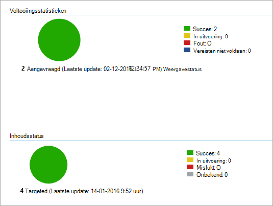

# <a name="onboard-windows-10-devices-using-configuration-manager"></a><span data-ttu-id="55af1-104">Onboarden Windows 10-updates met Configuration Manager</span><span class="sxs-lookup"><span data-stu-id="55af1-104">Onboard Windows 10 devices using Configuration Manager</span></span>

[!INCLUDE [Microsoft 365 Defender rebranding](../../includes/microsoft-defender.md)]

<span data-ttu-id="55af1-105">**Van toepassing op:**</span><span class="sxs-lookup"><span data-stu-id="55af1-105">**Applies to:**</span></span>

- [<span data-ttu-id="55af1-106">Microsoft Defender voor Endpoint</span><span class="sxs-lookup"><span data-stu-id="55af1-106">Microsoft Defender for Endpoint</span></span>](https://go.microsoft.com/fwlink/p/?linkid=2154037)
- [<span data-ttu-id="55af1-107">Microsoft 365 Defender</span><span class="sxs-lookup"><span data-stu-id="55af1-107">Microsoft 365 Defender</span></span>](https://go.microsoft.com/fwlink/?linkid=2118804)
- <span data-ttu-id="55af1-108">Microsoft Endpoint Configuration Manager current branch</span><span class="sxs-lookup"><span data-stu-id="55af1-108">Microsoft Endpoint Configuration Manager current branch</span></span>
- <span data-ttu-id="55af1-109">System Center 2012 R2 Configuration Manager</span><span class="sxs-lookup"><span data-stu-id="55af1-109">System Center 2012 R2 Configuration Manager</span></span>

><span data-ttu-id="55af1-110">Wilt u Defender voor Eindpunt ervaren?</span><span class="sxs-lookup"><span data-stu-id="55af1-110">Want to experience Defender for Endpoint?</span></span> [<span data-ttu-id="55af1-111">Meld u aan voor een gratis proefabonnement.</span><span class="sxs-lookup"><span data-stu-id="55af1-111">Sign up for a free trial.</span></span>](https://www.microsoft.com/microsoft-365/windows/microsoft-defender-atp?ocid=docs-wdatp-configureendpointssccm-abovefoldlink)

## <a name="supported-client-operating-systems"></a><span data-ttu-id="55af1-112">Ondersteunde clientbesturingssystemen</span><span class="sxs-lookup"><span data-stu-id="55af1-112">Supported client operating systems</span></span>

<span data-ttu-id="55af1-113">Op basis van de versie van Configuration Manager die u gebruikt, kunnen de volgende clientbesturingssystemen worden onboarded:</span><span class="sxs-lookup"><span data-stu-id="55af1-113">Based on the version of Configuration Manager you're running, the following client operating systems can be onboarded:</span></span>

#### <a name="configuration-manager-version-1910-and-prior"></a><span data-ttu-id="55af1-114">Configuration Manager versie 1910 en eerder</span><span class="sxs-lookup"><span data-stu-id="55af1-114">Configuration Manager version 1910 and prior</span></span>

- <span data-ttu-id="55af1-115">Clients computers met Windows 10</span><span class="sxs-lookup"><span data-stu-id="55af1-115">Clients computers running Windows 10</span></span> 

#### <a name="configuration-manager-version-2002-and-later"></a><span data-ttu-id="55af1-116">Configuration Manager versie 2002 en hoger</span><span class="sxs-lookup"><span data-stu-id="55af1-116">Configuration Manager version 2002 and later</span></span>

<span data-ttu-id="55af1-117">Vanaf Configuration Manager versie 2002 kunt u de volgende besturingssystemen aan boord nemen:</span><span class="sxs-lookup"><span data-stu-id="55af1-117">Starting in Configuration Manager version 2002, you can onboard the following operating systems:</span></span>

- <span data-ttu-id="55af1-118">Windows 8.1</span><span class="sxs-lookup"><span data-stu-id="55af1-118">Windows 8.1</span></span>
- <span data-ttu-id="55af1-119">Windows 10</span><span class="sxs-lookup"><span data-stu-id="55af1-119">Windows 10</span></span>
- <span data-ttu-id="55af1-120">Windows Server 2012 R2</span><span class="sxs-lookup"><span data-stu-id="55af1-120">Windows Server 2012 R2</span></span>
- <span data-ttu-id="55af1-121">Windows Server 2016</span><span class="sxs-lookup"><span data-stu-id="55af1-121">Windows Server 2016</span></span>
- <span data-ttu-id="55af1-122">Windows Server 2016, versie 1803 of hoger</span><span class="sxs-lookup"><span data-stu-id="55af1-122">Windows Server 2016, version 1803 or later</span></span>
- <span data-ttu-id="55af1-123">Windows Server 2019</span><span class="sxs-lookup"><span data-stu-id="55af1-123">Windows Server 2019</span></span>

>[!NOTE]
><span data-ttu-id="55af1-124">Zie Onboard [Windows-servers](configure-server-endpoints.md)voor meer informatie over het onboarden van Windows Server 2012 R2, Windows Server 2016 en Windows Server 2019.</span><span class="sxs-lookup"><span data-stu-id="55af1-124">For more information on how to onboard Windows Server 2012 R2, Windows Server 2016, and Windows Server 2019, see, [Onboard Windows servers](configure-server-endpoints.md).</span></span>


### <a name="onboard-devices-using-system-center-configuration-manager"></a><span data-ttu-id="55af1-125">Onboard-apparaten met System Center Configuration Manager</span><span class="sxs-lookup"><span data-stu-id="55af1-125">Onboard devices using System Center Configuration Manager</span></span>


<span data-ttu-id="55af1-126">[](images/onboard-config-mgr.png#lightbox)</span><span class="sxs-lookup"><span data-stu-id="55af1-126">[](images/onboard-config-mgr.png#lightbox)</span></span>


<span data-ttu-id="55af1-127">Bekijk het [PDF-bestand](https://github.com/MicrosoftDocs/microsoft-365-docs/raw/public/microsoft-365/security/defender-endpoint/downloads/mdatp-deployment-strategy.pdf)  of  [Visio](https://github.com/MicrosoftDocs/microsoft-365-docs/raw/public/microsoft-365/security/defender-endpoint/downloads/mdatp-deployment-strategy.vsdx) om de verschillende paden te bekijken bij de implementatie van Microsoft Defender voor Eindpunt.</span><span class="sxs-lookup"><span data-stu-id="55af1-127">Check out the [PDF](https://github.com/MicrosoftDocs/microsoft-365-docs/raw/public/microsoft-365/security/defender-endpoint/downloads/mdatp-deployment-strategy.pdf)  or  [Visio](https://github.com/MicrosoftDocs/microsoft-365-docs/raw/public/microsoft-365/security/defender-endpoint/downloads/mdatp-deployment-strategy.vsdx) to see the various paths in deploying Microsoft Defender for Endpoint.</span></span> 


1. <span data-ttu-id="55af1-128">Open het configuratiepakket Configuratiebeheer .zip-bestand *(WindowsDefenderATPOnboardingPackage.zip)* dat u hebt gedownload uit de wizard Service onboarding.</span><span class="sxs-lookup"><span data-stu-id="55af1-128">Open the Configuration Manager configuration package .zip file (*WindowsDefenderATPOnboardingPackage.zip*) that you downloaded from the service onboarding wizard.</span></span> <span data-ttu-id="55af1-129">U kunt het pakket ook in [het Microsoft Defender-beveiligingscentrum kopen:](https://securitycenter.windows.com/)</span><span class="sxs-lookup"><span data-stu-id="55af1-129">You can also get the package from [Microsoft Defender Security Center](https://securitycenter.windows.com/):</span></span>

    1. <span data-ttu-id="55af1-130">Selecteer in het navigatiedeelvenster **Instellingen**  >  **Onboarding**.</span><span class="sxs-lookup"><span data-stu-id="55af1-130">In the navigation pane, select **Settings** > **Onboarding**.</span></span>
    
    1. <span data-ttu-id="55af1-131">Selecteer Windows 10 als het besturingssysteem.</span><span class="sxs-lookup"><span data-stu-id="55af1-131">Select Windows 10 as the operating system.</span></span>

    1. <span data-ttu-id="55af1-132">Selecteer in **het veld** Implementatiemethode System Center Configuration **Manager 2012/2012 R2/1511/1602**.</span><span class="sxs-lookup"><span data-stu-id="55af1-132">In the **Deployment method** field, select **System Center Configuration Manager 2012/2012 R2/1511/1602**.</span></span>
    
    1. <span data-ttu-id="55af1-133">Selecteer **Pakket downloaden** en sla het ZIP-bestand op.</span><span class="sxs-lookup"><span data-stu-id="55af1-133">Select **Download package**, and save the .zip file.</span></span>

2. <span data-ttu-id="55af1-134">Haal de inhoud van het ZIP-bestand op naar een gedeelde, alleen-lezen locatie die kan worden gebruikt door de netwerkbeheerders die het pakket zullen implementeren.</span><span class="sxs-lookup"><span data-stu-id="55af1-134">Extract the contents of the .zip file to a shared, read-only location that can be accessed by the network administrators who will deploy the package.</span></span> <span data-ttu-id="55af1-135">U moet een bestand met de naam *WindowsDefenderATPOnboardingScript.cmd hebben.*</span><span class="sxs-lookup"><span data-stu-id="55af1-135">You should have a file named *WindowsDefenderATPOnboardingScript.cmd*.</span></span>

3. <span data-ttu-id="55af1-136">Implementeer het pakket door de stappen te volgen in het artikel Pakketten en programma's [in System Center 2012 R2 Configuration Manager.](https://docs.microsoft.com/previous-versions/system-center/system-center-2012-R2/gg699369\(v=technet.10\))</span><span class="sxs-lookup"><span data-stu-id="55af1-136">Deploy the package by following the steps in the [Packages and Programs in System Center 2012 R2 Configuration Manager](https://docs.microsoft.com/previous-versions/system-center/system-center-2012-R2/gg699369\(v=technet.10\)) article.</span></span>

    <span data-ttu-id="55af1-137">a.</span><span class="sxs-lookup"><span data-stu-id="55af1-137">a.</span></span> <span data-ttu-id="55af1-138">Kies een vooraf gedefinieerde apparaatverzameling om het pakket te implementeren.</span><span class="sxs-lookup"><span data-stu-id="55af1-138">Choose a predefined device collection to deploy the package to.</span></span>

> [!NOTE]
> <span data-ttu-id="55af1-139">Defender voor Eindpunt biedt geen ondersteuning voor onboarding tijdens de [OOBE-fase (Out-Of-Box Experience).](https://answers.microsoft.com/en-us/windows/wiki/windows_10/how-to-complete-the-windows-10-out-of-box/47e3f943-f000-45e3-8c5c-9d85a1a0cf87)</span><span class="sxs-lookup"><span data-stu-id="55af1-139">Defender for Endpoint doesn't support onboarding during the [Out-Of-Box Experience (OOBE)](https://answers.microsoft.com/en-us/windows/wiki/windows_10/how-to-complete-the-windows-10-out-of-box/47e3f943-f000-45e3-8c5c-9d85a1a0cf87) phase.</span></span> <span data-ttu-id="55af1-140">Zorg ervoor dat gebruikers OOBE voltooien na het uitvoeren van Windows-installatie of upgrade.</span><span class="sxs-lookup"><span data-stu-id="55af1-140">Make sure users complete OOBE after running Windows installation or upgrading.</span></span>

>[!TIP]
> <span data-ttu-id="55af1-141">Nadat u het apparaat hebt onboarding, kunt u ervoor kiezen om een detectietest uit te voeren om te controleren of een apparaat correct is aan boord van de service.</span><span class="sxs-lookup"><span data-stu-id="55af1-141">After onboarding the device, you can choose to run a detection test to verify that an device is properly onboarded to the service.</span></span> <span data-ttu-id="55af1-142">Zie Een detectietest uitvoeren op een nieuw ingebouwde [Defender voor eindpuntapparaat](run-detection-test.md)voor meer informatie.</span><span class="sxs-lookup"><span data-stu-id="55af1-142">For more information, see [Run a detection test on a newly onboarded Defender for Endpoint device](run-detection-test.md).</span></span>
>
> <span data-ttu-id="55af1-143">Houd er rekening mee dat het mogelijk is om een detectieregel te maken in een Configuration Manager-toepassing om continu te controleren of een apparaat is onboarded.</span><span class="sxs-lookup"><span data-stu-id="55af1-143">Note that it is possible to create a detection rule on a Configuration Manager application to continuously check if a device has been onboarded.</span></span> <span data-ttu-id="55af1-144">Een toepassing is een ander type object dan een pakket en programma.</span><span class="sxs-lookup"><span data-stu-id="55af1-144">An application is a different type of object than a package and program.</span></span>
> <span data-ttu-id="55af1-145">Als een apparaat nog niet is onboarded (vanwege in behandeling zijnde OOBE-voltooiing of een andere reden), wordt configuratiebeheer opnieuw gebruikt om het apparaat aan te sluiten totdat de regel de statuswijziging detecteert.</span><span class="sxs-lookup"><span data-stu-id="55af1-145">If a device is not yet onboarded (due to pending OOBE completion or any other reason), Configuration Manager will retry to onboard the device until the rule detects the status change.</span></span>
> 
> <span data-ttu-id="55af1-146">Dit gedrag kan worden bereikt door een detectieregel te maken die controleert of de registerwaarde 'OnboardingState' (van type REG_DWORD) = 1.</span><span class="sxs-lookup"><span data-stu-id="55af1-146">This behavior can be accomplished by creating a detection rule checking if the "OnboardingState" registry value (of type REG_DWORD) = 1.</span></span>
> <span data-ttu-id="55af1-147">Deze registerwaarde bevindt zich onder 'HKLM\SOFTWARE\Microsoft\Windows Advanced Threat Protection\Status'.</span><span class="sxs-lookup"><span data-stu-id="55af1-147">This registry value is located under "HKLM\SOFTWARE\Microsoft\Windows Advanced Threat Protection\Status".</span></span>
<span data-ttu-id="55af1-148">Zie Detectiemethoden configureren [in System Center 2012 R2 Configuration Manager voor meer informatie.](https://docs.microsoft.com/previous-versions/system-center/system-center-2012-R2/gg682159\(v=technet.10\)#step-4-configure-detection-methods-to-indicate-the-presence-of-the-deployment-type)</span><span class="sxs-lookup"><span data-stu-id="55af1-148">For more information, see [Configure Detection Methods in System Center 2012 R2 Configuration Manager](https://docs.microsoft.com/previous-versions/system-center/system-center-2012-R2/gg682159\(v=technet.10\)#step-4-configure-detection-methods-to-indicate-the-presence-of-the-deployment-type).</span></span>

### <a name="configure-sample-collection-settings"></a><span data-ttu-id="55af1-149">Voorbeeldverzamelingsinstellingen configureren</span><span class="sxs-lookup"><span data-stu-id="55af1-149">Configure sample collection settings</span></span>

<span data-ttu-id="55af1-150">Voor elk apparaat kunt u een configuratiewaarde instellen om aan te geven of er steekproeven kunnen worden verzameld vanaf het apparaat wanneer een aanvraag wordt gedaan via het Microsoft Defender-beveiligingscentrum om een bestand in te dienen voor uitgebreide analyse.</span><span class="sxs-lookup"><span data-stu-id="55af1-150">For each device, you can set a configuration value to state whether samples can be collected from the device when a request is made through Microsoft Defender Security Center to submit a file for deep analysis.</span></span>

>[!NOTE]
><span data-ttu-id="55af1-151">Deze configuratie-instellingen worden meestal uitgevoerd via Configuration Manager.</span><span class="sxs-lookup"><span data-stu-id="55af1-151">These configuration settings are typically done through Configuration Manager.</span></span> 

<span data-ttu-id="55af1-152">U kunt een complianceregel instellen voor configuratie-item in Configuration Manager om de instelling voor voorbeeld delen op een apparaat te wijzigen.</span><span class="sxs-lookup"><span data-stu-id="55af1-152">You can set a compliance rule for configuration item in Configuration Manager to change the sample share setting on a device.</span></span>

<span data-ttu-id="55af1-153">Deze regel moet een *configuratie-item* voor complianceregel zijn dat de waarde van een registersleutel op gerichte apparaten in stelt om ervoor te zorgen dat ze een klacht indienen.</span><span class="sxs-lookup"><span data-stu-id="55af1-153">This rule should be a *remediating* compliance rule configuration item that sets the value of a registry key on targeted devices to make sure they’re complaint.</span></span>

<span data-ttu-id="55af1-154">De configuratie wordt ingesteld via de volgende registersleutelinvoer:</span><span class="sxs-lookup"><span data-stu-id="55af1-154">The configuration is set through the following registry key entry:</span></span>

```console
Path: "HKLM\SOFTWARE\Policies\Microsoft\Windows Advanced Threat Protection"
Name: "AllowSampleCollection"
Value: 0 or 1
```

<span data-ttu-id="55af1-155">Waarbij:</span><span class="sxs-lookup"><span data-stu-id="55af1-155">Where:</span></span><br>
<span data-ttu-id="55af1-156">Het type toets is een D-WORD.</span><span class="sxs-lookup"><span data-stu-id="55af1-156">Key type is a D-WORD.</span></span> <br>
<span data-ttu-id="55af1-157">Mogelijke waarden zijn:</span><span class="sxs-lookup"><span data-stu-id="55af1-157">Possible values are:</span></span>
- <span data-ttu-id="55af1-158">0 - is het delen van voorbeelden vanaf dit apparaat niet toegestaan</span><span class="sxs-lookup"><span data-stu-id="55af1-158">0 - doesn't allow sample sharing  from this device</span></span>
- <span data-ttu-id="55af1-159">1 : hiermee kunt u alle bestandstypen vanaf dit apparaat delen</span><span class="sxs-lookup"><span data-stu-id="55af1-159">1 - allows sharing of all file types from this device</span></span>

<span data-ttu-id="55af1-160">De standaardwaarde voor het geval de registersleutel niet bestaat, is 1.</span><span class="sxs-lookup"><span data-stu-id="55af1-160">The default value in case the registry key doesn’t exist is 1.</span></span>

<span data-ttu-id="55af1-161">Zie Inleiding tot compliance-instellingen [in System Center 2012 R2 Configuration Manager](https://docs.microsoft.com/previous-versions/system-center/system-center-2012-R2/gg682139\(v=technet.10\))voor meer informatie over compliance van System Center Configuration Manager.</span><span class="sxs-lookup"><span data-stu-id="55af1-161">For more information about System Center Configuration Manager Compliance, see [Introduction to compliance settings in System Center 2012 R2 Configuration Manager](https://docs.microsoft.com/previous-versions/system-center/system-center-2012-R2/gg682139\(v=technet.10\)).</span></span>


## <a name="other-recommended-configuration-settings"></a><span data-ttu-id="55af1-162">Andere aanbevolen configuratie-instellingen</span><span class="sxs-lookup"><span data-stu-id="55af1-162">Other recommended configuration settings</span></span>
<span data-ttu-id="55af1-163">Nadat u apparaten hebt toegevoegd aan de service, is het belangrijk om te profiteren van de meegeleverde mogelijkheden voor bedreigingsbeveiliging door ze in te stellen met de volgende aanbevolen configuratie-instellingen.</span><span class="sxs-lookup"><span data-stu-id="55af1-163">After onboarding devices to the service, it's important to take advantage of the included threat protection capabilities by enabling them with the following recommended configuration settings.</span></span>

### <a name="device-collection-configuration"></a><span data-ttu-id="55af1-164">Apparaatverzamelingsconfiguratie</span><span class="sxs-lookup"><span data-stu-id="55af1-164">Device collection configuration</span></span>
<span data-ttu-id="55af1-165">Als u Endpoint Configuration Manager, versie 2002 of hoger, gebruikt, kunt u ervoor kiezen om de implementatie uit te lijnen met servers of down-level clients.</span><span class="sxs-lookup"><span data-stu-id="55af1-165">If you're using Endpoint Configuration Manager, version 2002 or later, you can choose to broaden the deployment to include servers or down-level clients.</span></span>


### <a name="next-generation-protection-configuration"></a><span data-ttu-id="55af1-166">Beveiligingsconfiguratie van de volgende generatie</span><span class="sxs-lookup"><span data-stu-id="55af1-166">Next generation protection configuration</span></span>
<span data-ttu-id="55af1-167">De volgende configuratie-instellingen worden aanbevolen:</span><span class="sxs-lookup"><span data-stu-id="55af1-167">The following configuration settings are recommended:</span></span>

<span data-ttu-id="55af1-168">**Scannen**</span><span class="sxs-lookup"><span data-stu-id="55af1-168">**Scan**</span></span> <br>
- <span data-ttu-id="55af1-169">Verwisselbare opslagapparaten scannen, zoals USB-stations: Ja</span><span class="sxs-lookup"><span data-stu-id="55af1-169">Scan removable storage devices such as USB drives: Yes</span></span>

<span data-ttu-id="55af1-170">**Realtime beveiliging**</span><span class="sxs-lookup"><span data-stu-id="55af1-170">**Real-time Protection**</span></span> <br>
- <span data-ttu-id="55af1-171">Gedragscontrole inschakelen: Ja</span><span class="sxs-lookup"><span data-stu-id="55af1-171">Enable Behavioral Monitoring: Yes</span></span>
- <span data-ttu-id="55af1-172">Beveiliging inschakelen tegen potentieel ongewenste toepassingen bij downloaden en vóór de installatie: Ja</span><span class="sxs-lookup"><span data-stu-id="55af1-172">Enable protection against Potentially Unwanted Applications at download and prior to installation: Yes</span></span>

<span data-ttu-id="55af1-173">**Cloudbeveiligingsservice**</span><span class="sxs-lookup"><span data-stu-id="55af1-173">**Cloud Protection Service**</span></span>
- <span data-ttu-id="55af1-174">Lidmaatschapstype Cloud Protection Service: Geavanceerd lidmaatschap</span><span class="sxs-lookup"><span data-stu-id="55af1-174">Cloud Protection Service membership type: Advanced membership</span></span>

<span data-ttu-id="55af1-175">**Surface-beperking voor aanvallen** Configureer alle beschikbare regels om te controleren.</span><span class="sxs-lookup"><span data-stu-id="55af1-175">**Attack surface reduction** Configure all available rules to Audit.</span></span>

>[!NOTE]
> <span data-ttu-id="55af1-176">Het blokkeren van deze activiteiten kan legitieme bedrijfsprocessen onderbreken.</span><span class="sxs-lookup"><span data-stu-id="55af1-176">Blocking these activities may interrupt legitimate business processes.</span></span> <span data-ttu-id="55af1-177">De beste methode is om alles in te stellen op controle, om te bepalen welke veilig zijn om in te zetten en vervolgens de instellingen in te stellen op eindpunten die geen fout-positieve detecties hebben.</span><span class="sxs-lookup"><span data-stu-id="55af1-177">The best approach is setting everything to audit, identifying which ones are safe to turn on, and then enabling those settings on endpoints which do not have false positive detections.</span></span>


<span data-ttu-id="55af1-178">**Netwerkbeveiliging**</span><span class="sxs-lookup"><span data-stu-id="55af1-178">**Network protection**</span></span> <br>
<span data-ttu-id="55af1-179">Voordat u netwerkbeveiliging in de audit- of blokmodus inschakelen, moet u ervoor zorgen dat u de antimalware-platformupdate hebt geïnstalleerd, die kan worden verkregen via de [ondersteuningspagina.](https://support.microsoft.com/en-us/help/4560203/windows-defender-anti-malware-platform-binaries-are-missing)</span><span class="sxs-lookup"><span data-stu-id="55af1-179">Prior to enabling network protection in audit or block mode, ensure that you've installed the antimalware platform update, which can be obtained from the [support page](https://support.microsoft.com/en-us/help/4560203/windows-defender-anti-malware-platform-binaries-are-missing).</span></span>


<span data-ttu-id="55af1-180">**Gecontroleerde maptoegang**</span><span class="sxs-lookup"><span data-stu-id="55af1-180">**Controlled folder access**</span></span><br>
<span data-ttu-id="55af1-181">Schakel de functie in de auditmodus minimaal 30 dagen in.</span><span class="sxs-lookup"><span data-stu-id="55af1-181">Enable the feature in audit mode for at least 30 days.</span></span> <span data-ttu-id="55af1-182">Na deze periode controleert u detecties en maakt u een lijst met toepassingen die mogen schrijven naar beveiligde directories.</span><span class="sxs-lookup"><span data-stu-id="55af1-182">After this period, review detections and create a list of applications that are allowed to write to protected directories.</span></span>

<span data-ttu-id="55af1-183">Zie Beheerde maptoegang evalueren voor meer [informatie.](evaluate-controlled-folder-access.md)</span><span class="sxs-lookup"><span data-stu-id="55af1-183">For more information, see [Evaluate controlled folder access](evaluate-controlled-folder-access.md).</span></span>


## <a name="offboard-devices-using-configuration-manager"></a><span data-ttu-id="55af1-184">Offboard-apparaten met Configuration Manager</span><span class="sxs-lookup"><span data-stu-id="55af1-184">Offboard devices using Configuration Manager</span></span>

<span data-ttu-id="55af1-185">Om veiligheidsredenen verloopt het pakket dat wordt gebruikt voor Offboard-apparaten 30 dagen na de datum waarop het is gedownload.</span><span class="sxs-lookup"><span data-stu-id="55af1-185">For security reasons, the package used to Offboard devices will expire 30 days after the date it was downloaded.</span></span> <span data-ttu-id="55af1-186">Verlopen offboarding-pakketten die naar een apparaat zijn verzonden, worden geweigerd.</span><span class="sxs-lookup"><span data-stu-id="55af1-186">Expired offboarding packages sent to a device will be rejected.</span></span> <span data-ttu-id="55af1-187">Wanneer u een offboarding-pakket downloadt, wordt u op de hoogte gesteld van de vervaldatum van de pakketten en wordt het ook opgenomen in de pakketnaam.</span><span class="sxs-lookup"><span data-stu-id="55af1-187">When downloading an offboarding package, you will be notified of the packages expiry date and it will also be included in the package name.</span></span>

> [!NOTE]
> <span data-ttu-id="55af1-188">Onboarding- en offboarding-beleid mag niet tegelijkertijd op hetzelfde apparaat worden geïmplementeerd, anders veroorzaakt dit onvoorspelbare botsingen.</span><span class="sxs-lookup"><span data-stu-id="55af1-188">Onboarding and offboarding policies must not be deployed on the same device at the same time, otherwise this will cause unpredictable collisions.</span></span>

### <a name="offboard-devices-using-microsoft-endpoint-manager-current-branch"></a><span data-ttu-id="55af1-189">Offboard-apparaten met microsoft Endpoint Manager current branch</span><span class="sxs-lookup"><span data-stu-id="55af1-189">Offboard devices using Microsoft Endpoint Manager current branch</span></span>

<span data-ttu-id="55af1-190">Zie Een [offboarding-configuratiebestand maken](https://docs.microsoft.com/configmgr/protect/deploy-use/windows-defender-advanced-threat-protection#create-an-offboarding-configuration-file)als u de huidige vertakking van Microsoft Endpoint Manager gebruikt.</span><span class="sxs-lookup"><span data-stu-id="55af1-190">If you use Microsoft Endpoint Manager current branch, see [Create an offboarding configuration file](https://docs.microsoft.com/configmgr/protect/deploy-use/windows-defender-advanced-threat-protection#create-an-offboarding-configuration-file).</span></span>

### <a name="offboard-devices-using-system-center-2012-r2-configuration-manager"></a><span data-ttu-id="55af1-191">Offboard-apparaten met System Center 2012 R2 Configuration Manager</span><span class="sxs-lookup"><span data-stu-id="55af1-191">Offboard devices using System Center 2012 R2 Configuration Manager</span></span>

1. <span data-ttu-id="55af1-192">Ontvang het offboarding-pakket van [het Microsoft Defender-beveiligingscentrum:](https://securitycenter.windows.com/)</span><span class="sxs-lookup"><span data-stu-id="55af1-192">Get the offboarding package from [Microsoft Defender Security Center](https://securitycenter.windows.com/):</span></span>

    1. <span data-ttu-id="55af1-193">Selecteer in het navigatiedeelvenster **Instellingen**  >   **Offboarding**.</span><span class="sxs-lookup"><span data-stu-id="55af1-193">In the navigation pane, select **Settings** >  **Offboarding**.</span></span>

    1. <span data-ttu-id="55af1-194">Selecteer Windows 10 als het besturingssysteem.</span><span class="sxs-lookup"><span data-stu-id="55af1-194">Select Windows 10 as the operating system.</span></span>

    1. <span data-ttu-id="55af1-195">Selecteer in **het veld** Implementatiemethode System Center Configuration **Manager 2012/2012 R2/1511/1602**.</span><span class="sxs-lookup"><span data-stu-id="55af1-195">In the **Deployment method** field, select **System Center Configuration Manager 2012/2012 R2/1511/1602**.</span></span>
    
    1. <span data-ttu-id="55af1-196">Selecteer **Pakket downloaden** en sla het ZIP-bestand op.</span><span class="sxs-lookup"><span data-stu-id="55af1-196">Select **Download package**, and save the .zip file.</span></span>

2. <span data-ttu-id="55af1-197">Haal de inhoud van het ZIP-bestand op naar een gedeelde, alleen-lezen locatie die kan worden gebruikt door de netwerkbeheerders die het pakket zullen implementeren.</span><span class="sxs-lookup"><span data-stu-id="55af1-197">Extract the contents of the .zip file to a shared, read-only location that can be accessed by the network administrators who will deploy the package.</span></span> <span data-ttu-id="55af1-198">U moet een bestand met de *WindowsDefenderATPOffboardingScript_valid_until_YYYY-MM-DD.cmd hebben.*</span><span class="sxs-lookup"><span data-stu-id="55af1-198">You should have a file named *WindowsDefenderATPOffboardingScript_valid_until_YYYY-MM-DD.cmd*.</span></span>

3. <span data-ttu-id="55af1-199">Implementeer het pakket door de stappen te volgen in het artikel Pakketten en programma's [in System Center 2012 R2 Configuration Manager.](https://docs.microsoft.com/previous-versions/system-center/system-center-2012-R2/gg699369\(v=technet.10\))</span><span class="sxs-lookup"><span data-stu-id="55af1-199">Deploy the package by following the steps in the [Packages and Programs in System Center 2012 R2 Configuration Manager](https://docs.microsoft.com/previous-versions/system-center/system-center-2012-R2/gg699369\(v=technet.10\)) article.</span></span>

    <span data-ttu-id="55af1-200">a.</span><span class="sxs-lookup"><span data-stu-id="55af1-200">a.</span></span> <span data-ttu-id="55af1-201">Kies een vooraf gedefinieerde apparaatverzameling om het pakket te implementeren.</span><span class="sxs-lookup"><span data-stu-id="55af1-201">Choose a predefined device collection to deploy the package to.</span></span>

> [!IMPORTANT]
> <span data-ttu-id="55af1-202">Offboarding zorgt ervoor dat het apparaat stopt met het verzenden van sensorgegevens naar de portal, maar gegevens van het apparaat, inclusief verwijzingen naar eventuele waarschuwingen die het heeft ontvangen, blijven maximaal 6 maanden bewaard.</span><span class="sxs-lookup"><span data-stu-id="55af1-202">Offboarding causes the device to stop sending sensor data to the portal but data from the device, including reference to any alerts it has had will be retained for up to 6 months.</span></span>


## <a name="monitor-device-configuration"></a><span data-ttu-id="55af1-203">Apparaatconfiguratie controleren</span><span class="sxs-lookup"><span data-stu-id="55af1-203">Monitor device configuration</span></span>

<span data-ttu-id="55af1-204">Als u de huidige vertakking van Microsoft Endpoint Manager gebruikt, gebruikt u het ingebouwde Dashboard van Defender voor Eindpunt in de console Configuration Manager.</span><span class="sxs-lookup"><span data-stu-id="55af1-204">If you're using Microsoft Endpoint Manager current branch, use the built-in Defender for Endpoint dashboard in the Configuration Manager console.</span></span> <span data-ttu-id="55af1-205">Zie Defender [for Endpoint - Monitor voor meer informatie.](https://docs.microsoft.com/configmgr/protect/deploy-use/windows-defender-advanced-threat-protection#monitor)</span><span class="sxs-lookup"><span data-stu-id="55af1-205">For more information, see [Defender for Endpoint - Monitor](https://docs.microsoft.com/configmgr/protect/deploy-use/windows-defender-advanced-threat-protection#monitor).</span></span>

<span data-ttu-id="55af1-206">Als u System Center 2012 R2 Configuration Manager gebruikt, bestaat monitoring uit twee onderdelen:</span><span class="sxs-lookup"><span data-stu-id="55af1-206">If you're using System Center 2012 R2 Configuration Manager, monitoring consists of two parts:</span></span>

1. <span data-ttu-id="55af1-207">Bevestigen dat het configuratiepakket correct is geïmplementeerd en wordt uitgevoerd (of is uitgevoerd) op de apparaten in uw netwerk.</span><span class="sxs-lookup"><span data-stu-id="55af1-207">Confirming the configuration package has been correctly deployed and is running (or has successfully run) on the devices in your network.</span></span>

2. <span data-ttu-id="55af1-208">Controleren of de apparaten compatibel zijn met de Defender for Endpoint-service (dit zorgt ervoor dat het apparaat het onboardingproces kan voltooien en gegevens kan blijven rapporteren aan de service).</span><span class="sxs-lookup"><span data-stu-id="55af1-208">Checking that the devices are compliant with the Defender for Endpoint service (this ensures the device can complete the onboarding process and can continue to report data to the service).</span></span>

### <a name="confirm-the-configuration-package-has-been-correctly-deployed"></a><span data-ttu-id="55af1-209">Controleren of het configuratiepakket correct is geïmplementeerd</span><span class="sxs-lookup"><span data-stu-id="55af1-209">Confirm the configuration package has been correctly deployed</span></span>

1. <span data-ttu-id="55af1-210">Klik in de console Configuration Manager op **Controleren** onder aan het navigatiedeelvenster.</span><span class="sxs-lookup"><span data-stu-id="55af1-210">In the Configuration Manager console, click **Monitoring** at the bottom of the navigation pane.</span></span>

2. <span data-ttu-id="55af1-211">Selecteer **Overzicht** en vervolgens **Implementaties.**</span><span class="sxs-lookup"><span data-stu-id="55af1-211">Select **Overview** and then **Deployments**.</span></span>

3. <span data-ttu-id="55af1-212">Selecteer op de implementatie met de naam van het pakket.</span><span class="sxs-lookup"><span data-stu-id="55af1-212">Select on the deployment with the package name.</span></span>

4. <span data-ttu-id="55af1-213">Bekijk de statusindicatoren onder **Voltooiingsstatistieken** en **Inhoudsstatus**.</span><span class="sxs-lookup"><span data-stu-id="55af1-213">Review the status indicators under **Completion Statistics** and **Content Status**.</span></span>

    <span data-ttu-id="55af1-214">Als er mislukte implementaties zijn (apparaten met **fout,** niet-voldaane vereisten of mislukte **statussen),** moet u mogelijk problemen met de apparaten oplossen.</span><span class="sxs-lookup"><span data-stu-id="55af1-214">If there are failed deployments (devices with **Error**, **Requirements Not Met**, or **Failed statuses**), you may need to  troubleshoot the devices.</span></span> <span data-ttu-id="55af1-215">Zie Microsoft Defender oplossen voor problemen met de [onboarding van](troubleshoot-onboarding.md)eindpunten voor meer informatie.</span><span class="sxs-lookup"><span data-stu-id="55af1-215">For more information, see, [Troubleshoot Microsoft Defender for Endpoint onboarding issues](troubleshoot-onboarding.md).</span></span>

    

### <a name="check-that-the-devices-are-compliant-with-the-microsoft-defender-atp-service"></a><span data-ttu-id="55af1-217">Controleer of de apparaten compatibel zijn met de MICROSOFT Defender ATP-service</span><span class="sxs-lookup"><span data-stu-id="55af1-217">Check that the devices are compliant with the Microsoft Defender ATP service</span></span>

<span data-ttu-id="55af1-218">U kunt een complianceregel instellen voor configuratie-item in System Center 2012 R2 Configuration Manager om de implementatie te controleren.</span><span class="sxs-lookup"><span data-stu-id="55af1-218">You can set a compliance rule for configuration item in System Center 2012 R2 Configuration Manager to monitor your deployment.</span></span>

<span data-ttu-id="55af1-219">Deze regel moet een *configuratieitem voor complianceregelen* zijn dat de waarde van een registersleutel op gerichte apparaten controleert.</span><span class="sxs-lookup"><span data-stu-id="55af1-219">This rule should be a *non-remediating* compliance rule configuration item that monitors the value of a registry key on targeted devices.</span></span>

<span data-ttu-id="55af1-220">De volgende registersleutelinvoer controleren:</span><span class="sxs-lookup"><span data-stu-id="55af1-220">Monitor the following registry key entry:</span></span>

```console
Path: "HKLM\SOFTWARE\Microsoft\Windows Advanced Threat Protection\Status"
Name: "OnboardingState"
Value: "1"
```

<span data-ttu-id="55af1-221">Zie Inleiding tot [compliance-instellingen in System Center 2012 R2 Configuration Manager voor meer informatie.](https://docs.microsoft.com/previous-versions/system-center/system-center-2012-R2/gg682139\(v=technet.10\))</span><span class="sxs-lookup"><span data-stu-id="55af1-221">For more information, see [Introduction to compliance settings in System Center 2012 R2 Configuration Manager](https://docs.microsoft.com/previous-versions/system-center/system-center-2012-R2/gg682139\(v=technet.10\)).</span></span>

## <a name="related-topics"></a><span data-ttu-id="55af1-222">Verwante onderwerpen</span><span class="sxs-lookup"><span data-stu-id="55af1-222">Related topics</span></span>
- [<span data-ttu-id="55af1-223">Onboard Windows 10-apparaten met groepsbeleid</span><span class="sxs-lookup"><span data-stu-id="55af1-223">Onboard Windows 10 devices using Group Policy</span></span>](configure-endpoints-gp.md)
- [<span data-ttu-id="55af1-224">Onboarden Windows 10-apparaten met hulpmiddelen voor Mobile Device Management</span><span class="sxs-lookup"><span data-stu-id="55af1-224">Onboard Windows 10 devices using Mobile Device Management tools</span></span>](configure-endpoints-mdm.md)
- [<span data-ttu-id="55af1-225">Onboarden Windows 10-apparaten met een lokaal script</span><span class="sxs-lookup"><span data-stu-id="55af1-225">Onboard Windows 10 devices using a local script</span></span>](configure-endpoints-script.md)
- [<span data-ttu-id="55af1-226">Onboarden niet-permanente virtual desktop infrastructure (VDI)-apparaten</span><span class="sxs-lookup"><span data-stu-id="55af1-226">Onboard non-persistent virtual desktop infrastructure (VDI) devices</span></span>](configure-endpoints-vdi.md)
- [<span data-ttu-id="55af1-227">Een detectietest uitvoeren op een nieuw aan boord van Microsoft Defender ATP-apparaat</span><span class="sxs-lookup"><span data-stu-id="55af1-227">Run a detection test on a newly onboarded Microsoft Defender ATP device</span></span>](run-detection-test.md)
- [<span data-ttu-id="55af1-228">Problemen met de onboarding van Microsoft Defender voor eindpunten oplossen</span><span class="sxs-lookup"><span data-stu-id="55af1-228">Troubleshoot Microsoft Defender for Endpoint onboarding issues</span></span>](troubleshoot-onboarding.md)
