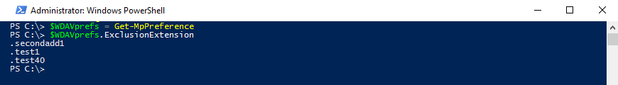

# <a name="configure-and-validate-exclusions-based-on-file-extension-and-folder-location"></a>Uitsluitingen configureren en valideren op basis van bestandsextensie en maplocatie

[!INCLUDE [Microsoft 365 Defender rebranding](../../includes/microsoft-defender.md)]


**Van toepassing op:**

- [Microsoft Defender voor Eindpunt](/microsoft-365/security/defender-endpoint/)

> [!IMPORTANT]
> Microsoft Defender Antivirus-uitsluitingen zijn niet van toepassing op andere Mogelijkheden van Microsoft Defender voor eindpunten, zoals eindpuntdetectie en -antwoord [(EDR), ASR-regels](/microsoft-365/security/defender-endpoint/overview-endpoint-detection-response) [(Attack Surface Reduction)](/microsoft-365/security/defender-endpoint/attack-surface-reduction)en gecontroleerde maptoegang [.](/microsoft-365/security/defender-endpoint/controlled-folders) Bestanden die u uitsluit met de methoden die in dit artikel worden beschreven, kunnen nog steeds EDR-waarschuwingen en andere detecties activeren. Als u bestanden breed wilt uitsluiten, voegt u deze toe aan de aangepaste indicatoren van Microsoft Defender [voor Eindpunt.](/microsoft-365/security/defender-endpoint/manage-indicators)

## <a name="exclusion-lists"></a>Uitsluitingslijsten

U kunt bepaalde bestanden uitsluiten van Microsoft Defender Antivirus-scans door uitsluitingslijsten te wijzigen. **Over het algemeen hoeft u geen uitsluitingen toe te passen.** Microsoft Defender Antivirus bevat veel automatische uitsluitingen op basis van bekende gedragingen van het besturingssysteem en normale beheerbestanden, zoals bestanden die worden gebruikt in ondernemingsbeheer, databasebeheer en andere ondernemingsscenario's en -situaties.

> [!NOTE]
> Uitsluitingen zijn ook van toepassing op pua-detecties (Potentially Unwanted Apps).

> [!NOTE]
> Automatische uitsluitingen zijn alleen van toepassing op Windows Server 2016 en hoger. Deze uitsluitingen zijn niet zichtbaar in de Windows Security-app en in PowerShell.

In dit artikel wordt beschreven hoe u uitsluitingslijsten configureert voor de bestanden en mappen. Zie Aanbevelingen voor het definiëren van uitsluitingen voordat u uw [uitsluitingslijsten](configure-exclusions-microsoft-defender-antivirus.md#recommendations-for-defining-exclusions) definieert.

| Uitsluiting | Voorbeelden | Lijst met uitsluitingen |
|:---|:---|:---|
|Een bestand met een specifieke extensie | Alle bestanden met de opgegeven extensie, overal op de computer. <p> Geldige syntaxis: `.test` en `test`  | Uitbreidingsuitsluitingen |
|Een bestand onder een specifieke map | Alle bestanden onder de `c:\test\sample` map | Bestands- en mapuitsluitingen |
| Een specifiek bestand in een specifieke map | Alleen het `c:\sample\sample.test` bestand | Bestands- en mapuitsluitingen |
| Een specifiek proces | Het uitvoerbare bestand `c:\test\process.exe` | Bestands- en mapuitsluitingen |

Uitsluitingslijsten hebben de volgende kenmerken:

- Mapuitsluitingen zijn van toepassing op alle bestanden en mappen onder die map, tenzij de submap een herstelpunt is. Submappen voor reparse-punten moeten afzonderlijk worden uitgesloten.
- Bestandsextensies zijn van toepassing op een bestandsnaam met de gedefinieerde extensie als een pad of map niet is gedefinieerd.

> [!IMPORTANT]
> - Als u jokertekens zoals het sterretje () gebruikt, wordt de interpretatie van \* de uitsluitingsregels gewijzigd. Zie de [sectie Jokertekens gebruiken in](#use-wildcards-in-the-file-name-and-folder-path-or-extension-exclusion-lists) de sectie bestandsnaam- en mappad- of extensieuitsluitingslijsten voor belangrijke informatie over hoe jokertekens werken.
> - U kunt netwerkstations niet uitsluiten. U moet het werkelijke netwerkpad opgeven.
> - Mappen die reparse-punten zijn die worden gemaakt nadat de Microsoft Defender Antivirus-service is gestart en die zijn toegevoegd aan de uitsluitingslijst, worden niet opgenomen. U moet de service opnieuw starten (door Windows opnieuw te starten) om nieuwe herstelpunten te kunnen herkennen als een geldig uitsluitingsdoel.

Zie Uitsluitingen configureren en valideren voor bestanden die door processen worden geopend als u bestanden wilt uitsluiten die door een specifiek proces [worden geopend.](configure-process-opened-file-exclusions-microsoft-defender-antivirus.md)

De uitsluitingen zijn van [toepassing op geplande scans,](scheduled-catch-up-scans-microsoft-defender-antivirus.md) [scans](run-scan-microsoft-defender-antivirus.md)op aanvraag en [real-time beveiliging.](configure-real-time-protection-microsoft-defender-antivirus.md)

> [!IMPORTANT]
> Wijzigingen in de uitsluitingslijst die met **groepsbeleid** zijn aangebracht, worden weergegeven in de lijsten in de [Windows-beveiligings-app.](microsoft-defender-security-center-antivirus.md)
> Wijzigingen die zijn aangebracht in de Windows Security-app, **worden niet in** de lijsten met groepsbeleidslijsten vermeld.

Lokale wijzigingen die zijn aangebracht in de lijsten (door gebruikers met beheerdersbevoegdheden, inclusief wijzigingen die zijn aangebracht met PowerShell en WMI), worden standaard samengevoegd met de lijsten zoals gedefinieerd (en geïmplementeerd) door Groepsbeleid, Configuratiebeheer of Intune. De lijsten met groepsbeleid hebben voorrang wanneer er conflicten zijn.

U kunt [configureren hoe lijsten met](configure-local-policy-overrides-microsoft-defender-antivirus.md#merge-lists) lokaal en globaal gedefinieerde uitsluitingen worden samengevoegd, zodat lokale wijzigingen de beheerde implementatie-instellingen kunnen overschrijven.

## <a name="configure-the-list-of-exclusions-based-on-folder-name-or-file-extension"></a>De lijst met uitsluitingen configureren op basis van mapnaam of bestandsextensie

### <a name="use-intune-to-configure-file-name-folder-or-file-extension-exclusions"></a>Intune gebruiken om uitsluitingen voor bestandsnaam, map of bestandsextensie te configureren

Zie de volgende artikelen:
- [Instellingen voor apparaatbeperkingen configureren in Microsoft Intune](/intune/device-restrictions-configure)
- [Microsoft Defender Antivirus device restriction settings for Windows 10 in Intune](/intune/device-restrictions-windows-10#microsoft-defender-antivirus)

### <a name="use-configuration-manager-to-configure-file-name-folder-or-file-extension-exclusions"></a>Configuration Manager gebruiken om uitsluitingen van bestandsnaam, map of bestandsextensie te configureren

Zie [Antimalware-beleid](/configmgr/protect/deploy-use/endpoint-antimalware-policies#exclusion-settings) maken en implementeren: Uitsluitingsinstellingen voor meer informatie over het configureren van Microsoft Endpoint Manager (huidige branch).

### <a name="use-group-policy-to-configure-folder-or-file-extension-exclusions"></a>Groepsbeleid gebruiken om uitsluitingen van mappen of bestandsextensie te configureren

>[!NOTE]
>Als u een volledig gekwalificeerd pad naar een bestand opgeeft, wordt alleen dat bestand uitgesloten. Als een map is gedefinieerd in de uitsluiting, worden alle bestanden en subdirectorieën onder die map uitgesloten.

1. Open op de computer groepsbeleidsbeheer de console Groepsbeleidsbeheer, [](/previous-versions/windows/it-pro/windows-server-2008-R2-and-2008/cc731212(v=ws.11))klik met de rechtermuisknop op het groepsbeleidsobject dat u wilt configureren en klik op **Bewerken.**

2. Ga in **de Editor voor groepsbeleidsbeheer** naar **Computerconfiguratie** en selecteer **Beheersjablonen.**

3. Vouw de boom uit naar **Windows-onderdelen**  >  **Microsoft Defender Antivirus**  >  **Exclusions**.

4. Open de **instelling Paduitsluitingen** voor bewerken en voeg uw uitsluitingen toe.

    1. Stel de optie in op **Ingeschakeld.**
    1. Klik onder **de** sectie Opties op **Tonen.**
    1. Geef elke map op een eigen regel op onder de **kolom Waardenaam.**
    1. Als u een bestand opgeeft, moet u een volledig gekwalificeerd pad naar het bestand invoeren, inclusief de stationletter, het mappad, de bestandsnaam en de extensie. Voer **0** in de kolom **Waarde** in.

5. Kies **OK**.

6. Open de **instelling Extensieuitsluitingen** voor bewerken en voeg uw uitsluitingen toe.

    1. Stel de optie in op **Ingeschakeld.**
    1. Selecteer onder **de** sectie Opties de optie **Toon**.
    1. Voer elke bestandsextensie op een eigen regel in onder de **kolom Waardenaam.**  Voer **0** in de kolom **Waarde** in.

7. Kies **OK**.

<a id="ps"></a>

### <a name="use-powershell-cmdlets-to-configure-file-name-folder-or-file-extension-exclusions"></a>PowerShell-cmdlets gebruiken om uitsluitingen voor bestandsnaam, map of bestandsextensie te configureren

Als u PowerShell gebruikt om uitsluitingen toe te voegen of te verwijderen voor bestanden op basis van de extensie, locatie of bestandsnaam, moet u een combinatie van drie cmdlets en de juiste uitsluitingslijstparameter gebruiken. De cmdlets zijn allemaal in de [Defender-module.](/powershell/module/defender/)

De indeling voor de cmdlets is als volgt:

```PowerShell
<cmdlet> -<exclusion list> "<item>"
```

De volgende opties zijn toegestaan `<cmdlet>` als:

| Configuratieactie | PowerShell-cmdlet |
|:---|:---|
|De lijst maken of overschrijven | `Set-MpPreference` |
|Toevoegen aan de lijst | `Add-MpPreference` |
|Item verwijderen uit de lijst | `Remove-MpPreference` |

De volgende opties zijn toegestaan `<exclusion list>` als:

| Type uitsluiting | PowerShell-parameter |
|:---|:---|
| Alle bestanden met een opgegeven bestandsextensie | `-ExclusionExtension` |
| Alle bestanden onder een map (inclusief bestanden in subdirectorieën) of een specifiek bestand | `-ExclusionPath` |

> [!IMPORTANT]
> Als u een lijst hebt gemaakt, met of , wordt de bestaande lijst opnieuw overschreven door de `Set-MpPreference` `Add-MpPreference` `Set-MpPreference` cmdlet te gebruiken.

Met het volgende codefragment wordt bijvoorbeeld een bestand met de bestandsextensie uitgesloten door Microsoft Defender `.test` Antivirus-scans:

```PowerShell
Add-MpPreference -ExclusionExtension ".test"
```

Zie [PowerShell-cmdlets](use-powershell-cmdlets-microsoft-defender-antivirus.md) gebruiken om Microsoft Defender Antivirus- en [Defender-cmdlets](/powershell/module/defender/)te configureren en uit te voeren voor meer informatie.

### <a name="use-windows-management-instruction-wmi-to-configure-file-name-folder-or-file-extension-exclusions"></a>Windows Management Instruction (WMI) gebruiken om uitsluitingen voor bestandsnaam, map of bestandsextensie te configureren

Gebruik de [ **methoden Set,** **Add** en **Remove** van](/previous-versions/windows/desktop/legacy/dn455323(v=vs.85)) de MSFT_MpPreference voor de volgende eigenschappen:

```WMI
ExclusionExtension
ExclusionPath
```

Het gebruik van **Set,** **Add** en **Remove** is vergelijkbaar met hun tegenhangers in PowerShell: `Set-MpPreference` , en `Add-MpPreference` `Remove-MpPreference` .

Zie Windows [Defender WMIv2 API's](/previous-versions/windows/desktop/defender/windows-defender-wmiv2-apis-portal)voor meer informatie.

<a id="man-tools"></a>

### <a name="use-the-windows-security-app-to-configure-file-name-folder-or-file-extension-exclusions"></a>De Windows Security-app gebruiken om uitsluitingen van bestandsnaam, map of bestandsextensie te configureren

Zie [Uitsluitingen toevoegen in de Windows Security-app](microsoft-defender-security-center-antivirus.md) voor instructies.

<a id="wildcards"></a>

## <a name="use-wildcards-in-the-file-name-and-folder-path-or-extension-exclusion-lists"></a>Jokertekens gebruiken in de uitsluitingslijsten voor bestandsnaam en map of extensie

U kunt het sterretje, vraagteken of omgevingsvariabelen (zoals ) gebruiken als jokertekens bij het definiëren van items in de uitsluitingslijst voor bestandsnaam of `*` `?` `%ALLUSERSPROFILE%` mappad. De manier waarop deze jokertekens worden geïnterpreteerd, verschilt van het gebruikelijke gebruik in andere apps en talen. Lees deze sectie om de specifieke beperkingen te begrijpen.

> [!IMPORTANT]
> Er zijn belangrijke beperkingen en gebruiksscenario's voor deze jokertekens:
> - Het gebruik van omgevingsvariabelen is beperkt tot machinevariabelen en deze die van toepassing zijn op processen die worden uitgevoerd als NT AUTHORITY\SYSTEM-account.
> - U kunt geen jokerteken gebruiken in plaats van een stationletter.
> - Een sterretje `*` in een mapuitsluiting staat op zijn plaats voor één map. Gebruik meerdere exemplaren van `\*\` om meerdere geneste mappen met niet-gespecificeerde namen aan te geven.

In de volgende tabel wordt beschreven hoe de jokertekens kunnen worden gebruikt en worden enkele voorbeelden gegeven.


|Jokerteken  |Voorbeelden  |
|:---------|:---------|
|`*` (sterretje) <p> In **bestandsnaam- en bestandsextensie-insluitsels** vervangt het sterretje een aantal tekens en is het alleen van toepassing op bestanden in de laatste map die in het argument is gedefinieerd. <p> In **mapuitsluitingen** vervangt het sterretje één map. Gebruik meerdere `*` mappen met schuine mappen `\` om meerdere geneste mappen aan te geven. Nadat u het aantal mappen met jokerkaarten en benoemde mappen hebt overeenkomen, worden ook alle submappen opgenomen.   | `C:\MyData\*.txt` bevat `C:\MyData\notes.txt` <p> `C:\somepath\*\Data` bevat een bestand in `C:\somepath\Archives\Data` en de submappen en `C:\somepath\Authorized\Data` de submappen <p> `C:\Serv\*\*\Backup` bevat een bestand in `C:\Serv\Primary\Denied\Backup` en de submappen en `C:\Serv\Secondary\Allowed\Backup` de submappen     |
|`?` (vraagteken)  <p> In **bestandsnaam- en bestandsextensie-insluitsels** vervangt het vraagteken één teken en is het alleen van toepassing op bestanden in de laatste map die in het argument is gedefinieerd. <p> In **mapuitsluitingen** vervangt het vraagteken één teken in een mapnaam. Nadat u het aantal mappen met jokerkaarten en benoemde mappen hebt overeenkomen, worden ook alle submappen opgenomen.   |`C:\MyData\my?.zip` bevat `C:\MyData\my1.zip` <p> `C:\somepath\?\Data` bevat een bestand in `C:\somepath\P\Data` en de submappen  <p> `C:\somepath\test0?\Data` alle bestanden in en de `C:\somepath\test01\Data` submappen          |
|Omgevingsvariabelen <p> De gedefinieerde variabele wordt ingevuld als een pad wanneer de uitsluiting wordt geëvalueerd.          |`%ALLUSERSPROFILE%\CustomLogFiles` zou bestaan uit `C:\ProgramData\CustomLogFiles\Folder1\file1.txt`         |
        

> [!IMPORTANT]
> Als u een argument voor bestandsuitsluiting combineert met een argument voor mapuitsluiting, worden de regels gestopt bij het argument bestand in de overeenkomende map en worden er in geen submappen naar bestandsmatchen ge zoeken.
> U kunt bijvoorbeeld alle bestanden uitsluiten die beginnen met 'datum' in de mappen en met `c:\data\final\marked` behulp van het argument `c:\data\review\marked` `c:\data\*\marked\date*` regel.
> Dit argument komt echter niet overeen met bestanden in submappen onder `c:\data\final\marked` of `c:\data\review\marked` .

<a id="review"></a>

### <a name="system-environment-variables"></a>Systeemomgevingvariabelen

In de volgende tabel worden de variabelen voor de systeemaccountomgeving vermeld en beschreven. 

| Deze systeemomgevingvariabele... | Hierom wordt omgeleid |
|:--|:--|
| `%APPDATA%`| `C:\Users\UserName.DomainName\AppData\Roaming` |
| `%APPDATA%\Microsoft\Internet Explorer\Quick Launch` | `C:\Windows\System32\config\systemprofile\AppData\Roaming\Microsoft\Internet Explorer\Quick Launch` |
| `%APPDATA%\Microsoft\Windows\Start Menu` | `C:\Windows\System32\config\systemprofile\AppData\Roaming\Microsoft\Windows\Start Menu` |
| `%APPDATA%\Microsoft\Windows\Start Menu\Programs` | `C:\Windows\System32\config\systemprofile\AppData\Roaming\Microsoft\Windows\Start Menu\Programs` |
| `%LOCALAPPDATA%` | `C:\Windows\System32\config\systemprofile\AppData\Local` |
| `%ProgramData%` | `C:\ProgramData` |
| `%ProgramFiles%` | `C:\Program Files` |
| `%ProgramFiles%\Common Files` | `C:\Program Files\Common Files` |
| `%ProgramFiles%\Windows Sidebar\Gadgets` | `C:\Program Files\Windows Sidebar\Gadgets` |
| `%ProgramFiles%\Common Files` | `C:\Program Files\Common Files` |
| `%ProgramFiles(x86)%` | `C:\Program Files (x86)` |
| `%ProgramFiles(x86)%\Common Files` | `C:\Program Files (x86)\Common Files` |
| `%SystemDrive%` | `C:` |
| `%SystemDrive%\Program Files` | `C:\Program Files` |
| `%SystemDrive%\Program Files (x86)` | `C:\Program Files (x86)` |
| `%SystemDrive%\Users` | `C:\Users` |
| `%SystemDrive%\Users\Public` | `C:\Users\Public` |
| `%SystemRoot%` | `C:\Windows` |
| `%windir%` | `C:\Windows` |
| `%windir%\Fonts` | `C:\Windows\Fonts` |
| `%windir%\Resources` | `C:\Windows\Resources` |
| `%windir%\resources\0409` | `C:\Windows\resources\0409` |
| `%windir%\system32` | `C:\Windows\System32` |
| `%ALLUSERSPROFILE%` | `C:\ProgramData` |
| `%ALLUSERSPROFILE%\Application Data` | `C:\ProgramData\Application Data` |
| `%ALLUSERSPROFILE%\Documents` | `C:\ProgramData\Documents` |
| `%ALLUSERSPROFILE%\Documents\My Music\Sample Music` | `C:\ProgramData\Documents\My Music\Sample Music` |
| `%ALLUSERSPROFILE%\Documents\My Music` | `C:\ProgramData\Documents\My Music` |
| `%ALLUSERSPROFILE%\Documents\My Pictures` | `C:\ProgramData\Documents\My Pictures` |
| `%ALLUSERSPROFILE%\Documents\My Pictures\Sample Pictures` | `C:\ProgramData\Documents\My Pictures\Sample Pictures` |
| `%ALLUSERSPROFILE%\Documents\My Videos` | `C:\ProgramData\Documents\My Videos` |
| `%ALLUSERSPROFILE%\Microsoft\Windows\DeviceMetadataStore` | `C:\ProgramData\Microsoft\Windows\DeviceMetadataStore` |
| `%ALLUSERSPROFILE%\Microsoft\Windows\GameExplorer` | `C:\ProgramData\Microsoft\Windows\GameExplorer` |
| `%ALLUSERSPROFILE%\Microsoft\Windows\Ringtones` | `C:\ProgramData\Microsoft\Windows\Ringtones` |
| `%ALLUSERSPROFILE%\Microsoft\Windows\Start Menu` | `C:\ProgramData\Microsoft\Windows\Start Menu` |
| `%ALLUSERSPROFILE%\Microsoft\Windows\Start Menu\Programs` | `C:\ProgramData\Microsoft\Windows\Start Menu\Programs` |
| `%ALLUSERSPROFILE%\Microsoft\Windows\Start Menu\Programs\Administrative Tools` | `C:\ProgramData\Microsoft\Windows\Start Menu\Programs\Administrative Tools` |
| `%ALLUSERSPROFILE%\Microsoft\Windows\Start Menu\Programs\StartUp` | `C:\ProgramData\Microsoft\Windows\Start Menu\Programs\StartUp` |
| `%ALLUSERSPROFILE%\Microsoft\Windows\Templates` | `C:\ProgramData\Microsoft\Windows\Templates` |
| `%ALLUSERSPROFILE%\Start Menu` | `C:\ProgramData\Start Menu` |
| `%ALLUSERSPROFILE%\Start Menu\Programs` | C:\ProgramData\Menu Start\Programma's |
| `%ALLUSERSPROFILE%\Start Menu\Programs\Administrative Tools` | `C:\ProgramData\Start Menu\Programs\Administrative Tools` | 
| `%ALLUSERSPROFILE%\Templates` | `C:\ProgramData\Templates` |
| `%LOCALAPPDATA%\Microsoft\Windows\ConnectedSearch\Templates` | `C:\Windows\System32\config\systemprofile\AppData\Local\Microsoft\Windows\ConnectedSearch\Templates` |
| `%LOCALAPPDATA%\Microsoft\Windows\History` | `C:\Windows\System32\config\systemprofile\AppData\Local\Microsoft\Windows\History` |
| `%PUBLIC%` | `C:\Users\Public` |
| `%PUBLIC%\AccountPictures` | `C:\Users\Public\AccountPictures` |
| `%PUBLIC%\Desktop` | `C:\Users\Public\Desktop` |
| `%PUBLIC%\Documents` | `C:\Users\Public\Documents` |
| `%PUBLIC%\Downloads` | `C:\Users\Public\Downloads` |
| `%PUBLIC%\Music\Sample Music` | `C:\Users\Public\Music\Sample Music` |
| `%PUBLIC%\Music\Sample Playlists` | `C:\Users\Public\Music\Sample Playlists` |
| `%PUBLIC%\Pictures\Sample Pictures` | `C:\Users\Public\Pictures\Sample Pictures` |
| `%PUBLIC%\RecordedTV.library-ms` | `C:\Users\Public\RecordedTV.library-ms` |
| `%PUBLIC%\Videos` | `C:\Users\Public\Videos` |
| `%PUBLIC%\Videos\Sample Videos` | `C:\Users\Public\Videos\Sample Videos` | 
| `%USERPROFILE%` | `C:\Windows\System32\config\systemprofile` |
| `%USERPROFILE%\AppData\Local` | `C:\Windows\System32\config\systemprofile\AppData\Local` |
| `%USERPROFILE%\AppData\LocalLow` | `C:\Windows\System32\config\systemprofile\AppData\LocalLow` |
| `%USERPROFILE%\AppData\Roaming` | `C:\Windows\System32\config\systemprofile\AppData\Roaming` |


## <a name="review-the-list-of-exclusions"></a>De lijst met uitsluitingen bekijken

U kunt de items in de uitsluitingslijst op een van de volgende manieren ophalen:
- [Intune](/intune/deploy-use/help-secure-windows-pcs-with-endpoint-protection-for-microsoft-intune)
- [Microsoft Endpoint Configuration Manager](/configmgr/protect/deploy-use/endpoint-antimalware-policies)
- MpCmdRun
- PowerShell
- [Windows-beveiligingsapp](microsoft-defender-security-center-antivirus.md)

>[!IMPORTANT]
>Wijzigingen in de uitsluitingslijst die met **groepsbeleid** zijn aangebracht, worden weergegeven in de lijsten in de [Windows-beveiligings-app.](microsoft-defender-security-center-antivirus.md)
>
>Wijzigingen die zijn aangebracht in de Windows Security-app, **worden niet in** de lijsten met groepsbeleidslijsten vermeld.

Als u PowerShell gebruikt, kunt u de lijst op twee manieren ophalen:

- De status van alle Microsoft Defender Antivirusvoorkeuren ophalen. Elke lijst wordt weergegeven op afzonderlijke regels, maar de items in elke lijst worden gecombineerd tot dezelfde regel.
- Schrijf de status van alle voorkeuren op een variabele en gebruik deze variabele om alleen de specifieke lijst te bellen waarin u geïnteresseerd bent. Elk gebruik van `Add-MpPreference` is geschreven naar een nieuwe regel.

### <a name="validate-the-exclusion-list-by-using-mpcmdrun"></a>De uitsluitingslijst valideren met MpCmdRun

Als u uitsluitingen wilt controleren met de speciale [opdrachtregelfunctie mpcmdrun.exe, ](./command-line-arguments-microsoft-defender-antivirus.md?branch=v-anbic-wdav-new-mpcmdrun-options)gebruikt u de volgende opdracht:

```DOS
Start, CMD (Run as admin)
cd "%programdata%\microsoft\windows defender\platform"
cd 4.18.1812.3 (Where 4.18.1812.3 is this month's MDAV "Platform Update".)
MpCmdRun.exe -CheckExclusion -path <path>
```

>[!NOTE]
>Voor het controleren van uitsluitingen met MpCmdRun is Microsoft Defender Antivirus CAMP versie 4.18.1812.3 (uitgebracht in december 2018) of hoger vereist.

### <a name="review-the-list-of-exclusions-alongside-all-other-microsoft-defender-antivirus-preferences-by-using-powershell"></a>Bekijk de lijst met uitsluitingen naast alle andere Antivirusvoorkeuren van Microsoft Defender met PowerShell

Gebruik de volgende cmdlet:

```PowerShell
Get-MpPreference
```

In het volgende voorbeeld zijn de items in de `ExclusionExtension` lijst gemarkeerd:


Zie [PowerShell-cmdlets](use-powershell-cmdlets-microsoft-defender-antivirus.md) gebruiken om Microsoft Defender Antivirus- en [Defender-cmdlets](/powershell/module/defender/)te configureren en uit te voeren voor meer informatie.

### <a name="retrieve-a-specific-exclusions-list-by-using-powershell"></a>Een specifieke lijst met uitsluitingen ophalen met PowerShell

Gebruik het volgende codefragment (voer elke regel in als een afzonderlijke opdracht); vervang **WDAVprefs door** het label dat u de variabele wilt noemen:

```PowerShell
$WDAVprefs = Get-MpPreference
$WDAVprefs.ExclusionExtension
$WDAVprefs.ExclusionPath
```

In het volgende voorbeeld wordt de lijst gesplitst in nieuwe regels voor elk gebruik van de `Add-MpPreference` cmdlet:



Zie [PowerShell-cmdlets](use-powershell-cmdlets-microsoft-defender-antivirus.md) gebruiken om Microsoft Defender Antivirus- en [Defender-cmdlets](/powershell/module/defender/)te configureren en uit te voeren voor meer informatie.

<a id="validate"></a>

## <a name="validate-exclusions-lists-with-the-eicar-test-file"></a>Lijsten met uitsluitingen valideren met het EICAR-testbestand

U kunt valideren dat uw uitsluitingslijsten werken met PowerShell met de `Invoke-WebRequest` cmdlet of de klasse .NET WebClient om een testbestand te downloaden.

Vervang in het volgende PowerShell-fragment *test.txt* bestand dat voldoet aan de uitsluitingsregels. Als u bijvoorbeeld de extensie hebt uitgesloten, vervangt `.testing` u `test.txt` door `test.testing` . Als u een pad test, controleert u of u de cmdlet binnen dat pad hebt uitgevoerd.

```PowerShell
Invoke-WebRequest "http://www.eicar.org/download/eicar.com.txt" -OutFile "test.txt"
```

Als Microsoft Defender Antivirus malware meldt, werkt de regel niet. Als er geen malwarerapport is en het gedownloade bestand bestaat, werkt de uitsluiting. U kunt het bestand openen om te bevestigen dat de inhoud hetzelfde is als wat wordt beschreven op de website van het [EICAR-testbestand.](http://www.eicar.org/86-0-Intended-use.html)

U kunt ook de volgende PowerShell-code gebruiken, waarmee de klasse .NET WebClient wordt gebeld om het testbestand te downloaden, zoals met de `Invoke-WebRequest` cmdlet; *c:\test.txt* vervangen door een bestand dat voldoet aan de regel die u valideert:

```PowerShell
$client = new-object System.Net.WebClient
$client.DownloadFile("http://www.eicar.org/download/eicar.com.txt","c:\test.txt")
```

Als u geen internetverbinding hebt, kunt u uw eigen EICAR-testbestand maken door de EICAR-tekenreeks te schrijven naar een nieuw tekstbestand met de volgende PowerShell-opdracht:

```PowerShell
[io.file]::WriteAllText("test.txt",'X5O!P%@AP[4\PZX54(P^)7CC)7}$EICAR-STANDARD-ANTIVIRUS-TEST-FILE!$H+H*')
```

U kunt de tekenreeks ook kopiëren naar een leeg tekstbestand en proberen deze op te slaan met de bestandsnaam of in de map die u probeert uit te sluiten.

## <a name="related-topics"></a>Verwante onderwerpen

- [Uitsluitingen configureren en valideren in Microsoft Defender Antivirus scans](configure-exclusions-microsoft-defender-antivirus.md)
- [Uitsluitingen configureren en valideren voor bestanden die zijn geopend door processen](configure-process-opened-file-exclusions-microsoft-defender-antivirus.md)
- [Microsoft Defender Antivirus-uitsluitingen configureren op Windows Server](configure-server-exclusions-microsoft-defender-antivirus.md)
- [Veelvoorkomende fouten bij het definiëren van uitsluitingen voorkomen](common-exclusion-mistakes-microsoft-defender-antivirus.md)
