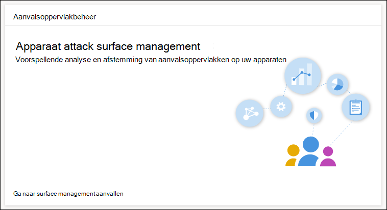
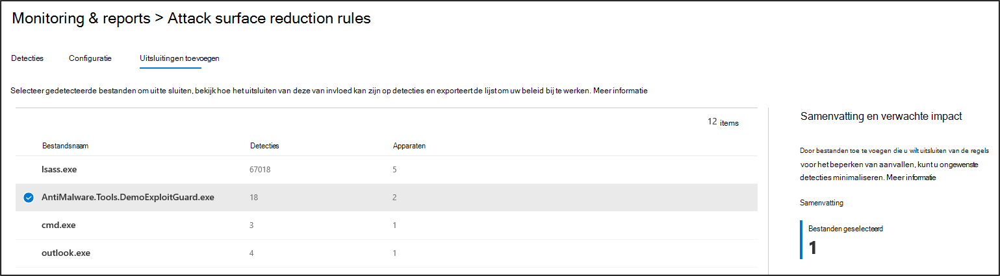

# Asr-regelimplementatie en -detecties optimaliserenOptimize ASR rule deployment and detections

[!INCLUDE [Microsoft 365 Defender rebranding](../../includes/microsoft-defender.md)]

**Van toepassing op:****Applies to:**
- [Microsoft Defender voor EindpuntMicrosoft Defender for Endpoint](https://go.microsoft.com/fwlink/p/?linkid=2154037)
- [Microsoft 365 DefenderMicrosoft 365 Defender](https://go.microsoft.com/fwlink/?linkid=2118804)

> Wilt u Defender voor Eindpunt ervaren?Want to experience Defender for Endpoint? [Meld u aan voor een gratis proefabonnement.](https://www.microsoft.com/en-us/WindowsForBusiness/windows-atp?ocid=docs-wdatp-onboardconfigure-abovefoldlink)[Sign up for a free trial](https://www.microsoft.com/en-us/WindowsForBusiness/windows-atp?ocid=docs-wdatp-onboardconfigure-abovefoldlink).

[Asr-regels (Attack Surface Reduction)](./attack-surface-reduction.md) identificeren en voorkomen typische malware-exploits.[Attack surface reduction (ASR) rules](./attack-surface-reduction.md) identify and prevent typical malware exploits. Ze bepalen wanneer en hoe potentieel schadelijke code kan worden uitgevoerd.They control when and how potentially malicious code can run. Ze kunnen bijvoorbeeld voorkomen dat JavaScript of VBScript een gedownloade uitvoerbare start, Win32 API-oproepen van Office-macro's blokkeren en processen blokkeren die worden uitgevoerd via USB-stations.For example, they can prevent JavaScript or VBScript from launching a downloaded executable, block Win32 API calls from Office macros, and block processes that run from USB drives.

 
*Surface-beheerkaart voor aanvallen**Attack surface management card*

De *Surface Management-kaart Attack* is een toegangspunt voor hulpmiddelen in Microsoft 365 beveiligingscentrum waarmee u het volgende kunt doen:The *Attack surface management card* is an entry point to tools in Microsoft 365 security center that you can use to:

* Meer inzicht in de manier waarop ASR-regels momenteel worden geïmplementeerd in uw organisatie.Understand how ASR rules are currently deployed in your organization.
* Controleer ASR-detecties en identificeer mogelijke onjuiste detecties.Review ASR detections and identify possible incorrect detections.
* Analyseer de impact van uitsluitingen en genereer de lijst met bestandspaden die u wilt uitsluiten.Analyze the impact of exclusions and generate the list of file paths to exclude.

Selecteer **Ga naar aanval op surface management** Monitoring & rapporten > Attack surface reduction rules > Add  >  **exclusions**.Select **Go to attack surface management** > **Monitoring & reports > Attack surface reduction rules > Add exclusions**. Hier kunt u naar andere secties van het Microsoft 365 gaan.From there, you can navigate to other sections of Microsoft 365 security center.

 
Het ***tabblad Uitsluitingen toevoegen** op de pagina Surface-regels voor aanvallen in Microsoft 365 beveiligingscentrum*The ***Add exclusions** tab in the Attack surface reduction rules page in Microsoft 365 security center*

> [!NOTE]
> Als u Microsoft 365 beveiligingscentrum wilt openen, hebt u een Microsoft 365 E3 of E5-licentie en een account met bepaalde rollen in Azure Active Directory.To access Microsoft 365 security center, you need a Microsoft 365 E3 or E5 license and an account that has certain roles on Azure Active Directory. [Lees meer over vereiste licenties en machtigingen.](/office365/securitycompliance/microsoft-security-and-compliance#required-licenses-and-permissions)[Read about required licenses and permissions](/office365/securitycompliance/microsoft-security-and-compliance#required-licenses-and-permissions).

Zie ASR-regelimplementatie en -detecties bewaken en beheren voor meer informatie over de implementatie van ASR-regels in Microsoft 365 [beveiligingscentrum.](/office365/securitycompliance/monitor-devices#monitor-and-manage-asr-rule-deployment-and-detections)For more information about ASR rule deployment in Microsoft 365 security center, see [Monitor and manage ASR rule deployment and detections](/office365/securitycompliance/monitor-devices#monitor-and-manage-asr-rule-deployment-and-detections).

**Verwante onderwerpen****Related topics**

* [Controleren of uw apparaten juist zijn geconfigureerdEnsure your devices are configured properly](configure-machines.md)
* [Apparaten in gebruik nemen bij Microsoft Defender voor EindpuntGet devices onboarded to Microsoft Defender for Endpoint](configure-machines-onboarding.md)
* [Naleving van de beveiligingslijn van Microsoft Defender voor eindpunt controlerenMonitor compliance to the Microsoft Defender for Endpoint security baseline](configure-machines-security-baseline.md)
