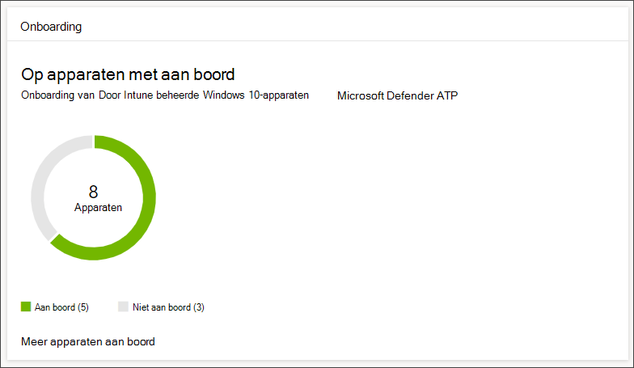
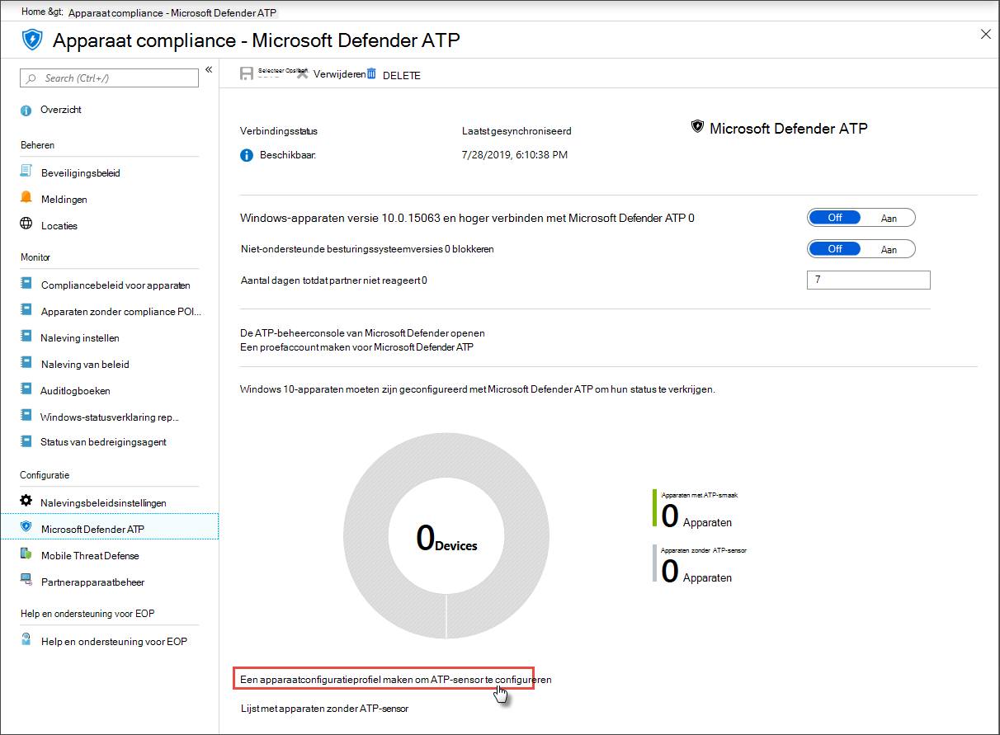

# Apparaten in gebruik nemen bij Microsoft Defender voor EindpuntGet devices onboarded to Microsoft Defender for Endpoint

[!INCLUDE [Microsoft 365 Defender rebranding](../../includes/microsoft-defender.md)]

**Van toepassing op:****Applies to:**
- [Microsoft Defender voor EindpuntMicrosoft Defender for Endpoint](https://go.microsoft.com/fwlink/p/?linkid=2154037)
- [Microsoft 365 DefenderMicrosoft 365 Defender](https://go.microsoft.com/fwlink/?linkid=2118804)

>Wilt u Microsoft Defender voor Eindpunt ervaren?Want to experience Microsoft Defender for Endpoint? [Meld u aan voor een gratis proefabonnement.Sign up for a free trial.](https://www.microsoft.com/microsoft-365/windows/microsoft-defender-atp?ocid=docs-wdatp-onboardconfigure-abovefoldlink)

Elk onboarded apparaat voegt een extra EDR-sensor (EndPoint Detection and Response) toe en vergroot de zichtbaarheid van inbreukactiviteiten in uw netwerk.Each onboarded device adds an additional endpoint detection and response (EDR) sensor and increases visibility over breach activity in your network. Onboarding zorgt er ook voor dat een apparaat kan worden gecontroleerd op kwetsbare onderdelen, evenals beveiligingsconfiguratieproblemen en kritieke herstelacties kan ontvangen tijdens aanvallen.Onboarding also ensures that a device can be checked for vulnerable components as well security configuration issues and can receive critical remediation actions during attacks.

Voordat u onboarding van apparaten kunt bijhouden en beheren:Before you can track and manage onboarding of devices:
- [Uw apparaten registreren voor Intune-beheerEnroll your devices to Intune management](configure-machines.md#enroll-devices-to-intune-management)
- [Zorg ervoor dat u de benodigde machtigingen hebtEnsure you have the necessary permissions](configure-machines.md#obtain-required-permissions)

## Niet-beveiligde apparaten ontdekken en bijhoudenDiscover and track unprotected devices

De **Onboarding-kaart** biedt een overzicht op hoog niveau van uw onboardingsnelheid door het aantal Windows 10-apparaten dat daadwerkelijk is ge onboarded bij Defender for Endpoint te vergelijken met het totale aantal door Intune beheerde Windows 10-apparaten.The **Onboarding** card provides a high-level overview of your onboarding rate by comparing the number of Windows 10 devices that have actually onboarded to Defender for Endpoint against the total number of Intune-managed Windows 10 devices.

 
*Kaart met onboarded-apparaten in vergelijking met het totale aantal door Intune beheerde Windows 10-apparaten**Card showing onboarded devices compared to the total number of Intune-managed Windows 10 device*

>[!NOTE]
>Als u Security Center Configuration Manager, het onboarding-script of andere onboarding-methoden hebt gebruikt die geen Intune-profielen gebruiken, kunnen er gegevensverschillen zijn.If you used Security Center Configuration Manager, the onboarding script, or other onboarding methods that don’t use Intune profiles, you might encounter data discrepancies. Als u deze verschillen wilt oplossen, maakt u een bijbehorend Intune-configuratieprofiel voor Defender voor endpoint-onboarding en wijst u dat profiel toe aan uw apparaten.To resolve these discrepancies, create a corresponding Intune configuration profile for Defender for Endpoint onboarding and assign that profile to your devices.

## Meer apparaten aan boord met Intune-profielenOnboard more devices with Intune profiles

Defender voor Eindpunt biedt verschillende handige opties voor [het onboarden van Windows 10-apparaten.](onboard-configure.md)Defender for Endpoint provides several convenient options for [onboarding Windows 10 devices](onboard-configure.md). Voor door Intune beheerde apparaten kunt u echter Intune-profielen gebruiken om de Defender for Endpoint-sensor eenvoudig te implementeren om apparaten te selecteren, zodat deze apparaten effectief aan de service worden ge onboardd.For Intune-managed devices, however, you can leverage Intune profiles to conveniently deploy the Defender for Endpoint sensor to select devices, effectively onboarding these devices to the service.

Selecteer op **de Onboarding-kaart** **Meer apparaten onboarden om** een profiel op Intune te maken en toe te wijzen.From the **Onboarding** card, select **Onboard more devices** to create and assign a profile on Intune. De koppeling brengt u naar de pagina apparaat compliance op Intune, die een vergelijkbaar overzicht biedt van uw onboarding-status.The link takes you to the device compliance page on Intune, which provides a similar overview of your onboarding state.

 
   *Microsoft Defender for Endpoint device compliance page on Intune device management**Microsoft Defender for Endpoint device compliance page on Intune device management*

>[!TIP]
>U kunt ook navigeren naar de compliancepagina van Defender voor eindpunten in de [Microsoft Azure-portal](https://portal.azure.com/) van **Alle services > Intune > Apparaat compliance > Microsoft Defender ATP.**Alternatively, you can navigate to the Defender for Endpoint onboarding compliance page in the [Microsoft Azure portal](https://portal.azure.com/) from **All services > Intune > Device compliance > Microsoft Defender ATP**.

>[!NOTE]
> Als u de meest recente apparaatgegevens wilt bekijken, klikt u op Lijst met **apparaten zonder ATP-sensor.**If you want to view the most up-to-date device data, click on **List of devices without ATP sensor**.

Maak op de pagina apparaat compliance een configuratieprofiel speciaal voor de implementatie van de Defender for Endpoint-sensor en wijs dat profiel toe aan de apparaten die u wilt onboarden.From the device compliance page, create a configuration profile specifically for the deployment of the Defender for Endpoint sensor and assign that profile to the devices you want to onboard. U kunt dit doen door het volgende te doen:To do this, you can either:

- Selecteer **Een apparaatconfiguratieprofiel maken om ATP-sensor** te configureren om te beginnen met een vooraf gedefinieerd apparaatconfiguratieprofiel.Select **Create a device configuration profile to configure ATP sensor** to start with a predefined device configuration profile.
- Maak het apparaatconfiguratieprofiel vanaf het begin.Create the device configuration profile from scratch.

Lees voor meer informatie [over het gebruik van intune-apparaatconfiguratieprofielen voor onboard-apparaten naar Defender voor Eindpunt.](https://docs.microsoft.com/intune/advanced-threat-protection#onboard-devices-by-using-a-configuration-profile)For more information, [read about using Intune device configuration profiles to onboard devices to Defender for Endpoint](https://docs.microsoft.com/intune/advanced-threat-protection#onboard-devices-by-using-a-configuration-profile).

>Wilt u Microsoft Defender ATP ervaren?Want to experience Microsoft Defender ATP? [Meld u aan voor een gratis proefabonnement.Sign up for a free trial.](https://www.microsoft.com/microsoft-365/windows/microsoft-defender-atp?ocid=docs-wdatp-onboardconfigure-belowfoldlink)

## Verwante onderwerpenRelated topics
- [Controleren of uw apparaten juist zijn geconfigureerdEnsure your devices are configured properly](configure-machines.md)
- [Naleving van de beveiligingslijn defender voor eindpunt verhogenIncrease compliance to the Defender for Endpoint security baseline](configure-machines-security-baseline.md)
- [Asr-regelimplementatie en -detecties optimaliserenOptimize ASR rule deployment and detections](configure-machines-asr.md)
