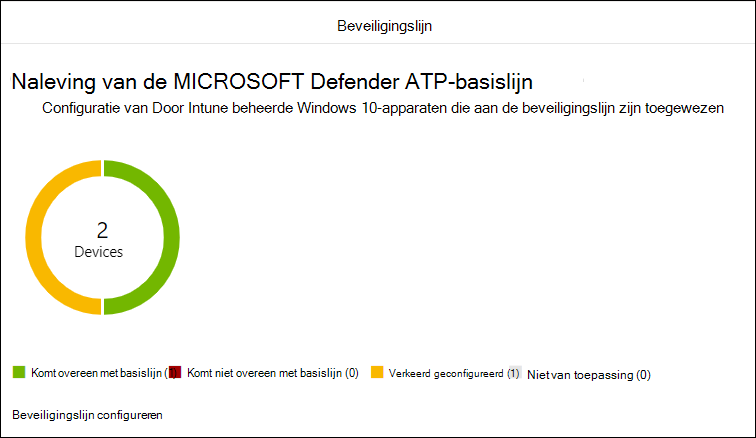
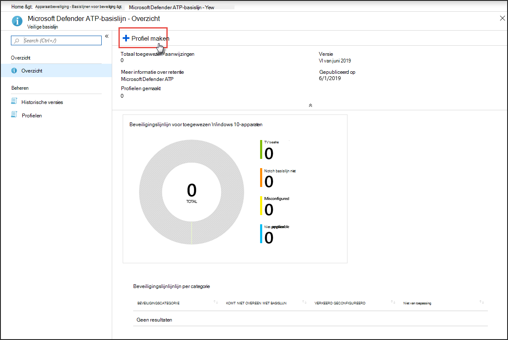
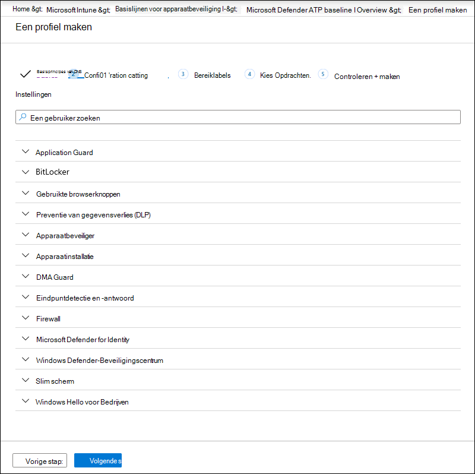
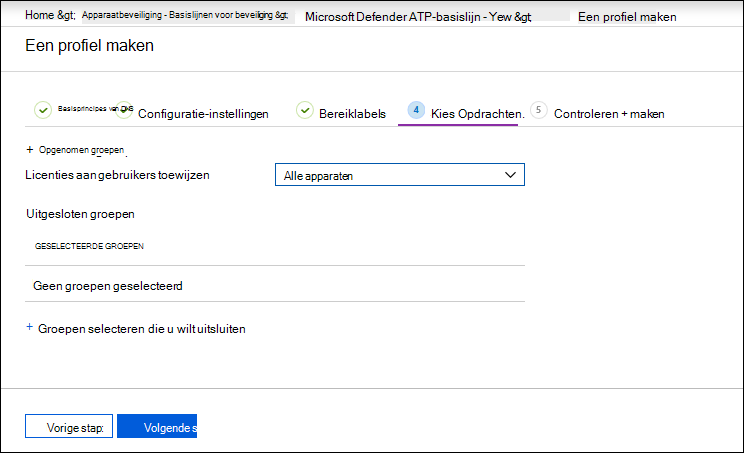
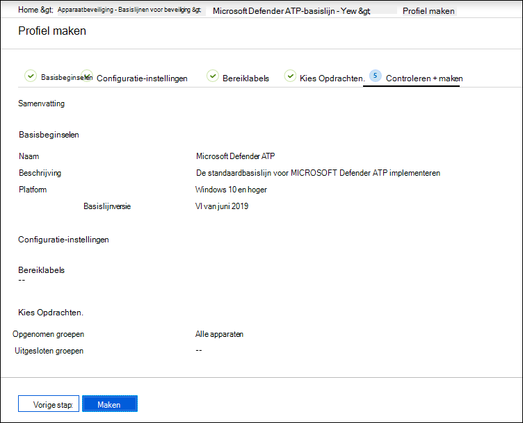

# Naleving van de beveiligingslijn van Microsoft Defender voor eindpunten verhogen

[!INCLUDE [Microsoft 365 Defender rebranding](../../includes/microsoft-defender.md)]

**Van toepassing op:**
- [Microsoft Defender voor Eindpunt](https://go.microsoft.com/fwlink/p/?linkid=2154037)
- [Microsoft 365 Defender](https://go.microsoft.com/fwlink/?linkid=2118804)

>Wilt u Defender voor Eindpunt ervaren? [Meld u aan voor een gratis proefabonnement.](https://www.microsoft.com/microsoft-365/windows/microsoft-defender-atp?ocid=docs-wdatp-onboardconfigure-abovefoldlink)

Beveiligingslijnlijnen zorgen ervoor dat beveiligingsfuncties zijn geconfigureerd op basis van richtlijnen van zowel beveiligingsdeskundigen als Windows systeembeheerders. Wanneer de beveiligingslijn defender voor eindpunt wordt geïmplementeerd, stelt de beveiligingslijn Defender voor eindpuntbeveiligingsbesturingselementen in om optimale beveiliging te bieden.

Lees deze veelgestelde vragen voor meer informatie over beveiligingslijnlijnen en hoe deze zijn toegewezen aan Intune met behulp [van configuratieprofielen.](/intune/security-baselines#q--a)

Voordat u compliance kunt implementeren en bijhouden naar beveiligingslijnlijnen:
- [Uw apparaten registreren voor Intune-beheer](configure-machines.md#enroll-devices-to-intune-management)
- [Zorg ervoor dat u de benodigde machtigingen hebt](configure-machines.md#obtain-required-permissions)

## Vergelijk de Microsoft Defender voor Eindpunt en de Windows intune-beveiligingslijnlijnen
De Windows Beveiligingslijn van Intune bevat een uitgebreide set aanbevolen instellingen die nodig zijn om apparaten met Windows veilig te configureren, waaronder browserinstellingen, PowerShell-instellingen en instellingen voor sommige beveiligingsfuncties, zoals Microsoft Defender Antivirus. De basislijn van Defender voor eindpunt biedt daarentegen instellingen voor het optimaliseren van alle beveiligingsbesturingselementen in de Defender for Endpoint-stapel, inclusief instellingen voor eindpuntdetectie en -respons (EDR) en instellingen die ook worden gevonden in de beveiligingslijn van Windows Intune. Zie voor meer informatie over elke basislijn:

- [Windows beveiligingslijninstellingen voor Intune](/intune/security-baseline-settings-windows)
- [Basislijninstellingen voor Microsoft Defender voor Eindpunt voor Intune](/intune/security-baseline-settings-defender-atp)

In het ideale ideale moment worden apparaten die zijn aan boord van Defender voor Eindpunt, beide basislijnen geïmplementeerd: de beveiligingslijn Windows Intune om Windows in eerste instantie te beveiligen en vervolgens de beveiligingslijn van Defender voor eindpunt boven aan elkaar om de beveiligingsbesturingselementen van Defender voor eindpunten optimaal te configureren. Als u wilt profiteren van de meest recente gegevens over risico's en bedreigingen en conflicten wilt minimaliseren naarmate basislijnen zich ontwikkelen, moet u altijd de meest recente versies van de basislijnen toepassen op alle producten zodra ze worden uitgebracht.

>[!NOTE]
>De beveiligingslijn van Defender voor eindpunt is geoptimaliseerd voor fysieke apparaten en wordt momenteel niet aanbevolen voor gebruik op virtuele machine- of VDI-eindpunten. Bepaalde basislijninstellingen kunnen van invloed zijn op interactieve sessies op afstand in gevirtualiseerde omgevingen.

## Naleving van de beveiligingslijn van Defender voor Eindpunt controleren

De **basislijnkaart** Beveiliging voor [apparaatconfiguratiebeheer](configure-machines.md) biedt een overzicht van de naleving op Windows 10 apparaten die zijn toegewezen aan de beveiligingslijn Defender voor eindpunt.

 
*Kaart met naleving van de beveiligingslijn van Defender voor Eindpunt*

Elk apparaat krijgt een van de volgende statustypen:

- **Komt overeen met basislijn**: apparaatinstellingen komen overeen met alle instellingen in de basislijn
- **Komt niet overeen met basislijn:** ten minste één apparaatinstelling komt niet overeen met de basislijn
- **Verkeerd geconfigureerd:** ten minste één basislijninstelling is niet correct geconfigureerd op het apparaat en heeft een conflict, fout of status in behandeling
- **Niet van toepassing:** ten minste één basislijninstelling is niet van toepassing op het apparaat

Als u specifieke apparaten wilt controleren, **selecteert u Beveiligingslijn configureren** op de kaart. Hiermee gaat u naar Intune-apparaatbeheer. Selecteer vervolgens **Apparaatstatus voor** de namen en statussen van de apparaten.

>[!NOTE]
>Er kunnen verschillen zijn in samengevoegde gegevens die worden weergegeven op de pagina apparaatconfiguratiebeheer en die worden weergegeven op overzichtsschermen in Intune.

## De beveiligingslijn van Microsoft Defender voor eindpunten controleren en toewijzen

Apparaatconfiguratiebeheer controleert alleen de naleving van basislijn van Windows 10 apparaten die specifiek zijn toegewezen aan de beveiligingslijn van Microsoft Defender voor eindpunt. U kunt de basislijn eenvoudig bekijken en deze toewijzen aan apparaten op Intune-apparaatbeheer.

1. Selecteer **Beveiligingslijn configureren** op de **basislijnkaart** Beveiliging om naar Apparaatbeheer in Intune te gaan. Er wordt een vergelijkbaar overzicht van de naleving van de basislijn weergegeven.

   >[!TIP]
   > U kunt ook naar de beveiligingslijn van Defender voor eindpunt in de Microsoft Azure-portal gaan vanuit Alle **services > Intune > Beveiligings- > Beveiligingslijnlijnen > Microsoft Defender ATP basislijn.**

2. Een nieuw profiel maken.

    
   *Overzicht van beveiligingslijn van Microsoft Defender voor eindpunt op Intune*

3. Tijdens het maken van een profiel kunt u specifieke instellingen op de basislijn controleren en aanpassen.

    
   *Opties voor beveiligingslijn tijdens het maken van een profiel op Intune*

4. Wijs het profiel toe aan de juiste apparaatgroep.

    
   *Het beveiligingslijnprofiel toewijzen aan Intune*

5. Maak het profiel om het op te slaan en te implementeren in de toegewezen apparaatgroep.

    
   *Het beveiligingslijnprofiel maken op Intune*

>[!TIP]
>Beveiligingslijnlijnen op Intune bieden een handige manier om uw apparaten volledig te beveiligen en te beveiligen. [Meer informatie over beveiligingslijnlijnen op Intune](/intune/security-baselines).

>Wilt u Microsoft Defender voor Eindpunt ervaren? [Meld u aan voor een gratis proefabonnement.](https://www.microsoft.com/microsoft-365/windows/microsoft-defender-atp?ocid=docs-wdatp-onboardconfigure-belowfoldlink)

## Verwante onderwerpen
- [Controleren of uw apparaten juist zijn geconfigureerd](configure-machines.md)
- [Apparaten in gebruik nemen bij Microsoft Defender voor Eindpunt](configure-machines-onboarding.md)
- [Asr-regelimplementatie en -detecties optimaliseren](configure-machines-asr.md)
