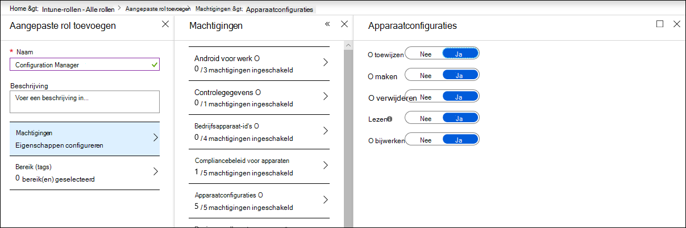

# Controleren of uw apparaten juist zijn geconfigureerdEnsure your devices are configured properly

[!INCLUDE [Microsoft 365 Defender rebranding](../../includes/microsoft-defender.md)]

**Van toepassing op:****Applies to:**
- [Microsoft Defender voor EindpuntMicrosoft Defender for Endpoint](https://go.microsoft.com/fwlink/p/?linkid=2154037)
- [Microsoft 365 DefenderMicrosoft 365 Defender](https://go.microsoft.com/fwlink/?linkid=2118804)

>Wilt u Defender voor Eindpunt ervaren?Want to experience Defender for Endpoint? [Meld u aan voor een gratis proefabonnement.Sign up for a free trial.](https://www.microsoft.com/microsoft-365/windows/microsoft-defender-atp?ocid=docs-wdatp-onboardconfigure-abovefoldlink)

Met goed geconfigureerde apparaten kunt u de algehele tolerantie tegen bedreigingen vergroten en uw vermogen verbeteren om aanvallen te detecteren en te beantwoorden.With properly configured devices, you can boost overall resilience against threats and enhance your capability to detect and respond to attacks. Beveiligingsconfiguratiebeheer zorgt ervoor dat uw apparaten:Security configuration management helps ensure that your devices:

- Onboard to Microsoft Defender for EndpointOnboard to Microsoft Defender for Endpoint
- Voldoen aan of overschrijden van de beveiligingslijnconfiguratie van Defender for EndpointMeet or exceed the Defender for Endpoint security baseline configuration
- Strategische risicobeperking op het oppervlak van de aanval toepassenHave strategic attack surface mitigations in place

Klik **in het** navigatiemenu op Configuratiebeheer om de pagina Apparaatconfiguratiebeheer te openen.Click **Configuration management** from the navigation menu to open the Device configuration management page.

 
*Pagina Apparaatconfiguratiebeheer**Device configuration management page*

U kunt de configuratiestatus op organisatieniveau bijhouden en snel actie ondernemen in reactie op slechte onboarding-dekking, complianceproblemen en slecht geoptimaliseerde risico's voor aanvallen via directe, diepe koppelingen naar pagina's voor apparaatbeheer op Microsoft Intune en Microsoft 365 beveiligingscentrum.You can track configuration status at an organizational level and quickly take action in response to poor onboarding coverage, compliance issues, and poorly optimized attack surface mitigations through direct, deep links to device management pages on Microsoft Intune and Microsoft 365 security center.

Daarbij profiteert u van:In doing so, you benefit from:
- Uitgebreide zichtbaarheid van de gebeurtenissen op uw apparatenComprehensive visibility of the events on your devices
- Krachtige bedreigingsinformatie en krachtige leertechnologieën voor apparaten voor het verwerken van onbewerkte gebeurtenissen en het identificeren van de inbreukactiviteit en bedreigingsindicatorenRobust threat intelligence and powerful device learning technologies for processing raw events and identifying the breach activity and threat indicators
- Een volledige stapel beveiligingsfuncties die zijn geconfigureerd om de installatie van schadelijke implantaten, het kapen van systeembestanden en -processen, gegevens exfiltratie en andere bedreigingsactiviteiten efficiënt te stoppenA full stack of security features configured to efficiently stop the installation of malicious implants, hijacking of system files and process, data exfiltration, and other threat activities
- Geoptimaliseerde risico's voor aanvallen op het oppervlak, het maximaliseren van strategische verdediging tegen bedreigingsactiviteit en het minimaliseren van de invloed op de productiviteitOptimized attack surface mitigations, maximizing strategic defenses against threat activity while minimizing impact to productivity

## Apparaten registreren voor Intune-beheerEnroll devices to Intune management

Apparaatconfiguratiebeheer werkt nauw samen met Intune-apparaatbeheer om de inventaris van de apparaten in uw organisatie en de basislijnbeveiligingsconfiguratie vast te stellen.Device configuration management works closely with Intune device management to establish the inventory of the devices in your organization and the baseline security configuration. U kunt configuratieproblemen bijhouden en beheren op intune-beheerde Windows 10 apparaten.You will be able to track and manage configuration issues on Intune-managed Windows 10 devices.

Voordat u ervoor kunt zorgen dat uw apparaten correct zijn geconfigureerd, moet u deze registreren bij Intune-beheer.Before you can ensure your devices are configured properly, enroll them to Intune management. Intune-inschrijving is robuust en heeft verschillende registratieopties voor Windows 10 apparaten.Intune enrollment is robust and has several enrollment options for Windows 10 devices. Meer informatie over inschrijfopties voor Intune vindt u in het instellen van registratie voor [Windows apparaten.](/intune/windows-enroll)For more information about Intune enrollment options, read about [setting up enrollment for Windows devices](/intune/windows-enroll).

>[!NOTE]
>Als u Windows in Intune wilt registreren, moeten beheerders al licenties zijn toegewezen.To enroll Windows devices to Intune, administrators must have already been assigned licenses. [Lees meer over het toewijzen van licenties voor apparaatinschrijving.](/intune/licenses-assign)[Read about assigning licenses for device enrollment](/intune/licenses-assign).

>[!TIP] 
>Als u apparaatbeheer wilt optimaliseren via Intune, verbindt u [Intune met Defender voor Eindpunt.](/intune/advanced-threat-protection#enable-windows-defender-atp-in-intune)To optimize device management through Intune, [connect Intune to Defender for Endpoint](/intune/advanced-threat-protection#enable-windows-defender-atp-in-intune).

## Vereiste machtigingen verkrijgenObtain required permissions
Standaard kunnen alleen gebruikers die de globale beheerder of de rol van Intune-servicebeheerder in Azure AD hebben toegewezen, de apparaatconfiguratieprofielen beheren en toewijzen die nodig zijn voor onboarding-apparaten en de beveiligingslijn implementeren.By default, only users who have been assigned the Global Administrator or the Intune Service Administrator role on Azure AD can manage and assign the device configuration profiles needed for onboarding devices and deploying the security baseline.

Als u andere rollen hebt toegewezen, moet u ervoor zorgen dat u de benodigde machtigingen hebt:If you have been assigned other roles, ensure you have the necessary permissions:

- Volledige machtigingen voor apparaatconfiguratiesFull permissions to device configurations
- Volledige machtigingen voor beveiligingslijnlijnenFull permissions to security baselines
- Leesmachtigingen voor apparaat compliancebeleidRead permissions to device compliance policies
- Leesmachtigingen voor de organisatieRead permissions to the organization

 
*Apparaatconfiguratiemachtigingen voor Intune**Device configuration permissions on Intune*

>[!TIP] 
>Lees meer over het maken van aangepaste rollen voor meer informatie over het toewijzen van machtigingen aan Intune.To learn more about assigning permissions on Intune, [read about creating custom roles](/intune/create-custom-role#to-create-a-custom-role).

## In deze sectieIn this section
OnderwerpTopic | BeschrijvingDescription
:---|:---
[Apparaten in gebruik nemen bij Defender voor EindpuntGet devices onboarded to Defender for Endpoint](configure-machines-onboarding.md)| Volg de onboarding-status van door Intune beheerde apparaten en onboard meer apparaten via Intune.Track onboarding status of Intune-managed devices and onboard more devices through Intune. 
[Naleving van de beveiligingslijn defender voor eindpunt verhogenIncrease compliance to the Defender for Endpoint security baseline](configure-machines-security-baseline.md) | Houd de naleving van de basislijn en niet-naleving bij.Track baseline compliance and noncompliance. Implementeer de beveiligingslijn naar meer door Intune beheerde apparaten.Deploy the security baseline to more Intune-managed devices.
[Asr-regelimplementatie en -detecties optimaliserenOptimize ASR rule deployment and detections](configure-machines-asr.md) | Controleer de implementatie van regels en pas detecties aan met behulp van hulpmiddelen voor effectanalyse in Microsoft 365 beveiligingscentrum.Review rule deployment and tweak detections using impact analysis tools in Microsoft 365 security center.

>Wilt u Defender voor Eindpunt ervaren?Want to experience Defender for Endpoint? [Meld u aan voor een gratis proefabonnement.Sign up for a free trial.](https://www.microsoft.com/microsoft-365/windows/microsoft-defender-atp?ocid=docs-wdatp-onboardconfigure-belowfoldlink)
