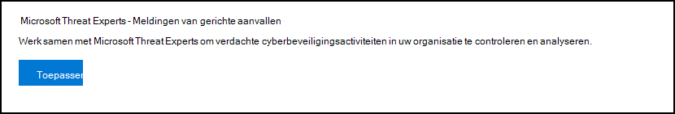
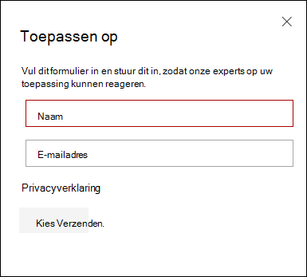
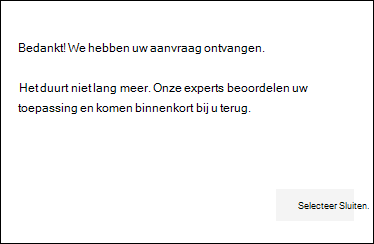
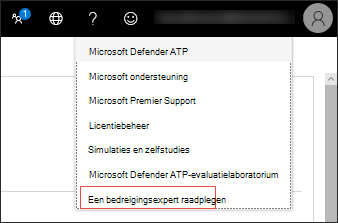
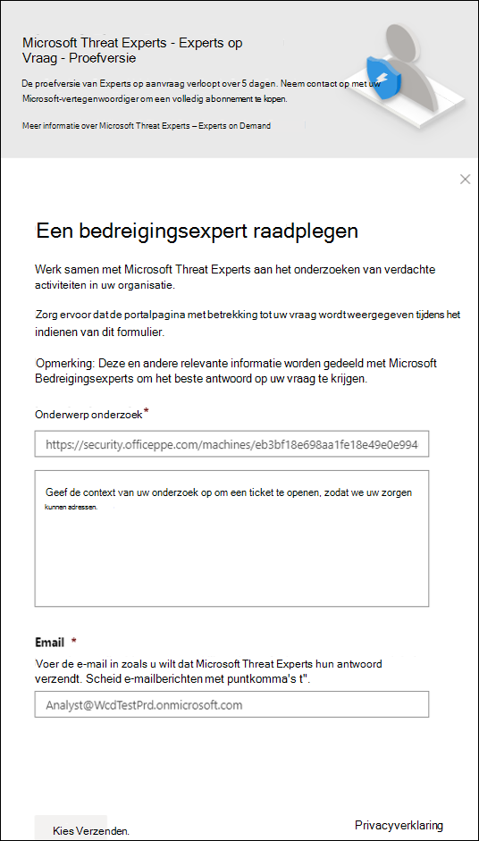
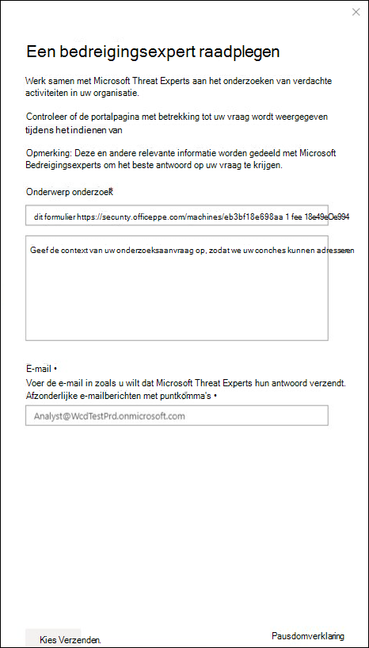

# Mogelijkheden van Microsoft Threat Experts configureren en beheren

[!INCLUDE [Microsoft 365 Defender rebranding](../../includes/microsoft-defender.md)]

**Van toepassing op:**
- [Microsoft Defender voor Eindpunt](https://go.microsoft.com/fwlink/p/?linkid=2154037)
- [Microsoft 365 Defender](https://go.microsoft.com/fwlink/?linkid=2118804)

>Wilt u Defender voor Eindpunt ervaren? [Meld u aan voor een gratis proefabonnement.](https://www.microsoft.com/microsoft-365/windows/microsoft-defender-atp?ocid=docs-wdatp-assignaccess-abovefoldlink)

## Voordat u begint 
> [!NOTE]
> Bespreek de geschiktheidsvereisten met uw Microsoft Technical Service-provider en accountteam voordat u een aanvraag voor Microsoft Threat Experts - Targeted Attack Notification managed threat hunting service.

Zorg ervoor dat Defender voor Eindpunt is geïmplementeerd in uw omgeving met apparaten die zijn geregistreerd, en niet alleen op een laboratoriumset-up.

Als u een Defender voor Eindpunt-klant bent, moet u **Microsoft Threat Experts - Targeted Attack Notifications** aanvragen om speciale inzichten en analyses te krijgen om de meest kritieke bedreigingen te identificeren, zodat u er snel op kunt reageren. Neem contact op met uw accountteam of Microsoft-vertegenwoordiger om u te abonneren op Microsoft Threat Experts **- Experts op aanvraag** om contact op te nemen met onze bedreigingsexperts over relevante detecties en tegens.

## Aanvragen voor Microsoft Threat Experts - Targeted Attack Notifications-service 
Als u al een Defender voor Eindpunt-klant bent, kunt u dit toepassen via de Microsoft Defender-beveiligingscentrum. 

1. Ga in het navigatiedeelvenster **naar Instellingen > Algemene > Geavanceerde functies > Microsoft Threat Experts - Targeted Attack Notifications**.

2. Klik op **Toepassen**.

    

3. Voer uw naam en e-mailadres in, zodat Microsoft weer contact met u op kan nemen in uw toepassing.

    

4. Lees de [privacyverklaring](https://privacy.microsoft.com/en-us/privacystatement)en klik op **Verzenden** wanneer u klaar bent. U ontvangt een welkomst-e-mail zodra uw toepassing is goedgekeurd.

    

Wanneer u wordt geaccepteerd, ontvangt u een  welkomst-e-mailbericht en ziet u de knop Toepassen wijzigen in een wisselknop die 'aan' is. Als u uzelf wilt uitschakelen bij de service Meldingen voor gerichte aanvallen,  schuift u de schakelknop 'uit' en klikt u onder aan de pagina op Voorkeuren opslaan. 

## Waar ziet u de meldingen van gerichte aanvallen van Microsoft Threat Experts 
U kunt een gerichte aanvalsmelding ontvangen van Microsoft Threat Experts via het volgende medium:  
- De pagina Incidenten van de Defender for **Endpoint-portal** 
- Het dashboard Waarschuwingen van de Defender for **Endpoint-portal**  
- OData alerting [API](/windows/security/threat-protection/microsoft-defender-atp/get-alerts) and [REST API](/windows/security/threat-protection/microsoft-defender-atp/pull-alerts-using-rest-api)
- [DeviceAlertEvents](/windows/security/threat-protection/microsoft-defender-atp/advanced-hunting-devicealertevents-table) table in Advanced hunting
- Uw e-mail, als u ervoor kiest om het te configureren 

Als u gerichte aanvalsmeldingen via e-mail wilt ontvangen, maakt u een regel voor e-mailmeldingen.

### Een meldingsregel voor e-mail maken 
U kunt regels maken voor het verzenden van e-mailmeldingen voor geadresseerden van meldingen. Zie  [Meldingsmeldingen configureren voor](configure-email-notifications.md) het maken, bewerken, verwijderen of oplossen van e-mailmeldingen voor meer informatie.

## De melding voor een gerichte aanval weergeven  
U ontvangt een gerichte aanvalsmelding van Microsoft Threat Experts in uw e-mail nadat u uw systeem hebt geconfigureerd voor het ontvangen van een e-mailmelding.  

1. Klik op de koppeling in het e-mailbericht om naar de bijbehorende waarschuwingscontext te gaan in het dashboard met **bedreigingsexperts.** 

2. Selecteer in het dashboard hetzelfde waarschuwingsonderwerp dat u uit het e-mailbericht hebt gekregen om de details weer te geven.  

## Abonneren op Microsoft Threat Experts - Experts on Demand
Dit is beschikbaar als abonnementsservice. Als u al een Defender voor Eindpunt-klant bent, kunt u contact opnemen met uw Microsoft-vertegenwoordiger om u te abonneren op Microsoft Threat Experts - Experts on Demand. 

## Raadpleeg een Microsoft-bedreigingsexpert over verdachte cyberbeveiligingsactiviteiten in uw organisatie 
U kunt samenwerken met Microsoft Threat Experts die rechtstreeks vanuit de Microsoft Defender-beveiligingscentrum kunnen worden betrokken voor een tijdige en nauwkeurige reactie. Experts bieden inzichten om meer inzicht te krijgen in complexe bedreigingen, gerichte aanvalsmeldingen die u ontvangt, of als u meer informatie nodig hebt over de waarschuwingen, een mogelijk gecompromitteerd apparaat of een context voor bedreigingsinformatie die u ziet op uw portaldashboard. 

> [!NOTE]
> - Waarschuwingsvragen met betrekking tot de aangepaste bedreigingsinformatiegegevens van uw organisatie worden momenteel niet ondersteund. Raadpleeg uw beveiligingsbewerkingen of incidentresponsteam voor meer informatie.
> - U moet de machtiging **Beveiligingsinstellingen** beheren hebben in de portal van het beveiligingscentrum om een onderzoek naar een bedreigingsexpert te kunnen indienen.

1. Ga naar de portalpagina met de relevante informatie die u wilt onderzoeken, bijvoorbeeld de **pagina Incident.** Controleer of de pagina voor de relevante waarschuwing of het betreffende apparaat in beeld is voordat u een onderzoeksaanvraag verzendt. 

2. Klik in het rechterbovenmenu op de **?** . Selecteer vervolgens **Een bedreigingsexpert raadplegen.** 

    

    Er wordt een flyoutscherm geopend. In het volgende scherm ziet u wanneer u een proefabonnement hebt.

    

    In het volgende scherm ziet u wanneer u een volledig Microsoft Threat Experts - Experts on-Demand-abonnement.

    

    Het **onderwerpveld Onderzoek** wordt vooraf ingevuld met de koppeling naar de relevante pagina voor uw onderzoeksaanvraag. Bijvoorbeeld een koppeling naar de pagina met de details van het incident, de waarschuwing of het apparaat waarop u de aanvraag hebt ingediend.

3.  Geef in het volgende veld voldoende informatie op om de Microsoft Threat Experts context te geven om het onderzoek te starten.
  
4. Voer het e-mailadres in dat u wilt gebruiken om te corresponderen met Microsoft Threat Experts.

> [!NOTE]
> Als u de status van uw Experts on Demand-zaken wilt bijhouden via Microsoft Services Hub, kunt u contact op nemen met uw Technical Account Manager. 

Bekijk deze video voor een kort overzicht van de Microsoft Services Hub.

>[!VIDEO https://www.microsoft.com/videoplayer/embed/RE4pk9f] 

   
## Voorbeeld van onderzoeksonderwerpen die u kunt raadplegen met Microsoft Threat Experts - Experts on Demand 

**Waarschuwingsgegevens**
- We zien een nieuw type waarschuwing voor een living-off-the-land binary: [AlertID]. Kunt u ons meer vertellen over deze waarschuwing en hoe we verder kunnen onderzoeken?
- We hebben twee soortgelijke aanvallen waargenomen, die kwaadaardige PowerShell-scripts proberen uit te voeren, maar verschillende waarschuwingen genereren. De ene is 'Verdachte PowerShell-opdrachtregel' en het andere is 'Er is een schadelijk bestand gedetecteerd op basis van de indicatie die door O365 is verstrekt'. Wat is het verschil?
- Ik ontvang vandaag een oneven waarschuwing voor abnormaal aantal mislukte aanmeldingen vanaf het apparaat van een high profile gebruiker. Ik kan geen verder bewijs vinden rond deze aanmeldingspogingen. Hoe kan Defender voor Eindpunt deze pogingen zien? Welk type aanmeldingen wordt gecontroleerd?
- Kunt u meer context of inzichten geven over deze waarschuwing: 'Verdacht gedrag door een systeemprogramma is waargenomen'. 

**Mogelijk computercompromitteerd**
- Kunt u vragen waarom we 'Onbekend proces waargenomen' zien? Dit bericht of waarschuwing wordt vaak op veel apparaten weergegeven. We waarderen elke input om te verduidelijken of dit bericht of de waarschuwing betrekking heeft op schadelijke activiteiten.
- Kunt u helpen bij het valideren van een mogelijk compromis op het volgende systeem op [datum] met vergelijkbare gedragingen als de vorige malwaredetectie [malwarenaam] op hetzelfde systeem in [maand]?

**Details van bedreigingsinformatie**
- We hebben een phishing-e-mail gedetecteerd die een schadelijk Word-document aan een gebruiker heeft bezorgd. Het schadelijke Word-document heeft een reeks verdachte gebeurtenissen veroorzaakt, waardoor meerdere Waarschuwingen van Microsoft Defender voor [malwarenaam] malware werden geactiveerd. Hebt u informatie over deze malware? Zo ja, kunt u mij een koppeling sturen?
- Ik heb onlangs een [verwijzing naar sociale media, bijvoorbeeld Twitter of blog] gezien over een bedreiging die is gericht op mijn branche. Kunt u mij helpen begrijpen welke bescherming Defender voor Eindpunt biedt tegen deze bedreigingsacteur? 

**Microsoft Threat Experts waarschuwingscommunicatie** 
- Kan uw team voor incidentrespons ons helpen bij het adres van de gerichte aanvalmelding die we hebben ontvangen?
- Ik heb deze gerichte aanvalsmelding ontvangen van Microsoft Threat Experts. We hebben geen eigen team voor incidentrespons. Wat kunnen we nu doen en hoe kunnen we het incident bevatten?
- Ik heb een melding van een gerichte aanval ontvangen van Microsoft Threat Experts. Welke gegevens kunt u ons geven die we kunnen doorgeven aan ons team voor incidentrespons?

  >[!NOTE]
  >Microsoft Threat Experts is een beheerde cyberbeveiligingsjachtservice en geen incidentresponsservice. De experts kunnen het onderzoek echter naadloos overstappen op de services Detection and Response Team (DART) van Microsoft Cyberbeveiliging Solutions Group (CSG) indien nodig. U kunt er ook voor kiezen om contact op te nemen met uw eigen team voor incidentrespons om problemen aan te pakken die een reactie op incidenten vereisen. 

## Scenario

### Een voortgangsrapport ontvangen over uw beheerde onderzoek naar de jacht 
Het antwoord Microsoft Threat Experts afhankelijk van uw vraag. Ze sturen u binnen twee dagen een voortgangsrapport over uw **onderzoek** naar een bedreigingsexpert raadplegen om de onderzoeksstatus van de volgende categorieën over te geven: 
- Er is meer informatie nodig om het onderzoek voort te zetten 
- Een bestand of meerdere bestandsvoorbeelden zijn nodig om de technische context te bepalen 
- Onderzoek heeft meer tijd nodig   
- De eerste informatie was voldoende om het onderzoek af te ronden 

Het is belangrijk om snel te reageren om het onderzoek in beweging te houden. 

## Verwant onderwerp
- [Overzicht van Microsoft Threat Experts](microsoft-threat-experts.md)
- [Microsoft Threat Experts in Microsoft 365 Overzicht](/microsoft-365/security/mtp/microsoft-threat-experts)
