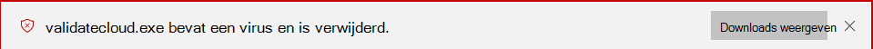

# <a name="configure-and-validate-microsoft-defender-antivirus-network-connections"></a><span data-ttu-id="772c6-104">Netwerkverbindingen van Microsoft Defender Antivirus configureren en valideren</span><span class="sxs-lookup"><span data-stu-id="772c6-104">Configure and validate Microsoft Defender Antivirus network connections</span></span>

<span data-ttu-id="772c6-105">**Van toepassing op:**</span><span class="sxs-lookup"><span data-stu-id="772c6-105">**Applies to:**</span></span>

- [<span data-ttu-id="772c6-106">Microsoft Defender voor Eindpunt</span><span class="sxs-lookup"><span data-stu-id="772c6-106">Microsoft Defender for Endpoint</span></span>](/microsoft-365/security/defender-endpoint/)

<span data-ttu-id="772c6-107">Als u Microsoft Defender Antivirus beveiliging in de cloud correct wilt laten werken, moet uw beveiligingsteam uw netwerk zo configureren dat verbindingen tussen uw eindpunten en bepaalde Microsoft-servers worden toegestaan.</span><span class="sxs-lookup"><span data-stu-id="772c6-107">To ensure Microsoft Defender Antivirus cloud-delivered protection works properly, your security team must configure your network to allow connections between your endpoints and certain Microsoft servers.</span></span> <span data-ttu-id="772c6-108">In dit artikel worden de verbindingen vermeld die moeten worden toegestaan, bijvoorbeeld met behulp van firewallregels, en worden instructies gegeven voor het valideren van uw verbinding.</span><span class="sxs-lookup"><span data-stu-id="772c6-108">This article lists the connections that must be allowed, such as by using firewall rules, and provides instructions for validating your connection.</span></span> <span data-ttu-id="772c6-109">Als u uw beveiliging correct configureert, kunt u ervoor zorgen dat u de beste waarde ontvangt van uw beveiligingsservices die in de cloud worden geleverd.</span><span class="sxs-lookup"><span data-stu-id="772c6-109">Configuring your protection properly helps ensure that you receive the best value from your cloud-delivered protection services.</span></span>

<span data-ttu-id="772c6-110">Zie het blogbericht [Belangrijke wijzigingen in het eindpunt van Microsoft Active Protection Services](https://techcommunity.microsoft.com/t5/Configuration-Manager-Archive/Important-changes-to-Microsoft-Active-Protection-Service-MAPS/ba-p/274006) voor meer informatie over netwerkconnectiviteit.</span><span class="sxs-lookup"><span data-stu-id="772c6-110">See the blog post [Important changes to Microsoft Active Protection Services endpoint](https://techcommunity.microsoft.com/t5/Configuration-Manager-Archive/Important-changes-to-Microsoft-Active-Protection-Service-MAPS/ba-p/274006) for some details about network connectivity.</span></span>

> [!TIP]
> <span data-ttu-id="772c6-111">Ga naar de demowebsite van Microsoft Defender voor Eindpunt demo.wd.microsoft.com [om](https://demo.wd.microsoft.com?ocid=cx-wddocs-testground) te bevestigen dat de volgende functies werken:</span><span class="sxs-lookup"><span data-stu-id="772c6-111">Visit the Microsoft Defender for Endpoint demo website at [demo.wd.microsoft.com](https://demo.wd.microsoft.com?ocid=cx-wddocs-testground) to confirm the following features are working:</span></span>
>
> - <span data-ttu-id="772c6-112">Cloudbeveiliging</span><span class="sxs-lookup"><span data-stu-id="772c6-112">Cloud-delivered protection</span></span>
> - <span data-ttu-id="772c6-113">Snel leren (inclusief blok op het eerste gezicht)</span><span class="sxs-lookup"><span data-stu-id="772c6-113">Fast learning (including block at first sight)</span></span>
> - <span data-ttu-id="772c6-114">Mogelijk ongewenste blokkering van toepassingen</span><span class="sxs-lookup"><span data-stu-id="772c6-114">Potentially unwanted application blocking</span></span>

## <a name="allow-connections-to-the-microsoft-defender-antivirus-cloud-service"></a><span data-ttu-id="772c6-115">Verbindingen met de Microsoft Defender Antivirus cloudservice toestaan</span><span class="sxs-lookup"><span data-stu-id="772c6-115">Allow connections to the Microsoft Defender Antivirus cloud service</span></span>

<span data-ttu-id="772c6-116">De Microsoft Defender Antivirus cloudservice biedt snelle, sterke beveiliging voor uw eindpunten.</span><span class="sxs-lookup"><span data-stu-id="772c6-116">The Microsoft Defender Antivirus cloud service provides fast, strong protection for your endpoints.</span></span> <span data-ttu-id="772c6-117">Het inschakelen van de door de cloud geleverde beveiligingsservice is optioneel, maar het wordt ten zeerste aanbevolen omdat deze belangrijke bescherming biedt tegen malware op uw eindpunten en in uw netwerk.</span><span class="sxs-lookup"><span data-stu-id="772c6-117">Enabling the cloud-delivered protection service is optional, however it's highly recommended because it provides important protection against malware on your endpoints and across your network.</span></span> <span data-ttu-id="772c6-118">Zie [Beveiliging in de cloud](enable-cloud-protection-microsoft-defender-antivirus.md) inschakelen voor meer informatie over het inschakelen van de service met Intune, Microsoft Endpoint Configuration Manager, Groepsbeleid, PowerShell-cmdlets of op afzonderlijke clients in de Windows-beveiliging app.</span><span class="sxs-lookup"><span data-stu-id="772c6-118">See [Enable cloud-delivered protection](enable-cloud-protection-microsoft-defender-antivirus.md) for details on enabling the service with Intune, Microsoft Endpoint Configuration Manager, Group Policy, PowerShell cmdlets, or on individual clients in the Windows Security app.</span></span> 

<span data-ttu-id="772c6-119">Nadat u de service hebt ingeschakeld, moet u mogelijk uw netwerk of firewall configureren om verbindingen tussen de service en uw eindpunten toe te staan.</span><span class="sxs-lookup"><span data-stu-id="772c6-119">After you've enabled the service, you might need to configure your network or firewall to allow connections between it and your endpoints.</span></span> <span data-ttu-id="772c6-120">Omdat uw beveiliging een cloudservice is, moeten computers toegang hebben tot internet en de Microsoft Defender voor Office 365 machine learning-services.</span><span class="sxs-lookup"><span data-stu-id="772c6-120">Because your protection is a cloud service, computers must have access to the internet and reach the Microsoft Defender for Office 365 machine learning services.</span></span> <span data-ttu-id="772c6-121">Sluit de URL niet uit `*.blob.core.windows.net` van een netwerkcontrole.</span><span class="sxs-lookup"><span data-stu-id="772c6-121">Don't exclude the URL `*.blob.core.windows.net` from any kind of network inspection.</span></span> 

> [!NOTE]
> <span data-ttu-id="772c6-122">De Microsoft Defender Antivirus cloudservice is een mechanisme voor het leveren van bijgewerkte beveiliging voor uw netwerk en eindpunten.</span><span class="sxs-lookup"><span data-stu-id="772c6-122">The Microsoft Defender Antivirus cloud service is a mechanism for delivering updated protection to your network and endpoints.</span></span> <span data-ttu-id="772c6-123">Hoewel het een cloudservice wordt genoemd, is het niet alleen beveiliging voor bestanden die zijn opgeslagen in de cloud, maar wordt gebruikgemaakt van gedistribueerde resources en machine learning om uw eindpunten te beschermen tegen een snelheid die veel sneller is dan traditionele beveiligingsinformatie-updates.</span><span class="sxs-lookup"><span data-stu-id="772c6-123">Although it's called a cloud service, it's not simply protection for files stored in the cloud, rather it uses distributed resources and machine learning to deliver protection to your endpoints at a rate that is far faster than traditional Security intelligence updates.</span></span>

## <a name="services-and-urls"></a><span data-ttu-id="772c6-124">Services en URL's</span><span class="sxs-lookup"><span data-stu-id="772c6-124">Services and URLs</span></span>

<span data-ttu-id="772c6-125">De tabel in deze sectie bevat de services en de bijbehorende websiteadressen (URL's).</span><span class="sxs-lookup"><span data-stu-id="772c6-125">The table in this section lists the services and their associated website addresses (URLs).</span></span> 

<span data-ttu-id="772c6-126">Zorg ervoor dat er geen firewall- of netwerkfilterregels zijn die toegang tot deze URL's weigeren.</span><span class="sxs-lookup"><span data-stu-id="772c6-126">Make sure that there are no firewall or network filtering rules denying access to these URLs.</span></span> <span data-ttu-id="772c6-127">Anders moet u mogelijk een regel voor toestaan speciaal voor hen maken (met uitzondering van de `*.blob.core.windows.net` URL).</span><span class="sxs-lookup"><span data-stu-id="772c6-127">Otherwise, you might need to create an allow rule specifically for them (excluding the URL `*.blob.core.windows.net`).</span></span> <span data-ttu-id="772c6-128">De URL's in de volgende tabel gebruiken poort 443 voor communicatie.</span><span class="sxs-lookup"><span data-stu-id="772c6-128">The URLs in the following table use port 443 for communication.</span></span>

| <span data-ttu-id="772c6-129">Service en beschrijving</span><span class="sxs-lookup"><span data-stu-id="772c6-129">Service and description</span></span> | <span data-ttu-id="772c6-130">URL</span><span class="sxs-lookup"><span data-stu-id="772c6-130">URL</span></span> |
|----|---- |
| <span data-ttu-id="772c6-131">Microsoft Defender Antivirus door de cloud geleverde beveiligingsservice, ook wel Microsoft Active Protection Service (KAARTEN)</span><span class="sxs-lookup"><span data-stu-id="772c6-131">Microsoft Defender Antivirus cloud-delivered protection service, also referred to as Microsoft Active Protection Service (MAPS)</span></span><p><span data-ttu-id="772c6-132">Deze service wordt door Microsoft Defender Antivirus gebruikt om beveiliging in de cloud te bieden</span><span class="sxs-lookup"><span data-stu-id="772c6-132">This service is used by Microsoft Defender Antivirus to provide cloud-delivered protection</span></span>|`*.wdcp.microsoft.com` <p> `*.wdcpalt.microsoft.com` <p> `*.wd.microsoft.com`|
| <span data-ttu-id="772c6-133">Microsoft Update Service (MU) en Windows Update Service (WU)</span><span class="sxs-lookup"><span data-stu-id="772c6-133">Microsoft Update Service (MU) and Windows Update Service (WU)</span></span> <p><span data-ttu-id="772c6-134">Deze services maken beveiligingsinformatie en productupdates mogelijk</span><span class="sxs-lookup"><span data-stu-id="772c6-134">These services allow for security intelligence and product updates</span></span>   |`*.update.microsoft.com` <p> `*.delivery.mp.microsoft.com`<p> `*.windowsupdate.com` <p> <span data-ttu-id="772c6-135">Zie Verbindings eindpunten voor Windows [Update voor meer informatie](/windows/privacy/manage-windows-1709-endpoints#windows-update)</span><span class="sxs-lookup"><span data-stu-id="772c6-135">For more details, see [Connection endpoints for Windows Update](/windows/privacy/manage-windows-1709-endpoints#windows-update)</span></span>|
|<span data-ttu-id="772c6-136">Beveiligingsinformatieupdates Alternatieve downloadlocatie (ADL)</span><span class="sxs-lookup"><span data-stu-id="772c6-136">Security intelligence updates Alternate Download Location (ADL)</span></span><p><span data-ttu-id="772c6-137">Dit is een alternatieve locatie voor Microsoft Defender Antivirus beveiligingsinformatieupdates als de geïnstalleerde beveiligingsinformatie verouderd is (7 of meer dagen achter)</span><span class="sxs-lookup"><span data-stu-id="772c6-137">This is an alternate location for Microsoft Defender Antivirus Security intelligence updates if the installed Security intelligence is out of date (7 or more days behind)</span></span>|  `*.download.microsoft.com`  <p> `*.download.windowsupdate.com`<p>  `go.microsoft.com`<p> `https://fe3cr.delivery.mp.microsoft.com/ClientWebService/client.asmx`|
| <span data-ttu-id="772c6-138">Opslag voor malware indienen</span><span class="sxs-lookup"><span data-stu-id="772c6-138">Malware submission storage</span></span> <p><span data-ttu-id="772c6-139">Dit is de uploadlocatie voor bestanden die naar Microsoft zijn verzonden via het formulier Voorzending of automatische voorbeeldinzending</span><span class="sxs-lookup"><span data-stu-id="772c6-139">This is the upload location for files submitted to Microsoft via the Submission form or automatic sample submission</span></span> | `ussus1eastprod.blob.core.windows.net` <p>    `ussus2eastprod.blob.core.windows.net` <p>    `ussus3eastprod.blob.core.windows.net` <p>    `ussus4eastprod.blob.core.windows.net` <p>    `wsus1eastprod.blob.core.windows.net` <p>    `wsus2eastprod.blob.core.windows.net` <p>    `ussus1westprod.blob.core.windows.net` <p>    `ussus2westprod.blob.core.windows.net` <p>    `ussus3westprod.blob.core.windows.net` <p>    `ussus4westprod.blob.core.windows.net` <p>    `wsus1westprod.blob.core.windows.net` <p>    `wsus2westprod.blob.core.windows.net` <p>    `usseu1northprod.blob.core.windows.net` <p>    `wseu1northprod.blob.core.windows.net` <p>    `usseu1westprod.blob.core.windows.net` <p>    `wseu1westprod.blob.core.windows.net` <p>    `ussuk1southprod.blob.core.windows.net` <p>    `wsuk1southprod.blob.core.windows.net` <p>    `ussuk1westprod.blob.core.windows.net` <p>    `wsuk1westprod.blob.core.windows.net` |
| <span data-ttu-id="772c6-140">Intrekkingslijst voor certificaten (CRL)</span><span class="sxs-lookup"><span data-stu-id="772c6-140">Certificate Revocation List (CRL)</span></span> <p><span data-ttu-id="772c6-141">Deze lijst wordt gebruikt door Windows bij het maken van de SSL-verbinding met KAARTEN voor het bijwerken van de CRL</span><span class="sxs-lookup"><span data-stu-id="772c6-141">This list is used by Windows when creating the SSL connection to MAPS for updating the CRL</span></span>   | `http://www.microsoft.com/pkiops/crl/` <p> `http://www.microsoft.com/pkiops/certs` <p>   `http://crl.microsoft.com/pki/crl/products` <p> `http://www.microsoft.com/pki/certs` |
| <span data-ttu-id="772c6-142">Symbol Store</span><span class="sxs-lookup"><span data-stu-id="772c6-142">Symbol Store</span></span> <p><span data-ttu-id="772c6-143">Het symboolopslag wordt gebruikt door Microsoft Defender Antivirus om bepaalde kritieke bestanden te herstellen tijdens herstelstromen</span><span class="sxs-lookup"><span data-stu-id="772c6-143">The symbol store is used by Microsoft Defender Antivirus to restore certain critical files during remediation flows</span></span>   | `https://msdl.microsoft.com/download/symbols` |
| <span data-ttu-id="772c6-144">Universele telemetrieclient</span><span class="sxs-lookup"><span data-stu-id="772c6-144">Universal Telemetry Client</span></span> <p><span data-ttu-id="772c6-145">Deze client wordt gebruikt door Windows om diagnostische gegevens van de client te verzenden</span><span class="sxs-lookup"><span data-stu-id="772c6-145">This client is used by Windows to send client diagnostic data</span></span><p> <span data-ttu-id="772c6-146">Microsoft Defender Antivirus telemetrie gebruikt voor productkwaliteitscontroledoeleinden</span><span class="sxs-lookup"><span data-stu-id="772c6-146">Microsoft Defender Antivirus uses telemetry for product quality monitoring purposes</span></span>    | <span data-ttu-id="772c6-147">De update gebruikt SSL (TCP-poort 443) om manifesten te downloaden en diagnostische gegevens te uploaden naar Microsoft met de volgende DNS-eindpunten:</span><span class="sxs-lookup"><span data-stu-id="772c6-147">The update uses SSL (TCP Port 443) to download manifests and upload diagnostic data to Microsoft that uses the following DNS endpoints:</span></span> <p> `vortex-win.data.microsoft.com` <p>   `settings-win.data.microsoft.com`|

## <a name="validate-connections-between-your-network-and-the-cloud"></a><span data-ttu-id="772c6-148">Verbindingen tussen uw netwerk en de cloud valideren</span><span class="sxs-lookup"><span data-stu-id="772c6-148">Validate connections between your network and the cloud</span></span>

<span data-ttu-id="772c6-149">Nadat u de url's hierboven hebt toestaan, kunt u testen of u verbinding hebt met de Microsoft Defender Antivirus-cloudservice en correct gegevens rapporteert en ontvangt om ervoor te zorgen dat u volledig bent beveiligd.</span><span class="sxs-lookup"><span data-stu-id="772c6-149">After allowing the URLs listed above, you can test if you're connected to the Microsoft Defender Antivirus cloud service and are correctly reporting and receiving information to ensure you're fully protected.</span></span>

### <a name="use-the-cmdline-tool-to-validate-cloud-delivered-protection"></a><span data-ttu-id="772c6-150">Het cmdline-hulpprogramma gebruiken om beveiliging in de cloud te valideren</span><span class="sxs-lookup"><span data-stu-id="772c6-150">Use the cmdline tool to validate cloud-delivered protection</span></span>

<span data-ttu-id="772c6-151">Gebruik het volgende argument met Microsoft Defender Antivirus command-line utility () om te controleren of uw netwerk kan communiceren met de `mpcmdrun.exe` Microsoft Defender Antivirus cloudservice:</span><span class="sxs-lookup"><span data-stu-id="772c6-151">Use the following argument with the Microsoft Defender Antivirus command-line utility (`mpcmdrun.exe`) to verify that your network can communicate with the Microsoft Defender Antivirus cloud service:</span></span>

```console
"%ProgramFiles%\Windows Defender\MpCmdRun.exe" -ValidateMapsConnection
```

> [!NOTE]
> <span data-ttu-id="772c6-152">U moet een versie op beheerdersniveau van de opdrachtprompt openen.</span><span class="sxs-lookup"><span data-stu-id="772c6-152">You need to open an administrator-level version of the command prompt.</span></span> <span data-ttu-id="772c6-153">Klik met de rechtermuisknop op het item in het menu Start, klik op **Uitvoeren als beheerder** en klik op **Ja** bij de machtigingenprompt.</span><span class="sxs-lookup"><span data-stu-id="772c6-153">Right-click the item in the Start menu, click **Run as administrator** and click **Yes** at the permissions prompt.</span></span> <span data-ttu-id="772c6-154">Deze opdracht werkt alleen op Windows 10, versie 1703 of hoger.</span><span class="sxs-lookup"><span data-stu-id="772c6-154">This command will only work on Windows 10, version 1703 or higher.</span></span>

<span data-ttu-id="772c6-155">Zie De Microsoft Defender Antivirus [beheren mpcmdrun.exe opdrachtregel](command-line-arguments-microsoft-defender-antivirus.md)voor meer informatie.</span><span class="sxs-lookup"><span data-stu-id="772c6-155">For more information, see [Manage Microsoft Defender Antivirus with the mpcmdrun.exe commandline tool](command-line-arguments-microsoft-defender-antivirus.md).</span></span>

### <a name="attempt-to-download-a-fake-malware-file-from-microsoft"></a><span data-ttu-id="772c6-156">Poging om een nep-malwarebestand van Microsoft te downloaden</span><span class="sxs-lookup"><span data-stu-id="772c6-156">Attempt to download a fake malware file from Microsoft</span></span>

<span data-ttu-id="772c6-157">U kunt een voorbeeldbestand downloaden dat Microsoft Defender Antivirus wordt gedetecteerd en geblokkeerd als u goed bent verbonden met de cloud.</span><span class="sxs-lookup"><span data-stu-id="772c6-157">You can download a sample file that Microsoft Defender Antivirus will detect and block if you're properly connected to the cloud.</span></span>

<span data-ttu-id="772c6-158">Download het bestand door naar [https://aka.ms/ioavtest](https://aka.ms/ioavtest) .</span><span class="sxs-lookup"><span data-stu-id="772c6-158">Download the file by visiting [https://aka.ms/ioavtest](https://aka.ms/ioavtest).</span></span>

> [!NOTE]
> <span data-ttu-id="772c6-159">Dit bestand is geen echt stukje malware.</span><span class="sxs-lookup"><span data-stu-id="772c6-159">This file is not an actual piece of malware.</span></span> <span data-ttu-id="772c6-160">Het is een nepbestand dat is ontworpen om te testen of u goed verbonden bent met de cloud.</span><span class="sxs-lookup"><span data-stu-id="772c6-160">It's a fake file that is designed to test if you're properly connected to the cloud.</span></span>

<span data-ttu-id="772c6-161">Als u goed bent verbonden, ziet u een waarschuwing voor Microsoft Defender Antivirus melding.</span><span class="sxs-lookup"><span data-stu-id="772c6-161">If you're properly connected, you'll see a warning Microsoft Defender Antivirus notification.</span></span>

<span data-ttu-id="772c6-162">Als u een Microsoft Edge gebruikt, ziet u ook een meldingsbericht:</span><span class="sxs-lookup"><span data-stu-id="772c6-162">If you're using Microsoft Edge, you'll also see a notification message:</span></span>



<span data-ttu-id="772c6-164">Een soortgelijk bericht treedt op als u Internet Explorer gebruikt:</span><span class="sxs-lookup"><span data-stu-id="772c6-164">A similar message occurs if you're using Internet Explorer:</span></span>


<span data-ttu-id="772c6-166">U ziet ook een detectie onder In quarantaine geplaatste **bedreigingen** in de sectie **Scangeschiedenis** in de Windows-beveiliging app:</span><span class="sxs-lookup"><span data-stu-id="772c6-166">You'll also see a detection under **Quarantined threats** in the **Scan history** section in the Windows Security app:</span></span>

1. <span data-ttu-id="772c6-167">Open de Windows-beveiliging app door op het schildpictogram op de taakbalk te klikken of door te zoeken in het startmenu voor **beveiliging.**</span><span class="sxs-lookup"><span data-stu-id="772c6-167">Open the Windows Security app by clicking the shield icon in the task bar or searching the start menu for **Security**.</span></span>

2. <span data-ttu-id="772c6-168">Selecteer **Virusbeveiliging & en** selecteer vervolgens **Beschermingsgeschiedenis.**</span><span class="sxs-lookup"><span data-stu-id="772c6-168">Select **Virus & threat protection**, and then select **Protection history**.</span></span>

3. <span data-ttu-id="772c6-169">Selecteer onder **de sectie In quarantaine geplaatste** bedreigingen de optie Volledige geschiedenis **bekijken** om de gedetecteerde nep-malware te zien.</span><span class="sxs-lookup"><span data-stu-id="772c6-169">Under the **Quarantined threats** section, select **See full history** to see the detected fake malware.</span></span>

   > [!NOTE]
   > <span data-ttu-id="772c6-170">Versies van Windows 10 versie 1703 hebben een andere gebruikersinterface.</span><span class="sxs-lookup"><span data-stu-id="772c6-170">Versions of Windows 10 before version 1703 have a different user interface.</span></span> <span data-ttu-id="772c6-171">Zie [Microsoft Defender Antivirus in de Windows-beveiliging app](microsoft-defender-security-center-antivirus.md).</span><span class="sxs-lookup"><span data-stu-id="772c6-171">See [Microsoft Defender Antivirus in the Windows Security app](microsoft-defender-security-center-antivirus.md).</span></span>

   <span data-ttu-id="772c6-172">In Windows gebeurtenislogboek wordt ook Windows Defender [clientgebeurtenis-id 1116.](troubleshoot-microsoft-defender-antivirus.md)</span><span class="sxs-lookup"><span data-stu-id="772c6-172">The Windows event log will also show [Windows Defender client event ID 1116](troubleshoot-microsoft-defender-antivirus.md).</span></span>

