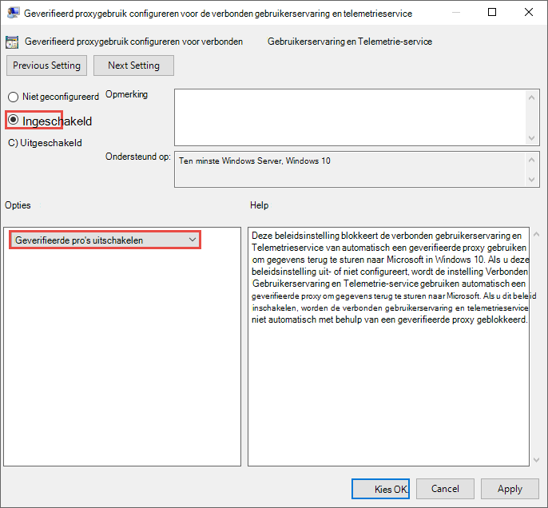
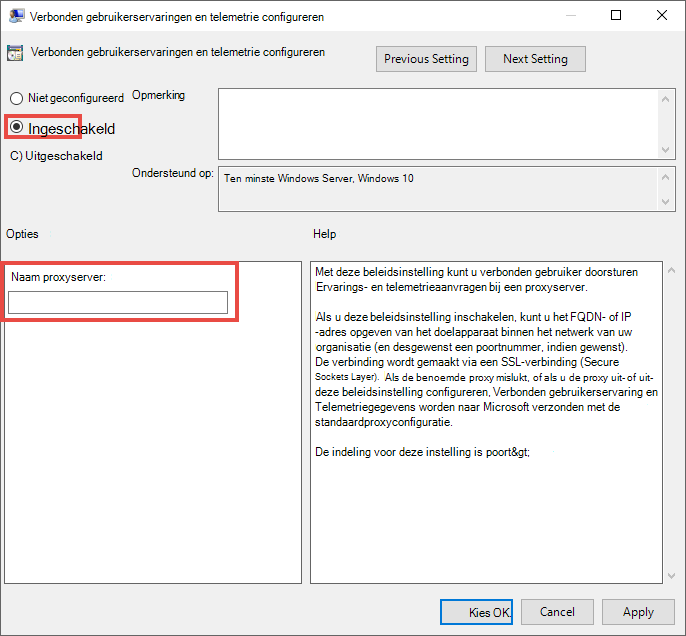
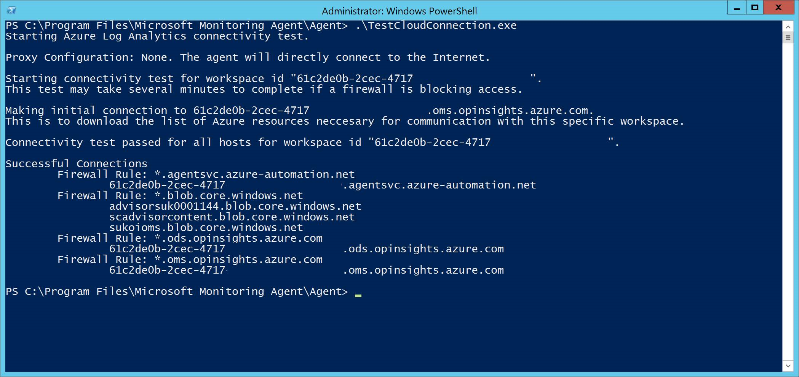

# <a name="configure-device-proxy-and-internet-connectivity-settings"></a>Instellingen voor apparaatproxy en internetverbinding configureren

[!INCLUDE [Microsoft 365 Defender rebranding](../../includes/microsoft-defender.md)]

**Van toepassing op:**
- [Microsoft Defender voor Endpoint](https://go.microsoft.com/fwlink/p/?linkid=2154037)
- [Microsoft 365 Defender](https://go.microsoft.com/fwlink/?linkid=2118804)

> Wilt u Defender voor Eindpunt ervaren? [Meld u aan voor een gratis proefabonnement.](https://www.microsoft.com/en-us/WindowsForBusiness/windows-atp?ocid=docs-wdatp-configureendpointsscript-abovefoldlink)

Voor de Defender for Endpoint-sensor is Microsoft Windows HTTP (WinHTTP) vereist om sensorgegevens te rapporteren en te communiceren met de Defender for Endpoint-service.

De ingesloten Defender voor Eindpunt-sensor wordt uitgevoerd in systeemcontext met behulp van het LocalSystem-account. De sensor gebruikt Microsoft Windows HTTP Services (WinHTTP) om communicatie met de Defender for Endpoint-cloudservice mogelijk te maken.

>[!TIP]
>Voor organisaties die doorgestuurde proxy's gebruiken als gateway voor internet, kunt u netwerkbeveiliging gebruiken om onderzoek te doen achter een proxy. Zie Verbindingsgebeurtenissen onderzoeken die [plaatsvinden achter forward proxies](investigate-behind-proxy.md)voor meer informatie.

De configuratie-instelling WinHTTP is onafhankelijk van de instellingen van Windows Internet (WinINet) voor internetbrowsingsproxy en kan alleen een proxyserver vinden met behulp van de volgende detectiemethoden:

- Methoden voor automatische detectie:
  - Transparante proxy
  - Web proxy Auto-discovery Protocol (WPAD)

    > [!NOTE]
    > Als u Transparante proxy of WPAD gebruikt in de netwerktopologie, hebt u geen speciale configuratie-instellingen nodig. Zie Access [to Defender for Endpoint service URLLs in](#enable-access-to-microsoft-defender-for-endpoint-service-urls-in-the-proxy-server)de proxy inschakelen voor meer informatie over URL-uitsluitingen van Defender voor eindpunten in de proxy.

- Handmatige statische proxyconfiguratie:
  - Configuratie op basis van register
  - WinHTTP geconfigureerd met de opdracht Netsh: alleen geschikt voor desktops in een stabiele topologie (bijvoorbeeld: een bureaublad in een bedrijfsnetwerk achter dezelfde proxy)

## <a name="configure-the-proxy-server-manually-using-a-registry-based-static-proxy"></a>De proxyserver handmatig configureren met behulp van een statische proxy op basis van het register

Configureer een statische proxy op basis van het register zodat alleen defender voor eindpunten-sensor diagnostische gegevens kan rapporteren en kan communiceren met Defender voor eindpuntservices als een computer geen verbinding mag maken met internet.

De statische proxy kan worden geconfigureerd via Groepsbeleid (GP). Het groepsbeleid vindt u onder:

- Beheersjablonen > Windows Components > Data Collection and Preview Builds > Configure Authenticated Proxy usage for the Connected User Experience and Telemetry Service
  - Stel deze optie **in op Ingeschakeld en** selecteer Geverifieerd **proxygebruik uitschakelen**: Afbeelding van 
- **Beheersjablonen > Windows-onderdelen > Gegevensverzameling en Preview-builds > Verbonden gebruikerservaringen en telemetrie configureren:**
  - De proxy configureren:<br>
    

    Met het beleid worden twee `TelemetryProxyServer` registerwaarden REG_SZ en `DisableEnterpriseAuthProxy` REG_DWORD onder de `HKLM\Software\Policies\Microsoft\Windows\DataCollection` registersleutel.

    De registerwaarde `TelemetryProxyServer` heeft de volgende tekenreeksindeling:

    ```text
    <server name or ip>:<port>
    ```

    Bijvoorbeeld: 10.0.0.6:8080

    De registerwaarde `DisableEnterpriseAuthProxy` moet worden ingesteld op 1.

## <a name="configure-the-proxy-server-manually-using-netsh-command"></a>De proxyserver handmatig configureren met de opdracht Netsh

Gebruik netsh om een statische proxy voor het hele systeem te configureren.

> [!NOTE]
> - Dit is van invloed op alle toepassingen, inclusief Windows-services die WinHTTP met standaardproxy gebruiken.</br>
> - Laptops die de topologie wijzigen (bijvoorbeeld van kantoor naar thuis) werken niet goed met netsh. Gebruik de statische proxyconfiguratie op basis van het register.

1. Open een verhoogde opdrachtregel:

    a. Ga naar **Start** en typ **cmd.**

    b. Klik met de rechtermuisknop **op Opdrachtprompt** en selecteer **Uitvoeren als beheerder.**

2. Voer de volgende opdracht in en druk op **Enter:**

   ```PowerShell
   netsh winhttp set proxy <proxy>:<port>
   ```

   Bijvoorbeeld: netsh winhttp set proxy 10.0.0.6:8080

Als u de winhttp proxy opnieuw wilt instellen, voert u de volgende opdracht in en drukt u op **Enter**

```PowerShell
netsh winhttp reset proxy
```

Zie [Netsh Command Syntaxis, Contexten en Opmaak voor](https://docs.microsoft.com/windows-server/networking/technologies/netsh/netsh-contexts) meer informatie.

## <a name="enable-access-to-microsoft-defender-for-endpoint-service-urls-in-the-proxy-server"></a>Toegang tot URL's van microsoft Defender voor eindpuntservice inschakelen op de proxyserver

Als een proxy of firewall standaard al het verkeer blokkeert en alleen specifieke domeinen toestaat, voegt u de domeinen in het downloadbare blad toe aan de lijst met toegestane domeinen.

In de volgende downloadbare spreadsheet vindt u de services en bijbehorende URL's waar uw netwerk verbinding mee moet kunnen maken. U moet ervoor zorgen dat er geen firewall- of netwerkfilterregels zijn die de  toegang tot deze URL's weigeren, of u moet mogelijk een regel voor toestaan speciaal voor deze url's maken.


|**Spreadsheet met domeinenlijst**|**Beschrijving**|
|:-----|:-----|
|<br/>  | Spreadsheet met specifieke DNS-records voor servicelocaties, geografische locaties en besturingssysteem. <br><br>[Download de spreadsheet hier.](https://download.microsoft.com/download/8/a/5/8a51eee5-cd02-431c-9d78-a58b7f77c070/mde-urls.xlsx) 


Als een proxy of firewall HTTPS-scan (SSL-inspectie) heeft ingeschakeld, sluit u de domeinen in de bovenstaande tabel uit van HTTPS-scannen.

> [!NOTE]
> settings-win.data.microsoft.com is alleen nodig als u Windows 10-apparaten hebt met versie 1803 of eerder.<br>


> [!NOTE]
> URL's die v20 bevatten, zijn alleen nodig als u Windows 10-apparaten hebt met versie 1803 of hoger. Is bijvoorbeeld nodig voor een Windows 10-apparaat met versie 1803 of hoger en is aan boord van de ```us-v20.events.data.microsoft.com``` Vs Data Storage-regio.


> [!NOTE]
> Zie Netwerkverbindingen configureren met de [Microsoft Defender Antivirus-cloudservice](https://docs.microsoft.com/windows/security/threat-protection/microsoft-defender-antivirus/configure-network-connections-microsoft-defender-antivirus)als u Microsoft Defender Antivirus gebruikt in uw omgeving.

Als een proxy of firewall anoniem verkeer blokkeert, aangezien defender voor eindpunten vanuit de systeemcontext verbinding maakt, moet u ervoor zorgen dat anoniem verkeer is toegestaan in de eerder genoemde URL's.

### <a name="microsoft-monitoring-agent-mma---proxy-and-firewall-requirements-for-older-versions-of-windows-client-or-windows-server"></a>Microsoft Monitoring Agent (MMA) - proxy- en firewallvereisten voor oudere versies van Windows-client of Windows Server

In de onderstaande informatie vindt u de configuratiegegevens voor proxy en firewall die nodig zijn om te communiceren met de Log Analytics-agent (ook wel Microsoft Monitoring Agent genoemd) voor de vorige versies van Windows, zoals Windows 7 SP1, Windows 8.1, Windows Server 2008 R2, Windows Server 2012 R2 en Windows Server 2016.

|Agent Resource|Poorten |Richting |HTTPS-inspectie omzeilen|
|------|---------|--------|--------|   
|*.ods.opinsights.azure.com |Poort 443 |Uitgaande|Ja |  
|*.oms.opinsights.azure.com |Poort 443 |Uitgaande|Ja |  
|*.blob.core.windows.net |Poort 443 |Uitgaande|Ja |
|*.azure-automation.net |Poort 443 |Uitgaande|Ja |  


> [!NOTE]
> Als cloudoplossing kan het IP-bereik veranderen. U wordt aangeraden over te gaan naar de instelling VOOR DNS-oplossing.

## <a name="confirm-microsoft-monitoring-agent-mma-service-url-requirements"></a>Microsoft Monitoring Agent (MMA) Service URL-vereisten bevestigen 

Raadpleeg de volgende richtlijnen om de jokertekenvereiste (*) voor uw specifieke omgeving te verwijderen wanneer u de Microsoft Monitoring Agent (MMA) gebruikt voor eerdere versies van Windows.

1.  Onboard a previous operating system with the Microsoft Monitoring Agent (MMA) into Defender for Endpoint (for more information, see Onboard previous [versions of Windows on Defender for Endpoint](https://go.microsoft.com/fwlink/p/?linkid=2010326) and [Onboard Windows servers](configure-server-endpoints.md#windows-server-2008-r2-sp1-windows-server-2012-r2-and-windows-server-2016).

2.  Controleer of de computer met succes rapporteert in de Microsoft Defender-beveiligingscentrumportal.

3.  Voer het TestCloudConnection.exe uit van 'C:\Program Files\Microsoft Monitoring Agent\Agent' om de connectiviteit te valideren en om de vereiste URL's voor uw specifieke werkruimte te bekijken.

4.  Controleer de lijst MET URL's van Microsoft Defender voor eindpunten voor de volledige lijst met vereisten voor uw regio (raadpleeg het spreadsheet [Service-URL's](https://download.microsoft.com/download/8/a/5/8a51eee5-cd02-431c-9d78-a58b7f77c070/mde-urls.xlsx)).



De jokertekens (*) die worden gebruikt in *.ods.opinsights.azure.com, *.oms.opinsights.azure.com en *.agentsvc.azure-automation.net URL-eindpunten, kunnen worden vervangen door uw specifieke werkruimte-id. De werkruimte-id is specifiek voor uw omgeving en werkruimte en is te vinden in de sectie Onboarding van uw tenant in de Microsoft Defender Security Center-portal.

Het eindpunt *.blob.core.windows.net URL kan worden vervangen door de URL's die worden weergegeven in de sectie Firewallregel: *.blob.core.windows.net' van de testresultaten. 

> [!NOTE]
> In het geval van onboarding via Azure Security Center (ASC) worden mogelijk meerdere werkruimten gebruikt. U moet de bovenstaande TestCloudConnection.exe uitvoeren op een onboarded machine vanuit elke werkruimte (om te bepalen of er wijzigingen zijn in de *.blob.core.windows.net-URL's tussen de werkruimten).

## <a name="verify-client-connectivity-to-microsoft-defender-atp-service-urls"></a>Clientconnectiviteit met ATP-service-URL's van Microsoft Defender verifiëren

Controleer of de proxyconfiguratie is voltooid, of WinHTTP kan ontdekken en communiceren via de proxyserver in uw omgeving, en of de proxyserver verkeer toestaat naar de URL's van de Defender for Endpoint-service.

1. Download het [hulpprogramma MDATP Client Analyzer](https://aka.ms/mdatpanalyzer) naar de pc waarop de Defender for Endpoint-sensor wordt uitgevoerd.

2. Haal de inhoud van MDATPClientAnalyzer.zip op het apparaat op.

3. Open een verhoogde opdrachtregel:

    a. Ga naar **Start** en typ **cmd.**

    b.  Klik met de rechtermuisknop **op Opdrachtprompt** en selecteer **Uitvoeren als beheerder.**

4. Voer de volgende opdracht in en druk op **Enter:**

    ```PowerShell
    HardDrivePath\MDATPClientAnalyzer.cmd
    ```

    *Vervang HardDrivePath* door het pad waar het hulpprogramma MDATPClientAnalyzer naar is gedownload, bijvoorbeeld

    ```PowerShell
    C:\Work\tools\MDATPClientAnalyzer\MDATPClientAnalyzer.cmd
    ```

5. Haal het *MDATPClientAnalyzerResult.zip* bestand op dat is gemaakt met het hulpprogramma in de map die wordt gebruikt in *HardDrivePath.*

6. Open *MDATPClientAnalyzerResult.txt* en controleer of u de proxyconfiguratiestappen hebt uitgevoerd om serverdetectie en toegang tot de service-URL's in te stellen. <br><br>
   Het hulpprogramma controleert de connectiviteit van URL's van de Defender-service voor eindpunten waarmee defender voor eindpuntclient is geconfigureerd voor interactie. Vervolgens worden de resultaten afgedrukt in *hetMDATPClientAnalyzerResult.txt* bestand voor elke URL die mogelijk kan worden gebruikt om te communiceren met de Defender for Endpoint-services. Bijvoorbeeld:

   ```text
   Testing URL : https://xxx.microsoft.com/xxx
   1 - Default proxy: Succeeded (200)
   2 - Proxy auto discovery (WPAD): Succeeded (200)
   3 - Proxy disabled: Succeeded (200)
   4 - Named proxy: Doesn't exist
   5 - Command line proxy: Doesn't exist
   ```

Als ten minste één van de connectiviteitsopties een status (200) retourneert, kan de Defender voor Eindpunt-client correct communiceren met de geteste URL met behulp van deze verbindingsmethode. <br><br>

Als de resultaten van de connectiviteitscontrole echter aangeven dat er een fout is opgetreden, wordt er een HTTP-fout weergegeven (zie HTTP-statuscodes). U kunt vervolgens de URL's in de tabel gebruiken die wordt weergegeven in Toegang tot URL's van de Defender voor [eindpuntservice inschakelen op de proxyserver.](#enable-access-to-microsoft-defender-for-endpoint-service-urls-in-the-proxy-server) De URL's die u gebruikt, zijn afhankelijk van de regio die tijdens de onboardingprocedure is geselecteerd.

> [!NOTE]
> Het hulpprogramma Connectivity Analyzer is niet compatibel met ASR-regel Procescreaties blokkeren die afkomstig zijn [van PSExec- en WMI-opdrachten.](https://docs.microsoft.com/windows/security/threat-protection/windows-defender-exploit-guard/attack-surface-reduction#attack-surface-reduction-rules) U moet deze regel tijdelijk uitschakelen om het verbindingshulpmiddel uit te voeren.


> [!NOTE]
> Wanneer de TelemetryProxyServer is ingesteld, in register of via groepsbeleid, valt Defender voor Eindpunt terug naar direct als deze geen toegang heeft tot de gedefinieerde proxy.

## <a name="related-topics"></a>Verwante onderwerpen

- [Onboard Windows 10-apparaten](configure-endpoints.md)
- [Problemen met de onboarding van Microsoft Defender voor eindpunten oplossen](troubleshoot-onboarding.md)
