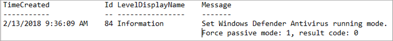
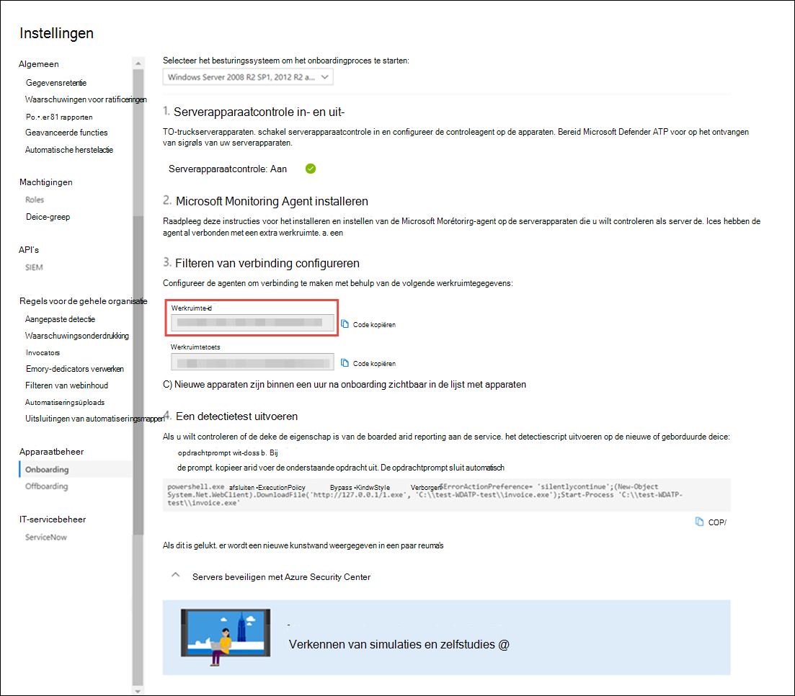

# <a name="onboard-windows-servers-to-the-microsoft-defender-for-endpoint-service"></a>Windows-servers aan boord van de Microsoft Defender voor Eindpunt-service

[!INCLUDE [Microsoft 365 Defender rebranding](../../includes/microsoft-defender.md)]


**Van toepassing op:**

- Windows Server 2008 R2 SP1
- Windows Server 2012 R2
- Windows Server 2016
- Windows Server (SAC) versie 1803 en hoger
- Windows Server 2019 en hoger
- Windows Server 2019 core edition

> Wilt u Defender voor Eindpunt ervaren? [Meld u aan voor een gratis proefabonnement.](https://www.microsoft.com/microsoft-365/windows/microsoft-defender-atp?ocid=docs-wdatp-configserver-abovefoldlink)


Defender voor Eindpunt breidt de ondersteuning uit met het Windows Server-besturingssysteem. Deze ondersteuning biedt geavanceerde mogelijkheden voor detectie en onderzoek van aanvallen naadloos via de Microsoft Defender-beveiligingscentrumconsole.

Zie [Windows-servers](https://techcommunity.microsoft.com/t5/What-s-New/Protecting-Windows-Server-with-Windows-Defender-ATP/m-p/267114#M128)beveiligen met Defender voor eindpunt voor praktische richtlijnen over wat er moet worden gebruikt voor licenties en infrastructuur.

Zie [Windows-beveiligingslijnlijnen](https://docs.microsoft.com/windows/device-security/windows-security-baselines)voor informatie over het downloaden en gebruiken van Windows-beveiligingslijnlijnen voor Windows-servers.

<br>

## <a name="windows-server-2008-r2-sp1-windows-server-2012-r2-and-windows-server-2016"></a>Windows Server 2008 R2 SP1, Windows Server 2012 R2 en Windows Server 2016

U kunt Windows Server 2008 R2 SP1, Windows Server 2012 R2 en Windows Server 2016 met behulp van een van de volgende opties aan boord nemen van Defender voor Eindpunt:

- **Optie 1**: [Onboard door Microsoft Monitoring Agent (MMA) te](#option-1-onboard-by-installing-and-configuring-microsoft-monitoring-agent-mma) installeren en te configureren
- **Optie 2**: [Onboard via Azure Security Center](#option-2-onboard-windows-servers-through-azure-security-center)
- **Optie 3:** [Onboard via Microsoft Endpoint Manager versie 2002 en hoger](#option-3-onboard-windows-servers-through-microsoft-endpoint-manager-version-2002-and-later)


Nadat u de onboarding-stappen hebt doorlopen met een van de opgegeven opties, moet u [System Center Endpoint Protection-clients configureren en bijwerken.](#configure-and-update-system-center-endpoint-protection-clients)


> [!NOTE]
> Defender for Endpoint standalone server license is vereist, per knooppunt, om een Windows-server aan te sluiten via Microsoft Monitoring Agent (Optie 1) of via Microsoft Endpoint Manager (optie 3). U kunt ook per knooppunt een Azure Defender for Servers-licentie gebruiken om een Windows-server aan te sluiten via Azure Security Center (optie 2), zie Ondersteunde functies die beschikbaar zijn [in Azure Security Center.](https://docs.microsoft.com/azure/security-center/security-center-services)


### <a name="option-1-onboard-by-installing-and-configuring-microsoft-monitoring-agent-mma"></a>Optie 1: Onboard door Microsoft Monitoring Agent (MMA) te installeren en te configureren
U moet MMA voor Windows-servers installeren en configureren om sensorgegevens te rapporteren aan Defender voor Eindpunt. Zie Logboekgegevens verzamelen [met Azure Log Analytics-agent](https://docs.microsoft.com/azure/azure-monitor/platform/log-analytics-agent)voor meer informatie.

Als u System Center Operations Manager (SCOM) of Azure Monitor (voorheen Bekend als Operations Management Suite (OMS) al gebruikt, koppelt u de Microsoft Monitoring Agent (MMA) om via multihoming-ondersteuning te rapporteren aan uw Werkruimte van Defender voor Eindpunt.

Over het algemeen moet u de volgende stappen ondernemen:
1. Voldoe aan de onboarding-vereisten die worden beschreven in **De sectie Voordat u begint.**
2. Schakel servercontrole in vanuit het Microsoft Defender-beveiligingscentrum.
3. Installeer en configureer MMA voor de server om sensorgegevens te rapporteren aan Defender voor Eindpunt.
4. System Center Endpoint Protection-clients configureren en bijwerken.


> [!TIP]
> Nadat u het apparaat hebt onboarding, kunt u ervoor kiezen om een detectietest uit te voeren om te controleren of het apparaat correct is aan boord van de service. Zie Een detectietest uitvoeren op een nieuw ingebouwde [Defender voor eindpunten voor meer informatie.](run-detection-test.md)


#### <a name="before-you-begin"></a>Voordat u begint 
Voer de volgende stappen uit om te voldoen aan de vereisten voor onboarding:

 - Voor Windows Server 2008 R2 SP1 of Windows Server 2012 R2 moet u het volgende hotfix installeren:
    - [Bijwerken voor klantervaring en diagnostische telemetrie](https://support.microsoft.com/help/3080149/update-for-customer-experience-and-diagnostic-telemetry)

 - Zorg er bovendien voor Windows Server 2008 R2 SP1 voor dat u aan de volgende vereisten voldoet:
    - De maandelijkse [update-rollup](https://support.microsoft.com/help/4074598/windows-7-update-kb4074598) van februari installeren
    - Installeer [.NET framework 4.5](https://www.microsoft.com/download/details.aspx?id=30653) (of hoger) of [KB3154518](https://support.microsoft.com/help/3154518/support-for-tls-system-default-versions-included-in-the-net-framework)
   
   > [!NOTE]
    > Als u uw Windows Server 2008 R2 SP1 met SCCM beheert, installeert de SCCM-clientagent .Net Framework 4.5.2. U hoeft dus het .NET framework 4.5 (of hoger) niet te installeren.
   
 - Voor Windows Server 2008 R2 SP1 en Windows Server 2012 R2: [System Center Endpoint Protection-clients configureren en bijwerken.](#configure-and-update-system-center-endpoint-protection-clients)

    > [!NOTE]
    > Deze stap is alleen vereist als uw organisatie System Center Endpoint Protection (SCEP) gebruikt en u Windows Server 2008 R2 SP1 en Windows Server 2012 R2 onboardt.


<span id="server-mma"/>

### <a name="install-and-configure-microsoft-monitoring-agent-mma-to-report-sensor-data-to-microsoft-defender-for-endpoint"></a>Microsoft Monitoring Agent (MMA) installeren en configureren om sensorgegevens te rapporteren aan Microsoft Defender voor Eindpunt

1. Download het installatiebestand van de agent: [Windows 64-bits agent](https://go.microsoft.com/fwlink/?LinkId=828603).

2. Kies een van de volgende installatiemethoden om de agent op de Windows-server te installeren met behulp van de werkruimte-id en de werkruimtesleutel die in de vorige procedure is verkregen:
    - [Installeer de agent handmatig met installatie](https://docs.microsoft.com/azure/log-analytics/log-analytics-windows-agents#install-agent-using-setup-wizard). <br>
    Kies op **de pagina Opties voor** agentconfiguratie de optie Verbinding maken met Azure Log Analytics **(OMS)**.
    - [Installeer de agent met de opdrachtregel](https://docs.microsoft.com/azure/log-analytics/log-analytics-windows-agents#install-agent-using-command-line).
    - [Configureer de agent met behulp van een script.](https://docs.microsoft.com/azure/log-analytics/log-analytics-windows-agents#install-agent-using-dsc-in-azure-automation)

> [!NOTE]
> Als u een klant van de Amerikaanse overheid bent [,](gov.md)moet u onder 'Azure Cloud' de parameter 'Azure US Government' kiezen als u de installatiewizard gebruikt of als u een opdrachtregel of een script gebruikt. Stel de parameter 'OPINSIGHTS_WORKSPACE_AZURE_CLOUD_TYPE' in op 1.


<span id="server-proxy"/>

### <a name="configure-windows-server-proxy-and-internet-connectivity-settings-if-needed"></a>Instellingen voor Windows-serverproxy en internetverbinding configureren indien nodig
Als uw servers een proxy moeten gebruiken om te communiceren met Defender voor Eindpunt, gebruikt u een van de volgende methoden om de MMA te configureren voor het gebruik van de proxyserver:


- [De MMA configureren voor het gebruik van een proxyserver](https://docs.microsoft.com/azure/azure-monitor/platform/agent-windows#install-agent-using-setup-wizard)

- [Windows configureren voor het gebruik van een proxyserver voor alle verbindingen](configure-proxy-internet.md)

Als er een proxy of firewall wordt gebruikt, moet u ervoor zorgen dat servers rechtstreeks en zonder SSL-interceptie toegang hebben tot alle URL's van de Microsoft Defender-service voor eindpunten. Zie Access to [Defender for Endpoint service URL's inschakelen](configure-proxy-internet.md#enable-access-to-microsoft-defender-for-endpoint-service-urls-in-the-proxy-server)voor meer informatie. Het gebruik van SSL-onderschepping voorkomt dat het systeem communiceert met de Defender for Endpoint-service. 

Wanneer u klaar bent, ziet u binnen een uur onboarded Windows-servers in de portal.

### <a name="option-2-onboard-windows-servers-through-azure-security-center"></a>Optie 2: Onboard Windows-servers via Azure Security Center
1. Selecteer in het navigatiedeelvenster van het Microsoft Defender-beveiligingscentrum de optie **Instellingen**  >  **Apparaatbeheer**  >  **Onboarding**.

2. Selecteer **Windows Server 2008 R2 SP1, 2012 R2 en 2016** als het besturingssysteem.

3. Klik **op Onboard Servers in Azure Security Center**.

4. Volg de onboarding-instructies in [Microsoft Defender voor Eindpunt met Azure Security Center](https://docs.microsoft.com/azure/security-center/security-center-wdatp).

Nadat u de onboarding-stappen hebt doorlopen, moet u [System Center Endpoint Protection-clients configureren en bijwerken.](#configure-and-update-system-center-endpoint-protection-clients)

> [!NOTE]
> - Als onboarding via Azure Defender voor Servers (voorheen Azure Security Center Standard Edition) naar verwachting werkt, moet de server een geschikte werkruimte en sleutel hebben die is geconfigureerd binnen de MMA-instellingen (Microsoft Monitoring Agent).
> - Nadat de configuratie is geconfigureerd, wordt het juiste cloudbeheerpakket op de computer geïmplementeerd en wordt het sensorproces (MsSenseS.exe) geïmplementeerd en gestart. 
> - Dit is ook vereist als de server is geconfigureerd voor het gebruik van een OMS Gateway-server als proxy.

### <a name="option-3-onboard-windows-servers-through-microsoft-endpoint-manager-version-2002-and-later"></a>Optie 3: Windows-servers inschakelen via Microsoft Endpoint Manager versie 2002 en hoger
U kunt Windows Server 2012 R2 en Windows Server 2016 inschakelen met Microsoft Endpoint Manager versie 2002 en hoger. Zie Microsoft [Defender for Endpoint in Microsoft Endpoint Manager current branch (Microsoft Defender for Endpoint in Microsoft Endpoint Manager current branch) voor meer informatie.](https://docs.microsoft.com/mem/configmgr/protect/deploy-use/defender-advanced-threat-protection)

Nadat u de onboarding-stappen hebt doorlopen, moet u [System Center Endpoint Protection-clients configureren en bijwerken.](#configure-and-update-system-center-endpoint-protection-clients)

<br>

## <a name="windows-server-sac-version-1803-windows-server-2019-and-windows-server-2019-core-edition"></a>Windows Server (SAC) versie 1803, Windows Server 2019 en Windows Server 2019 Core edition
U kunt windows Server-versie 1803, Windows Server 2019 of Windows Server 2019 Core edition inschakelen met behulp van de volgende implementatiemethoden:

- [Lokaal script](configure-endpoints-script.md) 
- [Groepsbeleid](configure-endpoints-gp.md)
- [Microsoft Endpoint Configuration Manager](configure-endpoints-sccm.md)
- [System Center Configuration Manager 2012 / 2012 R2 1511 / 1602](configure-endpoints-sccm.md#onboard-devices-using-system-center-configuration-manager)
- [VDI-onboarding-scripts voor niet-permanente apparaten](configure-endpoints-vdi.md)

> [!NOTE]
> - Het Onboarding-pakket voor Windows Server 2019 tot en met Microsoft Endpoint Manager verzendt momenteel een script. Zie Pakketten en programma's in Configuration Manager voor meer informatie over het implementeren van scripts [in Configuration Manager.](https://docs.microsoft.com/configmgr/apps/deploy-use/packages-and-programs)
> - Een lokaal script is geschikt voor een proof of concept, maar mag niet worden gebruikt voor productie-implementatie. Voor een productie-implementatie wordt aangeraden groepsbeleid of Microsoft Endpoint Configuration Manager te gebruiken.

Ondersteuning voor Windows Server biedt meer inzicht in serveractiviteiten, dekking voor detectie van kernel- en geheugenaanval en maakt reactieacties mogelijk.

1. Configureer instellingen voor onboarding van Defender voor eindpunten op de Windows-server met dezelfde hulpmiddelen en methoden voor Windows 10-apparaten. Zie Onboard [Windows 10-apparaten](configure-endpoints.md)voor meer informatie.

2. Als u een antimalwareoplossing van derden gebruikt, moet u de volgende instellingen voor de passieve av-modus van Microsoft Defender toepassen. Controleer of deze correct is geconfigureerd:

    1. Stel de volgende registerinvoer in:
       - Pad: `HKLM\SOFTWARE\Policies\Microsoft\Windows Advanced Threat Protection`
       - Naam: ForceDefenderPassiveMode
       - Type: REG_DWORD
       - Waarde: 1

    1. Voer de volgende PowerShell-opdracht uit om te controleren of de passieve modus is geconfigureerd:

       ```PowerShell
       Get-WinEvent -FilterHashtable @{ProviderName="Microsoft-Windows-Sense" ;ID=84}
       ```

    1. Controleer of er een recente gebeurtenis met de gebeurtenis in de passieve modus is gevonden:

       

3. Voer de volgende opdracht uit om te controleren of Microsoft Defender AV is geïnstalleerd:

   ```sc.exe query Windefend```

    Als het resultaat 'De opgegeven service bestaat niet als een geïnstalleerde service' is, moet u Microsoft Defender AV installeren. Zie Microsoft [Defender Antivirus in Windows 10](https://docs.microsoft.com/windows/security/threat-protection/microsoft-defender-antivirus/microsoft-defender-antivirus-in-windows-10)voor meer informatie.
    
    Zie Groepsbeleidsinstellingen gebruiken om Microsoft Defender Antivirus te configureren en te beheren voor informatie over het gebruik van groepsbeleid voor het configureren en beheren van Microsoft Defender Antivirus op uw [Windows-servers.](https://docs.microsoft.com/windows/security/threat-protection/microsoft-defender-antivirus/use-group-policy-microsoft-defender-antivirus)

<br>

## <a name="integration-with-azure-security-center"></a>Integratie met Azure Security Center
Defender voor Eindpunt kan worden geïntegreerd met Azure Security Center om een uitgebreide windows-serverbeveiligingsoplossing te bieden. Met deze integratie kan Azure Security Center de kracht van Defender voor Eindpunt gebruiken om een verbeterde detectie van bedreigingen voor Windows-servers te bieden.

De volgende mogelijkheden zijn opgenomen in deze integratie:
- Geautomatiseerde onboarding- Defender voor eindpunten-sensor wordt automatisch ingeschakeld op Windows-servers die zijn onboarded bij Azure Security Center. Zie [Onboarding to Azure Security Center Standard for enhanced security (Onboarding to Azure Security Center Standard for enhanced security)](https://docs.microsoft.com/azure/security-center/security-center-onboarding)voor meer informatie over onboarding van Azure Security Center.

    > [!NOTE]
    > De integratie tussen Azure Defender voor servers en Microsoft Defender voor Eindpunt is uitgebreid met ondersteuning voor [Windows Server 2019 en Windows Virtual Desktop (WVD).](https://docs.microsoft.com/azure/security-center/release-notes#microsoft-defender-for-endpoint-integration-with-azure-defender-now-supports-windows-server-2019-and-windows-10-virtual-desktop-wvd-in-preview)

- Windows-servers die worden gecontroleerd door Azure Security Center, zijn ook beschikbaar in Defender voor Eindpunt- Azure Security Center maakt naadloos verbinding met de Defender for Endpoint-tenant, met één weergave voor clients en servers.  Daarnaast zijn defender voor eindpuntwaarschuwingen beschikbaar in de Azure Security Center-console.
- Serveronderzoek: klanten van het Azure Security Center hebben toegang tot het Microsoft Defender-beveiligingscentrum om gedetailleerd onderzoek uit te voeren om het bereik van een mogelijke inbreuk te achterhalen.

> [!IMPORTANT]
> - Wanneer u Azure Security Center gebruikt om servers te controleren, wordt automatisch een Defender for Endpoint-tenant gemaakt (in de VS voor Amerikaanse gebruikers, in de EU voor Europese en Britse gebruikers).<br>
Gegevens die door Defender voor Eindpunt worden verzameld, worden opgeslagen op de geografische locatie van de tenant die tijdens de inrichting is geïdentificeerd.
> - Als u Defender voor Eindpunt gebruikt voordat u Azure Security Center gebruikt, worden uw gegevens opgeslagen op de locatie die u hebt opgegeven toen u uw tenant maakte, zelfs als u op een later tijdstip integreert met Azure Security Center.
> - Nadat de gegevens zijn geconfigureerd, kunt u de locatie waarop uw gegevens zijn opgeslagen niet wijzigen. Als u uw gegevens naar een andere locatie wilt verplaatsen, moet u contact opnemen met Microsoft Support om de tenant opnieuw in te stellen. <br>
Server-eindpuntcontrole met behulp van deze integratie is uitgeschakeld voor Office 365 GCC-klanten.

<br>

## <a name="configure-and-update-system-center-endpoint-protection-clients"></a>System Center Endpoint Protection-clients configureren en bijwerken

Defender for Endpoint is geïntegreerd met System Center Endpoint Protection. De integratie biedt zichtbaarheid voor malwaredetecties en om de verspreiding van een aanval in uw organisatie te stoppen door potentieel schadelijke bestanden of verdachte malware te verbieden.

De volgende stappen zijn vereist om deze integratie mogelijk te maken:
- Installeer de update van het anti-malwareplatform van januari [2017 voor endpoint protection-clients.](https://support.microsoft.com/help/3209361/january-2017-anti-malware-platform-update-for-endpoint-protection-clie)

- [Configureer het lidmaatschap van de SCEP-client Cloud Protection Service](https://docs.microsoft.com/windows/security/threat-protection/microsoft-defender-antivirus/enable-cloud-protection-microsoft-defender-antivirus) op **de instelling Geavanceerd.**

<br>

## <a name="offboard-windows-servers"></a>Offboard Windows-servers
U kunt Windows Server (SAC), Windows Server 2019 en Windows Server 2019 Core edition offboarden volgens dezelfde methode die beschikbaar is voor Windows 10-clientapparaten.

Voor andere Windows-serverversies hebt u twee opties voor offboard Windows-servers van de service:
- De MMA-agent verwijderen
- De configuratie van de Defender voor Eindpunt-werkruimte verwijderen

> [!NOTE]
> Offboarding zorgt ervoor dat de Windows-server stopt met het verzenden van sensorgegevens naar de portal, maar gegevens van de Windows-server, inclusief verwijzingen naar eventuele waarschuwingen die de server heeft ontvangen, blijven maximaal 6 maanden bewaard.

### <a name="uninstall-windows-servers-by-uninstalling-the-mma-agent"></a>Windows-servers verwijderen door de MMA-agent te verwijderen
Als u de Windows-server wilt offboarden, kunt u de MMA-agent van de Windows-server verwijderen of loskoppelen van rapportage naar uw Defender voor Eindpunt-werkruimte. Na het offboarden van de agent verzendt de Windows-server geen sensorgegevens meer naar Defender voor Eindpunt.
Zie Een agent uitschakelen voor [meer informatie.](https://docs.microsoft.com/azure/log-analytics/log-analytics-windows-agents#to-disable-an-agent)

### <a name="remove-the-defender-for-endpoint-workspace-configuration"></a>De configuratie van de Defender voor Eindpunt-werkruimte verwijderen
Als u de Windows-server wilt uitschakelen, kunt u een van de volgende methoden gebruiken:

- De configuratie van de Defender voor eindpuntwerkruimte verwijderen uit de MMA-agent
- Een PowerShell-opdracht uitvoeren om de configuratie te verwijderen

#### <a name="remove-the-defender-for-endpoint-workspace-configuration-from-the-mma-agent"></a>De configuratie van de Defender voor eindpuntwerkruimte verwijderen uit de MMA-agent

1. Selecteer op **het tabblad Microsoft Monitoring Agent Properties** het tabblad Azure Log Analytics **(OMS).**

2. Selecteer de werkruimte Defender voor eindpunt en klik op **Verwijderen.**

    

#### <a name="run-a-powershell-command-to-remove-the-configuration"></a>Een PowerShell-opdracht uitvoeren om de configuratie te verwijderen

1. Uw werkruimte-id krijgen:

   1. Selecteer in het navigatiedeelvenster **Instellingen**  >  **Onboarding**.

   1. Selecteer **Windows Server 2008 R2 SP1, 2012 R2 en 2016** als het besturingssysteem en ontvang uw werkruimte-id:

      

2. Open een verhoogde PowerShell en voer de volgende opdracht uit. Gebruik de werkruimte-id die u hebt verkregen en `WorkspaceID` vervangt:

    ```powershell
    $ErrorActionPreference = "SilentlyContinue"
    # Load agent scripting object
    $AgentCfg = New-Object -ComObject AgentConfigManager.MgmtSvcCfg
    # Remove OMS Workspace
    $AgentCfg.RemoveCloudWorkspace("WorkspaceID")
    # Reload the configuration and apply changes
    $AgentCfg.ReloadConfiguration()

    ```

<br>

## <a name="related-topics"></a>Verwante onderwerpen
- [Onboarden Windows 10-apparaten](configure-endpoints.md)
- [Onboarden niet-Windows-apparaten](configure-endpoints-non-windows.md)
- [Proxy- en internetconnectiviteitsinstellingen configureren](configure-proxy-internet.md)
- [Een detectietest uitvoeren op een nieuw ingebouwde Defender voor eindpuntapparaat](run-detection-test.md)
- [Problemen met de onboarding van Microsoft Defender voor eindpunten oplossen](troubleshoot-onboarding.md)
