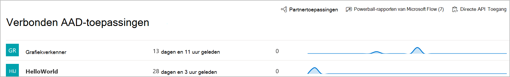

# Verbonden toepassingen in Microsoft Defender voor EindpuntConnected applications in Microsoft Defender for Endpoint

[!INCLUDE [Microsoft 365 Defender rebranding](../../includes/microsoft-defender.md)]

**Van toepassing op:****Applies to:**
- [Microsoft Defender voor EindpuntMicrosoft Defender for Endpoint](https://go.microsoft.com/fwlink/p/?linkid=2154037)
- [Microsoft 365 DefenderMicrosoft 365 Defender](https://go.microsoft.com/fwlink/?linkid=2118804)

>Wilt u Defender voor Eindpunt ervaren?Want to experience Defender for Endpoint? [Meld u aan voor een gratis proefabonnement.Sign up for a free trial.](https://www.microsoft.com/microsoft-365/windows/microsoft-defender-atp?ocid=docs-wdatp-assignaccess-abovefoldlink)

Verbonden toepassingen worden geïntegreerd met het Defender for Endpoint-platform met API's.Connected applications integrates with the Defender for Endpoint platform using APIs. 

Toepassingen gebruiken standaard OAuth 2.0-protocol om tokens te verifiëren en aan te bieden voor gebruik met Microsoft Defender voor eindpunt-API's.Applications use standard OAuth 2.0 protocol to authenticate and provide tokens for use with Microsoft Defender for Endpoint APIs.  Daarnaast kunnen tenantbeheerders met Azure Active Directory-toepassingen (Azure Ad) expliciet bepalen welke API's met de bijbehorende app kunnen worden gebruikt.In addition, Azure Active Directory (Azure AD) applications allow tenant admins to set explicit control over which APIs can be accessed using the corresponding app.
 
U moet deze stappen volgen [om](https://docs.microsoft.com/microsoft-365/security/defender-endpoint/apis-intro) de API's te gebruiken met de verbonden toepassing.You'll need to follow [these steps](https://docs.microsoft.com/microsoft-365/security/defender-endpoint/apis-intro) to use the APIs with the connected application.
 
## De pagina verbonden toepassing openenAccess the connected application page
Selecteer in het linkernavigatiemenu **Partners & API's verbonden**  >  **AAD-toepassingen.**From the left navigation menu, select **Partners & APIs** > **Connected AAD applications**.

 
## Verbonden toepassingsgegevens weergevenView connected application details
De pagina Verbonden toepassingen bevat informatie over de Azure AD-toepassingen die zijn verbonden met Microsoft Defender voor Eindpunt in uw organisatie.The Connected applications page provides information about the Azure AD applications connected to Microsoft Defender for Endpoint in your organization. U kunt het gebruik van de verbonden toepassingen bekijken: laatst gezien, het aantal aanvragen in de afgelopen 24 uur en trends aanvragen in de afgelopen 30 dagen.You can review the usage of the connected applications: last seen, number of requests in the past 24 hours, and request trends in the last 30 days.

 
## Een verbonden toepassing bewerken, opnieuw configureren of verwijderenEdit, reconfigure, or delete a connected application
Met **de koppeling Toepassingsinstellingen** openen wordt de bijbehorende pagina Azure AD-toepassingsbeheer geopend in de Azure-portal.The **Open application settings** link opens the corresponding Azure AD application management page in the Azure portal. Vanuit de Azure-portal kunt u machtigingen beheren, de verbonden toepassingen opnieuw configureren of verwijderen.From the Azure portal, you can manage permissions, reconfigure, or delete the connected applications.
