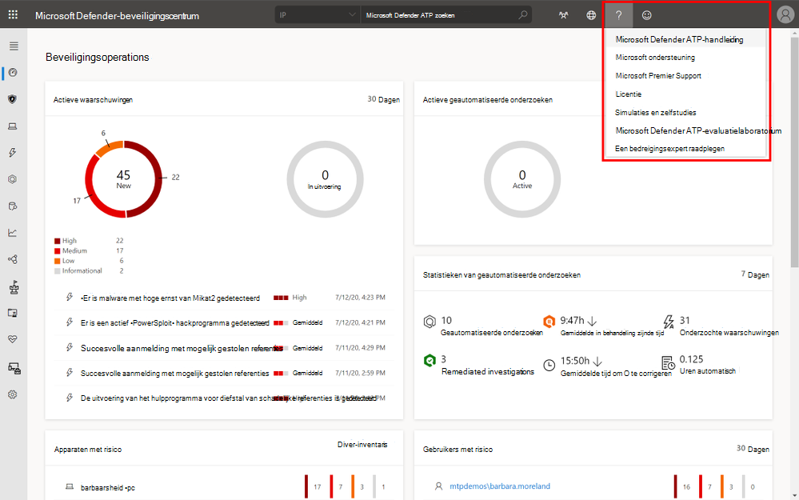
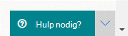
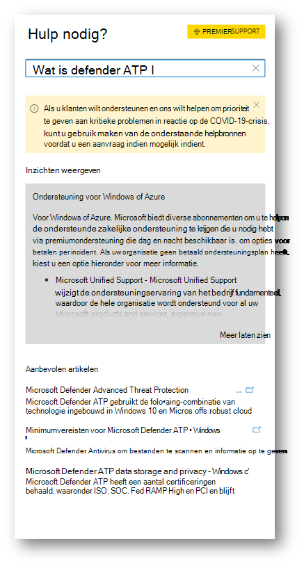
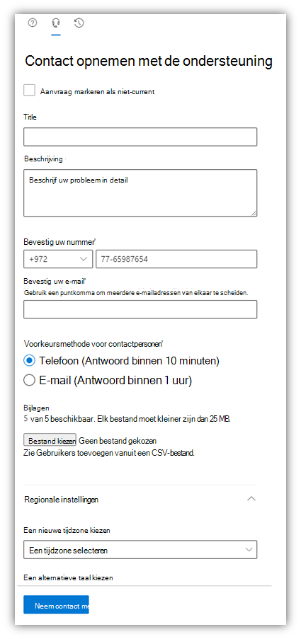

# Contact opnemen met de ondersteuning van Microsoft Defender voor EindpuntContact Microsoft Defender for Endpoint support

[!INCLUDE [Microsoft 365 Defender rebranding](../../includes/microsoft-defender.md)]

**Van toepassing op:****Applies to:**
- [Microsoft Defender voor EindpuntMicrosoft Defender for Endpoint](https://go.microsoft.com/fwlink/p/?linkid=2154037)
- [Microsoft 365 DefenderMicrosoft 365 Defender](https://go.microsoft.com/fwlink/?linkid=2118804)

>Wilt u Defender voor Eindpunt ervaren?Want to experience Defender for Endpoint? [Meld u aan voor een gratis proefabonnement.Sign up for a free trial.](https://www.microsoft.com/microsoft-365/windows/microsoft-defender-atp?ocid=docs-wdatp-assignaccess-abovefoldlink)

Defender voor Endpoint heeft onlangs het ondersteuningsproces bijgewerkt om een modernere en geavanceerdere ondersteuning te bieden.Defender for Endpoint has recently upgraded the support process to offer a more modern and advanced support experience. 

Met de nieuwe widget kunnen klanten het volgende doen:The new widget allows customers to:
- Oplossingen zoeken voor veelvoorkomende problemenFind solutions to common problems
- Een ondersteuningscase indienen bij het Ondersteuningsteam van MicrosoftSubmit a support case to the Microsoft support team

## VereistenPrerequisites
Het is belangrijk om te weten welke specifieke rollen machtigingen hebben om ondersteuningszaken te openen.It's important to know the specific roles that have permission to open support cases.

U moet minimaal een serviceondersteuningsbeheerder **of** helpdeskbeheerder hebben.At a minimum, you must have a Service Support Administrator **OR** Helpdesk Administrator role.

Zie Beveiligingsbeheerdersmachtigingen voor meer informatie over welke rollen [machtigingen hebben.](/azure/active-directory/users-groups-roles/directory-assign-admin-roles#security-administrator-permissions)For more information on which roles have permission see, [Security Administrator permissions](/azure/active-directory/users-groups-roles/directory-assign-admin-roles#security-administrator-permissions). Rollen die de actie `microsoft.office365.supportTickets/allEntities/allTasks` bevatten, kunnen een aanvraag indienen.Roles that include the action `microsoft.office365.supportTickets/allEntities/allTasks` can submit a case.

Zie Over beheerdersrollen voor algemene informatie [over beheerdersrollen.](/microsoft-365/admin/add-users/about-admin-roles?view=o365-worldwide&preserve-view=true)For general information on admin roles, see [About admin roles](/microsoft-365/admin/add-users/about-admin-roles?view=o365-worldwide&preserve-view=true).

## De widget openenAccess the widget
U kunt op twee manieren toegang krijgen tot de nieuwe ondersteuningswidget:Accessing the new support widget can be done in one of two ways:

1.  Klik op het vraagteken rechtsboven in de portal en klik vervolgens op 'Microsoft-ondersteuning':Clicking on the question mark on the top right of the portal and then clicking on "Microsoft support":

    

2. Klik op hulp **nodig?**Clicking on the **Need help?**  in de rechteronderzijde van de Microsoft Defender-beveiligingscentrum:button in the bottom right of the Microsoft Defender Security Center:

    

In de widget worden twee opties aangeboden:In the widget you will be offered two options:

- Oplossingen zoeken voor veelvoorkomende problemenFind solutions to common problems    
- Een serviceaanvraag openenOpen a service request  

## Oplossingen zoeken voor veelvoorkomende problemenFind solutions to common problems
Deze optie bevat artikelen die mogelijk betrekking hebben op de vraag die u kunt stellen.This option includes articles that might be related to the question you may ask. Begin met het typen van de vraag in het zoekvak en artikelen met betrekking tot uw zoekopdracht worden weergegeven.Just start typing the question in the search box and articles related to your search will be surfaced.

Als de voorgestelde artikelen niet voldoende zijn, kunt u een serviceaanvraag openen.In case the suggested articles are not sufficient, you can open a service request.

## Een serviceaanvraag openenOpen a service request

Meer informatie over het openen van ondersteuningstickets door contact op te nemen met Defender voor endpoint-ondersteuning.Learn how to open support tickets by contacting Defender for Endpoint support. 

> [!Note]
> Als u een permier-ondersteuningscontract met Microsoft hebt, ziet u de belangrijkste tag op de widget.If you have a permier support contract with Microsoft, you will see the premier tag on the widget. Zo niet, neem dan contact op met uw Microsoft-accountmanager.If not, contact your Microsoft account manager.

### Contact opnemen met de ondersteuningContact support
Deze optie is beschikbaar door op het pictogram te klikken dat eruitziet als een headset.This option is available by clicking the icon that looks like a headset. Vervolgens krijgt u de volgende pagina om uw ondersteuningscase in te dienen:You will then get the following page to submit your support case:

1. Vul een titel en beschrijving in voor het probleem waarmee u te maken hebt, evenals een telefoonnummer en e-mailadres waar we u kunnen bereiken.Fill in a title and description for the issue you are facing, as well as a phone number and email address where we may reach you. 

2. (Optioneel) Voeg maximaal vijf bijlagen toe die relevant zijn voor het probleem om extra context te bieden voor de ondersteuningscase.(Optional) Include up to five attachments that are relevant to the issue in order to provide additional context for the support case. 

3. Selecteer uw tijdzone en een alternatieve taal, indien van toepassing.Select your time zone and an alternative language, if applicable. De aanvraag wordt verzonden naar microsoft ondersteuningsteam.The request will be sent to Microsoft Support Team. Het team zal binnenkort reageren op uw serviceaanvraag.The team will respond to your service request shortly.

## Verwante onderwerpenRelated topics
- [Problemen met de service oplossenTroubleshoot service issues](troubleshoot-mdatp.md)
- [Servicestatus controlerenCheck service health](service-status.md)
