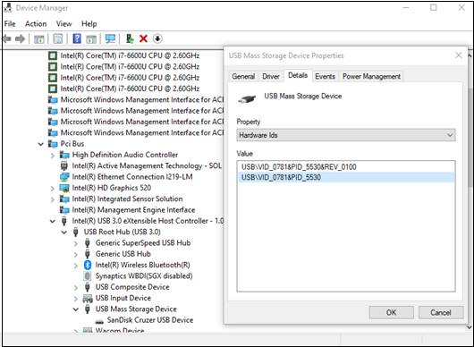

# <a name="how-to-control-usb-devices-and-other-removable-media-using-microsoft-defender-for-endpoint"></a>USB-apparaten en andere verwisselbare media beheren met Microsoft Defender voor Eindpunt

**Van toepassing op:** [Microsoft Defender voor Eindpunt](https://go.microsoft.com/fwlink/p/?linkid=2069559)

Microsoft raadt een gelaagde benadering aan voor het beveiligen van verwisselbare [media](https://aka.ms/devicecontrolblog)en Microsoft Defender voor Eindpunt biedt meerdere controle- en beheerfuncties om te voorkomen dat bedreigingen in niet-geautoriseerde randapparatuur uw apparaten in gevaar brengen:

1. [Ontdek verbonden gebeurtenissen voor randapparatuur in Microsoft Defender for Endpoint advanced hunting](#discover-plug-and-play-connected-events). Verdachte gebruiksactiviteiten identificeren of onderzoeken.

2. Configureren om alleen bepaalde verwisselbare apparaten toe te staan of te blokkeren en bedreigingen te voorkomen.
    1. [Verwisselbare apparaten toestaan](#allow-or-block-removable-devices) of blokkeren op basis van een gedetailleerde configuratie om schrijftoegang tot verwisselbare schijven te weigeren en apparaten goed te keuren of te weigeren met behulp van USB-apparaat-ID's. Flexibele beleidstoewijzing van instellingen voor apparaatinstallatie op basis van een individu of groep Azure Active Directory (Azure AD) gebruikers en apparaten.

    2. [Voorkom dat bedreigingen van verwisselbare opslag](#prevent-threats-from-removable-storage) worden geïntroduceerd door verwisselbare opslagapparaten door het volgende in te stellen:  
        - Microsoft Defender Antivirus realtime beveiliging (RTP) om verwisselbare opslag op malware te scannen.  
        - De USB-regel Attack Surface Reduction (ASR) om niet-vertrouwde en niet-ondertekende processen te blokkeren die vanaf USB worden uitgevoerd.  
        - DMA-beveiligingsinstellingen (Direct Memory Access) om DMA-aanvallen te beperken, zoals Kernel DMA Protection voor Thunderbolt en het blokkeren van DMA totdat een gebruiker zich meldt.  

3. [Maak aangepaste waarschuwingen](#create-customized-alerts-and-response-actions) en antwoordacties om het gebruik van verwisselbare apparaten te controleren op basis van deze gebeurtenissen voor in- en afspelen of andere Microsoft Defender voor eindpuntgebeurtenissen met [aangepaste detectieregels.](/microsoft-365/security/defender-endpoint/custom-detection-rules)

4. [Reageer in realtime op](#respond-to-threats) bedreigingen van randapparatuur op basis van eigenschappen die door elke randapparatuur worden gerapporteerd.

>[!Note]
>Deze risicobeperkingsmaatregelen helpen voorkomen dat malware in uw omgeving binnenkomt. Als u wilt voorkomen dat ondernemingsgegevens uw omgeving verlaten, kunt u ook preventiemaatregelen voor gegevensverlies configureren. Op Windows 10-apparaten kunt u bijvoorbeeld [BitLocker](/windows/security/information-protection/bitlocker/bitlocker-overview.md) en [Windows Information Protection](/windows/security/information-protection/create-wip-policy-using-intune-azure.md)configureren, waarmee bedrijfsgegevens worden versleuteld, zelfs als deze zijn opgeslagen op een persoonlijk apparaat, of de [CSP van Storage/VerwisselbaarDiskDenyWriteAccess gebruiken](/windows/client-management/mdm/policy-csp-storage#storage-removablediskdenywriteaccess) om schrijftoegang tot verwisselbare schijven te weigeren. Bovendien kunt u bestanden classificeren en beveiligen op Windows apparaten [(inclusief](/windows/security/threat-protection/windows-defender-atp/information-protection-in-windows-overview) hun usb-apparaten) met Behulp van Microsoft Defender voor Eindpunt en Azure Information Protection.

## <a name="discover-plug-and-play-connected-events"></a>Verbonden gebeurtenissen in- en afspelen ontdekken

U kunt verbonden gebeurtenissen in Microsoft Defender for Endpoint advanced hunting bekijken om verdachte gebruiksactiviteiten te identificeren of interne onderzoeken uit te voeren.
Zie de microsoft Defender for Endpoint-query's voor GitHub repo voor voorbeelden van geavanceerde [zoekquery's van Defender voor eindpunten.](https://github.com/Microsoft/WindowsDefenderATP-Hunting-Queries)

Voorbeeld Power BI rapportsjablonen zijn beschikbaar voor Microsoft Defender voor eindpunten die u kunt gebruiken voor geavanceerde zoekquery's. Met deze voorbeeldsjablonen, waaronder een voor apparaatbeheer, kunt u de kracht van Geavanceerd zoeken integreren in Power BI. Zie de [GitHub opslagplaats voor PowerBI-sjablonen](https://github.com/microsoft/MDATP-PowerBI-Templates) voor meer informatie. Zie [Aangepaste rapporten maken met Power BI](/microsoft-365/security/defender-endpoint/api-power-bi) voor meer informatie over Power BI integratie.

## <a name="allow-or-block-removable-devices"></a>Verwisselbare apparaten toestaan of blokkeren
In de volgende tabel worden de manieren beschreven waarop verwisselbare apparaten kunnen worden toegestaan of geblokkeerd op basis van een gedetailleerde configuratie.

| Besturingselement  | Omschrijving |
|----------|-------------|
| [USB-stations en andere randapparatuur beperken](#restrict-usb-drives-and-other-peripherals) | U kunt toestaan/voorkomen dat gebruikers alleen de USB-stations en andere randapparatuur installeren die zijn opgenomen in een lijst met geautoriseerde/niet-geautoriseerde apparaten of apparaattypen. |
| [Installatie en gebruik van verwisselbare opslag blokkeren](#block-installation-and-usage-of-removable-storage) | U kunt verwisselbare opslag niet installeren of gebruiken. |
| [Installatie en gebruik van specifiek goedgekeurde randapparatuur toestaan](#allow-installation-and-usage-of-specifically-approved-peripherals)   | U kunt alleen goedgekeurde randapparatuur installeren en gebruiken die specifieke eigenschappen in de firmware rapporteren. |
| [Installatie van specifiek verboden randapparatuur voorkomen](#prevent-installation-of-specifically-prohibited-peripherals) | U kunt geen verboden randapparatuur installeren of gebruiken die specifieke eigenschappen in hun firmware rapporteren. |
| [Installatie en gebruik van specifiek goedgekeurde randapparatuur toestaan met overeenkomende apparaat-exemplaar-ID's](#allow-installation-and-usage-of-specifically-approved-peripherals-with-matching-device-instance-ids) | U kunt alleen goedgekeurde randapparatuur installeren en gebruiken die overeenkomen met een van deze apparaat-exemplaar-ID's. |
| [Installatie en gebruik van specifiek verboden randapparatuur voorkomen met overeenkomende apparaat-exemplaar-ID's](#prevent-installation-and-usage-of-specifically-prohibited-peripherals-with-matching-device-instance-ids) | U kunt geen verboden randapparatuur installeren of gebruiken die overeenkomen met een van deze apparaat-exemplaar-ID's. |
| [Services beperken die gebruikmaken van Bluetooth](#limit-services-that-use-bluetooth) | U kunt de services beperken die gebruik kunnen maken van Bluetooth. |
| [Microsoft Defender voor basislijninstellingen voor eindpunten gebruiken](#use-microsoft-defender-for-endpoint-baseline-settings) | U kunt de aanbevolen configuratie voor ATP instellen met behulp van de beveiligingslijn Defender voor eindpunt. |

### <a name="restrict-usb-drives-and-other-peripherals"></a>USB-stations en andere randapparatuur beperken

Als u malware-infecties of gegevensverlies wilt voorkomen, kan een organisatie USB-stations en andere randapparatuur beperken. In de volgende tabel wordt beschreven op welke manieren Microsoft Defender voor Eindpunt kan helpen bij het voorkomen van de installatie en het gebruik van USB-stations en andere randapparatuur.

| Besturingselement  | Omschrijving
|----------|-------------|
| [Installatie en gebruik van USB-stations en andere randapparatuur toestaan](#allow-installation-and-usage-of-usb-drives-and-other-peripherals) | Gebruikers toestaan om alleen de USB-stations en andere randapparatuur te installeren die zijn opgenomen in een lijst met geautoriseerde apparaten of apparaattypen |
| [Installatie en gebruik van USB-stations en andere randapparatuur voorkomen](#prevent-installation-and-usage-of-usb-drives-and-other-peripherals) | Voorkomen dat gebruikers USB-stations en andere randapparatuur installeren die zijn opgenomen in een lijst met niet-geautoriseerde apparaten en apparaattypen |

Alle bovenstaande besturingselementen kunnen worden [](/intune/administrative-templates-windows)ingesteld via de Beheersjablonen van Intune. Het relevante beleid bevindt zich hier in de Intune-beheerderssjablonen:


>[!Note]
>Met Intune kunt u apparaatconfiguratiebeleid toepassen op Azure AD-gebruikers en/of apparaatgroepen.
Het bovenstaande beleid kan ook worden ingesteld via de [CSP-instellingen](/windows/client-management/mdm/policy-csp-deviceinstallation) voor apparaatinstallatie en de [apparaatinstallatie-GPOs.](/previous-versions/dotnet/articles/bb530324(v=msdn.10))

> [!Note]
> Test en verfijn deze instellingen altijd eerst met een testgroep gebruikers en apparaten voordat u ze in productie gaat toepassen.
Zie de Microsoft Defender for [Endpoint-blog](https://www.microsoft.com/security/blog/2018/12/19/windows-defender-atp-has-protections-for-usb-and-removable-devices/)voor meer informatie over het beheren van USB-apparaten.

#### <a name="allow-installation-and-usage-of-usb-drives-and-other-peripherals"></a>Installatie en gebruik van USB-stations en andere randapparatuur toestaan

Een manier om de installatie en het gebruik van USB-stations en andere randapparatuur mogelijk te maken, is om te beginnen door alles toe te staan. Daarna kunt u beginnen met het verminderen van de toegestane USB-stuurprogramma's en andere randapparatuur.

>[!Note]
>Omdat een niet-geautoriseerd USB-randapparaat firmware kan hebben waarmee de USB-eigenschappen worden vervalst, wordt u aangeraden alleen specifiek goedgekeurde USB-randapparatuur toe te staan en de gebruikers die toegang hebben tot deze randapparatuur te beperken.

1. Installatie **voorkomen inschakelen van apparaten die niet door** andere beleidsinstellingen voor alle gebruikers zijn beschreven.
2. Installatie **van apparaten toestaan met stuurprogramma's die overeenkomen met deze apparaatconfiguratieklassen** inschakelen voor alle [apparaatconfiguratieklassen.](/windows-hardware/drivers/install/system-defined-device-setup-classes-available-to-vendors)

Als u het beleid wilt afdwingen voor al geïnstalleerde apparaten, moet u het beleid voor preventie met deze instelling toepassen.

Wanneer u het installatiebeleid voor apparaten toestaan configureert, moet u ook alle bovenliggende kenmerken toestaan. U kunt de ouders van een apparaat bekijken door Apparaatbeheer te openen en te bekijken op verbinding.


In dit voorbeeld moesten de volgende klassen worden toegevoegd: HID, Toetsenbord en {36fc9e60-c465-11cf-8056-444553540000}. Zie [DOOR Microsoft geleverde USB-stuurprogramma's](/windows-hardware/drivers/usbcon/supported-usb-classes) voor meer informatie.


Als u wilt beperken tot bepaalde apparaten, verwijdert u de installatieklasse van het apparaat van de randapparatuur die u wilt beperken. Voeg vervolgens de apparaat-id toe die u wilt toevoegen. Apparaat-id is gebaseerd op de leverancier-id- en product-id-waarden voor een apparaat. Zie Standaard USB-id's voor informatie over [apparaat-id-indelingen.](/windows-hardware/drivers/install/standard-usb-identifiers) 

Zie Apparaat-id op zoeken om de apparaat-id's [te vinden.](#look-up-device-id) 

Bijvoorbeeld:

1. Class USBDevice verwijderen uit de installatie toestaan van apparaten met **stuurprogramma's die overeenkomen met deze apparaatinstallatie.**
2. Voeg de apparaat-id toe die moet worden toegestaan in de installatie van apparaten toestaan die **overeenkomen met een van deze apparaat-id's.** 


#### <a name="prevent-installation-and-usage-of-usb-drives-and-other-peripherals"></a>Installatie en gebruik van USB-stations en andere randapparatuur voorkomen

Als u de installatie van een apparaatklasse of bepaalde apparaten wilt voorkomen, kunt u het installatiebeleid voor apparaten voorkomen gebruiken:

1. Schakel Installatie voorkomen in van apparaten die overeenkomen met een van deze **apparaat-ID's** en voeg deze apparaten toe aan de lijst.
2. Installatie **van apparaten voorkomen inschakelen met stuurprogramma's die overeenkomen met deze apparaatconfiguratieklassen.**

> [!Note]
> Het beleid voor het voorkomen van apparaatinstallatie heeft voorrang op het beleid voor apparaatinstallatie toestaan.

Met De installatie van apparaten voorkomen die overeenkomen met een van deze **apparaat-ID's** kunt u een lijst opgeven met apparaten die niet Windows kunnen worden geïnstalleerd. 

Als u wilt voorkomen dat apparaten worden geïnstalleerd die overeenkomen met een van deze apparaat-ID's: 

1. [Zoek apparaat-id op](#look-up-device-id) voor apparaten die u wilt Windows om te voorkomen dat ze worden geïnstalleerd.

   

2. Schakel Installatie voorkomen in van apparaten die overeenkomen met een van deze **apparaat-ID's** en voeg de leverancier- of product-ed's toe aan de lijst.

    

#### <a name="look-up-device-id"></a>Apparaat-id op zoeken

U kunt Apparaatbeheer gebruiken om een apparaat-id op te zoeken.

1. Open Device Manager.
2. Klik **op Weergeven** en selecteer Apparaten op **verbinding**.
3. Klik in de boom met de rechtermuisknop op het apparaat en selecteer **Eigenschappen.**
4. Klik in het dialoogvenster voor het geselecteerde apparaat op het **tabblad Details.**
5. Klik op **de** vervolgkeuzelijst Eigenschap en selecteer **Hardware-id's.**
6. Klik met de rechtermuisknop op de bovenste id-waarde en selecteer **Kopiëren.**

Zie Standaard [USB-id's](/windows-hardware/drivers/install/standard-usb-identifiers)voor informatie over apparaat-id-indelingen.

Zie USB-leden voor informatie over [leveranciers-ID's.](https://www.usb.org/members)

Het volgende is een voorbeeld voor het zoeken naar een apparaat-id of product-id (die deel uitmaakt van de apparaat-id) met PowerShell: 

```powershell
Get-WMIObject -Class Win32_DiskDrive |
Select-Object -Property * 
```

Met **het beleid** Voorkom installatie van apparaten met stuurprogramma's die overeenkomen met dit beleid voor apparaatconfiguratieklassen, kunt u apparaatconfiguratieklassen opgeven die niet Windows kunnen worden geïnstalleerd. 

Als u wilt voorkomen dat bepaalde klassen apparaten worden geïnstalleerd: 

1. Zoek de GUID van de apparaatconfiguratieklasse van [systeem gedefinieerde apparaatconfiguratieklassen die beschikbaar zijn voor leveranciers.](/windows-hardware/drivers/install/system-defined-device-setup-classes-available-to-vendors)

2. Schakel Installatie van apparaten voorkomen in met behulp van stuurprogramma's die overeenkomen met deze **apparaatconfiguratieklassen** en voeg de klasse-GUID toe aan de lijst.

    > [!div class="mx-imgBorder"]
    > 

### <a name="block-installation-and-usage-of-removable-storage"></a>Installatie en gebruik van verwisselbare opslag blokkeren

1. Meld u aan bij [het Microsoft Endpoint Manager beheercentrum.](https://endpoint.microsoft.com/)

2. Klik **op**  >  **Apparaatconfiguratieprofielen Profiel**  >  **maken.**

    > [!div class="mx-imgBorder"]
    > 

3. Gebruik de volgende instellingen:

   - Naam: Typ een naam voor het profiel
   - Beschrijving: Typ een beschrijving
   - Platform: Windows 10 en hoger
   - Profieltype: Apparaatbeperkingen

   > [!div class="mx-imgBorder"]
   > 

4. Klik **op Algemeen**  >  **configureren.**  

5. Voor **Verwisselbare opslag** en **USB-verbinding (alleen mobiel)** kiest u **Blokkeren.** **Verwisselbare opslag** omvat USB-stations, terwijl **USB-verbinding (alleen mobiel)** USB-opladen uitsluit, maar alleen andere USB-verbindingen op mobiele apparaten bevat. 

   

6. Klik **op OK** om algemene instellingen **en** **apparaatbeperkingen te sluiten.**

7. Klik **op Maken** om het profiel op te slaan.

### <a name="allow-installation-and-usage-of-specifically-approved-peripherals"></a>Installatie en gebruik van specifiek goedgekeurde randapparatuur toestaan

Randapparaten die mogen worden geïnstalleerd, kunnen worden opgegeven met hun [hardwareidentiteit.](/windows-hardware/drivers/install/device-identification-strings) Zie Apparaataanduidingsindelingen voor een lijst met algemene [id-structuren.](/windows-hardware/drivers/install/device-identifier-formats) Test de configuratie voordat u deze uitrolt om ervoor te zorgen dat deze blokkeert en de verwachte apparaten toestaat. Test in het ideale geval verschillende exemplaren van de hardware. Test bijvoorbeeld meerdere USB-toetsen in plaats van slechts één.

Zie [DeviceInstallation/AllowInstallationOfMatchingDeviceIDs CSP (Apparaatinstallatie/AllowInstallationOfMatchingDeviceIDs CSP)](/windows/client-management/mdm/policy-csp-deviceinstallation#deviceinstallation-allowinstallationofmatchingdeviceids)voor een voorbeeld van SyncML dat de installatie van specifieke apparaat-ID's toestaat. Zie [DeviceInstallation/AllowInstallationOfMatchingDeviceSetupClasses CSP](/windows/client-management/mdm/policy-csp-deviceinstallation#deviceinstallation-allowinstallationofmatchingdevicesetupclasses)als u specifieke apparaatklassen wilt toestaan.
Voor het toestaan van de installatie van specifieke apparaten moet ook [DeviceInstallation/PreventInstallationOfDevicesNotDescribedByOtherPolicySettings worden inschakelen.](/windows/client-management/mdm/policy-csp-deviceinstallation#deviceinstallation-preventinstallationofdevicesnotdescribedbyotherpolicysettings)

### <a name="prevent-installation-of-specifically-prohibited-peripherals"></a>Installatie van specifiek verboden randapparatuur voorkomen

Microsoft Defender voor Eindpunt blokkeert de installatie en het gebruik van verboden randapparatuur met behulp van een van de volgende opties:

- [Beheersjablonen](/intune/administrative-templates-windows) kunnen elk apparaat blokkeren met een overeenkomende hardware-id of installatieklasse.  
- [CSP-instellingen voor apparaatinstallatie](/windows/client-management/mdm/policy-csp-deviceinstallation) met een aangepast profiel in Intune. U kunt [de installatie van specifieke apparaat-ID's](/windows/client-management/mdm/policy-csp-deviceinstallation#deviceinstallation-preventinstallationofmatchingdeviceids) voorkomen of specifieke [apparaatklassen voorkomen.](/windows/client-management/mdm/policy-csp-deviceinstallation#deviceinstallation-preventinstallationofmatchingdevicesetupclasses)

### <a name="allow-installation-and-usage-of-specifically-approved-peripherals-with-matching-device-instance-ids"></a>Installatie en gebruik van specifiek goedgekeurde randapparatuur toestaan met overeenkomende apparaat-exemplaar-ID's

Randapparatuur die mag worden geïnstalleerd, kunnen worden opgegeven met de [apparaat-exemplaar-ID's.](/windows-hardware/drivers/install/device-instance-ids) Test de configuratie voordat u deze uitrolt om ervoor te zorgen dat de apparaten worden verwacht. Test in het ideale geval verschillende exemplaren van de hardware. Test bijvoorbeeld meerdere USB-toetsen in plaats van slechts één.

U kunt de installatie en het gebruik van goedgekeurde randapparatuur met overeenkomende apparaat-exemplaar-ID's toestaan door de beleidsinstelling [DeviceInstallation/AllowInstallationOfMatchingDeviceInstanceIDs](/windows/client-management/mdm/policy-csp-deviceinstallation#deviceinstallation-allowinstallationofmatchingdeviceinstanceids) te configureren.

### <a name="prevent-installation-and-usage-of-specifically-prohibited-peripherals-with-matching-device-instance-ids"></a>Installatie en gebruik van specifiek verboden randapparatuur voorkomen met overeenkomende apparaat-exemplaar-ID's

Randapparatuur die niet mag worden geïnstalleerd, kunnen worden opgegeven met de [apparaat-exemplaar-ID's.](/windows-hardware/drivers/install/device-instance-ids) Test de configuratie voordat u deze uitrolt om ervoor te zorgen dat de apparaten worden verwacht. Test in het ideale geval verschillende exemplaren van de hardware. Test bijvoorbeeld meerdere USB-toetsen in plaats van slechts één.

U kunt de installatie van de verboden randapparatuur met overeenkomende apparaat-exemplaar-ID's voorkomen door de beleidsinstelling [DeviceInstallation/PreventInstallationOfMatchingDeviceInstanceIDs](/windows/client-management/mdm/policy-csp-deviceinstallation#deviceinstallation-preventinstallationofmatchingdeviceinstanceids) te configureren.

### <a name="limit-services-that-use-bluetooth"></a>Services beperken die gebruikmaken van Bluetooth

Met Intune kunt u de services beperken die kunnen worden gebruikt Bluetooth de ['Bluetooth toegestane services'.](/windows/client-management/mdm/policy-csp-bluetooth#servicesallowedlist-usage-guide) De standaardtoestand van 'Bluetooth toegestane services' betekent dat alles is toegestaan.  Zodra er een service wordt toegevoegd, wordt dat de toegestane lijst. Als de klant de waarden Toetsenborden en Muizen toevoegt en de GUID's voor bestandsoverdracht niet toevoegt, moet de bestandsoverdracht worden geblokkeerd.

> [!div class="mx-imgBorder"]
> 

### <a name="use-microsoft-defender-for-endpoint-baseline-settings"></a>Microsoft Defender voor basislijninstellingen voor eindpunten gebruiken

De basislijninstellingen van Microsoft Defender voor Eindpunt vertegenwoordigen de aanbevolen configuratie voor bedreigingsbeveiliging. Configuratie-instellingen voor basislijn bevinden zich op de profielpagina bewerken van de configuratie-instellingen.

> [!div class="mx-imgBorder"]
> 

## <a name="prevent-threats-from-removable-storage"></a>Bedreigingen van verwisselbare opslag voorkomen
  
Verwisselbare opslagapparaten kunnen extra beveiligingsrisico's voor uw organisatie met zich brengen. Microsoft Defender voor Eindpunt kan helpen bij het identificeren en blokkeren van schadelijke bestanden op verwisselbare opslagapparaten.

Microsoft Defender voor Eindpunt kan ook voorkomen dat USB-randapparatuur wordt gebruikt op apparaten om externe bedreigingen te voorkomen. Dit doet het met behulp van de eigenschappen die door USB-randapparatuur worden gerapporteerd om te bepalen of ze al dan niet op het apparaat kunnen worden geïnstalleerd en gebruikt.

Als u USB-apparaten of andere apparaatklassen blokkeert met behulp van het apparaatinstallatiebeleid, kunnen verbonden apparaten, zoals telefoons, nog steeds worden opgeladen.

>[!NOTE]
>Test en verfijn deze instellingen altijd eerst met een testgroep gebruikers en apparaten voordat u deze op grote schaal distribueert naar uw organisatie. 

In de volgende tabel worden de manieren beschreven waarop Microsoft Defender voor eindpunten kan helpen voorkomen dat bedreigingen uit verwisselbare opslag worden verwijderd.

Zie de Microsoft Defender for [Endpoint-blog](https://aka.ms/devicecontrolblog)voor meer informatie over het beheren van USB-apparaten.

| Besturingselement  | Omschrijving |
|----------|-------------|
| [Scannen Microsoft Defender Antivirus inschakelen](#enable-microsoft-defender-antivirus-scanning) | Schakel Microsoft Defender Antivirus scannen in voor realtime beveiliging of geplande scans.|
| [Niet-vertrouwde en niet-ondertekende processen blokkeren op USB-randapparatuur](#block-untrusted-and-unsigned-processes-on-usb-peripherals) | Blokkeer USB-bestanden die niet zijn ondertekend of niet worden vertrouwd. |
| [Beschermen tegen DMA-aanvallen (Direct Memory Access)](#protect-against-direct-memory-access-dma-attacks) | Instellingen configureren om te beschermen tegen DMA-aanvallen. |

>[!NOTE]
>Omdat een niet-geautoriseerd USB-randapparaat firmware kan hebben waarmee de USB-eigenschappen worden vervalst, wordt u aangeraden alleen specifiek goedgekeurde USB-randapparatuur toe te staan en de gebruikers die toegang hebben tot deze randapparatuur te beperken.

### <a name="enable-microsoft-defender-antivirus-scanning"></a>Scannen Microsoft Defender Antivirus inschakelen

Voor het beveiligen van geautoriseerde verwisselbare Microsoft Defender Antivirus is het inschakelen van [realtime](/microsoft-365/security/defender-endpoint/configure-real-time-protection-microsoft-defender-antivirus) beveiliging of het plannen van scans en het configureren van verwisselbare stations voor scans vereist.

- Als realtimebeveiliging is ingeschakeld, worden bestanden gescand voordat ze worden toegankelijk en uitgevoerd. Het scanbereik bevat alle bestanden, ook die opgeslagen verwisselbare apparaten, zoals USB-stations. U kunt desgewenst een [PowerShell-script](/samples/browse/?redirectedfrom=TechNet-Gallery) uitvoeren om een aangepaste scan van een USB-station uit te voeren nadat deze is geïnstalleerd, zodat Microsoft Defender Antivirus alle bestanden op een verwisselbaar apparaat begint te scannen zodra het verwisselbare apparaat is gekoppeld. We raden u echter aan realtime beveiliging in te stellen voor betere scanprestaties, met name voor grote opslagapparaten.

- Als geplande scans worden gebruikt, moet u de instelling DisableRemovableDriveScanning (standaard ingeschakeld) uitschakelen om het verwisselbare apparaat te scannen tijdens een volledige scan. Verwisselbare apparaten worden gescand tijdens een snelle of aangepaste scan, ongeacht de instelling DisableRemovableDriveScanning.

>[!NOTE]
>We raden u aan realtime monitoring in te stellen voor scannen. In Intune kunt u realtime monitoring inschakelen voor Windows 10 in **Apparaatbeperkingen**  >  **Configureren**  >  **Microsoft Defender Antivirus**  >  **realtime monitoring.**

<!-- Need to build out point in the preceding note. 
-->

### <a name="block-untrusted-and-unsigned-processes-on-usb-peripherals"></a>Niet-vertrouwde en niet-ondertekende processen blokkeren op USB-randapparatuur

Eindgebruikers kunnen verwisselbare apparaten aansluiten die zijn geïnfecteerd met malware.
Om infecties te voorkomen, kan een bedrijf USB-bestanden blokkeren die niet-ondertekend of niet-vertrouwd zijn.
Bedrijven kunnen ook gebruikmaken van de auditfunctie van attack [surface reduction rules](/microsoft-365/security/defender-endpoint/attack-surface-reduction) om de activiteit te controleren van niet-vertrouwde en niet-ondertekende processen die worden uitgevoerd op een USB-randapparatuur.
U kunt dit doen door **niet-vertrouwde** en niet-ondertekende  processen in te stellen die van USB naar respectievelijk Blokkeren of Alleen controleren worden uitgevoerd.
Met deze regel kunnen beheerders voorkomen of controleren dat niet-ondertekende of niet-vertrouwde uitvoerbare bestanden worden uitgevoerd vanaf verwisselbare USB-stations, waaronder SD-kaarten.
Getroffen bestandstypen zijn uitvoerbare bestanden (zoals .exe, .dll of .scr) en scriptbestanden zoals een PowerShell(.ps), VisualBasic -bestanden (.vbs) of JavaScript-bestanden (.js).

Voor deze instellingen [moet realtime-beveiliging worden inschakelen.](/microsoft-365/security/defender-endpoint/configure-real-time-protection-microsoft-defender-antivirus)

1. Meld u aan bij [de Microsoft Endpoint Manager.](https://endpoint.microsoft.com/)

2. Klik **op Apparaten**  >  **Windows**  >  **Configuratiebeleid Profiel**  >  **maken.** 

    

3. Gebruik de volgende instellingen:
   - Platform: Windows 10 en hoger 
   - Profieltype: Apparaatbeperkingen

   > [!div class="mx-imgBorder"]
   > 

4. Klik op **Maken**.  

5. Voor **Niet-ondertekende en niet-vertrouwde processen** die worden uitgevoerd vanaf USB, kiest u **Blokkeren.**

   

6. Klik **op OK** om instellingen en **apparaatbeperkingen te sluiten.**

### <a name="protect-against-direct-memory-access-dma-attacks"></a>Beschermen tegen DMA-aanvallen (Direct Memory Access)

DMA-aanvallen kunnen leiden tot het vrijgeven van gevoelige informatie op een pc of zelfs tot het injecteren van malware waarmee aanvallers het vergrendelingsscherm kunnen omzeilen of pc's op afstand kunnen bedienen. Met de volgende instellingen kunt u DMA-aanvallen voorkomen:

1. Vanaf Windows 10 versie 1803 heeft Microsoft Kernel DMA Protection voor [Thunderbolt](/windows/security/information-protection/kernel-dma-protection-for-thunderbolt.md) geïntroduceerd om native bescherming te bieden tegen DMA-aanvallen via Thunderbolt-poorten. Kernel DMA Protection voor Thunderbolt is ingeschakeld door systeemfabrikant en kan niet door gebruikers worden in- of uitgeschakeld.

   Vanaf Windows 10 versie 1809 kunt u het niveau van Kernel DMA Protection aanpassen door [de DMA Guard CSP te configureren.](/windows/client-management/mdm/policy-csp-dmaguard#dmaguard-deviceenumerationpolicy) Dit is een extra besturingselement voor randapparatuur die geen ondersteuning biedt voor apparaatgeheugenisolatie (ook wel DMA-remapping genoemd). Met geheugenisolatie kan het besturingssysteem gebruikmaken van de I/O Memory Management Unit (IOMMU) van een apparaat om niet-toegelaten I/O of geheugentoegang te blokkeren via de randapparatuur (memory sandboxing). Met andere woorden, het besturingssysteem wijst een bepaald geheugenbereik toe aan de randapparatuur. Als de randapparatuur buiten het toegewezen bereik probeert te lezen/schrijven naar het geheugen, blokkeert het besturingssysteem het.

   Randapparatuur die apparaatgeheugenisolatie ondersteunt, kunnen altijd verbinding maken. Randapparatuur die niet kan worden geblokkeerd, toegestaan of alleen kan worden toegestaan nadat de gebruiker zich heeft aangegeven (standaard).

2. Op Windows 10 systemen die geen ondersteuning bieden voor Kernel DMA Protection, kunt u het volgende doen:

   - [DMA blokkeren totdat een gebruiker zich aan meldt](/windows/client-management/mdm/policy-csp-dataprotection#dataprotection-allowdirectmemoryaccess)
   - [Alle verbindingen blokkeren via de Thunderbolt-poorten (inclusief USB-apparaten)](https://support.microsoft.com/help/2516445/blocking-the-sbp-2-driver-and-thunderbolt-controllers-to-reduce-1394-d)

## <a name="create-customized-alerts-and-response-actions"></a>Aangepaste waarschuwingen en antwoordacties maken

U kunt aangepaste waarschuwingen en antwoordacties maken met de WDATP-connector en de aangepaste detectieregels:

**Wdatp Connector-antwoordacties:**

**Onderzoeken:** Onderzoek starten, onderzoekspakket verzamelen en een computer isoleren.

**Bedreiging scannen** op USB-apparaten.

**De uitvoering** van alle toepassingen op de computer beperken, behalve een vooraf gedefinieerde set MDATP-connector is een van de meer dan 200 vooraf gedefinieerde connectors, waaronder Outlook, Teams, Slack, enzovoort. U kunt aangepaste connectors maken.
- [Meer informatie over WDATP Connector Response Actions](/connectors/wdatp/)

**Reactieactie aangepaste detectieregels:** Acties op machine- en bestandsniveau kunnen worden toegepast.
- [Meer informatie over reactieacties voor aangepaste detectieregels](/microsoft-365/security/defender-endpoint/custom-detection-rules)

Zie Geavanceerde jaagupdates: [USB-gebeurtenissen, acties](https://techcommunity.microsoft.com/t5/Microsoft-Defender-ATP/Advanced-hunting-updates-USB-events-machine-level-actions-and/ba-p/824152)op machineniveau en schemawijzigingen voor informatie over apparaatbesturing gerelateerde gebeurtenissen en voorbeelden over het maken van aangepaste waarschuwingen.

## <a name="respond-to-threats"></a>Reageren op bedreigingen

U kunt aangepaste waarschuwingen en automatische reactieacties maken met de aangepaste detectieregels van [Microsoft Defender voor eindpunten.](/microsoft-365/security/defender-endpoint/custom-detection-rules) Reactieacties in de aangepaste detectie omvatten zowel acties op computer- als bestandsniveau. U kunt ook waarschuwingen en automatische antwoordacties maken met [PowerApps](https://powerapps.microsoft.com/) en [Flow](https://flow.microsoft.com/) met de [Microsoft Defender voor Eindpunt-connector.](/connectors/wdatp/) De connector ondersteunt acties voor onderzoek, het scannen van bedreigingen en het beperken van het uitvoeren van toepassingen. Het is een van de meer dan 200 vooraf gedefinieerde connectors, Outlook, Teams, Slack en meer. U kunt ook aangepaste connectors maken. Zie [Connectors](/connectors/) voor meer informatie over verbindingslijnen.
 
Met een van beide benaderingen kunt u bijvoorbeeld automatisch de Microsoft Defender Antivirus uitvoeren wanneer een USB-apparaat op een computer is geïnstalleerd.

## <a name="related-topics"></a>Verwante onderwerpen

- [Realtime beveiliging configureren voor Microsoft Defender Antivirus](/microsoft-365/security/defender-endpoint/configure-real-time-protection-microsoft-defender-antivirus)
- [Defender/AllowFullScanRemovableDriveScanning](/windows/client-management/mdm/policy-csp-defender#defender-allowfullscanremovabledrivescanning)
- [Policy/DeviceInstallation CSP](/windows/client-management/mdm/policy-csp-deviceinstallation)
- [Een aangepaste scan uitvoeren van een verwisselbaar apparaat](/samples/browse/?redirectedfrom=TechNet-Gallery)
- [PowerBI-sjabloon apparaatbesturingselement voor aangepaste rapportage](https://github.com/microsoft/MDATP-PowerBI-Templates)
- [BitLocker](/windows/security/information-protection/bitlocker/bitlocker-overview.md) 
- [Windows-gegevensbescherming](/windows/security/information-protection/windows-information-protection/create-wip-policy-using-intune-azure.md)
