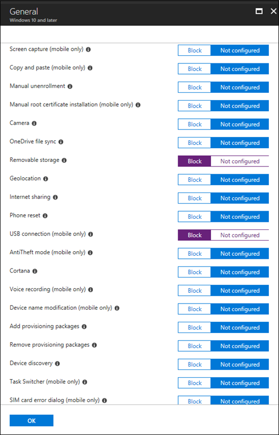

# <a name="how-to-control-usb-devices-and-other-removable-media-using-microsoft-defender-for-endpoint"></a><span data-ttu-id="9821c-103">USB-apparaten en andere verwisselbare media beheren met Microsoft Defender voor Eindpunt</span><span class="sxs-lookup"><span data-stu-id="9821c-103">How to control USB devices and other removable media using Microsoft Defender for Endpoint</span></span>

<span data-ttu-id="9821c-104">**Van toepassing op:** [Microsoft Defender voor Eindpunt](https://go.microsoft.com/fwlink/p/?linkid=2069559)</span><span class="sxs-lookup"><span data-stu-id="9821c-104">**Applies to:** [Microsoft Defender for Endpoint](https://go.microsoft.com/fwlink/p/?linkid=2069559)</span></span>

<span data-ttu-id="9821c-105">Microsoft raadt een gelaagde benadering aan voor het beveiligen van verwisselbare [media](https://aka.ms/devicecontrolblog)en Microsoft Defender voor Eindpunt biedt meerdere controle- en beheerfuncties om te voorkomen dat bedreigingen in niet-geautoriseerde randapparatuur uw apparaten in gevaar brengen:</span><span class="sxs-lookup"><span data-stu-id="9821c-105">Microsoft recommends [a layered approach to securing removable media](https://aka.ms/devicecontrolblog), and Microsoft Defender for Endpoint provides multiple monitoring and control features to help prevent threats in unauthorized peripherals from compromising your devices:</span></span>

1. <span data-ttu-id="9821c-106">[Ontdek verbonden gebeurtenissen voor randapparatuur in Microsoft Defender for Endpoint advanced hunting](#discover-plug-and-play-connected-events).</span><span class="sxs-lookup"><span data-stu-id="9821c-106">[Discover plug and play connected events for peripherals in Microsoft Defender for Endpoint advanced hunting](#discover-plug-and-play-connected-events).</span></span> <span data-ttu-id="9821c-107">Verdachte gebruiksactiviteiten identificeren of onderzoeken.</span><span class="sxs-lookup"><span data-stu-id="9821c-107">Identify or investigate suspicious usage activity.</span></span>

2. <span data-ttu-id="9821c-108">Configureren om alleen bepaalde verwisselbare apparaten toe te staan of te blokkeren en bedreigingen te voorkomen.</span><span class="sxs-lookup"><span data-stu-id="9821c-108">Configure to allow or block only certain removable devices and prevent threats.</span></span>
    1. <span data-ttu-id="9821c-109">[Verwisselbare apparaten toestaan](#allow-or-block-removable-devices) of blokkeren op basis van een gedetailleerde configuratie om schrijftoegang tot verwisselbare schijven te weigeren en apparaten goed te keuren of te weigeren met behulp van USB-apparaat-ID's.</span><span class="sxs-lookup"><span data-stu-id="9821c-109">[Allow or block removable devices](#allow-or-block-removable-devices) based on granular configuration to deny write access to removable disks and approve or deny devices by using USB device IDs.</span></span> <span data-ttu-id="9821c-110">Flexibele beleidstoewijzing van instellingen voor apparaatinstallatie op basis van een individu of groep Azure Active Directory (Azure AD) gebruikers en apparaten.</span><span class="sxs-lookup"><span data-stu-id="9821c-110">Flexible policy assignment of device installation settings based on an individual or group of Azure Active Directory (Azure AD) users and devices.</span></span>

    2. <span data-ttu-id="9821c-111">[Voorkom dat bedreigingen van verwisselbare opslag](#prevent-threats-from-removable-storage) worden geïntroduceerd door verwisselbare opslagapparaten door het volgende in te stellen:</span><span class="sxs-lookup"><span data-stu-id="9821c-111">[Prevent threats from removable storage](#prevent-threats-from-removable-storage) introduced by removable storage devices by enabling:</span></span>  
        - <span data-ttu-id="9821c-112">Microsoft Defender Antivirus realtime beveiliging (RTP) om verwisselbare opslag op malware te scannen.</span><span class="sxs-lookup"><span data-stu-id="9821c-112">Microsoft Defender Antivirus real-time protection (RTP) to scan removable storage for malware.</span></span>  
        - <span data-ttu-id="9821c-113">De USB-regel Attack Surface Reduction (ASR) om niet-vertrouwde en niet-ondertekende processen te blokkeren die vanaf USB worden uitgevoerd.</span><span class="sxs-lookup"><span data-stu-id="9821c-113">The Attack Surface Reduction (ASR) USB rule to block untrusted and unsigned processes that run from USB.</span></span>  
        - <span data-ttu-id="9821c-114">DMA-beveiligingsinstellingen (Direct Memory Access) om DMA-aanvallen te beperken, zoals Kernel DMA Protection voor Thunderbolt en het blokkeren van DMA totdat een gebruiker zich meldt.</span><span class="sxs-lookup"><span data-stu-id="9821c-114">Direct Memory Access (DMA) protection settings to mitigate DMA attacks, including Kernel DMA Protection for Thunderbolt and blocking DMA until a user signs in.</span></span>  

3. <span data-ttu-id="9821c-115">[Maak aangepaste waarschuwingen](#create-customized-alerts-and-response-actions) en antwoordacties om het gebruik van verwisselbare apparaten te controleren op basis van deze gebeurtenissen voor in- en afspelen of andere Microsoft Defender voor eindpuntgebeurtenissen met [aangepaste detectieregels.](/microsoft-365/security/defender-endpoint/custom-detection-rules)</span><span class="sxs-lookup"><span data-stu-id="9821c-115">[Create customized alerts and response actions](#create-customized-alerts-and-response-actions) to monitor usage of removable devices based on these plug and play events or any other Microsoft Defender for Endpoint events with [custom detection rules](/microsoft-365/security/defender-endpoint/custom-detection-rules).</span></span>

4. <span data-ttu-id="9821c-116">[Reageer in realtime op](#respond-to-threats) bedreigingen van randapparatuur op basis van eigenschappen die door elke randapparatuur worden gerapporteerd.</span><span class="sxs-lookup"><span data-stu-id="9821c-116">[Respond to threats](#respond-to-threats) from peripherals in real-time based on properties reported by each peripheral.</span></span>

>[!Note]
><span data-ttu-id="9821c-117">Deze risicobeperkingsmaatregelen helpen voorkomen dat malware in uw omgeving binnenkomt.</span><span class="sxs-lookup"><span data-stu-id="9821c-117">These threat reduction measures help prevent malware from coming into your environment.</span></span> <span data-ttu-id="9821c-118">Als u wilt voorkomen dat ondernemingsgegevens uw omgeving verlaten, kunt u ook preventiemaatregelen voor gegevensverlies configureren.</span><span class="sxs-lookup"><span data-stu-id="9821c-118">To protect enterprise data from leaving your environment, you can also configure data loss prevention measures.</span></span> <span data-ttu-id="9821c-119">Op Windows 10-apparaten kunt u bijvoorbeeld [BitLocker](/windows/security/information-protection/bitlocker/bitlocker-overview.md) en [Windows Information Protection](/windows/security/information-protection/create-wip-policy-using-intune-azure.md)configureren, waarmee bedrijfsgegevens worden versleuteld, zelfs als deze zijn opgeslagen op een persoonlijk apparaat, of de [CSP van Storage/VerwisselbaarDiskDenyWriteAccess gebruiken](/windows/client-management/mdm/policy-csp-storage#storage-removablediskdenywriteaccess) om schrijftoegang tot verwisselbare schijven te weigeren.</span><span class="sxs-lookup"><span data-stu-id="9821c-119">For example, on Windows 10 devices you can configure [BitLocker](/windows/security/information-protection/bitlocker/bitlocker-overview.md) and [Windows Information Protection](/windows/security/information-protection/create-wip-policy-using-intune-azure.md), which will encrypt company data even if it is stored on a personal device, or use the [Storage/RemovableDiskDenyWriteAccess CSP](/windows/client-management/mdm/policy-csp-storage#storage-removablediskdenywriteaccess) to deny write access to removable disks.</span></span> <span data-ttu-id="9821c-120">Bovendien kunt u bestanden classificeren en beveiligen op Windows apparaten [(inclusief](/windows/security/threat-protection/windows-defender-atp/information-protection-in-windows-overview) hun usb-apparaten) met Behulp van Microsoft Defender voor Eindpunt en Azure Information Protection.</span><span class="sxs-lookup"><span data-stu-id="9821c-120">Additionally, you can [classify and protect files on Windows devices](/windows/security/threat-protection/windows-defender-atp/information-protection-in-windows-overview) (including their mounted USB devices) by using Microsoft Defender for Endpoint and Azure Information Protection.</span></span>

## <a name="discover-plug-and-play-connected-events"></a><span data-ttu-id="9821c-121">Verbonden gebeurtenissen in- en afspelen ontdekken</span><span class="sxs-lookup"><span data-stu-id="9821c-121">Discover plug and play connected events</span></span>

<span data-ttu-id="9821c-122">U kunt verbonden gebeurtenissen in Microsoft Defender for Endpoint advanced hunting bekijken om verdachte gebruiksactiviteiten te identificeren of interne onderzoeken uit te voeren.</span><span class="sxs-lookup"><span data-stu-id="9821c-122">You can view plug and play connected events in Microsoft Defender for Endpoint advanced hunting to identify suspicious usage activity or perform internal investigations.</span></span>
<span data-ttu-id="9821c-123">Zie de microsoft Defender for Endpoint-query's voor GitHub repo voor voorbeelden van geavanceerde [zoekquery's van Defender voor eindpunten.](https://github.com/Microsoft/WindowsDefenderATP-Hunting-Queries)</span><span class="sxs-lookup"><span data-stu-id="9821c-123">For examples of Defender for Endpoint advanced hunting queries, see the [Microsoft Defender for Endpoint hunting queries GitHub repo](https://github.com/Microsoft/WindowsDefenderATP-Hunting-Queries).</span></span>

<span data-ttu-id="9821c-124">Voorbeeld Power BI rapportsjablonen zijn beschikbaar voor Microsoft Defender voor eindpunten die u kunt gebruiken voor geavanceerde zoekquery's.</span><span class="sxs-lookup"><span data-stu-id="9821c-124">Sample Power BI report templates are available for Microsoft Defender for Endpoint that you can use for Advanced hunting queries.</span></span> <span data-ttu-id="9821c-125">Met deze voorbeeldsjablonen, waaronder een voor apparaatbeheer, kunt u de kracht van Geavanceerd zoeken integreren in Power BI.</span><span class="sxs-lookup"><span data-stu-id="9821c-125">With these sample templates, including one for device control, you can integrate the power of Advanced hunting into Power BI.</span></span> <span data-ttu-id="9821c-126">Zie de [GitHub opslagplaats voor PowerBI-sjablonen](https://github.com/microsoft/MDATP-PowerBI-Templates) voor meer informatie.</span><span class="sxs-lookup"><span data-stu-id="9821c-126">See the [GitHub repository for PowerBI templates](https://github.com/microsoft/MDATP-PowerBI-Templates) for more information.</span></span> <span data-ttu-id="9821c-127">Zie [Aangepaste rapporten maken met Power BI](/microsoft-365/security/defender-endpoint/api-power-bi) voor meer informatie over Power BI integratie.</span><span class="sxs-lookup"><span data-stu-id="9821c-127">See [Create custom reports using Power BI](/microsoft-365/security/defender-endpoint/api-power-bi) to learn more about Power BI integration.</span></span>

## <a name="allow-or-block-removable-devices"></a><span data-ttu-id="9821c-128">Verwisselbare apparaten toestaan of blokkeren</span><span class="sxs-lookup"><span data-stu-id="9821c-128">Allow or block removable devices</span></span>
<span data-ttu-id="9821c-129">In de volgende tabel worden de manieren beschreven waarop verwisselbare apparaten kunnen worden toegestaan of geblokkeerd op basis van een gedetailleerde configuratie.</span><span class="sxs-lookup"><span data-stu-id="9821c-129">The following table describes the ways Microsoft Defender for Endpoint can allow or block removable devices based on granular configuration.</span></span>

| <span data-ttu-id="9821c-130">Besturingselement</span><span class="sxs-lookup"><span data-stu-id="9821c-130">Control</span></span>  | <span data-ttu-id="9821c-131">Beschrijving</span><span class="sxs-lookup"><span data-stu-id="9821c-131">Description</span></span> |
|----------|-------------|
| [<span data-ttu-id="9821c-132">USB-stations en andere randapparatuur beperken</span><span class="sxs-lookup"><span data-stu-id="9821c-132">Restrict USB drives and other peripherals</span></span>](#restrict-usb-drives-and-other-peripherals) | <span data-ttu-id="9821c-133">U kunt toestaan/voorkomen dat gebruikers alleen de USB-stations en andere randapparatuur installeren die zijn opgenomen in een lijst met geautoriseerde/niet-geautoriseerde apparaten of apparaattypen.</span><span class="sxs-lookup"><span data-stu-id="9821c-133">You can allow/prevent users to install only the USB drives and other peripherals included on a list of authorized/unauthorized devices or device types.</span></span> |
| [<span data-ttu-id="9821c-134">Installatie en gebruik van verwisselbare opslag blokkeren</span><span class="sxs-lookup"><span data-stu-id="9821c-134">Block installation and usage of removable storage</span></span>](#block-installation-and-usage-of-removable-storage) | <span data-ttu-id="9821c-135">U kunt verwisselbare opslag niet installeren of gebruiken.</span><span class="sxs-lookup"><span data-stu-id="9821c-135">You can't install or use removable storage.</span></span> |
| [<span data-ttu-id="9821c-136">Installatie en gebruik van specifiek goedgekeurde randapparatuur toestaan</span><span class="sxs-lookup"><span data-stu-id="9821c-136">Allow installation and usage of specifically approved peripherals</span></span>](#allow-installation-and-usage-of-specifically-approved-peripherals)   | <span data-ttu-id="9821c-137">U kunt alleen goedgekeurde randapparatuur installeren en gebruiken die specifieke eigenschappen in de firmware rapporteren.</span><span class="sxs-lookup"><span data-stu-id="9821c-137">You can only install and use approved peripherals that report specific properties in their firmware.</span></span> |
| [<span data-ttu-id="9821c-138">Installatie van specifiek verboden randapparatuur voorkomen</span><span class="sxs-lookup"><span data-stu-id="9821c-138">Prevent installation of specifically prohibited peripherals</span></span>](#prevent-installation-of-specifically-prohibited-peripherals) | <span data-ttu-id="9821c-139">U kunt geen verboden randapparatuur installeren of gebruiken die specifieke eigenschappen in hun firmware rapporteren.</span><span class="sxs-lookup"><span data-stu-id="9821c-139">You can't install or use prohibited peripherals that report specific properties in their firmware.</span></span> |
| [<span data-ttu-id="9821c-140">Installatie en gebruik van specifiek goedgekeurde randapparatuur toestaan met overeenkomende apparaat-exemplaar-ID's</span><span class="sxs-lookup"><span data-stu-id="9821c-140">Allow installation and usage of specifically approved peripherals with matching device instance IDs</span></span>](#allow-installation-and-usage-of-specifically-approved-peripherals-with-matching-device-instance-ids) | <span data-ttu-id="9821c-141">U kunt alleen goedgekeurde randapparatuur installeren en gebruiken die overeenkomen met een van deze apparaat-exemplaar-ID's.</span><span class="sxs-lookup"><span data-stu-id="9821c-141">You can only install and use approved peripherals that match any of these device instance IDs.</span></span> |
| [<span data-ttu-id="9821c-142">Installatie en gebruik van specifiek verboden randapparatuur voorkomen met overeenkomende apparaat-exemplaar-ID's</span><span class="sxs-lookup"><span data-stu-id="9821c-142">Prevent installation and usage of specifically prohibited peripherals with matching device instance IDs</span></span>](#prevent-installation-and-usage-of-specifically-prohibited-peripherals-with-matching-device-instance-ids) | <span data-ttu-id="9821c-143">U kunt geen verboden randapparatuur installeren of gebruiken die overeenkomen met een van deze apparaat-exemplaar-ID's.</span><span class="sxs-lookup"><span data-stu-id="9821c-143">You can't install or use prohibited peripherals that match any of these device instance IDs.</span></span> |
| [<span data-ttu-id="9821c-144">Services beperken die gebruikmaken van Bluetooth</span><span class="sxs-lookup"><span data-stu-id="9821c-144">Limit services that use Bluetooth</span></span>](#limit-services-that-use-bluetooth) | <span data-ttu-id="9821c-145">U kunt de services beperken die gebruik kunnen maken van Bluetooth.</span><span class="sxs-lookup"><span data-stu-id="9821c-145">You can limit the services that can use Bluetooth.</span></span> |
| [<span data-ttu-id="9821c-146">Microsoft Defender voor basislijninstellingen voor eindpunten gebruiken</span><span class="sxs-lookup"><span data-stu-id="9821c-146">Use Microsoft Defender for Endpoint baseline settings</span></span>](#use-microsoft-defender-for-endpoint-baseline-settings) | <span data-ttu-id="9821c-147">U kunt de aanbevolen configuratie voor ATP instellen met behulp van de beveiligingslijn Defender voor eindpunt.</span><span class="sxs-lookup"><span data-stu-id="9821c-147">You can set the recommended configuration for ATP by using the Defender for Endpoint security baseline.</span></span> |

### <a name="restrict-usb-drives-and-other-peripherals"></a><span data-ttu-id="9821c-148">USB-stations en andere randapparatuur beperken</span><span class="sxs-lookup"><span data-stu-id="9821c-148">Restrict USB drives and other peripherals</span></span>

<span data-ttu-id="9821c-149">Als u malware-infecties of gegevensverlies wilt voorkomen, kan een organisatie USB-stations en andere randapparatuur beperken.</span><span class="sxs-lookup"><span data-stu-id="9821c-149">To prevent malware infections or data loss, an organization may restrict USB drives and other peripherals.</span></span> <span data-ttu-id="9821c-150">In de volgende tabel wordt beschreven op welke manieren Microsoft Defender voor Eindpunt kan helpen bij het voorkomen van de installatie en het gebruik van USB-stations en andere randapparatuur.</span><span class="sxs-lookup"><span data-stu-id="9821c-150">The following table describes the ways Microsoft Defender for Endpoint can help prevent installation and usage of USB drives and other peripherals.</span></span>

| <span data-ttu-id="9821c-151">Besturingselement</span><span class="sxs-lookup"><span data-stu-id="9821c-151">Control</span></span>  | <span data-ttu-id="9821c-152">Beschrijving</span><span class="sxs-lookup"><span data-stu-id="9821c-152">Description</span></span>
|----------|-------------|
| [<span data-ttu-id="9821c-153">Installatie en gebruik van USB-stations en andere randapparatuur toestaan</span><span class="sxs-lookup"><span data-stu-id="9821c-153">Allow installation and usage of USB drives and other peripherals</span></span>](#allow-installation-and-usage-of-usb-drives-and-other-peripherals) | <span data-ttu-id="9821c-154">Gebruikers toestaan om alleen de USB-stations en andere randapparatuur te installeren die zijn opgenomen in een lijst met geautoriseerde apparaten of apparaattypen</span><span class="sxs-lookup"><span data-stu-id="9821c-154">Allow users to install only the USB drives and other peripherals included on a list of authorized devices or device types</span></span> |
| [<span data-ttu-id="9821c-155">Installatie en gebruik van USB-stations en andere randapparatuur voorkomen</span><span class="sxs-lookup"><span data-stu-id="9821c-155">Prevent installation and usage of USB drives and other peripherals</span></span>](#prevent-installation-and-usage-of-usb-drives-and-other-peripherals) | <span data-ttu-id="9821c-156">Voorkomen dat gebruikers USB-stations en andere randapparatuur installeren die zijn opgenomen in een lijst met niet-geautoriseerde apparaten en apparaattypen</span><span class="sxs-lookup"><span data-stu-id="9821c-156">Prevent users from installing USB drives and other peripherals included on a list of unauthorized devices and device types</span></span> |

<span data-ttu-id="9821c-157">Alle bovenstaande besturingselementen kunnen worden [](/intune/administrative-templates-windows)ingesteld via de Beheersjablonen van Intune.</span><span class="sxs-lookup"><span data-stu-id="9821c-157">All of the above controls can be set through the Intune [Administrative Templates](/intune/administrative-templates-windows).</span></span> <span data-ttu-id="9821c-158">Het relevante beleid bevindt zich hier in de Intune-beheerderssjablonen:</span><span class="sxs-lookup"><span data-stu-id="9821c-158">The relevant policies are located here in the Intune Administrator Templates:</span></span>


>[!Note]
><span data-ttu-id="9821c-160">Met Intune kunt u apparaatconfiguratiebeleid toepassen op Azure AD-gebruikers en/of apparaatgroepen.</span><span class="sxs-lookup"><span data-stu-id="9821c-160">Using Intune, you can apply device configuration policies to Azure AD user and/or device groups.</span></span>
<span data-ttu-id="9821c-161">Het bovenstaande beleid kan ook worden ingesteld via de [CSP-instellingen](/windows/client-management/mdm/policy-csp-deviceinstallation) voor apparaatinstallatie en de [apparaatinstallatie-GPOs.](/previous-versions/dotnet/articles/bb530324(v=msdn.10))</span><span class="sxs-lookup"><span data-stu-id="9821c-161">The above policies can also be set through the [Device Installation CSP settings](/windows/client-management/mdm/policy-csp-deviceinstallation) and the [Device Installation GPOs](/previous-versions/dotnet/articles/bb530324(v=msdn.10)).</span></span>

> [!Note]
> <span data-ttu-id="9821c-162">Test en verfijn deze instellingen altijd eerst met een testgroep gebruikers en apparaten voordat u ze in productie gaat toepassen.</span><span class="sxs-lookup"><span data-stu-id="9821c-162">Always test and refine these settings with a pilot group of users and devices first before applying them in production.</span></span>
<span data-ttu-id="9821c-163">Zie de Microsoft Defender for [Endpoint-blog](https://www.microsoft.com/security/blog/2018/12/19/windows-defender-atp-has-protections-for-usb-and-removable-devices/)voor meer informatie over het beheren van USB-apparaten.</span><span class="sxs-lookup"><span data-stu-id="9821c-163">For more information about controlling USB devices, see the [Microsoft Defender for Endpoint blog](https://www.microsoft.com/security/blog/2018/12/19/windows-defender-atp-has-protections-for-usb-and-removable-devices/).</span></span>

#### <a name="allow-installation-and-usage-of-usb-drives-and-other-peripherals"></a><span data-ttu-id="9821c-164">Installatie en gebruik van USB-stations en andere randapparatuur toestaan</span><span class="sxs-lookup"><span data-stu-id="9821c-164">Allow installation and usage of USB drives and other peripherals</span></span>

<span data-ttu-id="9821c-165">Een manier om de installatie en het gebruik van USB-stations en andere randapparatuur mogelijk te maken, is om te beginnen door alles toe te staan.</span><span class="sxs-lookup"><span data-stu-id="9821c-165">One way to approach allowing installation and usage of USB drives and other peripherals is to start by allowing everything.</span></span> <span data-ttu-id="9821c-166">Daarna kunt u beginnen met het verminderen van de toegestane USB-stuurprogramma's en andere randapparatuur.</span><span class="sxs-lookup"><span data-stu-id="9821c-166">Afterwards, you can start reducing the allowable USB drivers and other peripherals.</span></span>

>[!Note]
><span data-ttu-id="9821c-167">Omdat een niet-geautoriseerd USB-randapparaat firmware kan hebben waarmee de USB-eigenschappen worden vervalst, wordt u aangeraden alleen specifiek goedgekeurde USB-randapparatuur toe te staan en de gebruikers die toegang hebben tot deze randapparatuur te beperken.</span><span class="sxs-lookup"><span data-stu-id="9821c-167">Because an unauthorized USB peripheral can have firmware that spoofs its USB properties, we recommend only allowing specifically approved USB peripherals and limiting the users who can access them.</span></span>

1. <span data-ttu-id="9821c-168">Installatie **voorkomen inschakelen van apparaten die niet door** andere beleidsinstellingen voor alle gebruikers zijn beschreven.</span><span class="sxs-lookup"><span data-stu-id="9821c-168">Enable **Prevent installation of devices not described by other policy settings** to all users.</span></span>
2. <span data-ttu-id="9821c-169">Installatie **van apparaten toestaan met stuurprogramma's die overeenkomen met deze apparaatconfiguratieklassen** inschakelen voor alle [apparaatconfiguratieklassen.](/windows-hardware/drivers/install/system-defined-device-setup-classes-available-to-vendors)</span><span class="sxs-lookup"><span data-stu-id="9821c-169">Enable **Allow installation of devices using drivers that match these device setup classes** for all [device setup classes](/windows-hardware/drivers/install/system-defined-device-setup-classes-available-to-vendors).</span></span>

<span data-ttu-id="9821c-170">Als u het beleid wilt afdwingen voor al geïnstalleerde apparaten, moet u het beleid voor preventie met deze instelling toepassen.</span><span class="sxs-lookup"><span data-stu-id="9821c-170">To enforce the policy for already installed devices, apply the prevent policies that have this setting.</span></span>

<span data-ttu-id="9821c-171">Wanneer u het installatiebeleid voor apparaten toestaan configureert, moet u ook alle bovenliggende kenmerken toestaan.</span><span class="sxs-lookup"><span data-stu-id="9821c-171">When configuring the allow device installation policy, you must allow all parent attributes as well.</span></span> <span data-ttu-id="9821c-172">U kunt de ouders van een apparaat bekijken door Apparaatbeheer te openen en te bekijken op verbinding.</span><span class="sxs-lookup"><span data-stu-id="9821c-172">You can view the parents of a device by opening Device Manager and view by connection.</span></span>


<span data-ttu-id="9821c-174">In dit voorbeeld moesten de volgende klassen worden toegevoegd: HID, Toetsenbord en {36fc9e60-c465-11cf-8056-444553540000}.</span><span class="sxs-lookup"><span data-stu-id="9821c-174">In this example, the following classes needed to be added: HID, Keyboard, and {36fc9e60-c465-11cf-8056-444553540000}.</span></span> <span data-ttu-id="9821c-175">Zie [DOOR Microsoft geleverde USB-stuurprogramma's](/windows-hardware/drivers/usbcon/supported-usb-classes) voor meer informatie.</span><span class="sxs-lookup"><span data-stu-id="9821c-175">See [Microsoft-provided USB drivers](/windows-hardware/drivers/usbcon/supported-usb-classes) for more information.</span></span>


<span data-ttu-id="9821c-177">Als u wilt beperken tot bepaalde apparaten, verwijdert u de installatieklasse van het apparaat van de randapparatuur die u wilt beperken.</span><span class="sxs-lookup"><span data-stu-id="9821c-177">If you want to restrict to certain devices, remove the device setup class of the peripheral that you want to limit.</span></span> <span data-ttu-id="9821c-178">Voeg vervolgens de apparaat-id toe die u wilt toevoegen.</span><span class="sxs-lookup"><span data-stu-id="9821c-178">Then add the device ID that you want to add.</span></span> <span data-ttu-id="9821c-179">Apparaat-id is gebaseerd op de leverancier-id- en product-id-waarden voor een apparaat.</span><span class="sxs-lookup"><span data-stu-id="9821c-179">Device ID is based on the vendor ID and product ID values for a device.</span></span> <span data-ttu-id="9821c-180">Zie Standaard USB-id's voor informatie over [apparaat-id-indelingen.](/windows-hardware/drivers/install/standard-usb-identifiers)</span><span class="sxs-lookup"><span data-stu-id="9821c-180">For information on device ID formats, see [Standard USB Identifiers](/windows-hardware/drivers/install/standard-usb-identifiers).</span></span> 

<span data-ttu-id="9821c-181">Zie Apparaat-id op zoeken om de apparaat-id's [te vinden.](#look-up-device-id)</span><span class="sxs-lookup"><span data-stu-id="9821c-181">To find the device IDs, see [Look up device ID](#look-up-device-id).</span></span> 

<span data-ttu-id="9821c-182">Bijvoorbeeld:</span><span class="sxs-lookup"><span data-stu-id="9821c-182">For example:</span></span>

1. <span data-ttu-id="9821c-183">Class USBDevice verwijderen uit de installatie toestaan van apparaten met **stuurprogramma's die overeenkomen met deze apparaatinstallatie.**</span><span class="sxs-lookup"><span data-stu-id="9821c-183">Remove class USBDevice from the **Allow installation of devices using drivers that match these device setup**.</span></span>
2. <span data-ttu-id="9821c-184">Voeg de apparaat-id toe die moet worden toegestaan in de installatie van apparaten toestaan die **overeenkomen met een van deze apparaat-id's.**</span><span class="sxs-lookup"><span data-stu-id="9821c-184">Add the device ID to allow in the **Allow installation of device that match any of these device IDs**.</span></span> 


#### <a name="prevent-installation-and-usage-of-usb-drives-and-other-peripherals"></a><span data-ttu-id="9821c-185">Installatie en gebruik van USB-stations en andere randapparatuur voorkomen</span><span class="sxs-lookup"><span data-stu-id="9821c-185">Prevent installation and usage of USB drives and other peripherals</span></span>

<span data-ttu-id="9821c-186">Als u de installatie van een apparaatklasse of bepaalde apparaten wilt voorkomen, kunt u het installatiebeleid voor apparaten voorkomen gebruiken:</span><span class="sxs-lookup"><span data-stu-id="9821c-186">If you want to prevent the installation of a device class or certain devices, you can use the prevent device installation policies:</span></span>

1. <span data-ttu-id="9821c-187">Schakel Installatie voorkomen in van apparaten die overeenkomen met een van deze **apparaat-ID's** en voeg deze apparaten toe aan de lijst.</span><span class="sxs-lookup"><span data-stu-id="9821c-187">Enable **Prevent installation of devices that match any of these device IDs** and add these devices to the list.</span></span>
2. <span data-ttu-id="9821c-188">Installatie **van apparaten voorkomen inschakelen met stuurprogramma's die overeenkomen met deze apparaatconfiguratieklassen.**</span><span class="sxs-lookup"><span data-stu-id="9821c-188">Enable **Prevent installation of devices using drivers that match these device setup classes**.</span></span>

> [!Note]
> <span data-ttu-id="9821c-189">Het beleid voor het voorkomen van apparaatinstallatie heeft voorrang op het beleid voor apparaatinstallatie toestaan.</span><span class="sxs-lookup"><span data-stu-id="9821c-189">The prevent device installation policies take precedence over the allow device installation policies.</span></span>

<span data-ttu-id="9821c-190">Met De installatie van apparaten voorkomen die overeenkomen met een van deze **apparaat-ID's** kunt u een lijst opgeven met apparaten die niet Windows kunnen worden geïnstalleerd.</span><span class="sxs-lookup"><span data-stu-id="9821c-190">The **Prevent installation of devices that match any of these device IDs** policy allows you to specify a list of devices that Windows is prevented from installing.</span></span> 

<span data-ttu-id="9821c-191">Als u wilt voorkomen dat apparaten worden geïnstalleerd die overeenkomen met een van deze apparaat-ID's:</span><span class="sxs-lookup"><span data-stu-id="9821c-191">To prevent installation of devices that match any of these device IDs:</span></span> 

1. <span data-ttu-id="9821c-192">[Zoek apparaat-id op](#look-up-device-id) voor apparaten die u wilt Windows om te voorkomen dat ze worden geïnstalleerd.</span><span class="sxs-lookup"><span data-stu-id="9821c-192">[Look up device ID](#look-up-device-id) for devices that you want Windows to prevent from installing.</span></span>

   

2. <span data-ttu-id="9821c-194">Schakel Installatie voorkomen in van apparaten die overeenkomen met een van deze **apparaat-ID's** en voeg de leverancier- of product-ed's toe aan de lijst.</span><span class="sxs-lookup"><span data-stu-id="9821c-194">Enable **Prevent installation of devices that match any of these device IDs** and add the vendor or product IDs to the list.</span></span>

    

#### <a name="look-up-device-id"></a><span data-ttu-id="9821c-196">Apparaat-id op zoeken</span><span class="sxs-lookup"><span data-stu-id="9821c-196">Look up device ID</span></span>

<span data-ttu-id="9821c-197">U kunt Apparaatbeheer gebruiken om een apparaat-id op te zoeken.</span><span class="sxs-lookup"><span data-stu-id="9821c-197">You can use Device Manager to look up a device ID.</span></span>

1. <span data-ttu-id="9821c-198">Open Device Manager.</span><span class="sxs-lookup"><span data-stu-id="9821c-198">Open Device Manager.</span></span>
2. <span data-ttu-id="9821c-199">Klik **op Weergeven** en selecteer Apparaten op **verbinding**.</span><span class="sxs-lookup"><span data-stu-id="9821c-199">Click **View** and select **Devices by connection**.</span></span>
3. <span data-ttu-id="9821c-200">Klik in de boom met de rechtermuisknop op het apparaat en selecteer **Eigenschappen.**</span><span class="sxs-lookup"><span data-stu-id="9821c-200">From the tree, right-click the device and select **Properties**.</span></span>
4. <span data-ttu-id="9821c-201">Klik in het dialoogvenster voor het geselecteerde apparaat op het **tabblad Details.**</span><span class="sxs-lookup"><span data-stu-id="9821c-201">In the dialog box for the selected device, click the **Details** tab.</span></span>
5. <span data-ttu-id="9821c-202">Klik op **de** vervolgkeuzelijst Eigenschap en selecteer **Hardware-id's.**</span><span class="sxs-lookup"><span data-stu-id="9821c-202">Click the **Property** drop-down list and select **Hardware Ids**.</span></span>
6. <span data-ttu-id="9821c-203">Klik met de rechtermuisknop op de bovenste id-waarde en selecteer **Kopiëren.**</span><span class="sxs-lookup"><span data-stu-id="9821c-203">Right-click the top ID value and select **Copy**.</span></span>

<span data-ttu-id="9821c-204">Zie Standaard [USB-id's](/windows-hardware/drivers/install/standard-usb-identifiers)voor informatie over apparaat-id-indelingen.</span><span class="sxs-lookup"><span data-stu-id="9821c-204">For information about Device ID formats, see [Standard USB Identifiers](/windows-hardware/drivers/install/standard-usb-identifiers).</span></span>

<span data-ttu-id="9821c-205">Zie USB-leden voor informatie over [leveranciers-ID's.](https://www.usb.org/members)</span><span class="sxs-lookup"><span data-stu-id="9821c-205">For information on vendor IDs, see [USB members](https://www.usb.org/members).</span></span>

<span data-ttu-id="9821c-206">Het volgende is een voorbeeld voor het zoeken naar een apparaat-id of product-id (die deel uitmaakt van de apparaat-id) met PowerShell:</span><span class="sxs-lookup"><span data-stu-id="9821c-206">The following is an example for looking up a device vendor ID or product ID (which is part of the device ID) using PowerShell:</span></span> 

```powershell
Get-WMIObject -Class Win32_DiskDrive |
Select-Object -Property * 
```

<span data-ttu-id="9821c-207">Met **het beleid** Voorkom installatie van apparaten met stuurprogramma's die overeenkomen met dit beleid voor apparaatconfiguratieklassen, kunt u apparaatconfiguratieklassen opgeven die niet Windows kunnen worden geïnstalleerd.</span><span class="sxs-lookup"><span data-stu-id="9821c-207">The **Prevent installation of devices using drivers that match these device setup classes** policy allows you to specify device setup classes that Windows is prevented from installing.</span></span> 

<span data-ttu-id="9821c-208">Als u wilt voorkomen dat bepaalde klassen apparaten worden geïnstalleerd:</span><span class="sxs-lookup"><span data-stu-id="9821c-208">To prevent installation of particular classes of devices:</span></span> 

1. <span data-ttu-id="9821c-209">Zoek de GUID van de apparaatconfiguratieklasse van [systeem gedefinieerde apparaatconfiguratieklassen die beschikbaar zijn voor leveranciers.](/windows-hardware/drivers/install/system-defined-device-setup-classes-available-to-vendors)</span><span class="sxs-lookup"><span data-stu-id="9821c-209">Find the GUID of the device setup class from [System-Defined Device Setup Classes Available to Vendors](/windows-hardware/drivers/install/system-defined-device-setup-classes-available-to-vendors).</span></span>

2. <span data-ttu-id="9821c-210">Schakel Installatie van apparaten voorkomen in met behulp van stuurprogramma's die overeenkomen met deze **apparaatconfiguratieklassen** en voeg de klasse-GUID toe aan de lijst.</span><span class="sxs-lookup"><span data-stu-id="9821c-210">Enable **Prevent installation of devices using drivers that match these device setup classes** and add the class GUID to the list.</span></span>

    > [!div class="mx-imgBorder"]
    > <span data-ttu-id="9821c-211"></span><span class="sxs-lookup"><span data-stu-id="9821c-211"></span></span>

### <a name="block-installation-and-usage-of-removable-storage"></a><span data-ttu-id="9821c-212">Installatie en gebruik van verwisselbare opslag blokkeren</span><span class="sxs-lookup"><span data-stu-id="9821c-212">Block installation and usage of removable storage</span></span>

1. <span data-ttu-id="9821c-213">Meld u aan bij [het Microsoft Endpoint Manager beheercentrum.](https://endpoint.microsoft.com/)</span><span class="sxs-lookup"><span data-stu-id="9821c-213">Sign in to the [Microsoft Endpoint Manager admin center](https://endpoint.microsoft.com/).</span></span>

2. <span data-ttu-id="9821c-214">Klik **op**  >  **Apparaatconfiguratieprofielen Profiel**  >  **maken.**</span><span class="sxs-lookup"><span data-stu-id="9821c-214">Click **Devices** > **Configuration Profiles** > **Create profile**.</span></span>

    > [!div class="mx-imgBorder"]
    > <span data-ttu-id="9821c-215"></span><span class="sxs-lookup"><span data-stu-id="9821c-215"></span></span>

3. <span data-ttu-id="9821c-216">Gebruik de volgende instellingen:</span><span class="sxs-lookup"><span data-stu-id="9821c-216">Use the following settings:</span></span>

   - <span data-ttu-id="9821c-217">Naam: Typ een naam voor het profiel</span><span class="sxs-lookup"><span data-stu-id="9821c-217">Name: Type a name for the profile</span></span>
   - <span data-ttu-id="9821c-218">Beschrijving: Typ een beschrijving</span><span class="sxs-lookup"><span data-stu-id="9821c-218">Description: Type a description</span></span>
   - <span data-ttu-id="9821c-219">Platform: Windows 10 en hoger</span><span class="sxs-lookup"><span data-stu-id="9821c-219">Platform: Windows 10 and later</span></span>
   - <span data-ttu-id="9821c-220">Profieltype: Apparaatbeperkingen</span><span class="sxs-lookup"><span data-stu-id="9821c-220">Profile type: Device restrictions</span></span>

   > [!div class="mx-imgBorder"]
   > <span data-ttu-id="9821c-221"></span><span class="sxs-lookup"><span data-stu-id="9821c-221"></span></span>

4. <span data-ttu-id="9821c-222">Klik **op Algemeen**  >  **configureren.**</span><span class="sxs-lookup"><span data-stu-id="9821c-222">Click **Configure** > **General**.</span></span>  

5. <span data-ttu-id="9821c-223">Voor **Verwisselbare opslag** en **USB-verbinding (alleen mobiel)** kiest u **Blokkeren.**</span><span class="sxs-lookup"><span data-stu-id="9821c-223">For **Removable storage** and **USB connection (mobile only)**, choose **Block**.</span></span> <span data-ttu-id="9821c-224">**Verwisselbare opslag** omvat USB-stations, terwijl **USB-verbinding (alleen mobiel)** USB-opladen uitsluit, maar alleen andere USB-verbindingen op mobiele apparaten bevat.</span><span class="sxs-lookup"><span data-stu-id="9821c-224">**Removable storage** includes USB drives, whereas **USB connection (mobile only)** excludes USB charging but includes other USB connections on mobile devices only.</span></span> 

   

6. <span data-ttu-id="9821c-226">Klik **op OK** om algemene instellingen **en** **apparaatbeperkingen te sluiten.**</span><span class="sxs-lookup"><span data-stu-id="9821c-226">Click **OK** to close **General** settings and **Device restrictions**.</span></span>

7. <span data-ttu-id="9821c-227">Klik **op Maken** om het profiel op te slaan.</span><span class="sxs-lookup"><span data-stu-id="9821c-227">Click **Create** to save the profile.</span></span>

### <a name="allow-installation-and-usage-of-specifically-approved-peripherals"></a><span data-ttu-id="9821c-228">Installatie en gebruik van specifiek goedgekeurde randapparatuur toestaan</span><span class="sxs-lookup"><span data-stu-id="9821c-228">Allow installation and usage of specifically approved peripherals</span></span>

<span data-ttu-id="9821c-229">Randapparaten die mogen worden geïnstalleerd, kunnen worden opgegeven met hun [hardwareidentiteit.](/windows-hardware/drivers/install/device-identification-strings)</span><span class="sxs-lookup"><span data-stu-id="9821c-229">Peripherals that are allowed to be installed can be specified by their [hardware identity](/windows-hardware/drivers/install/device-identification-strings).</span></span> <span data-ttu-id="9821c-230">Zie Apparaataanduidingsindelingen voor een lijst met algemene [id-structuren.](/windows-hardware/drivers/install/device-identifier-formats)</span><span class="sxs-lookup"><span data-stu-id="9821c-230">For a list of common identifier structures, see [Device Identifier Formats](/windows-hardware/drivers/install/device-identifier-formats).</span></span> <span data-ttu-id="9821c-231">Test de configuratie voordat u deze uitrolt om ervoor te zorgen dat deze blokkeert en de verwachte apparaten toestaat.</span><span class="sxs-lookup"><span data-stu-id="9821c-231">Test the configuration prior to rolling it out to ensure it blocks and allows the devices expected.</span></span> <span data-ttu-id="9821c-232">Test in het ideale geval verschillende exemplaren van de hardware.</span><span class="sxs-lookup"><span data-stu-id="9821c-232">Ideally test various instances of the hardware.</span></span> <span data-ttu-id="9821c-233">Test bijvoorbeeld meerdere USB-toetsen in plaats van slechts één.</span><span class="sxs-lookup"><span data-stu-id="9821c-233">For example, test multiple USB keys rather than only one.</span></span>

<span data-ttu-id="9821c-234">Zie [DeviceInstallation/AllowInstallationOfMatchingDeviceIDs CSP (Apparaatinstallatie/AllowInstallationOfMatchingDeviceIDs CSP)](/windows/client-management/mdm/policy-csp-deviceinstallation#deviceinstallation-allowinstallationofmatchingdeviceids)voor een voorbeeld van SyncML dat de installatie van specifieke apparaat-ID's toestaat.</span><span class="sxs-lookup"><span data-stu-id="9821c-234">For a SyncML example that allows installation of specific device IDs, see [DeviceInstallation/AllowInstallationOfMatchingDeviceIDs CSP](/windows/client-management/mdm/policy-csp-deviceinstallation#deviceinstallation-allowinstallationofmatchingdeviceids).</span></span> <span data-ttu-id="9821c-235">Zie [DeviceInstallation/AllowInstallationOfMatchingDeviceSetupClasses CSP](/windows/client-management/mdm/policy-csp-deviceinstallation#deviceinstallation-allowinstallationofmatchingdevicesetupclasses)als u specifieke apparaatklassen wilt toestaan.</span><span class="sxs-lookup"><span data-stu-id="9821c-235">To allow specific device classes, see [DeviceInstallation/AllowInstallationOfMatchingDeviceSetupClasses CSP](/windows/client-management/mdm/policy-csp-deviceinstallation#deviceinstallation-allowinstallationofmatchingdevicesetupclasses).</span></span>
<span data-ttu-id="9821c-236">Voor het toestaan van de installatie van specifieke apparaten moet ook [DeviceInstallation/PreventInstallationOfDevicesNotDescribedByOtherPolicySettings worden inschakelen.](/windows/client-management/mdm/policy-csp-deviceinstallation#deviceinstallation-preventinstallationofdevicesnotdescribedbyotherpolicysettings)</span><span class="sxs-lookup"><span data-stu-id="9821c-236">Allowing installation of specific devices requires also enabling [DeviceInstallation/PreventInstallationOfDevicesNotDescribedByOtherPolicySettings](/windows/client-management/mdm/policy-csp-deviceinstallation#deviceinstallation-preventinstallationofdevicesnotdescribedbyotherpolicysettings).</span></span>

### <a name="prevent-installation-of-specifically-prohibited-peripherals"></a><span data-ttu-id="9821c-237">Installatie van specifiek verboden randapparatuur voorkomen</span><span class="sxs-lookup"><span data-stu-id="9821c-237">Prevent installation of specifically prohibited peripherals</span></span>

<span data-ttu-id="9821c-238">Microsoft Defender voor Eindpunt blokkeert de installatie en het gebruik van verboden randapparatuur met behulp van een van de volgende opties:</span><span class="sxs-lookup"><span data-stu-id="9821c-238">Microsoft Defender for Endpoint blocks installation and usage of prohibited peripherals by using either of these options:</span></span>

- <span data-ttu-id="9821c-239">[Beheersjablonen](/intune/administrative-templates-windows) kunnen elk apparaat blokkeren met een overeenkomende hardware-id of installatieklasse.</span><span class="sxs-lookup"><span data-stu-id="9821c-239">[Administrative Templates](/intune/administrative-templates-windows) can block any device with a matching hardware ID or setup class.</span></span>  
- <span data-ttu-id="9821c-240">[CSP-instellingen voor apparaatinstallatie](/windows/client-management/mdm/policy-csp-deviceinstallation) met een aangepast profiel in Intune.</span><span class="sxs-lookup"><span data-stu-id="9821c-240">[Device Installation CSP settings](/windows/client-management/mdm/policy-csp-deviceinstallation) with a custom profile in Intune.</span></span> <span data-ttu-id="9821c-241">U kunt [de installatie van specifieke apparaat-ID's](/windows/client-management/mdm/policy-csp-deviceinstallation#deviceinstallation-preventinstallationofmatchingdeviceids) voorkomen of specifieke [apparaatklassen voorkomen.](/windows/client-management/mdm/policy-csp-deviceinstallation#deviceinstallation-preventinstallationofmatchingdevicesetupclasses)</span><span class="sxs-lookup"><span data-stu-id="9821c-241">You can [prevent installation of specific device IDs](/windows/client-management/mdm/policy-csp-deviceinstallation#deviceinstallation-preventinstallationofmatchingdeviceids) or [prevent specific device classes](/windows/client-management/mdm/policy-csp-deviceinstallation#deviceinstallation-preventinstallationofmatchingdevicesetupclasses).</span></span>

### <a name="allow-installation-and-usage-of-specifically-approved-peripherals-with-matching-device-instance-ids"></a><span data-ttu-id="9821c-242">Installatie en gebruik van specifiek goedgekeurde randapparatuur toestaan met overeenkomende apparaat-exemplaar-ID's</span><span class="sxs-lookup"><span data-stu-id="9821c-242">Allow installation and usage of specifically approved peripherals with matching device instance IDs</span></span>

<span data-ttu-id="9821c-243">Randapparatuur die mag worden geïnstalleerd, kunnen worden opgegeven met de [apparaat-exemplaar-ID's.](/windows-hardware/drivers/install/device-instance-ids)</span><span class="sxs-lookup"><span data-stu-id="9821c-243">Peripherals that are allowed to be installed can be specified by their [device instance IDs](/windows-hardware/drivers/install/device-instance-ids).</span></span> <span data-ttu-id="9821c-244">Test de configuratie voordat u deze uitrolt om ervoor te zorgen dat de apparaten worden verwacht.</span><span class="sxs-lookup"><span data-stu-id="9821c-244">Test the configuration prior to rolling it out to ensure it allows the devices expected.</span></span> <span data-ttu-id="9821c-245">Test in het ideale geval verschillende exemplaren van de hardware.</span><span class="sxs-lookup"><span data-stu-id="9821c-245">Ideally test various instances of the hardware.</span></span> <span data-ttu-id="9821c-246">Test bijvoorbeeld meerdere USB-toetsen in plaats van slechts één.</span><span class="sxs-lookup"><span data-stu-id="9821c-246">For example, test multiple USB keys rather than only one.</span></span>

<span data-ttu-id="9821c-247">U kunt de installatie en het gebruik van goedgekeurde randapparatuur met overeenkomende apparaat-exemplaar-ID's toestaan door de beleidsinstelling [DeviceInstallation/AllowInstallationOfMatchingDeviceInstanceIDs](/windows/client-management/mdm/policy-csp-deviceinstallation#deviceinstallation-allowinstallationofmatchingdeviceinstanceids) te configureren.</span><span class="sxs-lookup"><span data-stu-id="9821c-247">You can allow installation and usage of approved peripherals with matching device instance IDs by configuring [DeviceInstallation/AllowInstallationOfMatchingDeviceInstanceIDs](/windows/client-management/mdm/policy-csp-deviceinstallation#deviceinstallation-allowinstallationofmatchingdeviceinstanceids) policy setting.</span></span>

### <a name="prevent-installation-and-usage-of-specifically-prohibited-peripherals-with-matching-device-instance-ids"></a><span data-ttu-id="9821c-248">Installatie en gebruik van specifiek verboden randapparatuur voorkomen met overeenkomende apparaat-exemplaar-ID's</span><span class="sxs-lookup"><span data-stu-id="9821c-248">Prevent installation and usage of specifically prohibited peripherals with matching device instance IDs</span></span>

<span data-ttu-id="9821c-249">Randapparatuur die niet mag worden geïnstalleerd, kunnen worden opgegeven met de [apparaat-exemplaar-ID's.](/windows-hardware/drivers/install/device-instance-ids)</span><span class="sxs-lookup"><span data-stu-id="9821c-249">Peripherals that are prohibited to be installed can be specified by their [device instance IDs](/windows-hardware/drivers/install/device-instance-ids).</span></span> <span data-ttu-id="9821c-250">Test de configuratie voordat u deze uitrolt om ervoor te zorgen dat de apparaten worden verwacht.</span><span class="sxs-lookup"><span data-stu-id="9821c-250">Test the configuration prior to rolling it out to ensure it allows the devices expected.</span></span> <span data-ttu-id="9821c-251">Test in het ideale geval verschillende exemplaren van de hardware.</span><span class="sxs-lookup"><span data-stu-id="9821c-251">Ideally test various instances of the hardware.</span></span> <span data-ttu-id="9821c-252">Test bijvoorbeeld meerdere USB-toetsen in plaats van slechts één.</span><span class="sxs-lookup"><span data-stu-id="9821c-252">For example, test multiple USB keys rather than only one.</span></span>

<span data-ttu-id="9821c-253">U kunt de installatie van de verboden randapparatuur met overeenkomende apparaat-exemplaar-ID's voorkomen door de beleidsinstelling [DeviceInstallation/PreventInstallationOfMatchingDeviceInstanceIDs](/windows/client-management/mdm/policy-csp-deviceinstallation#deviceinstallation-preventinstallationofmatchingdeviceinstanceids) te configureren.</span><span class="sxs-lookup"><span data-stu-id="9821c-253">You can prevent installation of the prohibited peripherals with matching device instance IDs by configuring [DeviceInstallation/PreventInstallationOfMatchingDeviceInstanceIDs](/windows/client-management/mdm/policy-csp-deviceinstallation#deviceinstallation-preventinstallationofmatchingdeviceinstanceids) policy setting.</span></span>

### <a name="limit-services-that-use-bluetooth"></a><span data-ttu-id="9821c-254">Services beperken die gebruikmaken van Bluetooth</span><span class="sxs-lookup"><span data-stu-id="9821c-254">Limit services that use Bluetooth</span></span>

<span data-ttu-id="9821c-255">Met Intune kunt u de services beperken die kunnen worden gebruikt Bluetooth de ['Bluetooth toegestane services'.](/windows/client-management/mdm/policy-csp-bluetooth#servicesallowedlist-usage-guide)</span><span class="sxs-lookup"><span data-stu-id="9821c-255">Using Intune, you can limit the services that can use Bluetooth through the ["Bluetooth allowed services"](/windows/client-management/mdm/policy-csp-bluetooth#servicesallowedlist-usage-guide).</span></span> <span data-ttu-id="9821c-256">De standaardtoestand van 'Bluetooth toegestane services' betekent dat alles is toegestaan.</span><span class="sxs-lookup"><span data-stu-id="9821c-256">The default state of "Bluetooth allowed services" settings means everything is allowed.</span></span>  <span data-ttu-id="9821c-257">Zodra er een service wordt toegevoegd, wordt dat de toegestane lijst.</span><span class="sxs-lookup"><span data-stu-id="9821c-257">As soon as a service is added, that becomes the allowed list.</span></span> <span data-ttu-id="9821c-258">Als de klant de waarden Toetsenborden en Muizen toevoegt en de GUID's voor bestandsoverdracht niet toevoegt, moet de bestandsoverdracht worden geblokkeerd.</span><span class="sxs-lookup"><span data-stu-id="9821c-258">If the customer adds the Keyboards and Mice values, and doesn’t add the file transfer GUIDs, file transfer should be blocked.</span></span>

> [!div class="mx-imgBorder"]
> <span data-ttu-id="9821c-259"></span><span class="sxs-lookup"><span data-stu-id="9821c-259"></span></span>

### <a name="use-microsoft-defender-for-endpoint-baseline-settings"></a><span data-ttu-id="9821c-260">Microsoft Defender voor basislijninstellingen voor eindpunten gebruiken</span><span class="sxs-lookup"><span data-stu-id="9821c-260">Use Microsoft Defender for Endpoint baseline settings</span></span>

<span data-ttu-id="9821c-261">De basislijninstellingen van Microsoft Defender voor Eindpunt vertegenwoordigen de aanbevolen configuratie voor bedreigingsbeveiliging.</span><span class="sxs-lookup"><span data-stu-id="9821c-261">The Microsoft Defender for Endpoint baseline settings represent the recommended configuration for threat protection.</span></span> <span data-ttu-id="9821c-262">Configuratie-instellingen voor basislijn bevinden zich op de profielpagina bewerken van de configuratie-instellingen.</span><span class="sxs-lookup"><span data-stu-id="9821c-262">Configuration settings for baseline are located in the edit profile page of the configuration settings.</span></span>

> [!div class="mx-imgBorder"]
> <span data-ttu-id="9821c-263"></span><span class="sxs-lookup"><span data-stu-id="9821c-263"></span></span>

## <a name="prevent-threats-from-removable-storage"></a><span data-ttu-id="9821c-264">Bedreigingen van verwisselbare opslag voorkomen</span><span class="sxs-lookup"><span data-stu-id="9821c-264">Prevent threats from removable storage</span></span>
  
<span data-ttu-id="9821c-265">Verwisselbare opslagapparaten kunnen extra beveiligingsrisico's voor uw organisatie met zich brengen.</span><span class="sxs-lookup"><span data-stu-id="9821c-265">Removable storage devices can introduce additional security risk to your organization.</span></span> <span data-ttu-id="9821c-266">Microsoft Defender voor Eindpunt kan helpen bij het identificeren en blokkeren van schadelijke bestanden op verwisselbare opslagapparaten.</span><span class="sxs-lookup"><span data-stu-id="9821c-266">Microsoft Defender for Endpoint can help identify and block malicious files on removable storage devices.</span></span>

<span data-ttu-id="9821c-267">Microsoft Defender voor Eindpunt kan ook voorkomen dat USB-randapparatuur wordt gebruikt op apparaten om externe bedreigingen te voorkomen.</span><span class="sxs-lookup"><span data-stu-id="9821c-267">Microsoft Defender for Endpoint can also prevent USB peripherals from being used on devices to help prevent external threats.</span></span> <span data-ttu-id="9821c-268">Dit doet het met behulp van de eigenschappen die door USB-randapparatuur worden gerapporteerd om te bepalen of ze al dan niet op het apparaat kunnen worden geïnstalleerd en gebruikt.</span><span class="sxs-lookup"><span data-stu-id="9821c-268">It does this by using the properties reported by USB peripherals to determine whether or not they can be installed and used on the device.</span></span>

<span data-ttu-id="9821c-269">Als u USB-apparaten of andere apparaatklassen blokkeert met behulp van het apparaatinstallatiebeleid, kunnen verbonden apparaten, zoals telefoons, nog steeds worden opgeladen.</span><span class="sxs-lookup"><span data-stu-id="9821c-269">Note that if you block USB devices or any other device classes using the device installation policies, connected devices, such as phones, can still charge.</span></span>

>[!NOTE]
><span data-ttu-id="9821c-270">Test en verfijn deze instellingen altijd eerst met een testgroep gebruikers en apparaten voordat u deze op grote schaal distribueert naar uw organisatie.</span><span class="sxs-lookup"><span data-stu-id="9821c-270">Always test and refine these settings with a pilot group of users and devices first before widely distributing to your organization.</span></span> 

<span data-ttu-id="9821c-271">In de volgende tabel worden de manieren beschreven waarop Microsoft Defender voor eindpunten kan helpen voorkomen dat bedreigingen uit verwisselbare opslag worden verwijderd.</span><span class="sxs-lookup"><span data-stu-id="9821c-271">The following table describes the ways Microsoft Defender for Endpoint can help prevent threats from removable storage.</span></span>

<span data-ttu-id="9821c-272">Zie de Microsoft Defender for [Endpoint-blog](https://aka.ms/devicecontrolblog)voor meer informatie over het beheren van USB-apparaten.</span><span class="sxs-lookup"><span data-stu-id="9821c-272">For more information about controlling USB devices, see the [Microsoft Defender for Endpoint blog](https://aka.ms/devicecontrolblog).</span></span>

| <span data-ttu-id="9821c-273">Besturingselement</span><span class="sxs-lookup"><span data-stu-id="9821c-273">Control</span></span>  | <span data-ttu-id="9821c-274">Beschrijving</span><span class="sxs-lookup"><span data-stu-id="9821c-274">Description</span></span> |
|----------|-------------|
| [<span data-ttu-id="9821c-275">Scannen Microsoft Defender Antivirus inschakelen</span><span class="sxs-lookup"><span data-stu-id="9821c-275">Enable Microsoft Defender Antivirus Scanning</span></span>](#enable-microsoft-defender-antivirus-scanning) | <span data-ttu-id="9821c-276">Schakel Microsoft Defender Antivirus scannen in voor realtime beveiliging of geplande scans.</span><span class="sxs-lookup"><span data-stu-id="9821c-276">Enable Microsoft Defender Antivirus scanning for real-time protection or scheduled scans.</span></span>|
| [<span data-ttu-id="9821c-277">Niet-vertrouwde en niet-ondertekende processen blokkeren op USB-randapparatuur</span><span class="sxs-lookup"><span data-stu-id="9821c-277">Block untrusted and unsigned processes on USB peripherals</span></span>](#block-untrusted-and-unsigned-processes-on-usb-peripherals) | <span data-ttu-id="9821c-278">Blokkeer USB-bestanden die niet zijn ondertekend of niet worden vertrouwd.</span><span class="sxs-lookup"><span data-stu-id="9821c-278">Block USB files that are unsigned or untrusted.</span></span> |
| [<span data-ttu-id="9821c-279">Beschermen tegen DMA-aanvallen (Direct Memory Access)</span><span class="sxs-lookup"><span data-stu-id="9821c-279">Protect against Direct Memory Access (DMA) attacks</span></span>](#protect-against-direct-memory-access-dma-attacks) | <span data-ttu-id="9821c-280">Instellingen configureren om te beschermen tegen DMA-aanvallen.</span><span class="sxs-lookup"><span data-stu-id="9821c-280">Configure settings to protect against DMA attacks.</span></span> |

>[!NOTE]
><span data-ttu-id="9821c-281">Omdat een niet-geautoriseerd USB-randapparaat firmware kan hebben waarmee de USB-eigenschappen worden vervalst, wordt u aangeraden alleen specifiek goedgekeurde USB-randapparatuur toe te staan en de gebruikers die toegang hebben tot deze randapparatuur te beperken.</span><span class="sxs-lookup"><span data-stu-id="9821c-281">Because an unauthorized USB peripheral can have firmware that spoofs its USB properties, we recommend only allowing specifically approved USB peripherals and limiting the users who can access them.</span></span>

### <a name="enable-microsoft-defender-antivirus-scanning"></a><span data-ttu-id="9821c-282">Scannen Microsoft Defender Antivirus inschakelen</span><span class="sxs-lookup"><span data-stu-id="9821c-282">Enable Microsoft Defender Antivirus Scanning</span></span>

<span data-ttu-id="9821c-283">Voor het beveiligen van geautoriseerde verwisselbare Microsoft Defender Antivirus is het inschakelen van [realtime](/microsoft-365/security/defender-endpoint/configure-real-time-protection-microsoft-defender-antivirus) beveiliging of het plannen van scans en het configureren van verwisselbare stations voor scans vereist.</span><span class="sxs-lookup"><span data-stu-id="9821c-283">Protecting authorized removable storage with Microsoft Defender Antivirus requires [enabling real-time protection](/microsoft-365/security/defender-endpoint/configure-real-time-protection-microsoft-defender-antivirus) or scheduling scans and configuring removable drives for scans.</span></span>

- <span data-ttu-id="9821c-284">Als realtimebeveiliging is ingeschakeld, worden bestanden gescand voordat ze worden toegankelijk en uitgevoerd.</span><span class="sxs-lookup"><span data-stu-id="9821c-284">If real-time protection is enabled, files are scanned before they are accessed and executed.</span></span> <span data-ttu-id="9821c-285">Het scanbereik bevat alle bestanden, ook die opgeslagen verwisselbare apparaten, zoals USB-stations.</span><span class="sxs-lookup"><span data-stu-id="9821c-285">The scanning scope includes all files, including those on mounted removable devices such as USB drives.</span></span> <span data-ttu-id="9821c-286">U kunt desgewenst een [PowerShell-script](/samples/browse/?redirectedfrom=TechNet-Gallery) uitvoeren om een aangepaste scan van een USB-station uit te voeren nadat deze is geïnstalleerd, zodat Microsoft Defender Antivirus alle bestanden op een verwisselbaar apparaat begint te scannen zodra het verwisselbare apparaat is gekoppeld.</span><span class="sxs-lookup"><span data-stu-id="9821c-286">You can optionally [run a PowerShell script to perform a custom scan](/samples/browse/?redirectedfrom=TechNet-Gallery) of a USB drive after it is mounted, so that Microsoft Defender Antivirus starts scanning all files on a removable device once the removable device is attached.</span></span> <span data-ttu-id="9821c-287">We raden u echter aan realtime beveiliging in te stellen voor betere scanprestaties, met name voor grote opslagapparaten.</span><span class="sxs-lookup"><span data-stu-id="9821c-287">However, we recommend enabling real-time protection for improved scanning performance, especially for large storage devices.</span></span>

- <span data-ttu-id="9821c-288">Als geplande scans worden gebruikt, moet u de instelling DisableRemovableDriveScanning (standaard ingeschakeld) uitschakelen om het verwisselbare apparaat te scannen tijdens een volledige scan.</span><span class="sxs-lookup"><span data-stu-id="9821c-288">If scheduled scans are used, then you need to disable the DisableRemovableDriveScanning setting (enabled by default) to scan the removable device during a full scan.</span></span> <span data-ttu-id="9821c-289">Verwisselbare apparaten worden gescand tijdens een snelle of aangepaste scan, ongeacht de instelling DisableRemovableDriveScanning.</span><span class="sxs-lookup"><span data-stu-id="9821c-289">Removable devices are scanned during a quick or custom scan regardless of the DisableRemovableDriveScanning setting.</span></span>

>[!NOTE]
><span data-ttu-id="9821c-290">We raden u aan realtime monitoring in te stellen voor scannen.</span><span class="sxs-lookup"><span data-stu-id="9821c-290">We recommend enabling real-time monitoring for scanning.</span></span> <span data-ttu-id="9821c-291">In Intune kunt u realtime monitoring inschakelen voor Windows 10 in **Apparaatbeperkingen**  >  **Configureren**  >  **Microsoft Defender Antivirus**  >  **realtime monitoring.**</span><span class="sxs-lookup"><span data-stu-id="9821c-291">In Intune, you can enable real-time monitoring for Windows 10 in **Device Restrictions** > **Configure** > **Microsoft Defender Antivirus** > **Real-time monitoring**.</span></span>

<!-- Need to build out point in the preceding note. 
-->

### <a name="block-untrusted-and-unsigned-processes-on-usb-peripherals"></a><span data-ttu-id="9821c-292">Niet-vertrouwde en niet-ondertekende processen blokkeren op USB-randapparatuur</span><span class="sxs-lookup"><span data-stu-id="9821c-292">Block untrusted and unsigned processes on USB peripherals</span></span>

<span data-ttu-id="9821c-293">Eindgebruikers kunnen verwisselbare apparaten aansluiten die zijn geïnfecteerd met malware.</span><span class="sxs-lookup"><span data-stu-id="9821c-293">End-users might plug in removable devices that are infected with malware.</span></span>
<span data-ttu-id="9821c-294">Om infecties te voorkomen, kan een bedrijf USB-bestanden blokkeren die niet-ondertekend of niet-vertrouwd zijn.</span><span class="sxs-lookup"><span data-stu-id="9821c-294">To prevent infections, a company can block USB files that are unsigned or untrusted.</span></span>
<span data-ttu-id="9821c-295">Bedrijven kunnen ook gebruikmaken van de auditfunctie van attack [surface reduction rules](/microsoft-365/security/defender-endpoint/attack-surface-reduction) om de activiteit te controleren van niet-vertrouwde en niet-ondertekende processen die worden uitgevoerd op een USB-randapparatuur.</span><span class="sxs-lookup"><span data-stu-id="9821c-295">Alternatively, companies can leverage the audit feature of [attack surface reduction rules](/microsoft-365/security/defender-endpoint/attack-surface-reduction) to monitor the activity of untrusted and unsigned processes that execute on a USB peripheral.</span></span>
<span data-ttu-id="9821c-296">U kunt dit doen door **niet-vertrouwde** en niet-ondertekende  processen in te stellen die van USB naar respectievelijk Blokkeren of Alleen controleren worden uitgevoerd.</span><span class="sxs-lookup"><span data-stu-id="9821c-296">This can be done by setting **Untrusted and unsigned processes that run from USB** to either **Block** or **Audit only**, respectively.</span></span>
<span data-ttu-id="9821c-297">Met deze regel kunnen beheerders voorkomen of controleren dat niet-ondertekende of niet-vertrouwde uitvoerbare bestanden worden uitgevoerd vanaf verwisselbare USB-stations, waaronder SD-kaarten.</span><span class="sxs-lookup"><span data-stu-id="9821c-297">With this rule, admins can prevent or audit unsigned or untrusted executable files from running from USB removable drives, including SD cards.</span></span>
<span data-ttu-id="9821c-298">Getroffen bestandstypen zijn uitvoerbare bestanden (zoals .exe, .dll of .scr) en scriptbestanden zoals een PowerShell(.ps), VisualBasic -bestanden (.vbs) of JavaScript-bestanden (.js).</span><span class="sxs-lookup"><span data-stu-id="9821c-298">Affected file types include executable files (such as .exe, .dll, or .scr) and script files such as a PowerShell (.ps), VisualBasic (.vbs), or JavaScript (.js) files.</span></span>

<span data-ttu-id="9821c-299">Voor deze instellingen [moet realtime-beveiliging worden inschakelen.](/microsoft-365/security/defender-endpoint/configure-real-time-protection-microsoft-defender-antivirus)</span><span class="sxs-lookup"><span data-stu-id="9821c-299">These settings require [enabling real-time protection](/microsoft-365/security/defender-endpoint/configure-real-time-protection-microsoft-defender-antivirus).</span></span>

1. <span data-ttu-id="9821c-300">Meld u aan bij [de Microsoft Endpoint Manager.](https://endpoint.microsoft.com/)</span><span class="sxs-lookup"><span data-stu-id="9821c-300">Sign in to the [Microsoft Endpoint Manager](https://endpoint.microsoft.com/).</span></span>

2. <span data-ttu-id="9821c-301">Klik **op Apparaten**  >  **Windows**  >  **Configuratiebeleid Profiel**  >  **maken.**</span><span class="sxs-lookup"><span data-stu-id="9821c-301">Click **Devices** > **Windows** > **Configuration Policies** > **Create profile**.</span></span> 

    

3. <span data-ttu-id="9821c-303">Gebruik de volgende instellingen:</span><span class="sxs-lookup"><span data-stu-id="9821c-303">Use the following settings:</span></span>
   - <span data-ttu-id="9821c-304">Platform: Windows 10 en hoger</span><span class="sxs-lookup"><span data-stu-id="9821c-304">Platform: Windows 10 and later</span></span> 
   - <span data-ttu-id="9821c-305">Profieltype: Apparaatbeperkingen</span><span class="sxs-lookup"><span data-stu-id="9821c-305">Profile type: Device restrictions</span></span>

   > [!div class="mx-imgBorder"]
   > <span data-ttu-id="9821c-306"></span><span class="sxs-lookup"><span data-stu-id="9821c-306"></span></span>

4. <span data-ttu-id="9821c-307">Klik op **Maken**.</span><span class="sxs-lookup"><span data-stu-id="9821c-307">Click **Create**.</span></span>  

5. <span data-ttu-id="9821c-308">Voor **Niet-ondertekende en niet-vertrouwde processen** die worden uitgevoerd vanaf USB, kiest u **Blokkeren.**</span><span class="sxs-lookup"><span data-stu-id="9821c-308">For **Unsigned and untrusted processes that run from USB**, choose **Block**.</span></span>

   

6. <span data-ttu-id="9821c-310">Klik **op OK** om instellingen en **apparaatbeperkingen te sluiten.**</span><span class="sxs-lookup"><span data-stu-id="9821c-310">Click **OK** to close settings and **Device restrictions**.</span></span>

### <a name="protect-against-direct-memory-access-dma-attacks"></a><span data-ttu-id="9821c-311">Beschermen tegen DMA-aanvallen (Direct Memory Access)</span><span class="sxs-lookup"><span data-stu-id="9821c-311">Protect against Direct Memory Access (DMA) attacks</span></span>

<span data-ttu-id="9821c-312">DMA-aanvallen kunnen leiden tot het vrijgeven van gevoelige informatie op een pc of zelfs tot het injecteren van malware waarmee aanvallers het vergrendelingsscherm kunnen omzeilen of pc's op afstand kunnen bedienen.</span><span class="sxs-lookup"><span data-stu-id="9821c-312">DMA attacks can lead to disclosure of sensitive information residing on a PC, or even injection of malware that allows attackers to bypass the lock screen or control PCs remotely.</span></span> <span data-ttu-id="9821c-313">Met de volgende instellingen kunt u DMA-aanvallen voorkomen:</span><span class="sxs-lookup"><span data-stu-id="9821c-313">The following settings help to prevent DMA attacks:</span></span>

1. <span data-ttu-id="9821c-314">Vanaf Windows 10 versie 1803 heeft Microsoft Kernel DMA Protection voor [Thunderbolt](/windows/security/information-protection/kernel-dma-protection-for-thunderbolt.md) geïntroduceerd om native bescherming te bieden tegen DMA-aanvallen via Thunderbolt-poorten.</span><span class="sxs-lookup"><span data-stu-id="9821c-314">Beginning with Windows 10 version 1803, Microsoft introduced [Kernel DMA Protection for Thunderbolt](/windows/security/information-protection/kernel-dma-protection-for-thunderbolt.md) to provide native protection against DMA attacks via Thunderbolt ports.</span></span> <span data-ttu-id="9821c-315">Kernel DMA Protection voor Thunderbolt is ingeschakeld door systeemfabrikant en kan niet door gebruikers worden in- of uitgeschakeld.</span><span class="sxs-lookup"><span data-stu-id="9821c-315">Kernel DMA Protection for Thunderbolt is enabled by system manufacturers and cannot be turned on or off by users.</span></span>

   <span data-ttu-id="9821c-316">Vanaf Windows 10 versie 1809 kunt u het niveau van Kernel DMA Protection aanpassen door [de DMA Guard CSP te configureren.](/windows/client-management/mdm/policy-csp-dmaguard#dmaguard-deviceenumerationpolicy)</span><span class="sxs-lookup"><span data-stu-id="9821c-316">Beginning with Windows 10 version 1809, you can adjust the level of Kernel DMA Protection by configuring the [DMA Guard CSP](/windows/client-management/mdm/policy-csp-dmaguard#dmaguard-deviceenumerationpolicy).</span></span> <span data-ttu-id="9821c-317">Dit is een extra besturingselement voor randapparatuur die geen ondersteuning biedt voor apparaatgeheugenisolatie (ook wel DMA-remapping genoemd).</span><span class="sxs-lookup"><span data-stu-id="9821c-317">This is an additional control for peripherals that don't support device memory isolation (also known as DMA-remapping).</span></span> <span data-ttu-id="9821c-318">Met geheugenisolatie kan het besturingssysteem gebruikmaken van de I/O Memory Management Unit (IOMMU) van een apparaat om niet-toegelaten I/O of geheugentoegang te blokkeren via de randapparatuur (memory sandboxing).</span><span class="sxs-lookup"><span data-stu-id="9821c-318">Memory isolation allows the OS to leverage the I/O Memory Management Unit (IOMMU) of a device to block unallowed I/O, or memory access, by the peripheral (memory sandboxing).</span></span> <span data-ttu-id="9821c-319">Met andere woorden, het besturingssysteem wijst een bepaald geheugenbereik toe aan de randapparatuur.</span><span class="sxs-lookup"><span data-stu-id="9821c-319">In other words, the OS assigns a certain memory range to the peripheral.</span></span> <span data-ttu-id="9821c-320">Als de randapparatuur buiten het toegewezen bereik probeert te lezen/schrijven naar het geheugen, blokkeert het besturingssysteem het.</span><span class="sxs-lookup"><span data-stu-id="9821c-320">If the peripheral attempts to read/write to memory outside of the assigned range, the OS blocks it.</span></span>

   <span data-ttu-id="9821c-321">Randapparatuur die apparaatgeheugenisolatie ondersteunt, kunnen altijd verbinding maken.</span><span class="sxs-lookup"><span data-stu-id="9821c-321">Peripherals that support device memory isolation can always connect.</span></span> <span data-ttu-id="9821c-322">Randapparatuur die niet kan worden geblokkeerd, toegestaan of alleen kan worden toegestaan nadat de gebruiker zich heeft aangegeven (standaard).</span><span class="sxs-lookup"><span data-stu-id="9821c-322">Peripherals that don't can be blocked, allowed, or allowed only after the user signs in (default).</span></span>

2. <span data-ttu-id="9821c-323">Op Windows 10 systemen die geen ondersteuning bieden voor Kernel DMA Protection, kunt u het volgende doen:</span><span class="sxs-lookup"><span data-stu-id="9821c-323">On Windows 10 systems that do not support Kernel DMA Protection, you can:</span></span>

   - [<span data-ttu-id="9821c-324">DMA blokkeren totdat een gebruiker zich aan meldt</span><span class="sxs-lookup"><span data-stu-id="9821c-324">Block DMA until a user signs in</span></span>](/windows/client-management/mdm/policy-csp-dataprotection#dataprotection-allowdirectmemoryaccess)
   - [<span data-ttu-id="9821c-325">Alle verbindingen blokkeren via de Thunderbolt-poorten (inclusief USB-apparaten)</span><span class="sxs-lookup"><span data-stu-id="9821c-325">Block all connections via the Thunderbolt ports (including USB devices)</span></span>](https://support.microsoft.com/help/2516445/blocking-the-sbp-2-driver-and-thunderbolt-controllers-to-reduce-1394-d)

## <a name="create-customized-alerts-and-response-actions"></a><span data-ttu-id="9821c-326">Aangepaste waarschuwingen en antwoordacties maken</span><span class="sxs-lookup"><span data-stu-id="9821c-326">Create customized alerts and response actions</span></span>

<span data-ttu-id="9821c-327">U kunt aangepaste waarschuwingen en antwoordacties maken met de WDATP-connector en de aangepaste detectieregels:</span><span class="sxs-lookup"><span data-stu-id="9821c-327">You can create custom alerts and response actions with the WDATP Connector and the custom detection rules:</span></span>

<span data-ttu-id="9821c-328">**Wdatp Connector-antwoordacties:**</span><span class="sxs-lookup"><span data-stu-id="9821c-328">**Wdatp Connector response Actions:**</span></span>

<span data-ttu-id="9821c-329">**Onderzoeken:** Onderzoek starten, onderzoekspakket verzamelen en een computer isoleren.</span><span class="sxs-lookup"><span data-stu-id="9821c-329">**Investigate:** Initiate investigations, collect investigation package, and isolate a machine.</span></span>

<span data-ttu-id="9821c-330">**Bedreiging scannen** op USB-apparaten.</span><span class="sxs-lookup"><span data-stu-id="9821c-330">**Threat Scanning** on USB devices.</span></span>

<span data-ttu-id="9821c-331">**De uitvoering** van alle toepassingen op de computer beperken, behalve een vooraf gedefinieerde set MDATP-connector is een van de meer dan 200 vooraf gedefinieerde connectors, waaronder Outlook, Teams, Slack, enzovoort. U kunt aangepaste connectors maken.</span><span class="sxs-lookup"><span data-stu-id="9821c-331">**Restrict execution of all applications** on the machine except a predefined set MDATP connector is one of over 200 pre-defined connectors including Outlook, Teams, Slack, etc. Custom connectors can be built.</span></span>
- [<span data-ttu-id="9821c-332">Meer informatie over WDATP Connector Response Actions</span><span class="sxs-lookup"><span data-stu-id="9821c-332">More information on WDATP Connector Response Actions</span></span>](/connectors/wdatp/)

<span data-ttu-id="9821c-333">**Reactieactie aangepaste detectieregels:** Acties op machine- en bestandsniveau kunnen worden toegepast.</span><span class="sxs-lookup"><span data-stu-id="9821c-333">**Custom Detection Rules Response Action:** Both machine and file level actions can be applied.</span></span>
- [<span data-ttu-id="9821c-334">Meer informatie over reactieacties voor aangepaste detectieregels</span><span class="sxs-lookup"><span data-stu-id="9821c-334">More information on Custom Detection Rules Response Actions</span></span>](/microsoft-365/security/defender-endpoint/custom-detection-rules)

<span data-ttu-id="9821c-335">Zie Geavanceerde jaagupdates: [USB-gebeurtenissen, acties](https://techcommunity.microsoft.com/t5/Microsoft-Defender-ATP/Advanced-hunting-updates-USB-events-machine-level-actions-and/ba-p/824152)op machineniveau en schemawijzigingen voor informatie over apparaatbesturing gerelateerde gebeurtenissen en voorbeelden over het maken van aangepaste waarschuwingen.</span><span class="sxs-lookup"><span data-stu-id="9821c-335">For information on device control related advance hunting events and examples on how to create custom alerts, see [Advanced hunting updates: USB events, machine-level actions, and schema changes](https://techcommunity.microsoft.com/t5/Microsoft-Defender-ATP/Advanced-hunting-updates-USB-events-machine-level-actions-and/ba-p/824152).</span></span>

## <a name="respond-to-threats"></a><span data-ttu-id="9821c-336">Reageren op bedreigingen</span><span class="sxs-lookup"><span data-stu-id="9821c-336">Respond to threats</span></span>

<span data-ttu-id="9821c-337">U kunt aangepaste waarschuwingen en automatische reactieacties maken met de aangepaste detectieregels van [Microsoft Defender voor eindpunten.](/microsoft-365/security/defender-endpoint/custom-detection-rules)</span><span class="sxs-lookup"><span data-stu-id="9821c-337">You can create custom alerts and automatic response actions with the [Microsoft Defender for Endpoint Custom Detection Rules](/microsoft-365/security/defender-endpoint/custom-detection-rules).</span></span> <span data-ttu-id="9821c-338">Reactieacties in de aangepaste detectie omvatten zowel acties op computer- als bestandsniveau.</span><span class="sxs-lookup"><span data-stu-id="9821c-338">Response actions within the custom detection cover both machine and file level actions.</span></span> <span data-ttu-id="9821c-339">U kunt ook waarschuwingen en automatische antwoordacties maken met [PowerApps](https://powerapps.microsoft.com/) en [Flow](https://flow.microsoft.com/) met de [Microsoft Defender voor Eindpunt-connector.](/connectors/wdatp/)</span><span class="sxs-lookup"><span data-stu-id="9821c-339">You can also create alerts and automatic response actions using [PowerApps](https://powerapps.microsoft.com/) and [Flow](https://flow.microsoft.com/) with the [Microsoft Defender for Endpoint connector](/connectors/wdatp/).</span></span> <span data-ttu-id="9821c-340">De connector ondersteunt acties voor onderzoek, het scannen van bedreigingen en het beperken van het uitvoeren van toepassingen.</span><span class="sxs-lookup"><span data-stu-id="9821c-340">The connector supports actions for investigation, threat scanning, and restricting running applications.</span></span> <span data-ttu-id="9821c-341">Het is een van de meer dan 200 vooraf gedefinieerde connectors, Outlook, Teams, Slack en meer.</span><span class="sxs-lookup"><span data-stu-id="9821c-341">It is one of over 200 pre-defined connectors including Outlook, Teams, Slack, and more.</span></span> <span data-ttu-id="9821c-342">U kunt ook aangepaste connectors maken.</span><span class="sxs-lookup"><span data-stu-id="9821c-342">Custom connectors can also be built.</span></span> <span data-ttu-id="9821c-343">Zie [Connectors](/connectors/) voor meer informatie over verbindingslijnen.</span><span class="sxs-lookup"><span data-stu-id="9821c-343">See [Connectors](/connectors/) to learn more about connectors.</span></span>
 
<span data-ttu-id="9821c-344">Met een van beide benaderingen kunt u bijvoorbeeld automatisch de Microsoft Defender Antivirus uitvoeren wanneer een USB-apparaat op een computer is geïnstalleerd.</span><span class="sxs-lookup"><span data-stu-id="9821c-344">For example, using either approach, you can automatically have the Microsoft Defender Antivirus run when a USB device is mounted onto a machine.</span></span>

## <a name="related-topics"></a><span data-ttu-id="9821c-345">Verwante onderwerpen</span><span class="sxs-lookup"><span data-stu-id="9821c-345">Related topics</span></span>

- [<span data-ttu-id="9821c-346">Realtime beveiliging configureren voor Microsoft Defender Antivirus</span><span class="sxs-lookup"><span data-stu-id="9821c-346">Configure real-time protection for Microsoft Defender Antivirus</span></span>](/microsoft-365/security/defender-endpoint/configure-real-time-protection-microsoft-defender-antivirus)
- [<span data-ttu-id="9821c-347">Defender/AllowFullScanRemovableDriveScanning</span><span class="sxs-lookup"><span data-stu-id="9821c-347">Defender/AllowFullScanRemovableDriveScanning</span></span>](/windows/client-management/mdm/policy-csp-defender#defender-allowfullscanremovabledrivescanning)
- [<span data-ttu-id="9821c-348">Policy/DeviceInstallation CSP</span><span class="sxs-lookup"><span data-stu-id="9821c-348">Policy/DeviceInstallation CSP</span></span>](/windows/client-management/mdm/policy-csp-deviceinstallation)
- [<span data-ttu-id="9821c-349">Een aangepaste scan uitvoeren van een verwisselbaar apparaat</span><span class="sxs-lookup"><span data-stu-id="9821c-349">Perform a custom scan of a removable device</span></span>](/samples/browse/?redirectedfrom=TechNet-Gallery)
- [<span data-ttu-id="9821c-350">PowerBI-sjabloon apparaatbesturingselement voor aangepaste rapportage</span><span class="sxs-lookup"><span data-stu-id="9821c-350">Device Control PowerBI Template for custom reporting</span></span>](https://github.com/microsoft/MDATP-PowerBI-Templates)
- [<span data-ttu-id="9821c-351">BitLocker</span><span class="sxs-lookup"><span data-stu-id="9821c-351">BitLocker</span></span>](/windows/security/information-protection/bitlocker/bitlocker-overview.md) 
- [<span data-ttu-id="9821c-352">Windows-gegevensbescherming</span><span class="sxs-lookup"><span data-stu-id="9821c-352">Windows Information Protection</span></span>](/windows/security/information-protection/windows-information-protection/create-wip-policy-using-intune-azure.md)
