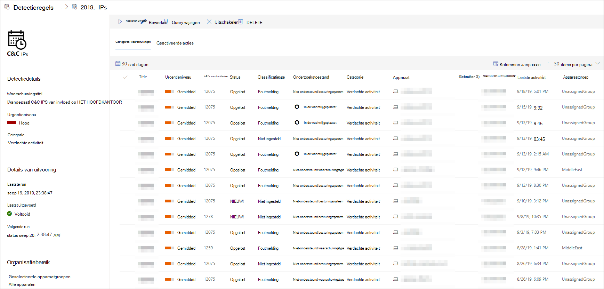

# Aangepaste detectieregels weergeven en beheren

[!INCLUDE [Microsoft 365 Defender rebranding](../../includes/microsoft-defender.md)]

**Van toepassing op:**
- [Microsoft Defender voor Endpoint](https://go.microsoft.com/fwlink/p/?linkid=2154037)
- [Microsoft 365 Defender](https://go.microsoft.com/fwlink/?linkid=2118804)

>Wilt u Defender voor Eindpunt ervaren? [Meld u aan voor een gratis proefabonnement.](https://www.microsoft.com/microsoft-365/windows/microsoft-defender-atp?ocid=docs-wdatp-assignaccess-abovefoldlink)

Beheer uw bestaande [aangepaste detectieregels om](custom-detection-rules.md) ervoor te zorgen dat ze effectief bedreigingen vinden en acties ondernemen. Ontdek hoe u de lijst met regels kunt bekijken, de vorige runs kunt controleren en de waarschuwingen kunt bekijken die ze hebben geactiveerd. U kunt ook een regel op aanvraag uitvoeren en deze wijzigen.

## Vereiste machtigingen

Als u aangepaste detecties wilt maken of beheren, [moet uw](user-roles.md#create-roles-and-assign-the-role-to-an-azure-active-directory-group) rol de machtiging **beveiligingsinstellingen** beheren hebben.

## Bestaande regels weergeven

Als u alle bestaande aangepaste detectieregels wilt weergeven, gaat u naar **Instellingen**  >  **Aangepaste detecties.** Op de pagina vindt u alle regels met de volgende gegevens:

- **Laatst uitgevoerd:** wanneer een regel voor het laatst is uitgevoerd om te controleren op query's en waarschuwingen te genereren
- **Status laatst uitgevoerd**: of een regel is uitgevoerd
- **Volgende run**: de volgende geplande run
- **Status**, ongeacht of een regel is ingeschakeld of uitgeschakeld

## Regeldetails weergeven, regel wijzigen en regel uitvoeren

Als u uitgebreide informatie over een aangepaste detectieregel wilt weergeven, selecteert u de naam van de regel in de lijst met regels in **Instellingen**  >  **Aangepaste detecties.** Op een pagina over de geselecteerde regel worden de volgende gegevens weergegeven:

- Algemene informatie over de regel, inclusief de details van de waarschuwing, de status uitvoeren en het bereik
- Lijst met geactiveerde waarschuwingen
- Lijst met geactiveerde acties

 
*Pagina Aangepaste detectieregel*

U kunt ook de volgende acties uitvoeren op de regel op deze pagina:

- **Uitvoeren:** voer de regel onmiddellijk uit. Met deze actie wordt ook het interval voor de volgende run opnieuw ingesteld.
- **Bewerken**: wijzig de regel zonder de query te wijzigen
- **Query wijzigen:** bewerk de query in geavanceerde zoekopdrachten
- **In- en uit-**  /  **Uitschakelen :de** regel inschakelen of stoppen met uitvoeren
- **Verwijderen**: schakel de regel uit en verwijder deze

>[!TIP]
>Als u snel informatie wilt weergeven en actie wilt ondernemen voor een item in een tabel, gebruikt u de selectiekolom [&#10003;] links van de tabel.

## Verwante onderwerpen
- [Overzicht van aangepaste detectie](overview-custom-detections.md)
- [Detectieregels maken](custom-detection-rules.md)
- [Overzicht van geavanceerd opsporen](advanced-hunting-overview.md)
- [Waarschuwingen weergeven en ordenen](alerts-queue.md)
