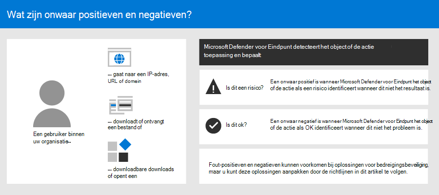
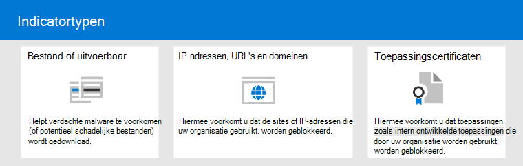

# <a name="address-false-positivesnegatives-in-microsoft-defender-for-endpoint"></a><span data-ttu-id="1eab2-104">Actie ondernemen voor fout-positieven/-negatieven in Microsoft Defender voor Eindpunt</span><span class="sxs-lookup"><span data-stu-id="1eab2-104">Address false positives/negatives in Microsoft Defender for Endpoint</span></span>

[!INCLUDE [Microsoft 365 Defender rebranding](../../includes/microsoft-defender.md)]

<span data-ttu-id="1eab2-105">**Van toepassing op**</span><span class="sxs-lookup"><span data-stu-id="1eab2-105">**Applies to**</span></span>

- [<span data-ttu-id="1eab2-106">Microsoft Defender voor Eindpunt</span><span class="sxs-lookup"><span data-stu-id="1eab2-106">Microsoft Defender for Endpoint</span></span>](https://go.microsoft.com/fwlink/p/?linkid=2146806)

<span data-ttu-id="1eab2-107">In oplossingen voor eindpuntbeveiliging is een fout-positief een entiteit, zoals een bestand of een proces, die is gedetecteerd en geïdentificeerd als schadelijk, ook al is de entiteit geen bedreiging.</span><span class="sxs-lookup"><span data-stu-id="1eab2-107">In endpoint protection solutions, a false positive is an entity, such as a file or a process, that was detected and identified as malicious, even though the entity isn't actually a threat.</span></span> <span data-ttu-id="1eab2-108">Een onwaar negatief is een entiteit die niet is gedetecteerd als een bedreiging, ook al is deze in feite schadelijk.</span><span class="sxs-lookup"><span data-stu-id="1eab2-108">A false negative is an entity that was not detected as a threat, even though it actually is malicious.</span></span> <span data-ttu-id="1eab2-109">False positives/negatives can occur with any threat protection solution, including [Microsoft Defender for Endpoint](microsoft-defender-endpoint.md).</span><span class="sxs-lookup"><span data-stu-id="1eab2-109">False positives/negatives can occur with any threat protection solution, including [Microsoft Defender for Endpoint](microsoft-defender-endpoint.md).</span></span>



<span data-ttu-id="1eab2-111">Gelukkig kunnen er stappen worden ondernomen om dit soort problemen op te lossen en te beperken.</span><span class="sxs-lookup"><span data-stu-id="1eab2-111">Fortunately, steps can be taken to address and reduce these kinds of issues.</span></span> <span data-ttu-id="1eab2-112">Als u false positives/negatives ziet [in](microsoft-defender-security-center.md) Microsoft 365 Defender (voorheen de Microsoft Defender-beveiligingscentrum), kunnen uw beveiligingsbewerkingen stappen ondernemen om deze aan te pakken met behulp van het volgende proces:</span><span class="sxs-lookup"><span data-stu-id="1eab2-112">If you're seeing false positives/negatives in [Microsoft 365 Defender](microsoft-defender-security-center.md) (formerly the Microsoft Defender Security Center), your security operations can take steps to address them by using the following process:</span></span>

1. [<span data-ttu-id="1eab2-113">Waarschuwingen controleren en classificeren</span><span class="sxs-lookup"><span data-stu-id="1eab2-113">Review and classify alerts</span></span>](#part-1-review-and-classify-alerts)
2. [<span data-ttu-id="1eab2-114">Herstelacties bekijken die zijn ondernomen</span><span class="sxs-lookup"><span data-stu-id="1eab2-114">Review remediation actions that were taken</span></span>](#part-2-review-remediation-actions)
3. [<span data-ttu-id="1eab2-115">Uitsluitingen controleren en definiëren</span><span class="sxs-lookup"><span data-stu-id="1eab2-115">Review and define exclusions</span></span>](#part-3-review-or-define-exclusions)
4. [<span data-ttu-id="1eab2-116">Een entiteit verzenden voor analyse</span><span class="sxs-lookup"><span data-stu-id="1eab2-116">Submit an entity for analysis</span></span>](#part-4-submit-a-file-for-analysis)
5. [<span data-ttu-id="1eab2-117">Uw instellingen voor bedreigingsbeveiliging controleren en aanpassen</span><span class="sxs-lookup"><span data-stu-id="1eab2-117">Review and adjust your threat protection settings</span></span>](#part-5-review-and-adjust-your-threat-protection-settings)

<span data-ttu-id="1eab2-118">U kunt hulp krijgen als u nog steeds problemen hebt met fout-positieve/negatieven na het uitvoeren van de taken die in dit artikel worden beschreven.</span><span class="sxs-lookup"><span data-stu-id="1eab2-118">You can get help if you still have issues with false positives/negatives after performing the tasks described in this article.</span></span> <span data-ttu-id="1eab2-119">Zie [Nog steeds hulp nodig?](#still-need-help)</span><span class="sxs-lookup"><span data-stu-id="1eab2-119">See [Still need help?](#still-need-help)</span></span>


> [!NOTE]
> <span data-ttu-id="1eab2-121">Dit artikel is bedoeld als richtlijnen voor beveiligingsoperatoren en beveiligingsbeheerders die [Microsoft Defender voor Eindpunt gebruiken.](microsoft-defender-endpoint.md)</span><span class="sxs-lookup"><span data-stu-id="1eab2-121">This article is intended as guidance for security operators and security administrators who are using [Microsoft Defender for Endpoint](microsoft-defender-endpoint.md).</span></span>

## <a name="part-1-review-and-classify-alerts"></a><span data-ttu-id="1eab2-122">Deel 1: Waarschuwingen controleren en classificeren</span><span class="sxs-lookup"><span data-stu-id="1eab2-122">Part 1: Review and classify alerts</span></span>

<span data-ttu-id="1eab2-123">Als u een [waarschuwing ziet](alerts.md) die is geactiveerd omdat er iets is gedetecteerd als schadelijk of verdacht dat niet had moeten zijn, kunt u de waarschuwing voor die entiteit onderdrukken.</span><span class="sxs-lookup"><span data-stu-id="1eab2-123">If you see an [alert](alerts.md) that was triggered because something was detected as malicious or suspicious that should not have been, you can suppress the alert for that entity.</span></span> <span data-ttu-id="1eab2-124">U kunt ook waarschuwingen onderdrukken die niet per se onwaar-positieven zijn, maar die niet belangrijk zijn.</span><span class="sxs-lookup"><span data-stu-id="1eab2-124">You can also suppress alerts that are not necessarily false positives, but are unimportant.</span></span> <span data-ttu-id="1eab2-125">We raden u aan waarschuwingen ook te classificeren.</span><span class="sxs-lookup"><span data-stu-id="1eab2-125">We recommend that you classify alerts as well.</span></span>

<span data-ttu-id="1eab2-126">Het beheren van uw waarschuwingen en het classificeren van waar-/onwaar-positieven helpt bij het trainen van uw oplossing voor bedreigingsbeveiliging en kan het aantal fout-positieven of onwaar negatieven in de tijd verminderen.</span><span class="sxs-lookup"><span data-stu-id="1eab2-126">Managing your alerts and classifying true/false positives helps to train your threat protection solution and can reduce the number of false positives or false negatives over time.</span></span> <span data-ttu-id="1eab2-127">Als u deze stappen ondernomen, kunt u ook de ruis in het dashboard voor beveiligingsbewerkingen verminderen, zodat uw beveiligingsteam zich kan richten op werkitems met een hogere prioriteit.</span><span class="sxs-lookup"><span data-stu-id="1eab2-127">Taking these steps also helps reduce noise in your security operations dashboard so that your security team can focus on higher priority work items.</span></span>

### <a name="determine-whether-an-alert-is-accurate"></a><span data-ttu-id="1eab2-128">Bepalen of een waarschuwing juist is</span><span class="sxs-lookup"><span data-stu-id="1eab2-128">Determine whether an alert is accurate</span></span>

<span data-ttu-id="1eab2-129">Voordat u een waarschuwing classificeert of onderdrukt, bepaalt u of de waarschuwing juist, onwaar positief of goedaardig is.</span><span class="sxs-lookup"><span data-stu-id="1eab2-129">Before you classify or suppress an alert, determine whether the alert is accurate, a false positive, or benign.</span></span>

1. <span data-ttu-id="1eab2-130">Ga naar de Microsoft 365 Defender portal <https://security.microsoft.com> () en meld u aan.</span><span class="sxs-lookup"><span data-stu-id="1eab2-130">Go to the Microsoft 365 Defender portal (<https://security.microsoft.com>) and sign in.</span></span>

2. <span data-ttu-id="1eab2-131">Kies in het navigatiedeelvenster **de optie Waarschuwingenwachtrij**.</span><span class="sxs-lookup"><span data-stu-id="1eab2-131">In the navigation pane, choose **Alerts queue**.</span></span>

3. <span data-ttu-id="1eab2-132">Selecteer een waarschuwing voor meer informatie over de waarschuwing.</span><span class="sxs-lookup"><span data-stu-id="1eab2-132">Select an alert to more details about the alert.</span></span> <span data-ttu-id="1eab2-133">(Zie [Waarschuwingen controleren in Microsoft Defender voor Eindpunt](review-alerts.md).)</span><span class="sxs-lookup"><span data-stu-id="1eab2-133">(See [Review alerts in Microsoft Defender for Endpoint](review-alerts.md).)</span></span>

4. <span data-ttu-id="1eab2-134">Volg de stappen die in de volgende tabel worden beschreven, afhankelijk van de status van de waarschuwing:</span><span class="sxs-lookup"><span data-stu-id="1eab2-134">Depending on the alert status, take the steps described in the following table:</span></span>

<br>

****

|<span data-ttu-id="1eab2-135">Status van waarschuwing</span><span class="sxs-lookup"><span data-stu-id="1eab2-135">Alert status</span></span>|<span data-ttu-id="1eab2-136">Wat moet u doen?</span><span class="sxs-lookup"><span data-stu-id="1eab2-136">What to do</span></span>|
|---|---|
|<span data-ttu-id="1eab2-137">De waarschuwing is nauwkeurig</span><span class="sxs-lookup"><span data-stu-id="1eab2-137">The alert is accurate</span></span>|<span data-ttu-id="1eab2-138">Wijs de waarschuwing toe en [onderzoek deze](investigate-alerts.md) verder.</span><span class="sxs-lookup"><span data-stu-id="1eab2-138">Assign the alert, and then [investigate it](investigate-alerts.md) further.</span></span>|
|<span data-ttu-id="1eab2-139">De waarschuwing is een onwaar positief</span><span class="sxs-lookup"><span data-stu-id="1eab2-139">The alert is a false positive</span></span>|<ol><li><span data-ttu-id="1eab2-140">[Classificeer de waarschuwing](#classify-an-alert) als een onwaar positief.</span><span class="sxs-lookup"><span data-stu-id="1eab2-140">[Classify the alert](#classify-an-alert) as a false positive.</span></span></li><li><span data-ttu-id="1eab2-141">[De waarschuwing onderdrukken.](#suppress-an-alert)</span><span class="sxs-lookup"><span data-stu-id="1eab2-141">[Suppress the alert](#suppress-an-alert).</span></span></li><li><span data-ttu-id="1eab2-142">[Maak een indicator](#indicators-for-microsoft-defender-for-endpoint) voor Microsoft Defender voor Eindpunt.</span><span class="sxs-lookup"><span data-stu-id="1eab2-142">[Create an indicator](#indicators-for-microsoft-defender-for-endpoint) for Microsoft Defender for Endpoint.</span></span></li><li><span data-ttu-id="1eab2-143">[Stuur een bestand naar Microsoft voor analyse.](#part-4-submit-a-file-for-analysis)</span><span class="sxs-lookup"><span data-stu-id="1eab2-143">[Submit a file to Microsoft for analysis](#part-4-submit-a-file-for-analysis).</span></span></li></ol>|
|<span data-ttu-id="1eab2-144">De waarschuwing is nauwkeurig, maar goedaardig (onbelangrijk)</span><span class="sxs-lookup"><span data-stu-id="1eab2-144">The alert is accurate, but benign (unimportant)</span></span>|<span data-ttu-id="1eab2-145">[Classificeer de waarschuwing](#classify-an-alert) als een echte positieve en onderdrukt [de waarschuwing.](#suppress-an-alert)</span><span class="sxs-lookup"><span data-stu-id="1eab2-145">[Classify the alert](#classify-an-alert) as a true positive, and then [suppress the alert](#suppress-an-alert).</span></span>|
|||

### <a name="classify-an-alert"></a><span data-ttu-id="1eab2-146">Een waarschuwing classificeren</span><span class="sxs-lookup"><span data-stu-id="1eab2-146">Classify an alert</span></span>

<span data-ttu-id="1eab2-147">Waarschuwingen kunnen worden geclassificeerd als false positives of true positives in Microsoft 365 Defender.</span><span class="sxs-lookup"><span data-stu-id="1eab2-147">Alerts can be classified as false positives or true positives in Microsoft 365 Defender.</span></span> <span data-ttu-id="1eab2-148">Als u waarschuwingen classificeert, kunt u Microsoft Defender voor Eindpunt trainen, zodat u na een tijd meer waargebeurde waarschuwingen en minder foutmeldingen ziet.</span><span class="sxs-lookup"><span data-stu-id="1eab2-148">Classifying alerts helps train Microsoft Defender for Endpoint so that, over time, you'll see more true alerts and fewer false alerts.</span></span>

1. <span data-ttu-id="1eab2-149">Ga naar de Microsoft 365 Defender portal <https://security.microsoft.com> () en meld u aan.</span><span class="sxs-lookup"><span data-stu-id="1eab2-149">Go to the Microsoft 365 Defender portal (<https://security.microsoft.com>) and sign in.</span></span>

2. <span data-ttu-id="1eab2-150">Selecteer **Waarschuwingenwachtrij** en selecteer vervolgens een waarschuwing.</span><span class="sxs-lookup"><span data-stu-id="1eab2-150">Select **Alerts queue**, and then select an alert.</span></span>

3. <span data-ttu-id="1eab2-151">Selecteer acties beheren voor de geselecteerde  >  **waarschuwing.**</span><span class="sxs-lookup"><span data-stu-id="1eab2-151">For the selected alert, select **Actions** > **Manage alert**.</span></span> <span data-ttu-id="1eab2-152">Er wordt een flyoutvenster geopend.</span><span class="sxs-lookup"><span data-stu-id="1eab2-152">A flyout pane opens.</span></span>

4. <span data-ttu-id="1eab2-153">Selecteer in **de sectie Waarschuwing** beheren de optie **Waarmelding** **of Foutmelding.**</span><span class="sxs-lookup"><span data-stu-id="1eab2-153">In the **Manage alert** section, select either **True alert** or **False alert**.</span></span> <span data-ttu-id="1eab2-154">(Gebruik **een onwaar waarschuwing om** een onwaar positief te classificeren.)</span><span class="sxs-lookup"><span data-stu-id="1eab2-154">(Use **False alert** to classify a false positive.)</span></span>

> [!TIP]
> <span data-ttu-id="1eab2-155">Zie Microsoft Defender voor eindpuntwaarschuwingen beheren voor meer informatie over het onderdrukken van [waarschuwingen.](/microsoft-365/security/defender-endpoint/manage-alerts)</span><span class="sxs-lookup"><span data-stu-id="1eab2-155">For more information about suppressing alerts, see [Manage Microsoft Defender for Endpoint alerts](/microsoft-365/security/defender-endpoint/manage-alerts).</span></span> <span data-ttu-id="1eab2-156">En als uw organisatie een SIEM-server (Security Information and Event Management) gebruikt, moet u daar ook een onderdrukkingsregel definiëren.</span><span class="sxs-lookup"><span data-stu-id="1eab2-156">And, if your organization is using a security information and event management (SIEM) server, make sure to define a suppression rule there, too.</span></span>

### <a name="suppress-an-alert"></a><span data-ttu-id="1eab2-157">Een waarschuwing onderdrukken</span><span class="sxs-lookup"><span data-stu-id="1eab2-157">Suppress an alert</span></span>

<span data-ttu-id="1eab2-158">Als u waarschuwingen hebt die onwaar positieven zijn of die echte positieven zijn, maar voor onbelangrijke gebeurtenissen, kunt u deze waarschuwingen onderdrukken in Microsoft 365 Defender.</span><span class="sxs-lookup"><span data-stu-id="1eab2-158">If you have alerts that are either false positives or that are true positives but for unimportant events, you can suppress those alerts in Microsoft 365 Defender.</span></span> <span data-ttu-id="1eab2-159">Door waarschuwingen te onderdrukken, vermindert u ruis in het dashboard voor beveiligingsbewerkingen.</span><span class="sxs-lookup"><span data-stu-id="1eab2-159">Suppressing alerts helps reduce noise in your security operations dashboard.</span></span>

1. <span data-ttu-id="1eab2-160">Ga naar de Microsoft 365 Defender portal <https://security.microsoft.com> () en meld u aan.</span><span class="sxs-lookup"><span data-stu-id="1eab2-160">Go to the Microsoft 365 Defender portal (<https://security.microsoft.com>) and sign in.</span></span>

2. <span data-ttu-id="1eab2-161">Selecteer waarschuwingenwachtrij in **het navigatiedeelvenster.**</span><span class="sxs-lookup"><span data-stu-id="1eab2-161">In the navigation pane, select **Alerts queue**.</span></span>

3. <span data-ttu-id="1eab2-162">Selecteer een waarschuwing die u wilt onderdrukken om het deelvenster **Details te** openen.</span><span class="sxs-lookup"><span data-stu-id="1eab2-162">Select an alert that you want to suppress to open its **Details** pane.</span></span>

4. <span data-ttu-id="1eab2-163">Kies in **het** deelvenster Details het beletselteken (**...**) en vervolgens **Een onderdrukkingsregel maken.**</span><span class="sxs-lookup"><span data-stu-id="1eab2-163">In the **Details** pane, choose the ellipsis (**...**), and then **Create a suppression rule**.</span></span>

5. <span data-ttu-id="1eab2-164">Geef alle instellingen op voor de onderdrukkingsregel en kies **opslaan.**</span><span class="sxs-lookup"><span data-stu-id="1eab2-164">Specify all the settings for your suppression rule, and then choose **Save**.</span></span>

> [!TIP]
> <span data-ttu-id="1eab2-165">Hulp nodig bij het onderdrukken van regels?</span><span class="sxs-lookup"><span data-stu-id="1eab2-165">Need help with suppression rules?</span></span> <span data-ttu-id="1eab2-166">Zie [Een waarschuwing onderdrukken en een nieuwe onderdrukkingsregel maken.](/microsoft-365/security/defender-endpoint/manage-alerts#suppress-an-alert-and-create-a-new-suppression-rule)</span><span class="sxs-lookup"><span data-stu-id="1eab2-166">See [Suppress an alert and create a new suppression rule](/microsoft-365/security/defender-endpoint/manage-alerts#suppress-an-alert-and-create-a-new-suppression-rule).</span></span>

## <a name="part-2-review-remediation-actions"></a><span data-ttu-id="1eab2-167">Deel 2: Herstelacties controleren</span><span class="sxs-lookup"><span data-stu-id="1eab2-167">Part 2: Review remediation actions</span></span>

<span data-ttu-id="1eab2-168">[Herstelacties](manage-auto-investigation.md#remediation-actions), zoals het verzenden van een bestand naar quarantaine of het stoppen van een proces, worden ondernomen op entiteiten (zoals bestanden) die worden gedetecteerd als bedreigingen.</span><span class="sxs-lookup"><span data-stu-id="1eab2-168">[Remediation actions](manage-auto-investigation.md#remediation-actions), such as sending a file to quarantine or stopping a process, are taken on entities (such as files) that are detected as threats.</span></span> <span data-ttu-id="1eab2-169">Verschillende soorten herstelacties vinden automatisch plaats via automatisch onderzoek en Microsoft Defender Antivirus:</span><span class="sxs-lookup"><span data-stu-id="1eab2-169">Several types of remediation actions occur automatically through automated investigation and Microsoft Defender Antivirus:</span></span>

- <span data-ttu-id="1eab2-170">Een bestand in quarantaine plaatsen</span><span class="sxs-lookup"><span data-stu-id="1eab2-170">Quarantine a file</span></span>
- <span data-ttu-id="1eab2-171">Een registersleutel verwijderen</span><span class="sxs-lookup"><span data-stu-id="1eab2-171">Remove a registry key</span></span>
- <span data-ttu-id="1eab2-172">Een proces om te laten gaan</span><span class="sxs-lookup"><span data-stu-id="1eab2-172">Kill a process</span></span>
- <span data-ttu-id="1eab2-173">Een service stoppen</span><span class="sxs-lookup"><span data-stu-id="1eab2-173">Stop a service</span></span>
- <span data-ttu-id="1eab2-174">Een stuurprogramma uitschakelen</span><span class="sxs-lookup"><span data-stu-id="1eab2-174">Disable a driver</span></span>
- <span data-ttu-id="1eab2-175">Een geplande taak verwijderen</span><span class="sxs-lookup"><span data-stu-id="1eab2-175">Remove a scheduled task</span></span>

<span data-ttu-id="1eab2-176">Andere acties, zoals het starten van een antivirusscan of het verzamelen van een onderzoekspakket, vinden handmatig of via [Live Response plaats.](live-response.md)</span><span class="sxs-lookup"><span data-stu-id="1eab2-176">Other actions, such as starting an antivirus scan or collecting an investigation package, occur manually or through [Live Response](live-response.md).</span></span> <span data-ttu-id="1eab2-177">Acties die zijn ondernomen via Live Response, kunnen niet ongedaan worden gemaakt.</span><span class="sxs-lookup"><span data-stu-id="1eab2-177">Actions taken through Live Response cannot be undone.</span></span>

<span data-ttu-id="1eab2-178">Nadat u uw waarschuwingen hebt bekeken, is de volgende stap het controleren [van herstelacties.](manage-auto-investigation.md)</span><span class="sxs-lookup"><span data-stu-id="1eab2-178">After you have reviewed your alerts, your next step is to [review remediation actions](manage-auto-investigation.md).</span></span> <span data-ttu-id="1eab2-179">Als er acties zijn ondernomen als gevolg van onwaar positieven, kunt u de meeste soorten herstelacties ongedaan maken.</span><span class="sxs-lookup"><span data-stu-id="1eab2-179">If any actions were taken as a result of false positives, you can undo most kinds of remediation actions.</span></span> <span data-ttu-id="1eab2-180">U kunt het volgende doen:</span><span class="sxs-lookup"><span data-stu-id="1eab2-180">Specifically, you can:</span></span>

- [<span data-ttu-id="1eab2-181">Een in quarantaine geplaatst bestand terugzetten vanuit het Actiecentrum</span><span class="sxs-lookup"><span data-stu-id="1eab2-181">Restore a quarantined file from the Action Center</span></span>](#restore-a-quarantined-file-from-the-action-center)
- [<span data-ttu-id="1eab2-182">Meerdere acties tegelijk ongedaan maken</span><span class="sxs-lookup"><span data-stu-id="1eab2-182">Undo multiple actions at one time</span></span>](#undo-multiple-actions-at-one-time)
- <span data-ttu-id="1eab2-183">[Verwijder een bestand uit quarantaine op meerdere apparaten.](#remove-a-file-from-quarantine-across-multiple-devices)</span><span class="sxs-lookup"><span data-stu-id="1eab2-183">[Remove a file from quarantine across multiple devices](#remove-a-file-from-quarantine-across-multiple-devices).</span></span>  <span data-ttu-id="1eab2-184">en</span><span class="sxs-lookup"><span data-stu-id="1eab2-184">and</span></span>
- [<span data-ttu-id="1eab2-185">Bestand in quarantaine herstellen</span><span class="sxs-lookup"><span data-stu-id="1eab2-185">Restore file from quarantine</span></span>](#restore-file-from-quarantine)

<span data-ttu-id="1eab2-186">Wanneer u klaar bent met het controleren en ongedaan maken van acties die zijn uitgevoerd als gevolg van onwaar positieven, gaat u verder met het controleren of [definiëren van uitsluitingen.](#part-3-review-or-define-exclusions)</span><span class="sxs-lookup"><span data-stu-id="1eab2-186">When you're done reviewing and undoing actions that were taken as a result of false positives, proceed to [review or define exclusions](#part-3-review-or-define-exclusions).</span></span>

### <a name="review-completed-actions"></a><span data-ttu-id="1eab2-187">Voltooide acties controleren</span><span class="sxs-lookup"><span data-stu-id="1eab2-187">Review completed actions</span></span>

1. <span data-ttu-id="1eab2-188">Ga naar het Actiecentrum <https://security.microsoft.com/action-center> () en meld u aan.</span><span class="sxs-lookup"><span data-stu-id="1eab2-188">Go to the Action center (<https://security.microsoft.com/action-center>) and sign in.</span></span>

2. <span data-ttu-id="1eab2-189">Selecteer het **tabblad Geschiedenis** om een lijst met acties te bekijken die zijn ondernomen.</span><span class="sxs-lookup"><span data-stu-id="1eab2-189">Select the **History** tab to view a list of actions that were taken.</span></span>

3. <span data-ttu-id="1eab2-190">Selecteer een item om meer details weer te geven over de herstelactie die is ondernomen.</span><span class="sxs-lookup"><span data-stu-id="1eab2-190">Select an item to view more details about the remediation action that was taken.</span></span>

### <a name="restore-a-quarantined-file-from-the-action-center"></a><span data-ttu-id="1eab2-191">Een in quarantaine geplaatst bestand terugzetten vanuit het Actiecentrum</span><span class="sxs-lookup"><span data-stu-id="1eab2-191">Restore a quarantined file from the Action Center</span></span>

1. <span data-ttu-id="1eab2-192">Ga naar het Actiecentrum <https://security.microsoft.com/action-center> () en meld u aan.</span><span class="sxs-lookup"><span data-stu-id="1eab2-192">Go to the Action center (<https://security.microsoft.com/action-center>) and sign in.</span></span>

2. <span data-ttu-id="1eab2-193">Selecteer op **het** tabblad Geschiedenis een actie die u ongedaan wilt maken.</span><span class="sxs-lookup"><span data-stu-id="1eab2-193">On the **History** tab, select an action that you want to undo.</span></span>

3. <span data-ttu-id="1eab2-194">Selecteer ongedaan maken in het deelvenster Flyout.</span><span class="sxs-lookup"><span data-stu-id="1eab2-194">In the flyout pane, select **Undo**.</span></span> <span data-ttu-id="1eab2-195">Als de actie niet ongedaan kan worden gemaakt met deze methode, ziet u geen knop **Ongedaan** maken.</span><span class="sxs-lookup"><span data-stu-id="1eab2-195">If the action cannot be undone with this method, you will not see an **Undo** button.</span></span> <span data-ttu-id="1eab2-196">(Zie Voltooide acties ongedaan maken voor [meer informatie](manage-auto-investigation.md#undo-completed-actions).)</span><span class="sxs-lookup"><span data-stu-id="1eab2-196">(To learn more, see [Undo completed actions](manage-auto-investigation.md#undo-completed-actions).)</span></span>

### <a name="undo-multiple-actions-at-one-time"></a><span data-ttu-id="1eab2-197">Meerdere acties tegelijk ongedaan maken</span><span class="sxs-lookup"><span data-stu-id="1eab2-197">Undo multiple actions at one time</span></span>

1. <span data-ttu-id="1eab2-198">Ga naar het Actiecentrum <https://security.microsoft.com/action-center> () en meld u aan.</span><span class="sxs-lookup"><span data-stu-id="1eab2-198">Go to the Action center (<https://security.microsoft.com/action-center>) and sign in.</span></span>

2. <span data-ttu-id="1eab2-199">Selecteer op **het** tabblad Geschiedenis de acties die u ongedaan wilt maken.</span><span class="sxs-lookup"><span data-stu-id="1eab2-199">On the **History** tab, select the actions that you want to undo.</span></span>

3. <span data-ttu-id="1eab2-200">Selecteer Ongedaan maken in het deelvenster aan de rechterkant van **het scherm.**</span><span class="sxs-lookup"><span data-stu-id="1eab2-200">In the pane on the right side of the screen, select **Undo**.</span></span>

### <a name="remove-a-file-from-quarantine-across-multiple-devices"></a><span data-ttu-id="1eab2-201">Een bestand uit quarantaine verwijderen op meerdere apparaten</span><span class="sxs-lookup"><span data-stu-id="1eab2-201">Remove a file from quarantine across multiple devices</span></span>

> [!div class="mx-imgBorder"]
> <span data-ttu-id="1eab2-202"></span><span class="sxs-lookup"><span data-stu-id="1eab2-202"></span></span>

1. <span data-ttu-id="1eab2-203">Ga naar het Actiecentrum <https://security.microsoft.com/action-center> () en meld u aan.</span><span class="sxs-lookup"><span data-stu-id="1eab2-203">Go to the Action center (<https://security.microsoft.com/action-center>) and sign in.</span></span>

2. <span data-ttu-id="1eab2-204">Selecteer op **het** tabblad Geschiedenis een bestand met het bestand Actietype **Quarantaine**.</span><span class="sxs-lookup"><span data-stu-id="1eab2-204">On the **History** tab, select a file that has the Action type **Quarantine file**.</span></span>

3. <span data-ttu-id="1eab2-205">Selecteer in het deelvenster aan de rechterkant van het scherm meer exemplaren van dit bestand toepassen op **X** en selecteer **vervolgens Ongedaan maken.**</span><span class="sxs-lookup"><span data-stu-id="1eab2-205">In the pane on the right side of the screen, select **Apply to X more instances of this file**, and then select **Undo**.</span></span>

### <a name="restore-file-from-quarantine"></a><span data-ttu-id="1eab2-206">Bestand in quarantaine herstellen</span><span class="sxs-lookup"><span data-stu-id="1eab2-206">Restore file from quarantine</span></span>

<span data-ttu-id="1eab2-207">U kunt een bestand terugdraaien en verwijderen uit quarantaine als u na een onderzoek hebt vastgesteld dat het bestand schoon is.</span><span class="sxs-lookup"><span data-stu-id="1eab2-207">You can roll back and remove a file from quarantine if you've determined that it's clean after an investigation.</span></span> <span data-ttu-id="1eab2-208">Voer de volgende opdracht uit op elk apparaat waarop het bestand in quarantaine is geplaatst.</span><span class="sxs-lookup"><span data-stu-id="1eab2-208">Run the following command on each device where the file was quarantined.</span></span>

1. <span data-ttu-id="1eab2-209">Open een opdrachtregelprompt met verhoogde opdracht op het apparaat:</span><span class="sxs-lookup"><span data-stu-id="1eab2-209">Open an elevated command–line prompt on the device:</span></span>
   1. <span data-ttu-id="1eab2-210">Go to **Start** and type _cmd_.</span><span class="sxs-lookup"><span data-stu-id="1eab2-210">Go to **Start** and type _cmd_.</span></span>
   2. <span data-ttu-id="1eab2-211">Klik met de rechtermuisknop **op Opdrachtprompt** en selecteer **Uitvoeren als beheerder.**</span><span class="sxs-lookup"><span data-stu-id="1eab2-211">Right–click **Command prompt** and select **Run as administrator**.</span></span>

2. <span data-ttu-id="1eab2-212">Voer de volgende opdracht in en druk op **Enter:**</span><span class="sxs-lookup"><span data-stu-id="1eab2-212">Enter the following command, and press **Enter**:</span></span>

    ```console
    "ProgramFiles%\Windows Defender\MpCmdRun.exe" –Restore –Name EUS:Win32/CustomEnterpriseBlock –All
    ```

    > [!IMPORTANT]
    > <span data-ttu-id="1eab2-213">In sommige scenario's kan **threatname** worden weergegeven als `EUS:Win32/CustomEnterpriseBlock!cl` .</span><span class="sxs-lookup"><span data-stu-id="1eab2-213">In some scenarios, the **ThreatName** may appear as `EUS:Win32/CustomEnterpriseBlock!cl`.</span></span> <span data-ttu-id="1eab2-214">Defender voor Eindpunt herstelt alle aangepaste geblokkeerde bestanden die in quarantaine zijn geplaatst op dit apparaat in de afgelopen 30 dagen.</span><span class="sxs-lookup"><span data-stu-id="1eab2-214">Defender for Endpoint will restore all custom blocked files that were quarantined on this device in the last 30 days.</span></span>
    >
    > <span data-ttu-id="1eab2-215">Een bestand dat in quarantaine is geplaatst als een potentiële netwerkdreiging, kan mogelijk niet worden hersteld.</span><span class="sxs-lookup"><span data-stu-id="1eab2-215">A file that was quarantined as a potential network threat might not be recoverable.</span></span> <span data-ttu-id="1eab2-216">Als een gebruiker het bestand na quarantaine probeert te herstellen, is dat bestand mogelijk niet toegankelijk.</span><span class="sxs-lookup"><span data-stu-id="1eab2-216">If a user attempts to restore the file after quarantine, that file might not be accessible.</span></span> <span data-ttu-id="1eab2-217">Dit kan worden veroorzaakt doordat het systeem geen netwerkreferenties meer heeft om toegang te krijgen tot het bestand.</span><span class="sxs-lookup"><span data-stu-id="1eab2-217">This can be due to the system no longer having network credentials to access the file.</span></span> <span data-ttu-id="1eab2-218">Dit is meestal het gevolg van een tijdelijk aanmelden bij een systeem of gedeelde map en de toegangstokens zijn verlopen.</span><span class="sxs-lookup"><span data-stu-id="1eab2-218">Typically, this is a result of a temporary log on to a system or shared folder and the access tokens expired.</span></span>

3. <span data-ttu-id="1eab2-219">Selecteer in het deelvenster aan de rechterkant van het scherm meer exemplaren van dit bestand toepassen op **X** en selecteer **vervolgens Ongedaan maken.**</span><span class="sxs-lookup"><span data-stu-id="1eab2-219">In the pane on the right side of the screen, select **Apply to X more instances of this file**, and then select **Undo**.</span></span>

## <a name="part-3-review-or-define-exclusions"></a><span data-ttu-id="1eab2-220">Deel 3: Uitsluitingen controleren of definiëren</span><span class="sxs-lookup"><span data-stu-id="1eab2-220">Part 3: Review or define exclusions</span></span>

<span data-ttu-id="1eab2-221">Een uitsluiting is een entiteit, zoals een bestand of URL, die u opgeeft als uitzondering op herstelacties.</span><span class="sxs-lookup"><span data-stu-id="1eab2-221">An exclusion is an entity, such as a file or URL, that you specify as an exception to remediation actions.</span></span> <span data-ttu-id="1eab2-222">De uitgesloten entiteit kan nog steeds worden gedetecteerd, maar er worden geen herstelacties voor die entiteit ondernomen.</span><span class="sxs-lookup"><span data-stu-id="1eab2-222">The excluded entity can still get detected, but no remediation actions are taken on that entity.</span></span> <span data-ttu-id="1eab2-223">Dat wil zeggen dat het gedetecteerde bestand of proces niet wordt gestopt, naar quarantaine wordt verzonden, wordt verwijderd of anderszins wordt gewijzigd door Microsoft Defender voor Eindpunt.</span><span class="sxs-lookup"><span data-stu-id="1eab2-223">That is, the detected file or process won't be stopped, sent to quarantine, removed, or otherwise changed by Microsoft Defender for Endpoint.</span></span>

<span data-ttu-id="1eab2-224">Als u uitsluitingen in Microsoft Defender voor Eindpunt wilt definiëren, voert u de volgende taken uit:</span><span class="sxs-lookup"><span data-stu-id="1eab2-224">To define exclusions across Microsoft Defender for Endpoint, perform the following tasks:</span></span>

- [<span data-ttu-id="1eab2-225">Uitsluitingen definiëren voor Microsoft Defender Antivirus</span><span class="sxs-lookup"><span data-stu-id="1eab2-225">Define exclusions for Microsoft Defender Antivirus</span></span>](#exclusions-for-microsoft-defender-antivirus)
- [<span data-ttu-id="1eab2-226">Indicatoren voor toestaan maken voor Microsoft Defender voor eindpunt</span><span class="sxs-lookup"><span data-stu-id="1eab2-226">Create "allow" indicators for Microsoft Defender for Endpoint</span></span>](#indicators-for-microsoft-defender-for-endpoint)

> [!NOTE]
> <span data-ttu-id="1eab2-227">Microsoft Defender Antivirus uitsluitingen zijn alleen van toepassing op antivirusbeveiliging, niet in andere mogelijkheden van Microsoft Defender voor eindpunten.</span><span class="sxs-lookup"><span data-stu-id="1eab2-227">Microsoft Defender Antivirus exclusions apply only to antivirus protection, not across other Microsoft Defender for Endpoint capabilities.</span></span> <span data-ttu-id="1eab2-228">Als u bestanden breed wilt uitsluiten, gebruikt u uitsluitingen Microsoft Defender Antivirus [en aangepaste indicatoren](/microsoft-365/security/defender-endpoint/manage-indicators) voor Microsoft Defender voor Eindpunt.</span><span class="sxs-lookup"><span data-stu-id="1eab2-228">To exclude files broadly, use exclusions for Microsoft Defender Antivirus and [custom indicators](/microsoft-365/security/defender-endpoint/manage-indicators) for Microsoft Defender for Endpoint.</span></span>

<span data-ttu-id="1eab2-229">In de procedures in deze sectie wordt beschreven hoe u uitsluitingen en indicatoren kunt definiëren.</span><span class="sxs-lookup"><span data-stu-id="1eab2-229">The procedures in this section describe how to define exclusions and indicators.</span></span>

### <a name="exclusions-for-microsoft-defender-antivirus"></a><span data-ttu-id="1eab2-230">Uitsluitingen voor Microsoft Defender Antivirus</span><span class="sxs-lookup"><span data-stu-id="1eab2-230">Exclusions for Microsoft Defender Antivirus</span></span>

<span data-ttu-id="1eab2-231">Over het algemeen hoeft u geen uitsluitingen te definiëren voor Microsoft Defender Antivirus.</span><span class="sxs-lookup"><span data-stu-id="1eab2-231">In general, you should not need to define exclusions for Microsoft Defender Antivirus.</span></span> <span data-ttu-id="1eab2-232">Zorg ervoor dat u uitsluitingen spaarzaam definieert en dat u alleen de bestanden, mappen, processen en proces geopende bestanden optelt die resulteren in fout-positieven.</span><span class="sxs-lookup"><span data-stu-id="1eab2-232">Make sure that you define exclusions sparingly, and that you only include the files, folders, processes, and process-opened files that are resulting in false positives.</span></span> <span data-ttu-id="1eab2-233">Controleer bovendien regelmatig uw gedefinieerde uitsluitingen.</span><span class="sxs-lookup"><span data-stu-id="1eab2-233">In addition, make sure to review your defined exclusions regularly.</span></span> <span data-ttu-id="1eab2-234">We raden [u](/mem/endpoint-manager-overview) aan Microsoft Endpoint Manager antivirusuitsluitingen te definiëren of te bewerken. U kunt echter andere methoden gebruiken, zoals [Groepsbeleid](/azure/active-directory-domain-services/manage-group-policy) (zie [Microsoft Defender voor eindpunt beheren).](manage-atp-post-migration.md)</span><span class="sxs-lookup"><span data-stu-id="1eab2-234">We recommend using [Microsoft Endpoint Manager](/mem/endpoint-manager-overview) to define or edit your antivirus exclusions; however, you can use other methods, such as [Group Policy](/azure/active-directory-domain-services/manage-group-policy) (see [Manage Microsoft Defender for Endpoint](manage-atp-post-migration.md)).</span></span>

> [!TIP]
> <span data-ttu-id="1eab2-235">Hulp nodig bij antivirusuitsluitingen?</span><span class="sxs-lookup"><span data-stu-id="1eab2-235">Need help with antivirus exclusions?</span></span> <span data-ttu-id="1eab2-236">Zie [Uitsluitingen configureren en valideren voor Microsoft Defender Antivirus scans.](configure-exclusions-microsoft-defender-antivirus.md)</span><span class="sxs-lookup"><span data-stu-id="1eab2-236">See [Configure and validate exclusions for Microsoft Defender Antivirus scans](configure-exclusions-microsoft-defender-antivirus.md).</span></span>

#### <a name="use-microsoft-endpoint-manager-to-manage-antivirus-exclusions-for-existing-policies"></a><span data-ttu-id="1eab2-237">Gebruik Microsoft Endpoint Manager om antivirusuitsluitingen te beheren (voor bestaand beleid)</span><span class="sxs-lookup"><span data-stu-id="1eab2-237">Use Microsoft Endpoint Manager to manage antivirus exclusions (for existing policies)</span></span>

1. <span data-ttu-id="1eab2-238">Ga naar het Microsoft Endpoint Manager beheercentrum <https://endpoint.microsoft.com> () en meld u aan.</span><span class="sxs-lookup"><span data-stu-id="1eab2-238">Go to the Microsoft Endpoint Manager admin center (<https://endpoint.microsoft.com>) and sign in.</span></span>

2. <span data-ttu-id="1eab2-239">Kies **Endpoint Security**  >  **Antivirus** en selecteer vervolgens een bestaand beleid.</span><span class="sxs-lookup"><span data-stu-id="1eab2-239">Choose **Endpoint security** > **Antivirus**, and then select an existing policy.</span></span> <span data-ttu-id="1eab2-240">(Als u geen bestaand beleid hebt of als u een nieuw beleid wilt maken, gaat u verder [met de volgende procedure).](#use-microsoft-endpoint-manager-to-create-a-new-antivirus-policy-with-exclusions)</span><span class="sxs-lookup"><span data-stu-id="1eab2-240">(If you don't have an existing policy, or you want to create a new policy, skip to [the next procedure](#use-microsoft-endpoint-manager-to-create-a-new-antivirus-policy-with-exclusions)).</span></span>

3. <span data-ttu-id="1eab2-241">Kies **Eigenschappen** en kies naast **Configuratie-instellingen** de optie **Bewerken.**</span><span class="sxs-lookup"><span data-stu-id="1eab2-241">Choose **Properties**, and next to **Configuration settings**, choose **Edit**.</span></span>

4. <span data-ttu-id="1eab2-242">Vouw **Microsoft Defender Antivirus Uitsluitingen uit** en geef vervolgens uw uitsluitingen op.</span><span class="sxs-lookup"><span data-stu-id="1eab2-242">Expand **Microsoft Defender Antivirus Exclusions** and then specify your exclusions.</span></span>

5. <span data-ttu-id="1eab2-243">Kies **Controleren+ opslaan** en kies vervolgens **Opslaan.**</span><span class="sxs-lookup"><span data-stu-id="1eab2-243">Choose **Review + save**, and then choose **Save**.</span></span>

#### <a name="use-microsoft-endpoint-manager-to-create-a-new-antivirus-policy-with-exclusions"></a><span data-ttu-id="1eab2-244">Gebruik Microsoft Endpoint Manager om een nieuw antivirusbeleid te maken met uitsluitingen</span><span class="sxs-lookup"><span data-stu-id="1eab2-244">Use Microsoft Endpoint Manager to create a new antivirus policy with exclusions</span></span>

1. <span data-ttu-id="1eab2-245">Ga naar het Microsoft Endpoint Manager beheercentrum <https://endpoint.microsoft.com> () en meld u aan.</span><span class="sxs-lookup"><span data-stu-id="1eab2-245">Go to the Microsoft Endpoint Manager admin center (<https://endpoint.microsoft.com>) and sign in.</span></span>

2. <span data-ttu-id="1eab2-246">Kies **Endpoint security**  >  **Antivirus**  >  **+ Create Policy**.</span><span class="sxs-lookup"><span data-stu-id="1eab2-246">Choose **Endpoint security** > **Antivirus** > **+ Create Policy**.</span></span>

3. <span data-ttu-id="1eab2-247">Selecteer een platform (zoals Windows 10 **en hoger**, **macOS** of **Windows 10 en Windows Server).**</span><span class="sxs-lookup"><span data-stu-id="1eab2-247">Select a platform (such as **Windows 10 and later**, **macOS**, or **Windows 10 and Windows Server**).</span></span>

4. <span data-ttu-id="1eab2-248">Selecteer **voor** Profiel **Microsoft Defender Antivirus uitsluitingen** en kies **vervolgens Maken.**</span><span class="sxs-lookup"><span data-stu-id="1eab2-248">For **Profile**, select **Microsoft Defender Antivirus exclusions**, and then choose **Create**.</span></span>

5. <span data-ttu-id="1eab2-249">Geef een naam en beschrijving op voor het profiel en kies **volgende**.</span><span class="sxs-lookup"><span data-stu-id="1eab2-249">Specify a name and description for the profile, and then choose **Next**.</span></span>

6. <span data-ttu-id="1eab2-250">Geef op **het tabblad Configuratie-instellingen** uw antivirusuitsluitingen op en kies **volgende**.</span><span class="sxs-lookup"><span data-stu-id="1eab2-250">On the **Configuration settings** tab, specify your antivirus exclusions, and then choose **Next**.</span></span>

7. <span data-ttu-id="1eab2-251">Geef op **het tabblad Bereiklabels,** als u bereiklabels in uw organisatie gebruikt, bereiklabels op voor het beleid dat u maakt.</span><span class="sxs-lookup"><span data-stu-id="1eab2-251">On the **Scope tags** tab, if you are using scope tags in your organization, specify scope tags for the policy you are creating.</span></span> <span data-ttu-id="1eab2-252">(Zie [Bereiklabels](/mem/intune/fundamentals/scope-tags).)</span><span class="sxs-lookup"><span data-stu-id="1eab2-252">(See [Scope tags](/mem/intune/fundamentals/scope-tags).)</span></span>

8. <span data-ttu-id="1eab2-253">Geef op **het tabblad** Opdrachten de gebruikers en groepen op waarop uw beleid moet worden toegepast en kies **volgende**.</span><span class="sxs-lookup"><span data-stu-id="1eab2-253">On the **Assignments** tab, specify the users and groups to whom your policy should be applied, and then choose **Next**.</span></span> <span data-ttu-id="1eab2-254">(Zie Gebruikers- en apparaatprofielen toewijzen in Microsoft Intune [.)](/mem/intune/configuration/device-profile-assign)</span><span class="sxs-lookup"><span data-stu-id="1eab2-254">(If you need help with assignments, see [Assign user and device profiles in Microsoft Intune](/mem/intune/configuration/device-profile-assign).)</span></span>

9. <span data-ttu-id="1eab2-255">Controleer op **het tabblad Controleren +** maken de instellingen en kies vervolgens **Maken.**</span><span class="sxs-lookup"><span data-stu-id="1eab2-255">On the **Review + create** tab, review the settings, and then choose **Create**.</span></span>

### <a name="indicators-for-microsoft-defender-for-endpoint"></a><span data-ttu-id="1eab2-256">Indicatoren voor Microsoft Defender voor eindpunt</span><span class="sxs-lookup"><span data-stu-id="1eab2-256">Indicators for Microsoft Defender for Endpoint</span></span>

<span data-ttu-id="1eab2-257">[Met](/microsoft-365/security/defender-endpoint/manage-indicators) indicatoren (met name indicatoren voor compromissen of IOC's) kan uw beveiligingsteam de detectie, preventie en uitsluiting van entiteiten definiëren.</span><span class="sxs-lookup"><span data-stu-id="1eab2-257">[Indicators](/microsoft-365/security/defender-endpoint/manage-indicators) (specifically, indicators of compromise, or IoCs) enable your security operations team to define the detection, prevention, and exclusion of entities.</span></span> <span data-ttu-id="1eab2-258">U kunt bijvoorbeeld bepaalde bestanden opgeven die moeten worden weggelaten bij scans en herstelacties in Microsoft Defender voor Eindpunt.</span><span class="sxs-lookup"><span data-stu-id="1eab2-258">For example, you can specify certain files to be omitted from scans and remediation actions in Microsoft Defender for Endpoint.</span></span> <span data-ttu-id="1eab2-259">U kunt ook indicatoren gebruiken om waarschuwingen te genereren voor bepaalde bestanden, IP-adressen of URL's.</span><span class="sxs-lookup"><span data-stu-id="1eab2-259">Or, indicators can be used to generate alerts for certain files, IP addresses, or URLs.</span></span>

<span data-ttu-id="1eab2-260">Als u entiteiten wilt opgeven als uitsluitingen voor Microsoft Defender voor Eindpunt, maakt u indicatoren voor toestaan voor deze entiteiten.</span><span class="sxs-lookup"><span data-stu-id="1eab2-260">To specify entities as exclusions for Microsoft Defender for Endpoint, create "allow" indicators for those entities.</span></span> <span data-ttu-id="1eab2-261">Dergelijke 'toestaan'-indicatoren in Microsoft Defender voor Eindpunt zijn van toepassing op de volgende generatie beveiliging [,](microsoft-defender-antivirus-in-windows-10.md)eindpuntdetectie en -respons [en](overview-endpoint-detection-response.md)geautomatiseerde & [herstel .](/microsoft-365/security/defender-endpoint/automated-investigations)</span><span class="sxs-lookup"><span data-stu-id="1eab2-261">Such "allow" indicators in Microsoft Defender for Endpoint apply to [next-generation protection](microsoft-defender-antivirus-in-windows-10.md), [endpoint detection and response](overview-endpoint-detection-response.md), and [automated investigation & remediation](/microsoft-365/security/defender-endpoint/automated-investigations).</span></span>

<span data-ttu-id="1eab2-262">'Toestaan'-indicatoren kunnen worden gemaakt voor:</span><span class="sxs-lookup"><span data-stu-id="1eab2-262">"Allow" indicators can be created for:</span></span>

- [<span data-ttu-id="1eab2-263">Bestanden</span><span class="sxs-lookup"><span data-stu-id="1eab2-263">Files</span></span>](#indicators-for-files)
- [<span data-ttu-id="1eab2-264">IP-adressen, URL's en domeinen</span><span class="sxs-lookup"><span data-stu-id="1eab2-264">IP addresses, URLs, and domains</span></span>](#indicators-for-ip-addresses-urls-or-domains)
- [<span data-ttu-id="1eab2-265">Toepassingscertificaten</span><span class="sxs-lookup"><span data-stu-id="1eab2-265">Application certificates</span></span>](#indicators-for-application-certificates)



#### <a name="indicators-for-files"></a><span data-ttu-id="1eab2-267">Indicatoren voor bestanden</span><span class="sxs-lookup"><span data-stu-id="1eab2-267">Indicators for files</span></span>

<span data-ttu-id="1eab2-268">Wanneer u [een indicator 'toestaan'](/microsoft-365/security/defender-endpoint/indicator-file)maakt voor een bestand, zoals een uitvoerbaar bestand, voorkomt u dat bestanden die uw organisatie gebruikt, worden geblokkeerd.</span><span class="sxs-lookup"><span data-stu-id="1eab2-268">When you [create an "allow" indicator for a file, such as an executable](/microsoft-365/security/defender-endpoint/indicator-file), it helps prevent files that your organization is using from being blocked.</span></span> <span data-ttu-id="1eab2-269">Bestanden kunnen draagbare uitvoerbare (PE-) bestanden bevatten, zoals `.exe` en `.dll` bestanden.</span><span class="sxs-lookup"><span data-stu-id="1eab2-269">Files can include portable executable (PE) files, such as `.exe` and `.dll` files.</span></span>

<span data-ttu-id="1eab2-270">Voordat u indicatoren voor bestanden maakt, moet u ervoor zorgen dat aan de volgende vereisten wordt voldaan:</span><span class="sxs-lookup"><span data-stu-id="1eab2-270">Before you create indicators for files, make sure the following requirements are met:</span></span>

- <span data-ttu-id="1eab2-271">Microsoft Defender Antivirus is geconfigureerd met cloudbeveiliging ingeschakeld (zie [Beveiliging in de cloud beheren)](/windows/security/threat-protection/microsoft-defender-antivirus/deploy-manage-report-microsoft-defender-antivirus)</span><span class="sxs-lookup"><span data-stu-id="1eab2-271">Microsoft Defender Antivirus is configured with cloud-based protection enabled (see [Manage cloud-based protection](/windows/security/threat-protection/microsoft-defender-antivirus/deploy-manage-report-microsoft-defender-antivirus))</span></span>
- <span data-ttu-id="1eab2-272">Antimalware-clientversie is 4.18.1901.x of hoger</span><span class="sxs-lookup"><span data-stu-id="1eab2-272">Antimalware client version is 4.18.1901.x or later</span></span>
- <span data-ttu-id="1eab2-273">Apparaten worden Windows 10, versie 1703 of hoger. Windows Server 2016; of Windows Server 2019</span><span class="sxs-lookup"><span data-stu-id="1eab2-273">Devices are running Windows 10, version 1703 or later; Windows Server 2016; or Windows Server 2019</span></span>
- <span data-ttu-id="1eab2-274">De [functie Blokkeren of toestaan is ingeschakeld](/microsoft-365/security/defender-endpoint/advanced-features)</span><span class="sxs-lookup"><span data-stu-id="1eab2-274">The [Block or allow feature is turned on](/microsoft-365/security/defender-endpoint/advanced-features)</span></span>

#### <a name="indicators-for-ip-addresses-urls-or-domains"></a><span data-ttu-id="1eab2-275">Indicatoren voor IP-adressen, URL's of domeinen</span><span class="sxs-lookup"><span data-stu-id="1eab2-275">Indicators for IP addresses, URLs, or domains</span></span>

<span data-ttu-id="1eab2-276">Wanneer u een indicator 'toestaan' maakt voor een [IP-adres, URL](/microsoft-365/security/defender-endpoint/indicator-ip-domain)of domein, voorkomt u dat de sites of IP-adressen die uw organisatie gebruikt, worden geblokkeerd.</span><span class="sxs-lookup"><span data-stu-id="1eab2-276">When you [create an "allow" indicator for an IP address, URL, or domain](/microsoft-365/security/defender-endpoint/indicator-ip-domain), it helps prevent the sites or IP addresses your organization uses from being blocked.</span></span>

<span data-ttu-id="1eab2-277">Voordat u indicatoren maakt voor IP-adressen, URL's of domeinen, moet u ervoor zorgen dat aan de volgende vereisten wordt voldaan:</span><span class="sxs-lookup"><span data-stu-id="1eab2-277">Before you create indicators for IP addresses, URLs, or domains, make sure the following requirements are met:</span></span>

- <span data-ttu-id="1eab2-278">Netwerkbeveiliging in Defender voor Eindpunt is ingeschakeld in de blokmodus (zie [Netwerkbeveiliging inschakelen)](/microsoft-365/security/defender-endpoint/enable-network-protection)</span><span class="sxs-lookup"><span data-stu-id="1eab2-278">Network protection in Defender for Endpoint is enabled in block mode (see [Enable network protection](/microsoft-365/security/defender-endpoint/enable-network-protection))</span></span>
- <span data-ttu-id="1eab2-279">Antimalware-clientversie is 4.18.1906.x of hoger</span><span class="sxs-lookup"><span data-stu-id="1eab2-279">Antimalware client version is 4.18.1906.x or later</span></span>
- <span data-ttu-id="1eab2-280">Apparaten worden Windows 10, versie 1709 of hoger</span><span class="sxs-lookup"><span data-stu-id="1eab2-280">Devices are running Windows 10, version 1709, or later</span></span>

<span data-ttu-id="1eab2-281">Aangepaste netwerkindicatoren zijn ingeschakeld in de [Microsoft 365 Defender.](microsoft-defender-security-center.md)</span><span class="sxs-lookup"><span data-stu-id="1eab2-281">Custom network indicators are turned on in the [Microsoft 365 Defender](microsoft-defender-security-center.md).</span></span> <span data-ttu-id="1eab2-282">Zie Geavanceerde functies voor [meer informatie.](/microsoft-365/security/defender-endpoint/advanced-features)</span><span class="sxs-lookup"><span data-stu-id="1eab2-282">To learn more, see [Advanced features](/microsoft-365/security/defender-endpoint/advanced-features).</span></span>

#### <a name="indicators-for-application-certificates"></a><span data-ttu-id="1eab2-283">Indicatoren voor toepassingscertificaten</span><span class="sxs-lookup"><span data-stu-id="1eab2-283">Indicators for application certificates</span></span>

<span data-ttu-id="1eab2-284">Wanneer u [een indicator 'toestaan'](/microsoft-365/security/defender-endpoint/indicator-certificates)maakt voor een toepassingscertificaat, voorkomt u dat toepassingen, zoals intern ontwikkelde toepassingen, die door uw organisatie worden gebruikt, worden geblokkeerd.</span><span class="sxs-lookup"><span data-stu-id="1eab2-284">When you [create an "allow" indicator for an application certificate](/microsoft-365/security/defender-endpoint/indicator-certificates), it helps prevent applications, such as internally developed applications, that your organization uses from being blocked.</span></span> <span data-ttu-id="1eab2-285">`.CER` of `.PEM` bestandsextensies worden ondersteund.</span><span class="sxs-lookup"><span data-stu-id="1eab2-285">`.CER` or `.PEM` file extensions are supported.</span></span>

<span data-ttu-id="1eab2-286">Voordat u indicatoren voor toepassingscertificaten maakt, moet u ervoor zorgen dat aan de volgende vereisten wordt voldaan:</span><span class="sxs-lookup"><span data-stu-id="1eab2-286">Before you create indicators for application certificates, make sure the following requirements are met:</span></span>

- <span data-ttu-id="1eab2-287">Microsoft Defender Antivirus is geconfigureerd met cloudbeveiliging ingeschakeld (zie [Beveiliging in de cloud beheren)](deploy-manage-report-microsoft-defender-antivirus.md)</span><span class="sxs-lookup"><span data-stu-id="1eab2-287">Microsoft Defender Antivirus is configured with cloud-based protection enabled (see [Manage cloud-based protection](deploy-manage-report-microsoft-defender-antivirus.md))</span></span>
- <span data-ttu-id="1eab2-288">Antimalware-clientversie is 4.18.1901.x of hoger</span><span class="sxs-lookup"><span data-stu-id="1eab2-288">Antimalware client version is 4.18.1901.x or later</span></span>
- <span data-ttu-id="1eab2-289">Apparaten worden Windows 10, versie 1703 of hoger. Windows Server 2016; of Windows Server 2019</span><span class="sxs-lookup"><span data-stu-id="1eab2-289">Devices are running Windows 10, version 1703 or later; Windows Server 2016; or Windows Server 2019</span></span>
- <span data-ttu-id="1eab2-290">Definities van virus- en bedreigingsbeveiliging zijn up-to-date</span><span class="sxs-lookup"><span data-stu-id="1eab2-290">Virus and threat protection definitions are up to date</span></span>

> [!TIP]
> <span data-ttu-id="1eab2-291">Wanneer u indicatoren maakt, kunt u deze een voor een definiëren of meerdere items tegelijk importeren.</span><span class="sxs-lookup"><span data-stu-id="1eab2-291">When you create indicators, you can define them one by one, or import multiple items at once.</span></span> <span data-ttu-id="1eab2-292">Houd er rekening mee dat er een limiet is van 15.000 indicatoren voor één tenant.</span><span class="sxs-lookup"><span data-stu-id="1eab2-292">Keep in mind there's a limit of 15,000 indicators for a single tenant.</span></span> <span data-ttu-id="1eab2-293">En mogelijk moet u eerst bepaalde details verzamelen, zoals informatie over bestandshash.</span><span class="sxs-lookup"><span data-stu-id="1eab2-293">And, you might need to gather certain details first, such as file hash information.</span></span> <span data-ttu-id="1eab2-294">Controleer de vereisten voordat u [indicatoren maakt.](manage-indicators.md)</span><span class="sxs-lookup"><span data-stu-id="1eab2-294">Make sure to review the prerequisites before you [create indicators](manage-indicators.md).</span></span>

## <a name="part-4-submit-a-file-for-analysis"></a><span data-ttu-id="1eab2-295">Deel 4: Een bestand verzenden voor analyse</span><span class="sxs-lookup"><span data-stu-id="1eab2-295">Part 4: Submit a file for analysis</span></span>

<span data-ttu-id="1eab2-296">U kunt entiteiten, zoals bestanden en bestandsloze detecties, voor analyse naar Microsoft verzenden.</span><span class="sxs-lookup"><span data-stu-id="1eab2-296">You can submit entities, such as files and fileless detections, to Microsoft for analysis.</span></span> <span data-ttu-id="1eab2-297">Beveiligingsonderzoekers van Microsoft analyseren alle inzendingen en de resultaten helpen Microsoft Defender te informeren over de mogelijkheden voor bescherming tegen endpoint-bedreigingen.</span><span class="sxs-lookup"><span data-stu-id="1eab2-297">Microsoft security researchers analyze all submissions, and their results help inform Microsoft Defender for Endpoint threat protection capabilities.</span></span> <span data-ttu-id="1eab2-298">Wanneer u zich aan meld bij de inzendingssite, kunt u uw inzendingen bijhouden.</span><span class="sxs-lookup"><span data-stu-id="1eab2-298">When you sign in at the submission site, you can track your submissions.</span></span>

### <a name="submit-a-file-for-analysis"></a><span data-ttu-id="1eab2-299">Een bestand verzenden voor analyse</span><span class="sxs-lookup"><span data-stu-id="1eab2-299">Submit a file for analysis</span></span>

<span data-ttu-id="1eab2-300">Als u een bestand hebt dat ten onrechte is gedetecteerd als schadelijk of is gemist, volgt u deze stappen om het bestand voor analyse in te dienen.</span><span class="sxs-lookup"><span data-stu-id="1eab2-300">If you have a file that was either wrongly detected as malicious or was missed, follow these steps to submit the file for analysis.</span></span>

1. <span data-ttu-id="1eab2-301">Bekijk hier de richtlijnen: [Bestanden indienen voor analyse.](/windows/security/threat-protection/intelligence/submission-guide)</span><span class="sxs-lookup"><span data-stu-id="1eab2-301">Review the guidelines here: [Submit files for analysis](/windows/security/threat-protection/intelligence/submission-guide).</span></span>

2. <span data-ttu-id="1eab2-302">Ga naar Microsoft-beveiligingsinformatie inzendingssite <https://www.microsoft.com/wdsi/filesubmission> () en verzend uw bestand(en).</span><span class="sxs-lookup"><span data-stu-id="1eab2-302">Visit the Microsoft Security Intelligence submission site (<https://www.microsoft.com/wdsi/filesubmission>), and submit your file(s).</span></span>

### <a name="submit-a-fileless-detection-for-analysis"></a><span data-ttu-id="1eab2-303">Een bestandsloze detectie indienen voor analyse</span><span class="sxs-lookup"><span data-stu-id="1eab2-303">Submit a fileless detection for analysis</span></span>

<span data-ttu-id="1eab2-304">Als er iets is gedetecteerd als malware op basis van gedrag en u geen bestand hebt, kunt u uw bestand indienen `Mpsupport.cab` voor analyse.</span><span class="sxs-lookup"><span data-stu-id="1eab2-304">If something was detected as malware based on behavior, and you don't have a file, you can submit your `Mpsupport.cab` file for analysis.</span></span> <span data-ttu-id="1eab2-305">U kunt het bestand *.cab* downloaden met behulp van het hulpprogramma Microsoft Malware Protection Command-Line Utility (MPCmdRun.exe) op Windows 10.</span><span class="sxs-lookup"><span data-stu-id="1eab2-305">You can get the *.cab* file by using the Microsoft Malware Protection Command-Line Utility (MPCmdRun.exe) tool on Windows 10.</span></span>

1. <span data-ttu-id="1eab2-306">Ga naar ` C:\ProgramData\Microsoft\Windows Defender\Platform\<version>` en voer vervolgens als beheerder `MpCmdRun.exe` uit.</span><span class="sxs-lookup"><span data-stu-id="1eab2-306">Go to ` C:\ProgramData\Microsoft\Windows Defender\Platform\<version>`, and then run `MpCmdRun.exe` as an administrator.</span></span>

2. <span data-ttu-id="1eab2-307">Typ `mpcmdrun.exe -GetFiles` en druk vervolgens op **Enter.**</span><span class="sxs-lookup"><span data-stu-id="1eab2-307">Type `mpcmdrun.exe -GetFiles`, and then press **Enter**.</span></span>

   <span data-ttu-id="1eab2-308">Er .cab een bestand gegenereerd dat verschillende diagnostische logboeken bevat.</span><span class="sxs-lookup"><span data-stu-id="1eab2-308">A .cab file is generated that contains various diagnostic logs.</span></span> <span data-ttu-id="1eab2-309">De locatie van het bestand wordt opgegeven in de uitvoer van de opdrachtprompt.</span><span class="sxs-lookup"><span data-stu-id="1eab2-309">The location of the file is specified in the output of the command prompt.</span></span> <span data-ttu-id="1eab2-310">Standaard is de locatie `C:\ProgramData\Microsoft\Microsoft Defender\Support\MpSupportFiles.cab` .</span><span class="sxs-lookup"><span data-stu-id="1eab2-310">By default, the location is `C:\ProgramData\Microsoft\Microsoft Defender\Support\MpSupportFiles.cab`.</span></span>

3. <span data-ttu-id="1eab2-311">Bekijk hier de richtlijnen: [Bestanden indienen voor analyse.](/windows/security/threat-protection/intelligence/submission-guide)</span><span class="sxs-lookup"><span data-stu-id="1eab2-311">Review the guidelines here: [Submit files for analysis](/windows/security/threat-protection/intelligence/submission-guide).</span></span>

4. <span data-ttu-id="1eab2-312">Ga naar Microsoft-beveiligingsinformatie inzendingssite <https://www.microsoft.com/wdsi/filesubmission> () en verzend uw .cab bestanden.</span><span class="sxs-lookup"><span data-stu-id="1eab2-312">Visit the Microsoft Security Intelligence submission site (<https://www.microsoft.com/wdsi/filesubmission>), and submit your .cab files.</span></span>

### <a name="what-happens-after-a-file-is-submitted"></a><span data-ttu-id="1eab2-313">Wat gebeurt er nadat een bestand is ingediend?</span><span class="sxs-lookup"><span data-stu-id="1eab2-313">What happens after a file is submitted?</span></span>

<span data-ttu-id="1eab2-314">Uw inzending wordt onmiddellijk gescand door onze systemen om u de meest recente bepaling te geven, zelfs voordat een analist uw zaak gaat behandelen.</span><span class="sxs-lookup"><span data-stu-id="1eab2-314">Your submission is immediately scanned by our systems to give you the latest determination even before an analyst starts handling your case.</span></span> <span data-ttu-id="1eab2-315">Het is mogelijk dat een bestand al is ingediend en verwerkt door een analist.</span><span class="sxs-lookup"><span data-stu-id="1eab2-315">It's possible that a file might have already been submitted and processed by an analyst.</span></span> <span data-ttu-id="1eab2-316">In die gevallen wordt snel een bepaling gemaakt.</span><span class="sxs-lookup"><span data-stu-id="1eab2-316">In those cases, a determination is made quickly.</span></span>

<span data-ttu-id="1eab2-317">Voor inzendingen die nog niet zijn verwerkt, worden ze als volgt geprioriteerd voor analyse:</span><span class="sxs-lookup"><span data-stu-id="1eab2-317">For submissions that were not already processed, they are prioritized for analysis as follows:</span></span>

- <span data-ttu-id="1eab2-318">Veel voorkomende bestanden die van invloed kunnen zijn op grote aantallen computers, krijgen een hogere prioriteit.</span><span class="sxs-lookup"><span data-stu-id="1eab2-318">Prevalent files with the potential to impact large numbers of computers are given a higher priority.</span></span>
- <span data-ttu-id="1eab2-319">Geverifieerde klanten, met name zakelijke klanten met geldige [Software Assurance-ID's (SAID's),](https://www.microsoft.com/licensing/licensing-programs/software-assurance-default.aspx)krijgen een hogere prioriteit.</span><span class="sxs-lookup"><span data-stu-id="1eab2-319">Authenticated customers, especially enterprise customers with valid [Software Assurance IDs (SAIDs)](https://www.microsoft.com/licensing/licensing-programs/software-assurance-default.aspx), are given a higher priority.</span></span>
- <span data-ttu-id="1eab2-320">Inzendingen die door SAID-houders als hoge prioriteit worden gemarkeerd, krijgen onmiddellijk de aandacht.</span><span class="sxs-lookup"><span data-stu-id="1eab2-320">Submissions flagged as high priority by SAID holders are given immediate attention.</span></span>

<span data-ttu-id="1eab2-321">Als u wilt controleren op updates met betrekking tot uw inzending, kunt u zich aanmelden [Microsoft-beveiligingsinformatie de inzendingssite.](https://www.microsoft.com/wdsi/filesubmission)</span><span class="sxs-lookup"><span data-stu-id="1eab2-321">To check for updates regarding your submission, sign in at the [Microsoft Security Intelligence submission site](https://www.microsoft.com/wdsi/filesubmission).</span></span>

> [!TIP]
> <span data-ttu-id="1eab2-322">Zie Bestanden verzenden [voor analyse voor meer informatie.](/windows/security/threat-protection/intelligence/submission-guide#how-does-microsoft-prioritize-submissions)</span><span class="sxs-lookup"><span data-stu-id="1eab2-322">To learn more, see [Submit files for analysis](/windows/security/threat-protection/intelligence/submission-guide#how-does-microsoft-prioritize-submissions).</span></span>

## <a name="part-5-review-and-adjust-your-threat-protection-settings"></a><span data-ttu-id="1eab2-323">Deel 5: Uw instellingen voor bedreigingsbeveiliging controleren en aanpassen</span><span class="sxs-lookup"><span data-stu-id="1eab2-323">Part 5: Review and adjust your threat protection settings</span></span>

<span data-ttu-id="1eab2-324">Microsoft Defender voor Eindpunt biedt een groot aantal opties, waaronder de mogelijkheid om instellingen voor verschillende functies en mogelijkheden aan te passen.</span><span class="sxs-lookup"><span data-stu-id="1eab2-324">Microsoft Defender for Endpoint offers a wide variety of options, including the ability to fine-tune settings for various features and capabilities.</span></span> <span data-ttu-id="1eab2-325">Als u meerdere fout-positieven krijgt, controleert u de instellingen voor bedreigingsbeveiliging van uw organisatie.</span><span class="sxs-lookup"><span data-stu-id="1eab2-325">If you're getting numerous false positives, make sure to review your organization's threat protection settings.</span></span> <span data-ttu-id="1eab2-326">Mogelijk moet u het volgende aanpassen:</span><span class="sxs-lookup"><span data-stu-id="1eab2-326">You might need to make some adjustments to:</span></span>

- [<span data-ttu-id="1eab2-327">Beveiliging in de cloud</span><span class="sxs-lookup"><span data-stu-id="1eab2-327">Cloud-delivered protection</span></span>](#cloud-delivered-protection)
- [<span data-ttu-id="1eab2-328">Herstel van potentieel ongewenste toepassingen</span><span class="sxs-lookup"><span data-stu-id="1eab2-328">Remediation for potentially unwanted applications</span></span>](#remediation-for-potentially-unwanted-applications)
- [<span data-ttu-id="1eab2-329">Geautomatiseerd onderzoek en herstel</span><span class="sxs-lookup"><span data-stu-id="1eab2-329">Automated investigation and remediation</span></span>](#automated-investigation-and-remediation)

### <a name="cloud-delivered-protection"></a><span data-ttu-id="1eab2-330">Cloudbeveiliging</span><span class="sxs-lookup"><span data-stu-id="1eab2-330">Cloud-delivered protection</span></span>

<span data-ttu-id="1eab2-331">Controleer uw beveiligingsniveau in de cloud voor Microsoft Defender Antivirus.</span><span class="sxs-lookup"><span data-stu-id="1eab2-331">Check your cloud-delivered protection level for Microsoft Defender Antivirus.</span></span> <span data-ttu-id="1eab2-332">Standaard is beveiliging in de cloud ingesteld op Niet **geconfigureerd,** wat overeenkomt met een normaal beveiligingsniveau voor de meeste organisaties.</span><span class="sxs-lookup"><span data-stu-id="1eab2-332">By default, cloud-delivered protection is set to **Not configured**, which corresponds to a normal level of protection for most organizations.</span></span> <span data-ttu-id="1eab2-333">Als de beveiliging in de cloud is ingesteld op **Hoog,** **Hoog +** of Nul **tolerantie,** kan het aantal fout-positieven hoger zijn.</span><span class="sxs-lookup"><span data-stu-id="1eab2-333">If your cloud-delivered protection is set to **High**, **High +**, or **Zero tolerance**, you might experience a higher number of false positives.</span></span>

> [!TIP]
> <span data-ttu-id="1eab2-334">Zie Het door de cloud geleverde beveiligingsniveau opgeven voor meer informatie over het configureren van uw door de [cloud geleverde beveiliging.](/windows/security/threat-protection/microsoft-defender-antivirus/specify-cloud-protection-level-microsoft-defender-antivirus)</span><span class="sxs-lookup"><span data-stu-id="1eab2-334">To learn more about configuring your cloud-delivered protection, see [Specify the cloud-delivered protection level](/windows/security/threat-protection/microsoft-defender-antivirus/specify-cloud-protection-level-microsoft-defender-antivirus).</span></span>

<span data-ttu-id="1eab2-335">We raden [u](/mem/endpoint-manager-overview) aan Microsoft Endpoint Manager beveiligingsinstellingen in de cloud te bewerken of in te stellen. U kunt echter andere methoden gebruiken, zoals [Groepsbeleid](/azure/active-directory-domain-services/manage-group-policy) (zie [Microsoft Defender voor eindpunt beheren).](manage-atp-post-migration.md)</span><span class="sxs-lookup"><span data-stu-id="1eab2-335">We recommend using [Microsoft Endpoint Manager](/mem/endpoint-manager-overview) to edit or set your cloud-delivered protection settings; however, you can use other methods, such as [Group Policy](/azure/active-directory-domain-services/manage-group-policy) (see [Manage Microsoft Defender for Endpoint](manage-atp-post-migration.md)).</span></span>

#### <a name="use-microsoft-endpoint-manager-to-review-and-edit-cloud-delivered-protection-settings-for-existing-policies"></a><span data-ttu-id="1eab2-336">Gebruik Microsoft Endpoint Manager voor het controleren en bewerken van beveiligingsinstellingen in de cloud (voor bestaand beleid)</span><span class="sxs-lookup"><span data-stu-id="1eab2-336">Use Microsoft Endpoint Manager to review and edit cloud-delivered protection settings (for existing policies)</span></span>

1. <span data-ttu-id="1eab2-337">Ga naar het Microsoft Endpoint Manager beheercentrum <https://endpoint.microsoft.com> () en meld u aan.</span><span class="sxs-lookup"><span data-stu-id="1eab2-337">Go to the Microsoft Endpoint Manager admin center (<https://endpoint.microsoft.com>) and sign in.</span></span>

2. <span data-ttu-id="1eab2-338">Kies **Endpoint Security**  >  **Antivirus** en selecteer vervolgens een bestaand beleid.</span><span class="sxs-lookup"><span data-stu-id="1eab2-338">Choose **Endpoint security** > **Antivirus** and then select an existing policy.</span></span> <span data-ttu-id="1eab2-339">(Als u geen bestaand beleid hebt of als u een nieuw beleid wilt maken, gaat u verder [met de volgende procedure).](#use-microsoft-endpoint-manager-to-set-cloud-delivered-protection-settings-for-a-new-policy)</span><span class="sxs-lookup"><span data-stu-id="1eab2-339">(If you don't have an existing policy, or you want to create a new policy, skip to [the next procedure](#use-microsoft-endpoint-manager-to-set-cloud-delivered-protection-settings-for-a-new-policy)).</span></span>

3. <span data-ttu-id="1eab2-340">Selecteer **onder** Beheren de optie **Eigenschappen.**</span><span class="sxs-lookup"><span data-stu-id="1eab2-340">Under **Manage**, select **Properties**.</span></span> <span data-ttu-id="1eab2-341">Kies vervolgens naast **Configuratie-instellingen** de optie **Bewerken.**</span><span class="sxs-lookup"><span data-stu-id="1eab2-341">Then, next to **Configuration settings**, choose **Edit**.</span></span>

4. <span data-ttu-id="1eab2-342">Vouw **Cloudbeveiliging uit** en bekijk uw huidige instelling in de rij **Beveiligingsniveau** van de cloud.</span><span class="sxs-lookup"><span data-stu-id="1eab2-342">Expand **Cloud protection**, and review your current setting in the **Cloud-delivered protection level** row.</span></span> <span data-ttu-id="1eab2-343">We raden u aan de beveiliging die door de cloud wordt geleverd in te stellen op Niet **geconfigureerd,** wat een sterke beveiliging biedt en tegelijkertijd de kans op fout-positieven verkleint.</span><span class="sxs-lookup"><span data-stu-id="1eab2-343">We recommend setting cloud-delivered protection to **Not configured**, which provides strong protection while reducing the chances of getting false positives.</span></span>

5. <span data-ttu-id="1eab2-344">Kies **Controleren+ opslaan** en vervolgens **Opslaan.**</span><span class="sxs-lookup"><span data-stu-id="1eab2-344">Choose **Review + save**, and then **Save**.</span></span>

#### <a name="use-microsoft-endpoint-manager-to-set-cloud-delivered-protection-settings-for-a-new-policy"></a><span data-ttu-id="1eab2-345">Gebruik Microsoft Endpoint Manager voor het instellen van beveiligingsinstellingen in de cloud (voor een nieuw beleid)</span><span class="sxs-lookup"><span data-stu-id="1eab2-345">Use Microsoft Endpoint Manager to set cloud-delivered protection settings (for a new policy)</span></span>

1. <span data-ttu-id="1eab2-346">Ga naar het Microsoft Endpoint Manager beheercentrum <https://endpoint.microsoft.com> () en meld u aan.</span><span class="sxs-lookup"><span data-stu-id="1eab2-346">Go to the Microsoft Endpoint Manager admin center (<https://endpoint.microsoft.com>) and sign in.</span></span>

2. <span data-ttu-id="1eab2-347">Kies **Endpoint security**  >  **Antivirus**  >  **+ Create policy**.</span><span class="sxs-lookup"><span data-stu-id="1eab2-347">Choose **Endpoint security** > **Antivirus** > **+ Create policy**.</span></span>

3. <span data-ttu-id="1eab2-348">Selecteer **voor Platform** een optie en selecteer  vervolgens voor Profiel antivirus of Microsoft Defender Antivirus **(de** specifieke optie is afhankelijk van wat u hebt geselecteerd voor **Platform**.) Kies vervolgens **Maken.**</span><span class="sxs-lookup"><span data-stu-id="1eab2-348">For **Platform**, select an option, and then for **Profile**, select **Antivirus** or **Microsoft Defender Antivirus** (the specific option depends on what you selected for **Platform**.) Then choose **Create**.</span></span>

4. <span data-ttu-id="1eab2-349">Geef op **het** tabblad Basisbeginselen een naam en beschrijving op voor het beleid.</span><span class="sxs-lookup"><span data-stu-id="1eab2-349">On the **Basics** tab, specify a name and description for the policy.</span></span> <span data-ttu-id="1eab2-350">Kies vervolgens **Volgende**.</span><span class="sxs-lookup"><span data-stu-id="1eab2-350">Then choose **Next**.</span></span>

5. <span data-ttu-id="1eab2-351">Vouw op **het tabblad Configuratie-instellingen** **cloudbeveiliging uit** en geef de volgende instellingen op:</span><span class="sxs-lookup"><span data-stu-id="1eab2-351">On the **Configuration settings** tab, expand **Cloud protection**, and specify the following settings:</span></span>
   - <span data-ttu-id="1eab2-352">Stel **Beveiliging in de cloud in op** **Ja.**</span><span class="sxs-lookup"><span data-stu-id="1eab2-352">Set **Turn on cloud-delivered protection** to **Yes**.</span></span>
   - <span data-ttu-id="1eab2-353">Stel **Cloudbeveiligingsniveau** in op **Niet geconfigureerd**.</span><span class="sxs-lookup"><span data-stu-id="1eab2-353">Set **Cloud-delivered protection level** to **Not configured**.</span></span> <span data-ttu-id="1eab2-354">(Dit niveau biedt standaard een sterk beschermingsniveau, terwijl de kans op fout-positieven wordt verkleind.)</span><span class="sxs-lookup"><span data-stu-id="1eab2-354">(This level provides a strong level of protection by default while reducing the chances of getting false positives.)</span></span>

6. <span data-ttu-id="1eab2-355">Geef op **het tabblad Bereiklabels,** als u bereiklabels in uw organisatie gebruikt, bereiklabels op voor het beleid.</span><span class="sxs-lookup"><span data-stu-id="1eab2-355">On the **Scope tags** tab, if you are using scope tags in your organization, specify scope tags for the policy.</span></span> <span data-ttu-id="1eab2-356">(Zie [Bereiklabels](/mem/intune/fundamentals/scope-tags).)</span><span class="sxs-lookup"><span data-stu-id="1eab2-356">(See [Scope tags](/mem/intune/fundamentals/scope-tags).)</span></span>

7. <span data-ttu-id="1eab2-357">Geef op **het tabblad** Opdrachten de gebruikers en groepen op waarop uw beleid moet worden toegepast en kies **volgende**.</span><span class="sxs-lookup"><span data-stu-id="1eab2-357">On the **Assignments** tab, specify the users and groups to whom your policy should be applied, and then choose **Next**.</span></span> <span data-ttu-id="1eab2-358">(Zie Gebruikers- en apparaatprofielen toewijzen in Microsoft Intune [.)](/mem/intune/configuration/device-profile-assign)</span><span class="sxs-lookup"><span data-stu-id="1eab2-358">(If you need help with assignments, see [Assign user and device profiles in Microsoft Intune](/mem/intune/configuration/device-profile-assign).)</span></span>

8. <span data-ttu-id="1eab2-359">Controleer op **het tabblad Controleren +** maken de instellingen en kies vervolgens **Maken.**</span><span class="sxs-lookup"><span data-stu-id="1eab2-359">On the **Review + create** tab, review the settings, and then choose **Create**.</span></span>

### <a name="remediation-for-potentially-unwanted-applications"></a><span data-ttu-id="1eab2-360">Herstel van potentieel ongewenste toepassingen</span><span class="sxs-lookup"><span data-stu-id="1eab2-360">Remediation for potentially unwanted applications</span></span>

<span data-ttu-id="1eab2-361">Potentieel ongewenste toepassingen (PUA) zijn een categorie software die ervoor kan zorgen dat apparaten langzaam worden uitgevoerd, onverwachte advertenties kunnen weergeven of andere software kunnen installeren die onverwacht of ongewenst kan zijn.</span><span class="sxs-lookup"><span data-stu-id="1eab2-361">Potentially unwanted applications (PUA) are a category of software that can cause devices to run slowly, display unexpected ads, or install other software that might be unexpected or unwanted.</span></span> <span data-ttu-id="1eab2-362">Voorbeelden van PUA zijn reclamesoftware, bundelingssoftware en ontwijkingssoftware die zich anders gedraagt met beveiligingsproducten.</span><span class="sxs-lookup"><span data-stu-id="1eab2-362">Examples of PUA include advertising software, bundling software, and evasion software that behaves differently with security products.</span></span> <span data-ttu-id="1eab2-363">Hoewel PUA niet wordt beschouwd als malware, zijn sommige soorten software PUA op basis van hun gedrag en reputatie.</span><span class="sxs-lookup"><span data-stu-id="1eab2-363">Although PUA is not considered malware, some kinds of software are PUA based on their behavior and reputation.</span></span>

> [!TIP]
> <span data-ttu-id="1eab2-364">Zie Potentieel ongewenste toepassingen detecteren en [blokkeren](/windows/security/threat-protection/microsoft-defender-antivirus/detect-block-potentially-unwanted-apps-microsoft-defender-antivirus)voor meer informatie over PUA.</span><span class="sxs-lookup"><span data-stu-id="1eab2-364">To learn more about PUA, see [Detect and block potentially unwanted applications](/windows/security/threat-protection/microsoft-defender-antivirus/detect-block-potentially-unwanted-apps-microsoft-defender-antivirus).</span></span>

<span data-ttu-id="1eab2-365">Afhankelijk van de apps die uw organisatie gebruikt, krijgt u mogelijk onwaar positieven als gevolg van uw PUA-beveiligingsinstellingen.</span><span class="sxs-lookup"><span data-stu-id="1eab2-365">Depending on the apps your organization is using, you might be getting false positives as a result of your PUA protection settings.</span></span> <span data-ttu-id="1eab2-366">Als dat nodig is, kunt u overwegen om PUA-beveiliging een tijdje in de auditmodus uit te voeren of PUA-beveiliging toe te passen op een subset apparaten in uw organisatie.</span><span class="sxs-lookup"><span data-stu-id="1eab2-366">If necessary, consider running PUA protection in audit mode for a while, or apply PUA protection to a subset of devices in your organization.</span></span> <span data-ttu-id="1eab2-367">PUA-beveiliging kan worden geconfigureerd voor de Microsoft Edge browser en voor Microsoft Defender Antivirus.</span><span class="sxs-lookup"><span data-stu-id="1eab2-367">PUA protection can be configured for the Microsoft Edge browser and for Microsoft Defender Antivirus.</span></span>

<span data-ttu-id="1eab2-368">U wordt [aangeraden](/mem/endpoint-manager-overview) Microsoft Endpoint Manager puabeveiligingsinstellingen te bewerken of in te stellen. U kunt echter andere methoden gebruiken, zoals [Groepsbeleid](/azure/active-directory-domain-services/manage-group-policy) (zie [Microsoft Defender voor eindpunt beheren).](manage-atp-post-migration.md)</span><span class="sxs-lookup"><span data-stu-id="1eab2-368">We recommend using [Microsoft Endpoint Manager](/mem/endpoint-manager-overview) to edit or set PUA protection settings; however, you can use other methods, such as [Group Policy](/azure/active-directory-domain-services/manage-group-policy) (see [Manage Microsoft Defender for Endpoint](manage-atp-post-migration.md)).</span></span>

#### <a name="use-microsoft-endpoint-manager-to-edit-pua-protection-for-existing-configuration-profiles"></a><span data-ttu-id="1eab2-369">Gebruik Microsoft Endpoint Manager voor het bewerken van PUA-beveiliging (voor bestaande configuratieprofielen)</span><span class="sxs-lookup"><span data-stu-id="1eab2-369">Use Microsoft Endpoint Manager to edit PUA protection (for existing configuration profiles)</span></span>

1. <span data-ttu-id="1eab2-370">Ga naar het Microsoft Endpoint Manager beheercentrum <https://endpoint.microsoft.com> () en meld u aan.</span><span class="sxs-lookup"><span data-stu-id="1eab2-370">Go to the Microsoft Endpoint Manager admin center (<https://endpoint.microsoft.com>) and sign in.</span></span>

2. <span data-ttu-id="1eab2-371">Kies   >  **Apparatenconfiguratieprofielen** en selecteer vervolgens een bestaand beleid.</span><span class="sxs-lookup"><span data-stu-id="1eab2-371">Choose **Devices** > **Configuration profiles**, and then select an existing policy.</span></span> <span data-ttu-id="1eab2-372">(Als u geen bestaand beleid hebt of als u een nieuw beleid wilt maken, gaat u verder [met de volgende procedure](#use-microsoft-endpoint-manager-to-set-pua-protection-for-a-new-configuration-profile).)</span><span class="sxs-lookup"><span data-stu-id="1eab2-372">(If you don't have an existing policy, or you want to create a new policy, skip to [the next procedure](#use-microsoft-endpoint-manager-to-set-pua-protection-for-a-new-configuration-profile).)</span></span>

3. <span data-ttu-id="1eab2-373">Kies **onder** Beheren de optie **Eigenschappen** en kies vervolgens naast **Configuratie-instellingen** de optie **Bewerken.**</span><span class="sxs-lookup"><span data-stu-id="1eab2-373">Under **Manage**, choose **Properties**, and then, next to **Configuration settings**, choose **Edit**.</span></span>

4. <span data-ttu-id="1eab2-374">Schuif op **het tabblad Configuratie-instellingen** omlaag en vouw de **Microsoft Defender Antivirus.**</span><span class="sxs-lookup"><span data-stu-id="1eab2-374">On the **Configuration settings** tab, scroll down and expand **Microsoft Defender Antivirus**.</span></span>

5. <span data-ttu-id="1eab2-375">Stel **Mogelijk ongewenste toepassingen detecteren in** op **Audit.**</span><span class="sxs-lookup"><span data-stu-id="1eab2-375">Set **Detect potentially unwanted applications** to **Audit**.</span></span> <span data-ttu-id="1eab2-376">(U kunt het uitschakelen, maar met behulp van de auditmodus kunt u detecties zien.)</span><span class="sxs-lookup"><span data-stu-id="1eab2-376">(You can turn it off, but by using audit mode, you will be able to see detections.)</span></span>

6. <span data-ttu-id="1eab2-377">Kies **Controleren+ opslaan** en kies vervolgens **Opslaan.**</span><span class="sxs-lookup"><span data-stu-id="1eab2-377">Choose **Review + save**, and then choose **Save**.</span></span>

#### <a name="use-microsoft-endpoint-manager-to-set-pua-protection-for-a-new-configuration-profile"></a><span data-ttu-id="1eab2-378">Gebruik Microsoft Endpoint Manager om PUA-beveiliging in te stellen (voor een nieuw configuratieprofiel)</span><span class="sxs-lookup"><span data-stu-id="1eab2-378">Use Microsoft Endpoint Manager to set PUA protection (for a new configuration profile)</span></span>

1. <span data-ttu-id="1eab2-379">Ga naar het Microsoft Endpoint Manager beheercentrum <https://endpoint.microsoft.com> () en meld u aan.</span><span class="sxs-lookup"><span data-stu-id="1eab2-379">Go to the Microsoft Endpoint Manager admin center (<https://endpoint.microsoft.com>) and sign in.</span></span>

2. <span data-ttu-id="1eab2-380">Kies   >  **Apparatenconfiguratieprofielen**  >  **+ Profiel maken.**</span><span class="sxs-lookup"><span data-stu-id="1eab2-380">Choose **Devices** > **Configuration profiles** > **+ Create profile**.</span></span>

3. <span data-ttu-id="1eab2-381">Kies voor het **platform** Windows 10 **en** hoger en selecteer apparaatbeperkingen voor **Profiel.**</span><span class="sxs-lookup"><span data-stu-id="1eab2-381">For the **Platform**, choose **Windows 10 and later**, and for **Profile**, select **Device restrictions**.</span></span>

4. <span data-ttu-id="1eab2-382">Geef op **het** tabblad Basisbeginselen een naam en beschrijving op voor uw beleid.</span><span class="sxs-lookup"><span data-stu-id="1eab2-382">On the **Basics** tab, specify a name and description for your policy.</span></span> <span data-ttu-id="1eab2-383">Kies vervolgens **Volgende**.</span><span class="sxs-lookup"><span data-stu-id="1eab2-383">Then choose **Next**.</span></span>

5. <span data-ttu-id="1eab2-384">Schuif op **het tabblad Configuratie-instellingen** omlaag en vouw de **Microsoft Defender Antivirus.**</span><span class="sxs-lookup"><span data-stu-id="1eab2-384">On the **Configuration settings** tab, scroll down and expand **Microsoft Defender Antivirus**.</span></span>

6. <span data-ttu-id="1eab2-385">Stel **Mogelijk ongewenste toepassingen detecteren in** op **Audit** en kies vervolgens **Volgende.**</span><span class="sxs-lookup"><span data-stu-id="1eab2-385">Set **Detect potentially unwanted applications** to **Audit**, and then choose **Next**.</span></span> <span data-ttu-id="1eab2-386">(U kunt PUA-beveiliging uitschakelen, maar met de auditmodus kunt u detecties zien.)</span><span class="sxs-lookup"><span data-stu-id="1eab2-386">(You can turn off PUA protection, but by using audit mode, you will be able to see detections.)</span></span>

7. <span data-ttu-id="1eab2-387">Geef op **het tabblad** Opdrachten de gebruikers en groepen op waarop uw beleid moet worden toegepast en kies **volgende**.</span><span class="sxs-lookup"><span data-stu-id="1eab2-387">On the **Assignments** tab, specify the users and groups to whom your policy should be applied, and then choose **Next**.</span></span> <span data-ttu-id="1eab2-388">(Zie Gebruikers- en apparaatprofielen toewijzen in Microsoft Intune [.)](/mem/intune/configuration/device-profile-assign)</span><span class="sxs-lookup"><span data-stu-id="1eab2-388">(If you need help with assignments, see [Assign user and device profiles in Microsoft Intune](/mem/intune/configuration/device-profile-assign).)</span></span>

8. <span data-ttu-id="1eab2-389">Geef op **het tabblad Toepassingsregels** de besturingssysteemeditie of -versies op die u wilt opnemen of uitsluiten van het beleid.</span><span class="sxs-lookup"><span data-stu-id="1eab2-389">On the **Applicability Rules** tab, specify the OS editions or versions to include or exclude from the policy.</span></span> <span data-ttu-id="1eab2-390">U kunt bijvoorbeeld instellen dat het beleid wordt toegepast op alle apparaten die bepaalde edities van Windows 10.</span><span class="sxs-lookup"><span data-stu-id="1eab2-390">For example, you can set the policy to be applied to all devices certain editions of Windows 10.</span></span> <span data-ttu-id="1eab2-391">Kies vervolgens **Volgende**.</span><span class="sxs-lookup"><span data-stu-id="1eab2-391">Then choose **Next**.</span></span>

9. <span data-ttu-id="1eab2-392">Controleer op **het tabblad Controleren +** maken uw instellingen en kies vervolgens **Maken.**</span><span class="sxs-lookup"><span data-stu-id="1eab2-392">On the **Review + create** tab, review your settings, and, and then choose **Create**.</span></span>

### <a name="automated-investigation-and-remediation"></a><span data-ttu-id="1eab2-393">Geautomatiseerd onderzoek en herstel</span><span class="sxs-lookup"><span data-stu-id="1eab2-393">Automated investigation and remediation</span></span>

<span data-ttu-id="1eab2-394">[Geautomatiseerde mogelijkheden voor onderzoek en](automated-investigations.md) herstel (AIR) zijn ontworpen om waarschuwingen te onderzoeken en onmiddellijk actie te ondernemen om inbreuken op te lossen.</span><span class="sxs-lookup"><span data-stu-id="1eab2-394">[Automated investigation and remediation](automated-investigations.md) (AIR) capabilities are designed to examine alerts and take immediate action to resolve breaches.</span></span> <span data-ttu-id="1eab2-395">Wanneer waarschuwingen worden geactiveerd en een geautomatiseerd onderzoek wordt uitgevoerd, wordt een vonnis gegenereerd voor elk bewijs dat wordt onderzocht.</span><span class="sxs-lookup"><span data-stu-id="1eab2-395">As alerts are triggered, and an automated investigation runs, a verdict is generated for each piece of evidence investigated.</span></span> <span data-ttu-id="1eab2-396">Vonnissen kunnen *Schadelijk,* *Verdacht* of *Geen bedreigingen zijn gevonden.*</span><span class="sxs-lookup"><span data-stu-id="1eab2-396">Verdicts can be *Malicious*, *Suspicious*, or *No threats found*.</span></span>

<span data-ttu-id="1eab2-397">Afhankelijk van het [automatiseringsniveau](/microsoft-365/security/defender-endpoint/automation-levels) dat is ingesteld voor uw organisatie en andere beveiligingsinstellingen, worden  herstelacties ondernomen op artefacten die als schadelijk of verdacht *worden beschouwd.*</span><span class="sxs-lookup"><span data-stu-id="1eab2-397">Depending on the [level of automation](/microsoft-365/security/defender-endpoint/automation-levels) set for your organization and other security settings, remediation actions are taken on artifacts that are considered to be *Malicious* or *Suspicious*.</span></span> <span data-ttu-id="1eab2-398">In sommige gevallen worden herstelacties automatisch uitgevoerd. in andere gevallen worden herstelacties handmatig of alleen uitgevoerd na goedkeuring door uw beveiligingsteam.</span><span class="sxs-lookup"><span data-stu-id="1eab2-398">In some cases, remediation actions occur automatically; in other cases, remediation actions are taken manually or only upon approval by your security operations team.</span></span>

- <span data-ttu-id="1eab2-399">[Meer informatie over automatiseringsniveaus;](/microsoft-365/security/defender-endpoint/automation-levels) en vervolgens</span><span class="sxs-lookup"><span data-stu-id="1eab2-399">[Learn more about automation levels](/microsoft-365/security/defender-endpoint/automation-levels); and then</span></span>
- <span data-ttu-id="1eab2-400">[Air-mogelijkheden configureren in Defender voor Eindpunt.](/microsoft-365/security/defender-endpoint/configure-automated-investigations-remediation)</span><span class="sxs-lookup"><span data-stu-id="1eab2-400">[Configure AIR capabilities in Defender for Endpoint](/microsoft-365/security/defender-endpoint/configure-automated-investigations-remediation).</span></span>

> [!IMPORTANT]
> <span data-ttu-id="1eab2-401">We raden u aan *volledige automatisering te gebruiken* voor geautomatiseerd onderzoek en herstel.</span><span class="sxs-lookup"><span data-stu-id="1eab2-401">We recommend using *Full automation* for automated investigation and remediation.</span></span> <span data-ttu-id="1eab2-402">Schakel deze mogelijkheden niet uit vanwege een onwaar positief.</span><span class="sxs-lookup"><span data-stu-id="1eab2-402">Don't turn these capabilities off because of a false positive.</span></span> <span data-ttu-id="1eab2-403">Gebruik in plaats daarvan ['toestaan'-indicatoren](#indicators-for-microsoft-defender-for-endpoint)om uitzonderingen te definiëren en laat automatisch onderzoek en herstel instellen om automatisch de juiste acties uit te voeren.</span><span class="sxs-lookup"><span data-stu-id="1eab2-403">Instead, use ["allow" indicators to define exceptions](#indicators-for-microsoft-defender-for-endpoint), and keep automated investigation and remediation set to take appropriate actions automatically.</span></span> <span data-ttu-id="1eab2-404">Als [u deze richtlijnen](automation-levels.md#levels-of-automation) volgt, vermindert u het aantal waarschuwingen dat uw beveiligingsbewerkingsteam moet verwerken.</span><span class="sxs-lookup"><span data-stu-id="1eab2-404">Following [this guidance](automation-levels.md#levels-of-automation) helps reduce the number of alerts your security operations team must handle.</span></span>

## <a name="still-need-help"></a><span data-ttu-id="1eab2-405">Meer hulp nodig?</span><span class="sxs-lookup"><span data-stu-id="1eab2-405">Still need help?</span></span>

<span data-ttu-id="1eab2-406">Als u alle stappen in dit artikel hebt doorlopen en nog steeds hulp nodig hebt, neemt u contact op met de technische ondersteuning.</span><span class="sxs-lookup"><span data-stu-id="1eab2-406">If you have worked through all the steps in this article and still need help, contact technical support.</span></span>

1. <span data-ttu-id="1eab2-407">Ga naar Microsoft 365 Defender ( <https://security.microsoft.com> ) en meld u aan.</span><span class="sxs-lookup"><span data-stu-id="1eab2-407">Go to Microsoft 365 Defender (<https://security.microsoft.com>) and sign in.</span></span>

2. <span data-ttu-id="1eab2-408">Selecteer in de rechterbovenhoek het vraagteken (**?**) en selecteer **vervolgens Microsoft-ondersteuning.**</span><span class="sxs-lookup"><span data-stu-id="1eab2-408">In the upper right corner, select the question mark (**?**), and then select **Microsoft support**.</span></span>

3. <span data-ttu-id="1eab2-409">Beschrijf het **probleem** in het venster Ondersteuningsassistent en verzend uw bericht.</span><span class="sxs-lookup"><span data-stu-id="1eab2-409">In the **Support Assistant** window, describe your issue, and then send your message.</span></span> <span data-ttu-id="1eab2-410">Hier kunt u een serviceaanvraag openen.</span><span class="sxs-lookup"><span data-stu-id="1eab2-410">From there, you can open a service request.</span></span>

## <a name="see-also"></a><span data-ttu-id="1eab2-411">Zie ook</span><span class="sxs-lookup"><span data-stu-id="1eab2-411">See also</span></span>

[<span data-ttu-id="1eab2-412">Microsoft Defender voor eindpunt beheren</span><span class="sxs-lookup"><span data-stu-id="1eab2-412">Manage Microsoft Defender for Endpoint</span></span>](manage-atp-post-migration.md)

[<span data-ttu-id="1eab2-413">Overzicht van Microsoft 365 Defender portal</span><span class="sxs-lookup"><span data-stu-id="1eab2-413">Overview of Microsoft 365 Defender portal</span></span>](/microsoft-365/security/defender-endpoint/use)
