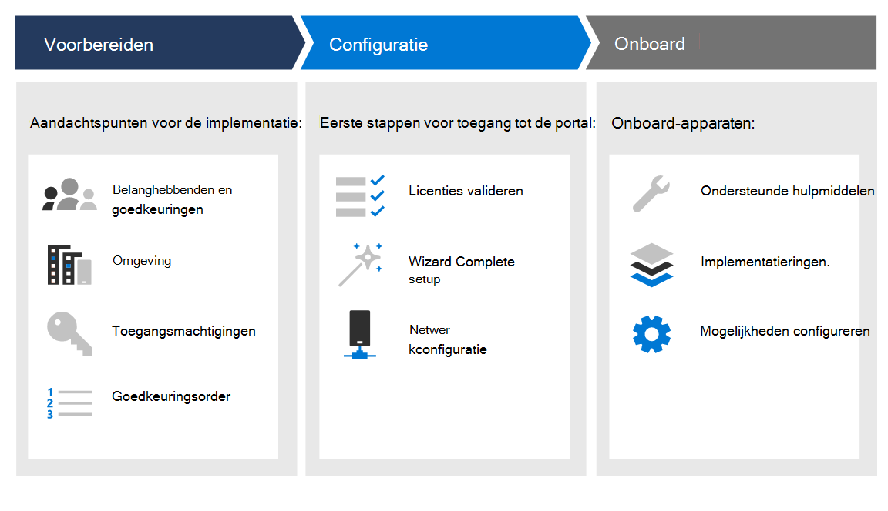

# ImplementatiefasenDeployment phases

[!INCLUDE [Microsoft 365 Defender rebranding](../../includes/microsoft-defender.md)]

**Van toepassing op:****Applies to:**
- [Microsoft Defender voor EindpuntMicrosoft Defender for Endpoint](https://go.microsoft.com/fwlink/p/?linkid=2154037)
- [Microsoft 365 DefenderMicrosoft 365 Defender](https://go.microsoft.com/fwlink/?linkid=2118804)

>Wilt u Defender voor Eindpunt ervaren?Want to experience Defender for Endpoint? [Meld u aan voor een gratis proefabonnement.Sign up for a free trial.](https://www.microsoft.com/microsoft-365/windows/microsoft-defender-atp?ocid=docs-wdatp-assignaccess-abovefoldlink)

Lees hoe u Microsoft Defender voor Eindpunt implementeert, zodat uw bedrijf kan profiteren van preventieve beveiliging, detectie na inbreuken, geautomatiseerd onderzoek en antwoord.Learn how to deploy Microsoft Defender for Endpoint so that your enterprise can take advantage of preventative protection, post-breach detection, automated investigation, and response. 

Deze handleiding helpt u met alle belanghebbenden samen te werken om uw omgeving voor te bereiden en apparaten vervolgens op een methodische manier aan te boord te nemen, van evaluatie naar een zinvolle pilot, naar volledige implementatie.This guide helps you work across stakeholders to prepare your environment and then onboard devices in a methodical way, moving from evaluation, to a meaningful pilot, to full deployment.

Elke sectie komt overeen met een afzonderlijk artikel in deze oplossing.Each section corresponds to a separate article in this solution.

|FasePhase | BeschrijvingDescription | 
|:-------|:-----|
| [Fase 1: VoorbereidenPhase 1: Prepare](prepare-deployment.md)| Meer informatie over waar u rekening mee moet houden bij het implementeren van Defender voor eindpunten, zoals goedkeuringen van belanghebbenden, milieuoverwegingen, toegangsmachtigingen en acceptatieorder van mogelijkheden.Learn about what you need to consider when deploying Defender for Endpoint such as stakeholder approvals, environment considerations, access permissions, and adoption order of capabilities. 
| [Fase 2: InstellenPhase 2: Setup](production-deployment.md)|  Krijg richtlijnen voor de eerste stappen die u moet uitvoeren, zodat u toegang hebt tot de portal, zoals het valideren van licenties, het voltooien van de installatiewizard en de netwerkconfiguratie.Get guidance on the initial steps you need to take so that you can access the portal such as validating licensing, completing the setup wizard, and network configuration. 
| [Fase 3: OnboardenPhase 3: Onboard](onboarding.md) | Meer informatie over het gebruik van implementatieringen, ondersteunde onboarding-hulpprogramma's op basis van het type eindpunt en het configureren van beschikbare mogelijkheden.Learn how to make use of deployment rings, supported onboarding tools based on the type of endpoint, and configuring available capabilities. 

Nadat u deze handleiding hebt voltooid, wordt u ingesteld met de juiste toegangsmachtigingen, worden uw eindpunten onboarded en worden sensorgegevens aan de service gemeld, en zijn er mogelijkheden zoals bescherming van de volgende generatie en de beperking van het aanvalsoppervlak aanwezig.After you've completed this guide, you'll be setup with the right access permissions, your endpoints will be onboarded and reporting sensor data to the service, and capabilities such as next-generation protection and attack surface reduction will be in place.

Ongeacht de omgevingsarchitectuur en de implementatiemethode die  u in de implementatiehulplijnen voor plannen hebt beschreven, wordt u in deze handleiding ondersteund bij het onboarden van eindpunten.Regardless of the environment architecture and method of deployment you choose outlined in the [Plan deployment](deployment-strategy.md) guidance, this guide is going to support you in onboarding endpoints. 

## Belangrijke mogelijkhedenKey capabilities

Hoewel Microsoft Defender voor Endpoint veel mogelijkheden biedt, is het primaire doel van deze implementatiehandleiding om u op weg te helpen met onboarding-apparaten.While Microsoft Defender for Endpoint provides many capabilities, the primary purpose of this deployment guide is to get you started by onboarding devices. Naast onboarding kunt u met deze richtlijnen aan de slag met de volgende mogelijkheden.In addition to onboarding, this guidance gets you started with the following capabilities.

MogelijkheidCapability | BeschrijvingDescription 
:---|:---
Detectie van en reactie op eindpuntEndpoint detection and response | De mogelijkheden voor eindpuntdetectie en -reactie worden gebruikt om inbraakpogingen en actieve inbreuken op te sporen, te onderzoeken en te reageren.Endpoint detection and response capabilities are put in place to detect, investigate, and respond to intrusion attempts and active breaches.
Beveiliging van de volgende generatieNext-generation protection | Om de beveiligingsperimeter van uw netwerk verder te versterken, gebruikt Microsoft Defender voor Eindpunt de volgende generatie beveiliging die is ontworpen om alle soorten nieuwe bedreigingen op te vangen.To further reinforce the security perimeter of your network, Microsoft Defender for Endpoint uses next-generation protection designed to catch all types of emerging threats.
Kwetsbaarheid voor aanvallen verminderenAttack surface reduction |  Geef de eerste verdedigingslinie in de stapel op.Provide the first line of defense in the stack. Door ervoor te zorgen dat configuratie-instellingen correct zijn ingesteld en technieken voor risicobeperking worden toegepast, zijn deze mogelijkheden bestand tegen aanvallen en misbruik.By ensuring configuration settings are properly set and exploit mitigation techniques are applied, these set of capabilities resist attacks and exploitation.

Al deze mogelijkheden zijn beschikbaar voor licentiehouders van Microsoft Defender voor eindpunten.All these capabilities are available for Microsoft Defender for Endpoint license holders. Zie Licentievereisten voor [meer informatie.](minimum-requirements.md#licensing-requirements)For more information, see [Licensing requirements](minimum-requirements.md#licensing-requirements).

## BereikScope

### In bereikIn scope

-   Gebruik van Microsoft Endpoint Manager en Microsoft Endpoint Manager eindpunten aan boord van de service en configureer mogelijkhedenUse of Microsoft Endpoint Manager and Microsoft Endpoint Manager to onboard endpoints into the service and configure capabilities

-   Defender voor endpoint-eindpuntdetectie en -respons (EDR) inschakelenEnabling Defender for Endpoint endpoint detection and response (EDR)  capabilities

-   De mogelijkheden van Defender voor Endpoint Endpoint Protection Platform (EPP) inschakelenEnabling Defender for Endpoint endpoint protection platform (EPP) capabilities

    -   Beveiliging van de volgende generatieNext-generation protection

    -   Kwetsbaarheid voor aanvallen verminderenAttack surface reduction

### Buiten bereikOut of scope

De volgende opties vallen buiten het bereik van deze implementatiehandleiding:The following are out of scope of this deployment guide:

-   Configuratie van oplossingen van derden die kunnen worden geïntegreerd met Defender voor EindpuntConfiguration of third-party solutions that might integrate with Defender for Endpoint

-   Penetratietests in de productieomgevingPenetration testing in production environment

## Zie ookSee also
- [Fase 1: VoorbereidenPhase 1: Prepare](prepare-deployment.md)
- [Fase 2: InstellenPhase 2: Set up](production-deployment.md)
- [Fase 3: OnboardenPhase 3: Onboard](onboarding.md)
- [Implementatie plannenPlan deployment](deployment-strategy.md)