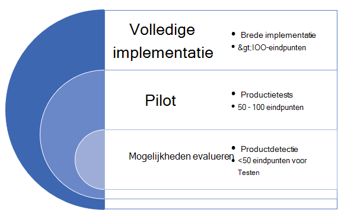
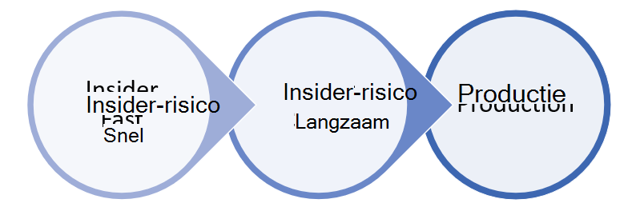

# Microsoft Defender voor eindpunt implementeren in ringen

[!INCLUDE [Microsoft 365 Defender rebranding](../../includes/microsoft-defender.md)]

**Van toepassing op:**
- [Microsoft Defender voor Eindpunt](https://go.microsoft.com/fwlink/p/?linkid=2154037)
- [Microsoft 365 Defender](https://go.microsoft.com/fwlink/?linkid=2118804)

>Wilt u Defender voor Eindpunt ervaren? [Meld u aan voor een gratis proefabonnement.](https://www.microsoft.com/microsoft-365/windows/microsoft-defender-atp?ocid=docs-wdatp-assignaccess-abovefoldlink)

Het implementeren van Microsoft Defender voor Endpoint kan worden uitgevoerd met behulp van een ringgebaseerde implementatiebenadering. 

De implementatieringen kunnen in de volgende scenario's worden toegepast:
- [Nieuwe implementaties](#new-deployments)
- [Bestaande implementaties](#existing-deployments)

## Nieuwe implementaties

Een ringbenadering is een methode om een set eindpunten aan boord te identificeren en te controleren of aan bepaalde criteria wordt voldaan voordat u doorgaat met het implementeren van de service naar een grotere set apparaten. U kunt de criteria voor het afsluiten van elke ring definiëren en ervoor zorgen dat ze tevreden zijn voordat u naar de volgende ring gaat.

Het implementeren van een ringgebaseerde implementatie helpt mogelijke problemen te beperken die zich kunnen voordoen tijdens de implementatie van de service. Als u eerst een bepaald aantal apparaten test, kunt u potentiële problemen identificeren en mogelijke risico's beperken die zich kunnen voordoen. 

Tabel 1 geeft een voorbeeld van de implementatieringen die u mogelijk gebruikt. 

**Tabel 1**

|**Implementatiering**|**Beschrijving**|
|:-----|:-----|
Evalueren | Ring 1: 50 systemen identificeren voor testproeven 
Pilot | Ring 2: de volgende 50-100 eindpunten in de productieomgeving identificeren    
Volledige implementatie | Ring 3: Service in grotere stappen uitrollen naar de rest van de omgeving

### Criteria afsluiten
Een voorbeeldset met exitcriteria voor deze ringen kan bestaan uit:
- Apparaten worden weergegeven in de lijst met apparaatvoorraad
- Waarschuwingen worden weergegeven in dashboard
- [Een detectietest uitvoeren](run-detection-test.md)
- [Een gesimuleerde aanval uitvoeren op een apparaat](attack-simulations.md)

### Evalueren
Identificeer een klein aantal testapparaten in uw omgeving om aan te boord van de service. In het ideale ideale situatie zijn deze machines minder dan 50 eindpunten. 

### Pilot
Microsoft Defender voor Eindpunt ondersteunt diverse eindpunten die u aan boord van de service kunt gebruiken. Identificeer in deze ring verschillende apparaten aan boord en op basis van de exitcriteria die u definieert, besluit u door te gaan naar de volgende implementatiering.

In de volgende tabel ziet u de ondersteunde eindpunten en het bijbehorende hulpprogramma dat u kunt gebruiken om apparaten aan te boord van de service. 

| Eindpunt     | Implementatiehulpmiddel                       |
|--------------|------------------------------------------|
| **Windows**  |  [Lokaal script (maximaal 10 apparaten)](configure-endpoints-script.md)   OPMERKING: Als u meer dan tien apparaten wilt implementeren in een productieomgeving, gebruikt u in plaats daarvan de methode Groepsbeleid of de andere ondersteunde hulpmiddelen die hieronder worden vermeld.   [Groepsbeleid](configure-endpoints-gp.md)    [Microsoft Endpoint Manager/ Mobile Device Manager](configure-endpoints-mdm.md)     [Microsoft Endpoint Configuration Manager](configure-endpoints-sccm.md)   [VDI-scripts](configure-endpoints-vdi.md)   |
| **macOS**    | [Lokaal script](mac-install-manually.md)   [Microsoft Endpoint Manager](mac-install-with-intune.md)   [JAMF-Pro](mac-install-with-jamf.md)   [Mobile Device Management](mac-install-with-other-mdm.md) |
| **Linux Server** | [Lokaal script](linux-install-manually.md)   [Poppop](linux-install-with-puppet.md)   [Ansible](linux-install-with-ansible.md)|
| **iOS**      | [App-gebaseerde](ios-install.md)                                |
| **Android**  | [Microsoft Endpoint Manager](android-intune.md)               | 

### Volledige implementatie
In dit stadium kunt u het implementatiemateriaal [plannen](deployment-strategy.md) gebruiken om uw implementatie te plannen. 

Gebruik het volgende materiaal om de juiste Microsoft Defender voor eindpuntarchitectuur te selecteren die het beste past bij uw organisatie.

|**Item**|**Beschrijving**|
|:-----|:-----|
|  [PDF](https://github.com/MicrosoftDocs/microsoft-365-docs/raw/public/microsoft-365/security/defender-endpoint/downloads/mdatp-deployment-strategy.pdf) \| [Visio](https://github.com/MicrosoftDocs/microsoft-365-docs/raw/public/microsoft-365/security/defender-endpoint/downloads/mdatp-deployment-strategy.vsdx) | Met het materiaal voor architecten kunt u uw implementatie plannen voor de volgende architecturen: <ul><li> Cloud-native </li><li> Co-management </li><li> On-premises</li><li>Evaluatie en lokale onboarding</li>

## Bestaande implementaties

### Windows eindpunten
Voor Windows en/of Windows-servers selecteert u verschillende machines die u van tevoren wilt testen (vóór patchdinsdag) met behulp van het BEVEILIGINGSupdatevalidatieprogramma **(SUVP).**

Zie voor meer informatie:
- [Wat is het validatieprogramma voor beveiligingsupdates](https://techcommunity.microsoft.com/t5/windows-it-pro-blog/what-is-the-security-update-validation-program/ba-p/275767)
- [Software Update Validation Program and Microsoft Centrum voor beveiliging tegen schadelijke software Establishment - TwC Interactive Timeline Part 4](https://www.microsoft.com/security/blog/2012/03/28/software-update-validation-program-and-microsoft-malware-protection-center-establishment-twc-interactive-timeline-part-4/)

### Niet-Windows eindpunten
Met macOS en Linux kunt u een paar systemen gebruiken en uitvoeren in het Beta-kanaal.

>[!NOTE]
>Idealiter ten minste één beveiligingsbeheerder en één ontwikkelaar, zodat u compatibiliteits-, prestatie- en betrouwbaarheidsproblemen kunt vinden voordat de build in het huidige kanaal wordt gemaakt.

De keuze van het kanaal bepaalt het type en de frequentie van de updates die op uw apparaat worden aangeboden. Apparaten in bètaversie zijn de eerste apparaten die updates en nieuwe functies ontvangen, later gevolgd door Preview en ten laatste door Current.

Als u een voorbeeld van nieuwe functies wilt bekijken en vroegtijdig feedback wilt geven, wordt u aangeraden sommige apparaten in uw bedrijf te configureren voor het gebruik van bèta of preview.

>[!WARNING]
>Als u het kanaal na de eerste installatie overschakelt, moet het product opnieuw worden geïnstalleerd. Als u het productkanaal wilt wijzigen: verwijder het bestaande pakket, configureer het apparaat opnieuw om het nieuwe kanaal te gebruiken en volg de stappen in dit document om het pakket vanaf de nieuwe locatie te installeren.
