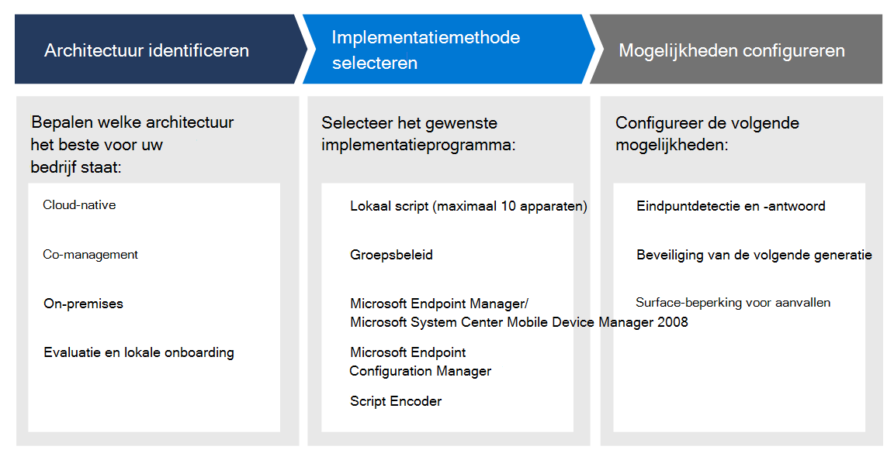

# Uw Microsoft Defender voor endpoint-implementatie plannenPlan your Microsoft Defender for Endpoint deployment 

[!INCLUDE [Microsoft 365 Defender rebranding](../../includes/microsoft-defender.md)]

**Van toepassing op:****Applies to:**
- [Microsoft Defender voor EndpointMicrosoft Defender for Endpoint](https://go.microsoft.com/fwlink/p/?linkid=2154037)
- [Microsoft 365 DefenderMicrosoft 365 Defender](https://go.microsoft.com/fwlink/?linkid=2118804)

>Wilt u Defender voor Eindpunt ervaren?Want to experience Defender for Endpoint? [Meld u aan voor een gratis proefabonnement.Sign up for a free trial.](https://www.microsoft.com/microsoft-365/windows/microsoft-defender-atp?ocid=docs-wdatp-secopsdashboard-abovefoldlink) 

Plan uw Microsoft Defender voor endpoint-implementatie, zodat u de beveiligingsmogelijkheden binnen de suite kunt maximaliseren en uw bedrijf beter kunt beschermen tegen cyberdreigingen.Plan your Microsoft Defender for Endpoint deployment so that you can maximize the security capabilities within the suite and better protect your enterprise from cyber threats.

Deze oplossing biedt richtlijnen voor het identificeren van uw omgevingsarchitectuur, het type implementatieprogramma dat het beste aansluit bij uw behoeften en richtlijnen voor het configureren van mogelijkheden.This solution provides guidance on how to identify your environment architecture, select the type of deployment tool that best fits your needs, and guidance on how to configure capabilities.

## Stap 1: Architectuur identificerenStep 1: Identify architecture
We begrijpen dat elke ondernemingsomgeving uniek is, dus hebben we verschillende opties geboden om u de flexibiliteit te bieden bij het kiezen van de implementatie van de service.We understand that every enterprise environment is unique, so we've provided several options to give you the flexibility in choosing how to deploy the service.

Sommige hulpprogramma's zijn beter geschikt voor bepaalde architecturen, afhankelijk van uw omgeving.Depending on your environment, some tools are better suited for certain architectures. 

Gebruik het volgende materiaal om de juiste Defender voor eindpuntarchitectuur te selecteren die het beste past bij uw organisatie.Use the following material to select the appropriate Defender for Endpoint architecture that best suites your organization.

| ItemItem | BeschrijvingDescription |
|:-----|:-----|
|  [PDF](https://github.com/MicrosoftDocs/microsoft-365-docs/raw/public/microsoft-365/security/defender-endpoint/downloads/mdatp-deployment-strategy.pdf) \| [Visio](https://github.com/MicrosoftDocs/microsoft-365-docs/raw/public/microsoft-365/security/defender-endpoint/downloads/mdatp-deployment-strategy.vsdx)[PDF](https://github.com/MicrosoftDocs/microsoft-365-docs/raw/public/microsoft-365/security/defender-endpoint/downloads/mdatp-deployment-strategy.pdf)  \| [Visio](https://github.com/MicrosoftDocs/microsoft-365-docs/raw/public/microsoft-365/security/defender-endpoint/downloads/mdatp-deployment-strategy.vsdx) | Met het materiaal voor architecten kunt u uw implementatie plannen voor de volgende architecturen:The architectural material helps you plan your deployment for the following architectures: <ul><li> Cloud-nativeCloud-native </li><li> Co-managementCo-management </li><li> On-premisesOn-premise</li><li>Evaluatie en lokale onboardingEvaluation and local onboarding</li>

## Stap 2: Implementatiemethode selecterenStep 2: Select deployment method
Defender voor Eindpunt ondersteunt diverse eindpunten die u aan boord van de service kunt gebruiken.Defender for Endpoint supports a variety of endpoints that you can onboard to the service. 

De volgende tabel bevat de ondersteunde eindpunten en het bijbehorende implementatieprogramma dat u kunt gebruiken, zodat u de implementatie op de juiste manier kunt plannen.The following table lists the supported endpoints and the corresponding deployment tool that you can use so that you can plan the deployment appropriately.

| EindpuntEndpoint     | ImplementatiehulpmiddelDeployment tool                       |
|--------------|------------------------------------------|
| **Windows****Windows**  |  [Lokaal script (maximaal 10 apparaten)Local script (up to 10 devices)](configure-endpoints-script.md)    [GroepsbeleidGroup Policy](configure-endpoints-gp.md)    [Microsoft Endpoint Manager/ Mobile Device ManagerMicrosoft Endpoint Manager/ Mobile Device Manager](configure-endpoints-mdm.md)     [Microsoft Endpoint Configuration ManagerMicrosoft Endpoint Configuration Manager](configure-endpoints-sccm.md)   [VDI-scriptsVDI scripts](configure-endpoints-vdi.md)   |
| **macOS****macOS**    | [Lokaal scriptLocal script](mac-install-manually.md)   [Microsoft Endpoint ManagerMicrosoft Endpoint Manager](mac-install-with-intune.md)   [JAMF ProJAMF Pro](mac-install-with-jamf.md)   [Mobile Device ManagementMobile Device Management](mac-install-with-other-mdm.md) |
| **Linux Server****Linux Server** | [Lokaal scriptLocal script](linux-install-manually.md)   [PoppopPuppet](linux-install-with-puppet.md)   [AnsibleAnsible](linux-install-with-ansible.md)|
| **iOS****iOS**      | [App-gebaseerdeApp-based](ios-install.md)                                |
| **Android****Android**  | [Microsoft Endpoint ManagerMicrosoft Endpoint Manager](android-intune.md)               | 

## Stap 3: Mogelijkheden configurerenStep 3: Configure capabilities
Nadat u eindpunten hebt onboarding, configureert u de beveiligingsmogelijkheden in Defender voor Eindpunt, zodat u de krachtige beveiliging kunt maximaliseren die beschikbaar is in de suite.After onboarding endpoints, configure the security capabilities in Defender for Endpoint so that you can maximize the robust security protection available in the suite. De volgende mogelijkheden zijn:Capabilities include:

- Eindpuntdetectie en -antwoordEndpoint detection and response
- Beveiliging van de volgende generatieNext-generation protection
- Surface-beperking voor aanvallenAttack surface reduction

  
## Verwante onderwerpenRelated topics
- [ImplementatiefasenDeployment phases](deployment-phases.md)
