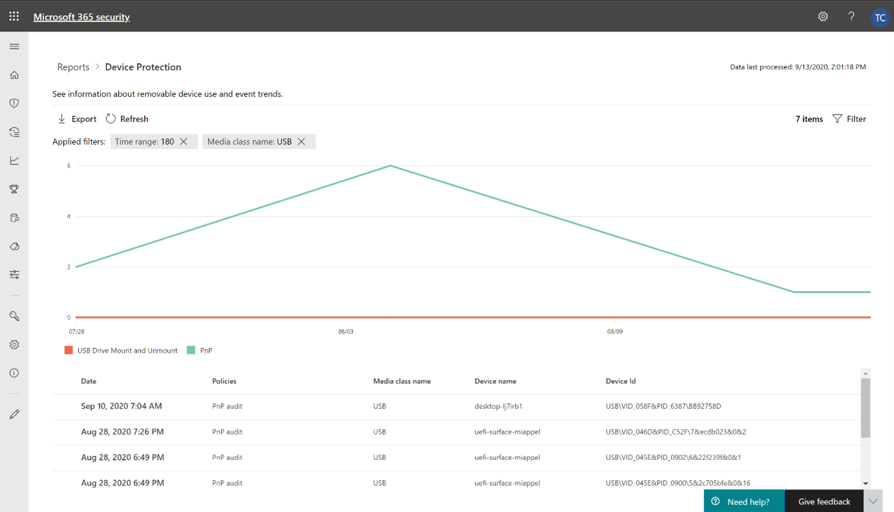

# De gegevens van uw organisatie beveiligen met apparaatbesturingselement

**Van toepassing op:** [Microsoft Defender voor Eindpunt](https://go.microsoft.com/fwlink/p/?linkid=2069559)

Microsoft Defender voor Endpoint-apparaatbesturingselement beschermt tegen gegevensverlies door mediagebruik door apparaten in uw organisatie te controleren en te beheren, zoals het gebruik van verwisselbare opslagapparaten en USB-stations.

Met het apparaatbesturingselementrapport kunt u gebeurtenissen bekijken die betrekking hebben op mediagebruik, zoals:

- **Auditgebeurtenissen:** Geeft het aantal auditgebeurtenissen weer dat optreedt wanneer externe media zijn verbonden.
- **Beleidsgebeurtenissen:** Toont het aantal beleidsgebeurtenissen dat optreedt wanneer een apparaatbesturingselementbeleid wordt geactiveerd.

> [!NOTE]
> De auditgebeurtenis voor het bijhouden van mediagebruik is standaard ingeschakeld voor apparaten die zijn ingeschakeld bij Microsoft Defender voor Eindpunt.

## De auditgebeurtenissen begrijpen

De auditgebeurtenissen zijn:

- **USB-station mount and unmount:** Auditgebeurtenissen die worden gegenereerd wanneer een USB-station is bevestigd of losgekoppeld.
- **PnP:** Auditgebeurtenissen voor het aansluiten en afspelen worden gegenereerd wanneer verwisselbare opslag, een printer of Bluetooth media is verbonden.

## Beveiliging van apparaatbesturingselementen controleren

Apparaatbesturingselement in Microsoft Defender voor Eindpunt biedt beveiligingsbeheerders hulpmiddelen waarmee ze de beveiliging van apparaatbeheer van hun organisatie kunnen bijhouden via rapporten. U kunt het apparaatbesturingselementrapport vinden in het Microsoft 365 beveiligingscentrum door naar **Rapporten > Apparaatbeveiliging te gaan.**

De apparaatbeveiligingskaart op het dashboard **Rapporten** toont het aantal auditgebeurtenissen dat per mediatype is gegenereerd, in de afgelopen 180 dagen.

> [!div class="mx-imgBorder"]
> 

De **knop Details weergeven** toont meer gegevens over mediagebruik op de **rapportpagina van het apparaatbesturingselement.**

De pagina bevat een dashboard met een samengevoegd aantal gebeurtenissen per type en een lijst met gebeurtenissen. Beheerders kunnen filteren op tijdbereik, naam van mediaklasse en apparaat-id.

> [!div class="mx-imgBorder"]
> 

Wanneer u een gebeurtenis selecteert, wordt er een flyout weergegeven met meer informatie:

- **Algemene details:** Datum, actiemodus en het beleid van deze gebeurtenis.
- **Media-informatie:** Mediagegevens omvatten Medianaam, Klasnaam, Class GUID, Apparaat-id, Leverancier-id, Volume, Serienummer en Bustype.
- **Locatiegegevens:** Apparaatnaam en MDATP apparaat-id.

> [!div class="mx-imgBorder"]
> 

Als u realtimeactiviteiten voor deze media in de hele organisatie wilt zien, selecteert u **de knop Geavanceerd zoeken** openen. Dit omvat een ingesloten, vooraf gedefinieerde query.

> [!div class="mx-imgBorder"]
> 

Als u de beveiliging van het apparaat wilt zien, selecteert u de **knop Apparaatpagina** openen in de flyout. Met deze knop wordt de pagina apparaatentiteit geopend.

> [!div class="mx-imgBorder"]
> 

## Vertragingen melden

Het apparaatbesturingselementrapport kan een vertraging van 12 uur hebben vanaf het moment dat een mediaverbinding plaatsvindt tot het moment dat de gebeurtenis wordt weergegeven in de kaart of in de lijst met domeinen.
