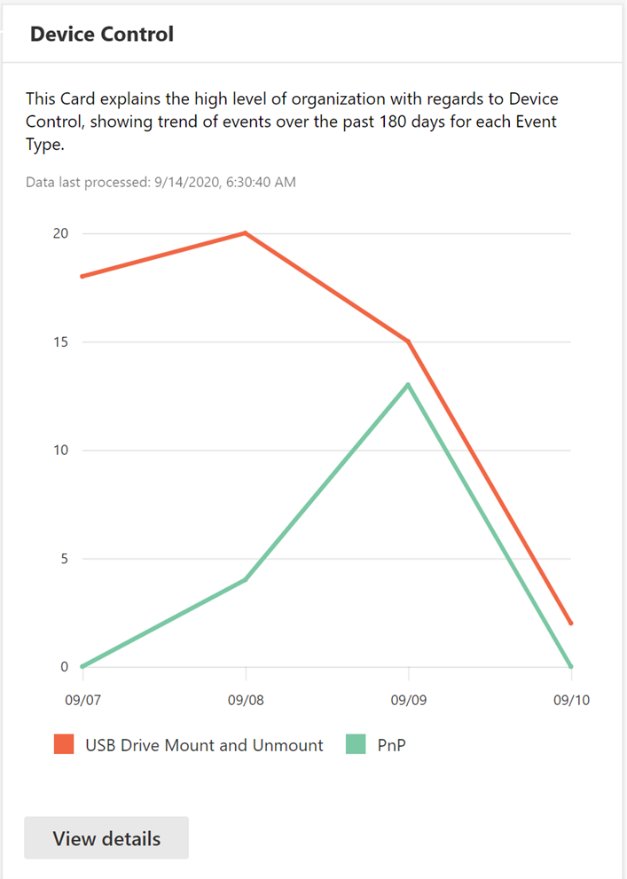

# De gegevens van uw organisatie beveiligen met apparaatbesturingselementProtect your organization’s data with device control

**Van toepassing op:** [Microsoft Defender voor Eindpunt](https://go.microsoft.com/fwlink/p/?linkid=2069559)**Applies to:** [Microsoft Defender for Endpoint](https://go.microsoft.com/fwlink/p/?linkid=2069559)

Microsoft Defender voor Endpoint-apparaatbesturingselement beschermt tegen gegevensverlies door mediagebruik door apparaten in uw organisatie te controleren en te beheren, zoals het gebruik van verwisselbare opslagapparaten en USB-stations.Microsoft Defender for Endpoint device control protects against data loss, by monitoring and controlling media use by devices in your organization, such as the use of removable storage devices and USB drives.

Met het apparaatbesturingselementrapport kunt u gebeurtenissen bekijken die betrekking hebben op mediagebruik, zoals:With the device control report, you can view events that relate to media usage, such as:

- **Auditgebeurtenissen:** Geeft het aantal auditgebeurtenissen weer dat optreedt wanneer externe media zijn verbonden.**Audit events:** Shows the number of audit events that occur when external media is connected.
- **Beleidsgebeurtenissen:** Toont het aantal beleidsgebeurtenissen dat optreedt wanneer een apparaatbesturingselementbeleid wordt geactiveerd.**Policy events:** Shows the number of policy events that occur when a device control policy is triggered.

> [!NOTE]
> De auditgebeurtenis voor het bijhouden van mediagebruik is standaard ingeschakeld voor apparaten die zijn ingeschakeld bij Microsoft Defender voor Eindpunt.The audit event to track media usage is enabled by default for devices onboarded to Microsoft Defender for Endpoint.

## De auditgebeurtenissen begrijpenUnderstanding the audit events

De auditgebeurtenissen zijn:The audit events include:

- **USB-station mount and unmount:** Auditgebeurtenissen die worden gegenereerd wanneer een USB-station is bevestigd of losgekoppeld.**USB drive mount and unmount:** Audit events that are generated when a USB drive is mounted or unmounted.
- **PnP:** Auditgebeurtenissen voor het aansluiten en afspelen worden gegenereerd wanneer verwisselbare opslag, een printer of Bluetooth-media is verbonden.**PnP:** Plug and Play audit events are generated when removable storage, a printer, or Bluetooth media is connected.

## Beveiliging van apparaatbesturingselementen controlerenMonitor device control security

Apparaatbesturingselement in Microsoft Defender voor Eindpunt biedt beveiligingsbeheerders hulpmiddelen waarmee ze de beveiliging van apparaatbeheer van hun organisatie kunnen bijhouden via rapporten.Device control in Microsoft Defender for Endpoint empowers security administrators with tools that enable them to track their organization’s device control security through reports. U kunt het apparaatbesturingselementrapport vinden in het Microsoft 365-beveiligingscentrum door naar **Rapporten > Apparaatbeveiliging te gaan.**You can find the device control report in the Microsoft 365 security center by going to **Reports > Device protection**.

De apparaatbeveiligingskaart op het dashboard **Rapporten** toont het aantal auditgebeurtenissen dat per mediatype is gegenereerd, in de afgelopen 180 dagen.The Device protection card on the **Reports** dashboard shows the number of audit events generated by media type, over the last 180 days.

> [!div class="mx-imgBorder"]
> 

De **knop Details weergeven** toont meer gegevens over mediagebruik op de **rapportpagina van het apparaatbesturingselement.**The **View details** button shows more media usage data in the **device control report** page.

De pagina bevat een dashboard met een samengevoegd aantal gebeurtenissen per type en een lijst met gebeurtenissen.The page provides a dashboard with aggregated number of events per type and a list of events. Beheerders kunnen filteren op tijdbereik, naam van mediaklasse en apparaat-id.Administrators can filter on time range, media class name, and device ID.

> [!div class="mx-imgBorder"]
> 

Wanneer u een gebeurtenis selecteert, wordt er een flyout weergegeven met meer informatie:When you select an event, a flyout appears that shows you more information:

- **Algemene details:** Datum, actiemodus en het beleid van deze gebeurtenis.**General details:** Date, Action mode, and the policy of this event.
- **Media-informatie:** Mediagegevens omvatten Medianaam, Klasnaam, Class GUID, Apparaat-id, Leverancier-id, Volume, Serienummer en Bustype.**Media information:** Media information includes Media name, Class name, Class GUID, Device ID, Vendor ID, Volume, Serial number, and Bus type.
- **Locatiegegevens:** Apparaatnaam en MDATP-apparaat-id.**Location details:** Device name and MDATP device ID.

> [!div class="mx-imgBorder"]
> 

Als u realtimeactiviteiten voor deze media in de hele organisatie wilt zien, selecteert u **de knop Geavanceerd zoeken** openen.To see real-time activity for this media across the organization, select the **Open Advanced hunting** button. Dit omvat een ingesloten, vooraf gedefinieerde query.This includes an embedded, pre-defined query.

> [!div class="mx-imgBorder"]
> 

Als u de beveiliging van het apparaat wilt zien, selecteert u de **knop Apparaatpagina** openen in de flyout.To see the security of the device, select the **Open device page** button on the flyout. Met deze knop wordt de pagina apparaatentiteit geopend.This button opens the device entity page.

> [!div class="mx-imgBorder"]
> 

## Vertragingen meldenReporting delays

Het apparaatbesturingselementrapport kan een vertraging van 12 uur hebben vanaf het moment dat een mediaverbinding plaatsvindt tot het moment dat de gebeurtenis wordt weergegeven in de kaart of in de lijst met domeinen.The device control report can have a 12-hour delay from the time a media connection occurs to the time the event is reflected in the card or in the domain list.
