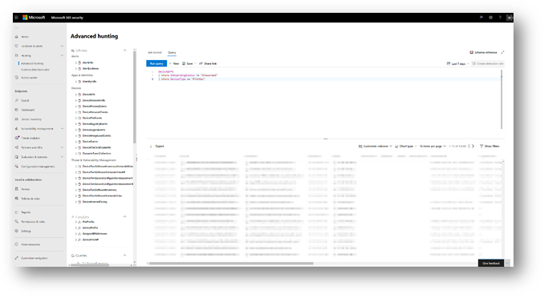

# <a name="device-discovery-overview"></a>Overzicht van apparaatdetectie

[!INCLUDE [Microsoft 365 Defender rebranding](../../includes/microsoft-defender.md)]

**Van toepassing op:**
- [Microsoft Defender voor Eindpunt](https://go.microsoft.com/fwlink/p/?linkid=2146631)
- [Microsoft 365 Defender](https://go.microsoft.com/fwlink/?linkid=2118804)


Als u uw omgeving beschermt, moet u de apparaten in uw netwerk inventariseren. Het toewijzen van apparaten in een netwerk kan echter vaak duur, uitdagend en tijdrovend zijn.

Microsoft Defender voor Eindpunt biedt een apparaatdetectiefunctie waarmee u niet-beheerbare apparaten kunt vinden die zijn verbonden met uw bedrijfsnetwerk zonder extra apparaten of lastige proceswijzigingen.

Met de apparaatdetectiefunctie kunt u het volgende doen:

- **Ontdek zakelijke eindpunten die zijn verbonden met uw bedrijfsnetwerk**

  Met basis- of standaarddetectieopties kunt u werkstations, servers en mobiele eindpunten ontdekken die nog niet zijn onboarded bij Microsoft Defender voor Eindpunt.

- **Aan boord gevonden eindpunten**

  Niet-bemande eindpunten in uw netwerk brengen beveiligingslekken en risico's voor uw netwerk met zich mee. Als u deze inwerkt bij de service, kunt u de zichtbaarheid van de beveiliging ervan vergroten.

In combinatie met deze mogelijkheid is er een nieuwe beveiligingsaanbeveling beschikbaar voor onboard-apparaten voor Microsoft Defender voor Eindpunt als onderdeel van de bestaande ervaring voor bedreigings- en kwetsbaarheidsbeheer.

## <a name="discovery-methods"></a>Detectiemethoden

Er zijn twee detectiemodi:

- Basisdetectie
- Standaarddetectie (aanbevolen)

> [!IMPORTANT]
> Discovery is ingesteld op basismodus. U kunt ervoor kiezen om deze configuratie te behouden via de pagina Instellingen. Standaarddetectie is vanaf 19 juli 2021 de standaardmodus voor alle klanten, tenzij deze is gewijzigd via de pagina Instellingen vóór deze datum.

### <a name="basic-discovery"></a>Basisdetectie

In deze modus verzamelen eindpunten passief gebeurtenissen in uw netwerk en halen ze apparaatgegevens op. Bij basisdetectie wordt de SenseNDR.exe gebruikt voor het verzamelen van passieve netwerkgegevens en wordt er geen netwerkverkeer gestart. Eindpunten halen eenvoudig gegevens op uit elk netwerkverkeer dat wordt gezien door een onboarded-apparaat.

### <a name="standard-discovery"></a>Standaarddetectie

Met deze modus kunnen eindpunten actief waargenomen apparaten in het netwerk onderzoeken om verzamelde gegevens te verrijken, zodat u een betrouwbare en coherente apparaatvoorraad kunt maken. In de standaardmodus wordt slim en actief geprobeerd om nog meer informatie over waargenomen apparaten te ontdekken om bestaande apparaatgegevens te verrijken.

Wanneer de standaardmodus is ingeschakeld, kan minimale en verwaarloosbare netwerkactiviteit die door de detectie-sensor wordt gegenereerd, worden waargenomen door hulpprogramma's voor netwerkcontrole in uw organisatie.

 Als u ervoor kiest deze modus niet in te schakelen, krijgt u slechts beperkte zichtbaarheid van niet-bemande eindpunten in uw netwerk.

Standaarddetectie gebruikt verschillende PowerShell-scripts om apparaten in het netwerk actief te onderzoeken. Deze PowerShell-scripts zijn ondertekend door Microsoft en worden uitgevoerd vanaf de volgende locatie: `C:\ProgramData\Microsoft\Windows Defender Advanced Threat Protection\Downloads\*.ps` . Bijvoorbeeld `C:\ProgramData\Microsoft\Windows Defender Advanced Threat Protection\Downloads\UnicastScannerV1.1.0.ps1`.

U kunt de detectie-instellingen wijzigen en aanpassen, zie [Apparaatdetectie configureren](configure-device-discovery.md)voor meer informatie.

> [!NOTE]
> De detectie-engine maakt onderscheid tussen netwerkgebeurtenissen die worden ontvangen in het bedrijfsnetwerk en buiten het bedrijfsnetwerk. Apparaten die niet zijn verbonden met bedrijfsnetwerken, worden niet gevonden of vermeld in de apparaatvoorraad.

## <a name="device-inventory"></a>Inventaris van apparaten

Apparaten die zijn ontdekt, maar nog niet zijn onboarded en beveiligd door Microsoft Defender voor Eindpunt, worden weergegeven in Apparaatvoorraad op het tabblad Eindpunten. U kunt nu een nieuw filter gebruiken in de lijst met apparaatvoorraad met de naam Onboarding-status, die een van de volgende waarden kan bevatten:

- Onboarded: het eindpunt is onboarded bij Microsoft Defender voor Eindpunt.
- Kan worden onboarded: het eindpunt is gevonden in het netwerk en het besturingssysteem is geïdentificeerd als een eindpunt dat wordt ondersteund door Microsoft Defender voor Eindpunt, maar het is momenteel niet onboarded. We raden u ten zeerste aan om deze apparaten te onboarden.
- Niet-ondersteund: het eindpunt is gevonden in het netwerk, maar wordt niet ondersteund door Microsoft Defender voor Eindpunt.
- Onvoldoende informatie: het systeem kon de ondersteuning van het apparaat niet bepalen. Als u standaarddetectie inschakelen op meer apparaten in het netwerk, kunnen de gevonden kenmerken worden uitgebreid.


> [!TIP]
> U kunt altijd filters toepassen om niet-beheerde apparaten uit de lijst met apparaatvoorraad uit te sluiten. U kunt ook de kolom onboardingstatus op API-query's gebruiken om niet-gebouwde apparaten te filteren.

## <a name="vulnerability-assessment-on-discovered-devices"></a>Beoordeling van kwetsbaarheid op gevonden apparaten

Beveiligingslekken en risico's op uw apparaten en andere ontdekte niet-bemande apparaten in het netwerk maken deel uit van de huidige TVM-stromen onder 'Beveiligings Aanbevelingen' en worden weergegeven op entiteitspagina's in de portal.
Zoek naar SSH-gerelateerde beveiligingsaanbevelingen om SSH-beveiligingslekken te vinden die zijn gerelateerd aan niet-beheerde en beheerde apparaten.


## <a name="use-advanced-hunting-on-discovered-devices"></a>Geavanceerd zoeken gebruiken op ontdekte apparaten

U kunt geavanceerde query's voor jagen gebruiken om zichtbaarheid te krijgen op gevonden apparaten.
Informatie over gevonden eindpunten in de tabel DeviceInfo of netwerkgerelateerde informatie over deze apparaten vindt u in de tabel DeviceNetworkInfo.



Apparaatdetectie gebruikt Microsoft Defender voor aan boord van Eindpunt-apparaten als een netwerkgegevensbron om activiteiten toe te schrijven aan niet-onboarded apparaten. Dit betekent dat als een apparaat met Een Microsoft Defender voor eindpunt dat is gecommuniceerd met een niet-onboarded apparaat, activiteiten op het niet-onboarded apparaat zichtbaar zijn op de tijdlijn en via de tabel Advanced hunting DeviceNetworkEvents.

Nieuwe gebeurtenissen zijn TCP-verbindingen (Transmission Control Protocol) en passen in het huidige DeviceNetworkEvents-schema. TCP gaat naar het apparaat dat is ingeschakeld voor Microsoft Defender voor Eindpunt vanaf een niet-Microsoft Defender voor Eindpunt ingeschakeld. 

De volgende actietypen zijn ook toegevoegd:

- ConnectionAttempt - Een poging om een TCP-verbinding tot stand te brengen (syn) 
- ConnectionAcknowledged - Een bevestiging dat een TCP-verbinding is geaccepteerd (syn\ack) 

U kunt deze voorbeeldquery proberen:

```
DeviceNetworkEvents
| where ActionType == "ConnectionAcknowledged" or ActionType == "ConnectionAttempt"
| take 10
```

## <a name="changed-behavior"></a>Gewijzigd gedrag

In de volgende sectie vindt u de wijzigingen die u ziet in Microsoft Defender voor Eindpunt en/of Microsoft 365 beveiligingscentrum wanneer deze functie is ingeschakeld.

1. Apparaten die niet zijn onboarded bij Microsoft Defender to Endpoint, worden naar verwachting weergegeven in de apparaatvoorraad, geavanceerde zoekopdrachten en API-query's. Hierdoor kunnen de queryresultaten aanzienlijk groter worden.
    1. In de tabellen 'DeviceInfo' en 'DeviceNetworkInfo' in Advanced Hunting wordt nu het apparaat gevonden. U kunt deze apparaten filteren met het kenmerk OnboardingStatus.
    2. Gevonden apparaten worden naar verwachting weergegeven in de resultaten van streaming-API-query's. U kunt deze apparaten filteren met behulp van het `OnboardingStatus` filter in uw query.
2. Niet-bemande apparaten worden toegewezen aan bestaande apparaatgroepen op basis van de gedefinieerde criteria.
3. In zeldzame gevallen kan standaarddetectie waarschuwingen activeren op netwerkmonitors of beveiligingshulpmiddelen. Als u dergelijke gebeurtenissen ervaart, kunt u feedback geven om te voorkomen dat deze problemen terugkeren. U kunt expliciet uitsluiten dat specifieke doelen of hele subnetten actief worden onderzocht door standaarddetectie.

## <a name="next-steps"></a>Volgende stappen

- [Apparaatdetectie configureren](configure-device-discovery.md)
- [Veelgestelde vragen over apparaatdetectie](device-discovery-faq.md)
