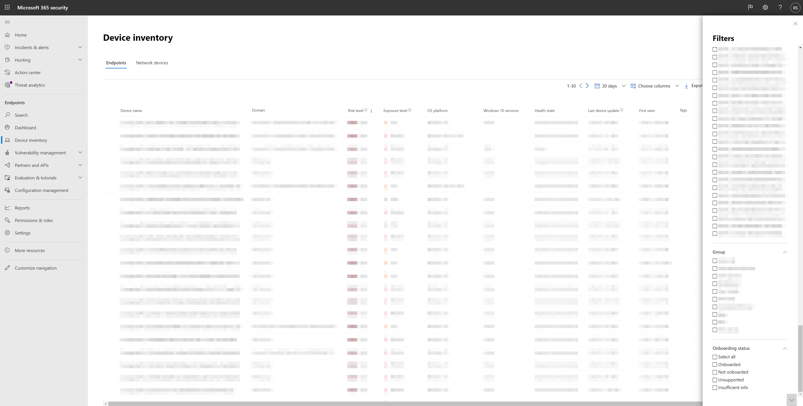

# <a name="device-discovery-overview"></a><span data-ttu-id="61b88-104">Overzicht van apparaatdetectie</span><span class="sxs-lookup"><span data-stu-id="61b88-104">Device discovery overview</span></span>

[!INCLUDE [Microsoft 365 Defender rebranding](../../includes/microsoft-defender.md)]

<span data-ttu-id="61b88-105">**Van toepassing op:**</span><span class="sxs-lookup"><span data-stu-id="61b88-105">**Applies to:**</span></span>
- [<span data-ttu-id="61b88-106">Microsoft Defender voor Eindpunt</span><span class="sxs-lookup"><span data-stu-id="61b88-106">Microsoft Defender for Endpoint</span></span>](https://go.microsoft.com/fwlink/p/?linkid=2146631)
- [<span data-ttu-id="61b88-107">Microsoft 365 Defender</span><span class="sxs-lookup"><span data-stu-id="61b88-107">Microsoft 365 Defender</span></span>](https://go.microsoft.com/fwlink/?linkid=2118804)

[!include[Prerelease information](../../includes/prerelease.md)]

<span data-ttu-id="61b88-108">Als u uw omgeving beschermt, moet u de apparaten in uw netwerk inventariseren.</span><span class="sxs-lookup"><span data-stu-id="61b88-108">Protecting your environment requires taking inventory of the devices that are in your network.</span></span> <span data-ttu-id="61b88-109">Het toewijzen van apparaten in een netwerk kan echter vaak duur, uitdagend en tijdrovend zijn.</span><span class="sxs-lookup"><span data-stu-id="61b88-109">However, mapping devices in a network can often be expensive, challenging, and time-consuming.</span></span> 

<span data-ttu-id="61b88-110">Microsoft Defender voor Eindpunt biedt een apparaatdetectiefunctie waarmee u niet-beheerbare apparaten kunt vinden die zijn verbonden met uw bedrijfsnetwerk zonder extra apparaten of lastige proceswijzigingen.</span><span class="sxs-lookup"><span data-stu-id="61b88-110">Microsoft Defender for Endpoint provides a device discovery capability that helps you find unmanaged devices connected to your corporate network without the need for extra appliances or cumbersome process changes.</span></span>


<span data-ttu-id="61b88-111">Met de apparaatdetectiefunctie kunt u het volgende doen:</span><span class="sxs-lookup"><span data-stu-id="61b88-111">The device discovery capability allows you to:</span></span>

- <span data-ttu-id="61b88-112">**Ontdek zakelijke eindpunten die zijn verbonden met uw bedrijfsnetwerk**</span><span class="sxs-lookup"><span data-stu-id="61b88-112">**Discover enterprise endpoints connected to your corporate network**</span></span> <br>
<span data-ttu-id="61b88-113">Met basis- of standaarddetectieopties kunt u werkstations, servers en mobiele eindpunten ontdekken die nog niet zijn onboarded bij Microsoft Defender voor Eindpunt.</span><span class="sxs-lookup"><span data-stu-id="61b88-113">Using either basic or standard discovery options, you can discover workstations, servers, and mobile endpoints that are not yet onboarded to Microsoft Defender for Endpoint.</span></span>  

- <span data-ttu-id="61b88-114">**Aan boord gevonden eindpunten**</span><span class="sxs-lookup"><span data-stu-id="61b88-114">**Onboard discovered endpoints**</span></span><br>
<span data-ttu-id="61b88-115">Niet-bemande eindpunten in uw netwerk brengen beveiligingslekken en risico's voor uw netwerk met zich mee.</span><span class="sxs-lookup"><span data-stu-id="61b88-115">Unmanaged endpoints in your network introduce vulnerabilities and risks to your network.</span></span> <span data-ttu-id="61b88-116">Als u deze inwerkt bij de service, kunt u de zichtbaarheid van de beveiliging ervan vergroten.</span><span class="sxs-lookup"><span data-stu-id="61b88-116">Onboarding them to the service can increase the security visibility on them.</span></span> 

<span data-ttu-id="61b88-117">In combinatie met deze mogelijkheid is er een nieuwe beveiligingsaanbeveling beschikbaar voor onboard-apparaten voor Microsoft Defender voor Eindpunt als onderdeel van de bestaande ervaring voor bedreigings- en kwetsbaarheidsbeheer.</span><span class="sxs-lookup"><span data-stu-id="61b88-117">In conjunction with this capability, a new security recommendation to onboard devices to Microsoft Defender for Endpoint will be available as part of the existing Threat and Vulnerability Management experience.</span></span>


## <a name="discovery-methods"></a><span data-ttu-id="61b88-118">Detectiemethoden</span><span class="sxs-lookup"><span data-stu-id="61b88-118">Discovery methods</span></span>
<span data-ttu-id="61b88-119">Er zijn twee detectiemodi:</span><span class="sxs-lookup"><span data-stu-id="61b88-119">There are two modes of discovery:</span></span> 

-   <span data-ttu-id="61b88-120">Basisdetectie</span><span class="sxs-lookup"><span data-stu-id="61b88-120">Basic discovery</span></span> 
-   <span data-ttu-id="61b88-121">Standaarddetectie (aanbevolen)</span><span class="sxs-lookup"><span data-stu-id="61b88-121">Standard discovery (recommended)</span></span> 


> [!IMPORTANT]
> <span data-ttu-id="61b88-122">Discovery is ingesteld op basismodus.</span><span class="sxs-lookup"><span data-stu-id="61b88-122">Discovery is set to basic mode.</span></span> <span data-ttu-id="61b88-123">U kunt ervoor kiezen om deze configuratie te behouden via de pagina Instellingen.</span><span class="sxs-lookup"><span data-stu-id="61b88-123">You can choose to retain this configuration through the settings page.</span></span> <span data-ttu-id="61b88-124">Standaarddetectie is de standaardmodus voor alle preview-klanten vanaf 10 mei 2021, tenzij deze zijn gewijzigd via de pagina Instellingen vóór deze datum.</span><span class="sxs-lookup"><span data-stu-id="61b88-124">Standard discovery will be the default mode for all preview customers starting May 10, 2021 - unless modified through the settings page before this date.</span></span>

### <a name="basic-discovery"></a><span data-ttu-id="61b88-125">Basisdetectie</span><span class="sxs-lookup"><span data-stu-id="61b88-125">Basic discovery</span></span> 

<span data-ttu-id="61b88-126">In deze modus verzamelen eindpunten passief gebeurtenissen in uw netwerk en halen ze apparaatgegevens op.</span><span class="sxs-lookup"><span data-stu-id="61b88-126">In this mode, endpoints will passively collect events in your network and extract device information from them.</span></span> <span data-ttu-id="61b88-127">Bij basisdetectie wordt de SenseNDR.exe gebruikt voor het verzamelen van passieve netwerkgegevens en wordt er geen netwerkverkeer gestart.</span><span class="sxs-lookup"><span data-stu-id="61b88-127">Basic discovery uses the SenseNDR.exe binary for passive network data collection and no network traffic will be initiated.</span></span> <span data-ttu-id="61b88-128">Eindpunten halen eenvoudig gegevens op uit elk netwerkverkeer dat wordt gezien door een onboarded-apparaat.</span><span class="sxs-lookup"><span data-stu-id="61b88-128">Endpoints will simply extract data from every network traffic that is seen by an onboarded device.</span></span> 

### <a name="standard-discovery"></a><span data-ttu-id="61b88-129">Standaarddetectie</span><span class="sxs-lookup"><span data-stu-id="61b88-129">Standard discovery</span></span> 

<span data-ttu-id="61b88-130">Met deze modus kunnen eindpunten actief waargenomen apparaten in het netwerk onderzoeken om verzamelde gegevens te verrijken, zodat u een betrouwbare en coherente apparaatvoorraad kunt maken.</span><span class="sxs-lookup"><span data-stu-id="61b88-130">This mode allows endpoints to actively probe observed devices in the network to enrich collected data - helping you build a reliable and coherent device inventory.</span></span> <span data-ttu-id="61b88-131">In de standaardmodus wordt slim en actief geprobeerd om nog meer informatie over waargenomen apparaten te ontdekken om bestaande apparaatgegevens te verrijken.</span><span class="sxs-lookup"><span data-stu-id="61b88-131">Standard mode uses smart, active probing to discover even more information about observed devices to enrich existing device information.</span></span>  

<span data-ttu-id="61b88-132">Wanneer de standaardmodus is ingeschakeld, kan minimale en verwaarloosbare netwerkactiviteit die door de detectie-sensor wordt gegenereerd, worden waargenomen door hulpprogramma's voor netwerkcontrole in uw organisatie.</span><span class="sxs-lookup"><span data-stu-id="61b88-132">When Standard mode is enabled, minimal and negligible network activity generated by the discovery sensor might be observed by network monitoring tools in your organization.</span></span>  

 <span data-ttu-id="61b88-133">Als u ervoor kiest deze modus niet in te schakelen, krijgt u slechts beperkte zichtbaarheid van niet-bemande eindpunten in uw netwerk.</span><span class="sxs-lookup"><span data-stu-id="61b88-133">If you choose not to enable this mode, you will only gain limited visibility of unmanaged endpoints in your network.</span></span>

<span data-ttu-id="61b88-134">Standaarddetectie gebruikt verschillende PowerShell-scripts om apparaten in het netwerk actief te onderzoeken.</span><span class="sxs-lookup"><span data-stu-id="61b88-134">Standard discovery uses various PowerShell scripts to actively probe devices in the network.</span></span> <span data-ttu-id="61b88-135">Deze PowerShell-scripts zijn ondertekend door Microsoft en worden uitgevoerd vanaf de volgende locatie: `C:\ProgramData\Microsoft\Windows Defender Advanced Threat Protection\Downloads\*.ps` .</span><span class="sxs-lookup"><span data-stu-id="61b88-135">Those PowerShell scripts are Microsoft signed and are executed from the following location: `C:\ProgramData\Microsoft\Windows Defender Advanced Threat Protection\Downloads\*.ps`.</span></span> <span data-ttu-id="61b88-136">Bijvoorbeeld `C:\ProgramData\Microsoft\Windows Defender Advanced Threat Protection\Downloads\UnicastScannerV1.1.0.ps1`.</span><span class="sxs-lookup"><span data-stu-id="61b88-136">For example, `C:\ProgramData\Microsoft\Windows Defender Advanced Threat Protection\Downloads\UnicastScannerV1.1.0.ps1`.</span></span>

<span data-ttu-id="61b88-137">U kunt de detectie-instellingen wijzigen en aanpassen, zie [Apparaatdetectie configureren](configure-device-discovery.md)voor meer informatie.</span><span class="sxs-lookup"><span data-stu-id="61b88-137">You can change and customize your discovery settings, for more information see [Configure device discovery](configure-device-discovery.md).</span></span>

> [!NOTE]
> <span data-ttu-id="61b88-138">De detectie-engine maakt onderscheid tussen netwerkgebeurtenissen die worden ontvangen in het bedrijfsnetwerk en buiten het bedrijfsnetwerk.</span><span class="sxs-lookup"><span data-stu-id="61b88-138">The discovery engine distinguishes between network events that are received in the corporate network versus outside of the corporate network.</span></span> <span data-ttu-id="61b88-139">Apparaten die niet zijn verbonden met bedrijfsnetwerken, worden niet gevonden of vermeld in de apparaatvoorraad.</span><span class="sxs-lookup"><span data-stu-id="61b88-139">Devices that are not connected to corporate networks will not be discovered or listed in the device inventory.</span></span> 


## <a name="device-inventory"></a><span data-ttu-id="61b88-140">Inventaris van apparaten</span><span class="sxs-lookup"><span data-stu-id="61b88-140">Device Inventory</span></span> 
<span data-ttu-id="61b88-141">Apparaten die zijn ontdekt, maar nog niet zijn onboarded en beveiligd door Microsoft Defender voor Eindpunt, worden weergegeven in Apparaatvoorraad op het tabblad Eindpunten. U kunt nu een nieuw filter gebruiken in de lijst met apparaatvoorraad met de naam Onboarding-status, die een van de volgende waarden kan bevatten:</span><span class="sxs-lookup"><span data-stu-id="61b88-141">Devices that have been discovered but have not yet been onboarded and secured by Microsoft Defender for Endpoint will be listed in Device Inventory within the Endpoints tab. You can now use a new filter in the device inventory list called Onboarding status which can have any of the following values:</span></span>

- <span data-ttu-id="61b88-142">Onboarded: het eindpunt is onboarded bij Microsoft Defender voor Eindpunt.</span><span class="sxs-lookup"><span data-stu-id="61b88-142">Onboarded – The endpoint is onboarded to Microsoft Defender for Endpoint.</span></span>
- <span data-ttu-id="61b88-143">Kan worden onboarded: het eindpunt is gevonden in het netwerk en het besturingssysteem is geïdentificeerd als een eindpunt dat wordt ondersteund door Microsoft Defender voor Eindpunt, maar het is momenteel niet onboarded.</span><span class="sxs-lookup"><span data-stu-id="61b88-143">Can be onboarded – The endpoint was discovered in the network and the Operating System was identified as one that is supported by Microsoft Defender for Endpoint, but it is not currently onboarded.</span></span> <span data-ttu-id="61b88-144">We raden u ten zeerste aan om deze apparaten te onboarden.</span><span class="sxs-lookup"><span data-stu-id="61b88-144">We highly recommend onboarding these devices.</span></span>
- <span data-ttu-id="61b88-145">Niet-ondersteund: het eindpunt is gevonden in het netwerk, maar wordt niet ondersteund door Microsoft Defender voor Eindpunt.</span><span class="sxs-lookup"><span data-stu-id="61b88-145">Unsupported – The endpoint was discovered in the network but is not supported by Microsoft Defender for Endpoint.</span></span>
- <span data-ttu-id="61b88-146">Onvoldoende informatie: het systeem kon de ondersteuning van het apparaat niet bepalen.</span><span class="sxs-lookup"><span data-stu-id="61b88-146">Insufficient info – The system could not determine the supportability of the device.</span></span> <span data-ttu-id="61b88-147">Als u standaarddetectie inschakelen op meer apparaten in het netwerk, kunnen de gevonden kenmerken worden uitgebreid.</span><span class="sxs-lookup"><span data-stu-id="61b88-147">Enabling standard discovery on more devices in the network can enrich the discovered attributes.</span></span> 
 



> [!TIP]
> <span data-ttu-id="61b88-149">U kunt altijd filters toepassen om niet-beheerde apparaten uit de lijst met apparaatvoorraad uit te sluiten.</span><span class="sxs-lookup"><span data-stu-id="61b88-149">You can always apply filters to exclude unmanaged devices from the device inventory list.</span></span> <span data-ttu-id="61b88-150">U kunt ook de kolom onboardingstatus op API-query's gebruiken om niet-gebouwde apparaten te filteren.</span><span class="sxs-lookup"><span data-stu-id="61b88-150">You can also use the onboarding status column on API queries to filter out unmanaged devices.</span></span> 

## <a name="vulnerability-assessment-on-discovered-devices"></a><span data-ttu-id="61b88-151">Beoordeling van kwetsbaarheid op gevonden apparaten</span><span class="sxs-lookup"><span data-stu-id="61b88-151">Vulnerability assessment on discovered devices</span></span>
<span data-ttu-id="61b88-152">Beveiligingslekken en risico's op uw apparaten en andere ontdekte niet-bemande apparaten in het netwerk maken deel uit van de huidige TVM-stromen onder 'Beveiligings Aanbevelingen' en worden weergegeven op entiteitspagina's in de portal.</span><span class="sxs-lookup"><span data-stu-id="61b88-152">Vulnerabilities and risks on your devices as well as other discovered unmanaged devices in the network are part of the current TVM flows under "Security Recommendations" and represented in entity pages across the portal.</span></span> <span data-ttu-id="61b88-153">Zoek naar SSH-gerelateerde beveiligingsaanbevelingen om SSH-beveiligingslekken te vinden die zijn gerelateerd aan niet-beheerde en beheerde apparaten.</span><span class="sxs-lookup"><span data-stu-id="61b88-153">Search for "SSH" related security recommendations to find SSH vulnerabilities that are related for unmanaged and managed devices.</span></span> 

  

## <a name="use-advanced-hunting-on-discovered-devices"></a><span data-ttu-id="61b88-155">Geavanceerd zoeken gebruiken op ontdekte apparaten</span><span class="sxs-lookup"><span data-stu-id="61b88-155">Use Advanced Hunting on discovered devices</span></span>
<span data-ttu-id="61b88-156">U kunt geavanceerde query's voor jagen gebruiken om zichtbaarheid te krijgen op gevonden apparaten.</span><span class="sxs-lookup"><span data-stu-id="61b88-156">You can use Advanced Hunting queries to gain visibility on discovered devices.</span></span>
<span data-ttu-id="61b88-157">Informatie over gevonden eindpunten in de tabel DeviceInfo of netwerkgerelateerde informatie over deze apparaten vindt u in de tabel DeviceNetworkInfo.</span><span class="sxs-lookup"><span data-stu-id="61b88-157">Find details about discovered Endpoints in the DeviceInfo table, or network-related information about those devices in the DeviceNetworkInfo table.</span></span>
  


<span data-ttu-id="61b88-159">Apparaatdetectie gebruikt Microsoft Defender voor aan boord van Eindpunt-apparaten als een netwerkgegevensbron om activiteiten toe te schrijven aan niet-onboarded apparaten.</span><span class="sxs-lookup"><span data-stu-id="61b88-159">Device discovery leverages Microsoft Defender for Endpoint onboarded devices as a network data source to attribute activities to non-onboarded devices.</span></span> <span data-ttu-id="61b88-160">Dit betekent dat als een apparaat met Een Microsoft Defender voor eindpunt dat is gecommuniceerd met een niet-onboarded apparaat, activiteiten op het niet-onboarded apparaat zichtbaar zijn op de tijdlijn en via de tabel Advanced hunting DeviceNetworkEvents.</span><span class="sxs-lookup"><span data-stu-id="61b88-160">This means that if a Microsoft Defender for Endpoint onboarded device communicated with a non-onboarded device, activities on the non-onboarded device can be seen on the timeline and through the Advanced hunting DeviceNetworkEvents table.</span></span> 


<span data-ttu-id="61b88-161">Nieuwe gebeurtenissen zijn TCP-verbindingen (Transmission Control Protocol) en passen in het huidige DeviceNetworkEvents-schema.</span><span class="sxs-lookup"><span data-stu-id="61b88-161">New events are Transmission Control Protocol (TCP) connections-based and will fit to the current DeviceNetworkEvents scheme.</span></span> <span data-ttu-id="61b88-162">TCP gaat naar het apparaat dat is ingeschakeld voor Microsoft Defender voor Eindpunt vanaf een niet-Microsoft Defender voor Eindpunt ingeschakeld.</span><span class="sxs-lookup"><span data-stu-id="61b88-162">TCP ingress to the Microsoft Defender for Endpoint enabled device from a non-Microsoft Defender for Endpoint enabled.</span></span>  

<span data-ttu-id="61b88-163">De volgende actietypen zijn ook toegevoegd:</span><span class="sxs-lookup"><span data-stu-id="61b88-163">The following action types have also been added:</span></span>  

- <span data-ttu-id="61b88-164">ConnectionAttempt - Een poging om een TCP-verbinding tot stand te brengen (syn)</span><span class="sxs-lookup"><span data-stu-id="61b88-164">ConnectionAttempt - An attempt to establish a TCP connection (syn)</span></span>  
- <span data-ttu-id="61b88-165">ConnectionAcknowledged - Een bevestiging dat een TCP-verbinding is geaccepteerd (syn\ack)</span><span class="sxs-lookup"><span data-stu-id="61b88-165">ConnectionAcknowledged - An acknowledgment that a TCP connection was accepted (syn\ack)</span></span>  

<span data-ttu-id="61b88-166">U kunt deze voorbeeldquery proberen:</span><span class="sxs-lookup"><span data-stu-id="61b88-166">You can try this example query:</span></span>  

```
DeviceNetworkEvents  
| where ActionType == "ConnectionAcknowledged" or ActionType == "ConnectionAttempt"  
| take 10  
```


## <a name="changed-behavior"></a><span data-ttu-id="61b88-167">Gewijzigd gedrag</span><span class="sxs-lookup"><span data-stu-id="61b88-167">Changed behavior</span></span>
<span data-ttu-id="61b88-168">In de volgende sectie vindt u de wijzigingen die u ziet in Microsoft Defender voor Eindpunt en/of Microsoft 365 beveiligingscentrum wanneer deze functie is ingeschakeld.</span><span class="sxs-lookup"><span data-stu-id="61b88-168">The following section lists the changes you'll observe in Microsoft Defender for Endpoint and/or Microsoft 365 Security Center when this capability is enabled.</span></span> 
 
1.  <span data-ttu-id="61b88-169">Apparaten die niet zijn onboarded bij Microsoft Defender to Endpoint, worden naar verwachting weergegeven in de apparaatvoorraad, geavanceerde zoekopdrachten en API-query's.</span><span class="sxs-lookup"><span data-stu-id="61b88-169">Devices that are not onboarded to Microsoft Defender to Endpoint are expected to appear in the device inventory, advanced hunting, and API queries.</span></span> <span data-ttu-id="61b88-170">Hierdoor kunnen de queryresultaten aanzienlijk groter worden.</span><span class="sxs-lookup"><span data-stu-id="61b88-170">This may significantly increase the size of query results.</span></span> 
    1. <span data-ttu-id="61b88-171">In de tabellen 'DeviceInfo' en 'DeviceNetworkInfo' in Advanced Hunting wordt nu het apparaat gevonden.</span><span class="sxs-lookup"><span data-stu-id="61b88-171">"DeviceInfo" and "DeviceNetworkInfo" tables in Advanced Hunting will now hold discovered device.</span></span> <span data-ttu-id="61b88-172">U kunt deze apparaten filteren met het kenmerk OnboardingStatus.</span><span class="sxs-lookup"><span data-stu-id="61b88-172">You can filter out those devices by using “OnboardingStatus” attribute.</span></span>

    2. <span data-ttu-id="61b88-173">Gevonden apparaten worden naar verwachting weergegeven in de resultaten van streaming-API-query's.</span><span class="sxs-lookup"><span data-stu-id="61b88-173">Discovered devices are expected to appear in Streaming API query results.</span></span> <span data-ttu-id="61b88-174">U kunt deze apparaten filteren met behulp van het `OnboardingStatus` filter in uw query.</span><span class="sxs-lookup"><span data-stu-id="61b88-174">You can filter out those devices by using the `OnboardingStatus` filter in your query.</span></span> 

2.  <span data-ttu-id="61b88-175">Niet-bemande apparaten worden toegewezen aan bestaande apparaatgroepen op basis van de gedefinieerde criteria.</span><span class="sxs-lookup"><span data-stu-id="61b88-175">Unmanaged devices will be assigned to existing device groups based on the defined criteria.</span></span> 
3.  <span data-ttu-id="61b88-176">In zeldzame gevallen kan standaarddetectie waarschuwingen activeren op netwerkmonitors of beveiligingshulpmiddelen.</span><span class="sxs-lookup"><span data-stu-id="61b88-176">In rare cases, Standard discovery might trigger alerts on network monitors or security tools.</span></span> <span data-ttu-id="61b88-177">Als u dergelijke gebeurtenissen ervaart, kunt u feedback geven om te voorkomen dat deze problemen terugkeren.</span><span class="sxs-lookup"><span data-stu-id="61b88-177">Please provide feedback, if you experience such events, to help prevent these issues from recurring.</span></span> <span data-ttu-id="61b88-178">U kunt expliciet uitsluiten dat specifieke doelen of hele subnetten actief worden onderzocht door standaarddetectie.</span><span class="sxs-lookup"><span data-stu-id="61b88-178">You can explicitly exclude specific targets or entire subnets from being actively probed by Standard discovery.</span></span> 


## <a name="next-steps"></a><span data-ttu-id="61b88-179">Volgende stappen</span><span class="sxs-lookup"><span data-stu-id="61b88-179">Next steps</span></span>
- [<span data-ttu-id="61b88-180">Apparaatdetectie configureren</span><span class="sxs-lookup"><span data-stu-id="61b88-180">Configure device discovery</span></span>](configure-device-discovery.md)
- [<span data-ttu-id="61b88-181">Veelgestelde vragen over apparaatdetectie</span><span class="sxs-lookup"><span data-stu-id="61b88-181">Device discovery FAQs</span></span>](device-discovery-faq.md)
