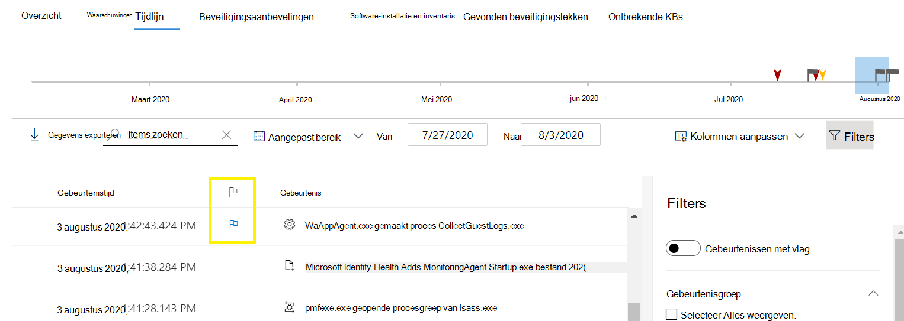
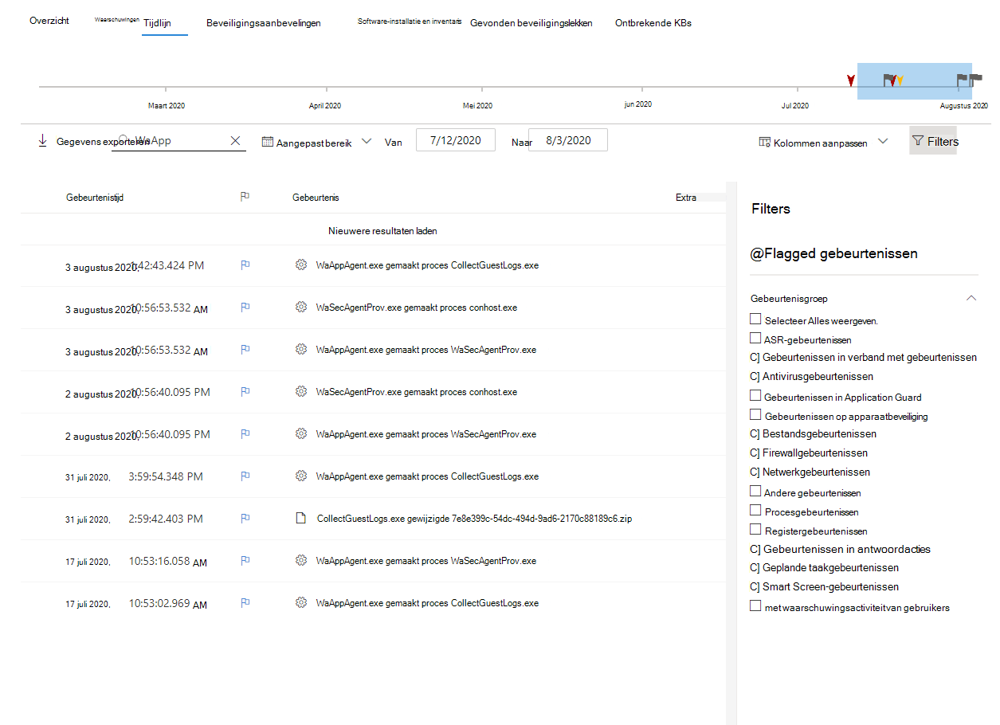

# Gebeurtenisvlaggen van Microsoft Defender voor eindpuntapparaat

[!INCLUDE [Microsoft 365 Defender rebranding](../../includes/microsoft-defender.md)]

**Van toepassing op:**
- [Microsoft Defender voor Endpoint](https://go.microsoft.com/fwlink/p/?linkid=2154037)
- [Microsoft 365 Defender](https://go.microsoft.com/fwlink/?linkid=2118804)

>Wilt u Defender voor Eindpunt ervaren? [Meld u aan voor een gratis proefabonnement.](https://www.microsoft.com/microsoft-365/windows/microsoft-defender-atp?ocid=docs-wdatp-assignaccess-abovefoldlink)

Gebeurtenisvlaggen in de tijdlijn van het Defender for Endpoint-apparaat helpen u specifieke gebeurtenissen te filteren en te organiseren wanneer u mogelijke aanvallen onderzoekt.

De tijdlijn van het Apparaat van Defender voor Eindpunt biedt een chronologische weergave van de gebeurtenissen en bijbehorende waarschuwingen die op een apparaat worden waargenomen. Deze lijst met gebeurtenissen biedt volledige zichtbaarheid in gebeurtenissen, bestanden en IP-adressen die op het apparaat worden waargenomen. De lijst kan soms lang zijn. Gebeurtenisvlaggen van apparaattijdlijn helpen u bij het bijhouden van gebeurtenissen die gerelateerd kunnen zijn. 

Nadat u een apparaattijdlijn hebt doorgetrokken, kunt u de specifieke gebeurtenissen sorteren, filteren en exporteren die u hebt gemarkeerd.

Terwijl u door de tijdlijn van het apparaat navigeert, kunt u zoeken en filteren op specifieke gebeurtenissen. U kunt gebeurtenisvlaggen instellen op: 

- De belangrijkste gebeurtenissen markeren 
- Gebeurtenissen markeren die diep moeten worden gedoken 
- Een tijdlijn voor een schone inbreuk maken

## Een vlag voor een gebeurtenis markeren
1. De gebeurtenis zoeken die u wilt markeren
2. Klik op het vlagpictogram in de kolom Vlag. 

## Gebeurtenissen met vlag weergeven  
1. Schakel in de **sectie Tijdlijnfilters** **gemarkeerde gebeurtenissen in.**
2. Klik op **Toepassen**. Alleen gebeurtenissen met vlag worden weergegeven.
U kunt extra filters toepassen door op de tijdbalk te klikken. Hiermee worden alleen gebeurtenissen vóór de gebeurtenis met vlag weer te geven.  

