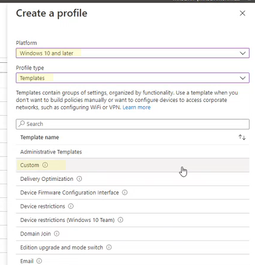

# <a name="enable-attack-surface-reduction-rules"></a><span data-ttu-id="df870-104">Regels voor het verminderen van aanvalsoppervlakken inschakelen</span><span class="sxs-lookup"><span data-stu-id="df870-104">Enable attack surface reduction rules</span></span>

<span data-ttu-id="df870-105">**Van toepassing op:**</span><span class="sxs-lookup"><span data-stu-id="df870-105">**Applies to:**</span></span>

- [<span data-ttu-id="df870-106">Microsoft Defender voor Eindpunt</span><span class="sxs-lookup"><span data-stu-id="df870-106">Microsoft Defender for Endpoint</span></span>](https://go.microsoft.com/fwlink/p/?linkid=2154037)
- [<span data-ttu-id="df870-107">Microsoft 365 Defender</span><span class="sxs-lookup"><span data-stu-id="df870-107">Microsoft 365 Defender</span></span>](https://go.microsoft.com/fwlink/?linkid=2118804)

> [!TIP]
> <span data-ttu-id="df870-108">Wilt u Defender voor Eindpunt ervaren?</span><span class="sxs-lookup"><span data-stu-id="df870-108">Want to experience Defender for Endpoint?</span></span> <span data-ttu-id="df870-109">[Meld u aan voor een gratis proefabonnement.](https://www.microsoft.com/microsoft-365/windows/microsoft-defender-atp?ocid=docs-wdatp-assignaccess-abovefoldlink)</span><span class="sxs-lookup"><span data-stu-id="df870-109">[Sign up for a free trial](https://www.microsoft.com/microsoft-365/windows/microsoft-defender-atp?ocid=docs-wdatp-assignaccess-abovefoldlink).</span></span>

<span data-ttu-id="df870-110">[Asr-regels (Attack Surface Reduction Rules)](attack-surface-reduction.md) helpen voorkomen dat malware vaak misbruik maakt van apparaten en netwerken.</span><span class="sxs-lookup"><span data-stu-id="df870-110">[Attack surface reduction rules](attack-surface-reduction.md) (ASR rules) help prevent actions that malware often abuses to compromise devices and networks.</span></span>

## <a name="requirements"></a><span data-ttu-id="df870-111">Vereisten</span><span class="sxs-lookup"><span data-stu-id="df870-111">Requirements</span></span>

<span data-ttu-id="df870-112">U kunt regels voor de beperking van de surface voor aanvallen instellen voor apparaten met een van de volgende versies en versies van Windows:</span><span class="sxs-lookup"><span data-stu-id="df870-112">You can set attack surface reduction rules for devices that are running any of the following editions and versions of Windows:</span></span>

- <span data-ttu-id="df870-113">Windows 10 Pro, versie [1709](/windows/whats-new/whats-new-windows-10-version-1709) of hoger</span><span class="sxs-lookup"><span data-stu-id="df870-113">Windows 10 Pro, [version 1709](/windows/whats-new/whats-new-windows-10-version-1709) or later</span></span>
- <span data-ttu-id="df870-114">Windows 10 Enterprise, versie [1709](/windows/whats-new/whats-new-windows-10-version-1709) of hoger</span><span class="sxs-lookup"><span data-stu-id="df870-114">Windows 10 Enterprise, [version 1709](/windows/whats-new/whats-new-windows-10-version-1709) or later</span></span>
- <span data-ttu-id="df870-115">Windows Server, [versie 1803 (halfjaarlijks kanaal)](/windows-server/get-started/whats-new-in-windows-server-1803) of hoger</span><span class="sxs-lookup"><span data-stu-id="df870-115">Windows Server, [version 1803 (Semi-Annual Channel)](/windows-server/get-started/whats-new-in-windows-server-1803) or later</span></span>
- [<span data-ttu-id="df870-116">Windows Server 2019</span><span class="sxs-lookup"><span data-stu-id="df870-116">Windows Server 2019</span></span>](/windows-server/get-started-19/whats-new-19)

<span data-ttu-id="df870-117">Hoewel voor de regels voor het verminderen van aanvallen geen [E5-licentie](/windows/deployment/deploy-enterprise-licenses)Windows vereist, krijgt u geavanceerde beheermogelijkheden als u Windows E5 hebt.</span><span class="sxs-lookup"><span data-stu-id="df870-117">Although attack surface reduction rules don't require a [Windows E5 license](/windows/deployment/deploy-enterprise-licenses), if you have Windows E5, you get advanced management capabilities.</span></span> <span data-ttu-id="df870-118">Deze mogelijkheden zijn alleen beschikbaar in Windows E5, zoals monitoring, analyse en werkstromen die beschikbaar zijn in [Defender voor](/microsoft-365/security/defender-endpoint/microsoft-defender-endpoint?view=o365-worldwide&preserve-view=true)Eindpunt, evenals rapportage- en configuratiemogelijkheden in het [Microsoft 365 beveiligingscentrum.](/microsoft-365/security/defender/overview-security-center?view=o365-worldwide&preserve-view=true)</span><span class="sxs-lookup"><span data-stu-id="df870-118">These capabilities available only in Windows E5 include monitoring, analytics, and workflows available in [Defender for Endpoint](/microsoft-365/security/defender-endpoint/microsoft-defender-endpoint?view=o365-worldwide&preserve-view=true), as well as reporting and configuration capabilities in the [Microsoft 365 security center](/microsoft-365/security/defender/overview-security-center?view=o365-worldwide&preserve-view=true).</span></span> <span data-ttu-id="df870-119">Deze geavanceerde mogelijkheden zijn niet beschikbaar met een Windows Professional- of Windows E3-licentie. Als u echter wel over deze licenties hebt, kunt u Gebeurtenisviewer en logboeken Microsoft Defender Antivirus om de gebeurtenissen in de surface reduction rule van uw aanval te bekijken.</span><span class="sxs-lookup"><span data-stu-id="df870-119">These advanced capabilities aren't available with a Windows Professional or Windows E3 license; however, if you do have those licenses, you can use Event Viewer and Microsoft Defender Antivirus logs to review your attack surface reduction rule events.</span></span>

<span data-ttu-id="df870-120">Elke ASR-regel bevat een van de vier instellingen:</span><span class="sxs-lookup"><span data-stu-id="df870-120">Each ASR rule contains one of four settings:</span></span>

- <span data-ttu-id="df870-121">**Niet geconfigureerd:** de ASR-regel uitschakelen</span><span class="sxs-lookup"><span data-stu-id="df870-121">**Not configured**: Disable the ASR rule</span></span>
- <span data-ttu-id="df870-122">**Blokkeren:** De ASR-regel inschakelen</span><span class="sxs-lookup"><span data-stu-id="df870-122">**Block**: Enable the ASR rule</span></span>
- <span data-ttu-id="df870-123">**Controleren:** evalueren hoe de ASR-regel van invloed is op uw organisatie als deze is ingeschakeld</span><span class="sxs-lookup"><span data-stu-id="df870-123">**Audit**: Evaluate how the ASR rule would impact your organization if enabled</span></span>
- <span data-ttu-id="df870-124">**Waarschuwen:** Schakel de ASR-regel in, maar laat de eindgebruiker het blok omzeilen</span><span class="sxs-lookup"><span data-stu-id="df870-124">**Warn**: Enable the ASR rule but allow the end user to bypass the block</span></span>

> [!IMPORTANT]
> <span data-ttu-id="df870-125">Momenteel wordt de waarschuwingsmodus niet ondersteund voor drie ASR-regels wanneer u ASR-regels configureert in Microsoft Endpoint Manager (MEM).</span><span class="sxs-lookup"><span data-stu-id="df870-125">Currently, warn mode is not supported for three ASR rules when you configure ASR rules in Microsoft Endpoint Manager (MEM).</span></span> <span data-ttu-id="df870-126">Zie Gevallen waarin de [waarschuwingsmodus niet wordt ondersteund](attack-surface-reduction.md#cases-where-warn-mode-is-not-supported)voor meer informatie.</span><span class="sxs-lookup"><span data-stu-id="df870-126">To learn more, see [Cases where warn mode is not supported](attack-surface-reduction.md#cases-where-warn-mode-is-not-supported).</span></span>

<span data-ttu-id="df870-127">Het wordt ten zeerste aanbevolen om ASR-regels te gebruiken met een Windows E5-licentie (of soortgelijke licentie-SKU) om te profiteren van de geavanceerde controle- en rapportagemogelijkheden die beschikbaar zijn in [Microsoft Defender](microsoft-defender-endpoint.md) voor Eindpunt (Defender voor Eindpunt).</span><span class="sxs-lookup"><span data-stu-id="df870-127">It's highly recommended to use ASR rules with a Windows E5 license (or similar licensing SKU) to take advantage of the advanced monitoring and reporting capabilities available in [Microsoft Defender for Endpoint](microsoft-defender-endpoint.md) (Defender for Endpoint).</span></span> <span data-ttu-id="df870-128">Als u echter een andere licentie hebt, zoals Windows Professional of Windows E3 die geen geavanceerde controle- en rapportagemogelijkheden bevatten, kunt u uw eigen hulpprogramma's voor monitoring en rapportage ontwikkelen boven op de gebeurtenissen die op elk eindpunt worden gegenereerd wanneer ASR-regels worden geactiveerd (bijvoorbeeld Doorsturen van gebeurtenissen).</span><span class="sxs-lookup"><span data-stu-id="df870-128">However, if you have another license, such as Windows Professional or Windows E3 that don't include advanced monitoring and reporting capabilities, you can develop your own monitoring and reporting tools on top of the events that are generated at each endpoint when ASR rules are triggered (for example, Event Forwarding).</span></span>

> [!TIP]
> <span data-ttu-id="df870-129">Zie Licenties Windows licenties voor meer [Windows 10 Windows](https://www.microsoft.com/licensing/product-licensing/windows10?activetab=windows10-pivot:primaryr5) en ontvang de handleiding [Volumelicenties voor Windows 10.](https://download.microsoft.com/download/2/D/1/2D14FE17-66C2-4D4C-AF73-E122930B60F6/Windows-10-Volume-Licensing-Guide.pdf)</span><span class="sxs-lookup"><span data-stu-id="df870-129">To learn more about Windows licensing, see [Windows 10 Licensing](https://www.microsoft.com/licensing/product-licensing/windows10?activetab=windows10-pivot:primaryr5) and get the [Volume Licensing guide for Windows 10](https://download.microsoft.com/download/2/D/1/2D14FE17-66C2-4D4C-AF73-E122930B60F6/Windows-10-Volume-Licensing-Guide.pdf).</span></span>

<span data-ttu-id="df870-130">U kunt regels voor het verminderen van de surface van aanvallen inschakelen met behulp van een van deze methoden:</span><span class="sxs-lookup"><span data-stu-id="df870-130">You can enable attack surface reduction rules by using any of these methods:</span></span>

- [<span data-ttu-id="df870-131">Microsoft Intune</span><span class="sxs-lookup"><span data-stu-id="df870-131">Microsoft Intune</span></span>](#intune)
- [<span data-ttu-id="df870-132">Mobile Device Management (MDM)</span><span class="sxs-lookup"><span data-stu-id="df870-132">Mobile Device Management (MDM)</span></span>](#mdm)
- [<span data-ttu-id="df870-133">Microsoft Endpoint Configuration Manager</span><span class="sxs-lookup"><span data-stu-id="df870-133">Microsoft Endpoint Configuration Manager</span></span>](#microsoft-endpoint-configuration-manager)
- [<span data-ttu-id="df870-134">Groepsbeleid</span><span class="sxs-lookup"><span data-stu-id="df870-134">Group Policy</span></span>](#group-policy)
- [<span data-ttu-id="df870-135">PowerShell</span><span class="sxs-lookup"><span data-stu-id="df870-135">PowerShell</span></span>](#powershell)

<span data-ttu-id="df870-136">Beheer op ondernemingsniveau, zoals Intune of Microsoft Endpoint Manager wordt aanbevolen.</span><span class="sxs-lookup"><span data-stu-id="df870-136">Enterprise-level management such as Intune or Microsoft Endpoint Manager is recommended.</span></span> <span data-ttu-id="df870-137">Ondernemingsbeheer overschrijft alle conflicterende groepsbeleids- of PowerShell-instellingen bij het opstarten.</span><span class="sxs-lookup"><span data-stu-id="df870-137">Enterprise-level management will overwrite any conflicting Group Policy or PowerShell settings on startup.</span></span>

## <a name="exclude-files-and-folders-from-asr-rules"></a><span data-ttu-id="df870-138">Bestanden en mappen uitsluiten van ASR-regels</span><span class="sxs-lookup"><span data-stu-id="df870-138">Exclude files and folders from ASR rules</span></span>

<span data-ttu-id="df870-139">U kunt voorkomen dat bestanden en mappen worden geëvalueerd door de meeste regels voor het verminderen van het oppervlak van de aanval.</span><span class="sxs-lookup"><span data-stu-id="df870-139">You can exclude files and folders from being evaluated by most attack surface reduction rules.</span></span> <span data-ttu-id="df870-140">Dit betekent dat zelfs als een ASR-regel bepaalt dat het bestand of de map schadelijk gedrag bevat, het bestand niet wordt uitgevoerd.</span><span class="sxs-lookup"><span data-stu-id="df870-140">This means that even if an ASR rule determines the file or folder contains malicious behavior, it will not block the file from running.</span></span> <span data-ttu-id="df870-141">Hierdoor kunnen onveilige bestanden mogelijk worden uitgevoerd en uw apparaten kunnen worden geïnfecteerd.</span><span class="sxs-lookup"><span data-stu-id="df870-141">This could potentially allow unsafe files to run and infect your devices.</span></span>

<span data-ttu-id="df870-142">U kunt asr-regels ook uitsluiten van triggering op basis van certificaat- en bestandshashes door opgegeven Defender voor eindpuntbestands- en certificaatindicatoren toe te staan.</span><span class="sxs-lookup"><span data-stu-id="df870-142">You can also exclude ASR rules from triggering based on certificate and file hashes by allowing specified Defender for Endpoint file and certificate indicators.</span></span> <span data-ttu-id="df870-143">(Zie [Indicatoren beheren](manage-indicators.md).)</span><span class="sxs-lookup"><span data-stu-id="df870-143">(See [Manage indicators](manage-indicators.md).)</span></span>

> [!IMPORTANT]
> <span data-ttu-id="df870-144">Het uitsluiten van bestanden of mappen kan de beveiliging die door ASR-regels wordt geboden, aanzienlijk verminderen.</span><span class="sxs-lookup"><span data-stu-id="df870-144">Excluding files or folders can severely reduce the protection provided by ASR rules.</span></span> <span data-ttu-id="df870-145">Uitgesloten bestanden mogen worden uitgevoerd en er wordt geen rapport of gebeurtenis opgenomen.</span><span class="sxs-lookup"><span data-stu-id="df870-145">Excluded files will be allowed to run, and no report or event will be recorded.</span></span>
> <span data-ttu-id="df870-146">Als asr-regels bestanden detecteren die volgens u niet moeten worden gedetecteerd, moet u eerst de auditmodus gebruiken om de [regel te testen.](evaluate-attack-surface-reduction.md)</span><span class="sxs-lookup"><span data-stu-id="df870-146">If ASR rules are detecting files that you believe shouldn't be detected, you should [use audit mode first to test the rule](evaluate-attack-surface-reduction.md).</span></span>

<span data-ttu-id="df870-147">U kunt afzonderlijke bestanden of mappen opgeven (met behulp van mappaden of volledig gekwalificeerde resourcenamen), maar u kunt niet opgeven op welke regels de uitsluitingen van toepassing zijn.</span><span class="sxs-lookup"><span data-stu-id="df870-147">You can specify individual files or folders (using folder paths or fully qualified resource names), but you can't specify which rules the exclusions apply to.</span></span> <span data-ttu-id="df870-148">Een uitsluiting wordt alleen toegepast wanneer de uitgesloten toepassing of service wordt gestart.</span><span class="sxs-lookup"><span data-stu-id="df870-148">An exclusion is applied only when the excluded application or service starts.</span></span> <span data-ttu-id="df870-149">Als u bijvoorbeeld een uitsluiting toevoegt voor een updateservice die al wordt uitgevoerd, blijft de updateservice gebeurtenissen activeren totdat de service is gestopt en opnieuw wordt gestart.</span><span class="sxs-lookup"><span data-stu-id="df870-149">For example, if you add an exclusion for an update service that is already running, the update service will continue to trigger events until the service is stopped and restarted.</span></span>

<span data-ttu-id="df870-150">ASR-regels ondersteunen omgevingsvariabelen en jokertekens.</span><span class="sxs-lookup"><span data-stu-id="df870-150">ASR rules support environment variables and wildcards.</span></span> <span data-ttu-id="df870-151">Zie Jokertekens gebruiken in de lijsten met bestandsnaam en mappenpad of uitbreidingsuitsluiting voor informatie over het gebruik [van jokertekens.](configure-extension-file-exclusions-microsoft-defender-antivirus.md#use-wildcards-in-the-file-name-and-folder-path-or-extension-exclusion-lists)</span><span class="sxs-lookup"><span data-stu-id="df870-151">For information about using wildcards, see [Use wildcards in the file name and folder path or extension exclusion lists](configure-extension-file-exclusions-microsoft-defender-antivirus.md#use-wildcards-in-the-file-name-and-folder-path-or-extension-exclusion-lists).</span></span>

<span data-ttu-id="df870-152">De volgende procedures voor het inschakelen van ASR-regels bevatten instructies voor het uitsluiten van bestanden en mappen.</span><span class="sxs-lookup"><span data-stu-id="df870-152">The following procedures for enabling ASR rules include instructions for how to exclude files and folders.</span></span>

## <a name="intune"></a><span data-ttu-id="df870-153">Intune</span><span class="sxs-lookup"><span data-stu-id="df870-153">Intune</span></span>

1. <span data-ttu-id="df870-154">Selecteer **Apparaatconfiguratieprofielen.**  >  </span><span class="sxs-lookup"><span data-stu-id="df870-154">Select **Device configuration** > **Profiles**.</span></span> <span data-ttu-id="df870-155">Kies een bestaand eindpuntbeveiligingsprofiel of maak een nieuw profiel.</span><span class="sxs-lookup"><span data-stu-id="df870-155">Choose an existing endpoint protection profile or create a new one.</span></span> <span data-ttu-id="df870-156">Als u een nieuw profiel wilt maken, **selecteert u Profiel maken** en voert u informatie voor dit profiel in.</span><span class="sxs-lookup"><span data-stu-id="df870-156">To create a new one, select **Create profile** and enter information for this profile.</span></span> <span data-ttu-id="df870-157">Selecteer **Voor profieltype** de optie **Eindpuntbeveiliging.**</span><span class="sxs-lookup"><span data-stu-id="df870-157">For **Profile type**, select **Endpoint protection**.</span></span> <span data-ttu-id="df870-158">Als u een bestaand profiel hebt gekozen, **selecteert** u Eigenschappen en selecteert u **Instellingen.**</span><span class="sxs-lookup"><span data-stu-id="df870-158">If you've chosen an existing profile, select **Properties** and then select **Settings**.</span></span>

2. <span data-ttu-id="df870-159">Selecteer in **het deelvenster Endpoint-beveiliging** **Windows Defender Exploit Guard** en selecteer vervolgens Attack Surface **Reduction.**</span><span class="sxs-lookup"><span data-stu-id="df870-159">In the **Endpoint protection** pane, select **Windows Defender Exploit Guard**, then select **Attack Surface Reduction**.</span></span> <span data-ttu-id="df870-160">Selecteer de gewenste instelling voor elke ASR-regel.</span><span class="sxs-lookup"><span data-stu-id="df870-160">Select the desired setting for each ASR rule.</span></span>

3. <span data-ttu-id="df870-161">Voer **onder Attack Surface Reduction uitzonderingen** afzonderlijke bestanden en mappen in.</span><span class="sxs-lookup"><span data-stu-id="df870-161">Under **Attack Surface Reduction exceptions**, enter individual files and folders.</span></span> <span data-ttu-id="df870-162">U kunt ook Importeren **selecteren om** een CSV-bestand te importeren dat bestanden en mappen bevat om uit te sluiten van ASR-regels.</span><span class="sxs-lookup"><span data-stu-id="df870-162">You can also select **Import** to import a CSV file that contains files and folders to exclude from ASR rules.</span></span> <span data-ttu-id="df870-163">Elke regel in het CSV-bestand moet als volgt worden opgemaakt:</span><span class="sxs-lookup"><span data-stu-id="df870-163">Each line in the CSV file should be formatted as follows:</span></span>

   <span data-ttu-id="df870-164">`C:\folder`, `%ProgramFiles%\folder\file`, `C:\path`</span><span class="sxs-lookup"><span data-stu-id="df870-164">`C:\folder`, `%ProgramFiles%\folder\file`, `C:\path`</span></span>

4. <span data-ttu-id="df870-165">Selecteer **OK** in de drie configuratievensters.</span><span class="sxs-lookup"><span data-stu-id="df870-165">Select **OK** on the three configuration panes.</span></span> <span data-ttu-id="df870-166">Selecteer vervolgens **Maken** als u een nieuw eindpuntbeveiligingsbestand maakt of **Opslaan** als u een bestaand bestand bewerkt.</span><span class="sxs-lookup"><span data-stu-id="df870-166">Then select **Create** if you're creating a new endpoint protection file or **Save** if you're editing an existing one.</span></span>

## <a name="mem"></a><span data-ttu-id="df870-167">MEM</span><span class="sxs-lookup"><span data-stu-id="df870-167">MEM</span></span>

<span data-ttu-id="df870-168">U kunt de Microsoft Endpoint Manager OMA-URI (MEM) gebruiken om aangepaste ASR-regels te configureren.</span><span class="sxs-lookup"><span data-stu-id="df870-168">You can use Microsoft Endpoint Manager (MEM) OMA-URI to configure custom ASR rules.</span></span> <span data-ttu-id="df870-169">In de volgende procedure wordt de regel [Misbruik van misbruikte, kwetsbare ondertekende stuurprogramma's voor](attack-surface-reduction.md#block-abuse-of-exploited-vulnerable-signed-drivers) het voorbeeld geblokkeerd.</span><span class="sxs-lookup"><span data-stu-id="df870-169">The following procedure uses the rule [Block abuse of exploited vulnerable signed drivers](attack-surface-reduction.md#block-abuse-of-exploited-vulnerable-signed-drivers) for the example.</span></span>

1. <span data-ttu-id="df870-170">Open het Microsoft Endpoint Manager (MEM)-beheercentrum.</span><span class="sxs-lookup"><span data-stu-id="df870-170">Open the Microsoft Endpoint Manager (MEM) admin center.</span></span> <span data-ttu-id="df870-171">Klik in **het** menu Start op **Apparaten,** selecteer **Configuratieprofiel** en klik vervolgens **op Profiel maken.**</span><span class="sxs-lookup"><span data-stu-id="df870-171">In the **Home** menu, click  **Devices**, select **Configuration profile**, and then click **Create profile**.</span></span>

   > [!div class="mx-imgBorder"]
   > <span data-ttu-id="df870-172"></span><span class="sxs-lookup"><span data-stu-id="df870-172"></span></span>

2. <span data-ttu-id="df870-173">Selecteer **in Een profiel maken** in de volgende twee vervolgkeuzelijsten de volgende opties:</span><span class="sxs-lookup"><span data-stu-id="df870-173">In **Create a profile**, in the following two drop-down lists, select the following:</span></span>

   - <span data-ttu-id="df870-174">Selecteer **in Platform** de Windows 10 en **hoger**</span><span class="sxs-lookup"><span data-stu-id="df870-174">In **Platform**, select **Windows 10 and later**</span></span>
   - <span data-ttu-id="df870-175">Selecteer **Sjablonen in** **profieltype**</span><span class="sxs-lookup"><span data-stu-id="df870-175">In **Profile type**, select **Templates**</span></span>

   <span data-ttu-id="df870-176">Selecteer **Aangepast** en klik vervolgens op **Maken.**</span><span class="sxs-lookup"><span data-stu-id="df870-176">Select **Custom**, and then click **Create**.</span></span>

   > [!div class="mx-imgBorder"]
   > <span data-ttu-id="df870-177"></span><span class="sxs-lookup"><span data-stu-id="df870-177"></span></span>

3. <span data-ttu-id="df870-178">Het hulpprogramma Aangepaste sjabloon wordt geopend voor stap **1 Basisbeginselen.**</span><span class="sxs-lookup"><span data-stu-id="df870-178">The Custom template tool opens to step **1 Basics**.</span></span> <span data-ttu-id="df870-179">Typ **in 1** Basisbeginselen in **Naam** een naam voor uw sjabloon en in **Beschrijving** kunt u een beschrijving typen (optioneel).</span><span class="sxs-lookup"><span data-stu-id="df870-179">In **1 Basics**, in **Name**, type a name for your template, and in **Description** you can type a description (optional).</span></span>

   > [!div class="mx-imgBorder"]
   > <span data-ttu-id="df870-180"></span><span class="sxs-lookup"><span data-stu-id="df870-180"></span></span>

4. <span data-ttu-id="df870-181">Klik op **Volgende**.</span><span class="sxs-lookup"><span data-stu-id="df870-181">Click **Next**.</span></span> <span data-ttu-id="df870-182">Stap **2 Configuratie-instellingen** worden geopend.</span><span class="sxs-lookup"><span data-stu-id="df870-182">Step **2 Configuration settings** opens.</span></span> <span data-ttu-id="df870-183">Klik voor OMA-URI-Instellingen op **Toevoegen.**</span><span class="sxs-lookup"><span data-stu-id="df870-183">For OMA-URI Settings, click **Add**.</span></span> <span data-ttu-id="df870-184">Er worden nu twee opties weergegeven: **Toevoegen** en **exporteren.**</span><span class="sxs-lookup"><span data-stu-id="df870-184">Two options now appear: **Add** and **Export**.</span></span>

   > [!div class="mx-imgBorder"]
   > <span data-ttu-id="df870-185"></span><span class="sxs-lookup"><span data-stu-id="df870-185"></span></span>

5. <span data-ttu-id="df870-186">Klik **nogmaals op** Toevoegen.</span><span class="sxs-lookup"><span data-stu-id="df870-186">Click **Add** again.</span></span> <span data-ttu-id="df870-187">De **oma-URI-Instellingen** toevoegen wordt geopend.</span><span class="sxs-lookup"><span data-stu-id="df870-187">The **Add Row OMA-URI Settings** opens.</span></span> <span data-ttu-id="df870-188">Ga **als volgt te** werk in Rij toevoegen:</span><span class="sxs-lookup"><span data-stu-id="df870-188">In **Add Row**, do the following:</span></span>

   - <span data-ttu-id="df870-189">Typ **in Naam** een naam voor de regel.</span><span class="sxs-lookup"><span data-stu-id="df870-189">In **Name**, type a name for the rule.</span></span>
   - <span data-ttu-id="df870-190">Typ **in Beschrijving** een korte beschrijving.</span><span class="sxs-lookup"><span data-stu-id="df870-190">In **Description**, type a brief description.</span></span>
   - <span data-ttu-id="df870-191">Typ **of plak in OMA-URI** de specifieke OMA-URI-koppeling voor de regel die u toevoegt.</span><span class="sxs-lookup"><span data-stu-id="df870-191">In **OMA-URI**, type or paste the specific OMA-URI link for the rule that you are adding.</span></span>
   - <span data-ttu-id="df870-192">Selecteer **tekenreeks** in **gegevenstype**.</span><span class="sxs-lookup"><span data-stu-id="df870-192">In **Data type**, select **String**.</span></span>
   - <span data-ttu-id="df870-193">Typ **of** plak in Waarde de GUID-waarde, het teken en de statuswaarde zonder \= spaties _(GUID=StateValue)._</span><span class="sxs-lookup"><span data-stu-id="df870-193">In **Value**, type or paste the GUID value, the \= sign and the State value with no spaces (_GUID=StateValue_).</span></span> <span data-ttu-id="df870-194">Waar: {0 : Disable (Disable the ASR rule)}, {1 : Block (Enable the ASR rule)}, {2 : Audit (Evaluate how the ASR rule would impact your organization if enabled)}, {6 : Warn (Enable the ASR rule but allow the end-user to bypass the block)}</span><span class="sxs-lookup"><span data-stu-id="df870-194">Where: {0 : Disable (Disable the ASR rule)}, {1 : Block (Enable the ASR rule)}, {2 : Audit (Evaluate how the ASR rule would impact your organization if enabled)}, {6 : Warn (Enable the ASR rule but allow the end-user to bypass the block)}</span></span>

   > [!div class="mx-imgBorder"]
   > <span data-ttu-id="df870-195"></span><span class="sxs-lookup"><span data-stu-id="df870-195"></span></span>

6. <span data-ttu-id="df870-196">Klik op **Opslaan**.</span><span class="sxs-lookup"><span data-stu-id="df870-196">Click **Save**.</span></span> <span data-ttu-id="df870-197">**Rij sluiten** toevoegen.</span><span class="sxs-lookup"><span data-stu-id="df870-197">**Add Row** closes.</span></span> <span data-ttu-id="df870-198">Klik **in Aangepast** op **Volgende.**</span><span class="sxs-lookup"><span data-stu-id="df870-198">In **Custom**, click **Next**.</span></span> <span data-ttu-id="df870-199">In stap **3 Bereiklabels** zijn bereiklabels optioneel.</span><span class="sxs-lookup"><span data-stu-id="df870-199">In step **3 Scope tags**, scope tags are optional.</span></span> <span data-ttu-id="df870-200">Voer een van de volgende handelingen uit:</span><span class="sxs-lookup"><span data-stu-id="df870-200">Do one of the following:</span></span>

   - <span data-ttu-id="df870-201">Klik **op Bereiklabels** selecteren, selecteer de bereiktag (optioneel) en klik vervolgens op **Volgende.**</span><span class="sxs-lookup"><span data-stu-id="df870-201">Click **Select Scope tags**, select the scope tag (optional) and then click **Next**.</span></span>
   - <span data-ttu-id="df870-202">Of klik op **Volgende**</span><span class="sxs-lookup"><span data-stu-id="df870-202">Or click **Next**</span></span>

7. <span data-ttu-id="df870-203">Selecteer in stap **4 Toewijzingen** **,** in Opgenomen groepen - voor de groepen die u wilt toepassen op deze regel- een van de volgende opties:</span><span class="sxs-lookup"><span data-stu-id="df870-203">In step **4 Assignments**, in **Included Groups** - for the groups that you want this rule to apply - select from the following options:</span></span>

   - <span data-ttu-id="df870-204">**Groepen toevoegen**</span><span class="sxs-lookup"><span data-stu-id="df870-204">**Add groups**</span></span>
   - <span data-ttu-id="df870-205">**Alle gebruikers toevoegen**</span><span class="sxs-lookup"><span data-stu-id="df870-205">**Add all users**</span></span>
   - <span data-ttu-id="df870-206">**Alle apparaten toevoegen**</span><span class="sxs-lookup"><span data-stu-id="df870-206">**Add all devices**</span></span>

   > [!div class="mx-imgBorder"]
   > <span data-ttu-id="df870-207"></span><span class="sxs-lookup"><span data-stu-id="df870-207"></span></span>

8. <span data-ttu-id="df870-208">Selecteer **in Uitgesloten groepen** alle groepen die u van deze regel wilt uitsluiten en klik vervolgens op **Volgende.**</span><span class="sxs-lookup"><span data-stu-id="df870-208">In **Excluded groups**, select any groups that you want to exclude from this rule, and then click **Next**.</span></span>

9. <span data-ttu-id="df870-209">Ga als volgt te werk in stap **5** Toepassingsregels voor de volgende instellingen:</span><span class="sxs-lookup"><span data-stu-id="df870-209">In step **5 Applicability Rules** for the following settings, do the following:</span></span>

   - <span data-ttu-id="df870-210">Selecteer **in** Regel profiel toewijzen **als** of Profiel niet **toewijzen als**</span><span class="sxs-lookup"><span data-stu-id="df870-210">In **Rule**, select either **Assign profile if**, or **Don’t assign profile if**</span></span>
   - <span data-ttu-id="df870-211">Selecteer **in Eigenschap** de eigenschap waarop u deze regel wilt toepassen</span><span class="sxs-lookup"><span data-stu-id="df870-211">In **Property**, select the property to which you want this rule to apply</span></span>
   - <span data-ttu-id="df870-212">Voer **in Waarde** de toepasselijke waarde of het waardebereik in</span><span class="sxs-lookup"><span data-stu-id="df870-212">In **Value**, enter the applicable value or value range</span></span>

   > [!div class="mx-imgBorder"]
   > <span data-ttu-id="df870-213"></span><span class="sxs-lookup"><span data-stu-id="df870-213"></span></span>

10. <span data-ttu-id="df870-214">Klik op **Volgende**.</span><span class="sxs-lookup"><span data-stu-id="df870-214">Click **Next**.</span></span> <span data-ttu-id="df870-215">Controleer in **stap 6 Controleren + maken** de instellingen en informatie die u hebt geselecteerd en ingevoerd en klik vervolgens op **Maken.**</span><span class="sxs-lookup"><span data-stu-id="df870-215">In step **6 Review + create**, review the settings and information you have selected and entered, and then click **Create**.</span></span>

    > [!div class="mx-imgBorder"]
    > <span data-ttu-id="df870-216"></span><span class="sxs-lookup"><span data-stu-id="df870-216"></span></span>

    > [!NOTE]
    > <span data-ttu-id="df870-217">Regels zijn actief en leven binnen enkele minuten.</span><span class="sxs-lookup"><span data-stu-id="df870-217">Rules are active and live within minutes.</span></span>

>[!NOTE]
> <span data-ttu-id="df870-218">Conflictafhandeling:</span><span class="sxs-lookup"><span data-stu-id="df870-218">Conflict handling:</span></span>
>
> <span data-ttu-id="df870-219">Als u een apparaat twee verschillende ASR-beleidsregels toewijst, is de manier waarop conflicten worden afgehandeld regels die verschillende staten zijn toegewezen, is er geen conflictbeheer en is het resultaat een fout.</span><span class="sxs-lookup"><span data-stu-id="df870-219">If you assign a device two different ASR policies, the way conflict is handled is rules that are assigned different states, there is no conflict management in place, and the result is an error.</span></span>
>
> <span data-ttu-id="df870-220">Niet-conflicterende regels leiden niet tot een fout en de regel wordt correct toegepast.</span><span class="sxs-lookup"><span data-stu-id="df870-220">Non-conflicting rules will not result in an error, and the rule will be applied correctly.</span></span> <span data-ttu-id="df870-221">Het resultaat is dat de eerste regel wordt toegepast en dat de volgende niet-conflicterende regels worden samengevoegd in het beleid.</span><span class="sxs-lookup"><span data-stu-id="df870-221">The result is that the first rule is applied, and subsequent non-conflicting rules are merged into the policy.</span></span>

## <a name="mdm"></a><span data-ttu-id="df870-222">MDM</span><span class="sxs-lookup"><span data-stu-id="df870-222">MDM</span></span>

<span data-ttu-id="df870-223">Gebruik [de configuratieserviceprovider ./Vendor/MSFT/Policy/Config/Defender/AttackSurfaceReductionRules](/windows/client-management/mdm/policy-csp-defender#defender-attacksurfacereductionrules) (CSP) om de modus voor elke regel afzonderlijk in te schakelen en in te stellen.</span><span class="sxs-lookup"><span data-stu-id="df870-223">Use the [./Vendor/MSFT/Policy/Config/Defender/AttackSurfaceReductionRules](/windows/client-management/mdm/policy-csp-defender#defender-attacksurfacereductionrules) configuration service provider (CSP) to individually enable and set the mode for each rule.</span></span>

<span data-ttu-id="df870-224">Hieronder volgt een voorbeeld voor verwijzing, met [GUID-waarden voor ASR-regels.](attack-surface-reduction.md#attack-surface-reduction-rules)</span><span class="sxs-lookup"><span data-stu-id="df870-224">The following is a sample for reference, using [GUID values for ASR rules](attack-surface-reduction.md#attack-surface-reduction-rules).</span></span>

`OMA-URI path: ./Vendor/MSFT/Policy/Config/Defender/AttackSurfaceReductionRules`

`Value: 75668C1F-73B5-4CF0-BB93-3ECF5CB7CC84=2|3B576869-A4EC-4529-8536-B80A7769E899=1|D4F940AB-401B-4EfC-AADC-AD5F3C50688A=2|D3E037E1-3EB8-44C8-A917-57927947596D=1|5BEB7EFE-FD9A-4556-801D-275E5FFC04CC=0|BE9BA2D9-53EA-4CDC-84E5-9B1EEEE46550=1`

<span data-ttu-id="df870-225">De waarden die u wilt inschakelen (blokkeren), uitschakelen, waarschuwen of inschakelen in de auditmodus zijn:</span><span class="sxs-lookup"><span data-stu-id="df870-225">The values to enable (Block), disable, warn, or enable in audit mode are:</span></span>

- <span data-ttu-id="df870-226">0 : Uitschakelen (de ASR-regel uitschakelen)</span><span class="sxs-lookup"><span data-stu-id="df870-226">0 : Disable (Disable the ASR rule)</span></span>
- <span data-ttu-id="df870-227">1 : Blokkeren (asr-regel inschakelen)</span><span class="sxs-lookup"><span data-stu-id="df870-227">1 : Block (Enable the ASR rule)</span></span>
- <span data-ttu-id="df870-228">2 : Controleren (evalueren hoe de ASR-regel van invloed is op uw organisatie als deze is ingeschakeld)</span><span class="sxs-lookup"><span data-stu-id="df870-228">2 : Audit (Evaluate how the ASR rule would impact your organization if enabled)</span></span>
- <span data-ttu-id="df870-229">6 : Waarschuwen (Schakel de ASR-regel in, maar laat de eindgebruiker het blok omzeilen).</span><span class="sxs-lookup"><span data-stu-id="df870-229">6 : Warn  (Enable the ASR rule but allow the end-user to bypass the block).</span></span> <span data-ttu-id="df870-230">De waarschuwingsmodus is nu beschikbaar voor de meeste ASR-regels.</span><span class="sxs-lookup"><span data-stu-id="df870-230">Warn mode is now available for most of the ASR rules.</span></span>

<span data-ttu-id="df870-231">Gebruik [de CSP (Vendor/MSFT/Policy/Config/Defender/AttackSurfaceReductionOnlyExclusions](/windows/client-management/mdm/policy-csp-defender#defender-attacksurfacereductiononlyexclusions) configuration service provider) om uitsluitingen toe te voegen.</span><span class="sxs-lookup"><span data-stu-id="df870-231">Use the [./Vendor/MSFT/Policy/Config/Defender/AttackSurfaceReductionOnlyExclusions](/windows/client-management/mdm/policy-csp-defender#defender-attacksurfacereductiononlyexclusions) configuration service provider (CSP) to add exclusions.</span></span>

<span data-ttu-id="df870-232">Voorbeeld:</span><span class="sxs-lookup"><span data-stu-id="df870-232">Example:</span></span>

`OMA-URI path: ./Vendor/MSFT/Policy/Config/Defender/AttackSurfaceReductionOnlyExclusions`

`Value: c:\path|e:\path|c:\Exclusions.exe`

> [!NOTE]
> <span data-ttu-id="df870-233">Zorg ervoor dat u OMA-URI-waarden zonder spaties typt.</span><span class="sxs-lookup"><span data-stu-id="df870-233">Be sure to enter OMA-URI values without spaces.</span></span>

## <a name="microsoft-endpoint-configuration-manager"></a><span data-ttu-id="df870-234">Microsoft Endpoint Configuration Manager</span><span class="sxs-lookup"><span data-stu-id="df870-234">Microsoft Endpoint Configuration Manager</span></span>

1. <span data-ttu-id="df870-235">Ga Microsoft Endpoint Configuration Manager naar Assets **and Compliance**  >  **Endpoint Protection**  >  **Windows Defender Exploit Guard**.</span><span class="sxs-lookup"><span data-stu-id="df870-235">In Microsoft Endpoint Configuration Manager, go to **Assets and Compliance** > **Endpoint Protection** > **Windows Defender Exploit Guard**.</span></span>

2. <span data-ttu-id="df870-236">Selecteer **Home**  >  **Create Exploit Guard Policy**.</span><span class="sxs-lookup"><span data-stu-id="df870-236">Select **Home** > **Create Exploit Guard Policy**.</span></span>

3. <span data-ttu-id="df870-237">Voer een naam en een beschrijving in, selecteer **Attack Surface Reduction** en selecteer **Volgende**.</span><span class="sxs-lookup"><span data-stu-id="df870-237">Enter a name and a description, select **Attack Surface Reduction**, and select **Next**.</span></span>

4. <span data-ttu-id="df870-238">Kies welke regels acties blokkeren of controleren en selecteer **Volgende.**</span><span class="sxs-lookup"><span data-stu-id="df870-238">Choose which rules will block or audit actions and select **Next**.</span></span>

5. <span data-ttu-id="df870-239">Controleer de instellingen en selecteer **Volgende om** het beleid te maken.</span><span class="sxs-lookup"><span data-stu-id="df870-239">Review the settings and select **Next** to create the policy.</span></span>

6. <span data-ttu-id="df870-240">Nadat het beleid is gemaakt, **sluit u**.</span><span class="sxs-lookup"><span data-stu-id="df870-240">After the policy is created, **Close**.</span></span>

## <a name="group-policy"></a><span data-ttu-id="df870-241">Groepsbeleid</span><span class="sxs-lookup"><span data-stu-id="df870-241">Group Policy</span></span>

> [!WARNING]
> <span data-ttu-id="df870-242">Als u uw computers en apparaten beheert met Intune, Configuration Manager of een ander beheerplatform op ondernemingsniveau, overschrijft de beheersoftware eventuele conflicterende instellingen voor groepsbeleid bij het opstarten.</span><span class="sxs-lookup"><span data-stu-id="df870-242">If you manage your computers and devices with Intune, Configuration Manager, or other enterprise-level management platform, the management software will overwrite any conflicting Group Policy settings on startup.</span></span>

1. <span data-ttu-id="df870-243">Open op uw computer voor groepsbeleidsbeheer de [Groepsbeleidsbeheerconsole](https://technet.microsoft.com/library/cc731212.aspx), klik met de rechtermuisknop op het groepsbeleidsobject dat u wilt configureren en selecteer **Bewerken**.</span><span class="sxs-lookup"><span data-stu-id="df870-243">On your Group Policy management computer, open the [Group Policy Management Console](https://technet.microsoft.com/library/cc731212.aspx), right-click the Group Policy Object you want to configure and select **Edit**.</span></span>

2. <span data-ttu-id="df870-244">Ga in de **Groepsbeleidsbeheereditor** naar **Computerconfiguratie** en selecteer **Beheersjablonen**.</span><span class="sxs-lookup"><span data-stu-id="df870-244">In the **Group Policy Management Editor**, go to **Computer configuration** and select **Administrative templates**.</span></span>

3. <span data-ttu-id="df870-245">Vouw de structuur uit Windows **onderdelen**  >  **Microsoft Defender Antivirus**  >  **Microsoft Defender Exploit Guard**  >  **Attack surface reduction**.</span><span class="sxs-lookup"><span data-stu-id="df870-245">Expand the tree to **Windows components** > **Microsoft Defender Antivirus** > **Microsoft Defender Exploit Guard** > **Attack surface reduction**.</span></span>

4. <span data-ttu-id="df870-246">Selecteer **Aanvalsoppervlakbeperkingsregels configureren** en selecteer **Ingeschakeld.**</span><span class="sxs-lookup"><span data-stu-id="df870-246">Select **Configure Attack surface reduction rules** and select **Enabled**.</span></span> <span data-ttu-id="df870-247">Vervolgens kunt u de afzonderlijke status voor elke regel instellen in de sectie Opties.</span><span class="sxs-lookup"><span data-stu-id="df870-247">You can then set the individual state for each rule in the options section.</span></span>

   <span data-ttu-id="df870-248">Selecteer **Toon...** en voer de regel-id in de kolom **Waardenaam** en de door u gekozen status in de **kolom** Waarde als volgt in:</span><span class="sxs-lookup"><span data-stu-id="df870-248">Select **Show...** and enter the rule ID in the **Value name** column and your chosen state in the **Value** column as follows:</span></span>

   - <span data-ttu-id="df870-249">0 : Uitschakelen (de ASR-regel uitschakelen)</span><span class="sxs-lookup"><span data-stu-id="df870-249">0 : Disable (Disable the ASR rule)</span></span>
   - <span data-ttu-id="df870-250">1 : Blokkeren (asr-regel inschakelen)</span><span class="sxs-lookup"><span data-stu-id="df870-250">1 : Block (Enable the ASR rule)</span></span>
   - <span data-ttu-id="df870-251">2 : Controleren (evalueren hoe de ASR-regel van invloed is op uw organisatie als deze is ingeschakeld)</span><span class="sxs-lookup"><span data-stu-id="df870-251">2 : Audit (Evaluate how the ASR rule would impact your organization if enabled)</span></span>
   - <span data-ttu-id="df870-252">6 : Waarschuwen (Schakel de ASR-regel in, maar laat de eindgebruiker het blok omzeilen)</span><span class="sxs-lookup"><span data-stu-id="df870-252">6 : Warn  (Enable the ASR rule but allow the end-user to bypass the block)</span></span>

   :::image type="content" source="images/asr-rules-gp.png" alt-text="ASR-regels in groepsbeleid":::

5. <span data-ttu-id="df870-254">Als u bestanden en mappen wilt uitsluiten van ASR-regels, selecteert u de instelling Bestanden en paden uitsluiten van de instelling Surface **Reduction** Attack en stelt u de optie **in op Ingeschakeld.**</span><span class="sxs-lookup"><span data-stu-id="df870-254">To exclude files and folders from ASR rules, select the **Exclude files and paths from Attack surface reduction rules** setting and set the option to **Enabled**.</span></span> <span data-ttu-id="df870-255">Selecteer **Weergeven** en voer elk bestand of elke map in de kolom **Waardenaam** in.</span><span class="sxs-lookup"><span data-stu-id="df870-255">Select **Show** and enter each file or folder in the **Value name** column.</span></span> <span data-ttu-id="df870-256">Voer **0** in de kolom **Waarde** in voor elk item.</span><span class="sxs-lookup"><span data-stu-id="df870-256">Enter **0** in the **Value** column for each item.</span></span>

   > [!WARNING]
   > <span data-ttu-id="df870-257">Gebruik geen aanhalingstekens omdat deze niet worden ondersteund voor de kolom **Waardenaam** of **Waarde.**</span><span class="sxs-lookup"><span data-stu-id="df870-257">Do not use quotes as they are not supported for either the **Value name** column or the **Value** column.</span></span>

## <a name="powershell"></a><span data-ttu-id="df870-258">PowerShell</span><span class="sxs-lookup"><span data-stu-id="df870-258">PowerShell</span></span>

> [!WARNING]
> <span data-ttu-id="df870-259">Als u uw computers en apparaten beheert met Intune, Configuration Manager of een ander beheerplatform op ondernemingsniveau, overschrijft de beheersoftware eventuele conflicterende PowerShell-instellingen bij het opstarten.</span><span class="sxs-lookup"><span data-stu-id="df870-259">If you manage your computers and devices with Intune, Configuration Manager, or another enterprise-level management platform, the management software will overwrite any conflicting PowerShell settings on startup.</span></span> <span data-ttu-id="df870-260">Als u wilt dat gebruikers de waarde kunnen definiëren met PowerShell, gebruikt u de optie 'Gebruiker gedefinieerd' voor de regel in het beheerplatform.</span><span class="sxs-lookup"><span data-stu-id="df870-260">To allow users to define the value using PowerShell, use the "User Defined" option for the rule in the management platform.</span></span>

1. <span data-ttu-id="df870-261">Typ **powershell** in de Startmenu, klik met **de rechtermuisknop op Windows PowerShell** en selecteer Uitvoeren als **beheerder.**</span><span class="sxs-lookup"><span data-stu-id="df870-261">Type **powershell** in the Start menu, right-click **Windows PowerShell** and select **Run as administrator**.</span></span>

2. <span data-ttu-id="df870-262">Typ de volgende cmdlet:</span><span class="sxs-lookup"><span data-stu-id="df870-262">Type the following cmdlet:</span></span>

    ```PowerShell
    Set-MpPreference -AttackSurfaceReductionRules_Ids <rule ID> -AttackSurfaceReductionRules_Actions Enabled
    ```

    <span data-ttu-id="df870-263">Als u ASR-regels wilt inschakelen in de auditmodus, gebruikt u de volgende cmdlet:</span><span class="sxs-lookup"><span data-stu-id="df870-263">To enable ASR rules in audit mode, use the following cmdlet:</span></span>

    ```PowerShell
    Add-MpPreference -AttackSurfaceReductionRules_Ids <rule ID> -AttackSurfaceReductionRules_Actions AuditMode
    ```

    <span data-ttu-id="df870-264">Als u ASR-regels wilt inschakelen in de waarschuwingsmodus, gebruikt u de volgende cmdlet:</span><span class="sxs-lookup"><span data-stu-id="df870-264">To enable ASR rules in warn mode, use the following cmdlet:</span></span>

    ```PowerShell
    Add-MpPreference -AttackSurfaceReductionRules_Ids <rule ID> -AttackSurfaceReductionRules_Actions Warn
    ```

    <span data-ttu-id="df870-265">Gebruik de volgende cmdlet om misbruik van uitgebuite, kwetsbare ondertekende stuurprogramma's in te stellen:</span><span class="sxs-lookup"><span data-stu-id="df870-265">To enable ASR Block abuse of exploited vulnerable signed drivers, use the following cmdlet:</span></span>

   ```PowerShell
   Add-MpPreference -AttackSurfaceReductionRules_Ids 56a863a9-875e-4185-98a7-b882c64b5ce5 -AttackSurfaceReductionRules_Actions Enabled
   ```

    <span data-ttu-id="df870-266">Als u ASR-regels wilt uitschakelen, gebruikt u de volgende cmdlet:</span><span class="sxs-lookup"><span data-stu-id="df870-266">To turn off ASR rules, use the following cmdlet:</span></span>

    ```PowerShell
    Add-MpPreference -AttackSurfaceReductionRules_Ids <rule ID> -AttackSurfaceReductionRules_Actions Disabled
    ```

    > [!IMPORTANT]
    > <span data-ttu-id="df870-267">U moet de status afzonderlijk opgeven voor elke regel, maar u kunt regels en toestanden combineren in een door komma's gescheiden lijst.</span><span class="sxs-lookup"><span data-stu-id="df870-267">You must specify the state individually for each rule, but you can combine rules and states in a comma-separated list.</span></span>
    >
    > <span data-ttu-id="df870-268">In het volgende voorbeeld worden de eerste twee regels ingeschakeld, wordt de derde regel uitgeschakeld en wordt de vierde regel ingeschakeld in de auditmodus:</span><span class="sxs-lookup"><span data-stu-id="df870-268">In the following example, the first two rules will be enabled, the third rule will be disabled, and the fourth rule will be enabled in audit mode:</span></span>
    >
    > ```PowerShell
    > Set-MpPreference -AttackSurfaceReductionRules_Ids <rule ID 1>,<rule ID 2>,<rule ID 3>,<rule ID 4> -AttackSurfaceReductionRules_Actions Enabled, Enabled, Disabled, AuditMode
    > ```

    <span data-ttu-id="df870-269">U kunt ook het `Add-MpPreference` werkwoord PowerShell gebruiken om nieuwe regels toe te voegen aan de bestaande lijst.</span><span class="sxs-lookup"><span data-stu-id="df870-269">You can also use the `Add-MpPreference` PowerShell verb to add new rules to the existing list.</span></span>

    > [!WARNING]
    > <span data-ttu-id="df870-270">`Set-MpPreference` wordt altijd de bestaande set regels overschreven.</span><span class="sxs-lookup"><span data-stu-id="df870-270">`Set-MpPreference` will always overwrite the existing set of rules.</span></span> <span data-ttu-id="df870-271">Als u wilt toevoegen aan de bestaande set, gebruikt u deze `Add-MpPreference` in plaats daarvan.</span><span class="sxs-lookup"><span data-stu-id="df870-271">If you want to add to the existing set, use `Add-MpPreference` instead.</span></span>
    > <span data-ttu-id="df870-272">U kunt een lijst met regels en de huidige status verkrijgen met behulp `Get-MpPreference` van .</span><span class="sxs-lookup"><span data-stu-id="df870-272">You can obtain a list of rules and their current state by using `Get-MpPreference`.</span></span>

3. <span data-ttu-id="df870-273">Als u bestanden en mappen wilt uitsluiten van ASR-regels, gebruikt u de volgende cmdlet:</span><span class="sxs-lookup"><span data-stu-id="df870-273">To exclude files and folders from ASR rules, use the following cmdlet:</span></span>

    ```PowerShell
    Add-MpPreference -AttackSurfaceReductionOnlyExclusions "<fully qualified path or resource>"
    ```

    <span data-ttu-id="df870-274">Blijf gebruiken om `Add-MpPreference -AttackSurfaceReductionOnlyExclusions` meer bestanden en mappen toe te voegen aan de lijst.</span><span class="sxs-lookup"><span data-stu-id="df870-274">Continue to use `Add-MpPreference -AttackSurfaceReductionOnlyExclusions` to add more files and folders to the list.</span></span>

    > [!IMPORTANT]
    > <span data-ttu-id="df870-275">Gebruik deze app om apps toe te voegen `Add-MpPreference` of toe te voegen aan de lijst.</span><span class="sxs-lookup"><span data-stu-id="df870-275">Use `Add-MpPreference` to append or add apps to the list.</span></span> <span data-ttu-id="df870-276">Als u `Set-MpPreference` de cmdlet gebruikt, wordt de bestaande lijst overschreven.</span><span class="sxs-lookup"><span data-stu-id="df870-276">Using the `Set-MpPreference` cmdlet will overwrite the existing list.</span></span>

## <a name="related-articles"></a><span data-ttu-id="df870-277">Verwante artikelen</span><span class="sxs-lookup"><span data-stu-id="df870-277">Related articles</span></span>

- [<span data-ttu-id="df870-278">Aanvalsoppervlakken verminderen met regels voor het beperken van de surface van de aanval</span><span class="sxs-lookup"><span data-stu-id="df870-278">Reduce attack surfaces with attack surface reduction rules</span></span>](attack-surface-reduction.md)

- [<span data-ttu-id="df870-279">De beperking van het oppervlak van de aanval evalueren</span><span class="sxs-lookup"><span data-stu-id="df870-279">Evaluate attack surface reduction</span></span>](evaluate-attack-surface-reduction.md)

- [<span data-ttu-id="df870-280">Veelgestelde vragen over het verminderen van kwetsbaarheid voor aanvallen</span><span class="sxs-lookup"><span data-stu-id="df870-280">Attack surface reduction FAQ</span></span>](attack-surface-reduction.md)
