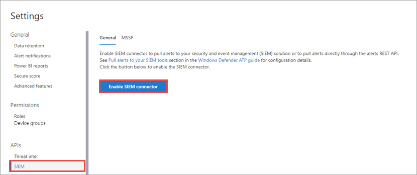

# SIEM-integratie inschakelen in Microsoft Defender voor EindpuntEnable SIEM integration in Microsoft Defender for Endpoint

[!INCLUDE [Microsoft 365 Defender rebranding](../../includes/microsoft-defender.md)]

**Van toepassing op:****Applies to:**
- [Microsoft Defender voor EindpuntMicrosoft Defender for Endpoint](https://go.microsoft.com/fwlink/?linkid=2154037)

>Wilt u Microsoft Defender voor Eindpunt ervaren?Want to experience Microsoft Defender for Endpoint? [Meld u aan voor een gratis proefabonnement.Sign up for a free trial.](https://www.microsoft.com/microsoft-365/windows/microsoft-defender-atp?ocid=docs-wdatp-enablesiem-abovefoldlink) 

Schakel de siem-integratie (Security Information and Event Management) in, zodat u detecties van Microsoft Defender-beveiligingscentrum.Enable security information and event management (SIEM) integration so you can pull detections from Microsoft Defender Security Center. Detecties trekken met uw SIEM-oplossing of door rechtstreeks verbinding te maken met de REST-API voor detecties.Pull detections using your SIEM solution or by connecting directly to the detections REST API.

>[!NOTE]
>- [Microsoft Defender for Endpoint Alert](alerts.md) is samengesteld uit een of meer detecties.[Microsoft Defender for Endpoint Alert](alerts.md) is composed from one or more detections.
>- [Microsoft Defender voor eindpuntdetectie](api-portal-mapping.md) is samengesteld uit de verdachte gebeurtenis op het apparaat en de bijbehorende waarschuwingsgegevens.[Microsoft Defender for Endpoint Detection](api-portal-mapping.md) is composed from the suspicious event occurred on the Device and its related Alert details.
>- De Microsoft Defender for Endpoint Alert API is de nieuwste API voor waarschuwingsverbruik en bevat een gedetailleerde lijst met verwante gegevens voor elke waarschuwing.The Microsoft Defender for Endpoint Alert API is the latest API for alert consumption and contain a detailed list of related evidence for each alert. Zie Waarschuwingsmethoden en [-eigenschappen](alerts.md) en [Lijstwaarschuwingen](get-alerts.md)voor meer informatie.For more information, see [Alert methods and properties](alerts.md) and [List alerts](get-alerts.md).

## VereistenPrerequisites

- De gebruiker die de instelling activeert, moet machtigingen hebben om een app te maken in Azure Active Directory (AAD).The user who activates the setting must have permissions to create an app in Azure Active Directory (AAD). Dit is iemand met de volgende rollen:This is someone with the following roles: 

  - Beveiligingsbeheerder en globale beheerderSecurity Administrator and either Global Administrator
  - CloudtoepassingsbeheerderCloud Application Administrator
  - ToepassingsbeheerderApplication Administrator
  - Eigenaar van de service-principalOwner of the service principal

- Tijdens de eerste activering wordt een pop-upscherm weergegeven waarin referenties moeten worden ingevoerd.During the initial activation, a pop-up screen is displayed for credentials to be entered. Zorg ervoor dat u pop-ups voor deze site toestaat.Make sure that you allow pop-ups for this site.

## SIEM-integratie inschakelenEnabling SIEM integration 
1. Selecteer in het navigatiedeelvenster **Instellingen**  >  **SIEM**.In the navigation pane, select **Settings** > **SIEM**.

    

    >[!TIP]
    >Als er een fout is opgetreden bij het inschakelen van de SIEM-verbindingstoepassing, controleert u de pop-upblokkeringsinstellingen van uw browser.If you encounter an error when trying to enable the SIEM connector application, check the pop-up blocker settings of your browser. Mogelijk wordt het nieuwe venster geblokkeerd wanneer u de functie inschakelen.It might be blocking the new window being opened when you enable the capability. 

2. Selecteer **SIEM-integratie inschakelen.**Select **Enable SIEM integration**. Hiermee activeert u de sectie toegangsdetails van de **SIEM-connector** met vooraf ingevulde waarden en wordt er een toepassing gemaakt onder uw Azure Active Directory (Azure AD)-tenant.This activates the **SIEM connector access details** section with pre-populated values and an application is created under your Azure Active Directory (Azure AD) tenant.

    > [!WARNING]
    >Het clientgeheim wordt slechts eenmaal weergegeven.The client secret is only displayed once. Zorg ervoor dat u een kopie ervan op een veilige plaats houdt.Make sure you keep a copy of it in a safe place. 
     

    

3. Kies het SIEM-type dat u in uw organisatie gebruikt.Choose the SIEM type you use in your organization.

   > [!NOTE]
   > Als u HP ArcSight selecteert, moet u deze twee configuratiebestanden opslaan:If you select HP ArcSight, you'll need to save these two configuration files: 
   > - WDATP-connector.jsonparser.propertiesWDATP-connector.jsonparser.properties
   > - WDATP-connector.propertiesWDATP-connector.properties  

   Als u rechtstreeks verbinding wilt maken met de DETECTIES REST API via programmatische toegang, kiest u **Generic API.**If you want to connect directly to the detections REST API through programmatic access, choose **Generic API**.

4. Kopieer de afzonderlijke waarden of selecteer **Details opslaan in bestand om** een bestand te downloaden dat alle waarden bevat.Copy the individual values or select **Save details to file** to download a file that contains all the values.

5. Selecteer **Tokens genereren** om toegang te krijgen en token te vernieuwen.Select **Generate tokens** to get an access and refresh token.
  
   > [!NOTE]
   > U moet elke 90 dagen een nieuw vernieuwingsken genereren.You'll need to generate a new Refresh token every 90 days. 

6. Volg de instructies voor het [maken van een Azure AD-app-registratie](/microsoft-365/security/defender-endpoint/exposed-apis-create-app-webapp) voor Microsoft Defender voor Eindpunt en wijs de juiste machtigingen toe om waarschuwingen te lezen.Follow the instructions for [creating an Azure AD app registration for Microsoft Defender for Endpoint](/microsoft-365/security/defender-endpoint/exposed-apis-create-app-webapp) and assign the correct permissions to it to read alerts.

U kunt nu doorgaan met het configureren van uw SIEM-oplossing of verbinding maken met de DETECTIES REST API via programmatische toegang.You can now proceed with configuring your SIEM solution or connecting to the detections REST API through programmatic access. U moet de tokens gebruiken bij het configureren van uw SIEM-oplossing, zodat deze detecties kan ontvangen van Microsoft Defender-beveiligingscentrum.You'll need to use the tokens when configuring your SIEM solution to allow it to receive detections from Microsoft Defender Security Center.

## Microsoft Defender voor eindpunt integreren met IBM QRadarIntegrate Microsoft Defender for Endpoint with IBM QRadar 
U kunt IBM QRadar zo configureren dat detecties worden verzameld van Microsoft Defender voor Eindpunt.You can configure IBM QRadar to collect detections from Microsoft Defender for Endpoint. Zie IBM Knowledge Center voor [meer informatie.](https://www.ibm.com/support/knowledgecenter/SS42VS_DSM/c_dsm_guide_MS_Win_Defender_ATP_overview.html?cp=SS42VS_7.3.1)For more information, see [IBM Knowledge Center](https://www.ibm.com/support/knowledgecenter/SS42VS_DSM/c_dsm_guide_MS_Win_Defender_ATP_overview.html?cp=SS42VS_7.3.1).

## Zie ookSee also
- [HP ArcSight configureren om Microsoft Defender te gebruiken voor eindpuntdetectiesConfigure HP ArcSight to pull Microsoft Defender for Endpoint detections](configure-arcsight.md)
- [Microsoft Defender voor eindpuntdetectieveldenMicrosoft Defender for Endpoint Detection fields](api-portal-mapping.md)
- [Microsoft Defender voor eindpuntdetecties trekken met REST APIPull Microsoft Defender for Endpoint detections using REST API](pull-alerts-using-rest-api.md)
- [Problemen met de integratie van SIEM-hulpprogramma's oplossenTroubleshoot SIEM tool integration issues](troubleshoot-siem.md)
