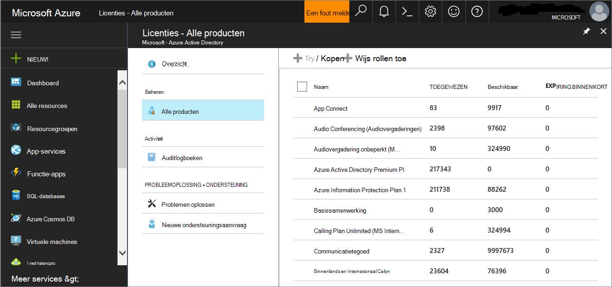
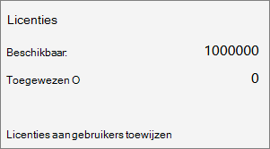

# Pilot MDE-evaluatie

>[!NOTE]
>Om u te begeleiden bij een normale implementatie, wordt in dit scenario alleen het gebruik van Microsoft Endpoint Configuration Manager. Defender voor Eindpunt ondersteunt het gebruik van andere onboarding-hulpprogramma's, maar deze scenario's worden niet in de implementatiehandleiding bestrijken. Zie Onboard devices to Microsoft Defender for Endpoint (Onboard [devices to Microsoft Defender for Endpoint) voor meer informatie.](onboard-configure.md)

## Stap 1. Licentiestaat controleren

Controleren op de licentiestaat en of deze goed is ingericht, kan via het beheercentrum of via de **Microsoft Azure portal.**

1. Als u uw licenties wilt bekijken, gaat u naar de **Microsoft Azure portal** en gaat u naar de [Microsoft Azure portallicentiesectie.](https://portal.azure.com/#blade/Microsoft_AAD_IAM/LicensesMenuBlade/Products)

   

1. U kunt ook in het beheercentrum naar  >  **Factureringsabonnementen gaan.**

    Op het scherm ziet u alle inrichtende licenties en de huidige **status.**

    

## Stap 2. Onboard-eindpunten met behulp van een van de ondersteunde beheerhulpmiddelen

Het [implementatieonderwerp](deployment-strategy.md) Plannen bevat een overzicht van de algemene stappen die u moet ondernemen om Defender voor Eindpunt te implementeren.  

Bekijk deze video voor een kort overzicht van het onboardingproces en lees meer over de beschikbare hulpprogramma's en methoden.

> [!VIDEO https://www.microsoft.com/videoplayer/embed/RE4bGqr]

Nadat u de architectuur hebt identificeren, moet u bepalen welke implementatiemethode u wilt gebruiken. Het implementatieprogramma dat u kiest, is van invloed op de manier waarop u eindpunten aan boord van de service inwerkt.

### Opties voor onboarding-hulpprogramma's

In de volgende tabel ziet u de beschikbare hulpprogramma's op basis van het eindpunt dat u nodig hebt om aan boord te gaan.

| Eindpunt     | Opties voor hulpprogramma's                       |
|--------------|------------------------------------------|
| **Windows**  |  [Lokaal script (maximaal 10 apparaten)](../defender-endpoint/configure-endpoints-script.md)   [Groepsbeleid](../defender-endpoint/configure-endpoints-gp.md)   [Microsoft Endpoint Manager/ Mobile Device Manager](../defender-endpoint/configure-endpoints-mdm.md)   [Microsoft Endpoint Configuration Manager](../defender-endpoint/configure-endpoints-sccm.md)   [VDI-scripts](../defender-endpoint/configure-endpoints-vdi.md)   [Integratie met Azure Defender](../defender-endpoint/configure-server-endpoints.md#integration-with-azure-defender) |
| **macOS**    | [Lokale scripts](../defender-endpoint/mac-install-manually.md)   [Microsoft Endpoint Manager](../defender-endpoint/mac-install-with-intune.md)   [JAMF-Pro](../defender-endpoint/mac-install-with-jamf.md)   [Mobile Device Management](../defender-endpoint/mac-install-with-other-mdm.md) |
| **Linux Server** | [Lokaal script](../defender-endpoint/linux-install-manually.md)   [Poppop](../defender-endpoint/linux-install-with-puppet.md)   [Ansible](../defender-endpoint/linux-install-with-ansible.md)|
| **iOS**      | [App-gebaseerde](../defender-endpoint/ios-install.md)                                |
| **Android**  | [Microsoft Endpoint Manager](../defender-endpoint/android-intune.md)               |
