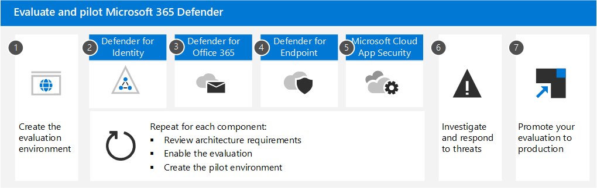

# Overzicht Microsoft 365 Defender voor eindpunt evaluerenEvaluate Microsoft 365 Defender for Endpoint overview

**Van toepassing op:****Applies to:**

- Microsoft 365 DefenderMicrosoft 365 Defender

Uitgebreide beveiligingsproductevaluaties kunnen een complex proces zijn, waarbij omslachtige omgevings- en apparaatconfiguraties nodig zijn voordat een end-to-end-aanvalssimulatie daadwerkelijk kan worden uitgevoerd.Comprehensive security product evaluations can be a complex process, requiring cumbersome environment and device configurations before an end-to-end attack simulation can actually be done. Het toevoegen van de complexiteit is de uitdaging om bij te houden waar de simulatieactiviteiten, waarschuwingen en resultaten worden weergegeven tijdens de evaluatie.Adding to the complexity is the challenge of tracking where the simulation activities, alerts, and results are reflected during the evaluation.

Het evaluatielaboratorium van Microsoft Defender voor eindpunten is ontworpen om de complexiteit van de apparaat- en omgevingsconfiguratie te elimineren.The Microsoft Defender for Endpoint evaluation lab is designed to eliminate the complexities of device and environment configuration. Op deze manier kunt u het volgende doen:This enables you to:

- Focus op het evalueren van de mogelijkheden van het platformFocus on evaluating the capabilities of the platform
- Simulaties uitvoerenRun simulations
- Bekijk de preventie-, detectie- en herstelfuncties in actieSee the prevention, detection, and remediation features in action
 

> [!VIDEO https://www.microsoft.com/videoplayer/embed/RE4woug]

Met de vereenvoudigde in te stellen ervaring kunt u zich richten op het uitvoeren van uw eigen testscenario's en de vooraf gemaakte simulaties om te zien hoe Defender voor Eindpunt presteert.Using the simplified set-up experience, you can focus on running your own test scenarios and the pre-made simulations to see how Defender for Endpoint performs.

U hebt volledige toegang tot de krachtige mogelijkheden van het platform, zoals geautomatiseerde onderzoeken, geavanceerde zoek- en bedreigingsanalyses, zodat u de uitgebreide beveiligingsstack kunt testen die Defender voor Eindpunt biedt.You'll have full access to the powerful capabilities of the platform such as automated investigations, advanced hunting, and threat analytics, allowing you to test the comprehensive protection stack that Defender for Endpoint offers.

U kunt Windows 10- of Windows Server 2019-apparaten toevoegen die vooraf zijn geconfigureerd voor de nieuwste besturingssysteemversies en de juiste beveiligingsonderdelen en Office 2019 Standard zijn geïnstalleerd.You can add Windows 10 or Windows Server 2019 devices that come pre-configured to have the latest OS versions and the right security components in place as well as Office 2019 Standard installed.

U kunt ook bedreigingssimulatoren installeren.You can also install threat simulators. Defender for Endpoint werkt samen met toonaangevende bedreigingssimulatieplatforms om u te helpen de Mogelijkheden van Defender voor eindpunten uit te testen zonder de portal te verlaten.Defender for Endpoint has partnered with industry leading threat simulation platforms to help you test out the Defender for Endpoint capabilities without having to leave the portal.

 Installeer de gewenste simulator, voer scenario's uit in het evaluatielaboratorium en bekijk direct hoe het platform presteert.Install your preferred simulator, run scenarios within the evaluation lab, and then instantly see how the platform performs. Deze mogelijkheid is allemaal gemakkelijk beschikbaar zonder extra kosten voor u.This capability is all conveniently available at no extra cost to you. U hebt ook handige toegang tot een breed scala aan simulaties, die u kunt openen en uitvoeren vanuit de catalogus met simulaties.You'll also have convenient access to wide array of simulations, which you can access and run from the simulations catalog.
