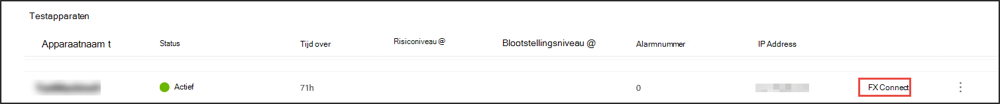
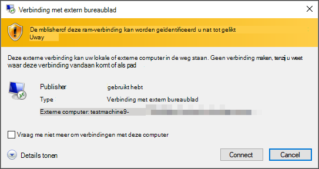
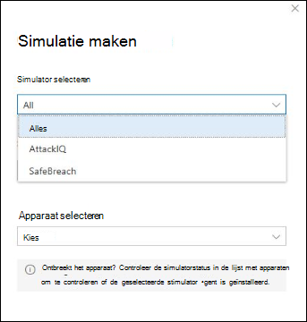

# Microsoft Defender for Endpoint (MDE) ervaren via gesimuleerde aanvallen

>[!TIP]
>
>- Meer informatie over de nieuwste verbeteringen in Microsoft Defender voor Eindpunt: Wat is er [nieuw in Defender voor Eindpunt?](https://cloudblogs.microsoft.com/microsoftsecure/2018/11/15/whats-new-in-windows-defender-atp/).
>- Defender for Endpoint heeft in de recente MITRE-evaluatie de toonaangevende mogelijkheden voor optica en detectie gedemonstreerd. Lees: [Insights van de MITRE ATT-&op CK gebaseerde evaluatie](https://cloudblogs.microsoft.com/microsoftsecure/2018/12/03/insights-from-the-mitre-attack-based-evaluation-of-windows-defender-atp/).

Mogelijk wilt u Defender voor Eindpunt ervaren voordat u meer dan een paar apparaten aan boord van de service aan boord gaat. Hiervoor kunt u gecontroleerde aanvalssimulaties uitvoeren op een paar testapparaten. Nadat u de gesimuleerde aanvallen hebt uitgevoerd, kunt u bekijken hoe in Defender voor Eindpunt schadelijke activiteiten worden aan het licht gekomen en kunt u bekijken hoe dit een efficiënte reactie mogelijk maakt.

## Voordat u begint

Als u een van de meegeleverde simulaties wilt uitvoeren, hebt u ten minste [één apparaat met onboarding nodig.](onboard-configure.md)

Lees het walkthrough-document dat bij elk aanvalsscenario wordt geleverd. Elk document bevat besturingssysteem- en toepassingsvereisten, evenals gedetailleerde instructies die specifiek zijn voor een aanvalsscenario.

## Een simulatie uitvoeren

1. Selecteer **in**  >  **Help-& zelfstudies** welke van de beschikbare aanvalsscenario's u wilt simuleren:

   - **Scenario 1: Document dropt backdoor-** simuleert de bezorging van een sociaal ontworpen lokmiddeldocument. Het document start een speciaal ontworpen backdoor die aanvallers controle geeft.

   - **Scenario 2: PowerShell-script in bestandsloze** aanval : simuleert een bestandsloze aanval die afhankelijk is van PowerShell, waarbij de surface reduction van de aanval wordt belicht en de detectie van schadelijke geheugenactiviteit op apparaten wordt gedetecteerd.

   - **Scenario 3: Geautomatiseerde reactie** op incidenten : activeert automatisch onderzoek, waarmee automatisch wordt gejaagd naar en herstelt van inbreukartefacten om de reactiecapaciteit voor incidenten te vergroten.

2. Download en lees het bijbehorende doorloopdocument dat bij het geselecteerde scenario is geleverd.

3. Download het simulatiebestand of kopieer het simulatiescript door naar  >  **Help-& navigeren.** U kunt ervoor kiezen om het bestand of script te downloaden op het testapparaat, maar dit is niet verplicht.

4. Voer het simulatiebestand of script uit op het testapparaat, zoals wordt geïnstrueerd in het doorloopdocument.

> [!NOTE]
> Simulatiebestanden of scripts bootsen aanvalsactiviteit na, maar zijn in feite goedaardig en kunnen het testapparaat niet schaden of in gevaar brengen.
>

## ALTERNATIEVE ONDERWERPTEKST

## Scenario's voor aanvallen simuleren

Gebruik de testapparaten om uw eigen aanvalssimulaties uit te voeren door er verbinding mee te maken.

U kunt aanvalsscenario's simuleren met behulp van:

- De [aanvalsscenario's 'Doe het zelf'](https://securitycenter.windows.com/tutorials)
- Bedreigingssimulatoren

U kunt ook Geavanceerd zoeken [gebruiken](advanced-hunting-overview.md) om gegevens op te vragen en [bedreigingsanalyses](threat-analytics.md) te gebruiken om rapporten over nieuwe bedreigingen weer te geven.

### Doe-het-zelf-aanvalsscenario's

Als u op zoek bent naar een vooraf gemaakte simulatie, kunt u onze aanvalsscenario's ['Doe het zelf' gebruiken.](https://securitycenter.windows.com/tutorials) Deze scripts zijn veilig, gedocumenteerd en eenvoudig te gebruiken. Deze scenario's weerspiegelen de mogelijkheden van Defender voor eindpunten en helpen u bij het onderzoeken.

>[!NOTE]
>De verbinding met de testapparaten wordt uitgevoerd met RDP. Zorg ervoor dat uw firewallinstellingen RDP-verbindingen toestaan.

1. Verbinding maken naar uw apparaat en voer een aanvalssimulatie uit door **Verbinding maken.**

    

2. Sla het RDP-bestand op en start het door **Verbinding maken.**

    

    >[!NOTE]
    >Als u geen kopie van het wachtwoord hebt opgeslagen tijdens de eerste installatie, kunt u het wachtwoord opnieuw instellen door Wachtwoord opnieuw instellen te selecteren **in** het menu: Afbeelding van wachtwoord 
    >
    > Het apparaat wijzigt de status in 'Wachtwoord opnieuw instellen', waarna u binnen enkele minuten uw nieuwe wachtwoord krijgt.

3. Voer het wachtwoord in dat is weergegeven tijdens de stap voor het maken van het apparaat.

   

4. Voer doe-het-zelf-aanvalssimulaties uit op het apparaat.

### Scenario's voor bedreigingssimulator

Als u ervoor kiest om een van de ondersteunde bedreigingssimulatoren te installeren tijdens de installatie van het lab, kunt u de ingebouwde simulaties uitvoeren op de evaluatielaboratoriumapparaten.

Het uitvoeren van bedreigingssimulaties met behulp van platforms van derden is een goede manier om Microsoft Defender te evalueren voor endpoint-mogelijkheden binnen de grenzen van een labomgeving.

>[!NOTE]
>
>Voordat u simulaties kunt uitvoeren, moet u ervoor zorgen dat aan de volgende vereisten wordt voldaan:

>- Apparaten moeten worden toegevoegd aan het evaluatielaboratorium
>- Bedreigingssimulatoren moeten worden geïnstalleerd in het evaluatielaboratorium

1. Selecteer in de portal de optie **Simulatie maken.**

2. Selecteer een bedreigingssimulator.

    

3. Kies een simulatie of kijk door de simulatiegalerie om door de beschikbare simulaties te bladeren.

    U kunt naar de galerie met simulaties gaan via:
    - Het hoofdevaluatiedashboard in **de tegel Overzicht van simulaties** of
    - Door te navigeren vanuit het **navigatiedeelvenster Evaluatie en zelfstudies**& zelfstudies en selecteer vervolgens  >  De catalogus van de **simulaties.**

4. Selecteer de apparaten waarop u de simulatie wilt uitvoeren.

5. Selecteer **Simulatie maken.**

6. Bekijk de voortgang van een simulatie door het tabblad **Simulaties te** selecteren. Bekijk de status van de simulatie, actieve waarschuwingen en andere details.

    
 

Nadat u uw simulaties hebt uitgevoerd, raden we u aan om door de voortgangsbalk van het lab te lopen en Microsoft Defender voor Eindpunt te verkennen en een geautomatiseerd onderzoek en herstel **te starten.** Bekijk het bewijs dat door de functie is verzameld en geanalyseerd.

Zoek naar bewijs van aanvallen door middel van geavanceerde jacht met behulp van de uitgebreide querytaal en onbewerkte telemetrie en bekijk enkele bedreigingen over de hele wereld die zijn gedocumenteerd in Bedreigingsanalyse.
