# Microsoft Defender voor endpoint-evaluatielaboratorium

[!INCLUDE [Microsoft 365 Defender rebranding](../../includes/microsoft-defender.md)]

**Van toepassing op:**
- [Microsoft Defender voor Eindpunt](https://go.microsoft.com/fwlink/?linkid=2154037)
- [Microsoft 365 Defender](https://go.microsoft.com/fwlink/?linkid=2118804)

>Wilt u Microsoft Defender voor Eindpunt ervaren? [Meld u aan voor een gratis proefabonnement.](https://www.microsoft.com/microsoft-365/windows/microsoft-defender-atp?ocid=docs-wdatp-enablesiem-abovefoldlink)

Het uitvoeren van een uitgebreide beveiligingsproductevaluatie kan een complex proces zijn dat omslachtige omgeving en apparaatconfiguratie vereist voordat een end-to-end-aanvalssimulatie daadwerkelijk kan worden uitgevoerd. Het toevoegen van de complexiteit is de uitdaging om bij te houden waar de simulatieactiviteiten, waarschuwingen en resultaten worden weergegeven tijdens de evaluatie.

Het evaluatielaboratorium van Microsoft Defender voor eindpunt is ontworpen om de complexiteit van de configuratie van apparaten en omgevingen te elimineren, zodat u zich kunt concentreren op het evalueren van de mogelijkheden van het platform, het uitvoeren van simulaties en het zien van de preventie-, detectie- en herstelfuncties in actie.

> [!VIDEO https://www.microsoft.com/en-us/videoplayer/embed/RE4qLUM]

Met de vereenvoudigde set-upervaring kunt u zich richten op het uitvoeren van uw eigen testscenario's en de vooraf gemaakte simulaties om te zien hoe Defender voor Eindpunt presteert. 

U hebt volledige toegang tot de krachtige mogelijkheden van het platform, zoals geautomatiseerde onderzoeken, geavanceerde zoek- en bedreigingsanalyses, zodat u de uitgebreide beveiligingsstack kunt testen die Defender voor Eindpunt biedt. 

U kunt Windows 10- of Windows Server 2019-apparaten toevoegen die vooraf zijn geconfigureerd voor de nieuwste besturingssysteemversies en de juiste beveiligingsonderdelen en Office 2019 Standard zijn geïnstalleerd.

U kunt ook bedreigingssimulatoren installeren. Defender for Endpoint werkt samen met toonaangevende bedreigingssimulatieplatforms om u te helpen de Mogelijkheden van Defender voor eindpunten uit te testen zonder de portal te verlaten.

 Installeer uw voorkeurssimulator, voer scenario's uit in het evaluatielaboratorium en zie direct hoe het platform presteert- allemaal gemakkelijk beschikbaar zonder extra kosten voor u. U hebt ook handige toegang tot een breed scala aan simulaties die u kunt openen en uitvoeren vanuit de catalogus met simulaties.
    

## Voordat u begint
U moet voldoen aan  de licentievereisten of proeftoegang hebben tot Microsoft Defender voor Eindpunt om toegang te krijgen tot het evaluatielaboratorium.

U moet de **machtiging Beveiligingsinstellingen beheren** hebben om:
- Het lab maken
- Apparaten maken
- Wachtwoord opnieuw instellen
- Simulaties maken 
 
Als u op rollen gebaseerd toegangsbeheer (RBAC) hebt ingeschakeld en ten minste één machinegroep hebt gemaakt, moeten gebruikers toegang hebben tot Alle machinegroepen.

Zie Rollen maken [en beheren voor meer informatie.](user-roles.md)

Wilt u Microsoft Defender voor Eindpunt ervaren? [Meld u aan voor een gratis proefabonnement.](https://www.microsoft.com/microsoft-365/windows/microsoft-defender-atp?ocid=docs-wdatp-main-abovefoldlink)

## Aan de slag met het lab
U kunt het lab openen via het menu. Selecteer in het navigatiemenu **Evaluatie en zelfstudies > evaluatielaboratorium.**

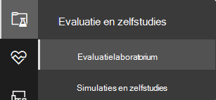

>[!NOTE]
>- Afhankelijk van het type omgevingsstructuur dat u selecteert, zijn apparaten beschikbaar voor het opgegeven aantal uren vanaf de dag van activering.
>- Elke omgeving is ingericht met een beperkt aantal testapparaten. Wanneer u de inrichtende apparaten hebt gebruikt en deze hebt verwijderd, kunt u om meer apparaten vragen. 
>- U kunt eenmaal per maand labbronnen aanvragen. 

Hebt u al een lab? Zorg ervoor dat u de nieuwe bedreigingssimulatoren inschakelen en actieve apparaten hebt.

## Het evaluatielaboratorium instellen

1. Selecteer evaluatie- en **zelfstudies** evaluatielaboratorium in het navigatiedeelvenster  >  en selecteer vervolgens **Installatielaboratorium.**

    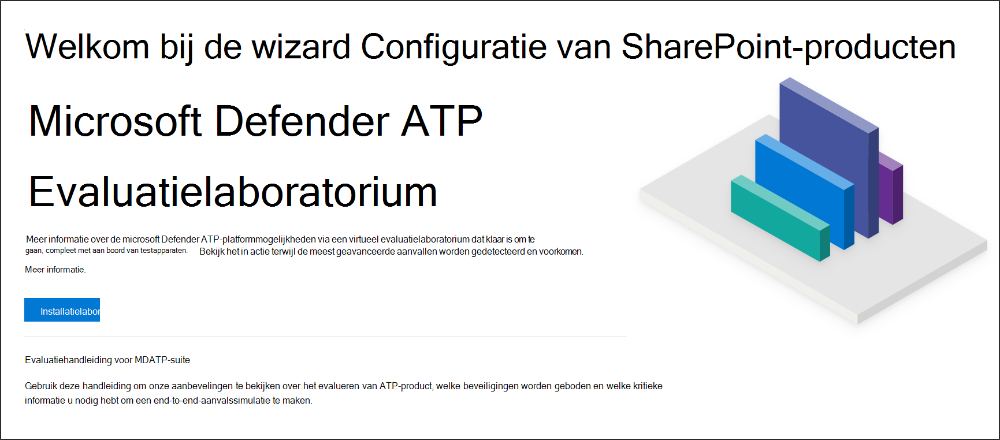

2. Afhankelijk van uw evaluatiebehoeften kunt u ervoor kiezen om een omgeving met minder apparaten voor een langere periode of meer apparaten voor een kortere periode in te stellen. Selecteer de gewenste labconfiguratie en selecteer **Volgende.**

     

3. (Optioneel) U kunt ervoor kiezen om bedreigingssimulatoren in het lab te installeren. 

    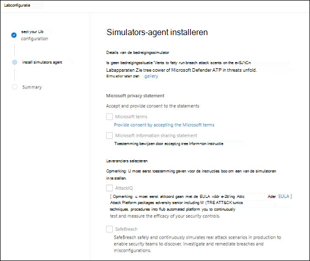

    >[!IMPORTANT]
    >U moet eerst akkoord gaan en toestemming geven voor de voorwaarden en instructies voor het delen van gegevens. 

4. Selecteer de bedreigingssimulatieagent die u wilt gebruiken en voer uw gegevens in. U kunt er ook voor kiezen om bedreigingssimulatoren op een later tijdstip te installeren. Als u ervoor kiest om bedreigingssimulatieagenten te installeren tijdens de installatie van het lab, profiteert u ervan dat ze gemakkelijk worden geïnstalleerd op de apparaten die u toevoegt.  
    
    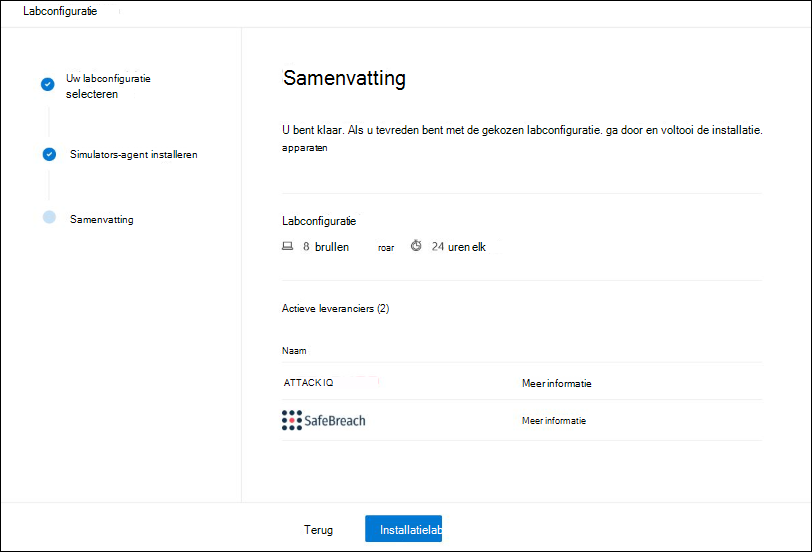

5.  Bekijk de samenvatting en selecteer **Installatielaboratorium**.  

Nadat het installatieproces voor het lab is voltooid, kunt u apparaten toevoegen en simulaties uitvoeren. 

## Apparaten toevoegen
Wanneer u een apparaat toevoegt aan uw omgeving, stelt Defender voor Eindpunt een goed geconfigureerd apparaat met verbindingsgegevens in. U kunt Windows 10 of Windows Server 2019-apparaten toevoegen.

Het apparaat wordt geconfigureerd met de meest recente versie van het besturingssysteem en Office 2019 Standard, evenals andere apps zoals Java, Python en SysIntenals. 

Als u ervoor kiest om een bedreigingssimulator toe te voegen tijdens de installatie van het lab, wordt op alle apparaten de agent voor de bedreigingssimulator geïnstalleerd op de apparaten die u toevoegt.

Het apparaat wordt automatisch onboarded bij uw tenant met de aanbevolen Windows beveiligingsonderdelen ingeschakeld en in de auditmodus, zonder moeite aan uw zijde. 

De volgende beveiligingsonderdelen zijn vooraf geconfigureerd in de testapparaten:

- [Kwetsbaarheid voor aanvallen verminderen](attack-surface-reduction.md)
- [Blok op het eerste gezicht](configure-block-at-first-sight-microsoft-defender-antivirus.md)
- [Beheerde maptoegang](controlled-folders.md)
- [Bescherming tegen misbruik](enable-exploit-protection.md)
- [Netwerkbeveiliging](network-protection.md)
- [Potentieel ongewenste toepassingsdetectie](detect-block-potentially-unwanted-apps-microsoft-defender-antivirus.md)
- [Beveiliging in de cloud](cloud-protection-microsoft-defender-antivirus.md)
- [Microsoft Defender SmartScreen](/windows/security/threat-protection/microsoft-defender-smartscreen/microsoft-defender-smartscreen-overview)

>[!NOTE]
> Microsoft Defender Antivirus is aan (niet in de auditmodus). Als Microsoft Defender Antivirus de simulatie niet kunt uitvoeren, kunt u realtimebeveiliging op het apparaat uitschakelen via Windows-beveiliging. Zie [Always-on protection configureren](configure-real-time-protection-microsoft-defender-antivirus.md)voor meer informatie.

Geautomatiseerde onderzoeksinstellingen zijn afhankelijk van tenantinstellingen. Deze wordt standaard geconfigureerd als semi-geautomatiseerd. Zie Overzicht van geautomatiseerde onderzoeken voor [meer informatie.](automated-investigations.md)

>[!NOTE]
>De verbinding met de testapparaten wordt uitgevoerd met RDP. Zorg ervoor dat uw firewallinstellingen RDP-verbindingen toestaan.

1. Selecteer apparaat toevoegen in **het** dashboard. 

2. Kies het type apparaat dat u wilt toevoegen. U kunt ervoor kiezen om Windows 10 of Windows Server 2019 toe te voegen.

    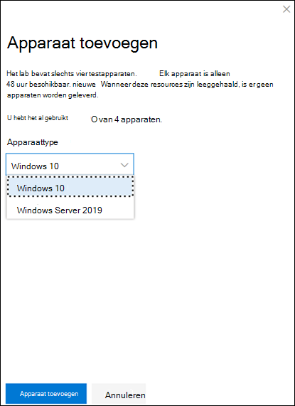

    >[!NOTE]
    >Als er iets misgaat met het maken van apparaten, wordt u op de hoogte gesteld en moet u een nieuwe aanvraag indienen. Als het maken van apparaten mislukt, wordt het niet meegetelde voor het toegestane quotum. 

3. De verbindingsdetails worden weergegeven. Selecteer **Kopiëren om** het wachtwoord voor het apparaat op te slaan.

    >[!NOTE]
    >Het wachtwoord wordt slechts eenmaal weergegeven. Sla deze op voor later gebruik.

    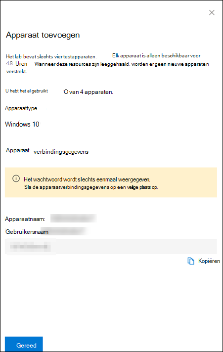

4. Apparaat instellen begint. Dit kan ongeveer 30 minuten duren. 

5. Bekijk de status van testapparaten, het risico en de blootstellingsniveaus en de status van simulatorinstallaties door het tabblad **Apparaten te** selecteren. 

    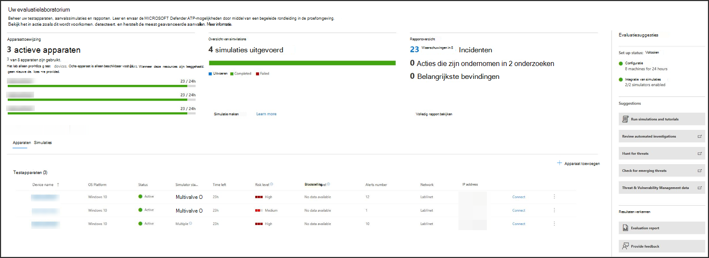
    

    > [!TIP]
    > In de **kolom Simulatorstatus** kunt u de muisaanwijzer boven het informatiepictogram plaatsen om de installatiestatus van een agent te weten.

## Aanvragen voor meer apparaten
Wanneer alle bestaande apparaten worden gebruikt en verwijderd, kunt u om meer apparaten vragen. U kunt eenmaal per maand labbronnen aanvragen. 

1. Selecteer aanvragen voor meer apparaten in het **evaluatielaboratorium.**

   

2. Kies uw configuratie. 
3. Verzend de aanvraag. 

Wanneer de aanvraag is ingediend, ziet u een groene bevestigingsbanner en de datum van de laatste inzending.
 
U vindt de status van uw aanvraag op **het** tabblad Gebruikersacties, dat binnen enkele uren wordt goedgekeurd.

Wanneer deze zijn goedgekeurd, worden de aangevraagde apparaten toegevoegd aan de lab-set-up en kunt u meer apparaten maken. 

> [!TIP]
> Als u meer uit uw lab wilt halen, vergeet dan niet om onze bibliotheek met simulaties te lezen.

## Scenario's voor aanvallen simuleren
Gebruik de testapparaten om uw eigen aanvalssimulaties uit te voeren door er verbinding mee te maken. 

U kunt aanvalsscenario's simuleren met behulp van:
- De [aanvalsscenario's 'Doe het zelf'](https://securitycenter.windows.com/tutorials)
- Bedreigingssimulatoren

U kunt ook Geavanceerd zoeken [gebruiken](advanced-hunting-overview.md) om gegevens op te vragen en [bedreigingsanalyses](threat-analytics.md) te gebruiken om rapporten over nieuwe bedreigingen weer te geven.

### Doe-het-zelf-aanvalsscenario's
Als u op zoek bent naar een vooraf gemaakte simulatie, kunt u onze aanvalsscenario's ['Doe het zelf' gebruiken.](https://securitycenter.windows.com/tutorials) Deze scripts zijn veilig, gedocumenteerd en eenvoudig te gebruiken. Deze scenario's weerspiegelen de mogelijkheden van Defender voor eindpunten en helpen u bij het onderzoeken.

>[!NOTE]
>De verbinding met de testapparaten wordt uitgevoerd met RDP. Zorg ervoor dat uw firewallinstellingen RDP-verbindingen toestaan.

1. Verbinding maken naar uw apparaat en voer een aanvalssimulatie uit door **Verbinding maken.** 

    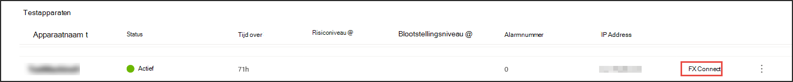

2. Sla het RDP-bestand op en start het door **Verbinding maken.**

    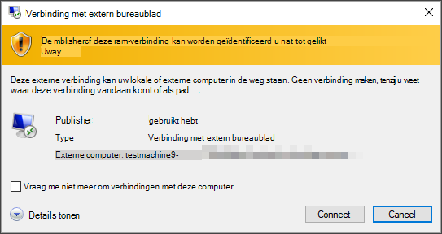

    >[!NOTE]
    >Als u geen kopie van het wachtwoord hebt opgeslagen tijdens de eerste installatie, kunt u het wachtwoord opnieuw instellen door Wachtwoord opnieuw instellen te selecteren **in** het menu: Afbeelding van wachtwoord  
    > Het apparaat wijzigt de status in 'Wachtwoord opnieuw instellen', waarna u binnen enkele minuten uw nieuwe wachtwoord krijgt.

3. Voer het wachtwoord in dat is weergegeven tijdens de stap voor het maken van het apparaat. 

   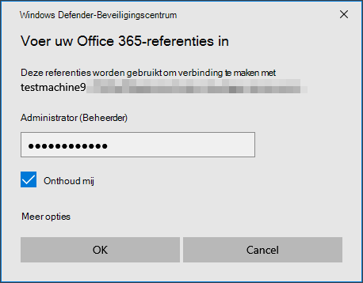

4. Voer doe-het-zelf-aanvalssimulaties uit op het apparaat. 

### Scenario's voor bedreigingssimulator
Als u ervoor kiest om een van de ondersteunde bedreigingssimulatoren te installeren tijdens de installatie van het lab, kunt u de ingebouwde simulaties uitvoeren op de evaluatielaboratoriumapparaten. 

Het uitvoeren van bedreigingssimulaties met behulp van platforms van derden is een goede manier om Microsoft Defender te evalueren voor endpoint-mogelijkheden binnen de grenzen van een labomgeving.

>[!NOTE]
>Voordat u simulaties kunt uitvoeren, moet u ervoor zorgen dat aan de volgende vereisten wordt voldaan:
>- Apparaten moeten worden toegevoegd aan het evaluatielaboratorium
>- Bedreigingssimulatoren moeten worden geïnstalleerd in het evaluatielaboratorium

1. Selecteer in de portal de optie **Simulatie maken.**

2. Selecteer een bedreigingssimulator.

    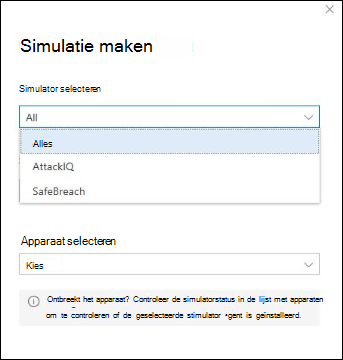

3. Kies een simulatie of kijk door de simulatiegalerie om door de beschikbare simulaties te bladeren. 

    U kunt naar de galerie met simulaties gaan via:
    - Het hoofdevaluatiedashboard in **de tegel Overzicht van simulaties** of
    - Door te navigeren vanuit het **navigatiedeelvenster Evaluatie en zelfstudies**& zelfstudies en selecteer vervolgens  >  De catalogus van de **simulaties.**

4. Selecteer de apparaten waarop u de simulatie wilt uitvoeren.

5. Selecteer **Simulatie maken.**

6. Bekijk de voortgang van een simulatie door het tabblad **Simulaties te** selecteren. Bekijk de status van de simulatie, actieve waarschuwingen en andere details. 

    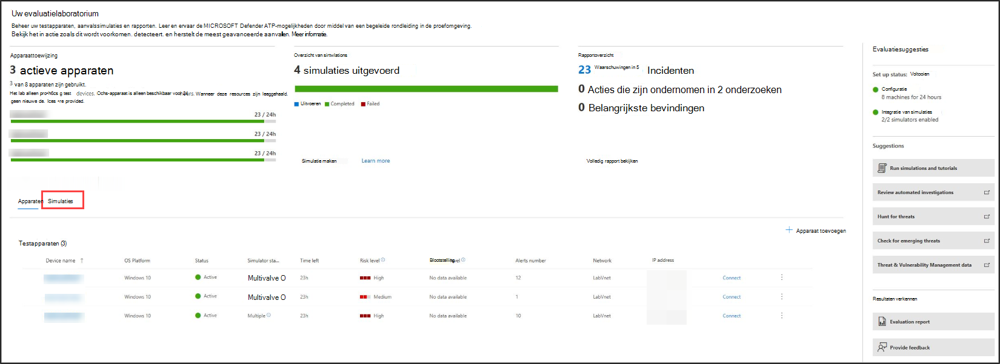
    
Nadat u uw simulaties hebt uitgevoerd, raden we u aan om door de voortgangsbalk van het lab te lopen en Microsoft Defender voor Eindpunt te verkennen en een geautomatiseerd onderzoek en herstel **te starten.** Bekijk het bewijs dat door de functie is verzameld en geanalyseerd.

Zoek naar bewijs van aanvallen door middel van geavanceerde jacht met behulp van de uitgebreide querytaal en onbewerkte telemetrie en bekijk enkele bedreigingen over de hele wereld die zijn gedocumenteerd in Bedreigingsanalyse.

## Galerie met simulaties
Microsoft Defender for Endpoint werkt samen met verschillende platformen voor bedreigingssimulatie om u gemakkelijk toegang te geven om de mogelijkheden van het platform te testen vanuit de portal. 

Bekijk alle beschikbare simulaties door naar de catalogus Simulaties en **zelfstudies**  >  **simulaties** te gaan in het menu. 

Er wordt een lijst met ondersteunde bedreigingssimulatieagenten van derden weergegeven en specifieke soorten simulaties en gedetailleerde beschrijvingen worden weergegeven in de catalogus. 

U kunt elke beschikbare simulatie eenvoudig uitvoeren vanuit de catalogus.  

Elke simulatie wordt geleverd met een uitgebreide beschrijving van het aanvalsscenario en verwijzingen, zoals de mitre-aanvalstechnieken die worden gebruikt en voorbeelden van geavanceerde query's die u gebruikt.

**Voorbeelden:** 
 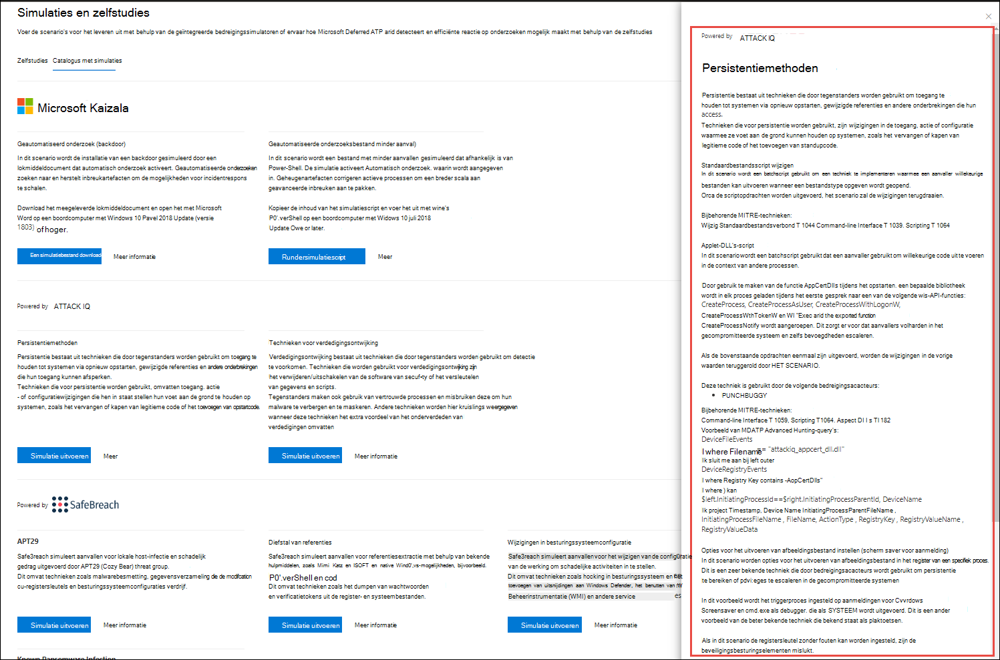

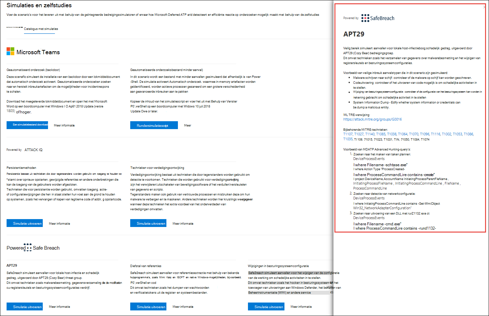

## Evaluatierapport
De labrapporten geven een overzicht van de resultaten van de simulaties die op de apparaten worden uitgevoerd.

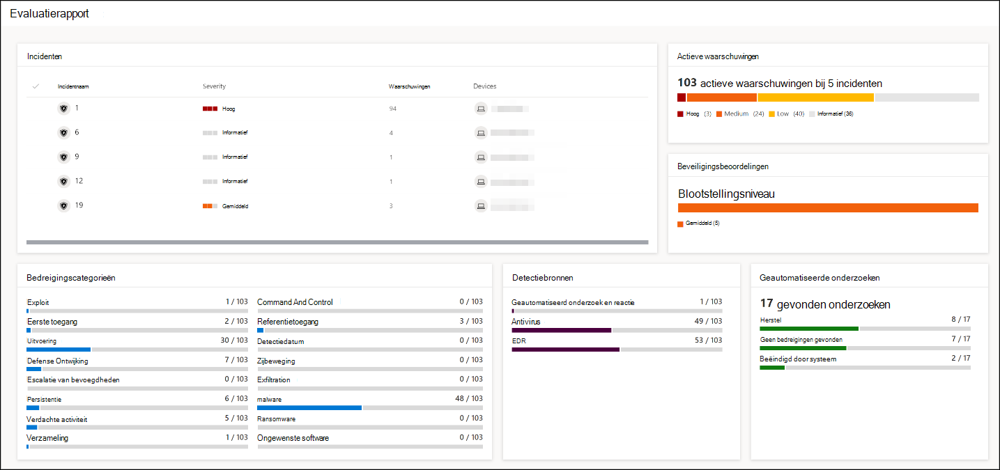

In één oogopslag kunt u snel het volgende zien:
- Incidenten die zijn geactiveerd
- Gegenereerde waarschuwingen
- Evaluaties op blootstellingsniveau 
- Waargenomen bedreigingscategorieën
- Detectiebronnen
- Geautomatiseerde onderzoeken

## Feedback geven
Uw feedback helpt ons om uw omgeving beter te beschermen tegen geavanceerde aanvallen. Deel uw ervaring en indrukken vanuit productmogelijkheden en evaluatieresultaten.

Laat ons weten wat u denkt door Feedback **geven te selecteren.**

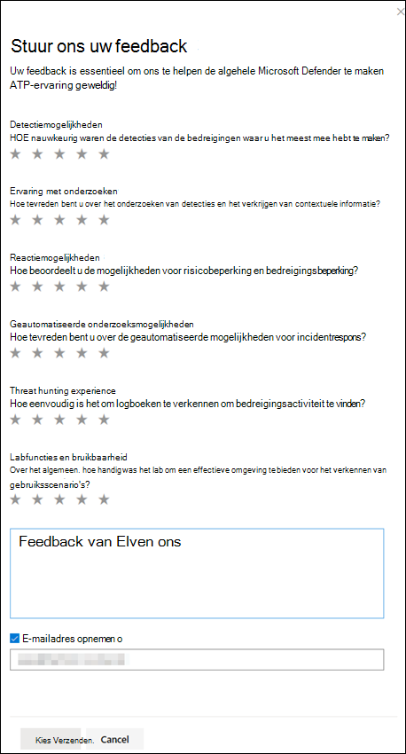
