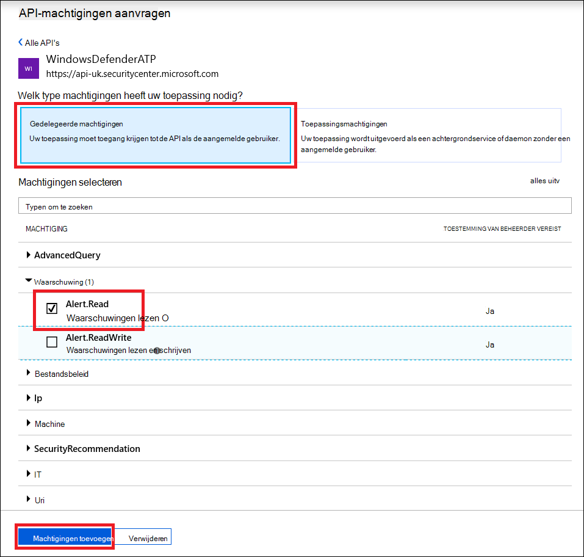

# <a name="use-microsoft-defender-for-endpoint-apis"></a><span data-ttu-id="97a50-104">Microsoft Defender voor eindpunt-API's gebruiken</span><span class="sxs-lookup"><span data-stu-id="97a50-104">Use Microsoft Defender for Endpoint APIs</span></span>

[!INCLUDE [Microsoft 365 Defender rebranding](../../includes/microsoft-defender.md)]


<span data-ttu-id="97a50-105">**Van toepassing op:**</span><span class="sxs-lookup"><span data-stu-id="97a50-105">**Applies to:**</span></span>
- [<span data-ttu-id="97a50-106">Microsoft Defender voor Eindpunt</span><span class="sxs-lookup"><span data-stu-id="97a50-106">Microsoft Defender for Endpoint</span></span>](https://go.microsoft.com/fwlink/?linkid=2154037)

> <span data-ttu-id="97a50-107">Wilt u Microsoft Defender voor Eindpunt ervaren?</span><span class="sxs-lookup"><span data-stu-id="97a50-107">Want to experience Microsoft Defender for Endpoint?</span></span> [<span data-ttu-id="97a50-108">Meld u aan voor een gratis proefabonnement.</span><span class="sxs-lookup"><span data-stu-id="97a50-108">Sign up for a free trial.</span></span>](https://www.microsoft.com/microsoft-365/windows/microsoft-defender-atp?ocid=docs-wdatp-exposedapis-abovefoldlink)

[!include[Microsoft Defender for Endpoint API URIs for US Government](../../includes/microsoft-defender-api-usgov.md)]

[!include[Improve request performance](../../includes/improve-request-performance.md)]

<span data-ttu-id="97a50-109">Op deze pagina wordt beschreven hoe u een toepassing maakt om namens een gebruiker programmatische toegang te krijgen tot Defender voor Eindpunt.</span><span class="sxs-lookup"><span data-stu-id="97a50-109">This page describes how to create an application to get programmatic access to Defender for Endpoint on behalf of a user.</span></span>

<span data-ttu-id="97a50-110">Als u programmatische toegang nodig hebt voor Microsoft Defender voor Eindpunt zonder een gebruiker, raadpleegt u Access Microsoft Defender voor Eindpunt [met toepassingscontext.](exposed-apis-create-app-webapp.md)</span><span class="sxs-lookup"><span data-stu-id="97a50-110">If you need programmatic access Microsoft Defender for Endpoint without a user, refer to [Access Microsoft Defender for Endpoint with application context](exposed-apis-create-app-webapp.md).</span></span>

<span data-ttu-id="97a50-111">Als u niet zeker weet welke toegang u nodig hebt, leest u de [pagina Inleiding.](apis-intro.md)</span><span class="sxs-lookup"><span data-stu-id="97a50-111">If you are not sure which access you need, read the [Introduction page](apis-intro.md).</span></span>

<span data-ttu-id="97a50-112">In Microsoft Defender voor Eindpunt worden veel van de gegevens en acties via een set programmatische API's beschikbaar.</span><span class="sxs-lookup"><span data-stu-id="97a50-112">Microsoft Defender for Endpoint exposes much of its data and actions through a set of programmatic APIs.</span></span> <span data-ttu-id="97a50-113">Met deze API's kunt u werkstromen automatiseren en innoveren op basis van De mogelijkheden van Microsoft Defender voor eindpunten.</span><span class="sxs-lookup"><span data-stu-id="97a50-113">Those APIs will enable you to automate work flows and innovate based on Microsoft Defender for Endpoint capabilities.</span></span> <span data-ttu-id="97a50-114">Voor de API-toegang is OAuth2.0-verificatie vereist.</span><span class="sxs-lookup"><span data-stu-id="97a50-114">The API access requires OAuth2.0 authentication.</span></span> <span data-ttu-id="97a50-115">Zie [OAuth 2.0 Autorisatiecode](/azure/active-directory/develop/active-directory-v2-protocols-oauth-code)voor Flow.</span><span class="sxs-lookup"><span data-stu-id="97a50-115">For more information, see [OAuth 2.0 Authorization Code Flow](/azure/active-directory/develop/active-directory-v2-protocols-oauth-code).</span></span>

<span data-ttu-id="97a50-116">Over het algemeen moet u de volgende stappen nemen om de API's te gebruiken:</span><span class="sxs-lookup"><span data-stu-id="97a50-116">In general, you’ll need to take the following steps to use the APIs:</span></span>
- <span data-ttu-id="97a50-117">Een AAD-toepassing maken</span><span class="sxs-lookup"><span data-stu-id="97a50-117">Create an AAD application</span></span>
- <span data-ttu-id="97a50-118">Een toegangs token krijgen met deze toepassing</span><span class="sxs-lookup"><span data-stu-id="97a50-118">Get an access token using this application</span></span>
- <span data-ttu-id="97a50-119">Het token gebruiken om toegang te krijgen tot Defender for Endpoint API</span><span class="sxs-lookup"><span data-stu-id="97a50-119">Use the token to access Defender for Endpoint API</span></span>

<span data-ttu-id="97a50-120">Op deze pagina wordt uitgelegd hoe u een AAD-toepassing maakt, toegang krijgt tot Microsoft Defender voor Eindpunt en het token valideert.</span><span class="sxs-lookup"><span data-stu-id="97a50-120">This page explains how to create an AAD application, get an access token to Microsoft Defender for Endpoint and validate the token.</span></span>

>[!NOTE]
> <span data-ttu-id="97a50-121">Wanneer u namens een gebruiker toegang hebt tot Microsoft Defender voor Endpoint API, hebt u de juiste machtigingen en gebruikersmachtigingen nodig.</span><span class="sxs-lookup"><span data-stu-id="97a50-121">When accessing Microsoft Defender for Endpoint API on behalf of a user, you will need the correct Application permission and user permission.</span></span>
> <span data-ttu-id="97a50-122">Als u niet bekend bent met gebruikersmachtigingen op Microsoft Defender voor Eindpunt, zie Portaltoegang beheren met behulp van op rollen [gebaseerd toegangsbeheer.](rbac.md)</span><span class="sxs-lookup"><span data-stu-id="97a50-122">If you are not familiar with user permissions on Microsoft Defender for Endpoint, see [Manage portal access using role-based access control](rbac.md).</span></span>

>[!TIP]
> <span data-ttu-id="97a50-123">Als u de machtiging hebt om een actie uit te voeren in de portal, hebt u de machtiging om de actie uit te voeren in de API.</span><span class="sxs-lookup"><span data-stu-id="97a50-123">If you have the permission to perform an action in the portal, you have the permission to perform the action in the API.</span></span>

## <a name="create-an-app"></a><span data-ttu-id="97a50-124">Een app maken</span><span class="sxs-lookup"><span data-stu-id="97a50-124">Create an app</span></span>

1. <span data-ttu-id="97a50-125">Meld u aan [bij Azure](https://portal.azure.com) met een gebruikersaccount met de rol **Globale beheerder.**</span><span class="sxs-lookup"><span data-stu-id="97a50-125">Log on to [Azure](https://portal.azure.com) with a user account that has the **Global Administrator** role.</span></span>

2. <span data-ttu-id="97a50-126">Navigeer **naar Azure Active Directory**  >  **app-registraties Nieuwe**  >  **registratie**.</span><span class="sxs-lookup"><span data-stu-id="97a50-126">Navigate to **Azure Active Directory** > **App registrations** > **New registration**.</span></span> 

   

3. <span data-ttu-id="97a50-128">Wanneer de **pagina Een toepassing registreren** wordt weergegeven, voert u de registratiegegevens van uw toepassing in:</span><span class="sxs-lookup"><span data-stu-id="97a50-128">When the **Register an application** page appears, enter your application's registration information:</span></span>

   - <span data-ttu-id="97a50-129">**Naam:** voer een betekenisvolle toepassingsnaam in die wordt weergegeven voor gebruikers van de app.</span><span class="sxs-lookup"><span data-stu-id="97a50-129">**Name** - Enter a meaningful application name that will be displayed to users of the app.</span></span>
   - <span data-ttu-id="97a50-130">**Ondersteunde accounttypen:** selecteer welke accounts u wilt dat uw toepassing ondersteunt.</span><span class="sxs-lookup"><span data-stu-id="97a50-130">**Supported account types** - Select which accounts you would like your application to support.</span></span>

       | <span data-ttu-id="97a50-131">Ondersteunde accounttypen</span><span class="sxs-lookup"><span data-stu-id="97a50-131">Supported account types</span></span> | <span data-ttu-id="97a50-132">Beschrijving</span><span class="sxs-lookup"><span data-stu-id="97a50-132">Description</span></span> |
       |-------------------------|-------------|
       | <span data-ttu-id="97a50-133">**Accounts in deze organisatiemap alleen**</span><span class="sxs-lookup"><span data-stu-id="97a50-133">**Accounts in this organizational directory only**</span></span> | <span data-ttu-id="97a50-134">Selecteer deze optie als u een LOB-toepassing (Line-of-Business) bouwt.</span><span class="sxs-lookup"><span data-stu-id="97a50-134">Select this option if you're building a line-of-business (LOB) application.</span></span> <span data-ttu-id="97a50-135">Deze optie is niet beschikbaar als u de toepassing niet registreert in een adreslijst.</span><span class="sxs-lookup"><span data-stu-id="97a50-135">This option is not available if you're not registering the application in a directory.</span></span><br><br><span data-ttu-id="97a50-136">Deze optie wordt alleen naar Azure AD met één tenant gemapt.</span><span class="sxs-lookup"><span data-stu-id="97a50-136">This option maps to Azure AD only single-tenant.</span></span><br><br><span data-ttu-id="97a50-137">Dit is de standaardoptie, tenzij u de app buiten een adreslijst registreert.</span><span class="sxs-lookup"><span data-stu-id="97a50-137">This is the default option unless you're registering the app outside of a directory.</span></span> <span data-ttu-id="97a50-138">In gevallen waarin de app buiten een adreslijst is geregistreerd, zijn Azure AD-multi-tenant- en persoonlijke Microsoft-accounts de standaardinstelling.</span><span class="sxs-lookup"><span data-stu-id="97a50-138">In cases where the app is registered outside of a directory, the default is Azure AD multi-tenant and personal Microsoft accounts.</span></span> |
       | <span data-ttu-id="97a50-139">**Accounts in een organisatiemap**</span><span class="sxs-lookup"><span data-stu-id="97a50-139">**Accounts in any organizational directory**</span></span> | <span data-ttu-id="97a50-140">Selecteer deze optie als u alle zakelijke en educatieve klanten wilt targeten.</span><span class="sxs-lookup"><span data-stu-id="97a50-140">Select this option if you would like to target all business and educational customers.</span></span><br><br><span data-ttu-id="97a50-141">Deze optie wordt alleen aan een Azure AD-multi-tenant toe te staan.</span><span class="sxs-lookup"><span data-stu-id="97a50-141">This option maps to an Azure AD only multi-tenant.</span></span><br><br><span data-ttu-id="97a50-142">Als u de app hebt geregistreerd als alleen een enkele tenant van Azure AD, kunt u deze bijwerken als Azure AD-multi-tenant en terug naar een enkele tenant via het **verificatieblad.**</span><span class="sxs-lookup"><span data-stu-id="97a50-142">If you registered the app as Azure AD only single-tenant, you can update it to be Azure AD multi-tenant and back to single-tenant through the **Authentication** blade.</span></span> |
       | <span data-ttu-id="97a50-143">**Accounts in een organisatiemap en persoonlijke Microsoft-accounts**</span><span class="sxs-lookup"><span data-stu-id="97a50-143">**Accounts in any organizational directory and personal Microsoft accounts**</span></span> | <span data-ttu-id="97a50-144">Selecteer deze optie om de meest uitgebreide set klanten te selecteren.</span><span class="sxs-lookup"><span data-stu-id="97a50-144">Select this option to target the widest set of customers.</span></span><br><br><span data-ttu-id="97a50-145">Deze optie wordt aan Azure AD-accounts met meerdere tenants en persoonlijke Microsoft-accounts toe te staan.</span><span class="sxs-lookup"><span data-stu-id="97a50-145">This option maps to Azure AD multi-tenant and personal Microsoft accounts.</span></span><br><br><span data-ttu-id="97a50-146">Als u de app hebt geregistreerd als Azure AD-multi-tenant en persoonlijke Microsoft-accounts, kunt u dit niet wijzigen in de gebruikersinterface.</span><span class="sxs-lookup"><span data-stu-id="97a50-146">If you registered the app as Azure AD multi-tenant and personal Microsoft accounts, you cannot change this in the UI.</span></span> <span data-ttu-id="97a50-147">In plaats daarvan moet u de toepassingsmanifesteditor gebruiken om de ondersteunde accounttypen te wijzigen.</span><span class="sxs-lookup"><span data-stu-id="97a50-147">Instead, you must use the application manifest editor to change the supported account types.</span></span> |

   - <span data-ttu-id="97a50-148">URI omleiden **(optioneel)** - Selecteer het type app dat u maakt, **web-** of openbare **client (mobiele & desktop)** en voer vervolgens de omleidings-URI (of antwoord-URL) in voor uw toepassing.</span><span class="sxs-lookup"><span data-stu-id="97a50-148">**Redirect URI (optional)** - Select the type of app you're building, **Web** or **Public client (mobile & desktop)**, and then enter the redirect URI (or reply URL) for your application.</span></span>
       - <span data-ttu-id="97a50-149">Geef voor webtoepassingen de basis-URL van uw app op.</span><span class="sxs-lookup"><span data-stu-id="97a50-149">For web applications, provide the base URL of your app.</span></span> <span data-ttu-id="97a50-150">Dit kan bijvoorbeeld `http://localhost:31544` de URL zijn voor een web-app die wordt uitgevoerd op uw lokale computer.</span><span class="sxs-lookup"><span data-stu-id="97a50-150">For example, `http://localhost:31544` might be the URL for a web app running on your local machine.</span></span> <span data-ttu-id="97a50-151">Gebruikers gebruiken deze URL om zich aan te melden bij een webclienttoepassing.</span><span class="sxs-lookup"><span data-stu-id="97a50-151">Users would use this URL to sign in to a web client application.</span></span>
       - <span data-ttu-id="97a50-152">Geef voor openbare clienttoepassingen de URI op die door Azure AD wordt gebruikt om tokenreacties te retourneren.</span><span class="sxs-lookup"><span data-stu-id="97a50-152">For public client applications, provide the URI used by Azure AD to return token responses.</span></span> <span data-ttu-id="97a50-153">Voer een waarde in die specifiek is voor uw toepassing, zoals `myapp://auth` .</span><span class="sxs-lookup"><span data-stu-id="97a50-153">Enter a value specific to your application, such as `myapp://auth`.</span></span>

     <span data-ttu-id="97a50-154">Bekijk onze [quickstarts](/azure/active-directory/develop/#quickstarts)voor specifieke voorbeelden voor webtoepassingen of native toepassingen.</span><span class="sxs-lookup"><span data-stu-id="97a50-154">To see specific examples for web applications or native applications, check out our [quickstarts](/azure/active-directory/develop/#quickstarts).</span></span>

     <span data-ttu-id="97a50-155">Wanneer u klaar bent, selecteert u **Registreren.**</span><span class="sxs-lookup"><span data-stu-id="97a50-155">When finished, select **Register**.</span></span>

4. <span data-ttu-id="97a50-156">Geef uw toepassing toegang tot Microsoft Defender voor Eindpunt en wijs deze machtiging 'Leeswaarschuwingen' toe:</span><span class="sxs-lookup"><span data-stu-id="97a50-156">Allow your Application to access Microsoft Defender for Endpoint and assign it 'Read alerts' permission:</span></span>

    - <span data-ttu-id="97a50-157">Selecteer op uw **toepassingspagina API-machtigingen** Machtigingen toevoegen Api's die mijn organisatie gebruikt  >    >   > **WindowsDefenderATP** typen en selecteer op **WindowsDefenderATP**.</span><span class="sxs-lookup"><span data-stu-id="97a50-157">On your application page, select **API Permissions** > **Add permission** > **APIs my organization uses** > type **WindowsDefenderATP** and select on **WindowsDefenderATP**.</span></span>

    - <span data-ttu-id="97a50-158">**Opmerking:** *WindowsDefenderATP* wordt niet weergegeven in de oorspronkelijke lijst.</span><span class="sxs-lookup"><span data-stu-id="97a50-158">**Note**: *WindowsDefenderATP* does not appear in the original list.</span></span> <span data-ttu-id="97a50-159">Begin met het schrijven van de naam in het tekstvak om deze weer te geven.</span><span class="sxs-lookup"><span data-stu-id="97a50-159">Start writing its name in the text box to see it appear.</span></span>

      

    - <span data-ttu-id="97a50-161">Kies **Gedelegeerde machtigingen**  >  **Alert.Read** > selecteer **Machtigingen toevoegen**</span><span class="sxs-lookup"><span data-stu-id="97a50-161">Choose **Delegated permissions** > **Alert.Read** > select **Add permissions**</span></span>

      

    - <span data-ttu-id="97a50-163">**Belangrijke opmerking:** Selecteer de relevante machtigingen.</span><span class="sxs-lookup"><span data-stu-id="97a50-163">**Important note**: Select the relevant permissions.</span></span> <span data-ttu-id="97a50-164">Leeswaarschuwingen is slechts een voorbeeld.</span><span class="sxs-lookup"><span data-stu-id="97a50-164">Read alerts is only an example.</span></span>

      <span data-ttu-id="97a50-165">Bijvoorbeeld:</span><span class="sxs-lookup"><span data-stu-id="97a50-165">For instance,</span></span>

      - <span data-ttu-id="97a50-166">Als [u geavanceerde query's wilt uitvoeren,](run-advanced-query-api.md)selecteert u 'Geavanceerde query's uitvoeren' machtiging</span><span class="sxs-lookup"><span data-stu-id="97a50-166">To [run advanced queries](run-advanced-query-api.md), select 'Run advanced queries' permission</span></span>
      - <span data-ttu-id="97a50-167">Als [u een apparaat wilt isoleren,](isolate-machine.md)selecteert u machtiging 'Machine isoleren'.</span><span class="sxs-lookup"><span data-stu-id="97a50-167">To [isolate a device](isolate-machine.md), select 'Isolate machine' permission</span></span>
      - <span data-ttu-id="97a50-168">Als u wilt bepalen welke machtiging u nodig hebt, bekijkt u de **sectie** Machtigingen in de API die u wilt bellen.</span><span class="sxs-lookup"><span data-stu-id="97a50-168">To determine which permission you need, view the **Permissions** section in the API you are interested to call.</span></span>

    - <span data-ttu-id="97a50-169">Selecteer **Toestemming verlenen**</span><span class="sxs-lookup"><span data-stu-id="97a50-169">Select **Grant consent**</span></span>

      <span data-ttu-id="97a50-170">**Opmerking:** Telkens wanneer u machtigingen toevoegt, moet u toestemming **verlenen** selecteren om de nieuwe machtiging van kracht te laten worden.</span><span class="sxs-lookup"><span data-stu-id="97a50-170">**Note**: Every time you add permission you must select on **Grant consent** for the new permission to take effect.</span></span>

      

6. <span data-ttu-id="97a50-172">Schrijf uw toepassings-id en uw tenant-id op:</span><span class="sxs-lookup"><span data-stu-id="97a50-172">Write down your application ID and your tenant ID:</span></span>

   - <span data-ttu-id="97a50-173">Ga op de toepassingspagina naar **Overzicht** en kopieer de volgende informatie:</span><span class="sxs-lookup"><span data-stu-id="97a50-173">On your application page, go to **Overview** and copy the following information:</span></span>

   


## <a name="get-an-access-token"></a><span data-ttu-id="97a50-175">Een toegangs token krijgen</span><span class="sxs-lookup"><span data-stu-id="97a50-175">Get an access token</span></span>

<span data-ttu-id="97a50-176">Zie [Zelfstudie](/azure/active-directory/develop/active-directory-v2-protocols-oauth-client-creds) voor Azure AD voor meer informatie over AAD-tokens</span><span class="sxs-lookup"><span data-stu-id="97a50-176">For more information on AAD tokens, see [Azure AD tutorial](/azure/active-directory/develop/active-directory-v2-protocols-oauth-client-creds)</span></span>

### <a name="using-c"></a><span data-ttu-id="97a50-177">C gebruiken #</span><span class="sxs-lookup"><span data-stu-id="97a50-177">Using C#</span></span>

- <span data-ttu-id="97a50-178">Kopieer/plak de onderstaande klas in uw toepassing.</span><span class="sxs-lookup"><span data-stu-id="97a50-178">Copy/Paste the below class in your application.</span></span>
- <span data-ttu-id="97a50-179">Gebruik **acquireUserTokenAsync-methode** met uw toepassing-id, tenant-id, gebruikersnaam en wachtwoord om een token te verkrijgen.</span><span class="sxs-lookup"><span data-stu-id="97a50-179">Use **AcquireUserTokenAsync** method with your application ID, tenant ID, user name, and password to acquire a token.</span></span>

    ```csharp
    namespace WindowsDefenderATP
    {
        using System.Net.Http;
        using System.Text;
        using System.Threading.Tasks;
        using Newtonsoft.Json.Linq;

        public static class WindowsDefenderATPUtils
        {
            private const string Authority = "https://login.microsoftonline.com";

            private const string WdatpResourceId = "https://api.securitycenter.microsoft.com";

            public static async Task<string> AcquireUserTokenAsync(string username, string password, string appId, string tenantId)
            {
                using (var httpClient = new HttpClient())
                {
                    var urlEncodedBody = $"resource={WdatpResourceId}&client_id={appId}&grant_type=password&username={username}&password={password}";

                    var stringContent = new StringContent(urlEncodedBody, Encoding.UTF8, "application/x-www-form-urlencoded");

                    using (var response = await httpClient.PostAsync($"{Authority}/{tenantId}/oauth2/token", stringContent).ConfigureAwait(false))
                    {
                        response.EnsureSuccessStatusCode();

                        var json = await response.Content.ReadAsStringAsync().ConfigureAwait(false);

                        var jObject = JObject.Parse(json);

                        return jObject["access_token"].Value<string>();
                    }
                }
            }
        }
    }
    ```

## <a name="validate-the-token"></a><span data-ttu-id="97a50-180">Het token valideren</span><span class="sxs-lookup"><span data-stu-id="97a50-180">Validate the token</span></span>

<span data-ttu-id="97a50-181">Controleer of u een correct token hebt:</span><span class="sxs-lookup"><span data-stu-id="97a50-181">Verify to make sure you got a correct token:</span></span>
- <span data-ttu-id="97a50-182">Kopieer/plak in [JWT](https://jwt.ms) het token dat u in de vorige stap hebt ontvangen om het te decoderen</span><span class="sxs-lookup"><span data-stu-id="97a50-182">Copy/paste into [JWT](https://jwt.ms) the token you got in the previous step in order to decode it</span></span>
- <span data-ttu-id="97a50-183">Valideren dat u een 'scp'-claim krijgt met de gewenste app-machtigingen</span><span class="sxs-lookup"><span data-stu-id="97a50-183">Validate you get a 'scp' claim with the desired app permissions</span></span>
- <span data-ttu-id="97a50-184">In de onderstaande schermafbeelding ziet u een gedecodeerd token dat is verkregen uit de app in de zelfstudie:</span><span class="sxs-lookup"><span data-stu-id="97a50-184">In the screenshot below you can see a decoded token acquired from the app in the tutorial:</span></span>


## <a name="use-the-token-to-access-microsoft-defender-for-endpoint-api"></a><span data-ttu-id="97a50-186">Het token gebruiken om toegang te krijgen tot Microsoft Defender voor Endpoint API</span><span class="sxs-lookup"><span data-stu-id="97a50-186">Use the token to access Microsoft Defender for Endpoint API</span></span>

- <span data-ttu-id="97a50-187">Kies de API die u wilt gebruiken- Ondersteunde API's van [Microsoft Defender voor eindpunten](exposed-apis-list.md)</span><span class="sxs-lookup"><span data-stu-id="97a50-187">Choose the API you want to use - [Supported Microsoft Defender for Endpoint APIs](exposed-apis-list.md)</span></span>
- <span data-ttu-id="97a50-188">De autorisatiekoptekst instellen in de HTTP-aanvraag die u verzendt naar 'Bearer {token}' (Aandrager is het autorisatieschema)</span><span class="sxs-lookup"><span data-stu-id="97a50-188">Set the Authorization header in the HTTP request you send to "Bearer {token}" (Bearer is the Authorization scheme)</span></span>
- <span data-ttu-id="97a50-189">De vervaldatum van het token is 1 uur (u kunt meerdere aanvragen met hetzelfde token verzenden)</span><span class="sxs-lookup"><span data-stu-id="97a50-189">The Expiration time of the token is 1 hour (you can send more than one request with the same token)</span></span>

- <span data-ttu-id="97a50-190">Voorbeeld van het verzenden van een aanvraag voor het ontvangen van een lijst met waarschuwingen **met C#**</span><span class="sxs-lookup"><span data-stu-id="97a50-190">Example of sending a request to get a list of alerts **using C#**</span></span> 

    ```csharp
    var httpClient = new HttpClient();

    var request = new HttpRequestMessage(HttpMethod.Get, "https://api.securitycenter.microsoft.com/api/alerts");

    request.Headers.Authorization = new AuthenticationHeaderValue("Bearer", token);

    var response = httpClient.SendAsync(request).GetAwaiter().GetResult();

    // Do something useful with the response
    ```

## <a name="see-also"></a><span data-ttu-id="97a50-191">Zie ook</span><span class="sxs-lookup"><span data-stu-id="97a50-191">See also</span></span>
- [<span data-ttu-id="97a50-192">Microsoft Defender voor eindpunt-API's</span><span class="sxs-lookup"><span data-stu-id="97a50-192">Microsoft Defender for Endpoint APIs</span></span>](exposed-apis-list.md)
- [<span data-ttu-id="97a50-193">Toegang tot Microsoft Defender voor eindpunt met toepassingscontext</span><span class="sxs-lookup"><span data-stu-id="97a50-193">Access Microsoft Defender for Endpoint with application context</span></span>](exposed-apis-create-app-webapp.md)
