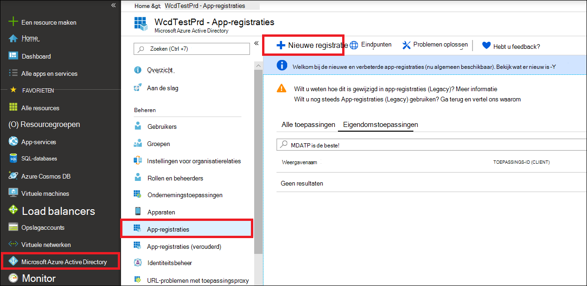

# <a name="partner-access-through-microsoft-defender-for-endpoint-apis"></a><span data-ttu-id="cc2ab-104">Partnertoegang via Microsoft Defender voor eindpunt-API's</span><span class="sxs-lookup"><span data-stu-id="cc2ab-104">Partner access through Microsoft Defender for Endpoint APIs</span></span>

[!INCLUDE [Microsoft 365 Defender rebranding](../../includes/microsoft-defender.md)]


<span data-ttu-id="cc2ab-105">**Van toepassing op:** [Microsoft Defender voor Eindpunt](https://go.microsoft.com/fwlink/?linkid=2154037)</span><span class="sxs-lookup"><span data-stu-id="cc2ab-105">**Applies to:** [Microsoft Defender for Endpoint](https://go.microsoft.com/fwlink/?linkid=2154037)</span></span>

> <span data-ttu-id="cc2ab-106">Wilt u Microsoft Defender voor Eindpunt ervaren?</span><span class="sxs-lookup"><span data-stu-id="cc2ab-106">Want to experience Microsoft Defender for Endpoint?</span></span> [<span data-ttu-id="cc2ab-107">Meld u aan voor een gratis proefabonnement.</span><span class="sxs-lookup"><span data-stu-id="cc2ab-107">Sign up for a free trial.</span></span>](https://www.microsoft.com/microsoft-365/windows/microsoft-defender-atp?ocid=docs-wdatp-exposedapis-abovefoldlink)

[!include[Microsoft Defender for Endpoint API URIs for US Government](../../includes/microsoft-defender-api-usgov.md)]

[!include[Improve request performance](../../includes/improve-request-performance.md)]

<span data-ttu-id="cc2ab-108">Op deze pagina wordt beschreven hoe u een Azure Active Directory-toepassing (Azure AD) maakt om programmatische toegang te krijgen tot Microsoft Defender voor Eindpunt namens uw klanten.</span><span class="sxs-lookup"><span data-stu-id="cc2ab-108">This page describes how to create an Azure Active Directory (Azure AD) application to get programmatic access to Microsoft Defender for Endpoint on behalf of your customers.</span></span>


<span data-ttu-id="cc2ab-109">In Microsoft Defender voor Eindpunt worden veel van de gegevens en acties via een set programmatische API's beschikbaar.</span><span class="sxs-lookup"><span data-stu-id="cc2ab-109">Microsoft Defender for Endpoint exposes much of its data and actions through a set of programmatic APIs.</span></span> <span data-ttu-id="cc2ab-110">Met deze API's kunt u werkstromen automatiseren en innoveren op basis van de mogelijkheden van Microsoft Defender voor eindpunten.</span><span class="sxs-lookup"><span data-stu-id="cc2ab-110">Those APIs will help you automate work flows and innovate based on Microsoft Defender for Endpoint capabilities.</span></span> <span data-ttu-id="cc2ab-111">Voor de API-toegang is OAuth2.0-verificatie vereist.</span><span class="sxs-lookup"><span data-stu-id="cc2ab-111">The API access requires OAuth2.0 authentication.</span></span> <span data-ttu-id="cc2ab-112">Zie [OAuth 2.0 Autorisatiecodestroom](https://docs.microsoft.com/azure/active-directory/develop/active-directory-v2-protocols-oauth-code)voor meer informatie.</span><span class="sxs-lookup"><span data-stu-id="cc2ab-112">For more information, see [OAuth 2.0 Authorization Code Flow](https://docs.microsoft.com/azure/active-directory/develop/active-directory-v2-protocols-oauth-code).</span></span>

<span data-ttu-id="cc2ab-113">Over het algemeen moet u de volgende stappen nemen om de API's te gebruiken:</span><span class="sxs-lookup"><span data-stu-id="cc2ab-113">In general, you’ll need to take the following steps to use the APIs:</span></span>
- <span data-ttu-id="cc2ab-114">Maak een **Azure AD-toepassing met** meerdere tenants.</span><span class="sxs-lookup"><span data-stu-id="cc2ab-114">Create a **multi-tenant** Azure AD application.</span></span>
- <span data-ttu-id="cc2ab-115">Vraag uw klantbeheerder geautoriseerd(toestemming) voor uw toepassing om toegang te krijgen tot Defender voor endpoint-resources die nodig zijn.</span><span class="sxs-lookup"><span data-stu-id="cc2ab-115">Get authorized(consent) by your customer administrator for your application to access Defender for Endpoint resources it needs.</span></span>
- <span data-ttu-id="cc2ab-116">Een toegangs token krijgen met deze toepassing.</span><span class="sxs-lookup"><span data-stu-id="cc2ab-116">Get an access token using this application.</span></span>
- <span data-ttu-id="cc2ab-117">Gebruik het token om toegang te krijgen tot Microsoft Defender voor Endpoint API.</span><span class="sxs-lookup"><span data-stu-id="cc2ab-117">Use the token to access Microsoft Defender for Endpoint API.</span></span>

<span data-ttu-id="cc2ab-118">In de volgende stappen vindt u informatie over het maken van een Azure AD-toepassing, het openen van een token voor Microsoft Defender voor Eindpunt en het valideren van het token.</span><span class="sxs-lookup"><span data-stu-id="cc2ab-118">The following steps will guide you how to create an Azure AD application, get an access token to Microsoft Defender for Endpoint and validate the token.</span></span>

## <a name="create-the-multi-tenant-app"></a><span data-ttu-id="cc2ab-119">De multi-tenant-app maken</span><span class="sxs-lookup"><span data-stu-id="cc2ab-119">Create the multi-tenant app</span></span>

1. <span data-ttu-id="cc2ab-120">Meld u aan bij [uw Azure-tenant](https://portal.azure.com) met een gebruiker met **de rol Globale** beheerder.</span><span class="sxs-lookup"><span data-stu-id="cc2ab-120">Sign in to your [Azure tenant](https://portal.azure.com) with user that has **Global Administrator** role.</span></span>

2. <span data-ttu-id="cc2ab-121">**Navigeer naar Azure Active Directory**  >  **App-registraties** Nieuwe  >  **registratie**.</span><span class="sxs-lookup"><span data-stu-id="cc2ab-121">Navigate to **Azure Active Directory** > **App registrations** > **New registration**.</span></span> 

   

3. <span data-ttu-id="cc2ab-123">In het registratieformulier:</span><span class="sxs-lookup"><span data-stu-id="cc2ab-123">In the registration form:</span></span>

    - <span data-ttu-id="cc2ab-124">Kies een naam voor uw toepassing.</span><span class="sxs-lookup"><span data-stu-id="cc2ab-124">Choose a name for your application.</span></span>

    - <span data-ttu-id="cc2ab-125">Ondersteunde accounttypen: accounts in een organisatiemap.</span><span class="sxs-lookup"><span data-stu-id="cc2ab-125">Supported account types - accounts in any organizational directory.</span></span>

    - <span data-ttu-id="cc2ab-126">Redirect URI - type: Web, URI: https://portal.azure.com</span><span class="sxs-lookup"><span data-stu-id="cc2ab-126">Redirect URI - type: Web, URI: https://portal.azure.com</span></span>

    


4. <span data-ttu-id="cc2ab-128">Geef uw toepassing toegang tot Microsoft Defender voor Eindpunt en wijs deze toe met de minimale set machtigingen die nodig zijn om de integratie te voltooien.</span><span class="sxs-lookup"><span data-stu-id="cc2ab-128">Allow your Application to access Microsoft Defender for Endpoint and assign it with the minimal set of permissions required to complete the integration.</span></span>

   - <span data-ttu-id="cc2ab-129">Selecteer op uw **toepassingspagina API-machtigingen** Machtigingen toevoegen Api's die mijn organisatie gebruikt  >    >   > **WindowsDefenderATP** typen en selecteer op **WindowsDefenderATP**.</span><span class="sxs-lookup"><span data-stu-id="cc2ab-129">On your application page, select **API Permissions** > **Add permission** > **APIs my organization uses** > type **WindowsDefenderATP** and select on **WindowsDefenderATP**.</span></span>

   - <span data-ttu-id="cc2ab-130">**Opmerking:** *WindowsDefenderATP* wordt niet weergegeven in de oorspronkelijke lijst.</span><span class="sxs-lookup"><span data-stu-id="cc2ab-130">**Note**: *WindowsDefenderATP* does not appear in the original list.</span></span> <span data-ttu-id="cc2ab-131">Begin met het schrijven van de naam in het tekstvak om deze weer te geven.</span><span class="sxs-lookup"><span data-stu-id="cc2ab-131">Start writing its name in the text box to see it appear.</span></span>

   
   
   ### <a name="request-api-permissions"></a><span data-ttu-id="cc2ab-133">API-machtigingen aanvragen</span><span class="sxs-lookup"><span data-stu-id="cc2ab-133">Request API permissions</span></span>

   <span data-ttu-id="cc2ab-134">Als u wilt bepalen welke machtiging u nodig hebt, **bekijkt** u de sectie Machtigingen in de API die u wilt bellen.</span><span class="sxs-lookup"><span data-stu-id="cc2ab-134">To determine which permission you need, review the **Permissions** section in the API you are interested to call.</span></span> <span data-ttu-id="cc2ab-135">Bijvoorbeeld:</span><span class="sxs-lookup"><span data-stu-id="cc2ab-135">For instance:</span></span>

   - <span data-ttu-id="cc2ab-136">Als [u geavanceerde query's wilt uitvoeren,](run-advanced-query-api.md)selecteert u 'Geavanceerde query's uitvoeren' machtiging</span><span class="sxs-lookup"><span data-stu-id="cc2ab-136">To [run advanced queries](run-advanced-query-api.md), select 'Run advanced queries' permission</span></span>
   
   - <span data-ttu-id="cc2ab-137">Als [u een apparaat wilt isoleren,](isolate-machine.md)selecteert u machtiging 'Machine isoleren'.</span><span class="sxs-lookup"><span data-stu-id="cc2ab-137">To [isolate a device](isolate-machine.md), select 'Isolate machine' permission</span></span>

   <span data-ttu-id="cc2ab-138">In het volgende voorbeeld gebruiken we de machtiging **'Alle waarschuwingen lezen':**</span><span class="sxs-lookup"><span data-stu-id="cc2ab-138">In the following example we will use **'Read all alerts'** permission:</span></span>

   <span data-ttu-id="cc2ab-139">Kies **Toepassingsmachtigingen**  >  **Alert.Read.All** > selecteren op **Machtigingen toevoegen**</span><span class="sxs-lookup"><span data-stu-id="cc2ab-139">Choose **Application permissions** > **Alert.Read.All** > select on **Add permissions**</span></span>

   


5. <span data-ttu-id="cc2ab-141">Selecteer **Toestemming verlenen**</span><span class="sxs-lookup"><span data-stu-id="cc2ab-141">Select **Grant consent**</span></span>

    - <span data-ttu-id="cc2ab-142">**Opmerking:** Telkens wanneer u machtigingen toevoegt, moet u toestemming **verlenen** selecteren om de nieuwe machtiging van kracht te laten worden.</span><span class="sxs-lookup"><span data-stu-id="cc2ab-142">**Note**: Every time you add permission you must select on **Grant consent** for the new permission to take effect.</span></span>

    

6. <span data-ttu-id="cc2ab-144">Voeg een geheim toe aan de toepassing.</span><span class="sxs-lookup"><span data-stu-id="cc2ab-144">Add a secret to the application.</span></span>

    - <span data-ttu-id="cc2ab-145">Selecteer **Certificaten & geheimen,** voeg beschrijving toe aan het geheim en selecteer **Toevoegen.**</span><span class="sxs-lookup"><span data-stu-id="cc2ab-145">Select **Certificates & secrets**, add description to the secret and select **Add**.</span></span>

    <span data-ttu-id="cc2ab-146">**Belangrijk:** Nadat u op Toevoegen hebt **geklikt, kopieert u de gegenereerde geheime waarde.**</span><span class="sxs-lookup"><span data-stu-id="cc2ab-146">**Important**: After click Add, **copy the generated secret value**.</span></span> <span data-ttu-id="cc2ab-147">U kunt het niet meer ophalen nadat u bent weggehaald.</span><span class="sxs-lookup"><span data-stu-id="cc2ab-147">You won't be able to retrieve after you leave!</span></span>

    

7. <span data-ttu-id="cc2ab-149">Schrijf uw toepassings-id op:</span><span class="sxs-lookup"><span data-stu-id="cc2ab-149">Write down your application ID:</span></span>

   - <span data-ttu-id="cc2ab-150">Ga op de toepassingspagina naar **Overzicht** en kopieer de volgende informatie:</span><span class="sxs-lookup"><span data-stu-id="cc2ab-150">On your application page, go to **Overview** and copy the following information:</span></span>

   

8. <span data-ttu-id="cc2ab-152">Voeg de toepassing toe aan de tenant van uw klant.</span><span class="sxs-lookup"><span data-stu-id="cc2ab-152">Add the application to your customer's tenant.</span></span>

    <span data-ttu-id="cc2ab-153">U moet uw toepassing goedkeuren in elke klant tenant waar u deze wilt gebruiken.</span><span class="sxs-lookup"><span data-stu-id="cc2ab-153">You need your application to be approved in each customer tenant where you intend to use it.</span></span> <span data-ttu-id="cc2ab-154">Dit komt omdat uw toepassing namens uw klant samenwerkt met de toepassing Microsoft Defender voor Eindpunt.</span><span class="sxs-lookup"><span data-stu-id="cc2ab-154">This is because your application interacts with Microsoft Defender for Endpoint application on behalf of your customer.</span></span>

    <span data-ttu-id="cc2ab-155">Een gebruiker met **globale beheerder** van de tenant van uw klant moet de toestemmingskoppeling selecteren en uw toepassing goedkeuren.</span><span class="sxs-lookup"><span data-stu-id="cc2ab-155">A user with **Global Administrator** from your customer's tenant need to select the consent link and approve your application.</span></span>

    <span data-ttu-id="cc2ab-156">De koppeling Toestemming is van het formulier:</span><span class="sxs-lookup"><span data-stu-id="cc2ab-156">Consent link is of the form:</span></span>

    ```
    https://login.microsoftonline.com/common/oauth2/authorize?prompt=consent&client_id=00000000-0000-0000-0000-000000000000&response_type=code&sso_reload=true
    ```

    <span data-ttu-id="cc2ab-157">Waar 000000000-0000-0000-0000-00000000000 moet worden vervangen door uw toepassings-id</span><span class="sxs-lookup"><span data-stu-id="cc2ab-157">Where 00000000-0000-0000-0000-000000000000 should be replaced with your Application ID</span></span>

    <span data-ttu-id="cc2ab-158">Nadat u op de toestemmingskoppeling hebt geklikt, meldt u zich aan bij de globale beheerder van de tenant van de klant en stemt u in met de toepassing.</span><span class="sxs-lookup"><span data-stu-id="cc2ab-158">After clicking on the consent link, sign in with the Global Administrator of the customer's tenant and consent the application.</span></span>

    

    <span data-ttu-id="cc2ab-160">Daarnaast moet u uw klant om zijn of haar tenant-id vragen en deze opslaan voor toekomstig gebruik bij het aanschaffen van het token.</span><span class="sxs-lookup"><span data-stu-id="cc2ab-160">In addition, you will need to ask your customer for their tenant ID and save it for future use when acquiring the token.</span></span>

- <span data-ttu-id="cc2ab-161">**Klaar!**</span><span class="sxs-lookup"><span data-stu-id="cc2ab-161">**Done!**</span></span> <span data-ttu-id="cc2ab-162">U hebt een toepassing geregistreerd.</span><span class="sxs-lookup"><span data-stu-id="cc2ab-162">You have successfully registered an application!</span></span> 
- <span data-ttu-id="cc2ab-163">Zie hieronder voorbeelden voor het verkrijgen en valideren van tokens.</span><span class="sxs-lookup"><span data-stu-id="cc2ab-163">See examples below for token acquisition and validation.</span></span>

## <a name="get-an-access-token-example"></a><span data-ttu-id="cc2ab-164">Een voorbeeld van toegangs token krijgen:</span><span class="sxs-lookup"><span data-stu-id="cc2ab-164">Get an access token example:</span></span>

<span data-ttu-id="cc2ab-165">**Opmerking:** Als u namens uw klant toegang wilt krijgen tot het token, gebruikt u de tenant-id van de klant voor de volgende tokenovernames.</span><span class="sxs-lookup"><span data-stu-id="cc2ab-165">**Note:** To get access token on behalf of your customer, use the customer's tenant ID on the following token acquisitions.</span></span>

<br><span data-ttu-id="cc2ab-166">Zie AAD-zelfstudie voor meer informatie over [AAD-token](https://docs.microsoft.com/azure/active-directory/develop/active-directory-v2-protocols-oauth-client-creds)</span><span class="sxs-lookup"><span data-stu-id="cc2ab-166">For more information on AAD token, see [AAD tutorial](https://docs.microsoft.com/azure/active-directory/develop/active-directory-v2-protocols-oauth-client-creds)</span></span>

### <a name="using-powershell"></a><span data-ttu-id="cc2ab-167">PowerShell gebruiken</span><span class="sxs-lookup"><span data-stu-id="cc2ab-167">Using PowerShell</span></span>

```
# That code gets the App Context Token and save it to a file named "Latest-token.txt" under the current directory
# Paste below your Tenant ID, App ID and App Secret (App key).

$tenantId = '' ### Paste your tenant ID here
$appId = '' ### Paste your Application ID here
$appSecret = '' ### Paste your Application key here

$resourceAppIdUri = 'https://api.securitycenter.microsoft.com'
$oAuthUri = "https://login.microsoftonline.com/$TenantId/oauth2/token"
$authBody = [Ordered] @{
    resource = "$resourceAppIdUri"
    client_id = "$appId"
    client_secret = "$appSecret"
    grant_type = 'client_credentials'
}
$authResponse = Invoke-RestMethod -Method Post -Uri $oAuthUri -Body $authBody -ErrorAction Stop
$token = $authResponse.access_token
Out-File -FilePath "./Latest-token.txt" -InputObject $token
return $token
```

### <a name="using-c"></a><span data-ttu-id="cc2ab-168">Using C#:</span><span class="sxs-lookup"><span data-stu-id="cc2ab-168">Using C#:</span></span>

><span data-ttu-id="cc2ab-169">De onderstaande code is getest met Nuget Microsoft.IdentityModel.Clients.ActiveDirectory</span><span class="sxs-lookup"><span data-stu-id="cc2ab-169">The below code was tested with Nuget Microsoft.IdentityModel.Clients.ActiveDirectory</span></span>

- <span data-ttu-id="cc2ab-170">Een nieuwe consoletoepassing maken</span><span class="sxs-lookup"><span data-stu-id="cc2ab-170">Create a new Console Application</span></span>
- <span data-ttu-id="cc2ab-171">NuGet [Microsoft.IdentityModel.Clients.ActiveDirectory installeren](https://www.nuget.org/packages/Microsoft.IdentityModel.Clients.ActiveDirectory/)</span><span class="sxs-lookup"><span data-stu-id="cc2ab-171">Install NuGet [Microsoft.IdentityModel.Clients.ActiveDirectory](https://www.nuget.org/packages/Microsoft.IdentityModel.Clients.ActiveDirectory/)</span></span>
- <span data-ttu-id="cc2ab-172">Het onderstaande toevoegen met behulp van</span><span class="sxs-lookup"><span data-stu-id="cc2ab-172">Add the below using</span></span>

    ```
    using Microsoft.IdentityModel.Clients.ActiveDirectory;
    ```

- <span data-ttu-id="cc2ab-173">Kopieer/plak de onderstaande code in uw toepassing (vergeet niet om de drie variabelen bij te werken: ```tenantId, appId, appSecret``` )</span><span class="sxs-lookup"><span data-stu-id="cc2ab-173">Copy/Paste the below code in your application (do not forget to update the three variables: ```tenantId, appId, appSecret```)</span></span>

    ```
    string tenantId = "00000000-0000-0000-0000-000000000000"; // Paste your own tenant ID here
    string appId = "11111111-1111-1111-1111-111111111111"; // Paste your own app ID here
    string appSecret = "22222222-2222-2222-2222-222222222222"; // Paste your own app secret here for a test, and then store it in a safe place! 

    const string authority = "https://login.microsoftonline.com";
    const string wdatpResourceId = "https://api.securitycenter.microsoft.com";

    AuthenticationContext auth = new AuthenticationContext($"{authority}/{tenantId}/");
    ClientCredential clientCredential = new ClientCredential(appId, appSecret);
    AuthenticationResult authenticationResult = auth.AcquireTokenAsync(wdatpResourceId, clientCredential).GetAwaiter().GetResult();
    string token = authenticationResult.AccessToken;
    ```


### <a name="using-python"></a><span data-ttu-id="cc2ab-174">Python gebruiken</span><span class="sxs-lookup"><span data-stu-id="cc2ab-174">Using Python</span></span>

<span data-ttu-id="cc2ab-175">Raadpleeg [Token halen met Python](run-advanced-query-sample-python.md#get-token)</span><span class="sxs-lookup"><span data-stu-id="cc2ab-175">Refer to [Get token using Python](run-advanced-query-sample-python.md#get-token)</span></span>

### <a name="using-curl"></a><span data-ttu-id="cc2ab-176">Curl gebruiken</span><span class="sxs-lookup"><span data-stu-id="cc2ab-176">Using Curl</span></span>

> [!NOTE]
> <span data-ttu-id="cc2ab-177">De onderstaande procedure met de bedoeling Curl voor Windows is al geïnstalleerd op uw computer</span><span class="sxs-lookup"><span data-stu-id="cc2ab-177">The below procedure supposed Curl for Windows is already installed on your computer</span></span>

- <span data-ttu-id="cc2ab-178">Een opdrachtvenster openen</span><span class="sxs-lookup"><span data-stu-id="cc2ab-178">Open a command window</span></span>
- <span data-ttu-id="cc2ab-179">Uw CLIENT_ID op uw Azure-toepassing-id instellen</span><span class="sxs-lookup"><span data-stu-id="cc2ab-179">Set CLIENT_ID to your Azure application ID</span></span>
- <span data-ttu-id="cc2ab-180">Uw CLIENT_SECRET op uw Azure-toepassingsgeheim instellen</span><span class="sxs-lookup"><span data-stu-id="cc2ab-180">Set CLIENT_SECRET to your Azure application secret</span></span>
- <span data-ttu-id="cc2ab-181">De TENANT_ID instellen op de Azure-tenant-id van de klant die uw toepassing wil gebruiken voor toegang tot microsoft Defender voor eindpunttoepassing</span><span class="sxs-lookup"><span data-stu-id="cc2ab-181">Set TENANT_ID to the Azure tenant ID of the customer that wants to use your application to access Microsoft Defender for Endpoint application</span></span>
- <span data-ttu-id="cc2ab-182">Voer de onderstaande opdracht uit:</span><span class="sxs-lookup"><span data-stu-id="cc2ab-182">Run the below command:</span></span>

```
curl -i -X POST -H "Content-Type:application/x-www-form-urlencoded" -d "grant_type=client_credentials" -d "client_id=%CLIENT_ID%" -d "scope=https://securitycenter.onmicrosoft.com/windowsatpservice/.default" -d "client_secret=%CLIENT_SECRET%" "https://login.microsoftonline.com/%TENANT_ID%/oauth2/v2.0/token" -k
```

<span data-ttu-id="cc2ab-183">U krijgt een antwoord van het formulier:</span><span class="sxs-lookup"><span data-stu-id="cc2ab-183">You will get an answer of the form:</span></span>

```
{"token_type":"Bearer","expires_in":3599,"ext_expires_in":0,"access_token":"eyJ0eXAiOiJKV1QiLCJhbGciOiJSUzI1NiIsIn <truncated> aWReH7P0s0tjTBX8wGWqJUdDA"}
```

## <a name="validate-the-token"></a><span data-ttu-id="cc2ab-184">Het token valideren</span><span class="sxs-lookup"><span data-stu-id="cc2ab-184">Validate the token</span></span>

<span data-ttu-id="cc2ab-185">Sanity check om er zeker van te zijn dat u een correct token hebt:</span><span class="sxs-lookup"><span data-stu-id="cc2ab-185">Sanity check to make sure you got a correct token:</span></span>
- <span data-ttu-id="cc2ab-186">Kopieer/plak in [JWT het](https://jwt.ms) token dat u in de vorige stap krijgt om het te decoderen</span><span class="sxs-lookup"><span data-stu-id="cc2ab-186">Copy/paste into [JWT](https://jwt.ms) the token you get in the previous step in order to decode it</span></span>
- <span data-ttu-id="cc2ab-187">Valideren u krijgt een 'rollen' claim met de gewenste machtigingen</span><span class="sxs-lookup"><span data-stu-id="cc2ab-187">Validate you get a 'roles' claim with the desired permissions</span></span>
- <span data-ttu-id="cc2ab-188">In de onderstaande schermafbeelding ziet u een gedecodeerd token dat is verkregen van een toepassing met meerdere machtigingen voor Microsoft Defender voor Eindpunt:</span><span class="sxs-lookup"><span data-stu-id="cc2ab-188">In the screenshot below, you can see a decoded token acquired from an Application with multiple permissions to  Microsoft Defender for Endpoint:</span></span>
- <span data-ttu-id="cc2ab-189">De claim 'tid' is de tenant-id van het token.</span><span class="sxs-lookup"><span data-stu-id="cc2ab-189">The "tid" claim is the tenant ID the token belongs to.</span></span>


## <a name="use-the-token-to-access-microsoft-defender-for-endpoint-api"></a><span data-ttu-id="cc2ab-191">Het token gebruiken om toegang te krijgen tot Microsoft Defender voor Endpoint API</span><span class="sxs-lookup"><span data-stu-id="cc2ab-191">Use the token to access Microsoft Defender for Endpoint API</span></span>

- <span data-ttu-id="cc2ab-192">Kies de API die u wilt gebruiken, zie Ondersteunde API's van [Microsoft Defender voor eindpunten](exposed-apis-list.md) voor meer informatie</span><span class="sxs-lookup"><span data-stu-id="cc2ab-192">Choose the API you want to use, for more information, see [Supported Microsoft Defender for Endpoint APIs](exposed-apis-list.md)</span></span>
- <span data-ttu-id="cc2ab-193">De autorisatiekoptekst instellen in de http-aanvraag die u verzendt naar 'Bearer {token}' (Aandrager is het autorisatieschema)</span><span class="sxs-lookup"><span data-stu-id="cc2ab-193">Set the Authorization header in the Http request you send to "Bearer {token}" (Bearer is the Authorization scheme)</span></span>
- <span data-ttu-id="cc2ab-194">De vervaldatum van het token is 1 uur (u kunt meerdere aanvragen met hetzelfde token verzenden)</span><span class="sxs-lookup"><span data-stu-id="cc2ab-194">The Expiration time of the token is 1 hour (you can send more than one request with the same token)</span></span>

- <span data-ttu-id="cc2ab-195">Voorbeeld van het verzenden van een aanvraag voor het ontvangen van een lijst met waarschuwingen **met C#**</span><span class="sxs-lookup"><span data-stu-id="cc2ab-195">Example of sending a request to get a list of alerts **using C#**</span></span> 
    ```
    var httpClient = new HttpClient();

    var request = new HttpRequestMessage(HttpMethod.Get, "https://api.securitycenter.microsoft.com/api/alerts");

    request.Headers.Authorization = new AuthenticationHeaderValue("Bearer", token);

    var response = httpClient.SendAsync(request).GetAwaiter().GetResult();

    // Do something useful with the response
    ```

## <a name="see-also"></a><span data-ttu-id="cc2ab-196">Zie ook</span><span class="sxs-lookup"><span data-stu-id="cc2ab-196">See also</span></span>
- [<span data-ttu-id="cc2ab-197">Ondersteunde API's voor Microsoft Defender voor eindpunten</span><span class="sxs-lookup"><span data-stu-id="cc2ab-197">Supported Microsoft Defender for Endpoint APIs</span></span>](exposed-apis-list.md)
- [<span data-ttu-id="cc2ab-198">Toegang tot Microsoft Defender voor Eindpunt namens een gebruiker</span><span class="sxs-lookup"><span data-stu-id="cc2ab-198">Access Microsoft Defender for Endpoint on behalf of a user</span></span>](exposed-apis-create-app-nativeapp.md)
