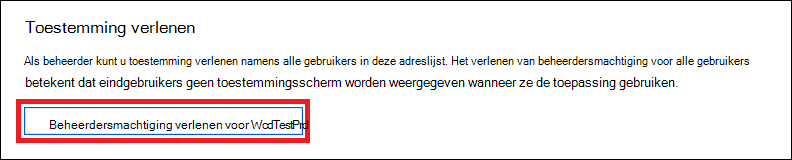
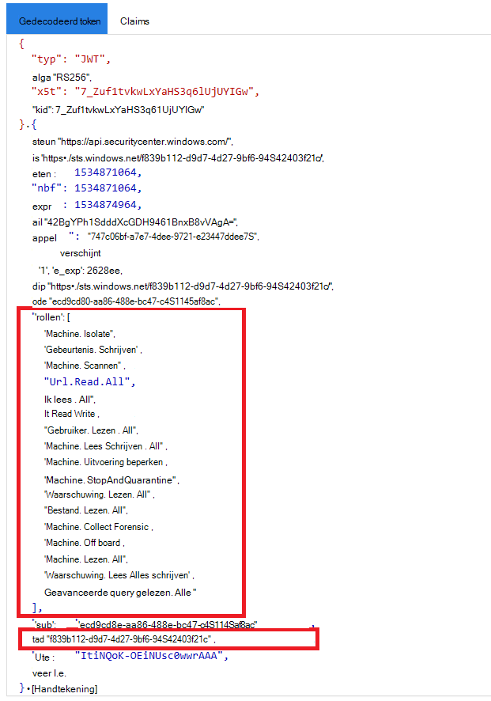

# <a name="partner-access-through-microsoft-defender-for-endpoint-apis"></a>Partnertoegang via Microsoft Defender voor eindpunt-API's

[!INCLUDE [Microsoft 365 Defender rebranding](../../includes/microsoft-defender.md)]


**Van toepassing op:** [Microsoft Defender voor Eindpunt](https://go.microsoft.com/fwlink/?linkid=2154037)

> Wilt u Microsoft Defender voor Eindpunt ervaren? [Meld u aan voor een gratis proefversie.](https://www.microsoft.com/microsoft-365/windows/microsoft-defender-atp?ocid=docs-wdatp-exposedapis-abovefoldlink)

[!include[Microsoft Defender for Endpoint API URIs for US Government](../../includes/microsoft-defender-api-usgov.md)]

[!include[Improve request performance](../../includes/improve-request-performance.md)]

Op deze pagina wordt beschreven hoe u een Azure Active Directory (Azure AD) maakt om programmatische toegang te krijgen tot Microsoft Defender voor Eindpunt namens uw klanten.


In Microsoft Defender voor Eindpunt worden veel van de gegevens en acties via een set programmatische API's beschikbaar. Met deze API's kunt u werkstromen automatiseren en innoveren op basis van de mogelijkheden van Microsoft Defender voor eindpunten. Voor de API-toegang is OAuth2.0-verificatie vereist. Zie [OAuth 2.0 Autorisatiecode](/azure/active-directory/develop/active-directory-v2-protocols-oauth-code)voor Flow.

Over het algemeen moet u de volgende stappen nemen om de API's te gebruiken:
- Maak een **Azure AD-toepassing met** meerdere tenants.
- Vraag uw klantbeheerder geautoriseerd(toestemming) voor uw toepassing om toegang te krijgen tot Defender voor endpoint-resources die nodig zijn.
- Een toegangs token krijgen met deze toepassing.
- Gebruik het token om toegang te krijgen tot Microsoft Defender voor Endpoint API.

In de volgende stappen vindt u informatie over het maken van een Azure AD-toepassing, het openen van een token voor Microsoft Defender voor Eindpunt en het valideren van het token.

## <a name="create-the-multi-tenant-app"></a>De multi-tenant-app maken

1. Meld u aan bij [uw Azure-tenant](https://portal.azure.com) met een gebruiker met **de rol Globale** beheerder.

2. Navigeer **naar Azure Active Directory**  >  **app-registraties Nieuwe**  >  **registratie**. 

   

3. In het registratieformulier:

   - Kies een naam voor uw toepassing.

   - Ondersteunde accounttypen: accounts in een organisatiemap.

   - Redirect URI - type: Web, URI: https://portal.azure.com

   


4. Geef uw toepassing toegang tot Microsoft Defender voor Eindpunt en wijs deze toe met de minimale set machtigingen die nodig zijn om de integratie te voltooien.

   - Selecteer op uw **toepassingspagina API-machtigingen** Machtigingen toevoegen Api's die mijn organisatie gebruikt  >    >   > **WindowsDefenderATP** typen en selecteer op **WindowsDefenderATP**.

   - **Opmerking:** *WindowsDefenderATP* wordt niet weergegeven in de oorspronkelijke lijst. Begin met het schrijven van de naam in het tekstvak om deze weer te geven.

   
   
   ### <a name="request-api-permissions"></a>API-machtigingen aanvragen

   Als u wilt bepalen welke machtiging u nodig hebt, **bekijkt** u de sectie Machtigingen in de API die u wilt bellen. Bijvoorbeeld:

   - Als [u geavanceerde query's wilt uitvoeren,](run-advanced-query-api.md)selecteert u 'Geavanceerde query's uitvoeren' machtiging
   
   - Als [u een apparaat wilt isoleren,](isolate-machine.md)selecteert u machtiging 'Machine isoleren'.

   In het volgende voorbeeld gebruiken we de machtiging **'Alle waarschuwingen lezen':**

   Kies **Toepassingsmachtigingen**  >  **Alert.Read.All** > selecteren op **Machtigingen toevoegen**

   


5. Selecteer **Toestemming verlenen**

   - **Opmerking:** Telkens wanneer u machtigingen toevoegt, moet u toestemming **verlenen** selecteren om de nieuwe machtiging van kracht te laten worden.

   

6. Voeg een geheim toe aan de toepassing.

   - Selecteer **Certificaten & geheimen,** voeg beschrijving toe aan het geheim en selecteer **Toevoegen.**

    **Belangrijk:** Nadat u op Toevoegen hebt **geklikt, kopieert u de gegenereerde geheime waarde.** U kunt het niet meer ophalen nadat u bent weggehaald.

    

7. Schrijf uw toepassings-id op:

   - Ga op de toepassingspagina naar **Overzicht** en kopieer de volgende informatie:

   

8. Voeg de toepassing toe aan de tenant van uw klant.

   U moet uw toepassing goedkeuren in elke klant tenant waar u deze wilt gebruiken. Dit komt omdat uw toepassing namens uw klant samenwerkt met de toepassing Microsoft Defender voor Eindpunt.

   Een gebruiker met **globale beheerder** van de tenant van uw klant moet de toestemmingskoppeling selecteren en uw toepassing goedkeuren.

   De koppeling Toestemming is van het formulier:

   ```http
   https://login.microsoftonline.com/common/oauth2/authorize?prompt=consent&client_id=00000000-0000-0000-0000-000000000000&response_type=code&sso_reload=true
   ```

   Waar 000000000-0000-0000-0000-00000000000 moet worden vervangen door uw toepassings-id

   Nadat u op de toestemmingskoppeling hebt geklikt, meldt u zich aan bij de globale beheerder van de tenant van de klant en stemt u in met de toepassing.

   

   Daarnaast moet u uw klant om zijn of haar tenant-id vragen en deze opslaan voor toekomstig gebruik bij het aanschaffen van het token.

- **Klaar!** U hebt een toepassing geregistreerd.
- Zie hieronder voorbeelden voor het verkrijgen en valideren van tokens.

## <a name="get-an-access-token-example"></a>Voorbeeld van toegangs token

**Opmerking:** Als u namens uw klant toegang wilt krijgen tot het token, gebruikt u de tenant-id van de klant voor de volgende tokenovernames.

Zie AAD-zelfstudie voor meer informatie over [AAD-token](/azure/active-directory/develop/active-directory-v2-protocols-oauth-client-creds)

### <a name="using-powershell"></a>PowerShell gebruiken

```powershell
# That code gets the App Context Token and save it to a file named "Latest-token.txt" under the current directory
# Paste below your Tenant ID, App ID and App Secret (App key).

$tenantId = '' ### Paste your tenant ID here
$appId = '' ### Paste your Application ID here
$appSecret = '' ### Paste your Application key here

$resourceAppIdUri = 'https://api.securitycenter.microsoft.com'
$oAuthUri = "https://login.microsoftonline.com/$TenantId/oauth2/token"
$authBody = [Ordered] @{
    resource = "$resourceAppIdUri"
    client_id = "$appId"
    client_secret = "$appSecret"
    grant_type = 'client_credentials'
}
$authResponse = Invoke-RestMethod -Method Post -Uri $oAuthUri -Body $authBody -ErrorAction Stop
$token = $authResponse.access_token
Out-File -FilePath "./Latest-token.txt" -InputObject $token
return $token
```

### <a name="using-c"></a>C gebruiken #

> De onderstaande code is getest met Nuget Microsoft.IdentityModel.Clients.ActiveDirectory

- Een nieuwe consoletoepassing maken
- NuGet [Microsoft.IdentityModel.Clients.ActiveDirectory installeren](https://www.nuget.org/packages/Microsoft.IdentityModel.Clients.ActiveDirectory/)
- Het onderstaande toevoegen met behulp van

    ```console
    using Microsoft.IdentityModel.Clients.ActiveDirectory;
    ```

- Kopieer/plak de onderstaande code in uw toepassing (vergeet niet om de drie variabelen bij te werken: `tenantId` `appId` , en `appSecret` )

    ```console
    string tenantId = "00000000-0000-0000-0000-000000000000"; // Paste your own tenant ID here
    string appId = "11111111-1111-1111-1111-111111111111"; // Paste your own app ID here
    string appSecret = "22222222-2222-2222-2222-222222222222"; // Paste your own app secret here for a test, and then store it in a safe place! 

    const string authority = "https://login.microsoftonline.com";
    const string wdatpResourceId = "https://api.securitycenter.microsoft.com";

    AuthenticationContext auth = new AuthenticationContext($"{authority}/{tenantId}/");
    ClientCredential clientCredential = new ClientCredential(appId, appSecret);
    AuthenticationResult authenticationResult = auth.AcquireTokenAsync(wdatpResourceId, clientCredential).GetAwaiter().GetResult();
    string token = authenticationResult.AccessToken;
    ```

### <a name="using-python"></a>Python gebruiken

Raadpleeg [Token halen met Python](run-advanced-query-sample-python.md#get-token)

### <a name="using-curl"></a>Curl gebruiken

> [!NOTE]
> De onderstaande procedure die Curl voor Windows is al geïnstalleerd op uw computer

- Een opdrachtvenster openen
- Uw CLIENT_ID op uw Azure-toepassing-id instellen
- Uw CLIENT_SECRET op uw Azure-toepassingsgeheim instellen
- De TENANT_ID instellen op de Azure-tenant-id van de klant die uw toepassing wil gebruiken voor toegang tot microsoft Defender voor eindpunttoepassing
- Voer de onderstaande opdracht uit:

```curl
curl -i -X POST -H "Content-Type:application/x-www-form-urlencoded" -d "grant_type=client_credentials" -d "client_id=%CLIENT_ID%" -d "scope=https://securitycenter.onmicrosoft.com/windowsatpservice/.default" -d "client_secret=%CLIENT_SECRET%" "https://login.microsoftonline.com/%TENANT_ID%/oauth2/v2.0/token" -k
```

U krijgt een antwoord van het formulier:

```console
{"token_type":"Bearer","expires_in":3599,"ext_expires_in":0,"access_token":"eyJ0eXAiOiJKV1QiLCJhbGciOiJSUzI1NiIsIn <truncated> aWReH7P0s0tjTBX8wGWqJUdDA"}
```

## <a name="validate-the-token"></a>Het token valideren

Sanity check om er zeker van te zijn dat u een correct token hebt:

- Kopieer/plak in [JWT het](https://jwt.ms) token dat u in de vorige stap krijgt om het te decoderen
- Valideren u krijgt een 'rollen' claim met de gewenste machtigingen
- In de onderstaande schermafbeelding ziet u een gedecodeerd token dat is verkregen van een toepassing met meerdere machtigingen voor Microsoft Defender voor Eindpunt:
- De claim 'tid' is de tenant-id van het token.



## <a name="use-the-token-to-access-microsoft-defender-for-endpoint-api"></a>Het token gebruiken om toegang te krijgen tot Microsoft Defender voor Endpoint API

- Kies de API die u wilt gebruiken, zie Ondersteunde API's van [Microsoft Defender voor eindpunten](exposed-apis-list.md) voor meer informatie
- De autorisatiekoptekst instellen in de http-aanvraag die u verzendt naar 'Bearer {token}' (Aandrager is het autorisatieschema)
- De vervaldatum van het token is 1 uur (u kunt meerdere aanvragen met hetzelfde token verzenden)

- Voorbeeld van het verzenden van een aanvraag voor het ontvangen van een lijst met waarschuwingen **met C#**

    ```csharp
    var httpClient = new HttpClient();

    var request = new HttpRequestMessage(HttpMethod.Get, "https://api.securitycenter.microsoft.com/api/alerts");

    request.Headers.Authorization = new AuthenticationHeaderValue("Bearer", token);

    var response = httpClient.SendAsync(request).GetAwaiter().GetResult();

    // Do something useful with the response
    ```

## <a name="see-also"></a>Zie ook

- [Ondersteunde API's voor Microsoft Defender voor Eindpunt](exposed-apis-list.md)
- [Toegang tot Microsoft Defender voor Eindpunt namens een gebruiker](exposed-apis-create-app-nativeapp.md)
