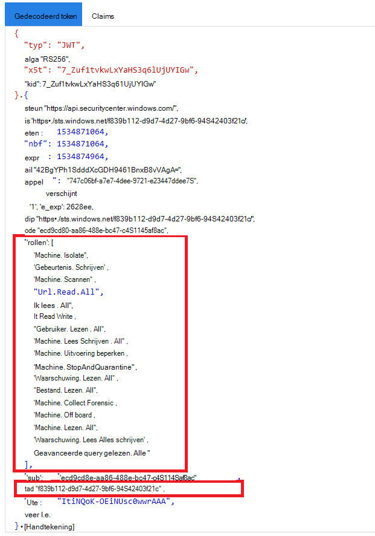

# <a name="create-an-app-to-access-microsoft-defender-for-endpoint-without-a-user"></a><span data-ttu-id="c580c-104">Een app maken voor toegang tot Microsoft Defender voor Eindpunt zonder een gebruiker</span><span class="sxs-lookup"><span data-stu-id="c580c-104">Create an app to access Microsoft Defender for Endpoint without a user</span></span>

[!INCLUDE [Microsoft 365 Defender rebranding](../../includes/microsoft-defender.md)]


<span data-ttu-id="c580c-105">**Van toepassing op:** [Microsoft Defender voor Eindpunt](https://go.microsoft.com/fwlink/?linkid=2154037)</span><span class="sxs-lookup"><span data-stu-id="c580c-105">**Applies to:** [Microsoft Defender for Endpoint](https://go.microsoft.com/fwlink/?linkid=2154037)</span></span>

- <span data-ttu-id="c580c-106">Wilt u Microsoft Defender voor Eindpunt ervaren?</span><span class="sxs-lookup"><span data-stu-id="c580c-106">Want to experience Microsoft Defender for Endpoint?</span></span> [<span data-ttu-id="c580c-107">Meld u aan voor een gratis proefabonnement.</span><span class="sxs-lookup"><span data-stu-id="c580c-107">Sign up for a free trial.</span></span>](https://www.microsoft.com/microsoft-365/windows/microsoft-defender-atp?ocid=docs-wdatp-exposedapis-abovefoldlink)

[!include[Microsoft Defender for Endpoint API URIs for US Government](../../includes/microsoft-defender-api-usgov.md)]

[!include[Improve request performance](../../includes/improve-request-performance.md)]

<span data-ttu-id="c580c-108">Op deze pagina wordt beschreven hoe u een toepassing maakt om programmatische toegang te krijgen tot Defender voor Eindpunt zonder een gebruiker.</span><span class="sxs-lookup"><span data-stu-id="c580c-108">This page describes how to create an application to get programmatic access to Defender for Endpoint without a user.</span></span> <span data-ttu-id="c580c-109">Zie Toegang krijgen met gebruikerscontext als u programmatische toegang nodig hebt tot Defender for Endpoint namens [een gebruiker.](exposed-apis-create-app-nativeapp.md)</span><span class="sxs-lookup"><span data-stu-id="c580c-109">If you need programmatic access to Defender for Endpoint on behalf of a user, see [Get access with user context](exposed-apis-create-app-nativeapp.md).</span></span> <span data-ttu-id="c580c-110">Zie Aan de slag als u niet zeker weet welke toegang u [nodig hebt.](apis-intro.md)</span><span class="sxs-lookup"><span data-stu-id="c580c-110">If you are not sure which access you need, see [Get started](apis-intro.md).</span></span>

<span data-ttu-id="c580c-111">In Microsoft Defender voor Eindpunt worden veel van de gegevens en acties via een set programmatische API's beschikbaar.</span><span class="sxs-lookup"><span data-stu-id="c580c-111">Microsoft Defender for Endpoint exposes much of its data and actions through a set of programmatic APIs.</span></span> <span data-ttu-id="c580c-112">Met deze API's kunt u werkstromen automatiseren en innoveren op basis van De mogelijkheden van Defender voor eindpunten.</span><span class="sxs-lookup"><span data-stu-id="c580c-112">Those APIs will help you automate work flows and innovate based on Defender for Endpoint capabilities.</span></span> <span data-ttu-id="c580c-113">Voor de API-toegang is OAuth2.0-verificatie vereist.</span><span class="sxs-lookup"><span data-stu-id="c580c-113">The API access requires OAuth2.0 authentication.</span></span> <span data-ttu-id="c580c-114">Zie [OAuth 2.0 Autorisatiecode](https://docs.microsoft.com/azure/active-directory/develop/active-directory-v2-protocols-oauth-code)voor Flow.</span><span class="sxs-lookup"><span data-stu-id="c580c-114">For more information, see [OAuth 2.0 Authorization Code Flow](https://docs.microsoft.com/azure/active-directory/develop/active-directory-v2-protocols-oauth-code).</span></span>

<span data-ttu-id="c580c-115">Over het algemeen moet u de volgende stappen nemen om de API's te gebruiken:</span><span class="sxs-lookup"><span data-stu-id="c580c-115">In general, you’ll need to take the following steps to use the APIs:</span></span>
- <span data-ttu-id="c580c-116">Maak een Azure Active Directory (Azure AD)-toepassing.</span><span class="sxs-lookup"><span data-stu-id="c580c-116">Create an Azure Active Directory (Azure AD) application.</span></span>
- <span data-ttu-id="c580c-117">Een toegangs token krijgen met deze toepassing.</span><span class="sxs-lookup"><span data-stu-id="c580c-117">Get an access token using this application.</span></span>
- <span data-ttu-id="c580c-118">Gebruik het token om toegang te krijgen tot Defender voor Endpoint API.</span><span class="sxs-lookup"><span data-stu-id="c580c-118">Use the token to access Defender for Endpoint API.</span></span>

<span data-ttu-id="c580c-119">In dit artikel wordt uitgelegd hoe u een Azure AD-toepassing maakt, toegang krijgt tot Microsoft Defender voor Eindpunt en het token valideert.</span><span class="sxs-lookup"><span data-stu-id="c580c-119">This article explains how to create an Azure AD application, get an access token to Microsoft Defender for Endpoint, and validate the token.</span></span>

## <a name="create-an-app"></a><span data-ttu-id="c580c-120">Een app maken</span><span class="sxs-lookup"><span data-stu-id="c580c-120">Create an app</span></span>

1. <span data-ttu-id="c580c-121">Meld u aan [bij Azure](https://portal.azure.com) met een gebruiker met de rol **Globale beheerder.**</span><span class="sxs-lookup"><span data-stu-id="c580c-121">Log on to [Azure](https://portal.azure.com) with a user that has the **Global Administrator** role.</span></span>

2. <span data-ttu-id="c580c-122">Navigeer **naar Azure Active Directory**  >  **app-registraties Nieuwe**  >  **registratie**.</span><span class="sxs-lookup"><span data-stu-id="c580c-122">Navigate to **Azure Active Directory** > **App registrations** > **New registration**.</span></span> 

   

3. <span data-ttu-id="c580c-124">Kies in het registratieformulier een naam voor uw toepassing en selecteer vervolgens **Registreren.**</span><span class="sxs-lookup"><span data-stu-id="c580c-124">In the registration form, choose a name for your application, and then select **Register**.</span></span>

4. <span data-ttu-id="c580c-125">Als u uw app toegang wilt geven tot Defender voor Eindpunt en deze machtiging **'Alle** waarschuwingen lezen' wilt toewijzen, selecteert u op de **toepassingspagina** API-machtigingen Machtigingen toevoegen API's die mijn organisatie  >    >   > gebruikt, typt u **WindowsDefenderATP** en selecteert u **vervolgens WindowsDefenderATP**.</span><span class="sxs-lookup"><span data-stu-id="c580c-125">To enable your app to access Defender for Endpoint and assign it **'Read all alerts'** permission, on your application page, select **API Permissions** > **Add permission** > **APIs my organization uses** >, type **WindowsDefenderATP**, and then select **WindowsDefenderATP**.</span></span>

   > [!NOTE]
   > <span data-ttu-id="c580c-126">*WindowsDefenderATP* wordt niet weergegeven in de oorspronkelijke lijst.</span><span class="sxs-lookup"><span data-stu-id="c580c-126">*WindowsDefenderATP* does not appear in the original list.</span></span> <span data-ttu-id="c580c-127">Begin met het schrijven van de naam in het tekstvak om deze weer te geven.</span><span class="sxs-lookup"><span data-stu-id="c580c-127">Start writing its name in the text box to see it appear.</span></span>

   

   - <span data-ttu-id="c580c-129">Selecteer **Toepassingsmachtigingen**  >  **Alert.Read.All** en selecteer **vervolgens Machtigingen toevoegen.**</span><span class="sxs-lookup"><span data-stu-id="c580c-129">Select **Application permissions** > **Alert.Read.All**, and then select **Add permissions**.</span></span>

   

     <span data-ttu-id="c580c-131">U moet de relevante machtigingen selecteren.</span><span class="sxs-lookup"><span data-stu-id="c580c-131">You need to select the relevant permissions.</span></span> <span data-ttu-id="c580c-132">'Alle waarschuwingen lezen' is slechts een voorbeeld.</span><span class="sxs-lookup"><span data-stu-id="c580c-132">'Read All Alerts' is only an example.</span></span> <span data-ttu-id="c580c-133">Bijvoorbeeld:</span><span class="sxs-lookup"><span data-stu-id="c580c-133">For instance:</span></span>

     - <span data-ttu-id="c580c-134">Als [u geavanceerde query's wilt uitvoeren,](run-advanced-query-api.md)selecteert u de machtiging Geavanceerde query's uitvoeren.</span><span class="sxs-lookup"><span data-stu-id="c580c-134">To [run advanced queries](run-advanced-query-api.md), select the 'Run advanced queries' permission.</span></span>
     - <span data-ttu-id="c580c-135">Als [u een apparaat wilt isoleren,](isolate-machine.md)selecteert u de machtiging 'Machine isoleren'.</span><span class="sxs-lookup"><span data-stu-id="c580c-135">To [isolate a device](isolate-machine.md), select the 'Isolate machine' permission.</span></span>
     - <span data-ttu-id="c580c-136">Als u wilt bepalen welke  machtiging u nodig hebt, bekijkt u de sectie Machtigingen in de API die u wilt bellen.</span><span class="sxs-lookup"><span data-stu-id="c580c-136">To determine which permission you need, look at the **Permissions** section in the API you are interested to call.</span></span>

5. <span data-ttu-id="c580c-137">Selecteer **Toestemming verlenen.**</span><span class="sxs-lookup"><span data-stu-id="c580c-137">Select **Grant consent**.</span></span>

     > [!NOTE]
     > <span data-ttu-id="c580c-138">Telkens wanneer u een machtiging toevoegt, moet u **Toestemming verlenen selecteren** om de nieuwe machtiging van kracht te laten worden.</span><span class="sxs-lookup"><span data-stu-id="c580c-138">Every time you add a permission, you must select **Grant consent** for the new permission to take effect.</span></span>

    

6. <span data-ttu-id="c580c-140">Als u een geheim aan de toepassing wilt toevoegen, selecteert u Certificaten **& geheimen,** voegt u een beschrijving toe aan het geheim en selecteert u **Vervolgens Toevoegen**.</span><span class="sxs-lookup"><span data-stu-id="c580c-140">To add a secret to the application, select **Certificates & secrets**, add a description to the secret, and then select **Add**.</span></span>

    > [!NOTE]
    > <span data-ttu-id="c580c-141">Nadat u Toevoegen **hebt geselecteerd,** **selecteert u de gegenereerde geheime waarde kopiëren.**</span><span class="sxs-lookup"><span data-stu-id="c580c-141">After you select **Add**, select **copy the generated secret value**.</span></span> <span data-ttu-id="c580c-142">U kunt deze waarde niet meer ophalen nadat u bent weggehaald.</span><span class="sxs-lookup"><span data-stu-id="c580c-142">You won't be able to retrieve this value after you leave.</span></span>

    

7. <span data-ttu-id="c580c-144">Schrijf uw toepassings-id en uw tenant-id op.</span><span class="sxs-lookup"><span data-stu-id="c580c-144">Write down your application ID and your tenant ID.</span></span> <span data-ttu-id="c580c-145">Ga op de toepassingspagina naar **Overzicht** en kopieer het volgende.</span><span class="sxs-lookup"><span data-stu-id="c580c-145">On your application page, go to **Overview** and copy the following.</span></span>

   

8. <span data-ttu-id="c580c-147">**Alleen voor Microsoft Defender voor endpoint-partners**.</span><span class="sxs-lookup"><span data-stu-id="c580c-147">**For Microsoft Defender for Endpoint Partners only**.</span></span> <span data-ttu-id="c580c-148">Stel uw app in op meerdere tenants (beschikbaar in alle tenants na toestemming).</span><span class="sxs-lookup"><span data-stu-id="c580c-148">Set your app to be multi-tenanted (available in all tenants after consent).</span></span> <span data-ttu-id="c580c-149">Dit is **vereist** voor apps van derden (bijvoorbeeld als u een app maakt die is bedoeld voor gebruik in de tenant van meerdere klanten).</span><span class="sxs-lookup"><span data-stu-id="c580c-149">This is **required** for third-party apps (for example, if you create an app that is intended to run in multiple customers' tenant).</span></span> <span data-ttu-id="c580c-150">Dit **is** niet vereist als u een service maakt die u alleen in uw tenant wilt uitvoeren (bijvoorbeeld als u een toepassing maakt voor eigen gebruik die alleen met uw eigen gegevens werkt).</span><span class="sxs-lookup"><span data-stu-id="c580c-150">This is **not required** if you create a service that you want to run in your tenant only (for example, if you create an application for your own usage that will only interact with your own data).</span></span> <span data-ttu-id="c580c-151">De app instellen op meerdere tenants:</span><span class="sxs-lookup"><span data-stu-id="c580c-151">To set your app to be multi-tenanted:</span></span>

    - <span data-ttu-id="c580c-152">Ga naar **Verificatie** en voeg deze toe `https://portal.azure.com` als **omleidings-URI.**</span><span class="sxs-lookup"><span data-stu-id="c580c-152">Go to **Authentication**, and add `https://portal.azure.com` as the **Redirect URI**.</span></span>

    - <span data-ttu-id="c580c-153">Selecteer onder aan de pagina, onder **Ondersteunde accounttypen,** de **accounts in** een organisatiemaptoepassing voor uw multi-tenant-app.</span><span class="sxs-lookup"><span data-stu-id="c580c-153">On the bottom of the page, under **Supported account types**, select the **Accounts in any organizational directory** application consent for your multi-tenant app.</span></span>

    <span data-ttu-id="c580c-154">U moet uw toepassing goedkeuren in elke tenant waar u deze wilt gebruiken.</span><span class="sxs-lookup"><span data-stu-id="c580c-154">You need your application to be approved in each tenant where you intend to use it.</span></span> <span data-ttu-id="c580c-155">Dit komt omdat uw toepassing namens uw klant werkt met Defender for Endpoint.</span><span class="sxs-lookup"><span data-stu-id="c580c-155">This is because your application interacts Defender for Endpoint on behalf of your customer.</span></span>

    <span data-ttu-id="c580c-156">U (of uw klant als u een app van derden schrijft) moet de toestemmingskoppeling selecteren en uw app goedkeuren.</span><span class="sxs-lookup"><span data-stu-id="c580c-156">You (or your customer if you are writing a third-party app) need to select the consent link and approve your app.</span></span> <span data-ttu-id="c580c-157">De toestemming moet worden gedaan met een gebruiker die beheerdersbevoegdheden heeft in Active Directory.</span><span class="sxs-lookup"><span data-stu-id="c580c-157">The consent should be done with a user who has administrative privileges in Active Directory.</span></span>

    <span data-ttu-id="c580c-158">De toestemmingskoppeling wordt als volgt gevormd:</span><span class="sxs-lookup"><span data-stu-id="c580c-158">The consent link is formed as follows:</span></span> 

    ```
    https://login.microsoftonline.com/common/oauth2/authorize?prompt=consent&client_id=00000000-0000-0000-0000-000000000000&response_type=code&sso_reload=true
    ```

    <span data-ttu-id="c580c-159">Wanneer 000000000-0000-0000-0000-00000000000 wordt vervangen door uw toepassings-id.</span><span class="sxs-lookup"><span data-stu-id="c580c-159">Where 00000000-0000-0000-0000-000000000000 is replaced with your application ID.</span></span>


<span data-ttu-id="c580c-160">**Klaar!**</span><span class="sxs-lookup"><span data-stu-id="c580c-160">**Done!**</span></span> <span data-ttu-id="c580c-161">U hebt een toepassing geregistreerd.</span><span class="sxs-lookup"><span data-stu-id="c580c-161">You have successfully registered an application!</span></span> <span data-ttu-id="c580c-162">Zie hieronder voorbeelden voor het verkrijgen en valideren van tokens.</span><span class="sxs-lookup"><span data-stu-id="c580c-162">See examples below for token acquisition and validation.</span></span>

## <a name="get-an-access-token"></a><span data-ttu-id="c580c-163">Een toegangs token krijgen</span><span class="sxs-lookup"><span data-stu-id="c580c-163">Get an access token</span></span>

<span data-ttu-id="c580c-164">Zie de [zelfstudie Azure AD](https://docs.microsoft.com/azure/active-directory/develop/active-directory-v2-protocols-oauth-client-creds)voor meer informatie over Azure AD-tokens.</span><span class="sxs-lookup"><span data-stu-id="c580c-164">For more information on Azure AD tokens, see the [Azure AD tutorial](https://docs.microsoft.com/azure/active-directory/develop/active-directory-v2-protocols-oauth-client-creds).</span></span>

### <a name="use-powershell"></a><span data-ttu-id="c580c-165">PowerShell gebruiken</span><span class="sxs-lookup"><span data-stu-id="c580c-165">Use PowerShell</span></span>

```powershell
# This script acquires the App Context Token and stores it in the variable $token for later use in the script.
# Paste your Tenant ID, App ID, and App Secret (App key) into the indicated quotes below.

$tenantId = '' ### Paste your tenant ID here
$appId = '' ### Paste your Application ID here
$appSecret = '' ### Paste your Application key here

$resourceAppIdUri = 'https://api.securitycenter.microsoft.com'
$oAuthUri = "https://login.microsoftonline.com/$TenantId/oauth2/token"
$authBody = [Ordered] @{
    resource = "$resourceAppIdUri"
    client_id = "$appId"
    client_secret = "$appSecret"
    grant_type = 'client_credentials'
}
$authResponse = Invoke-RestMethod -Method Post -Uri $oAuthUri -Body $authBody -ErrorAction Stop
$token = $authResponse.access_token
```

### <a name="use-c"></a><span data-ttu-id="c580c-166">Use C#:</span><span class="sxs-lookup"><span data-stu-id="c580c-166">Use C#:</span></span>

<span data-ttu-id="c580c-167">De volgende code is getest met NuGet Microsoft.IdentityModel.Clients.ActiveDirectory 3.19.8.</span><span class="sxs-lookup"><span data-stu-id="c580c-167">The following code was tested with NuGet Microsoft.IdentityModel.Clients.ActiveDirectory 3.19.8.</span></span>

1. <span data-ttu-id="c580c-168">Een nieuwe consoletoepassing maken.</span><span class="sxs-lookup"><span data-stu-id="c580c-168">Create a new console application.</span></span>
1. <span data-ttu-id="c580c-169">Installeer NuGet [Microsoft.IdentityModel.Clients.ActiveDirectory](https://www.nuget.org/packages/Microsoft.IdentityModel.Clients.ActiveDirectory/).</span><span class="sxs-lookup"><span data-stu-id="c580c-169">Install NuGet [Microsoft.IdentityModel.Clients.ActiveDirectory](https://www.nuget.org/packages/Microsoft.IdentityModel.Clients.ActiveDirectory/).</span></span>
1. <span data-ttu-id="c580c-170">Voeg het volgende toe:</span><span class="sxs-lookup"><span data-stu-id="c580c-170">Add the following:</span></span>

    ```
    using Microsoft.IdentityModel.Clients.ActiveDirectory;
    ```

1. <span data-ttu-id="c580c-171">Kopieer en plak de volgende code in uw app (vergeet niet om de drie variabelen bij te werken: ```tenantId, appId, appSecret``` ):</span><span class="sxs-lookup"><span data-stu-id="c580c-171">Copy and paste the following code in your app (don't forget to update the three variables: ```tenantId, appId, appSecret```):</span></span>

    ```
    string tenantId = "00000000-0000-0000-0000-000000000000"; // Paste your own tenant ID here
    string appId = "11111111-1111-1111-1111-111111111111"; // Paste your own app ID here
    string appSecret = "22222222-2222-2222-2222-222222222222"; // Paste your own app secret here for a test, and then store it in a safe place! 

    const string authority = "https://login.microsoftonline.com";
    const string wdatpResourceId = "https://api.securitycenter.microsoft.com";

    AuthenticationContext auth = new AuthenticationContext($"{authority}/{tenantId}/");
    ClientCredential clientCredential = new ClientCredential(appId, appSecret);
    AuthenticationResult authenticationResult = auth.AcquireTokenAsync(wdatpResourceId, clientCredential).GetAwaiter().GetResult();
    string token = authenticationResult.AccessToken;
    ```


### <a name="use-python"></a><span data-ttu-id="c580c-172">Python gebruiken</span><span class="sxs-lookup"><span data-stu-id="c580c-172">Use Python</span></span>

<span data-ttu-id="c580c-173">Zie [Get token using Python](run-advanced-query-sample-python.md#get-token).</span><span class="sxs-lookup"><span data-stu-id="c580c-173">See [Get token using Python](run-advanced-query-sample-python.md#get-token).</span></span>

### <a name="use-curl"></a><span data-ttu-id="c580c-174">Krul gebruiken</span><span class="sxs-lookup"><span data-stu-id="c580c-174">Use Curl</span></span>

> [!NOTE]
> <span data-ttu-id="c580c-175">In de volgende procedure wordt ervan uitgenomen dat Curl voor Windows al op uw computer is geïnstalleerd.</span><span class="sxs-lookup"><span data-stu-id="c580c-175">The following procedure assumes that Curl for Windows is already installed on your computer.</span></span>

1. <span data-ttu-id="c580c-176">Open een opdrachtprompt en stel CLIENT_ID in op uw Azure-toepassings-id.</span><span class="sxs-lookup"><span data-stu-id="c580c-176">Open a command prompt, and set CLIENT_ID to your Azure application ID.</span></span>
1. <span data-ttu-id="c580c-177">Stel CLIENT_SECRET in op uw Azure-toepassingsgeheim.</span><span class="sxs-lookup"><span data-stu-id="c580c-177">Set CLIENT_SECRET to your Azure application secret.</span></span>
1. <span data-ttu-id="c580c-178">Stel TENANT_ID op de Azure-tenant-id van de klant die uw app wil gebruiken voor toegang tot Defender voor Eindpunt.</span><span class="sxs-lookup"><span data-stu-id="c580c-178">Set TENANT_ID to the Azure tenant ID of the customer that wants to use your app to access Defender for Endpoint.</span></span>
1. <span data-ttu-id="c580c-179">Voer de volgende opdracht uit:</span><span class="sxs-lookup"><span data-stu-id="c580c-179">Run the following command:</span></span>

```
curl -i -X POST -H "Content-Type:application/x-www-form-urlencoded" -d "grant_type=client_credentials" -d "client_id=%CLIENT_ID%" -d "scope=https://securitycenter.onmicrosoft.com/windowsatpservice/.default" -d "client_secret=%CLIENT_SECRET%" "https://login.microsoftonline.com/%TENANT_ID%/oauth2/v2.0/token" -k
```

<span data-ttu-id="c580c-180">U krijgt een antwoord in het volgende formulier:</span><span class="sxs-lookup"><span data-stu-id="c580c-180">You will get an answer in the following form:</span></span>

```
{"token_type":"Bearer","expires_in":3599,"ext_expires_in":0,"access_token":"eyJ0eXAiOiJKV1QiLCJhbGciOiJSUzI1NiIsIn <truncated> aWReH7P0s0tjTBX8wGWqJUdDA"}
```

## <a name="validate-the-token"></a><span data-ttu-id="c580c-181">Het token valideren</span><span class="sxs-lookup"><span data-stu-id="c580c-181">Validate the token</span></span>

<span data-ttu-id="c580c-182">Controleer of u het juiste token hebt:</span><span class="sxs-lookup"><span data-stu-id="c580c-182">Ensure that you got the correct token:</span></span>

1. <span data-ttu-id="c580c-183">Kopieer en plak het token dat u in de vorige stap hebt ontvangen in [JWT](https://jwt.ms) om het te decoderen.</span><span class="sxs-lookup"><span data-stu-id="c580c-183">Copy and paste the token you got in the previous step into [JWT](https://jwt.ms) in order to decode it.</span></span>
1. <span data-ttu-id="c580c-184">Valideren dat u een claim voor rollen krijgt met de gewenste machtigingen</span><span class="sxs-lookup"><span data-stu-id="c580c-184">Validate that you get a 'roles' claim with the desired permissions</span></span>
1. <span data-ttu-id="c580c-185">In de volgende afbeelding ziet u een gedecodeerd token dat is verkregen uit een app met machtigingen voor alle rollen van Microsoft Defender voor Endpoint:</span><span class="sxs-lookup"><span data-stu-id="c580c-185">In the following image, you can see a decoded token acquired from an app with permissions to all of  Microsoft Defender for Endpoint's roles:</span></span>



## <a name="use-the-token-to-access-microsoft-defender-for-endpoint-api"></a><span data-ttu-id="c580c-187">Het token gebruiken om toegang te krijgen tot Microsoft Defender voor Endpoint API</span><span class="sxs-lookup"><span data-stu-id="c580c-187">Use the token to access Microsoft Defender for Endpoint API</span></span>

1. <span data-ttu-id="c580c-188">Kies de API die u wilt gebruiken.</span><span class="sxs-lookup"><span data-stu-id="c580c-188">Choose the API you want to use.</span></span> <span data-ttu-id="c580c-189">Zie Ondersteunde [Defender voor eindpunt-API's](exposed-apis-list.md)voor meer informatie.</span><span class="sxs-lookup"><span data-stu-id="c580c-189">For more information, see [Supported Defender for Endpoint APIs](exposed-apis-list.md).</span></span>
1. <span data-ttu-id="c580c-190">Stel de autorisatiekoptekst in in de http-aanvraag die u verzendt naar 'Bearer {token}' (Toer is het autorisatieschema).</span><span class="sxs-lookup"><span data-stu-id="c580c-190">Set the authorization header in the http request you send to "Bearer {token}" (Bearer is the authorization scheme).</span></span>
1. <span data-ttu-id="c580c-191">De verlooptijd van het token is één uur.</span><span class="sxs-lookup"><span data-stu-id="c580c-191">The expiration time of the token is one hour.</span></span> <span data-ttu-id="c580c-192">U kunt meerdere aanvragen met hetzelfde token verzenden.</span><span class="sxs-lookup"><span data-stu-id="c580c-192">You can send more than one request with the same token.</span></span>

<span data-ttu-id="c580c-193">Hieronder volgt een voorbeeld van het verzenden van een verzoek om een lijst met waarschuwingen te krijgen **met C#**:</span><span class="sxs-lookup"><span data-stu-id="c580c-193">The following is an example of sending a request to get a list of alerts **using C#**:</span></span> 
```
    var httpClient = new HttpClient();

    var request = new HttpRequestMessage(HttpMethod.Get, "https://api.securitycenter.microsoft.com/api/alerts");

    request.Headers.Authorization = new AuthenticationHeaderValue("Bearer", token);

    var response = httpClient.SendAsync(request).GetAwaiter().GetResult();

    // Do something useful with the response
```

## <a name="see-also"></a><span data-ttu-id="c580c-194">Zie ook</span><span class="sxs-lookup"><span data-stu-id="c580c-194">See also</span></span>
- [<span data-ttu-id="c580c-195">Ondersteunde API's voor Microsoft Defender voor Eindpunt</span><span class="sxs-lookup"><span data-stu-id="c580c-195">Supported Microsoft Defender for Endpoint APIs</span></span>](exposed-apis-list.md)
- [<span data-ttu-id="c580c-196">Toegang tot Microsoft Defender voor Eindpunt namens een gebruiker</span><span class="sxs-lookup"><span data-stu-id="c580c-196">Access Microsoft Defender for Endpoint on behalf of a user</span></span>](exposed-apis-create-app-nativeapp.md)
