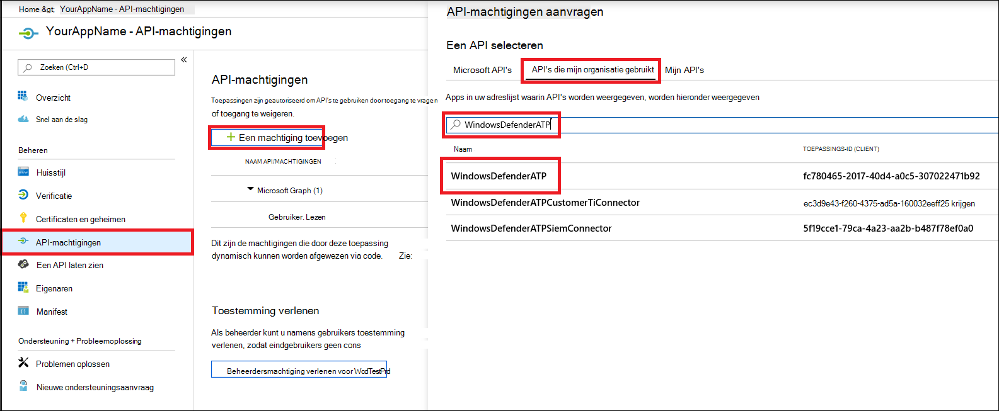
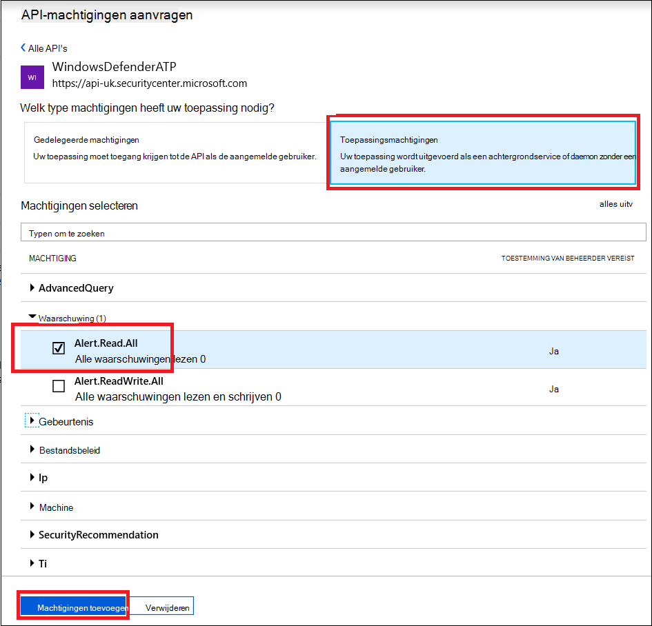

# <a name="create-an-app-to-access-microsoft-defender-for-endpoint-without-a-user"></a>Een app maken voor toegang tot Microsoft Defender voor Eindpunt zonder een gebruiker

[!INCLUDE [Microsoft 365 Defender rebranding](../../includes/microsoft-defender.md)]


**Van toepassing op:** [Microsoft Defender voor Eindpunt](https://go.microsoft.com/fwlink/?linkid=2154037)

- Wilt u Microsoft Defender voor Eindpunt ervaren? [Meld u aan voor een gratis proefabonnement.](https://www.microsoft.com/microsoft-365/windows/microsoft-defender-atp?ocid=docs-wdatp-exposedapis-abovefoldlink)

[!include[Microsoft Defender for Endpoint API URIs for US Government](../../includes/microsoft-defender-api-usgov.md)]

[!include[Improve request performance](../../includes/improve-request-performance.md)]

Op deze pagina wordt beschreven hoe u een toepassing maakt om programmatische toegang te krijgen tot Defender voor Eindpunt zonder een gebruiker. Zie Toegang krijgen met gebruikerscontext als u programmatische toegang nodig hebt tot Defender for Endpoint namens [een gebruiker.](exposed-apis-create-app-nativeapp.md) Zie Aan de slag als u niet zeker weet welke toegang u [nodig hebt.](apis-intro.md)

In Microsoft Defender voor Eindpunt worden veel van de gegevens en acties via een set programmatische API's beschikbaar. Met deze API's kunt u werkstromen automatiseren en innoveren op basis van De mogelijkheden van Defender voor eindpunten. Voor de API-toegang is OAuth2.0-verificatie vereist. Zie [OAuth 2.0 Autorisatiecode](https://docs.microsoft.com/azure/active-directory/develop/active-directory-v2-protocols-oauth-code)voor Flow.

Over het algemeen moet u de volgende stappen nemen om de API's te gebruiken:
- Maak een Azure Active Directory (Azure AD)-toepassing.
- Een toegangs token krijgen met deze toepassing.
- Gebruik het token om toegang te krijgen tot Defender voor Endpoint API.

In dit artikel wordt uitgelegd hoe u een Azure AD-toepassing maakt, toegang krijgt tot Microsoft Defender voor Eindpunt en het token valideert.

## <a name="create-an-app"></a>Een app maken

1. Meld u aan [bij Azure](https://portal.azure.com) met een gebruiker met de rol **Globale beheerder.**

2. Navigeer **naar Azure Active Directory**  >  **app-registraties Nieuwe**  >  **registratie**. 

   

3. Kies in het registratieformulier een naam voor uw toepassing en selecteer vervolgens **Registreren.**

4. Als u uw app toegang wilt geven tot Defender voor Eindpunt en deze machtiging **'Alle** waarschuwingen lezen' wilt toewijzen, selecteert u op de **toepassingspagina** API-machtigingen Machtigingen toevoegen API's die mijn organisatie  >    >   > gebruikt, typt u **WindowsDefenderATP** en selecteert u **vervolgens WindowsDefenderATP**.

   > [!NOTE]
   > *WindowsDefenderATP* wordt niet weergegeven in de oorspronkelijke lijst. Begin met het schrijven van de naam in het tekstvak om deze weer te geven.

   

   - Selecteer **Toepassingsmachtigingen**  >  **Alert.Read.All** en selecteer **vervolgens Machtigingen toevoegen.**

   

     U moet de relevante machtigingen selecteren. 'Alle waarschuwingen lezen' is slechts een voorbeeld. Bijvoorbeeld:

     - Als [u geavanceerde query's wilt uitvoeren,](run-advanced-query-api.md)selecteert u de machtiging Geavanceerde query's uitvoeren.
     - Als [u een apparaat wilt isoleren,](isolate-machine.md)selecteert u de machtiging 'Machine isoleren'.
     - Als u wilt bepalen welke  machtiging u nodig hebt, bekijkt u de sectie Machtigingen in de API die u wilt bellen.

5. Selecteer **Toestemming verlenen.**

     > [!NOTE]
     > Telkens wanneer u een machtiging toevoegt, moet u **Toestemming verlenen selecteren** om de nieuwe machtiging van kracht te laten worden.

    

6. Als u een geheim aan de toepassing wilt toevoegen, selecteert u Certificaten **& geheimen,** voegt u een beschrijving toe aan het geheim en selecteert u **Vervolgens Toevoegen**.

    > [!NOTE]
    > Nadat u Toevoegen **hebt geselecteerd,** **selecteert u de gegenereerde geheime waarde kopiëren.** U kunt deze waarde niet meer ophalen nadat u bent weggehaald.

    

7. Schrijf uw toepassings-id en uw tenant-id op. Ga op de toepassingspagina naar **Overzicht** en kopieer het volgende.

   

8. **Alleen voor Microsoft Defender voor endpoint-partners**. Stel uw app in op meerdere tenants (beschikbaar in alle tenants na toestemming). Dit is **vereist** voor apps van derden (bijvoorbeeld als u een app maakt die is bedoeld voor gebruik in de tenant van meerdere klanten). Dit **is** niet vereist als u een service maakt die u alleen in uw tenant wilt uitvoeren (bijvoorbeeld als u een toepassing maakt voor eigen gebruik die alleen met uw eigen gegevens werkt). De app instellen op meerdere tenants:

    - Ga naar **Verificatie** en voeg deze toe `https://portal.azure.com` als **omleidings-URI.**

    - Selecteer onder aan de pagina, onder **Ondersteunde accounttypen,** de **accounts in** een organisatiemaptoepassing voor uw multi-tenant-app.

    U moet uw toepassing goedkeuren in elke tenant waar u deze wilt gebruiken. Dit komt omdat uw toepassing namens uw klant werkt met Defender for Endpoint.

    U (of uw klant als u een app van derden schrijft) moet de toestemmingskoppeling selecteren en uw app goedkeuren. De toestemming moet worden gedaan met een gebruiker die beheerdersbevoegdheden heeft in Active Directory.

    De toestemmingskoppeling wordt als volgt gevormd: 

    ```
    https://login.microsoftonline.com/common/oauth2/authorize?prompt=consent&client_id=00000000-0000-0000-0000-000000000000&response_type=code&sso_reload=true
    ```

    Wanneer 000000000-0000-0000-0000-00000000000 wordt vervangen door uw toepassings-id.


**Klaar!** U hebt een toepassing geregistreerd. Zie hieronder voorbeelden voor het verkrijgen en valideren van tokens.

## <a name="get-an-access-token"></a>Een toegangs token krijgen

Zie de [zelfstudie Azure AD](https://docs.microsoft.com/azure/active-directory/develop/active-directory-v2-protocols-oauth-client-creds)voor meer informatie over Azure AD-tokens.

### <a name="use-powershell"></a>PowerShell gebruiken

```powershell
# This script acquires the App Context Token and stores it in the variable $token for later use in the script.
# Paste your Tenant ID, App ID, and App Secret (App key) into the indicated quotes below.

$tenantId = '' ### Paste your tenant ID here
$appId = '' ### Paste your Application ID here
$appSecret = '' ### Paste your Application key here

$resourceAppIdUri = 'https://api.securitycenter.microsoft.com'
$oAuthUri = "https://login.microsoftonline.com/$TenantId/oauth2/token"
$authBody = [Ordered] @{
    resource = "$resourceAppIdUri"
    client_id = "$appId"
    client_secret = "$appSecret"
    grant_type = 'client_credentials'
}
$authResponse = Invoke-RestMethod -Method Post -Uri $oAuthUri -Body $authBody -ErrorAction Stop
$token = $authResponse.access_token
```

### <a name="use-c"></a>Use C#:

De volgende code is getest met NuGet Microsoft.IdentityModel.Clients.ActiveDirectory 3.19.8.

1. Een nieuwe consoletoepassing maken.
1. Installeer NuGet [Microsoft.IdentityModel.Clients.ActiveDirectory](https://www.nuget.org/packages/Microsoft.IdentityModel.Clients.ActiveDirectory/).
1. Voeg het volgende toe:

    ```
    using Microsoft.IdentityModel.Clients.ActiveDirectory;
    ```

1. Kopieer en plak de volgende code in uw app (vergeet niet om de drie variabelen bij te werken: ```tenantId, appId, appSecret``` ):

    ```
    string tenantId = "00000000-0000-0000-0000-000000000000"; // Paste your own tenant ID here
    string appId = "11111111-1111-1111-1111-111111111111"; // Paste your own app ID here
    string appSecret = "22222222-2222-2222-2222-222222222222"; // Paste your own app secret here for a test, and then store it in a safe place! 

    const string authority = "https://login.microsoftonline.com";
    const string wdatpResourceId = "https://api.securitycenter.microsoft.com";

    AuthenticationContext auth = new AuthenticationContext($"{authority}/{tenantId}/");
    ClientCredential clientCredential = new ClientCredential(appId, appSecret);
    AuthenticationResult authenticationResult = auth.AcquireTokenAsync(wdatpResourceId, clientCredential).GetAwaiter().GetResult();
    string token = authenticationResult.AccessToken;
    ```


### <a name="use-python"></a>Python gebruiken

Zie [Get token using Python](run-advanced-query-sample-python.md#get-token).

### <a name="use-curl"></a>Krul gebruiken

> [!NOTE]
> In de volgende procedure wordt ervan uitgenomen dat Curl voor Windows al op uw computer is geïnstalleerd.

1. Open een opdrachtprompt en stel CLIENT_ID in op uw Azure-toepassings-id.
1. Stel CLIENT_SECRET in op uw Azure-toepassingsgeheim.
1. Stel TENANT_ID op de Azure-tenant-id van de klant die uw app wil gebruiken voor toegang tot Defender voor Eindpunt.
1. Voer de volgende opdracht uit:

```
curl -i -X POST -H "Content-Type:application/x-www-form-urlencoded" -d "grant_type=client_credentials" -d "client_id=%CLIENT_ID%" -d "scope=https://securitycenter.onmicrosoft.com/windowsatpservice/.default" -d "client_secret=%CLIENT_SECRET%" "https://login.microsoftonline.com/%TENANT_ID%/oauth2/v2.0/token" -k
```

U krijgt een antwoord in het volgende formulier:

```
{"token_type":"Bearer","expires_in":3599,"ext_expires_in":0,"access_token":"eyJ0eXAiOiJKV1QiLCJhbGciOiJSUzI1NiIsIn <truncated> aWReH7P0s0tjTBX8wGWqJUdDA"}
```

## <a name="validate-the-token"></a>Het token valideren

Controleer of u het juiste token hebt:

1. Kopieer en plak het token dat u in de vorige stap hebt ontvangen in [JWT](https://jwt.ms) om het te decoderen.
1. Valideren dat u een claim voor rollen krijgt met de gewenste machtigingen
1. In de volgende afbeelding ziet u een gedecodeerd token dat is verkregen uit een app met machtigingen voor alle rollen van Microsoft Defender voor Endpoint:


## <a name="use-the-token-to-access-microsoft-defender-for-endpoint-api"></a>Het token gebruiken om toegang te krijgen tot Microsoft Defender voor Endpoint API

1. Kies de API die u wilt gebruiken. Zie Ondersteunde [Defender voor eindpunt-API's](exposed-apis-list.md)voor meer informatie.
1. Stel de autorisatiekoptekst in in de http-aanvraag die u verzendt naar 'Bearer {token}' (Toer is het autorisatieschema).
1. De verlooptijd van het token is één uur. U kunt meerdere aanvragen met hetzelfde token verzenden.

Hieronder volgt een voorbeeld van het verzenden van een verzoek om een lijst met waarschuwingen te krijgen **met C#**: 
```
    var httpClient = new HttpClient();

    var request = new HttpRequestMessage(HttpMethod.Get, "https://api.securitycenter.microsoft.com/api/alerts");

    request.Headers.Authorization = new AuthenticationHeaderValue("Bearer", token);

    var response = httpClient.SendAsync(request).GetAwaiter().GetResult();

    // Do something useful with the response
```

## <a name="see-also"></a>Zie ook
- [Ondersteunde API's voor Microsoft Defender voor Eindpunt](exposed-apis-list.md)
- [Toegang tot Microsoft Defender voor Eindpunt namens een gebruiker](exposed-apis-create-app-nativeapp.md)
