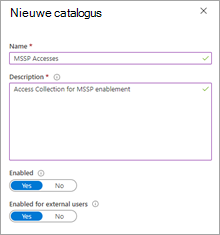
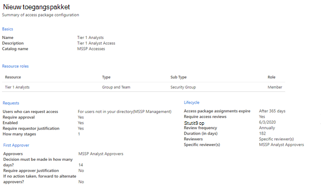
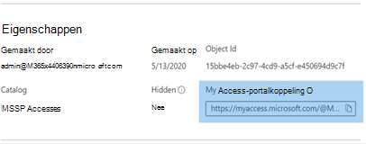

# Toegang verlenen voor beheerde beveiligingsserviceproviders (MSSP) (preview)Grant managed security service provider (MSSP) access (preview)

[!INCLUDE [Microsoft 365 Defender rebranding](../../includes/microsoft-defender.md)]

**Van toepassing op:****Applies to:**
- [Microsoft Defender voor EndpointMicrosoft Defender for Endpoint](https://go.microsoft.com/fwlink/p/?linkid=2154037)
- [Microsoft 365 DefenderMicrosoft 365 Defender](https://go.microsoft.com/fwlink/?linkid=2118804)

>Wilt u Defender voor Eindpunt ervaren?Want to experience Defender for Endpoint? [Meld u aan voor een gratis proefabonnement.Sign up for a free trial.](https://www.microsoft.com/microsoft-365/windows/microsoft-defender-atp?ocid=docs-mssp-support-abovefoldlink)

>[!IMPORTANT] 
>Sommige informatie is gerelateerd aan voorlopige productversies die mogelijk aanzienlijk gewijzigd worden voordat ze commercieel gepubliceerd worden.Some information relates to prereleased product which may be substantially modified before it's commercially released. Microsoft geeft geen garantie, uitdrukkelijk of impliciet, met betrekking tot de informatie die hier wordt beschreven.Microsoft makes no warranties, express or implied, with respect to the information provided here.

Als u een oplossing voor gedelegeerde toegang met meerdere tenants wilt implementeren, voert u de volgende stappen uit:To implement a multi-tenant delegated access solution, take the following steps:

1. Schakel [toegangsbeheer op basis van rollen](rbac.md) in defender voor eindpunt in en maak verbinding met Ad-groepen (Active Directory).Enable [role-based access control](rbac.md) in Defender for Endpoint and connect with Active Directory (AD) groups.

2. [Beheertoegangspakketten configureren voor toegangsaanvraag](https://docs.microsoft.com/azure/active-directory/governance/identity-governance-overview) en inrichting.Configure [Governance Access Packages](https://docs.microsoft.com/azure/active-directory/governance/identity-governance-overview) for access request and provisioning.

3. Toegangsaanvragen en -audits beheren in [Microsoft Myaccess](https://docs.microsoft.com/azure/active-directory/governance/entitlement-management-request-approve).Manage access requests and audits in [Microsoft Myaccess](https://docs.microsoft.com/azure/active-directory/governance/entitlement-management-request-approve).

## Toegangsbesturingselementen op basis van rollen inschakelen in Microsoft Defender voor EindpuntEnable role-based access controls in Microsoft Defender for Endpoint

1. **Toegangsgroepen maken voor MSSP-resources in Klant-AAD: Groepen****Create access groups for MSSP resources in Customer AAD: Groups**

    Deze groepen worden gekoppeld aan de rollen die u maakt in Defender voor Eindpunt.These groups will be linked to the Roles you create in Defender for Endpoint. Maak in de ad-tenant van de klant drie groepen om dit te doen.To do so, in the customer AD tenant, create three groups. In onze voorbeeldbenadering maken we de volgende groepen:In our example approach, we create the following groups:

    - Tier 1 AnalystTier 1 Analyst 
    - Tier 2 AnalystTier 2 Analyst 
    - MSSP-analist-goedkeurdersMSSP Analyst Approvers  

2. Maak Defender voor eindpuntrollen voor de juiste toegangsniveaus in Customer Defender voor Eindpunt.Create Defender for Endpoint roles for appropriate access levels in Customer Defender for Endpoint.

    Als u RBAC wilt inschakelen in het Microsoft Defender-beveiligingscentrum van de klant, hebt u toegang tot Instellingen **> Machtigingen > Rollen** en 'Rollen inschakelen', vanuit een gebruikersaccount met globale beheerders- of beveiligingsbeheerdersrechten.To enable RBAC in the customer Microsoft Defender Security Center, access **Settings > Permissions > Roles** and "Turn on roles", from a user account with Global Administrator or Security Administrator rights.

    

    Maak vervolgens RBAC-rollen om te voldoen aan de soc-laagbehoeften van MSSP.Then, create RBAC roles to meet MSSP SOC Tier needs. Koppel deze rollen aan de gemaakte gebruikersgroepen via 'Toegewezen gebruikersgroepen'.Link these roles to the created user groups via "Assigned user groups".

    Twee mogelijke rollen:Two possible roles:

    - **Tier 1-analisten****Tier 1 Analysts**  
      Voer alle acties uit, behalve livereacties en beheer beveiligingsinstellingen.Perform all actions except for live response and manage security settings.

    - **Laag 2-analisten****Tier 2 Analysts**  
      Tier 1-mogelijkheden met de toevoeging aan [livereactie](live-response.md)Tier 1 capabilities with the addition to [live response](live-response.md)

    Zie Op rollen gebaseerde [toegangsbeheer gebruiken](rbac.md)voor meer informatie.For more information, see [Use role-based access control](rbac.md).

## Governance Access-pakketten configurerenConfigure Governance Access Packages

1.  **MSSP toevoegen als verbonden organisatie in Customer AAD: Identity Governance****Add MSSP as Connected Organization in Customer AAD: Identity Governance**
    
    Als u mssp toevoegt als een verbonden organisatie, kan de MSSP aanvragen en toegang hebben tot de inrichting.Adding the MSSP as a connected organization will allow the MSSP to request and have accesses provisioned. 

    Als u dit wilt doen, krijgt u in de ad-tenant van de klant toegang tot Identiteitsbeheer: Verbonden organisatie.To do so, in the customer AD tenant, access Identity Governance: Connected organization. Voeg een nieuwe organisatie toe en zoek naar uw MSSP Analyst-tenant via tenant-id of domein.Add a new organization and search for your MSSP Analyst tenant via Tenant ID or Domain. We raden u aan een aparte AD-tenant te maken voor uw MSSP-analisten.We suggest creating a separate AD tenant for your MSSP Analysts.

2. **Een resourcecatalogus maken in Customer AAD: Identity Governance****Create a resource catalog in Customer AAD: Identity Governance**

    Resourcecatalogi zijn een logische verzameling toegangspakketten die zijn gemaakt in de AD-tenant van de klant.Resource catalogs are a logical collection of access packages, created in the customer AD tenant.

    U doet dit door in de AD-tenant van de klant identiteitsbeheer: catalogi te openen en Nieuwe catalogus **toe te voegen.**To do so, in the customer AD tenant,  access Identity Governance: Catalogs, and add **New Catalog**. In ons voorbeeld noemen we het **MSSP Accesses.**In our example, we will call it **MSSP Accesses**. 

    

    Zie Een catalogus met resources maken voor [meer informatie.](https://docs.microsoft.com/azure/active-directory/governance/entitlement-management-catalog-create)Further more information, see [Create a catalog of resources](https://docs.microsoft.com/azure/active-directory/governance/entitlement-management-catalog-create).

3. **Access-pakketten maken voor MSSP-resources Customer AAD: Identity Governance****Create access packages for MSSP resources Customer AAD: Identity Governance**

    Access-pakketten zijn de verzameling rechten en toegangen die een aangever na goedkeuring wordt verleend.Access packages are the collection of rights and accesses that a requestor will be granted upon approval. 

    U doet dit door in de AD-tenant van de klant identiteitsbeheer: Access-pakketten te openen en Nieuw **Access-pakket toe te voegen.**To do so, in the customer AD tenant, access Identity Governance: Access Packages, and add **New Access Package**. Maak een toegangspakket voor de MSSP-goedkeurders en elke analistlaag.Create an access package for the MSSP approvers and each analyst tier. Met de volgende configuratie van Tier 1 Analyst wordt bijvoorbeeld een toegangspakket gemaakt dat:For example, the following Tier 1 Analyst configuration creates an access package that:

    - Vereist dat een lid van de AD-groep **MSSP Analyst Approvers** nieuwe aanvragen autorizertRequires a member of the AD group **MSSP Analyst Approvers** to authorize new requests
    - Heeft jaarlijkse toegangsbeoordelingen, waarbij de SOC-analisten een toegangsextensie kunnen aanvragenHas annual access reviews, where the SOC analysts can request an access extension
    - Kan alleen worden aangevraagd door gebruikers in de SOC-tenant van MSSPCan only be requested by users in the MSSP SOC Tenant
    - Access Auto verloopt na 365 dagenAccess auto expires after 365 days

    > [!div class="mx-imgBorder"]
    > 

    Zie Een nieuw [toegangspakket maken](https://docs.microsoft.com/azure/active-directory/governance/entitlement-management-access-package-create)voor meer informatie.For more information, see [Create a new access package](https://docs.microsoft.com/azure/active-directory/governance/entitlement-management-access-package-create).

4. **Koppeling voor toegangsaanvraag naar MSSP-resources van Customer AAD: Identity Governance****Provide access request link to MSSP resources from Customer AAD: Identity Governance**

    De koppeling Mijn Access-portal wordt door MSSP-SOC-analisten gebruikt om toegang te vragen via de gemaakte toegangspakketten.The My Access portal link is used by MSSP SOC analysts to request access via the access packages created. De koppeling is duurzaam, wat betekent dat dezelfde koppeling in de tijd kan worden gebruikt voor nieuwe analisten.The link is durable, meaning the same link may be used over time for new analysts. De aanvraag van de analist wordt in een wachtrij geplaatst voor goedkeuring door de **MSSP-analist-goedkeurders.**The analyst request goes into a queue for approval by the **MSSP Analyst Approvers**.

    > [!div class="mx-imgBorder"]
    > 

    De koppeling bevindt zich op de overzichtspagina van elk toegangspakket.The link is located on the overview page of each access package.

## Toegang beherenManage access 

1. Toegangsaanvragen controleren en machtigen in myaccess klant en/of MSSP.Review and authorize access requests in Customer and/or MSSP myaccess.

    Access-aanvragen worden beheerd in de klant My Access, door leden van de groep MsSP Analyst Approvers.Access requests are managed in the customer My Access, by members of the MSSP Analyst Approvers group.

    U kunt dit doen door de myaccess van de klant te openen met behulp van:  `https://myaccess.microsoft.com/@<Customer Domain >` .To do so, access the customer's myaccess using:  `https://myaccess.microsoft.com/@<Customer Domain >`. 

    Voorbeeld:  `https://myaccess.microsoft.com/@M365x440XXX.onmicrosoft.com#/`Example:  `https://myaccess.microsoft.com/@M365x440XXX.onmicrosoft.com#/`   
2. Aanvragen goedkeuren of weigeren in **de sectie Goedkeuringen** van de gebruikersinterface.Approve or deny requests in the **Approvals** section of the UI.

    Op dit moment is de toegang tot analisten ingericht en moet elke analist toegang hebben tot het Microsoft Defender-beveiligingscentrum van de klant: `https://securitycenter.Microsoft.com/?tid=<CustomerTenantId>`At this point, analyst access has been provisioned, and each analyst should be able to access the customer's Microsoft Defender Security Center: `https://securitycenter.Microsoft.com/?tid=<CustomerTenantId>`

## Verwante onderwerpenRelated topics
- [Toegang tot de MSSP-klantportalAccess the MSSP customer portal](access-mssp-portal.md)
- [Waarschuwingsmeldingen configurerenConfigure alert notifications](configure-mssp-notifications.md)
- [Waarschuwingen ophalen van klant tenantFetch alerts from customer tenant](fetch-alerts-mssp.md)

 

