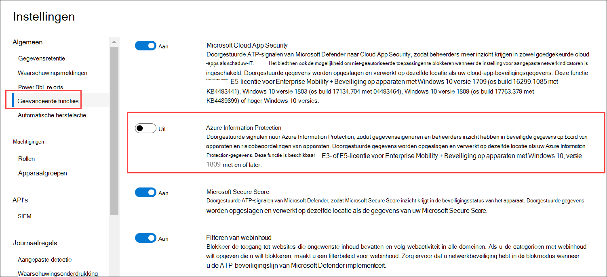

# <a name="information-protection-in-windows-overview"></a><span data-ttu-id="a6222-104">Overzicht van informatiebeveiliging in Windows</span><span class="sxs-lookup"><span data-stu-id="a6222-104">Information protection in Windows overview</span></span>

[!INCLUDE [Microsoft 365 Defender rebranding](../../includes/microsoft-defender.md)]

<span data-ttu-id="a6222-105">**Van toepassing op:**</span><span class="sxs-lookup"><span data-stu-id="a6222-105">**Applies to:**</span></span>

- [<span data-ttu-id="a6222-106">Microsoft Defender voor Eindpunt</span><span class="sxs-lookup"><span data-stu-id="a6222-106">Microsoft Defender for Endpoint</span></span>](https://go.microsoft.com/fwlink/p/?linkid=2154037)
- [<span data-ttu-id="a6222-107">Microsoft 365 Defender</span><span class="sxs-lookup"><span data-stu-id="a6222-107">Microsoft 365 Defender</span></span>](https://go.microsoft.com/fwlink/?linkid=2118804)

> <span data-ttu-id="a6222-108">Wilt u Defender voor Eindpunt ervaren?</span><span class="sxs-lookup"><span data-stu-id="a6222-108">Want to experience Defender for Endpoint?</span></span> [<span data-ttu-id="a6222-109">Meld u aan voor een gratis proefabonnement.</span><span class="sxs-lookup"><span data-stu-id="a6222-109">Sign up for a free trial.</span></span>](https://www.microsoft.com/microsoft-365/windows/microsoft-defender-atp?ocid=docs-wdatp-exposedapis-abovefoldlink) 


[!include[Prerelease information](../../includes/prerelease.md)]

<span data-ttu-id="a6222-110">Informatiebeveiliging is een integraal onderdeel van Microsoft 365 Enterprise suite en biedt intelligente beveiliging om gevoelige gegevens veilig te houden en productiviteit op de werkplek in te stellen.</span><span class="sxs-lookup"><span data-stu-id="a6222-110">Information protection is an integral part of Microsoft 365 Enterprise suite, providing intelligent protection to keep sensitive data secure while enabling productivity in the workplace.</span></span>


>[!TIP]
> <span data-ttu-id="a6222-111">Lees ons blogbericht over de integratie van Microsoft Defender voor eindpunten met Microsoft Information Protection om gevoelige gegevens op apparaten te ontdekken, te beveiligen [en Windows bewaken.](https://cloudblogs.microsoft.com/microsoftsecure/2019/01/17/windows-defender-atp-integrates-with-microsoft-information-protection-to-discover-protect-and-monitor-sensitive-data-on-windows-devices/)</span><span class="sxs-lookup"><span data-stu-id="a6222-111">Read our blog post about how Microsoft Defender for Endpoint integrates with Microsoft Information Protection to [discover, protect, and monitor sensitive data on Windows devices](https://cloudblogs.microsoft.com/microsoftsecure/2019/01/17/windows-defender-atp-integrates-with-microsoft-information-protection-to-discover-protect-and-monitor-sensitive-data-on-windows-devices/).</span></span>

<span data-ttu-id="a6222-112">Defender voor Eindpunt past de volgende methoden toe om gegevens te ontdekken, te classificeren en te beveiligen:</span><span class="sxs-lookup"><span data-stu-id="a6222-112">Defender for Endpoint applies the following methods to discover, classify, and protect data:</span></span>

- <span data-ttu-id="a6222-113">**Gegevensdetectie** : gevoelige gegevens identificeren op Windows apparaten die risico lopen</span><span class="sxs-lookup"><span data-stu-id="a6222-113">**Data discovery** - Identify sensitive data on Windows devices at risk</span></span>
- <span data-ttu-id="a6222-114">**Gegevensclassificatie:** gegevens automatisch classificeren op basis van gemeenschappelijk MIP-beleid (Microsoft Information Protection) dat wordt beheerd in Office 365 Beveiligings- & Compliancecentrum.</span><span class="sxs-lookup"><span data-stu-id="a6222-114">**Data classification** - Automatically classify data based on common Microsoft Information Protection (MIP) policies managed in Office 365 Security & Compliance Center.</span></span> <span data-ttu-id="a6222-115">Met automatische classificatie kunt u gevoelige gegevens beveiligen, zelfs als de eindgebruiker deze niet handmatig heeft geclassificeerd.</span><span class="sxs-lookup"><span data-stu-id="a6222-115">Auto-classification allows you to protect sensitive data even if the end user hasn’t manually classified it.</span></span>


## <a name="data-discovery-and-data-classification"></a><span data-ttu-id="a6222-116">Gegevensdetectie en gegevensclassificatie</span><span class="sxs-lookup"><span data-stu-id="a6222-116">Data discovery and data classification</span></span>

<span data-ttu-id="a6222-117">In Defender voor Eindpunt worden automatisch bestanden met gevoeligheidslabels en bestanden met gevoelige informatietypen ontdekt.</span><span class="sxs-lookup"><span data-stu-id="a6222-117">Defender for Endpoint automatically discovers files with sensitivity labels and files that contain sensitive information types.</span></span>

<span data-ttu-id="a6222-118">Gevoeligheidslabels classificeren en helpen gevoelige inhoud te beveiligen.</span><span class="sxs-lookup"><span data-stu-id="a6222-118">Sensitivity labels classify and help protect sensitive content.</span></span>

<span data-ttu-id="a6222-119">Gevoelige informatietypen in de Office 365 implementatie van DLP (Data Loss Prevention) vallen onder twee categorieën:</span><span class="sxs-lookup"><span data-stu-id="a6222-119">Sensitive information types in the Office 365 data loss prevention (DLP) implementation fall under two categories:</span></span>

- <span data-ttu-id="a6222-120">Standaard</span><span class="sxs-lookup"><span data-stu-id="a6222-120">Default</span></span>
- <span data-ttu-id="a6222-121">Aangepast</span><span class="sxs-lookup"><span data-stu-id="a6222-121">Custom</span></span>

<span data-ttu-id="a6222-122">Standaardgevoelige informatietypen bevatten gegevens zoals bankrekeningnummers, socialezekerheidsnummers of nationale persoonsgegevens.</span><span class="sxs-lookup"><span data-stu-id="a6222-122">Default sensitive information types include information such as bank account numbers, social security numbers, or national IDs.</span></span> <span data-ttu-id="a6222-123">Zie Waar het type gevoelige informatie naar op [zoek is voor meer informatie.](/office365/securitycompliance/what-the-sensitive-information-types-look-for)</span><span class="sxs-lookup"><span data-stu-id="a6222-123">For more information, see [What the sensitive information type look for](/office365/securitycompliance/what-the-sensitive-information-types-look-for).</span></span>

<span data-ttu-id="a6222-124">Aangepaste typen zijn typen die u definieert en die zijn ontworpen om een ander type gevoelige informatie te beveiligen (bijvoorbeeld werknemers-1D's of projectnummers).</span><span class="sxs-lookup"><span data-stu-id="a6222-124">Custom types are ones that you define and is designed to protect a different type of sensitive information (for example, employee IDs or project numbers).</span></span> <span data-ttu-id="a6222-125">Zie Een aangepast type gevoelige informatie maken voor [meer informatie.](/office365/securitycompliance/create-a-custom-sensitive-information-type)</span><span class="sxs-lookup"><span data-stu-id="a6222-125">For more information see, [Create a custom sensitive information type](/office365/securitycompliance/create-a-custom-sensitive-information-type).</span></span>

<span data-ttu-id="a6222-126">Wanneer een bestand wordt gemaakt of bewerkt op een apparaat Windows, scant Defender for Endpoint de inhoud om te evalueren of het gevoelige informatie bevat.</span><span class="sxs-lookup"><span data-stu-id="a6222-126">When a file is created or edited on a  Windows device, Defender for Endpoint scans the content to evaluate if it contains sensitive information.</span></span>

<span data-ttu-id="a6222-127">Schakel de Azure Information Protection-integratie in, zodat wanneer een bestand met gevoelige informatie wordt gevonden door Defender voor Eindpunt, hoewel etiketten of informatietypen, het automatisch wordt doorgestuurd naar Azure Information Protection vanaf het apparaat.</span><span class="sxs-lookup"><span data-stu-id="a6222-127">Turn on the Azure Information Protection integration so that when a file that contains sensitive information is discovered by Defender for Endpoint though labels or information types, it is automatically forwarded to Azure Information Protection from the device.</span></span>



<span data-ttu-id="a6222-129">De gerapporteerde signalen kunnen worden bekeken op het dashboard Azure Information Protection – Data Discovery.</span><span class="sxs-lookup"><span data-stu-id="a6222-129">The reported signals can be viewed on the Azure Information Protection – Data discovery dashboard.</span></span>

## <a name="azure-information-protection---data-discovery-dashboard"></a><span data-ttu-id="a6222-130">Azure Information Protection - Dashboard gegevensdetectie</span><span class="sxs-lookup"><span data-stu-id="a6222-130">Azure Information Protection - Data discovery dashboard</span></span>

<span data-ttu-id="a6222-131">Dit dashboard bevat een overzicht van de detectiegegevens die zijn ontdekt door zowel Defender voor Eindpunt als Azure Information Protection.</span><span class="sxs-lookup"><span data-stu-id="a6222-131">This dashboard presents a summarized discovery information of data discovered by both Defender for Endpoint and Azure Information Protection.</span></span> <span data-ttu-id="a6222-132">Gegevens van Defender voor Eindpunt zijn gemarkeerd met Locatietype - Eindpunt.</span><span class="sxs-lookup"><span data-stu-id="a6222-132">Data from Defender for Endpoint is marked with Location Type - Endpoint.</span></span>


<span data-ttu-id="a6222-134">Let op de kolom Apparaatrisico aan de rechterkant, dit apparaatrisico wordt rechtstreeks afgeleid van Defender voor Eindpunt, waarmee het risiconiveau wordt aangegeven van het beveiligingsapparaat waar het bestand is gevonden, op basis van de actieve beveiligingsrisico's die door Defender voor Eindpunt zijn gedetecteerd.</span><span class="sxs-lookup"><span data-stu-id="a6222-134">Notice the Device Risk column on the right, this device risk is derived directly from Defender for Endpoint, indicating the risk level of the security device where the file was discovered, based on the active security threats detected by Defender for Endpoint.</span></span>

<span data-ttu-id="a6222-135">Klik op een apparaat om een lijst met bestanden te bekijken die op dit apparaat zijn waargenomen, met de gevoeligheidslabels en informatietypen.</span><span class="sxs-lookup"><span data-stu-id="a6222-135">Click on a device to view a list of files observed on this device, with their sensitivity labels and information types.</span></span>

>[!NOTE]
><span data-ttu-id="a6222-136">Sta ongeveer 15-20 minuten toe dat de Detectie van het Azure Information Protection Dashboard de gevonden bestanden wedt.</span><span class="sxs-lookup"><span data-stu-id="a6222-136">Please allow approximately 15-20 minutes for the Azure Information Protection Dashboard Discovery to reflect discovered files.</span></span>

## <a name="log-analytics"></a><span data-ttu-id="a6222-137">Logboekanalyse</span><span class="sxs-lookup"><span data-stu-id="a6222-137">Log Analytics</span></span>

<span data-ttu-id="a6222-138">Gegevensdetectie op basis van Defender voor Eindpunt is ook beschikbaar in [Azure Log Analytics,](/azure/log-analytics/log-analytics-overview)waar u complexe query's kunt uitvoeren op de onbewerkte gegevens.</span><span class="sxs-lookup"><span data-stu-id="a6222-138">Data discovery based on Defender for Endpoint is also available in [Azure Log Analytics](/azure/log-analytics/log-analytics-overview), where you can perform complex queries over the raw data.</span></span>

<span data-ttu-id="a6222-139">Zie Centrale rapportage voor Azure Information Protection voor meer informatie over Azure Information Protection [Analytics.](/azure/information-protection/reports-aip)</span><span class="sxs-lookup"><span data-stu-id="a6222-139">For more information on Azure Information Protection analytics, see [Central reporting for Azure Information Protection](/azure/information-protection/reports-aip).</span></span>

<span data-ttu-id="a6222-140">Open Azure Log Analytics in Azure Portal en open een opbouwfunctie voor query's (standaard of klassiek).</span><span class="sxs-lookup"><span data-stu-id="a6222-140">Open Azure Log Analytics in Azure portal and open a query builder (standard or classic).</span></span>

<span data-ttu-id="a6222-141">Als u Defender voor eindpuntgegevens wilt weergeven, voert u een query uit die het volgende bevat:</span><span class="sxs-lookup"><span data-stu-id="a6222-141">To view Defender for Endpoint data, perform a query that contains:</span></span>

```
InformationProtectionLogs_CL
| where Workload_s == "Windows Defender"
```

<span data-ttu-id="a6222-142">**Vereisten:**</span><span class="sxs-lookup"><span data-stu-id="a6222-142">**Prerequisites:**</span></span>

- <span data-ttu-id="a6222-143">Klanten moeten een abonnement hebben voor Azure Information Protection.</span><span class="sxs-lookup"><span data-stu-id="a6222-143">Customers must have a subscription for Azure Information Protection.</span></span>
- <span data-ttu-id="a6222-144">Integratie van Azure Information Protection inschakelen in Microsoft Defender-beveiligingscentrum:</span><span class="sxs-lookup"><span data-stu-id="a6222-144">Enable Azure Information Protection integration in Microsoft Defender Security Center:</span></span>
    - <span data-ttu-id="a6222-145">Ga naar **Instellingen** in Microsoft Defender-beveiligingscentrum, klik op **Geavanceerde Instellingen** onder **Algemeen.**</span><span class="sxs-lookup"><span data-stu-id="a6222-145">Go to **Settings** in Microsoft Defender Security Center, click on **Advanced Settings** under **General**.</span></span>


