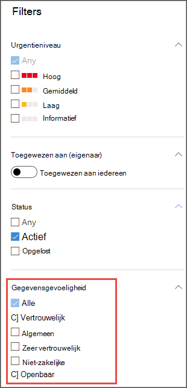
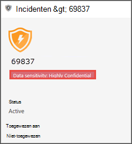

# Gevoeligheidslabels gebruiken om prioriteit te geven aan de reactie op incidenten  

[!INCLUDE [Microsoft 365 Defender rebranding](../../includes/microsoft-defender.md)]

**Van toepassing op:**
- [Microsoft Defender voor Endpoint](https://go.microsoft.com/fwlink/p/?linkid=2146631)
- [Microsoft 365 Defender](https://go.microsoft.com/fwlink/?linkid=2118804)

> Wilt u Defender voor Eindpunt ervaren? [Meld u aan voor een gratis proefabonnement.](https://www.microsoft.com/microsoft-365/windows/microsoft-defender-atp?ocid=docs-wdatp-exposedapis-abovefoldlink) 

Een standaardlevenscyclus voor permanente bedreigingen bestaat uit gegevens exfiltratie. Bij een beveiligingsincident is het belangrijk om prioriteit te kunnen geven aan onderzoeken waarbij gevoelige bestanden mogelijk gevaar lopen, zodat bedrijfsgegevens en -informatie worden beveiligd.

Met Defender voor Eindpunt kunt u de prioriteit van beveiligingsincidenten veel eenvoudiger maken met het gebruik van gevoeligheidslabels. Gevoeligheidslabels identificeren snel incidenten waarbij apparaten met gevoelige informatie betrokken kunnen zijn, zoals vertrouwelijke informatie. 

## Incidenten met gevoelige gegevens onderzoeken
Meer informatie over het gebruik van gegevensgevoeligheidslabels om prioriteit te geven aan onderzoek naar incidenten.

>[!NOTE]
>Labels worden gedetecteerd voor Windows 10, versie 1809 of hoger.

1. Selecteer incidenten in het Microsoft **Defender-beveiligingscentrum.** 

2. Schuif naar rechts om de kolom **Gegevensgevoeligheid te** zien. Deze kolom geeft gevoeligheidslabels weer die zijn waargenomen op apparaten die betrekking hebben op de incidenten, zodat wordt aangegeven of gevoelige bestanden mogelijk worden beïnvloed door het incident.

    

    U kunt ook filteren op basis van **gegevensgevoeligheid** 

    

3. Open de pagina met incidenten om verder te onderzoeken.

    

4. Selecteer het **tabblad Apparaten** om apparaten te identificeren die bestanden met gevoeligheidslabels opslaan.

    
   

5. Selecteer de apparaten waarmee gevoelige gegevens worden opgeslagen en zoek door de tijdlijn om te bepalen welke bestanden mogelijk worden beïnvloed en onderneemt de juiste actie om ervoor te zorgen dat gegevens worden beveiligd. 

   U kunt de gebeurtenissen in de tijdlijn van het apparaat beperken door te zoeken naar labels voor gegevensgevoeligheid. Als u dit doet, worden alleen gebeurtenissen vermeld die zijn gekoppeld aan bestanden met de naam van het label.

    

>[!TIP]
>Deze gegevenspunten worden ook zichtbaar via de 'DeviceFileEvents' in geavanceerde zoekopdrachten, zodat geavanceerde query's en planningsdetectie rekening kunnen houden met gevoeligheidslabels en bestandsbeveiligingsstatus. 
