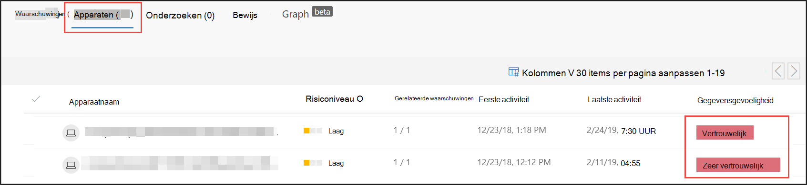

# Gevoeligheidslabels gebruiken om prioriteit te geven aan de respons op incidentenUse sensitivity labels to prioritize incident response  

[!INCLUDE [Microsoft 365 Defender rebranding](../../includes/microsoft-defender.md)]

**Van toepassing op:****Applies to:**
- [Microsoft Defender voor EindpuntMicrosoft Defender for Endpoint](https://go.microsoft.com/fwlink/p/?linkid=2154037)
- [Microsoft 365 DefenderMicrosoft 365 Defender](https://go.microsoft.com/fwlink/?linkid=2118804)

> Wilt u Defender voor Eindpunt ervaren?Want to experience Defender for Endpoint? [Meld u aan voor een gratis proefabonnement.Sign up for a free trial.](https://www.microsoft.com/microsoft-365/windows/microsoft-defender-atp?ocid=docs-wdatp-exposedapis-abovefoldlink) 

Een standaardlevenscyclus voor permanente bedreigingen bestaat uit gegevens exfiltratie.A typical advanced persistent threat lifecycle involves data exfiltration. Bij een beveiligingsincident is het belangrijk om prioriteit te kunnen geven aan onderzoeken waarbij gevoelige bestanden mogelijk gevaar lopen, zodat bedrijfsgegevens en -informatie worden beveiligd.In a security incident, it's important to have the ability to prioritize investigations where sensitive files may be jeopardy so that corporate data and information are protected.

Met Defender voor Eindpunt kunt u de prioriteit van beveiligingsincidenten veel eenvoudiger maken met het gebruik van gevoeligheidslabels.Defender for Endpoint helps to make the prioritization of security incidents much simpler with the use of sensitivity labels. Gevoeligheidslabels identificeren snel incidenten waarbij apparaten met gevoelige informatie betrokken kunnen zijn, zoals vertrouwelijke informatie.Sensitivity labels quickly identify incidents that may involve devices with sensitive information such as confidential information. 

## Incidenten met gevoelige gegevens onderzoekenInvestigate incidents that involve sensitive data
Meer informatie over het gebruik van gegevensgevoeligheidslabels om prioriteit te geven aan onderzoek naar incidenten.Learn how to use data sensitivity labels to prioritize incident investigation.

>[!NOTE]
>Labels worden gedetecteerd voor Windows 10, versie 1809 of hoger.Labels are detected for Windows 10, version 1809 or later.

1. Selecteer Microsoft Defender-beveiligingscentrum **incidenten**.In Microsoft Defender Security Center, select **Incidents**. 

2. Schuif naar rechts om de kolom **Gegevensgevoeligheid te** zien.Scroll to the right to see the **Data sensitivity** column. Deze kolom geeft gevoeligheidslabels weer die zijn waargenomen op apparaten die betrekking hebben op de incidenten, zodat wordt aangegeven of gevoelige bestanden mogelijk worden beïnvloed door het incident.This column reflects sensitivity labels that have been observed on devices related to the incidents providing an indication of whether sensitive files may be impacted by the incident.

    

    U kunt ook filteren op basis van **gegevensgevoeligheid**You can also filter based on **Data sensitivity** 

    

3. Open de pagina met incidenten om verder te onderzoeken.Open the incident page to further investigate.

    

4. Selecteer het **tabblad Apparaten** om apparaten te identificeren die bestanden met gevoeligheidslabels opslaan.Select the **Devices** tab to identify devices storing files with sensitivity labels.

    
   

5. Selecteer de apparaten waarmee gevoelige gegevens worden opgeslagen en zoek door de tijdlijn om te bepalen welke bestanden mogelijk worden beïnvloed en onderneemt de juiste actie om ervoor te zorgen dat gegevens worden beveiligd.Select the devices that store sensitive data and search through the timeline to identify which files may be impacted then take appropriate action to ensure that data is protected. 

   U kunt de gebeurtenissen in de tijdlijn van het apparaat beperken door te zoeken naar labels voor gegevensgevoeligheid.You can narrow down the events shown on the device timeline by searching for data sensitivity labels. Als u dit doet, worden alleen gebeurtenissen vermeld die zijn gekoppeld aan bestanden met de naam van het label.Doing this will show only events associated with files that have said label name.

    

>[!TIP]
>Deze gegevenspunten worden ook zichtbaar via de 'DeviceFileEvents' in geavanceerde zoekopdrachten, zodat geavanceerde query's en planningsdetectie rekening kunnen houden met gevoeligheidslabels en bestandsbeveiligingsstatus.These data points are also exposed through the ‘DeviceFileEvents’ in advanced hunting, allowing advanced queries and schedule detection to take into account sensitivity labels and file protection status. 
