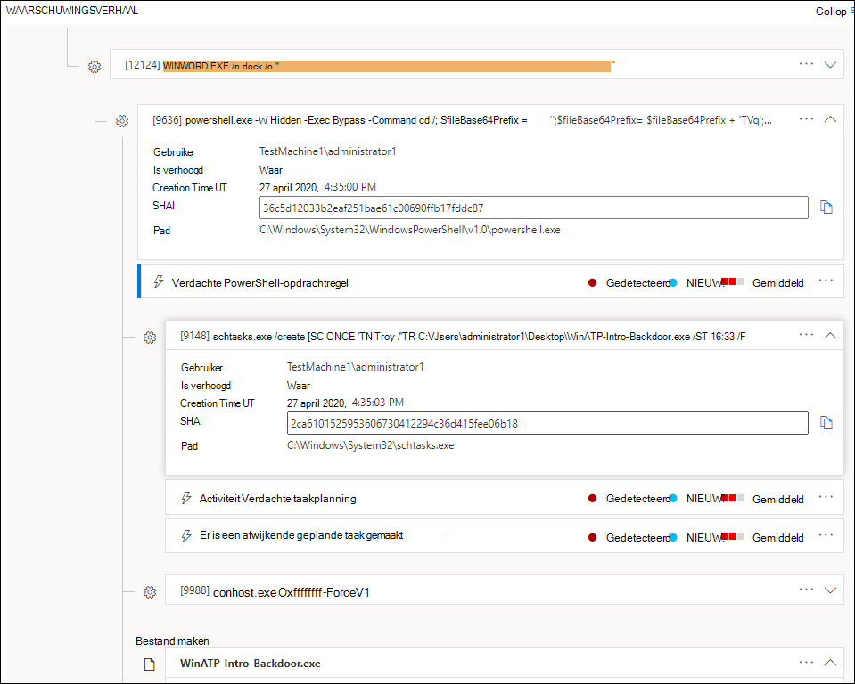
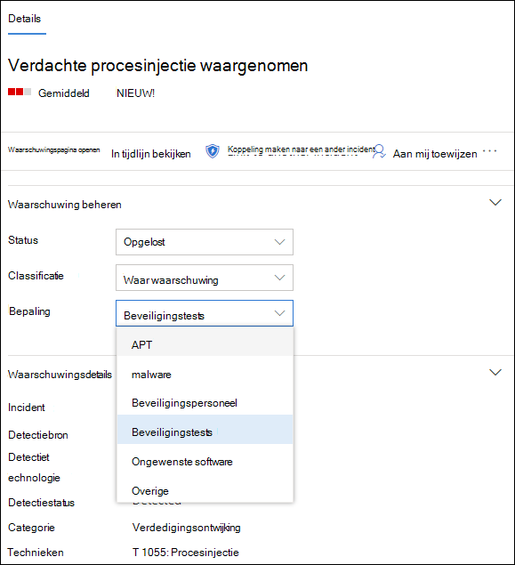
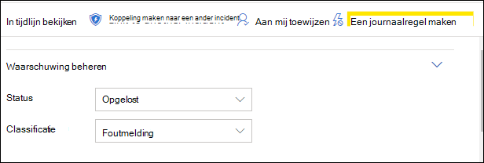

# Waarschuwingen onderzoeken in Microsoft Defender voor EindpuntInvestigate alerts in Microsoft Defender for Endpoint

[!INCLUDE [Microsoft 365 Defender rebranding](../../includes/microsoft-defender.md)]

**Van toepassing op:****Applies to:**
- [Microsoft Defender voor EindpuntMicrosoft Defender for Endpoint](https://go.microsoft.com/fwlink/p/?linkid=2154037)
- [Microsoft 365 DefenderMicrosoft 365 Defender](https://go.microsoft.com/fwlink/?linkid=2118804)

>Wilt u Defender voor Eindpunt ervaren?Want to experience Defender for Endpoint? [Meld u aan voor een gratis proefabonnement.Sign up for a free trial.](https://www.microsoft.com/microsoft-365/windows/microsoft-defender-atp?ocid=docs-wdatp-investigatealerts-abovefoldlink) 

Onderzoek waarschuwingen die van invloed zijn op uw netwerk, begrijpen wat ze betekenen en hoe u deze kunt oplossen.Investigate alerts that are affecting your network, understand what they mean, and how to resolve them.

Selecteer een waarschuwing in de waarschuwingenwachtrij om naar de waarschuwingspagina te gaan.Select an alert from the alerts queue to go to alert page. Deze weergave bevat de waarschuwingstitel, de betreffende assets, het detail zijvenster en het waarschuwingsverhaal.This view contains the alert title, the affected assets, the details side pane, and the alert story.

Start uw onderzoek op de waarschuwingspagina door de betreffende activa of een van de entiteiten te selecteren onder de weergave van de waarschuwingsverhaalstructuur.From the alert page, begin your investigation by selecting the affected assets or any of the entities under the alert story tree view. Het detailvenster wordt automatisch gevuld met meer informatie over wat u hebt geselecteerd.The details pane automatically populates with further information about what you selected. Als u wilt zien wat voor soort informatie u hier kunt bekijken, leest u [Waarschuwingen controleren in Microsoft Defender voor Eindpunt.](/microsoft-365/security/defender-endpoint/review-alerts)To see what kind of information you can view here, read [Review alerts in Microsoft Defender for Endpoint](/microsoft-365/security/defender-endpoint/review-alerts).

## Onderzoeken met behulp van het waarschuwingsverhaalInvestigate using the alert story

Het waarschuwingsverhaal geeft aan waarom de waarschuwing is geactiveerd, gerelateerde gebeurtenissen die vóór en na zijn gebeurd, evenals andere gerelateerde entiteiten.The alert story details why the alert was triggered, related events that happened before and after, as well as other related entities.

Entiteiten kunnen worden geklikt en elke entiteit die geen waarschuwing is, kan worden uitvuwbaar met behulp van het uitvuwpictogram aan de rechterkant van de kaart van die entiteit.Entities are clickable and every entity that isn't an alert is expandable using the expand icon on the right side of that entity's card. De entiteit in focus wordt aangegeven met een blauwe streep aan de linkerkant van de kaart van die entiteit, met de waarschuwing in de titel die in eerste instantie de focus heeft.The entity in focus will be indicated by a blue stripe to the left side of that entity's card, with the alert in the title being in focus at first.

Vouw entiteiten uit om details in één oogopslag weer te geven.Expand entities to view details at a glance. Als u een entiteit selecteert, wordt de context van het detailvenster naar deze entiteit overschakelt en kunt u meer informatie bekijken en deze entiteit beheren.Selecting an entity will switch the context of the details pane to this entity, and will allow you to review further information, as well as manage that entity. Als *u ...* aan de rechterkant van de entiteitskaart selecteert, worden alle acties die beschikbaar zijn voor die entiteit, aan het licht komen.Selecting *...* to the right of the entity card will reveal all actions available for that entity. Dezelfde acties worden weergegeven in het detailvenster wanneer de focus van die entiteit ligt.These same actions appear in the details pane when that entity is in focus.

> [!NOTE]
> De sectie Waarschuwingsverhaal kan meer dan één waarschuwing bevatten, met aanvullende waarschuwingen die betrekking hebben op dezelfde uitvoeringsstructuur die wordt weergegeven vóór of na de waarschuwing die u hebt geselecteerd.The alert story section may contain more than one alert, with additional alerts related to the same execution tree appearing before or after the alert you've selected.

## Actie ondernemen vanuit het detailvensterTake action from the details pane

Nadat u een entiteit van belang hebt geselecteerd, wordt het detailvenster gewijzigd om informatie weer te geven  over het geselecteerde entiteitstype, historische informatie wanneer deze beschikbaar is en biedt u besturingselementen om rechtstreeks vanaf de waarschuwingspagina actie te ondernemen op deze entiteit.Once you've selected an entity of interest, the details pane will change to display information about the selected entity type, historic information when it's available, and offer controls to **take action** on this entity directly from the alert page.

Nadat u klaar bent met het onderzoeken, gaat u terug naar  de waarschuwing die u  hebt gestart, markeert u de status van de waarschuwing als Opgelost en classificeert u deze als onwaarmelding of **Waar-waarschuwing.**Once you're done investigating, go back to the alert you started with, mark the alert's status as **Resolved** and classify it as either **False alert** or **True alert**. Als u waarschuwingen classificeert, kunt u deze mogelijkheid afstemmen om meer waargebeurde waarschuwingen en minder onwaar waarschuwingen te geven.Classifying alerts helps tune this capability to provide more true alerts and less false alerts.

Als u deze als een waar waarschuwing classificeert, kunt u ook een bepaling selecteren, zoals wordt weergegeven in de onderstaande afbeelding.If you classify it as a true alert, you can also select a determination, as shown in the image below.

Als u een foutmelding ondervindt met een line-of-business-toepassing, maakt u een onderdrukkingsregel om dit type waarschuwing in de toekomst te voorkomen.If you are experiencing a false alert with a line-of-business application, create a suppression rule to avoid this type of alert in the future.

> [!TIP]
> Als u problemen ondervindt die niet hierboven worden beschreven, gebruikt u de 🙂 knop om feedback te geven of een ondersteuningsticket te openen.If you're experiencing any issues not described above, use the 🙂 button to provide feedback or open a support ticket.

## Verwante onderwerpenRelated topics
- [De wachtrij waarschuwingen voor Microsoft Defender voor eindpunten weergeven en ordenenView and organize the Microsoft Defender for Endpoint Alerts queue](alerts-queue.md)
- [Waarschuwingen voor Microsoft Defender voor eindpunten beherenManage Microsoft Defender for Endpoint alerts](manage-alerts.md)
- [Een bestand onderzoeken dat is gekoppeld aan een waarschuwing van Defender voor eindpuntInvestigate a file associated with a Defender for Endpoint alert](investigate-files.md)
- [Apparaten onderzoeken in de lijst Defender voor eindpuntapparatenInvestigate devices in the Defender for Endpoint Devices list](investigate-machines.md)
- [Een IP-adres onderzoeken dat is gekoppeld aan een waarschuwing van Defender voor eindpuntInvestigate an IP address associated with a Defender for Endpoint alert](investigate-ip.md)
- [Een domein onderzoeken dat is gekoppeld aan een waarschuwing van Defender voor eindpuntInvestigate a domain associated with a Defender for Endpoint alert](investigate-domain.md)
- [Een gebruikersaccount onderzoeken in Defender voor EindpuntInvestigate a user account in Defender for Endpoint](investigate-user.md)

