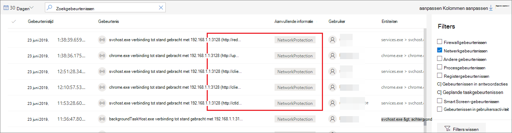
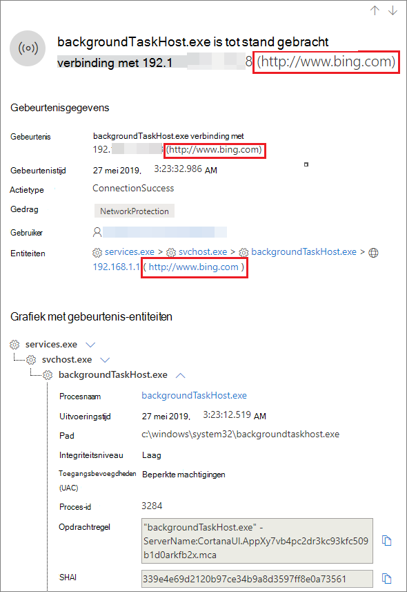

# <a name="investigate-connection-events-that-occur-behind-forward-proxies"></a><span data-ttu-id="2c9b6-104">Verbindingsgebeurtenissen onderzoeken die zich achter forward proxies voordoen</span><span class="sxs-lookup"><span data-stu-id="2c9b6-104">Investigate connection events that occur behind forward proxies</span></span>

[!INCLUDE [Microsoft 365 Defender rebranding](../../includes/microsoft-defender.md)]

<span data-ttu-id="2c9b6-105">**Van toepassing op:**</span><span class="sxs-lookup"><span data-stu-id="2c9b6-105">**Applies to:**</span></span>
- [<span data-ttu-id="2c9b6-106">Microsoft Defender voor Endpoint</span><span class="sxs-lookup"><span data-stu-id="2c9b6-106">Microsoft Defender for Endpoint</span></span>](https://go.microsoft.com/fwlink/p/?linkid=2154037)
- [<span data-ttu-id="2c9b6-107">Microsoft 365 Defender</span><span class="sxs-lookup"><span data-stu-id="2c9b6-107">Microsoft 365 Defender</span></span>](https://go.microsoft.com/fwlink/?linkid=2118804)

> <span data-ttu-id="2c9b6-108">Wilt u Defender voor Eindpunt ervaren?</span><span class="sxs-lookup"><span data-stu-id="2c9b6-108">Want to experience Defender for Endpoint?</span></span> [<span data-ttu-id="2c9b6-109">Meld u aan voor een gratis proefabonnement.</span><span class="sxs-lookup"><span data-stu-id="2c9b6-109">Sign up for a free trial.</span></span>](https://www.microsoft.com/microsoft-365/windows/microsoft-defender-atp?ocid=docs-wdatp-investigatemachines-abovefoldlink)

<span data-ttu-id="2c9b6-110">Defender voor Eindpunt ondersteunt netwerkverbindingsmonitoring vanaf verschillende niveaus van de netwerkstapel.</span><span class="sxs-lookup"><span data-stu-id="2c9b6-110">Defender for Endpoint supports network connection monitoring from different levels of the network stack.</span></span> <span data-ttu-id="2c9b6-111">Een lastig geval is dat het netwerk een doorgestuurde proxy gebruikt als gateway naar internet.</span><span class="sxs-lookup"><span data-stu-id="2c9b6-111">A challenging case is when the network uses a forward proxy as a gateway to the Internet.</span></span>

<span data-ttu-id="2c9b6-112">De proxy doet alsof deze het doel-eindpunt is.</span><span class="sxs-lookup"><span data-stu-id="2c9b6-112">The proxy acts as if it was the target endpoint.</span></span>  <span data-ttu-id="2c9b6-113">In deze gevallen controleren eenvoudige netwerkverbindingsmonitoren de verbindingen met de proxy die correct is, maar een lagere onderzoekswaarde heeft.</span><span class="sxs-lookup"><span data-stu-id="2c9b6-113">In these cases, simple network connection monitors will audit the connections with the proxy which is correct but has lower investigation value.</span></span> 

<span data-ttu-id="2c9b6-114">Defender for Endpoint ondersteunt geavanceerde HTTP-niveaucontrole via netwerkbeveiliging.</span><span class="sxs-lookup"><span data-stu-id="2c9b6-114">Defender for Endpoint supports advanced HTTP level monitoring through network protection.</span></span> <span data-ttu-id="2c9b6-115">Wanneer deze is ingeschakeld, wordt er een nieuw type gebeurtenis opgedoken waarin de echte doeldomeinnamen worden bekent.</span><span class="sxs-lookup"><span data-stu-id="2c9b6-115">When turned on, a new type of event is surfaced which exposes the real target domain names.</span></span>

## <a name="use-network-protection-to-monitor-network-connection-behind-a-firewall"></a><span data-ttu-id="2c9b6-116">Netwerkbeveiliging gebruiken om de netwerkverbinding achter een firewall te controleren</span><span class="sxs-lookup"><span data-stu-id="2c9b6-116">Use network protection to monitor network connection behind a firewall</span></span>
<span data-ttu-id="2c9b6-117">Het bewaken van de netwerkverbinding achter een doorgestuurde proxy is mogelijk vanwege extra netwerkgebeurtenissen die afkomstig zijn van netwerkbeveiliging.</span><span class="sxs-lookup"><span data-stu-id="2c9b6-117">Monitoring network connection behind a forward proxy is possible due to additional network events that originate from network protection.</span></span> <span data-ttu-id="2c9b6-118">Als u ze wilt zien op een apparaattijdlijn, schakelt u netwerkbeveiliging in (minimaal in de auditmodus).</span><span class="sxs-lookup"><span data-stu-id="2c9b6-118">To see them on a device timeline, turn network protection on (at the minimum in audit mode).</span></span> 

<span data-ttu-id="2c9b6-119">Netwerkbeveiliging kan worden beheerd met de volgende modi:</span><span class="sxs-lookup"><span data-stu-id="2c9b6-119">Network protection can be controlled using the following modes:</span></span>

- <span data-ttu-id="2c9b6-120">**Blokkeren**</span><span class="sxs-lookup"><span data-stu-id="2c9b6-120">**Block**</span></span> <br> <span data-ttu-id="2c9b6-121">Gebruikers of apps worden geblokkeerd om verbinding te maken met gevaarlijke domeinen.</span><span class="sxs-lookup"><span data-stu-id="2c9b6-121">Users or apps will be blocked from connecting to dangerous domains.</span></span> <span data-ttu-id="2c9b6-122">U kunt deze activiteit zien in het Microsoft Defender-beveiligingscentrum.</span><span class="sxs-lookup"><span data-stu-id="2c9b6-122">You will be able to see this activity in Microsoft Defender Security Center.</span></span>
- <span data-ttu-id="2c9b6-123">**Controle**</span><span class="sxs-lookup"><span data-stu-id="2c9b6-123">**Audit**</span></span> <br> <span data-ttu-id="2c9b6-124">Gebruikers of apps worden niet geblokkeerd om verbinding te maken met gevaarlijke domeinen.</span><span class="sxs-lookup"><span data-stu-id="2c9b6-124">Users or apps will not be blocked from connecting to dangerous domains.</span></span> <span data-ttu-id="2c9b6-125">U ziet deze activiteit echter nog steeds in het Microsoft Defender-beveiligingscentrum.</span><span class="sxs-lookup"><span data-stu-id="2c9b6-125">However, you will still see this activity in Microsoft Defender Security Center.</span></span>


<span data-ttu-id="2c9b6-126">Als u netwerkbeveiliging uitstijt, worden gebruikers of apps niet geblokkeerd om verbinding te maken met gevaarlijke domeinen.</span><span class="sxs-lookup"><span data-stu-id="2c9b6-126">If you turn network protection off, users or apps will not be blocked from connecting to dangerous domains.</span></span> <span data-ttu-id="2c9b6-127">U ziet geen netwerkactiviteit in het Microsoft Defender-beveiligingscentrum.</span><span class="sxs-lookup"><span data-stu-id="2c9b6-127">You will not see any network activity in Microsoft Defender Security Center.</span></span>

<span data-ttu-id="2c9b6-128">Als u het niet configureert, is netwerkblokkering standaard uitgeschakeld.</span><span class="sxs-lookup"><span data-stu-id="2c9b6-128">If you do not configure it, network blocking will be turned off by default.</span></span>

<span data-ttu-id="2c9b6-129">Zie Netwerkbeveiliging [inschakelen voor meer informatie.](enable-network-protection.md)</span><span class="sxs-lookup"><span data-stu-id="2c9b6-129">For more information, see [Enable network protection](enable-network-protection.md).</span></span>

## <a name="investigation-impact"></a><span data-ttu-id="2c9b6-130">Effect van onderzoek</span><span class="sxs-lookup"><span data-stu-id="2c9b6-130">Investigation impact</span></span>
<span data-ttu-id="2c9b6-131">Wanneer netwerkbeveiliging is ingeschakeld, ziet u dat op de tijdlijn van een apparaat het IP-adres de proxy blijft vertegenwoordigen, terwijl het echte doeladres wordt weergegeven.</span><span class="sxs-lookup"><span data-stu-id="2c9b6-131">When network protection is turned on, you'll see that on a device's timeline the IP address will keep representing the proxy, while the real target address shows up.</span></span>



<span data-ttu-id="2c9b6-133">Extra gebeurtenissen die door de netwerkbeveiligingslaag worden geactiveerd, zijn nu beschikbaar om de echte domeinnamen boven water te krijgen, zelfs achter een proxy.</span><span class="sxs-lookup"><span data-stu-id="2c9b6-133">Additional events triggered by the network protection layer are now available to surface the real domain names even behind a proxy.</span></span>

<span data-ttu-id="2c9b6-134">De gegevens van de gebeurtenis:</span><span class="sxs-lookup"><span data-stu-id="2c9b6-134">Event's information:</span></span>




## <a name="hunt-for-connection-events-using-advanced-hunting"></a><span data-ttu-id="2c9b6-136">Op zoek naar verbindingsgebeurtenissen met behulp van geavanceerde jacht</span><span class="sxs-lookup"><span data-stu-id="2c9b6-136">Hunt for connection events using advanced hunting</span></span> 
<span data-ttu-id="2c9b6-137">Alle nieuwe verbindingsgebeurtenissen zijn beschikbaar waar u ook op kunt jagen door middel van geavanceerde jacht.</span><span class="sxs-lookup"><span data-stu-id="2c9b6-137">All new connection events are available for you to hunt on through advanced hunting as well.</span></span> <span data-ttu-id="2c9b6-138">Aangezien deze gebeurtenissen verbindingsgebeurtenissen zijn, kunt u deze vinden onder de tabel DeviceNetworkEvents onder het `ConnecionSuccess` actietype.</span><span class="sxs-lookup"><span data-stu-id="2c9b6-138">Since these events are connection events, you can find them under the DeviceNetworkEvents table under the `ConnecionSuccess` action type.</span></span>

<span data-ttu-id="2c9b6-139">Met deze eenvoudige query ziet u alle relevante gebeurtenissen:</span><span class="sxs-lookup"><span data-stu-id="2c9b6-139">Using this simple query will show you all the relevant events:</span></span>

```
DeviceNetworkEvents
| where ActionType == "ConnectionSuccess" 
| take 10
```


<span data-ttu-id="2c9b6-141">U kunt ook gebeurtenissen filteren die betrekking hebben op de verbinding met de proxy zelf.</span><span class="sxs-lookup"><span data-stu-id="2c9b6-141">You can also filter out  events that are related to connection to the proxy itself.</span></span> 

<span data-ttu-id="2c9b6-142">Gebruik de volgende query om de verbindingen met de proxy te filteren:</span><span class="sxs-lookup"><span data-stu-id="2c9b6-142">Use the following query to filter out the connections to the proxy:</span></span>

```
DeviceNetworkEvents
| where ActionType == "ConnectionSuccess" and RemoteIP != "ProxyIP"  
| take 10
```


## <a name="related-topics"></a><span data-ttu-id="2c9b6-143">Verwante onderwerpen</span><span class="sxs-lookup"><span data-stu-id="2c9b6-143">Related topics</span></span>
- [<span data-ttu-id="2c9b6-144">Netwerkbeveiliging toepassen met GP - CSP-beleid</span><span class="sxs-lookup"><span data-stu-id="2c9b6-144">Applying network protection with GP - policy CSP</span></span>](https://docs.microsoft.com/windows/client-management/mdm/policy-csp-defender#defender-enablenetworkprotection)
