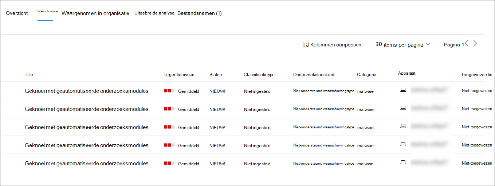
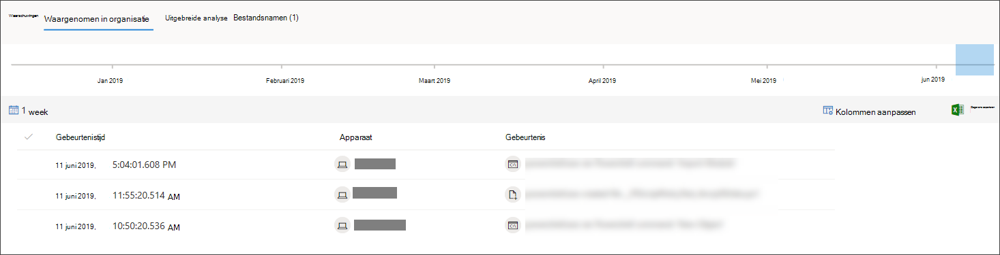

# Een bestand onderzoeken dat is gekoppeld aan een waarschuwing van Microsoft Defender voor eindpunt

[!INCLUDE [Microsoft 365 Defender rebranding](../../includes/microsoft-defender.md)]

**Van toepassing op:**
- [Microsoft Defender voor Eindpunt](https://go.microsoft.com/fwlink/p/?linkid=2154037)
- [Microsoft 365 Defender](https://go.microsoft.com/fwlink/?linkid=2118804)

>Wilt u Defender voor Eindpunt ervaren? [Meld u aan voor een gratis proefabonnement.](https://www.microsoft.com/microsoft-365/windows/microsoft-defender-atp?ocid=docs-wdatp-investigatefiles-abovefoldlink)

Onderzoek de details van een bestand dat is gekoppeld aan een specifieke waarschuwing, gedrag of gebeurtenis om te bepalen of het bestand schadelijke activiteiten vertoont, de motivatie van de aanval te identificeren en het mogelijke bereik van de inbreuk te begrijpen.

Er zijn veel manieren om toegang te krijgen tot de gedetailleerde profielpagina van een specifiek bestand. U kunt bijvoorbeeld de zoekfunctie gebruiken, op een koppeling klikken vanuit de processtructuur **Waarschuwing,** **Incidentgrafiek,** **Artefacttijdlijn** of een gebeurtenis selecteren die wordt weergegeven in de **apparaattijdlijn.**

Eenmaal op de gedetailleerde profielpagina kunt u schakelen tussen de nieuwe en oude pagina-indelingen door de nieuwe pagina **Bestand te wijzigen.** In de rest van dit artikel wordt de nieuwere pagina-indeling beschreven.

U kunt informatie krijgen uit de volgende secties in de bestandsweergave:

- Bestandsdetails, malwaredetectie, bestandsprepresenties
- Uitgebreide analyse
- Waarschuwingen
- Waargenomen in organisatie
- Uitgebreide analyse
- Bestandsnamen

U kunt ook actie ondernemen op een bestand vanaf deze pagina.

## Bestandsacties

Boven aan de profielpagina, boven de bestandsgegevenskaarten. Acties die u hier kunt uitvoeren zijn:

- Stoppen en in quarantaine plaatsen
- Indicator Toevoegen/bewerken
- Downloadbestand
- Contact opnemen met een risicodeskundige
- Actiecentrum

Zie Actie ondernemen voor een bestand voor meer [informatie over deze acties.](respond-file-alerts.md)

## Bestandsdetails, malwaredetectie en bestandsprevalentie

In de bestandsdetails, incidenten, malwaredetectie en bestandsprecierkaarten worden verschillende kenmerken van het bestand weergegeven.

U ziet details zoals de MD5 van het bestand, de detectieverhouding virustotaal en AV-detectie van Microsoft Defender indien beschikbaar, en de prevalentie van het bestand.

Op de kaart bestandsprevalentie ziet u waar het bestand is gezien op apparaten in de organisatie en wereldwijd. 

> [!NOTE] 
> Verschillende gebruikers zien mogelijk ongelijksoortige waarden in de apparaten *in de sectie* organisatie van de bestandsprevalentiekaart. Dit komt omdat op de kaart gegevens worden weergegeven op basis van het RBAC-bereik dat een gebruiker heeft. Dit betekent dat als een gebruiker zichtbaarheid heeft gekregen op een bepaalde set apparaten, hij of zij alleen de invloed van de organisatie van het bestand op deze apparaten ziet.

## Waarschuwingen

Het **tabblad** Waarschuwingen bevat een lijst met waarschuwingen die aan het bestand zijn gekoppeld. Deze lijst bevat veel van dezelfde informatie als de wachtrij Waarschuwingen, met uitzondering van de apparaatgroep, indien van het betreffende apparaat. U kunt kiezen welk soort informatie wordt weergegeven door kolommen **aanpassen te selecteren** op de werkbalk boven de kolomkoppen.

## Waargenomen in organisatie

Op **het tabblad Waargenomen in organisatie** kunt u een datumbereik opgeven om te zien welke apparaten met het bestand zijn waargenomen.

>[!NOTE]
>Op dit tabblad wordt een maximum aantal van 100 apparaten weergegeven. Als u _alle apparaten_ met het bestand wilt zien,  exporteert u het tabblad naar een CSV-bestand door Exporteren te selecteren in het actiemenu boven de kolomkoppen van het tabblad.

Gebruik de schuifregelaar of de bereik selector om snel een periode op te geven die u wilt controleren op gebeurtenissen met het bestand. U kunt een tijdvenster zo klein opgeven als één dag. Hierdoor kunt u alleen bestanden zien die op dat moment met dat IP-adres zijn gecommuniceerd, waardoor onnodig schuiven en zoeken drastisch wordt verkleind.

## Uitgebreide analyse

Op **het tabblad** Diepe analyse kunt u het bestand indienen voor uitgebreide analyse, om meer details over het gedrag van het bestand te ontdekken, evenals het effect dat het heeft binnen uw organisaties.  Nadat u het bestand hebt verzenden, wordt het uitgebreide analyserapport weergegeven op dit tabblad zodra de resultaten beschikbaar zijn. Als er niets is gevonden in een uitgebreide analyse, is het rapport leeg en blijft de resultatenruimte leeg.

## Bestandsnamen

Het **tabblad Bestandsnamen** bevat alle namen die het bestand heeft waargenomen om te gebruiken, binnen uw organisaties.

## Verwante onderwerpen

- [De wachtrij microsoft Defender voor eindpunten weergeven en ordenen](alerts-queue.md)
- [Waarschuwingen voor Microsoft Defender voor eindpunten beheren](manage-alerts.md)
- [Microsoft Defender onderzoeken voor eindpuntwaarschuwingen](investigate-alerts.md)
- [Apparaten onderzoeken in de lijst Microsoft Defender voor eindpuntapparaten](investigate-machines.md)
- [Een IP-adres onderzoeken dat is gekoppeld aan een waarschuwing van Microsoft Defender voor eindpunt](investigate-ip.md)
- [Een domein onderzoeken dat is gekoppeld aan een waarschuwing van Microsoft Defender voor eindpunt](investigate-domain.md)
- [Een gebruikersaccount onderzoeken in Microsoft Defender voor Eindpunt](investigate-user.md)
- [Acties ondernemen op een bestand](respond-file-alerts.md)
