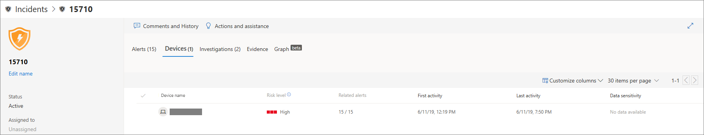
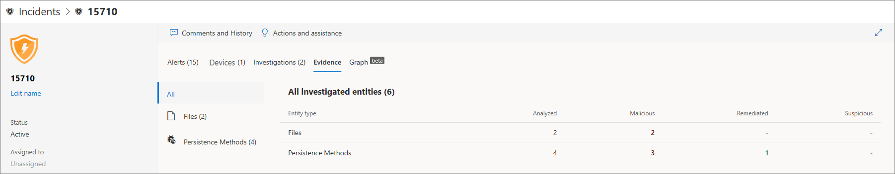

# Incidenten in Microsoft Defender voor Eindpunt onderzoeken

[!INCLUDE [Microsoft 365 Defender rebranding](../../includes/microsoft-defender.md)]

**Van toepassing op:**
- [Microsoft Defender voor Endpoint](https://go.microsoft.com/fwlink/p/?linkid=2146631)
- [Microsoft 365 Defender](https://go.microsoft.com/fwlink/?linkid=2118804)

Onderzoeken van incidenten die van invloed zijn op uw netwerk, begrijpen wat ze betekenen en bewijs verzamelen om deze op te lossen. 

Wanneer u een incident onderzoekt, ziet u:
- Details van incidenten
- Opmerkingen en acties bij incidenten
- Tabbladen (waarschuwingen, apparaten, onderzoeken, bewijs, grafiek)

> [!VIDEO https://www.microsoft.com/en-us/videoplayer/embed/RE4qLUV]

## Details van incidenten analyseren 
Klik op een incident om het **deelvenster Incident te bekijken.** Selecteer **De pagina Incident openen** om de incidentdetails en gerelateerde informatie (waarschuwingen, apparaten, onderzoeken, bewijs, grafiek) te bekijken. 

### Waarschuwingen
U kunt de waarschuwingen onderzoeken en zien hoe ze zijn gekoppeld in een incident. Waarschuwingen worden gegroepeerd in incidenten op basis van de volgende redenen:
- Geautomatiseerd onderzoek: het geautomatiseerde onderzoek heeft de gekoppelde waarschuwing geactiveerd tijdens het onderzoeken van de oorspronkelijke waarschuwing 
- Bestandskenmerken: de bestanden die aan de waarschuwing zijn gekoppeld, hebben vergelijkbare kenmerken
- Handmatig koppelen : een gebruiker heeft de waarschuwingen handmatig gekoppeld
- Tijd proximate - De waarschuwingen zijn binnen een bepaalde periode op hetzelfde apparaat geactiveerd
- Hetzelfde bestand: de bestanden die aan de waarschuwing zijn gekoppeld, zijn exact hetzelfde
- Dezelfde URL: de URL die de waarschuwing heeft geactiveerd, is exact hetzelfde

U kunt ook een waarschuwing beheren en metagegevens voor waarschuwingen bekijken, samen met andere informatie. Zie Waarschuwingen [onderzoeken voor meer informatie.](investigate-alerts.md) 

### Apparaten
U kunt ook de apparaten onderzoeken die deel uitmaken van of gerelateerd zijn aan een bepaald incident. Zie Apparaten [onderzoeken voor meer informatie.](investigate-machines.md)

### Onderzoeken
Selecteer **Onderzoeken om** alle automatische onderzoeken te bekijken die door het systeem zijn gestart in reactie op de incidentenwaarschuwingen.

## Door het bewijs heen gaan
Microsoft Defender voor Eindpunt onderzoekt automatisch alle door incidenten ondersteunde gebeurtenissen en verdachte entiteiten in de waarschuwingen, zodat u automatisch kunt reageren en informatie krijgt over de belangrijke bestanden, processen, services en meer. 

Elk van de geanalyseerde entiteiten wordt gemarkeerd als geïnfecteerd, gesaneerd of verdacht. 

## Bijbehorende cyberbeveiligingsdreigingen visualiseren 
Met Microsoft Defender voor Eindpunt worden de bedreigingsgegevens samengevoegd tot een incident, zodat u de patronen en correlaties kunt zien die afkomstig zijn van verschillende gegevenspunten. U kunt een dergelijke correlatie bekijken via de incidentgrafiek.

### Incidentgrafiek
The **Graph** vertelt het verhaal van de cyberbeveiligingsaanval. U ziet bijvoorbeeld wat het invoerpunt was, welke indicator voor compromissen of activiteit is waargenomen op welk apparaat. etc.

U kunt op de cirkels in de incidentgrafiek klikken om de details van de schadelijke bestanden, bijbehorende bestandsdetecties, hoeveel exemplaren er wereldwijd zijn geweest, of deze zijn waargenomen in uw organisatie, zo ja, hoeveel exemplaren.

## Verwante onderwerpen
- [Wachtrij incidenten](https://docs.microsoft.com/microsoft-365/security/defender-endpoint/view-incidents-queue)
- [Incidenten in Microsoft Defender voor Eindpunt onderzoeken](https://docs.microsoft.com/microsoft-365/security/defender-endpoint/investigate-incidents)
- [Microsoft Defender voor eindpuntincidenten beheren](https://docs.microsoft.com/microsoft-365/security/defender-endpoint/manage-incidents)
