# Apparaten onderzoeken in de lijst Microsoft Defender voor eindpuntapparaten

[!INCLUDE [Microsoft 365 Defender rebranding](../../includes/microsoft-defender.md)]

**Van toepassing op:**
- [Microsoft Defender voor Eindpunt](https://go.microsoft.com/fwlink/p/?linkid=2154037)
- [Microsoft 365 Defender](https://go.microsoft.com/fwlink/?linkid=2118804)

>Wilt u Defender voor Eindpunt ervaren? [Meld u aan voor een gratis proefabonnement.](https://www.microsoft.com/microsoft-365/windows/microsoft-defender-atp?ocid=docs-wdatp-investigatemachines-abovefoldlink)

Onderzoek de details van een waarschuwing die op een specifiek apparaat wordt opgehaald om andere gedragingen of gebeurtenissen te identificeren die mogelijk verband houden met de waarschuwing of het mogelijke bereik van de inbreuk.

> [!NOTE]
> Als onderdeel van het onderzoek- of antwoordproces kunt u een onderzoekspakket verzamelen vanaf een apparaat. Dit doet u als: [Onderzoekspakket van apparaten verzamelen.](https://docs.microsoft.com/microsoft-365/security/defender-endpoint/respond-machine-alerts#collect-investigation-package-from-devices)

U kunt op getroffen apparaten klikken wanneer u ze in de portal ziet om een gedetailleerd rapport over dat apparaat te openen. Getroffen apparaten worden in de volgende gebieden geïdentificeerd:

- [Lijst met apparaten](investigate-machines.md)
- [Waarschuwingenwachtrij](alerts-queue.md)
- [Dashboard beveiligingsbewerkingen](security-operations-dashboard.md)
- Elke afzonderlijke waarschuwing
- Weergave van afzonderlijke bestandsdetails
- Een ip-adres- of domeindetailweergave

Wanneer u een specifiek apparaat onderzoekt, ziet u:

- Apparaatdetails
- Reactieacties
- Tabbladen (overzicht, waarschuwingen, tijdlijn, beveiligingsaanbevelingen, softwarevoorraad, gevonden beveiligingslekken, ontbrekende KBs)
- Kaarten (actieve waarschuwingen, aangemelde gebruikers, beveiligingsbeoordeling)

## Apparaatdetails

De sectie apparaatdetails bevat informatie, zoals het domein, het besturingssysteem en de status van het apparaat. Als er een onderzoekspakket beschikbaar is op het apparaat, ziet u een koppeling waarmee u het pakket kunt downloaden.

## Reactieacties

Antwoordacties worden uitgevoerd boven aan een specifieke apparaatpagina en bevatten:

- Tags beheren
- Apparaat isoleren
- Het uitvoeren van apps beperken
- Antivirusscan uitvoeren
- Onderzoekspakket verzamelen
- Live-antwoordsessie starten
- Geautomatiseerd onderzoek starten
- Contact opnemen met een risicodeskundige
- Actiecentrum

U kunt antwoordacties uitvoeren in het actiecentrum, op een specifieke apparaatpagina of op een specifieke bestandspagina.

Zie Actie ondernemen op een apparaat voor meer informatie over het ondernemen van actie [op een apparaat.](respond-machine-alerts.md)

Zie [Gebruikersentiteiten onderzoeken voor meer informatie.](investigate-user.md)

## Tabbladen

De tabbladen bevatten relevante beveiligings- en preventiegegevens met betrekking tot het apparaat. Op elk tabblad kunt u de kolommen aanpassen die worden weergegeven door Kolommen **aanpassen te selecteren** op de balk boven de kolomkoppen.

### Overzicht
Op **het tabblad** Overzicht worden de kaarten [weergegeven](#cards) voor actieve waarschuwingen, aangemeld bij gebruikers en beveiligingsbeoordeling.

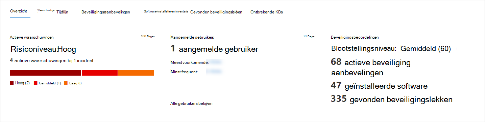

### Waarschuwingen

Het **tabblad** Waarschuwingen bevat een lijst met waarschuwingen die zijn gekoppeld aan het apparaat. Deze lijst is een gefilterde versie van de wachtrij Waarschuwingen en toont een korte beschrijving van de waarschuwing, ernst (hoog, gemiddeld, laag, informatief), status in de wachtrij (nieuw, in uitvoering, opgelost), classificatie (niet ingesteld, onwaar waarschuwing, waar waarschuwing), onderzoeksstatus, categorie van waarschuwing, wie de waarschuwing adresseert en laatste activiteit.  U kunt de waarschuwingen ook filteren.

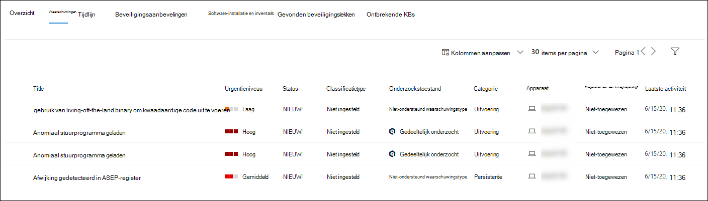

Wanneer het cirkelpictogram links van een waarschuwing is geselecteerd, wordt er een fly-out weergegeven. In dit deelvenster kunt u de waarschuwing beheren en meer details weergeven, zoals incidentnummer en gerelateerde apparaten. Er kunnen meerdere waarschuwingen tegelijk worden geselecteerd.

Als u een volledige paginaweergave van een waarschuwing wilt zien, inclusief incidentgrafiek en processtructuur, selecteert u de titel van de waarschuwing.

### Tijdlijn

Het **tabblad** Tijdlijn bevat een chronologische weergave van de gebeurtenissen en bijbehorende waarschuwingen die zijn waargenomen op het apparaat. Dit kan u helpen bij het correleren van gebeurtenissen, bestanden en IP-adressen ten opzichte van het apparaat.

Met de tijdlijn kunt u ook selectief inzoomen op gebeurtenissen die binnen een bepaalde periode hebben plaatsgevonden. U kunt de temporele volgorde bekijken van gebeurtenissen die zich hebben voorgedaan op een apparaat gedurende een geselecteerde periode. Als u de weergave verder wilt bepalen, kunt u filteren op gebeurtenisgroepen of de kolommen aanpassen.

>[!NOTE]
> Als u firewallgebeurtenissen wilt weergeven, moet u het controlebeleid inschakelen, zie [Verbinding auditfilterplatform](https://docs.microsoft.com/windows/security/threat-protection/auditing/audit-filtering-platform-connection).
>Firewall bestrijkt de volgende gebeurtenissen
>
>- [5025](https://docs.microsoft.com/windows/security/threat-protection/auditing/event-5025) - firewallservice gestopt
>- [5031](https://docs.microsoft.com/windows/security/threat-protection/auditing/event-5031) - toepassing die is geblokkeerd voor het accepteren van inkomende verbindingen in het netwerk
>- [5157](https://docs.microsoft.com/windows/security/threat-protection/auditing/event-5157) - geblokkeerde verbinding

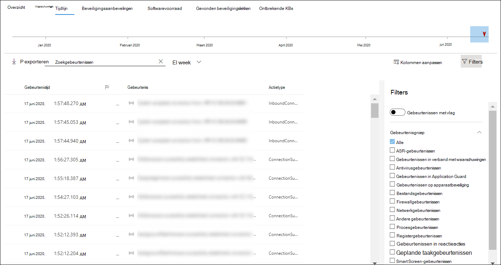

Enkele functies omvatten:

- Zoeken naar specifieke gebeurtenissen
  - Gebruik de zoekbalk om te zoeken naar specifieke tijdlijngebeurtenissen.
- Gebeurtenissen filteren vanaf een bepaalde datum
  - Selecteer het agendapictogram in de linkerbovenhoek van de tabel om gebeurtenissen weer te geven in de afgelopen dag, week, 30 dagen of aangepast bereik. De apparaattijdlijn is standaard ingesteld op het weergeven van de gebeurtenissen uit de afgelopen 30 dagen.
  - Gebruik de tijdlijn om naar een bepaald moment in de tijd te gaan door de sectie te markeren. De pijlen op de tijdlijn wijzen geautomatiseerde onderzoeken aan
- Gedetailleerde apparaattijdlijngebeurtenissen exporteren
  - Exporteert de apparaattijdlijn voor de huidige datum of een opgegeven datumbereik tot zeven dagen.

Meer informatie over bepaalde gebeurtenissen vindt u in de **sectie Aanvullende** informatie. Deze details variëren afhankelijk van het type gebeurtenis, bijvoorbeeld: 

- Ingesloten door Application Guard : de webbrowsergebeurtenis is beperkt door een geïsoleerde container
- Actieve bedreiging gedetecteerd: de detectie van bedreigingen vond plaats terwijl de bedreiging werd uitgevoerd
- Herstel mislukt: een poging om de gedetecteerde bedreiging te herstellen is aangeroepen, maar is mislukt
- Herstel is gelukt: de gedetecteerde bedreiging is gestopt en opgeruimd
- Waarschuwing overgeslagen door gebruiker: de Waarschuwing voor SmartScreen van Windows Defender is door een gebruiker afgewezen en overgenomen
- Verdacht script gedetecteerd : er is een mogelijk schadelijk script gevonden dat werd uitgevoerd
- De waarschuwingscategorie: als de gebeurtenis heeft geleid tot het genereren van een waarschuwing, wordt de waarschuwingscategorie ("Zijbeweging", bijvoorbeeld) verstrekt

#### Gebeurtenisdetails
Selecteer een gebeurtenis om relevante details over die gebeurtenis weer te geven. Er wordt een deelvenster weergegeven om algemene gebeurtenisgegevens weer te geven. Wanneer dit van toepassing is en gegevens beschikbaar zijn, wordt ook een grafiek weergegeven met gerelateerde entiteiten en hun relaties.

Als u de gebeurtenis en gerelateerde gebeurtenissen verder wilt controleren, kunt u snel een geavanceerde [query](advanced-hunting-overview.md) uitvoeren door Hunt te selecteren **voor gerelateerde gebeurtenissen.** De query retournoemt de geselecteerde gebeurtenis en de lijst met andere gebeurtenissen die rond dezelfde tijd op hetzelfde eindpunt hebben plaatsgevonden.

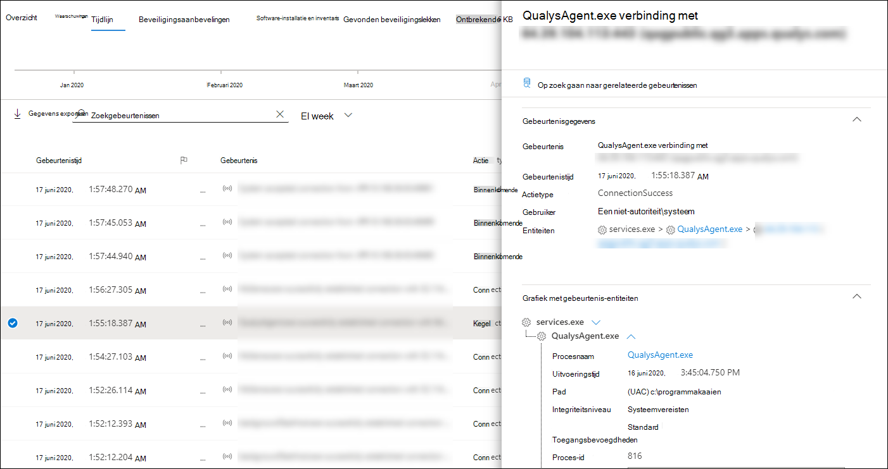

### Beveiligingsaanbevelingen

**Beveiligingsaanbevelingen** worden gegenereerd vanuit Microsoft Defender voor de mogelijkheid & [beveiligingsprobleembeheer](tvm-dashboard-insights.md) van Endpoint. Als u een aanbeveling selecteert, wordt een deelvenster weergegeven waarin u relevante details kunt bekijken, zoals een beschrijving van de aanbeveling en de mogelijke risico's die samenhangen met het niet-bepalen van de aanbeveling. Zie [Beveiligingsaanbeveling](tvm-security-recommendation.md) voor meer informatie.

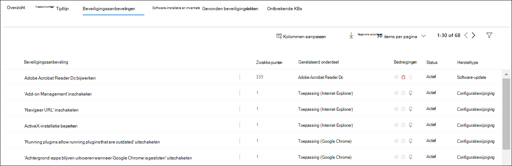

### Software-inventaris

Op **het tabblad Softwarevoorraad** kunt u software op het apparaat bekijken, samen met eventuele zwakke punten of bedreigingen. Als u de naam van de software selecteert, gaat u naar de pagina met softwaredetails waar u beveiligingsaanbevelingen, gevonden beveiligingsproblemen, geïnstalleerde apparaten en versiedistributie kunt bekijken. Zie [Softwarevoorraad voor](tvm-software-inventory.md) meer informatie

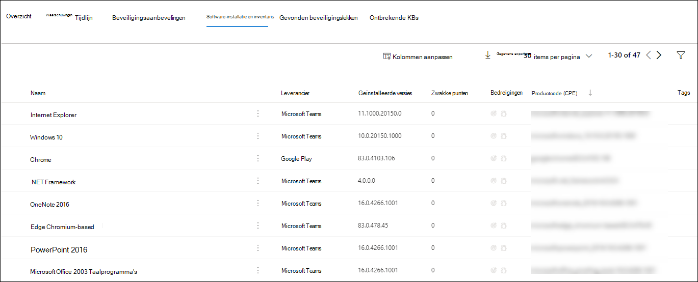

### Gevonden beveiligingslekken

Het **tabblad Gevonden beveiligingslekken** toont de naam, ernst en bedreigingsinzichten van gevonden beveiligingslekken op het apparaat. Als u specifieke beveiligingslekken selecteert, worden een beschrijving en details weergegeven.

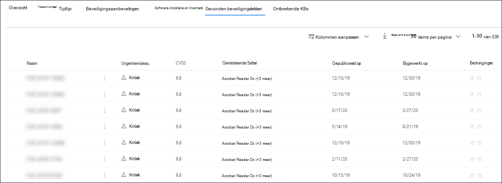

### Ontbrekende KBs
Het **tabblad Ontbrekende KBs** bevat de ontbrekende beveiligingsupdates voor het apparaat.

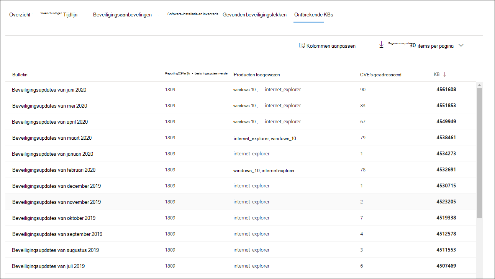

## Kaarten

### Actieve waarschuwingen

De **Azure Advanced Threat Protection-kaart** geeft een overzicht van waarschuwingen op hoog niveau met betrekking tot het apparaat en het risiconiveau, als u de microsoft Defender voor identiteitsfunctie hebt ingeschakeld en er actieve waarschuwingen zijn. Meer informatie vindt u in de inzooming 'Waarschuwingen'.

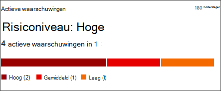

>[!NOTE]
>U moet de integratie inschakelen op zowel Microsoft Defender voor identiteit als Defender voor Eindpunt om deze functie te kunnen gebruiken. In Defender voor Eindpunt kunt u deze functie inschakelen in geavanceerde functies. Zie Geavanceerde functies inschakelen voor meer informatie over het inschakelen van [geavanceerde functies.](advanced-features.md)

### Aangemelde gebruikers

Op **de kaart Aangemelde gebruikers** ziet u hoeveel gebruikers zich de afgelopen 30 dagen hebben aangemeld, samen met de meest en minst frequente gebruikers. Als u de koppeling 'Alle gebruikers weergeven' selecteert, wordt het detailvenster geopend, waarin informatie wordt weergegeven, zoals het type gebruiker, het type aanmelden en wanneer de gebruiker voor het eerst en voor het laatst is gezien. Zie [Gebruikersentiteiten onderzoeken voor meer informatie.](investigate-user.md)

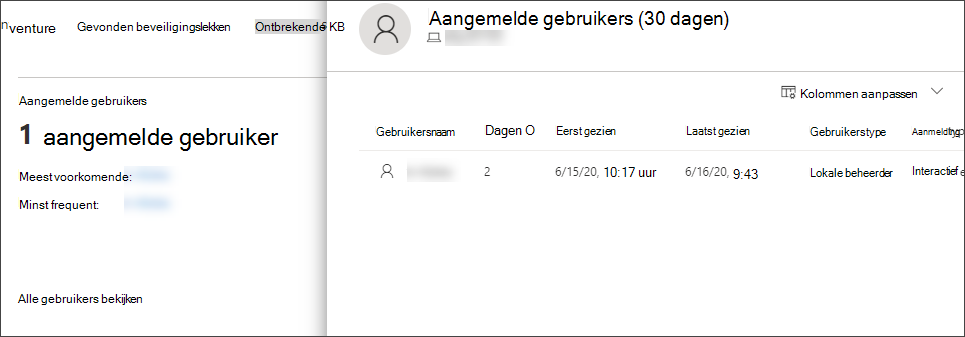

### Beveiligingsbeoordelingen

De **kaart Beveiligingsbeoordelingen** toont het algehele blootstellingsniveau, beveiligingsaanbevelingen, geïnstalleerde software en ontdekte beveiligingsproblemen. Het blootstellingsniveau van een apparaat wordt bepaald door de cumulatieve impact van de beveiligingsaanbevelingen in behandeling.

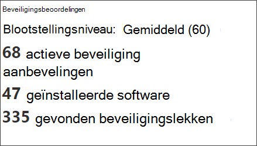

## Verwante onderwerpen

- [De wachtrij waarschuwingen voor Microsoft Defender voor eindpunten weergeven en ordenen](alerts-queue.md)
- [Waarschuwingen voor Microsoft Defender voor eindpunten beheren](manage-alerts.md)
- [Microsoft Defender onderzoeken voor eindpuntwaarschuwingen](investigate-alerts.md)
- [Een bestand onderzoeken dat is gekoppeld aan een waarschuwing van Defender voor eindpunt](investigate-files.md)
- [Een IP-adres onderzoeken dat is gekoppeld aan een waarschuwing van Defender voor eindpunt](investigate-ip.md)
- [Een domein onderzoeken dat is gekoppeld aan een waarschuwing van Defender voor eindpunt](investigate-domain.md)
- [Een gebruikersaccount onderzoeken in Defender voor Eindpunt](investigate-user.md)
- [Beveiligingsaanbeveling](tvm-security-recommendation.md)
- [Software-inventaris](tvm-software-inventory.md)
