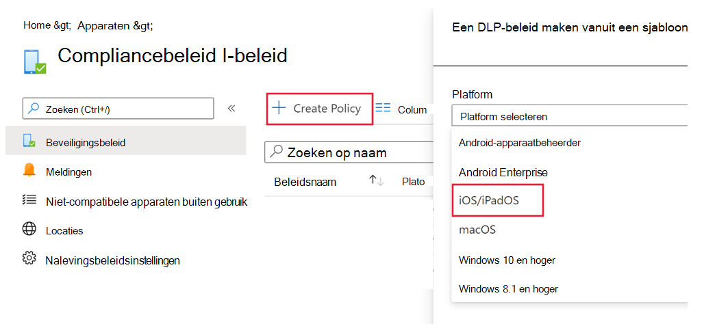
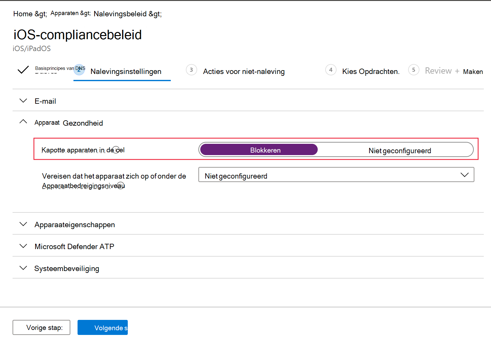
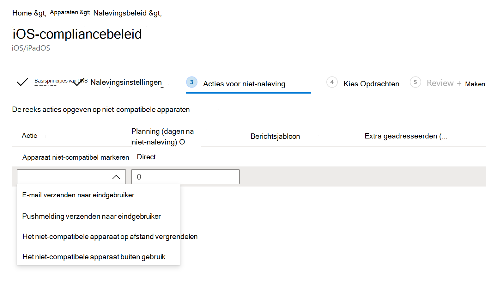

# Microsoft Defender configureren voor endpoint voor iOS-functiesConfigure Microsoft Defender for Endpoint for iOS features

[!INCLUDE [Microsoft 365 Defender rebranding](../../includes/microsoft-defender.md)]

**Van toepassing op:****Applies to:**
- [Microsoft Defender voor EndpointMicrosoft Defender for Endpoint](https://go.microsoft.com/fwlink/p/?linkid=2154037)
- [Microsoft 365 DefenderMicrosoft 365 Defender](https://go.microsoft.com/fwlink/?linkid=2118804)

> Wilt u Defender voor Eindpunt ervaren?Want to experience Defender for Endpoint? [Meld u aan voor een gratis proefabonnement.Sign up for a free trial.](https://www.microsoft.com/microsoft-365/windows/microsoft-defender-atp?ocid=docs-wdatp-exposedapis-abovefoldlink) 

> [!NOTE]
> Defender voor Eindpunt voor iOS zou een VPN gebruiken om de functie Webbeveiliging te bieden.Defender for Endpoint for iOS would use a VPN in order to provide the Web Protection feature. Dit is geen gewone VPN en is een lokale/self-looping VPN die geen verkeer buiten het apparaat neemt.This is not a regular VPN and is a local/self-looping VPN that does not take traffic outside the device.

## Voorwaardelijke toegang met Defender voor eindpunt voor iOSConditional Access with Defender for Endpoint for iOS  
Microsoft Defender voor Eindpunt voor iOS, samen met Microsoft Intune en Azure Active Directory, maakt het afdwingen van apparaat compliance en beleid voor voorwaardelijke toegang mogelijk op basis van apparaatrisiconiveaus.Microsoft Defender for Endpoint for iOS along with Microsoft Intune and Azure Active Directory enables enforcing Device compliance and Conditional Access policies based on device risk levels. Defender for Endpoint is een MTD-oplossing (Mobile Threat Defense) die u kunt implementeren om gebruik te maken van deze mogelijkheid via Intune.Defender for Endpoint is a Mobile Threat Defense (MTD) solution that you can deploy to leverage this capability via Intune.

Zie Defender voor Eindpunt en [Intune](https://docs.microsoft.com/mem/intune/protect/advanced-threat-protection)voor meer informatie over het instellen van Voorwaardelijke toegang met Defender voor eindpunt voor iOS.For more information about how to set up Conditional Access with Defender for Endpoint for iOS, see [Defender for Endpoint and Intune](https://docs.microsoft.com/mem/intune/protect/advanced-threat-protection).

## Webbeveiliging en VPNWeb Protection and VPN

Defender voor Eindpunt voor iOS bevat standaard de functie voor webbeveiliging en schakelt deze in.By default, Defender for Endpoint for iOS includes and enables the web protection feature. [Webbeveiliging helpt](web-protection-overview.md) om apparaten te beveiligen tegen webbedreigingen en gebruikers te beschermen tegen phishingaanvallen.[Web protection](web-protection-overview.md) helps to secure devices against web threats and protect users from phishing attacks. Defender voor Endpoint voor iOS gebruikt een VPN om deze beveiliging te bieden.Defender for Endpoint for iOS uses a VPN in order to provide this protection. Let op: dit is een lokale VPN en in tegenstelling tot traditionele VPN wordt netwerkverkeer niet buiten het apparaat verzonden.Please note this is a local VPN and unlike traditional VPN, network traffic is not sent outside the device.

Hoewel deze standaard is ingeschakeld, zijn er mogelijk bepaalde gevallen waarvoor u VPN moet uitschakelen.While enabled by default, there might be some cases that require you to disable VPN. U wilt bijvoorbeeld bepaalde apps uitvoeren die niet werken wanneer een VPN is geconfigureerd.For example, you want to run some apps that do not work when a VPN is configured. In dergelijke gevallen kunt u ervoor kiezen om VPN uit te schakelen vanuit de app op het apparaat door de onderstaande stappen uit te voeren:In such cases, you can choose to disable VPN from the app on the device by following the steps below:

1. Open de app Instellingen  op uw iOS-apparaat, klik of tik **op Algemeen** en vervolgens **op VPN.**On your iOS device, open the **Settings** app, click or tap **General** and then **VPN**.
1. Klik of tik op de knop 'i' voor Microsoft Defender ATP.Click or tap the "i" button for Microsoft Defender ATP.
1. Schakel Verbinding maken **op aanvraag uit om** VPN uit te schakelen.Toggle off **Connect On Demand** to disable VPN.

    > [!div class="mx-imgBorder"]
    > 

> [!NOTE]
> Webbeveiliging is niet beschikbaar wanneer VPN is uitgeschakeld.Web Protection will not be available when VPN is disabled. Als u Webbeveiliging opnieuw wilt inschakelen, opent u de Microsoft Defender voor Eindpunt-app op het apparaat en klikt of tikt u op **Start VPN**.To re-enable Web Protection, open the Microsoft Defender for Endpoint app on the device and click or tap **Start VPN**.

## Co-bestaan van meerdere VPN-profielenCo-existence of multiple VPN profiles

Apple iOS biedt geen ondersteuning voor meerdere VPN's voor het hele apparaat om tegelijk actief te zijn.Apple iOS does not support multiple device-wide VPNs to be active simultaneously. Hoewel er meerdere VPN-profielen op het apparaat kunnen bestaan, kan er slechts één VPN tegelijk actief zijn.While multiple VPN profiles can exist on the device, only one VPN can be active at a time.

## Compliancebeleid configureren voor jailbroken apparatenConfigure compliance policy against jailbroken devices

Om ervoor te zorgen dat bedrijfsgegevens niet worden gebruikt op iOS-apparaten met een jailbroken, raden we u aan het volgende compliancebeleid in te stellen op Intune.To protect corporate data from being accessed on jailbroken iOS devices, we recommend that you set up the following compliance policy on Intune.

> [!NOTE]
> Op dit moment biedt Microsoft Defender voor Endpoint voor iOS geen bescherming tegen jailbreakscenario's.At this time Microsoft Defender for Endpoint for iOS does not provide protection against jailbreak scenarios. Als het apparaat wordt gebruikt op een jailbroken apparaat, kunnen in specifieke scenario's gegevens die door de toepassing worden gebruikt, zoals uw bedrijfs-e-mail-id en bedrijfsprofielafbeelding (indien beschikbaar), lokaal worden getoond.If used on a jailbroken device, then in specific scenarios data that is used by the application like your corporate email id and corporate profile picture (if available) can be exposed locally

Volg de onderstaande stappen om een compliancebeleid te maken tegen jailbroken apparaten.Follow the steps below to create a compliance policy against jailbroken devices.

1. Ga [in het Microsoft Endpoint Manager-beheercentrum](https://go.microsoft.com/fwlink/?linkid=2109431)naar Beleid voor naleving van   ->  **apparaten**  ->  **Beleid maken.**In [Microsoft Endpoint Manager admin center](https://go.microsoft.com/fwlink/?linkid=2109431), go to **Devices** -> **Compliance policies** -> **Create Policy**. Selecteer 'iOS/iPadOS' als platform en klik op **Maken.**Select "iOS/iPadOS" as platform and click **Create**.

    > [!div class="mx-imgBorder"]
    > 

2. Geef een naam op van het beleid, bijvoorbeeld 'Compliancebeleid voor jailbreak'.Specify a name of the policy, for example "Compliance Policy for Jailbreak".
3. Klik op de pagina nalevingsinstellingen op om de sectie **Apparaattoestand** uit te vouwen en klik **op Blokkeren** voor **jailbroken apparaten.**In the compliance settings page, click to expand **Device Health** section and click **Block** for **Jailbroken devices** field.

    > [!div class="mx-imgBorder"]
    > 

4. Selecteer in *de sectie Actie voor niet-naleving* de acties volgens uw vereisten en selecteer **Volgende.**In the *Action for noncompliance* section, select the actions as per your requirements and select **Next**.

    > [!div class="mx-imgBorder"]
    > 

5. Selecteer in *de sectie* Opdrachten de gebruikersgroepen die u wilt opnemen voor dit beleid en selecteer **vervolgens Volgende**.In the *Assignments* section, select the user groups that you want to include for this policy and then select **Next**.
6. Controleer in **de sectie Controleren+Maken** of alle ingevoerde gegevens juist zijn en selecteer vervolgens **Maken.**In the **Review+Create** section, verify that all the information entered is correct and then select **Create**.

## Aangepaste indicatoren configurerenConfigure custom indicators

Met Defender voor Eindpunt voor iOS kunnen beheerders ook aangepaste indicatoren configureren op iOS-apparaten.Defender for Endpoint for iOS enables admins to configure custom indicators on iOS devices as well. Zie Indicatoren beheren voor meer informatie over het configureren van aangepaste [indicatoren.](https://docs.microsoft.com/microsoft-365/security/defender-endpoint/manage-indicators)For more information on how to configure custom indicators, see [Manage indicators](https://docs.microsoft.com/microsoft-365/security/defender-endpoint/manage-indicators).

> [!NOTE]
> Defender voor Eindpunt voor iOS ondersteunt het maken van aangepaste indicatoren alleen voor IP-adressen en URL's/domeinen.Defender for Endpoint for iOS supports creating custom indicators only for IP addresses and URLs/domains.

## Onveilige site rapporterenReport unsafe site

Phishingwebsites doen zich voor als betrouwbare websites om uw persoonlijke of financiële gegevens te verkrijgen.Phishing websites impersonate trustworthy websites for the purpose of obtaining your personal or financial information. Ga naar [de pagina Feedback geven over netwerkbeveiliging](https://www.microsoft.com/wdsi/filesubmission/exploitguard/networkprotection) als u een website wilt rapporteren die een phishingsite kan zijn.Visit the [Provide feedback about network protection](https://www.microsoft.com/wdsi/filesubmission/exploitguard/networkprotection) page if you want to report a website that could be a phishing site.
